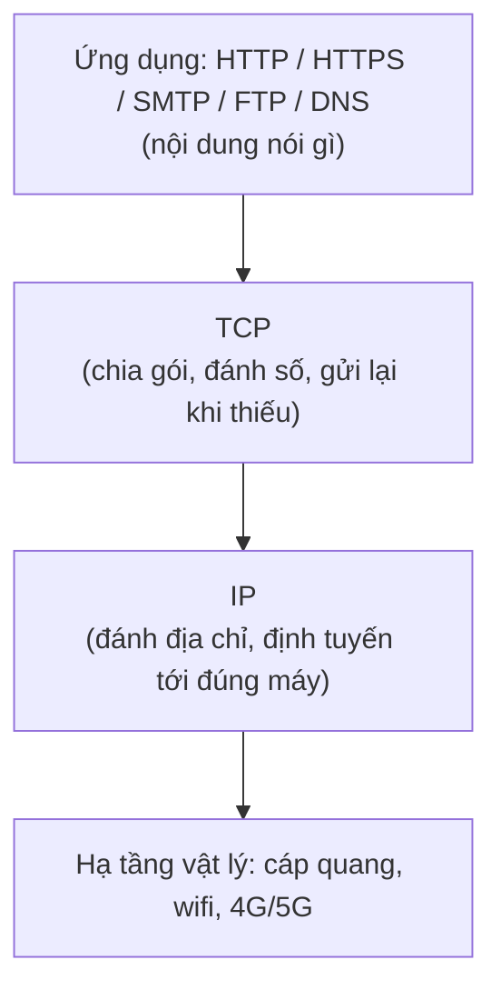

# Internet hoạt động ra sao?

Trước khi viết backend, bạn cần hiểu Internet vận hành thế nào: máy tính nói chuyện với nhau qua IP và các giao thức như HTTP/HTTPS, tên miền được phân giải thành IP nhờ DNS, và web app được đặt ở đâu đó (hosting) để mọi người truy cập. Bài này giải thích các khái niệm nền tảng đó cùng cách trình duyệt tải một trang web, giúp bạn debug và tối ưu backend tốt hơn về sau.

[](pathname:///img/backend/internet-basics.webp)

---

:::note[Ghi nhớ nhanh]

- ⭐ **Internet chạy trên `TCP/IP`** — mỗi máy có `IP` riêng, giao tiếp qua các protocol như HTTP, FTP, SMTP, DNS.
- ⭐ **`HTTPS = HTTP + TLS`** — bắt buộc ở production để chống nghe lén và giả mạo dữ liệu.
- **`DNS` phân giải tên miền thành IP** — theo chuỗi cache OS → resolver → root → TLD → authoritative server.
- **Hosting có nhiều loại** — shared, VPS, cloud, PaaS, serverless; xu hướng 2026 là PaaS + Serverless (khỏi lo ops).
- **Hiểu luồng browser tải trang** (DNS → TCP → TLS → request → render) giúp tối ưu backend: TTFB, compression, cookie nhỏ.

:::

---

## Mục lục

- [Internet là gì?](#internet-là-gì)
- [HTTP / HTTPS](#http--https)
- [Domain Name và DNS](#domain-name-và-dns)
- [Hosting](#hosting)
- [Browser hoạt động ra sao?](#browser-hoạt-động-ra-sao)
- [Câu hỏi phỏng vấn](#câu-hỏi-phỏng-vấn)

---

## Internet là gì?

**Internet** = mạng lưới toàn cầu của các máy tính kết nối qua **TCP/IP**.
Mỗi máy có **IP address** duy nhất, giao tiếp với nhau qua các **protocol**.

Câu trên rất cô đọng, hãy tách ra từng ý:

### Internet không phải một "cái máy chủ khổng lồ"

Internet chỉ là **rất nhiều máy tính nối với nhau** (cáp quang, wifi, 4G/5G, cáp biển...) tạo thành mạng lưới phủ toàn cầu.

Vấn đề: máy bạn ở Việt Nam, server Google ở Mỹ, hai máy khác hãng, khác hệ điều hành — làm sao "hiểu" nhau? Phải có **ngôn ngữ chung**, và ngôn ngữ chung đó là **TCP/IP**.

### IP address — "địa chỉ nhà" của mỗi máy

Ví dụ đời thường: **hệ thống bưu điện**. Muốn gửi thư cho ai, bạn cần **địa chỉ nhà** của họ. Hai nhà trùng địa chỉ thì bưu tá không biết giao cho ai.

Trên Internet, "địa chỉ nhà" chính là **IP address** — ví dụ `142.250.196.14` (Google) hay `93.184.216.34`. Máy nào cũng phải có IP thì dữ liệu mới biết đường tìm tới.

:::tip[Thực tế]
Laptop/điện thoại trong nhà bạn dùng IP nội bộ kiểu `192.168.1.5`, cả nhà đi ra Internet chung 1 IP công cộng do nhà mạng cấp — giống như cả chung cư dùng chung 1 địa chỉ đường phố, còn số căn hộ là IP nội bộ.
:::

### TCP và IP khác nhau chỗ nào?

Vẫn ví dụ bưu điện: bạn gửi một **quyển sách 100 trang** sang Mỹ, nhưng bưu điện chỉ cho gửi mỗi phong bì 1 trang.

| Thành phần | Việc nó làm | Tương ứng ở bưu điện |
| --- | --- | --- |
| **IP** (Internet Protocol) | Đánh địa chỉ gói tin và định tuyến qua các trạm trung chuyển để tới đúng máy đích | Ghi địa chỉ lên phong bì, bưu tá chuyển qua từng bưu cục |
| **TCP** (Transmission Control Protocol) | Cắt dữ liệu lớn thành gói nhỏ, đánh số thứ tự, kiểm tra đủ/thiếu, gửi lại gói lỗi, ghép lại đúng thứ tự | Đánh số "trang 1/100", "trang 2/100"...; thiếu trang 37 thì báo gửi lại |

Điểm mấu chốt: **IP không đảm bảo gói tin đến nơi**, nó chỉ cố gắng chuyển đi. Việc kiểm tra đủ/thiếu/đúng thứ tự là của **TCP**. Vì luôn đi cùng nhau nên người ta gọi chung là "TCP/IP".

### Protocol — bộ quy tắc chung để hai bên hiểu nhau

**Protocol (giao thức)** = bộ quy tắc thỏa thuận trước giữa hai bên. Giống như khi nghe điện thoại, người Việt mặc định nói "A lô?" trước rồi bên kia mới nói tiếp — ai cũng làm theo thì cuộc gọi trôi chảy.

TCP/IP chỉ lo **vận chuyển dữ liệu tới đúng máy**. Còn *nội dung* bên trong là gì — trang web? email? file? — thì cần protocol ở tầng trên quy định:

- **HTTP/HTTPS** — trình duyệt xin trang web từ server. Kiểu: "cho tôi xin `/products`" → server trả `200 OK` kèm HTML.
- **SMTP** — gửi email.
- **FTP** — truyền file.
- **DNS** — hỏi "`google.com` có IP là gì?".

Tất cả đều **chạy bên trên TCP/IP**: bưu điện (TCP/IP) lo chuyển phong bì tới đúng nhà, còn *bên trong phong bì viết theo mẫu nào* thì tùy loại giấy tờ (HTTP, SMTP, FTP...).



### Tóm lại

> Internet là mạng máy tính toàn cầu. Muốn nói chuyện được, mỗi máy cần một **địa chỉ (IP)**, cần cơ chế **vận chuyển tin cậy (TCP)**, và cần **quy tắc chung cho từng loại hội thoại (protocol: HTTP, SMTP, FTP, DNS...)**.

---

## HTTP / HTTPS

**HTTP (HyperText Transfer Protocol)** — giao thức request/response cho web. Nhược điểm: dữ liệu truyền dạng văn bản thô, dễ bị đọc lén.


**HTTPS (HTTP Secure)** = HTTP + **TLS encryption** — chống nghe lén, tamper. Bắt buộc
trong production.

---

## Domain Name và DNS

**Domain Name** = tên dễ nhớ thay IP (`example.com` thay `93.184.216.34`).

Phân cấp:

```
.com               → TLD (top-level domain)
example.com        → second-level (mua từ registrar)
www.example.com    → subdomain
api.example.com    → subdomain
```

**DNS (Domain Name System)** — phân giải tên thành IP.

Flow khi vào `example.com`:

```
1. Browser hỏi OS local cache.
2. OS hỏi resolver (ISP hoặc 1.1.1.1, 8.8.8.8).
3. Resolver hỏi Root server → ".com" TLD server.
4. TLD hỏi authoritative server của example.com.
5. Trả IP về.
6. Browser kết nối IP đó.
```


---

## Hosting

**Hosting** = nơi đặt server để app accessible từ internet.

Loại:

| Loại | Giá | Use case |
|------|-----|---------|
| **Shared hosting** | Rẻ | Static site nhỏ |
| **VPS** | Vừa | App vừa, control hệ thống |
| **Dedicated server** | Đắt | High-traffic, compliance |
| **Cloud (AWS, GCP, Azure)** | Variable | Scale linh hoạt |
| **PaaS** (Vercel, Render, Fly.io) | Variable | App-focused, no ops |
| **Serverless** (Lambda, Vercel Functions) | Pay-per-use | Spike traffic |

Năm 2026, **PaaS + Serverless** là xu hướng — focus code, ops do platform handle.

---

## Browser hoạt động ra sao?

Khi nhập URL vào browser:

```
1. Parse URL (protocol, domain, path).
2. DNS lookup → IP.
3. TCP handshake với server (3-way).
4. TLS handshake (nếu HTTPS).
5. Gửi HTTP request.
6. Nhận response (HTML).
7. Parse HTML → DOM tree.
8. Parse CSS → CSSOM.
9. Combine → Render tree.
10. Layout (geometry).
11. Paint (pixels).
12. Compositing (layers).
13. Execute JavaScript (parse + compile + run).
14. Repeat for dependencies (CSS, JS, images).
```

:::info[Phân tích]

**Hiểu browser flow giúp backend optimize**:

- **TTFB (Time to First Byte)** — server response time. Optimize: cache,
  CDN, database query.
- **Resource hint**: `<link rel="preconnect">`, `dns-prefetch`, `preload`.
- **Compression**: gzip/brotli giảm 70-80% size text.
- **HTTP/2 Server Push** (deprecated, dùng `<link rel="preload">` thay).
- **Cookie size**: limit ~4KB, gửi mọi request → giữ nhỏ.

Backend không chỉ là "trả JSON" — cách trả ảnh hưởng frontend
performance trực tiếp.

:::

:::tip[Mẹo]

**Kiến thức nền tảng cần thiết cho backend dev**:

1. **TCP vs UDP** — TCP reliable, UDP fast (DNS, video).
2. **Ports** — well-known (80, 443, 22, 5432).
3. **NAT, Firewall** — public IP vs private IP.
4. **VPN, Proxy** — qua middleman.
5. **REST principles** — chuẩn API web.
6. **JSON, XML, Form data** — format truyền.
7. **Status codes** — biết ý nghĩa, dùng đúng.

Không cần master ngay — học khi gặp. Nhưng nắm khái niệm để debug được
khi network issue.

:::

---

## Câu hỏi phỏng vấn

Những câu thường gặp về chủ đề này. Tự trả lời trước, rồi đối chiếu lại với nội dung phía trên.

1. Điều gì xảy ra từ lúc bạn gõ `google.com` vào trình duyệt cho tới khi trang hiện ra?
2. `TCP` và `IP` khác nhau ở chỗ nào — mỗi giao thức chịu trách nhiệm phần việc gì?
3. Mô tả `three-way handshake` của TCP (`SYN` → `SYN-ACK` → `ACK`). Vì sao phải mất 3 bước?
4. TCP khác `UDP` thế nào? Trường hợp nào nên chọn UDP dù nó không đảm bảo dữ liệu tới nơi?
5. DNS phân giải một tên miền theo trình tự nào? Kể từ cache của máy bạn cho tới authoritative server.
6. Các loại DNS record `A`, `AAAA`, `CNAME`, `MX`, `TXT` dùng để làm gì?
7. `TTL` trong DNS là gì, và vì sao đổi bản ghi DNS thường không có hiệu lực ngay lập tức?
8. HTTPS khác HTTP ở điểm nào? `TLS handshake` diễn ra ra sao và chứng chỉ do `CA` cấp giải quyết vấn đề gì?
9. HTTP là `stateless` nghĩa là gì? Vậy website nhớ được bạn đã đăng nhập bằng cách nào?
10. Phân biệt HTTP/1.1, HTTP/2 và HTTP/3. HTTP/2 khắc phục được hạn chế nào của HTTP/1.1?
11. Ý nghĩa của các nhóm status code `2xx`/`3xx`/`4xx`/`5xx`? Phân biệt `401` với `403`, `301` với `302`.
12. Domain, subdomain và TLD khác nhau ra sao? Registrar đóng vai trò gì?
13. So sánh các hình thức hosting: shared, VPS, cloud, PaaS, serverless. Khi nào chọn cái nào?
14. Trình duyệt dựng một trang web qua những bước nào (DOM, CSSOM, render tree, layout, paint)?
15. `TTFB` là gì và backend có thể làm gì để cải thiện chỉ số này?
