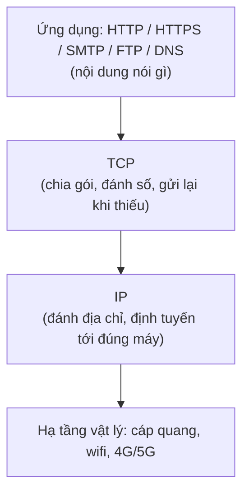

# Internet hoạt động ra sao?

Trước khi viết backend, bạn cần hiểu Internet vận hành thế nào: máy tính nói chuyện với nhau qua IP và các giao thức như HTTP/HTTPS, tên miền được phân giải thành IP nhờ DNS, và web app được đặt ở đâu đó (hosting) để mọi người truy cập. Bài này giải thích các khái niệm nền tảng đó cùng cách trình duyệt tải một trang web, giúp bạn debug và tối ưu backend tốt hơn về sau.

[](pathname:///img/backend/internet-basics.webp)

---

:::note[Ghi nhớ nhanh]

- ⭐ **Internet chạy trên `TCP/IP`** — mỗi máy có `IP` riêng, giao tiếp qua các protocol như HTTP, FTP, SMTP, DNS.
- ⭐ **`HTTPS = HTTP + TLS`** — bắt buộc ở production để chống nghe lén và giả mạo dữ liệu.
- **`DNS` phân giải tên miền thành IP** — theo chuỗi cache OS → resolver → root → TLD → authoritative server.
- **Hosting có nhiều loại** — shared, VPS, cloud, PaaS, serverless; xu hướng 2026 là PaaS + Serverless (khỏi lo ops).
- **Hiểu luồng browser tải trang** (DNS → TCP → TLS → request → render) giúp tối ưu backend: TTFB, compression, cookie nhỏ.

:::

---

## Mục lục

- [Internet là gì?](#internet-là-gì)
- [HTTP / HTTPS](#http--https)
- [Domain Name và DNS](#domain-name-và-dns)
- [Hosting](#hosting)
- [Browser hoạt động ra sao?](#browser-hoạt-động-ra-sao)
- [Câu hỏi phỏng vấn](#câu-hỏi-phỏng-vấn)

---

## Internet là gì?

**Internet** = mạng lưới toàn cầu của các máy tính kết nối qua **TCP/IP**.
Mỗi máy có **IP address** duy nhất, giao tiếp với nhau qua các **protocol**.

Câu trên rất cô đọng, hãy tách ra từng ý:

### Internet không phải một "cái máy chủ khổng lồ"

Internet chỉ là **rất nhiều máy tính nối với nhau** (cáp quang, wifi, 4G/5G, cáp biển...) tạo thành mạng lưới phủ toàn cầu.

Vấn đề: máy bạn ở Việt Nam, server Google ở Mỹ, hai máy khác hãng, khác hệ điều hành — làm sao "hiểu" nhau? Phải có **ngôn ngữ chung**, và ngôn ngữ chung đó là **TCP/IP**.

### IP address — "địa chỉ nhà" của mỗi máy

Ví dụ đời thường: **hệ thống bưu điện**. Muốn gửi thư cho ai, bạn cần **địa chỉ nhà** của họ. Hai nhà trùng địa chỉ thì bưu tá không biết giao cho ai.

Trên Internet, "địa chỉ nhà" chính là **IP address** — ví dụ `142.250.196.14` (Google) hay `93.184.216.34`. Máy nào cũng phải có IP thì dữ liệu mới biết đường tìm tới.

:::tip[Thực tế]
Laptop/điện thoại trong nhà bạn dùng IP nội bộ kiểu `192.168.1.5`, cả nhà đi ra Internet chung 1 IP công cộng do nhà mạng cấp — giống như cả chung cư dùng chung 1 địa chỉ đường phố, còn số căn hộ là IP nội bộ.
:::

### TCP và IP khác nhau chỗ nào?

Vẫn ví dụ bưu điện: bạn gửi một **quyển sách 100 trang** sang Mỹ, nhưng bưu điện chỉ cho gửi mỗi phong bì 1 trang.

| Thành phần | Việc nó làm | Tương ứng ở bưu điện |
| --- | --- | --- |
| **IP** (Internet Protocol) | Đánh địa chỉ gói tin và định tuyến qua các trạm trung chuyển để tới đúng máy đích | Ghi địa chỉ lên phong bì, bưu tá chuyển qua từng bưu cục |
| **TCP** (Transmission Control Protocol) | Cắt dữ liệu lớn thành gói nhỏ, đánh số thứ tự, kiểm tra đủ/thiếu, gửi lại gói lỗi, ghép lại đúng thứ tự | Đánh số "trang 1/100", "trang 2/100"...; thiếu trang 37 thì báo gửi lại |

Điểm mấu chốt: **IP không đảm bảo gói tin đến nơi**, nó chỉ cố gắng chuyển đi. Việc kiểm tra đủ/thiếu/đúng thứ tự là của **TCP**. Vì luôn đi cùng nhau nên người ta gọi chung là "TCP/IP".

### Protocol — bộ quy tắc chung để hai bên hiểu nhau

**Protocol (giao thức)** = bộ quy tắc thỏa thuận trước giữa hai bên. Giống như khi nghe điện thoại, người Việt mặc định nói "A lô?" trước rồi bên kia mới nói tiếp — ai cũng làm theo thì cuộc gọi trôi chảy.

TCP/IP chỉ lo **vận chuyển dữ liệu tới đúng máy**. Còn *nội dung* bên trong là gì — trang web? email? file? — thì cần protocol ở tầng trên quy định:

- **HTTP/HTTPS** — trình duyệt xin trang web từ server. Kiểu: "cho tôi xin `/products`" → server trả `200 OK` kèm HTML.
- **SMTP** — gửi email.
- **FTP** — truyền file.
- **DNS** — hỏi "`google.com` có IP là gì?".

Tất cả đều **chạy bên trên TCP/IP**: bưu điện (TCP/IP) lo chuyển phong bì tới đúng nhà, còn *bên trong phong bì viết theo mẫu nào* thì tùy loại giấy tờ (HTTP, SMTP, FTP...).



### Tóm lại

> Internet là mạng máy tính toàn cầu. Muốn nói chuyện được, mỗi máy cần một **địa chỉ (IP)**, cần cơ chế **vận chuyển tin cậy (TCP)**, và cần **quy tắc chung cho từng loại hội thoại (protocol: HTTP, SMTP, FTP, DNS...)**.

---

## HTTP / HTTPS

**HTTP (HyperText Transfer Protocol)** — giao thức request/response cho web. Nhược điểm: dữ liệu truyền dạng văn bản thô, dễ bị đọc lén.


**HTTPS (HTTP Secure)** = HTTP + **TLS encryption** — chống nghe lén, tamper. Bắt buộc
trong production.

---

## Domain Name và DNS

**Domain Name** = tên dễ nhớ thay IP (`example.com` thay `93.184.216.34`).

Phân cấp:

```
.com               → TLD (top-level domain)
example.com        → second-level (mua từ registrar)
www.example.com    → subdomain
api.example.com    → subdomain
```

**DNS (Domain Name System)** — phân giải tên thành IP.

Flow khi vào `example.com`:

```
1. Browser hỏi OS local cache.
2. OS hỏi resolver (ISP hoặc 1.1.1.1, 8.8.8.8).
3. Resolver hỏi Root server → ".com" TLD server.
4. TLD hỏi authoritative server của example.com.
5. Trả IP về.
6. Browser kết nối IP đó.
```


---

## Hosting

**Hosting** = nơi đặt server để app accessible từ internet.

Loại:

| Loại | Giá | Use case |
|------|-----|---------|
| **Shared hosting** | Rẻ | Static site nhỏ |
| **VPS** | Vừa | App vừa, control hệ thống |
| **Dedicated server** | Đắt | High-traffic, compliance |
| **Cloud (AWS, GCP, Azure)** | Variable | Scale linh hoạt |
| **PaaS** (Vercel, Render, Fly.io) | Variable | App-focused, no ops |
| **Serverless** (Lambda, Vercel Functions) | Pay-per-use | Spike traffic |

Năm 2026, **PaaS + Serverless** là xu hướng — focus code, ops do platform handle.

---

## Browser hoạt động ra sao?

Khi nhập URL vào browser:

```
1. Parse URL (protocol, domain, path).
2. DNS lookup → IP.
3. TCP handshake với server (3-way).
4. TLS handshake (nếu HTTPS).
5. Gửi HTTP request.
6. Nhận response (HTML).
7. Parse HTML → DOM tree.
8. Parse CSS → CSSOM.
9. Combine → Render tree.
10. Layout (geometry).
11. Paint (pixels).
12. Compositing (layers).
13. Execute JavaScript (parse + compile + run).
14. Repeat for dependencies (CSS, JS, images).
```

:::info[Phân tích]

**Hiểu browser flow giúp backend optimize**:

- **TTFB (Time to First Byte)** — server response time. Optimize: cache,
  CDN, database query.
- **Resource hint**: `<link rel="preconnect">`, `dns-prefetch`, `preload`.
- **Compression**: gzip/brotli giảm 70-80% size text.
- **HTTP/2 Server Push** (deprecated, dùng `<link rel="preload">` thay).
- **Cookie size**: limit ~4KB, gửi mọi request → giữ nhỏ.

Backend không chỉ là "trả JSON" — cách trả ảnh hưởng frontend
performance trực tiếp.

:::

:::tip[Mẹo]

**Kiến thức nền tảng cần thiết cho backend dev**:

1. **TCP vs UDP** — TCP reliable, UDP fast (DNS, video).
2. **Ports** — well-known (80, 443, 22, 5432).
3. **NAT, Firewall** — public IP vs private IP.
4. **VPN, Proxy** — qua middleman.
5. **REST principles** — chuẩn API web.
6. **JSON, XML, Form data** — format truyền.
7. **Status codes** — biết ý nghĩa, dùng đúng.

Không cần master ngay — học khi gặp. Nhưng nắm khái niệm để debug được
khi network issue.

:::

---

## Câu hỏi phỏng vấn

Những câu thường gặp về chủ đề này. Tự trả lời trước, rồi bấm **Xem đáp án** để đối chiếu.

**1. Điều gì xảy ra từ lúc bạn gõ `google.com` vào trình duyệt cho tới khi trang hiện ra?**

<details className="qa">
<summary>Xem đáp án</summary>

Trình tự như bài đã mô tả:

- **Parse URL** — tách protocol, domain, path.
- **DNS lookup** — hỏi cache của OS, rồi resolver (ISP hoặc `1.1.1.1`, `8.8.8.8`); resolver hỏi root server → TLD server `.com` → authoritative server, trả về IP.
- **TCP handshake** — bắt tay 3 bước với IP đó (port 80 hoặc 443).
- **TLS handshake** — nếu là HTTPS, thỏa thuận khóa mã hóa và xác thực chứng chỉ.
- **Gửi HTTP request** và nhận response (HTML).
- **Render** — parse HTML thành DOM, parse CSS thành CSSOM, ghép thành render tree, rồi layout (tính toạ độ, kích thước) → paint (vẽ pixel) → compositing (ghép layer).
- **Thực thi JavaScript**, và lặp lại quy trình tải cho các tài nguyên phụ thuộc (CSS, JS, ảnh, font).

Câu này hay được hỏi vì nó chạm tới gần như mọi tầng: DNS, TCP/IP, TLS, HTTP và cơ chế render của browser.

</details>

**2. `TCP` và `IP` khác nhau ở chỗ nào — mỗi giao thức chịu trách nhiệm phần việc gì?**

<details className="qa">
<summary>Xem đáp án</summary>

Hai giao thức làm hai việc khác nhau, luôn đi cùng nhau nên hay gọi chung là "TCP/IP":

| Thành phần | Việc nó làm | Tương ứng ở bưu điện |
| --- | --- | --- |
| **IP** (Internet Protocol) | Đánh địa chỉ cho gói tin và định tuyến qua các trạm trung chuyển để tới đúng máy đích | Ghi địa chỉ lên phong bì, bưu tá chuyển qua từng bưu cục |
| **TCP** (Transmission Control Protocol) | Cắt dữ liệu lớn thành gói nhỏ, đánh số thứ tự, kiểm tra đủ hay thiếu, gửi lại gói lỗi, ghép lại đúng thứ tự | Đánh số "trang 1/100", "trang 2/100"; thiếu trang 37 thì báo gửi lại |

Điểm mấu chốt: **IP không đảm bảo gói tin đến nơi** — nó chỉ cố gắng chuyển đi theo kiểu "best effort", gói có thể mất, đến trễ hoặc sai thứ tự. Việc đảm bảo dữ liệu đầy đủ và đúng thứ tự là trách nhiệm của **TCP**. IP nằm ở tầng network, TCP nằm ở tầng transport ngay trên nó; các protocol ứng dụng như HTTP, SMTP, FTP lại chạy bên trên TCP.

</details>

**3. Mô tả `three-way handshake` của TCP (`SYN` → `SYN-ACK` → `ACK`). Vì sao phải mất 3 bước?**

<details className="qa">
<summary>Xem đáp án</summary>

Ba bước để client và server thiết lập một kết nối TCP:

1. **`SYN`** — client gửi gói SYN kèm số thứ tự khởi đầu của mình, nghĩa là "tôi muốn mở kết nối, tôi bắt đầu đánh số từ x".
2. **`SYN-ACK`** — server trả lời: ACK xác nhận đã nhận số của client, đồng thời gửi SYN kèm số thứ tự khởi đầu của chính server.
3. **`ACK`** — client xác nhận đã nhận số thứ tự của server. Kết nối mở, dữ liệu bắt đầu truyền.

**Vì sao cần đúng 3 bước?** Vì TCP là giao thức song công (full-duplex): mỗi chiều truyền là một luồng riêng và cần đồng bộ số thứ tự riêng. Hai bước đầu mới chỉ đồng bộ chiều client → server; bước thứ ba xác nhận chiều server → client. Ba bước cũng chứng minh cả hai bên đều *gửi được và nhận được*, tránh việc server mở kết nối chỉ vì một gói SYN cũ đến muộn.

</details>

**4. TCP khác `UDP` thế nào? Trường hợp nào nên chọn UDP dù nó không đảm bảo dữ liệu tới nơi?**

<details className="qa">
<summary>Xem đáp án</summary>

| Tiêu chí | TCP | UDP |
| --- | --- | --- |
| Kết nối | Có, qua three-way handshake | Không, gửi thẳng gói đi |
| Độ tin cậy | Đảm bảo đủ, đúng thứ tự, gửi lại gói mất | Không đảm bảo — có thể mất, trùng, sai thứ tự |
| Overhead | Header lớn hơn, có ACK, flow control, congestion control | Header nhỏ, gần như không có cơ chế phụ |
| Độ trễ | Cao hơn (chờ handshake, chờ truyền lại) | Thấp, hợp real-time |

**Khi nào chọn UDP:** khi độ trễ thấp quan trọng hơn việc mất vài gói.

- **DNS query** — gói nhỏ, hỏi một lần; mất thì hỏi lại, vẫn nhanh hơn dựng cả kết nối TCP.
- **Video call, voice call, game online** — bỏ qua một khung hình còn tốt hơn dừng lại chờ truyền lại, vì dữ liệu cũ khi tới nơi đã hết giá trị.
- **Streaming, telemetry, log gửi khối lượng lớn.**

HTTP/3 cũng chạy trên UDP (qua QUIC), nhưng tự cài đặt lại cơ chế tin cậy ở tầng trên.

</details>

**5. DNS phân giải một tên miền theo trình tự nào? Kể từ cache của máy bạn cho tới authoritative server.**

<details className="qa">
<summary>Xem đáp án</summary>

Chuỗi tra cứu đi từ gần tới xa, dừng lại ngay khi có kết quả:

1. **Cache của browser**, rồi **cache của OS** (và file `hosts`).
2. **Resolver** — thường là DNS của ISP, hoặc public resolver như `1.1.1.1`, `8.8.8.8`. Resolver cũng có cache riêng.
3. Nếu resolver không có, nó hỏi **root server** — root trả lời "tôi không biết `example.com`, nhưng đây là địa chỉ của TLD server `.com`".
4. **TLD server `.com`** chỉ tiếp: "authoritative server của `example.com` nằm ở đây".
5. **Authoritative server** — nơi giữ bản ghi thật sự, trả về IP.
6. Resolver cache lại kết quả theo TTL rồi trả IP cho máy bạn; browser kết nối tới IP đó.

Ý quan trọng: máy bạn chỉ hỏi resolver một câu (recursive query), còn resolver mới là bên lần lượt đi hỏi root → TLD → authoritative (iterative query).

</details>

**6. Các loại DNS record `A`, `AAAA`, `CNAME`, `MX`, `TXT` dùng để làm gì?**

<details className="qa">
<summary>Xem đáp án</summary>

| Record | Trỏ tới gì | Dùng khi nào |
| --- | --- | --- |
| **`A`** | Một địa chỉ IPv4 | Trỏ `example.com` về `93.184.216.34` |
| **`AAAA`** | Một địa chỉ IPv6 | Bản IPv6 của record `A` |
| **`CNAME`** | Một tên miền khác (bí danh) | Trỏ `www.example.com` về `example.com`, hoặc trỏ subdomain về hostname của PaaS/CDN |
| **`MX`** | Mail server nhận email cho domain, kèm độ ưu tiên | Cấu hình email cho tên miền |
| **`TXT`** | Chuỗi văn bản tự do | Xác minh sở hữu domain, cấu hình `SPF`, `DKIM`, `DMARC` |

Vài ý hay bị hỏi thêm: `CNAME` không được đặt ở gốc domain (apex) theo chuẩn, nên nhà cung cấp thường có bản ghi thay thế kiểu `ALIAS`/`ANAME`. Ngoài ra còn `NS` (khai báo authoritative name server của domain) và `CAA` (giới hạn CA nào được phép cấp chứng chỉ cho domain).

</details>

**7. `TTL` trong DNS là gì, và vì sao đổi bản ghi DNS thường không có hiệu lực ngay lập tức?**

<details className="qa">
<summary>Xem đáp án</summary>

**TTL (Time To Live)** là số giây một bản ghi DNS được phép nằm trong cache trước khi bên hỏi phải tra lại từ authoritative server. TTL 3600 nghĩa là resolver giữ kết quả trong một tiếng.

**Vì sao đổi record không hiệu lực ngay:** kết quả cũ đang nằm rải rác trong nhiều lớp cache — cache trình duyệt, cache OS, cache resolver của ISP khắp nơi trên thế giới. Các lớp này chỉ hỏi lại khi TTL của bản ghi cũ hết hạn, nên trong khoảng thời gian đó một số người vẫn nhận IP cũ, số khác đã thấy IP mới. Đây là hiện tượng thường gọi là "DNS propagation".

Kinh nghiệm thực tế: trước khi chuyển server hoặc đổi nhà cung cấp, hạ TTL xuống thấp (ví dụ 60–300 giây) trước vài ngày; đổi xong, chạy ổn định rồi mới nâng TTL lên lại để giảm số truy vấn.

</details>

**8. HTTPS khác HTTP ở điểm nào? `TLS handshake` diễn ra ra sao và chứng chỉ do `CA` cấp giải quyết vấn đề gì?**

<details className="qa">
<summary>Xem đáp án</summary>

**HTTP** truyền dữ liệu dạng văn bản thô, ai đứng giữa đường truyền cũng đọc và sửa được. **HTTPS = HTTP + TLS**, bổ sung ba bảo đảm: **bảo mật** (mã hóa, chống nghe lén), **toàn vẹn** (chống sửa nội dung trên đường truyền) và **xác thực** (đúng server mình muốn nói chuyện). Ở production, HTTPS là bắt buộc.

**TLS handshake** diễn ra ngay sau TCP handshake, đại ý gồm:

- Client gửi danh sách phiên bản TLS và bộ mã hóa nó hỗ trợ.
- Server chọn bộ mã hóa và gửi **chứng chỉ** của mình (chứa public key và tên miền).
- Client kiểm tra chứng chỉ, hai bên trao đổi tham số để thống nhất một **session key** đối xứng.
- Từ đó toàn bộ dữ liệu HTTP được mã hóa bằng session key, vì mã hóa đối xứng nhanh hơn nhiều so với bất đối xứng.

**Chứng chỉ do `CA` (Certificate Authority) cấp** giải quyết bài toán *tin ai*: mã hóa thôi chưa đủ, vì kẻ đứng giữa cũng có thể mã hóa. CA là bên thứ ba mà hệ điều hành và trình duyệt đã tin sẵn, ký xác nhận "public key này đúng là của `example.com`" — nhờ đó chặn được tấn công man-in-the-middle.

</details>

**9. HTTP là `stateless` nghĩa là gì? Vậy website nhớ được bạn đã đăng nhập bằng cách nào?**

<details className="qa">
<summary>Xem đáp án</summary>

**Stateless** nghĩa là mỗi HTTP request độc lập với nhau: server không tự ghi nhớ gì về các request trước của cùng một client. Request thứ hai không "biết" request thứ nhất đã xảy ra. Ưu điểm là server dễ scale ngang — request rơi vào máy nào cũng xử lý được như nhau.

**Vậy làm sao nhớ đăng nhập?** Bằng cách để client tự mang theo bằng chứng trong mỗi request:

- **Cookie + session** — server tạo session lưu ở phía server (memory, Redis, DB) và gửi về client một session id đặt trong cookie. Mỗi request sau, browser tự đính kèm cookie, server tra session id ra người dùng.
- **Token (JWT)** — server ký một token chứa thông tin người dùng, client gửi kèm trong header `Authorization`. Server chỉ cần xác minh chữ ký, không phải lưu trạng thái.

Lưu ý liên quan tới hiệu năng mà bài đã nhắc: cookie được gửi kèm **mọi request** tới domain đó và bị giới hạn khoảng 4KB, nên phải giữ nhỏ.

</details>

**10. Phân biệt HTTP/1.1, HTTP/2 và HTTP/3. HTTP/2 khắc phục được hạn chế nào của HTTP/1.1?**

<details className="qa">
<summary>Xem đáp án</summary>

| Phiên bản | Tầng vận chuyển | Đặc điểm chính |
| --- | --- | --- |
| **HTTP/1.1** | TCP | Văn bản thuần; mỗi kết nối xử lý tuần tự từng request, browser phải mở nhiều kết nối song song để bù |
| **HTTP/2** | TCP | Nhị phân, **multiplexing** nhiều stream trên một kết nối, nén header (HPACK), stream có độ ưu tiên |
| **HTTP/3** | QUIC (trên UDP) | Multiplexing không còn bị head-of-line blocking ở tầng TCP, handshake nhanh hơn (gộp TLS 1.3), kết nối sống sót khi đổi mạng |

**HTTP/2 khắc phục gì:** hạn chế lớn nhất của HTTP/1.1 là **head-of-line blocking ở tầng ứng dụng** — trên một kết nối, request sau phải chờ response của request trước. Web hiện đại tải hàng chục file nên phải lách bằng nhiều kết nối song song, sprite ảnh, gộp file. HTTP/2 cho phép nhiều request và response đan xen trên cùng một kết nối, đồng thời nén phần header lặp lại, nên phần lớn các thủ thuật đó không còn cần thiết.

HTTP/2 vẫn còn head-of-line blocking ở tầng TCP (mất một gói là cả kết nối phải chờ) — đó chính là lý do HTTP/3 chuyển sang QUIC trên UDP. Ghi chú thêm: **HTTP/2 Server Push đã bị khai tử**, thay bằng `<link rel="preload">`.

</details>

**11. Ý nghĩa của các nhóm status code `2xx`/`3xx`/`4xx`/`5xx`? Phân biệt `401` với `403`, `301` với `302`.**

<details className="qa">
<summary>Xem đáp án</summary>

| Nhóm | Ý nghĩa | Ví dụ |
| --- | --- | --- |
| **`2xx`** | Thành công | `200 OK`, `201 Created`, `204 No Content` |
| **`3xx`** | Chuyển hướng | `301`, `302`, `304 Not Modified` |
| **`4xx`** | Lỗi do phía client (request sai) | `400`, `401`, `403`, `404`, `429 Too Many Requests` |
| **`5xx`** | Lỗi do phía server | `500`, `502 Bad Gateway`, `503 Service Unavailable` |

**`401` vs `403`:**

- `401 Unauthorized` — thực chất là *chưa xác thực*: bạn chưa đăng nhập, hoặc token sai/hết hạn. Đăng nhập lại thì có thể vào được.
- `403 Forbidden` — đã biết bạn là ai nhưng *không có quyền*. Đăng nhập lại cũng vô ích.

**`301` vs `302`:**

- `301 Moved Permanently` — chuyển vĩnh viễn. Browser và search engine cache lại, chuyển quyền SEO sang URL mới. Cẩn thận vì trình duyệt nhớ rất dai.
- `302 Found` — chuyển tạm thời, không cache, URL gốc vẫn là URL chính thức. Hợp cho A/B test, redirect sau khi đăng nhập.

</details>

**12. Domain, subdomain và TLD khác nhau ra sao? Registrar đóng vai trò gì?**

<details className="qa">
<summary>Xem đáp án</summary>

Tên miền có cấu trúc phân cấp, đọc từ phải sang trái:

```
.com               → TLD (top-level domain)
example.com        → second-level domain (mua từ registrar)
www.example.com    → subdomain
api.example.com    → subdomain
```

- **TLD** — phần đuôi cùng cùng: `.com`, `.org`, `.vn`, `.io`. Do các tổ chức registry quản lý dưới sự điều phối của ICANN; bạn không mua TLD, chỉ đăng ký tên bên dưới nó.
- **Domain (second-level)** — phần bạn thật sự đăng ký và sở hữu quyền sử dụng: `example` trong `example.com`.
- **Subdomain** — nhánh con bạn tự tạo thoải mái, không tốn thêm tiền: `www`, `api`, `blog`, `staging`. Mỗi subdomain có thể trỏ về server khác nhau bằng record `A` hoặc `CNAME`.

**Registrar** (GoDaddy, Namecheap, Cloudflare Registrar, PA Vietnam...) là đơn vị trung gian được ủy quyền để bán và quản lý việc đăng ký tên miền: bạn trả phí thuê theo năm, registrar ghi nhận bạn là chủ sở hữu và đẩy thông tin name server của bạn lên registry của TLD.

</details>

**13. So sánh các hình thức hosting: shared, VPS, cloud, PaaS, serverless. Khi nào chọn cái nào?**

<details className="qa">
<summary>Xem đáp án</summary>

| Loại | Giá | Use case |
| --- | --- | --- |
| **Shared hosting** | Rẻ | Static site nhỏ, blog; dùng chung tài nguyên với người khác, ít quyền kiểm soát |
| **VPS** | Vừa | App vừa, cần toàn quyền cấu hình hệ điều hành; tự lo ops |
| **Dedicated server** | Đắt | High-traffic, yêu cầu compliance hoặc phần cứng riêng |
| **Cloud (AWS, GCP, Azure)** | Thay đổi theo mức dùng | Scale linh hoạt, nhiều dịch vụ kèm theo, nhưng phức tạp |
| **PaaS (Vercel, Render, Fly.io)** | Thay đổi theo mức dùng | Tập trung viết code, platform lo hạ tầng và deploy |
| **Serverless (Lambda, Vercel Functions)** | Trả theo lượt chạy | Traffic không đều, có spike; không phải trả tiền khi rảnh |

Nguyên tắc chọn: đội nhỏ, muốn ra sản phẩm nhanh, không có người chuyên ops → **PaaS hoặc serverless**. Cần kiểm soát sâu môi trường chạy, cài phần mềm đặc thù, hoặc chi phí ở quy mô lớn thành vấn đề → **VPS hoặc cloud**. Như bài đã nói, xu hướng năm 2026 là **PaaS + Serverless**: tập trung vào code, phần vận hành để platform lo.

</details>

**14. Trình duyệt dựng một trang web qua những bước nào (DOM, CSSOM, render tree, layout, paint)?**

<details className="qa">
<summary>Xem đáp án</summary>

Sau khi nhận được HTML từ server:

1. **Parse HTML → DOM tree** — cây các node mô tả cấu trúc tài liệu.
2. **Parse CSS → CSSOM** — cây mô tả toàn bộ style đã tính toán.
3. **Render tree** — ghép DOM với CSSOM, chỉ giữ các node thật sự hiển thị (phần tử có `display: none` bị loại).
4. **Layout** (còn gọi reflow) — tính toạ độ và kích thước thực tế của từng node trên khung nhìn.
5. **Paint** — vẽ ra pixel: màu nền, chữ, viền, bóng.
6. **Compositing** — ghép các layer lại thành khung hình cuối cùng, phần này thường do GPU đảm nhiệm.

Song song đó, **JavaScript** được parse, compile và chạy; JS có thể sửa DOM hoặc style, khiến trình duyệt phải layout và paint lại. Quy trình được lặp cho từng tài nguyên phụ thuộc (CSS, JS, ảnh, font). Hiểu chuỗi này giải thích vì sao CSS chặn render còn script đặt sai chỗ làm chậm trang.

</details>

**15. `TTFB` là gì và backend có thể làm gì để cải thiện chỉ số này?**

<details className="qa">
<summary>Xem đáp án</summary>

**TTFB (Time To First Byte)** là khoảng thời gian từ lúc trình duyệt gửi request tới lúc nhận được **byte đầu tiên** của response. Nó gộp cả thời gian mạng (DNS, TCP, TLS) lẫn thời gian server xử lý, nên là chỉ số phản ánh trực tiếp chất lượng backend.

Những việc backend có thể làm:

- **Tối ưu database** — thêm index đúng chỗ, bỏ truy vấn N+1, giảm số vòng gọi DB cho mỗi request.
- **Cache** — cache kết quả ở nhiều tầng: in-memory, Redis, HTTP cache header cho client.
- **CDN** — đặt nội dung gần người dùng về mặt địa lý, giảm độ trễ đường truyền.
- **Nén** — bật gzip hoặc brotli, giảm được khoảng 70–80% dung lượng nội dung text.
- **Giảm việc nặng trong luồng request** — đẩy tác vụ chậm (gửi mail, xử lý ảnh) sang hàng đợi chạy nền.
- **Giữ cookie nhỏ** — cookie bị gửi kèm mọi request, giới hạn khoảng 4KB.
- **Resource hint** ở phía HTML trả về: `preconnect`, `dns-prefetch`, `preload`.

Backend không chỉ là "trả JSON" — cách trả ảnh hưởng trực tiếp tới hiệu năng frontend.

</details>
