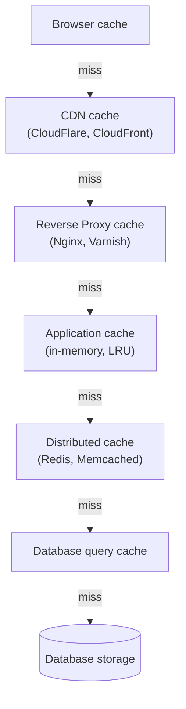

# Caching: Redis, Memcached, HTTP Cache

Caching là kỹ thuật lưu tạm kết quả của những thao tác tốn kém ở nơi truy cập nhanh, để lần sau dùng lại mà không phải tính toán hay query lại từ đầu. Bài này giới thiệu các công cụ và tầng cache phổ biến như Redis, Memcached, HTTP Cache và CDN, cùng những pattern thường dùng. Cache đúng cách giúp ứng dụng nhanh hơn nhiều lần và giảm tải cho database.

---

:::note[Ghi nhớ nhanh]

- ⭐ **Cache = lưu tạm kết quả đắt tiền ở nơi truy cập nhanh** — đánh đổi latency thấp lấy consistency (data có thể stale) + complexity.
- **Cache có nhiều layer**: browser → CDN → reverse proxy → app → distributed (`Redis`) → DB.
- ⭐ **`Redis` là default 2026** (in-memory, nhiều data structure) — dùng cho cache, session, rate limit, queue, leaderboard, pub/sub.
- **HTTP caching** qua `Cache-Control`, `ETag`, `Last-Modified`; static asset có hash filename → cache forever.
- **Cache invalidation khó** — coi chừng stale data, cache stampede, penetration, avalanche (thêm TTL jitter), hot key.

:::

---

## Caching là gì?

**Caching** = **lưu tạm kết quả** của một phép tính/truy vấn **đắt tiền** ở
một nơi **truy cập nhanh hơn**, để lần sau dùng lại mà không phải tính/query
lại từ đầu.

Tương tự đời thường:

- **Note dán bàn** — số điện thoại hay gọi, không cần mở danh bạ mỗi lần.
- **Tủ lạnh** — đồ ăn nấu sẵn, không cần đi chợ + nấu mỗi bữa.
- **Bộ nhớ ngắn hạn** của não — nhớ tên người vừa gặp, không cần "query" lại.

### Tại sao cần caching?

Vì **tốc độ truy cập** chênh lệch rất lớn giữa các tầng lưu trữ:

| Tầng | Thời gian truy cập | So sánh tương đối |
|---|---|---|
| CPU register | ~1 ns | 1 giây |
| L1 cache | ~1 ns | 1 giây |
| RAM | ~100 ns | 1.5 phút |
| SSD | ~100 μs | 1 ngày |
| Database query (cùng region) | ~1-10 ms | 1-10 ngày |
| HTTP request (cross-region) | ~100 ms | 3 tháng |
| Database query (phức tạp, JOIN nhiều) | ~1 s | 3 năm |

→ Cache 1 query DB phức tạp vào RAM/Redis = **giảm 100-10000x latency**.

### Nguyên lý hoạt động

```
[Request] → Check cache?
              ├─ HIT  → return cached value (nhanh)
              └─ MISS → query source (chậm)
                       → lưu vào cache
                       → return value
```

**Hit rate** = `hit / (hit + miss)`. Cache tốt thường ≥ 80%.

:::tip[Ví dụ đời thường]

Bạn hỏi thủ thư mượn một cuốn sách:

- **HIT** — sách đang nằm sẵn trên kệ trưng bày ngay quầy, đưa cho bạn trong 5 giây.
- **MISS** — thủ thư phải đi xuống kho tầng hầm lục, mất 10 phút; lấy xong thì **để luôn lên kệ trưng bày** cho người sau.

`Hit rate` chính là tỉ lệ "có sẵn ở quầy". Kệ trưng bày mà chỉ đáp ứng được 2/10 lượt hỏi thì bày ra cũng chẳng ích gì — chiếm chỗ mà vẫn phải chạy xuống kho.

:::

### Đánh đổi cốt lõi

Cache không miễn phí — bạn đánh đổi:

| Được | Mất |
|---|---|
| **Latency** thấp hơn | **Consistency** — data có thể stale (cũ) |
| **Throughput** cao hơn | **Complexity** — phải invalidate đúng lúc |
| **Cost** thấp hơn (ít query DB) | **Memory** — cache tốn RAM |

> *"There are only two hard things in Computer Science: cache invalidation
> and naming things."* — Phil Karlton.

### Mental model: khi nào nên cache?

3 câu hỏi:

1. **Data có đắt để tính/query không?** (DB join phức tạp, API external, AI inference) → đáng cache.
2. **Data có được đọc nhiều hơn ghi không?** (product catalog, user profile) → đáng cache.
3. **Stale data trong N giây có chấp nhận được không?** (feed, dashboard) → đáng cache.

Nếu cả 3 câu là **Có** → cache. Nếu data đổi liên tục và phải real-time
(balance tài khoản, inventory bán hàng) → cân nhắc kỹ hoặc dùng cache với
TTL rất ngắn + invalidate chặt.

---

## Mục lục

- [Caching layers](#caching-layers)
- [Redis (khuyến nghị)](#redis-khuyến-nghị)
- [Memcached](#memcached)
- [HTTP Caching](#http-caching)
- [CDN Caching](#cdn-caching)
- [Cache patterns](#cache-patterns)
- [Câu hỏi phỏng vấn](#câu-hỏi-phỏng-vấn)

---

## Caching layers

Web app có nhiều layer cache:

:::tip[Ví dụ đời thường]

Bạn cần một hộp sữa:

1. Mở **tủ lạnh nhà mình** (browser cache) — có thì xong ngay.
2. Không có thì xuống **tạp hóa đầu ngõ** (CDN).
3. Hết nữa thì ra **siêu thị trong quận** (reverse proxy, app cache).
4. Vẫn hết thì lên **kho tổng** (Redis), cuối cùng mới về **nhà máy sữa** (database).

Càng đi sâu càng lâu và càng làm nhà máy mệt. Nên mỗi tầng đều giữ sẵn một ít hàng để chặn bớt người phải đi xuống tầng dưới.

:::

```
[Browser cache]
    ↓
[CDN cache] (CloudFlare, CloudFront)
    ↓
[Reverse Proxy cache] (Nginx, Varnish)
    ↓
[Application cache] (in-memory, LRU)
    ↓
[Distributed cache] (Redis, Memcached)
    ↓
[Database query cache]
    ↓
[Database storage]
```



Mỗi layer giảm load cho layer dưới — request chỉ đi sâu xuống khi tầng trên "miss". Cache đúng = **10-100x faster**.

---

## Redis (khuyến nghị)

**In-memory data store** — phổ biến nhất 2026.

```bash
docker run -d --name redis -p 6379:6379 redis:7-alpine
```

```ts
import Redis from "ioredis";

const redis = new Redis(process.env.REDIS_URL);

// Set / Get
await redis.set("user:1", JSON.stringify(user));
const cached = await redis.get("user:1");

// Với expire (1 hour)
await redis.set("user:1", JSON.stringify(user), "EX", 3600);

// Delete
await redis.del("user:1");

// Increment
await redis.incr("page_view:home");
```

**Data structures** đặc biệt của Redis:

```ts
// List (queue, recent items)
await redis.lpush("recent_searches", "query1");
await redis.lrange("recent_searches", 0, 9); // 10 mới nhất

// Set (unique)
await redis.sadd("user:1:roles", "admin", "editor");
const isAdmin = await redis.sismember("user:1:roles", "admin");

// Sorted Set (leaderboard)
await redis.zadd("leaderboard", 100, "user1");
await redis.zrevrange("leaderboard", 0, 9, "WITHSCORES"); // top 10

// Hash (object)
await redis.hset("user:1", "name", "An", "age", 25);
const name = await redis.hget("user:1", "name");

// Pub/Sub
await redis.publish("channel", "message");
redis.subscribe("channel");
redis.on("message", (channel, msg) => console.log(msg));

// Streams (event log)
await redis.xadd("events", "*", "type", "login", "userId", "1");
```

**Use case**:

- **Session store** — share session giữa nhiều server.
- **Cache layer** — query result, computed value.
- **Rate limiting** — counter + expire.
- **Queue** (basic) — Bull, BullMQ.
- **Leaderboard** — sorted set.
- **Pub/Sub** — real-time event.
- **Locks** — distributed lock.

:::info[Phân tích]

**Redis ecosystem 2026**:

- **Redis OSS** — open source.
- **Redis Stack** — Redis + JSON + Search + Graph + Bloom filter.
- **Upstash** — serverless Redis, HTTP/REST API, pay-per-request.
- **AWS ElastiCache** — managed Redis trong AWS.
- **Redis Cloud** — Redis Labs managed.
- **Valkey** — fork community sau Redis license change 2024.

Năm 2024, Redis chuyển license sang **dual SSPL/RSAL** — không 100%
open source nữa. **Valkey** (Linux Foundation) là fork miễn phí
compatible. Cloud provider lớn (AWS, GCP) đã chuyển Valkey.

App code không cần đổi — protocol giống nhau. Chỉ chọn provider/distribution.

:::

---

## Memcached

**Older sibling** của Redis. Đơn giản hơn:

- **Key-value only** — không có data structure phức tạp.
- **In-memory** — không persist.
- **Multi-threaded** — scale CPU tốt.
- **Smaller memory footprint**.

```bash
docker run -d --name memcached -p 11211:11211 memcached:1.6-alpine
```

```ts
import { Client } from "memjs";

const cache = Client.create();
await cache.set("key", "value", { expires: 3600 });
const { value } = await cache.get("key");
```

**Khi dùng Memcached over Redis?**

- App **chỉ cần cache đơn giản** (key-value, expire).
- Memory cực kỳ critical.
- Đã có infrastructure Memcached.

→ Redis cover được 99% case, **start với Redis** default.

---

## HTTP Caching

**Cache ở client + proxy** thông qua HTTP headers.

**`Cache-Control`**:

```
# Cache 1h, ai cũng cache được
Cache-Control: public, max-age=3600

# Private — chỉ browser cache, không CDN
Cache-Control: private, max-age=600

# No cache — phải revalidate trước khi dùng
Cache-Control: no-cache

# No store — không cache ở đâu
Cache-Control: no-store

# Combo
Cache-Control: public, max-age=86400, s-maxage=604800, immutable
```

Directives:

- `max-age=N` — cache N giây.
- `s-maxage=N` — cache N giây ở **shared cache** (CDN).
- `public` — bất kỳ cache lưu được.
- `private` — chỉ user cache.
- `no-cache` — phải validate trước dùng.
- `no-store` — không cache.
- `immutable` — không bao giờ thay đổi.
- `stale-while-revalidate=N` — serve stale + refresh background.

**`ETag`** — validate cache còn fresh:

:::tip[Ví dụ đời thường]

`ETag` giống **số phiên bản đóng dấu trên tờ hợp đồng** bạn đang cầm.

Lần sau bạn không vác cả xấp giấy lên hỏi lại, chỉ hỏi một câu: "bản tôi giữ là bản `abc123`, còn xài được không?". Văn phòng trả lời "còn nguyên vậy" (`304 Not Modified`) — bạn dùng lại bản cũ, **không ai phải photo lại cả tập**. Chỉ khi họ nói "đổi rồi" thì mới gửi bản mới.

Cái giá phải trả: bạn vẫn phải **đi hỏi một lần** trước mỗi lần dùng — nhanh hơn tải lại, nhưng vẫn chậm hơn `max-age` (khỏi hỏi luôn).

:::

```
Response:
ETag: "abc123"

Request lần sau:
If-None-Match: "abc123"

Response:
304 Not Modified  (no body, save bandwidth)
```

**`Last-Modified`** — timestamp-based:

```
Response: Last-Modified: Mon, 5 May 2026 10:00:00 GMT
Request:  If-Modified-Since: Mon, 5 May 2026 10:00:00 GMT
Response: 304 Not Modified
```

:::tip[Mẹo]

**Strategy theo content type**:

| Content | Cache-Control |
|---------|--------------|
| Static asset có hash (`app-abc123.js`) | `public, max-age=31536000, immutable` |
| Image | `public, max-age=86400, s-maxage=604800` |
| HTML page | `public, max-age=0, s-maxage=60, stale-while-revalidate=3600` |
| API user-specific | `private, max-age=60` |
| Sensitive | `no-store` |

**Hash filename** = cache forever. Build tool (Vite, Webpack) tự handle:

```
app.abc123.js
app.def456.js  (next build)
```

Browser cache vô tận file `app.abc123.js`, deploy mới dùng filename mới.

:::

---

## CDN Caching

**CDN (Content Delivery Network)** — cache + serve gần user.

:::tip[Ví dụ đời thường]

Hãng nước ngọt không bắt cả nước về nhà máy trong Nam mua hàng. Họ đặt **kho phân phối ở từng tỉnh**, chở sẵn hàng về đó; người Hà Nội mua thì lấy ở kho Hà Nội, có ngay trong ngày thay vì chờ xe chạy từ trong Nam ra.

CDN đúng như vậy: ảnh, JS, CSS được nhân bản ra hàng trăm điểm gần user.

Cái giá phải trả: khi bạn **đổi công thức** (deploy bản mới), phải đi báo từng kho thu hồi hàng cũ (`purge cache`) — quên một kho là có tỉnh vẫn bán hàng cũ cả tuần.

:::

Provider:

- **CloudFlare** — free tier rộng, anti-DDoS.
- **AWS CloudFront**.
- **Fastly** — edge programmable.
- **Vercel** / **Netlify Edge**.
- **bunny.net** — pricing thấp.

CDN cache:

- **Static asset** (JS, CSS, image, font).
- **HTML page** (nếu `Cache-Control: s-maxage`).
- **API response** (nếu cache-able).

**Purge cache** khi update:

```bash
# CloudFlare CLI
curl -X POST "https://api.cloudflare.com/.../purge_cache" \
  -H "Authorization: Bearer $TOKEN" \
  -d '{"files":["https://example.com/page.html"]}'
```

---

## Cache patterns

:::tip[Ví dụ đời thường]

Ba kiểu quản lý **cái tủ lạnh** so với **cái chợ**:

| Pattern | Ngoài đời | Điểm yếu |
|---|---|---|
| **Cache-Aside** | Mở tủ lạnh trước, hết thì mới ra chợ mua, mua xong cất vào tủ | Lần đầu luôn chậm (miss) |
| **Write-Through** | Mua gì cũng **cất vào tủ ngay** cùng lúc với ghi sổ chi tiêu | Ghi chậm hơn, nhiều đồ cất vào rồi chẳng ai ăn |
| **Write-Behind** | Ghi nhanh vào **mẩu giấy dán tủ**, tối rảnh mới chép vào sổ | Mất mẩu giấy là mất luôn dữ liệu |

:::

**1. Cache-Aside (Lazy loading)** — phổ biến nhất:

```ts
async function getUser(id: string) {
  // Check cache
  const cached = await redis.get(`user:${id}`);
  if (cached) return JSON.parse(cached);

  // Miss → query DB
  const user = await db.user.findUnique({ where: { id } });

  // Store cache
  await redis.set(`user:${id}`, JSON.stringify(user), "EX", 3600);

  return user;
}
```

**2. Write-Through** — write cả cache + DB:

```ts
async function updateUser(id: string, data) {
  const user = await db.user.update({ where: { id }, data });
  await redis.set(`user:${id}`, JSON.stringify(user), "EX", 3600);
  return user;
}
```

**3. Write-Behind** — write cache, async flush DB:

```ts
async function logEvent(event) {
  await redis.lpush("event_queue", JSON.stringify(event));
  // Worker đọc queue, batch insert DB
}
```

**4. Cache Invalidation**:

:::tip[Ví dụ đời thường]

Bạn đổi số điện thoại. Nếu chỉ sửa trong danh bạ gốc mà **quên xé tờ note dán trên bàn**, người nhà vẫn gọi số cũ dài dài.

Nên hễ sửa dữ liệu gốc là phải **xé luôn mọi tờ note liên quan** — cả tờ ghi riêng bài viết đó lẫn tờ danh sách tổng hợp. Khó ở chỗ bạn phải nhớ mình đã dán note ở bao nhiêu chỗ.

`TTL` chỉ là cái phao — note tự mục sau 1 tiếng — chứ không thay được việc xé chủ động.

:::

```ts
// Delete key sau khi update
async function updatePost(id, data) {
  await db.post.update({ where: { id }, data });
  await redis.del(`post:${id}`);
  await redis.del("posts:list");  // list cache cũng invalid
}
```

:::info[Phân tích]

**Cache invalidation là 1 trong 2 vấn đề khó nhất trong CS** (cùng với
naming).

Pitfall thường gặp:

**1. Stale data**:
- Update DB, quên invalidate cache.
- → User thấy data cũ.

**2. Cache stampede**:
- 1000 user cùng request, key expire → 1000 query DB cùng lúc.
- Fix: **lock** (chỉ 1 query DB, các request khác đợi), hoặc
  **early refresh** (refresh background trước khi expire).

**3. Cache penetration**:
- Query key không tồn tại (`user:non-exist`) → mỗi lần đều miss → DB.
- Fix: cache **negative result** (`user:non-exist → "null"`, expire short).

**4. Cache avalanche**:
- Nhiều key expire cùng lúc → DB overwhelmed.
- Fix: **random jitter** vào TTL (±10%).

```ts
const ttl = 3600 + Math.floor(Math.random() * 600); // 3600-4200s
await redis.set(key, value, "EX", ttl);
```

**5. Hot key**:
- 1 key được query rất nhiều → Redis instance bottleneck.
- Fix: local cache layer trước Redis, hoặc replicate hot key.

Senior backend dev biết handle các case này — distinguish junior/mid.

:::

:::tip[Mẹo]

**Quy tắc cache thực dụng**:

1. **Don't cache prematurely** — đo trước, biết bottleneck đâu.
2. **Cache read-heavy, mutate ít** — user profile, product catalog.
3. **Don't cache personal-specific** nếu invalidate khó — order, balance.
4. **TTL ngắn** an toàn hơn TTL dài (max 1h cho data dynamic).
5. **Invalidate on write** — đừng dựa TTL hoàn toàn.
6. **Monitor hit rate** — < 80% có thể không đáng cache.

Tool monitor cache:

- `redis-cli --stat` — operation per second.
- `redis-cli INFO stats` — hit/miss ratio.
- Datadog, New Relic Redis integration.

:::

---

## Câu hỏi phỏng vấn

Những câu thường gặp về chủ đề này. Tự trả lời trước, rồi đối chiếu lại với nội dung phía trên.

1. Caching là gì? Bạn được gì và mất gì khi thêm một tầng cache vào hệ thống?
2. `Hit rate` tính thế nào? Hit rate bao nhiêu thì cache mới đáng bỏ công, và dưới ngưỡng đó thì sao?
3. Kể các tầng cache của một web app từ browser xuống database. Mỗi tầng chặn tải cho tầng nào?
4. Trước khi quyết định cache một loại dữ liệu, bạn tự hỏi những câu gì? Loại dữ liệu nào bạn sẽ **không** cache?
5. So sánh `Redis` và `Memcached`. Trường hợp nào Memcached vẫn hợp lý hơn?
6. Redis có những kiểu dữ liệu nào? Ứng với mỗi bài toán sau bạn chọn kiểu nào: leaderboard, hàng đợi, rate limit, session, đếm unique?
7. Redis xử lý command theo kiểu single-threaded — vì sao vẫn rất nhanh, và điều đó cảnh báo gì khi bạn định chạy `KEYS *` trên production?
8. Key hết `TTL` thì Redis xoá ngay hay không? Giải thích `lazy expiration` và `active expiration`.
9. Khi Redis chạm `maxmemory`, các eviction policy (`allkeys-lru`, `allkeys-lfu`, `volatile-ttl`, `noeviction`) khác nhau ra sao? Dùng Redis làm cache thì chọn cái nào?
10. `RDB` khác `AOF` thế nào? Dùng Redis thuần làm cache thì có cần persistence không?
11. So sánh `Cache-Aside`, `Read-Through`, `Write-Through`, `Write-Behind`. Mỗi pattern hỏng theo kiểu nào khi có sự cố?
12. Sau khi update DB, vì sao thường **xoá** key cache thay vì ghi đè giá trị mới vào cache?
13. Có race condition nào giữa "ghi DB" và "xoá cache" khiến cache giữ mãi dữ liệu cũ không? Mô tả và nêu cách giảm thiểu.
14. `Cache stampede` (thundering herd) là gì? Nêu các cách chặn: `lock`/`SETNX`, request coalescing, early/probabilistic refresh — mỗi cách đánh đổi gì?
15. `Cache penetration` khác `cache avalanche` chỗ nào? Cách khắc phục từng loại (negative caching, bloom filter, TTL jitter)?
16. `Hot key` gây vấn đề gì trong một Redis cluster và bạn xử lý ra sao?
17. Thiết kế cache cho trang chi tiết sản phẩm: đặt tên key thế nào, TTL bao nhiêu, và khi sản phẩm đổi giá thì phải invalidate những key nào?
18. Giải thích `Cache-Control`: khác nhau giữa `max-age`, `s-maxage`, `no-cache`, `no-store`, `public`, `private`, `immutable`.
19. `ETag` và `Last-Modified` hoạt động ra sao? `304 Not Modified` tiết kiệm được gì và vẫn tốn gì so với `max-age`?
20. `stale-while-revalidate` giải quyết vấn đề gì? Nó khác `no-cache` chỗ nào?
21. Vì sao static asset có hash trong tên file (`app.abc123.js`) lại cache được gần như vĩnh viễn?
22. CDN cache khác browser cache thế nào? Deploy bản mới thì `purge` ra sao để không còn user nào thấy bản cũ?
23. Đặt sai `Cache-Control` cho response riêng của từng user thì hậu quả ở CDN/shared cache là gì?
24. Dùng Redis làm `distributed lock` có những cái bẫy nào (TTL hết trước khi job xong, xoá nhầm lock của tiến trình khác)?
25. Bạn monitor hiệu quả cache trong production bằng chỉ số nào và bằng công cụ gì?
