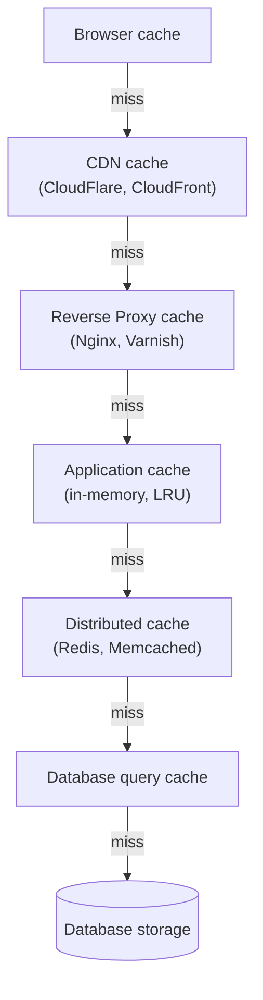

# Caching: Redis, Memcached, HTTP Cache

Caching là kỹ thuật lưu tạm kết quả của những thao tác tốn kém ở nơi truy cập nhanh, để lần sau dùng lại mà không phải tính toán hay query lại từ đầu. Bài này giới thiệu các công cụ và tầng cache phổ biến như Redis, Memcached, HTTP Cache và CDN, cùng những pattern thường dùng. Cache đúng cách giúp ứng dụng nhanh hơn nhiều lần và giảm tải cho database.

[](pathname:///img/backend/caching.webp)

---

:::note[Ghi nhớ nhanh]

- ⭐ **Cache = lưu tạm kết quả đắt tiền ở nơi truy cập nhanh** — đánh đổi latency thấp lấy consistency (data có thể stale) + complexity.
- **Cache có nhiều layer**: browser → CDN → reverse proxy → app → distributed (`Redis`) → DB.
- ⭐ **`Redis` là default 2026** (in-memory, nhiều data structure) — dùng cho cache, session, rate limit, queue, leaderboard, pub/sub.
- **HTTP caching** qua `Cache-Control`, `ETag`, `Last-Modified`; static asset có hash filename → cache forever.
- **Cache invalidation khó** — coi chừng stale data, cache stampede, penetration, avalanche (thêm TTL jitter), hot key.

:::

---

## Caching là gì?

**Caching** = **lưu tạm kết quả** của một phép tính/truy vấn **đắt tiền** ở
một nơi **truy cập nhanh hơn**, để lần sau dùng lại mà không phải tính/query
lại từ đầu.

Tương tự đời thường:

- **Note dán bàn** — số điện thoại hay gọi, không cần mở danh bạ mỗi lần.
- **Tủ lạnh** — đồ ăn nấu sẵn, không cần đi chợ + nấu mỗi bữa.
- **Bộ nhớ ngắn hạn** của não — nhớ tên người vừa gặp, không cần "query" lại.

### Tại sao cần caching?

Vì **tốc độ truy cập** chênh lệch rất lớn giữa các tầng lưu trữ:

| Tầng | Thời gian truy cập | So sánh tương đối |
|---|---|---|
| CPU register | ~1 ns | 1 giây |
| L1 cache | ~1 ns | 1 giây |
| RAM | ~100 ns | 1.5 phút |
| SSD | ~100 μs | 1 ngày |
| Database query (cùng region) | ~1-10 ms | 1-10 ngày |
| HTTP request (cross-region) | ~100 ms | 3 tháng |
| Database query (phức tạp, JOIN nhiều) | ~1 s | 3 năm |

→ Cache 1 query DB phức tạp vào RAM/Redis = **giảm 100-10000x latency**.

### Nguyên lý hoạt động

```
[Request] → Check cache?
              ├─ HIT  → return cached value (nhanh)
              └─ MISS → query source (chậm)
                       → lưu vào cache
                       → return value
```

**Hit rate** = `hit / (hit + miss)`. Cache tốt thường ≥ 80%.

:::tip[Ví dụ đời thường]

Bạn hỏi thủ thư mượn một cuốn sách:

- **HIT** — sách đang nằm sẵn trên kệ trưng bày ngay quầy, đưa cho bạn trong 5 giây.
- **MISS** — thủ thư phải đi xuống kho tầng hầm lục, mất 10 phút; lấy xong thì **để luôn lên kệ trưng bày** cho người sau.

`Hit rate` chính là tỉ lệ "có sẵn ở quầy". Kệ trưng bày mà chỉ đáp ứng được 2/10 lượt hỏi thì bày ra cũng chẳng ích gì — chiếm chỗ mà vẫn phải chạy xuống kho.

:::

### Đánh đổi cốt lõi

Cache không miễn phí — bạn đánh đổi:

| Được | Mất |
|---|---|
| **Latency** thấp hơn | **Consistency** — data có thể stale (cũ) |
| **Throughput** cao hơn | **Complexity** — phải invalidate đúng lúc |
| **Cost** thấp hơn (ít query DB) | **Memory** — cache tốn RAM |

> *"There are only two hard things in Computer Science: cache invalidation
> and naming things."* — Phil Karlton.

### Mental model: khi nào nên cache?

3 câu hỏi:

1. **Data có đắt để tính/query không?** (DB join phức tạp, API external, AI inference) → đáng cache.
2. **Data có được đọc nhiều hơn ghi không?** (product catalog, user profile) → đáng cache.
3. **Stale data trong N giây có chấp nhận được không?** (feed, dashboard) → đáng cache.

Nếu cả 3 câu là **Có** → cache. Nếu data đổi liên tục và phải real-time
(balance tài khoản, inventory bán hàng) → cân nhắc kỹ hoặc dùng cache với
TTL rất ngắn + invalidate chặt.

---

## Mục lục

- [Caching layers](#caching-layers)
- [Redis (khuyến nghị)](#redis-khuyến-nghị)
- [Memcached](#memcached)
- [HTTP Caching](#http-caching)
- [CDN Caching](#cdn-caching)
- [Cache patterns](#cache-patterns)
- [Câu hỏi phỏng vấn](#câu-hỏi-phỏng-vấn)

---

## Caching layers

Web app có nhiều layer cache:

:::tip[Ví dụ đời thường]

Bạn cần một hộp sữa:

1. Mở **tủ lạnh nhà mình** (browser cache) — có thì xong ngay.
2. Không có thì xuống **tạp hóa đầu ngõ** (CDN).
3. Hết nữa thì ra **siêu thị trong quận** (reverse proxy, app cache).
4. Vẫn hết thì lên **kho tổng** (Redis), cuối cùng mới về **nhà máy sữa** (database).

Càng đi sâu càng lâu và càng làm nhà máy mệt. Nên mỗi tầng đều giữ sẵn một ít hàng để chặn bớt người phải đi xuống tầng dưới.

:::

```
[Browser cache]
    ↓
[CDN cache] (CloudFlare, CloudFront)
    ↓
[Reverse Proxy cache] (Nginx, Varnish)
    ↓
[Application cache] (in-memory, LRU)
    ↓
[Distributed cache] (Redis, Memcached)
    ↓
[Database query cache]
    ↓
[Database storage]
```



Mỗi layer giảm load cho layer dưới — request chỉ đi sâu xuống khi tầng trên "miss". Cache đúng = **10-100x faster**.

---

## Redis (khuyến nghị)

**In-memory data store** — phổ biến nhất 2026.

```bash
docker run -d --name redis -p 6379:6379 redis:7-alpine
```

```ts
import Redis from "ioredis";

const redis = new Redis(process.env.REDIS_URL);

// Set / Get
await redis.set("user:1", JSON.stringify(user));
const cached = await redis.get("user:1");

// Với expire (1 hour)
await redis.set("user:1", JSON.stringify(user), "EX", 3600);

// Delete
await redis.del("user:1");

// Increment
await redis.incr("page_view:home");
```

**Data structures** đặc biệt của Redis:

```ts
// List (queue, recent items)
await redis.lpush("recent_searches", "query1");
await redis.lrange("recent_searches", 0, 9); // 10 mới nhất

// Set (unique)
await redis.sadd("user:1:roles", "admin", "editor");
const isAdmin = await redis.sismember("user:1:roles", "admin");

// Sorted Set (leaderboard)
await redis.zadd("leaderboard", 100, "user1");
await redis.zrevrange("leaderboard", 0, 9, "WITHSCORES"); // top 10

// Hash (object)
await redis.hset("user:1", "name", "An", "age", 25);
const name = await redis.hget("user:1", "name");

// Pub/Sub
await redis.publish("channel", "message");
redis.subscribe("channel");
redis.on("message", (channel, msg) => console.log(msg));

// Streams (event log)
await redis.xadd("events", "*", "type", "login", "userId", "1");
```

**Use case**:

- **Session store** — share session giữa nhiều server.
- **Cache layer** — query result, computed value.
- **Rate limiting** — counter + expire.
- **Queue** (basic) — Bull, BullMQ.
- **Leaderboard** — sorted set.
- **Pub/Sub** — real-time event.
- **Locks** — distributed lock.

:::info[Phân tích]

**Redis ecosystem 2026**:

- **Redis OSS** — open source.
- **Redis Stack** — Redis + JSON + Search + Graph + Bloom filter.
- **Upstash** — serverless Redis, HTTP/REST API, pay-per-request.
- **AWS ElastiCache** — managed Redis trong AWS.
- **Redis Cloud** — Redis Labs managed.
- **Valkey** — fork community sau Redis license change 2024.

Năm 2024, Redis chuyển license sang **dual SSPL/RSAL** — không 100%
open source nữa. **Valkey** (Linux Foundation) là fork miễn phí
compatible. Cloud provider lớn (AWS, GCP) đã chuyển Valkey.

App code không cần đổi — protocol giống nhau. Chỉ chọn provider/distribution.

:::

---

## Memcached

**Older sibling** của Redis. Đơn giản hơn:

- **Key-value only** — không có data structure phức tạp.
- **In-memory** — không persist.
- **Multi-threaded** — scale CPU tốt.
- **Smaller memory footprint**.

```bash
docker run -d --name memcached -p 11211:11211 memcached:1.6-alpine
```

```ts
import { Client } from "memjs";

const cache = Client.create();
await cache.set("key", "value", { expires: 3600 });
const { value } = await cache.get("key");
```

**Khi dùng Memcached over Redis?**

- App **chỉ cần cache đơn giản** (key-value, expire).
- Memory cực kỳ critical.
- Đã có infrastructure Memcached.

→ Redis cover được 99% case, **start với Redis** default.

---

## HTTP Caching

**Cache ở client + proxy** thông qua HTTP headers.

**`Cache-Control`**:

```
# Cache 1h, ai cũng cache được
Cache-Control: public, max-age=3600

# Private — chỉ browser cache, không CDN
Cache-Control: private, max-age=600

# No cache — phải revalidate trước khi dùng
Cache-Control: no-cache

# No store — không cache ở đâu
Cache-Control: no-store

# Combo
Cache-Control: public, max-age=86400, s-maxage=604800, immutable
```

Directives:

- `max-age=N` — cache N giây.
- `s-maxage=N` — cache N giây ở **shared cache** (CDN).
- `public` — bất kỳ cache lưu được.
- `private` — chỉ user cache.
- `no-cache` — phải validate trước dùng.
- `no-store` — không cache.
- `immutable` — không bao giờ thay đổi.
- `stale-while-revalidate=N` — serve stale + refresh background.

**`ETag`** — validate cache còn fresh:

:::tip[Ví dụ đời thường]

`ETag` giống **số phiên bản đóng dấu trên tờ hợp đồng** bạn đang cầm.

Lần sau bạn không vác cả xấp giấy lên hỏi lại, chỉ hỏi một câu: "bản tôi giữ là bản `abc123`, còn xài được không?". Văn phòng trả lời "còn nguyên vậy" (`304 Not Modified`) — bạn dùng lại bản cũ, **không ai phải photo lại cả tập**. Chỉ khi họ nói "đổi rồi" thì mới gửi bản mới.

Cái giá phải trả: bạn vẫn phải **đi hỏi một lần** trước mỗi lần dùng — nhanh hơn tải lại, nhưng vẫn chậm hơn `max-age` (khỏi hỏi luôn).

:::

```
Response:
ETag: "abc123"

Request lần sau:
If-None-Match: "abc123"

Response:
304 Not Modified  (no body, save bandwidth)
```

**`Last-Modified`** — timestamp-based:

```
Response: Last-Modified: Mon, 5 May 2026 10:00:00 GMT
Request:  If-Modified-Since: Mon, 5 May 2026 10:00:00 GMT
Response: 304 Not Modified
```

:::tip[Mẹo]

**Strategy theo content type**:

| Content | Cache-Control |
|---------|--------------|
| Static asset có hash (`app-abc123.js`) | `public, max-age=31536000, immutable` |
| Image | `public, max-age=86400, s-maxage=604800` |
| HTML page | `public, max-age=0, s-maxage=60, stale-while-revalidate=3600` |
| API user-specific | `private, max-age=60` |
| Sensitive | `no-store` |

**Hash filename** = cache forever. Build tool (Vite, Webpack) tự handle:

```
app.abc123.js
app.def456.js  (next build)
```

Browser cache vô tận file `app.abc123.js`, deploy mới dùng filename mới.

:::

---

## CDN Caching

**CDN (Content Delivery Network)** — cache + serve gần user.

:::tip[Ví dụ đời thường]

Hãng nước ngọt không bắt cả nước về nhà máy trong Nam mua hàng. Họ đặt **kho phân phối ở từng tỉnh**, chở sẵn hàng về đó; người Hà Nội mua thì lấy ở kho Hà Nội, có ngay trong ngày thay vì chờ xe chạy từ trong Nam ra.

CDN đúng như vậy: ảnh, JS, CSS được nhân bản ra hàng trăm điểm gần user.

Cái giá phải trả: khi bạn **đổi công thức** (deploy bản mới), phải đi báo từng kho thu hồi hàng cũ (`purge cache`) — quên một kho là có tỉnh vẫn bán hàng cũ cả tuần.

:::

Provider:

- **CloudFlare** — free tier rộng, anti-DDoS.
- **AWS CloudFront**.
- **Fastly** — edge programmable.
- **Vercel** / **Netlify Edge**.
- **bunny.net** — pricing thấp.

CDN cache:

- **Static asset** (JS, CSS, image, font).
- **HTML page** (nếu `Cache-Control: s-maxage`).
- **API response** (nếu cache-able).

**Purge cache** khi update:

```bash
# CloudFlare CLI
curl -X POST "https://api.cloudflare.com/.../purge_cache" \
  -H "Authorization: Bearer $TOKEN" \
  -d '{"files":["https://example.com/page.html"]}'
```

---

## Cache patterns

:::tip[Ví dụ đời thường]

Ba kiểu quản lý **cái tủ lạnh** so với **cái chợ**:

| Pattern | Ngoài đời | Điểm yếu |
|---|---|---|
| **Cache-Aside** | Mở tủ lạnh trước, hết thì mới ra chợ mua, mua xong cất vào tủ | Lần đầu luôn chậm (miss) |
| **Write-Through** | Mua gì cũng **cất vào tủ ngay** cùng lúc với ghi sổ chi tiêu | Ghi chậm hơn, nhiều đồ cất vào rồi chẳng ai ăn |
| **Write-Behind** | Ghi nhanh vào **mẩu giấy dán tủ**, tối rảnh mới chép vào sổ | Mất mẩu giấy là mất luôn dữ liệu |

:::

**1. Cache-Aside (Lazy loading)** — phổ biến nhất:

```ts
async function getUser(id: string) {
  // Check cache
  const cached = await redis.get(`user:${id}`);
  if (cached) return JSON.parse(cached);

  // Miss → query DB
  const user = await db.user.findUnique({ where: { id } });

  // Store cache
  await redis.set(`user:${id}`, JSON.stringify(user), "EX", 3600);

  return user;
}
```

**2. Write-Through** — write cả cache + DB:

```ts
async function updateUser(id: string, data) {
  const user = await db.user.update({ where: { id }, data });
  await redis.set(`user:${id}`, JSON.stringify(user), "EX", 3600);
  return user;
}
```

**3. Write-Behind** — write cache, async flush DB:

```ts
async function logEvent(event) {
  await redis.lpush("event_queue", JSON.stringify(event));
  // Worker đọc queue, batch insert DB
}
```

**4. Cache Invalidation**:

:::tip[Ví dụ đời thường]

Bạn đổi số điện thoại. Nếu chỉ sửa trong danh bạ gốc mà **quên xé tờ note dán trên bàn**, người nhà vẫn gọi số cũ dài dài.

Nên hễ sửa dữ liệu gốc là phải **xé luôn mọi tờ note liên quan** — cả tờ ghi riêng bài viết đó lẫn tờ danh sách tổng hợp. Khó ở chỗ bạn phải nhớ mình đã dán note ở bao nhiêu chỗ.

`TTL` chỉ là cái phao — note tự mục sau 1 tiếng — chứ không thay được việc xé chủ động.

:::

```ts
// Delete key sau khi update
async function updatePost(id, data) {
  await db.post.update({ where: { id }, data });
  await redis.del(`post:${id}`);
  await redis.del("posts:list");  // list cache cũng invalid
}
```

:::info[Phân tích]

**Cache invalidation là 1 trong 2 vấn đề khó nhất trong CS** (cùng với
naming).

Pitfall thường gặp:

**1. Stale data**:
- Update DB, quên invalidate cache.
- → User thấy data cũ.

**2. Cache stampede**:
- 1000 user cùng request, key expire → 1000 query DB cùng lúc.
- Fix: **lock** (chỉ 1 query DB, các request khác đợi), hoặc
  **early refresh** (refresh background trước khi expire).

**3. Cache penetration**:
- Query key không tồn tại (`user:non-exist`) → mỗi lần đều miss → DB.
- Fix: cache **negative result** (`user:non-exist → "null"`, expire short).

**4. Cache avalanche**:
- Nhiều key expire cùng lúc → DB overwhelmed.
- Fix: **random jitter** vào TTL (±10%).

```ts
const ttl = 3600 + Math.floor(Math.random() * 600); // 3600-4200s
await redis.set(key, value, "EX", ttl);
```

**5. Hot key**:
- 1 key được query rất nhiều → Redis instance bottleneck.
- Fix: local cache layer trước Redis, hoặc replicate hot key.

Senior backend dev biết handle các case này — distinguish junior/mid.

:::

:::tip[Mẹo]

**Quy tắc cache thực dụng**:

1. **Don't cache prematurely** — đo trước, biết bottleneck đâu.
2. **Cache read-heavy, mutate ít** — user profile, product catalog.
3. **Don't cache personal-specific** nếu invalidate khó — order, balance.
4. **TTL ngắn** an toàn hơn TTL dài (max 1h cho data dynamic).
5. **Invalidate on write** — đừng dựa TTL hoàn toàn.
6. **Monitor hit rate** — < 80% có thể không đáng cache.

Tool monitor cache:

- `redis-cli --stat` — operation per second.
- `redis-cli INFO stats` — hit/miss ratio.
- Datadog, New Relic Redis integration.

:::

---

## Câu hỏi phỏng vấn

Những câu thường gặp về chủ đề này. Tự trả lời trước, rồi bấm **Xem đáp án** để đối chiếu.

**1. Caching là gì? Bạn được gì và mất gì khi thêm một tầng cache vào hệ thống?**

<details className="qa">
<summary>Xem đáp án</summary>

**Caching** là lưu tạm kết quả của một phép tính hoặc truy vấn **đắt tiền** ở nơi **truy cập nhanh hơn**, để lần sau dùng lại mà không phải tính/query lại từ đầu. Giống tờ note dán bàn ghi số điện thoại hay gọi, hay tủ lạnh chứa đồ nấu sẵn.

| Được | Mất |
|---|---|
| **Latency** thấp hơn (100–10.000 lần với query DB nặng) | **Consistency** — dữ liệu có thể stale (cũ) |
| **Throughput** cao hơn, chịu được nhiều request hơn | **Complexity** — phải invalidate đúng lúc, đúng chỗ |
| **Cost** thấp hơn — ít query DB, ít gọi API ngoài | **Memory** — cache tốn RAM, tốn thêm hạ tầng |

Chênh lệch tốc độ chính là lý do cache tồn tại: RAM khoảng 100 ns, còn một query DB phức tạp có thể tới 1 giây — chênh gần 7 bậc độ lớn.

Đánh đổi lớn nhất luôn là **consistency**: hệ thống chấp nhận phục vụ dữ liệu cũ trong một khoảng thời gian để đổi lấy tốc độ. Vì thế câu nói kinh điển của Phil Karlton: *"hai việc khó nhất trong khoa học máy tính là cache invalidation và đặt tên biến"*.

</details>

**2. `Hit rate` tính thế nào? Hit rate bao nhiêu thì cache mới đáng bỏ công, và dưới ngưỡng đó thì sao?**

<details className="qa">
<summary>Xem đáp án</summary>

```
hit rate = hit / (hit + miss)
```

Cache tốt thường đạt **≥ 80%**. Dưới ngưỡng đó, cache thường **không đáng**: mỗi miss vẫn phải trả toàn bộ chi phí query nguồn, **cộng thêm** chi phí tra cache và ghi cache — tức là chậm hơn cả khi không cache, lại còn tốn RAM và thêm một thành phần phải vận hành.

Đúng như ẩn dụ thủ thư: kệ trưng bày chỉ đáp ứng 2/10 lượt hỏi thì vừa chiếm chỗ vừa vẫn phải chạy xuống kho.

Khi hit rate thấp, đừng vội bỏ cache — tìm nguyên nhân trước:

- **TTL quá ngắn** → key chết trước khi kịp được dùng lại.
- **Key quá chi tiết** (nhúng timestamp, filter hiếm, session id) → gần như không bao giờ trùng.
- **Cache nhỏ, bị evict liên tục** → tăng memory hoặc đổi eviction policy.
- **Dữ liệu vốn không có tính lặp lại** → đây mới là trường hợp thật sự nên bỏ cache.

Ngoài hit rate còn nên nhìn **latency p95/p99** và tải lên DB — đó mới là thứ cache thực sự cần cải thiện.

</details>

**3. Kể các tầng cache của một web app từ browser xuống database. Mỗi tầng chặn tải cho tầng nào?**

<details className="qa">
<summary>Xem đáp án</summary>

```
[Browser cache]            ← nhanh nhất, không tốn request nào
    ↓ miss
[CDN cache]                (CloudFlare, CloudFront) — gần user về địa lý
    ↓ miss
[Reverse Proxy cache]      (Nginx, Varnish) — ngay trước app server
    ↓ miss
[Application cache]        (in-memory, LRU trong process)
    ↓ miss
[Distributed cache]        (Redis, Memcached) — dùng chung mọi instance
    ↓ miss
[Database query cache]
    ↓ miss
[Database storage]
```

Mỗi tầng **chặn tải cho toàn bộ các tầng bên dưới**: request chỉ đi sâu xuống khi tầng trên miss. Đúng như ẩn dụ đi mua sữa: tủ lạnh nhà → tạp hoá đầu ngõ → siêu thị quận → kho tổng → nhà máy. Càng xuống sâu càng lâu và càng làm nhà máy mệt.

Hệ quả thực tế: một cải thiện nhỏ ở tầng **trên cùng** có tác dụng lớn hơn nhiều so với tối ưu ở tầng dưới, vì nó cắt request từ gốc. Nhược điểm là càng nhiều tầng thì **invalidate càng khó** — đổi dữ liệu phải nhớ xoá ở đủ mọi nơi, nếu không vẫn có tầng phục vụ bản cũ.

</details>

**4. Trước khi quyết định cache một loại dữ liệu, bạn tự hỏi những câu gì? Loại dữ liệu nào bạn sẽ không cache?**

<details className="qa">
<summary>Xem đáp án</summary>

Ba câu hỏi sàng lọc:

1. **Dữ liệu có đắt để tính/query không?** — JOIN phức tạp, gọi API bên ngoài, AI inference, tổng hợp báo cáo.
2. **Đọc nhiều hơn ghi không?** — product catalog, user profile, cấu hình.
3. **Stale trong N giây có chấp nhận được không?** — feed, dashboard, số lượt xem.

Cả ba đều "Có" → cache. Nếu chỉ một câu là "Không" thì phải cân nhắc rất kỹ.

**Không nên cache (hoặc cache với TTL cực ngắn + invalidate chặt):**

- **Dữ liệu phải chính xác tuyệt đối theo thời gian thực**: số dư tài khoản, tồn kho lúc đặt hàng, giá khớp lệnh.
- **Dữ liệu nhạy cảm** ở shared cache/CDN: thông tin cá nhân, token, response riêng từng user (phải `no-store` hoặc `private`).
- **Dữ liệu ghi nhiều hơn đọc**, hoặc **gần như không lặp lại** — cache bị invalidate liên tục, hit rate rất thấp.
- **Kết quả phụ thuộc quyền hạn** mà key không mã hoá được quyền → rủi ro user này thấy dữ liệu của user khác.

Và nguyên tắc bao trùm: **đừng cache quá sớm** — đo trước, biết bottleneck ở đâu rồi mới cache.

</details>

**5. So sánh `Redis` và `Memcached`. Trường hợp nào Memcached vẫn hợp lý hơn?**

<details className="qa">
<summary>Xem đáp án</summary>

| Tiêu chí | **Redis** | **Memcached** |
|---|---|---|
| Kiểu dữ liệu | String, List, Set, Sorted Set, Hash, Stream, Bitmap, HyperLogLog | Chỉ key–value (string) |
| Threading | Xử lý command đơn luồng (có I/O thread phụ) | **Multi-threaded**, tận dụng nhiều core tốt |
| Persistence | Có (`RDB`, `AOF`) | Không — mất hết khi restart |
| Replication / HA | Có (replica, Sentinel, Cluster) | Không có sẵn, phải tự shard ở client |
| Tính năng thêm | Pub/Sub, Lua script, transaction, TTL linh hoạt, distributed lock | Gần như không |
| Memory overhead | Cao hơn một chút | Thấp hơn, cấp phát slab hiệu quả cho object đồng đều |

**Memcached vẫn hợp lý khi:**

- Nhu cầu **chỉ đơn thuần là key–value + expire**, không cần data structure nào.
- Cần **tận dụng nhiều core** trên một node cho throughput cache thuần rất cao.
- Muốn **memory footprint tối thiểu** với các object kích thước tương đồng.
- **Hạ tầng Memcached đã có sẵn**, chuyển đổi không đáng.

Thực tế: Redis phủ được khoảng 99% trường hợp và còn kiêm session store, rate limit, queue, leaderboard — nên **mặc định cứ bắt đầu với Redis**.

</details>

**6. Redis có những kiểu dữ liệu nào? Ứng với mỗi bài toán sau bạn chọn kiểu nào: leaderboard, hàng đợi, rate limit, session, đếm unique?**

<details className="qa">
<summary>Xem đáp án</summary>

Các kiểu chính: **String**, **List**, **Set**, **Sorted Set (ZSet)**, **Hash**, **Stream**, cùng các kiểu đặc biệt như **Bitmap**, **HyperLogLog**, **Geo**.

| Bài toán | Kiểu chọn | Lý do |
|---|---|---|
| **Leaderboard** | Sorted Set | Tự sắp theo score, lấy top N bằng một lệnh, biết được thứ hạng của một user |
| **Hàng đợi** | List (hoặc Stream) | `LPUSH` + `BRPOP` là queue cơ bản; Stream có consumer group, ack, replay — bền hơn |
| **Rate limit** | String với `INCR` + `EXPIRE` | Đếm nguyên tử, tự hết hạn theo cửa sổ; nâng cao thì dùng Sorted Set cho sliding window |
| **Session** | Hash (hoặc String chứa JSON) | Hash sửa được từng field mà không phải đọc-ghi lại cả object |
| **Đếm unique** | Set (chính xác) hoặc HyperLogLog (ước lượng) | Set chính xác nhưng tốn RAM theo số phần tử; HLL chỉ ~12 KB cho hàng trăm triệu phần tử, sai số ~0,81% |

```ts
await redis.zadd("leaderboard", 100, "user1");
await redis.zrevrange("leaderboard", 0, 9, "WITHSCORES"); // top 10

await redis.lpush("recent_searches", "query1");
await redis.hset("user:1", "name", "An", "age", 25);
await redis.incr("page_view:home");
```

</details>

**7. Redis xử lý command theo kiểu single-threaded — vì sao vẫn rất nhanh, và điều đó cảnh báo gì khi bạn định chạy `KEYS *` trên production?**

<details className="qa">
<summary>Xem đáp án</summary>

**Vì sao vẫn nhanh:**

- Toàn bộ dữ liệu nằm **trong RAM** — thao tác tính bằng nano giây, nút thắt là mạng chứ không phải CPU.
- **Không có chi phí đồng bộ**: không lock, không context switch, không race condition giữa các thread.
- Dùng **I/O multiplexing** (epoll) để phục vụ hàng chục nghìn kết nối trên một vòng lặp sự kiện.
- Cấu trúc dữ liệu được tối ưu kỹ, phần lớn lệnh là O(1).
- Muốn dùng nhiều core thì chạy **nhiều instance** hoặc Redis Cluster.

**Cảnh báo:** vì chỉ một luồng xử lý lệnh, **một lệnh chậm sẽ chặn toàn bộ server**. `KEYS *` quét **mọi** key với độ phức tạp O(N) — với vài triệu key, nó có thể khoá Redis hàng giây, và trong khoảng đó mọi request khác đều xếp hàng chờ, gây timeout dây chuyền lên toàn hệ thống.

Thay thế an toàn: dùng **`SCAN`** (lặp theo cursor, mỗi lần trả một lô nhỏ, không chặn):

```
SCAN 0 MATCH "user:*" COUNT 100
```

Các lệnh nguy hiểm tương tự cần tránh trên production: `FLUSHALL`, `SMEMBERS` trên set khổng lồ, `HGETALL` trên hash lớn, `DEL` một key rất lớn (nên dùng `UNLINK` để xoá bất đồng bộ).

</details>

**8. Key hết `TTL` thì Redis xoá ngay hay không? Giải thích `lazy expiration` và `active expiration`.**

<details className="qa">
<summary>Xem đáp án</summary>

**Không xoá ngay.** Redis không đặt một hẹn giờ cho từng key — làm vậy sẽ tốn CPU khủng khiếp. Key hết hạn chỉ được đánh dấu là "đã hết hạn về mặt logic" và biến mất khỏi mọi truy vấn, còn bộ nhớ thì được thu hồi theo hai cơ chế:

- **Lazy expiration (xoá thụ động)** — khi có ai đó **truy cập key**, Redis kiểm tra hạn; nếu quá hạn thì xoá ngay lúc đó và trả về như key không tồn tại. Rẻ, nhưng nếu key không bao giờ được truy cập lại thì nó **nằm chiếm RAM mãi**.
- **Active expiration (xoá chủ động)** — định kỳ (khoảng 10 lần mỗi giây), Redis lấy **ngẫu nhiên một nhóm nhỏ** key trong tập có TTL, xoá những key đã hết hạn; nếu tỉ lệ hết hạn trong nhóm vượt ngưỡng thì lặp lại ngay. Đây là cách tiếp cận xác suất, cố tình không quét hết để không chặn luồng chính.

Hệ quả cần nhớ: **`used_memory` có thể cao hơn lượng dữ liệu còn hiệu lực**. Vì vậy vẫn phải đặt `maxmemory` kèm eviction policy, đừng trông cậy hoàn toàn vào TTL.

</details>

**9. Khi Redis chạm `maxmemory`, các eviction policy (`allkeys-lru`, `allkeys-lfu`, `volatile-ttl`, `noeviction`) khác nhau ra sao? Dùng Redis làm cache thì chọn cái nào?**

<details className="qa">
<summary>Xem đáp án</summary>

| Policy | Chọn nạn nhân trong | Tiêu chí loại bỏ |
|---|---|---|
| `noeviction` | — | Không xoá gì; lệnh ghi bị **báo lỗi** khi đầy bộ nhớ |
| `allkeys-lru` | Mọi key | Ít được dùng gần đây nhất (Least Recently Used) |
| `allkeys-lfu` | Mọi key | Ít được dùng thường xuyên nhất (Least Frequently Used) |
| `allkeys-random` | Mọi key | Ngẫu nhiên |
| `volatile-lru` / `volatile-lfu` / `volatile-random` | Chỉ key **có TTL** | Tương ứng như trên |
| `volatile-ttl` | Chỉ key có TTL | Key sắp hết hạn nhất bị xoá trước |

Lưu ý: các policy `volatile-*` **không đụng tới key không có TTL**; nếu không còn ứng viên nào thì hành xử như `noeviction` — lỗi ghi.

**Dùng thuần làm cache:** chọn **`allkeys-lru`** (mặc định an toàn) hoặc **`allkeys-lfu`** khi truy cập có phân bố lệch rõ (một số key nóng lâu dài) — LFU giữ được key nóng tốt hơn và không bị một đợt quét bất thường đẩy hết key nóng ra ngoài.

**Dùng làm session store, queue hay lưu dữ liệu không được phép mất:** chọn **`noeviction`**, hoặc tách hẳn instance cache và instance dữ liệu quan trọng — vì mất session hay mất job là mất thật, không "miss rồi query lại" được.

</details>

**10. `RDB` khác `AOF` thế nào? Dùng Redis thuần làm cache thì có cần persistence không?**

<details className="qa">
<summary>Xem đáp án</summary>

| | **RDB (snapshot)** | **AOF (append-only file)** |
|---|---|---|
| Cách ghi | Chụp ảnh toàn bộ dataset theo chu kỳ | Ghi lại **mọi lệnh ghi** vào file log |
| Kích thước file | Nhỏ, đã nén | Lớn hơn, cần rewrite định kỳ để gọn lại |
| Tốc độ khởi động lại | Nhanh (nạp thẳng file nhị phân) | Chậm hơn (phát lại lệnh) |
| Nguy cơ mất dữ liệu | Mất phần từ snapshot cuối tới lúc sập (có thể vài phút) | Tuỳ `appendfsync`: `everysec` mất tối đa ~1 giây, `always` gần như không mất nhưng chậm |
| Ảnh hưởng runtime | Fork tiến trình khi snapshot — có thể gây nhịp trễ và tăng RAM tạm thời | Ghi liên tục, chi phí trải đều |

Thực tế thường **bật cả hai**: RDB để backup và khôi phục nhanh, AOF để giảm tối đa lượng dữ liệu mất.

**Redis thuần làm cache thì có cần không?** Về nguyên tắc **không bắt buộc** — mất cache chỉ là miss rồi query lại từ nguồn, mà tắt persistence còn giúp tránh hẳn nhịp trễ do fork. Nhưng cần cân nhắc hai điểm: khởi động lại với cache rỗng có thể gây **cache stampede** đánh sập database, và nếu instance đó kiêm cả session hay rate limit thì mất dữ liệu là mất thật. Giải pháp thường dùng: giữ persistence nhẹ (chỉ RDB thưa) hoặc có cơ chế **warm-up** cache sau khi restart.

</details>

**11. So sánh `Cache-Aside`, `Read-Through`, `Write-Through`, `Write-Behind`. Mỗi pattern hỏng theo kiểu nào khi có sự cố?**

<details className="qa">
<summary>Xem đáp án</summary>

| Pattern | Cách hoạt động | Hỏng kiểu gì |
|---|---|---|
| **Cache-Aside** (lazy loading) | App tự tra cache, miss thì query DB rồi tự ghi vào cache | Lần đầu luôn chậm; dễ **stale** nếu quên invalidate; nhiều request cùng miss → **stampede** |
| **Read-Through** | App chỉ nói chuyện với cache; cache tự đi lấy từ DB khi miss | Logic nằm trong thư viện/cache provider nên khó tuỳ biến; cache chết là **đường xuống DB cũng đứt** |
| **Write-Through** | Ghi vào cache và DB **cùng lúc, đồng bộ** | Ghi chậm hơn; cache đầy dữ liệu chẳng ai đọc; nếu hai bước không nguyên tử thì **lệch giữa cache và DB** |
| **Write-Behind** (write-back) | Ghi vào cache/queue trước, worker flush xuống DB sau | Nhanh nhất nhưng **mất dữ liệu nếu cache sập trước khi flush**; DB tạm thời không nhất quán |

Ẩn dụ tủ lạnh: Cache-Aside là mở tủ trước, hết mới ra chợ; Write-Through là mua gì cũng cất vào tủ ngay cùng lúc ghi sổ; Write-Behind là ghi vội vào mẩu giấy dán tủ, tối rảnh mới chép vào sổ — mất mẩu giấy là mất luôn.

**Cache-Aside là mặc định** cho hầu hết web app vì đơn giản và cache chết thì hệ thống vẫn chạy (chỉ chậm hơn). Write-Behind chỉ dùng cho dữ liệu chấp nhận mất mát như log, đếm lượt xem, telemetry.

</details>

**12. Sau khi update DB, vì sao thường xoá key cache thay vì ghi đè giá trị mới vào cache?**

<details className="qa">
<summary>Xem đáp án</summary>

```ts
async function updatePost(id, data) {
  await db.post.update({ where: { id }, data });
  await redis.del(`post:${id}`);
  await redis.del("posts:list");
}
```

Lý do chọn **xoá** thay vì **ghi đè**:

- **Tránh ghi sai dữ liệu khi có đồng thời.** Hai request cùng update, thứ tự ghi vào cache có thể **ngược** với thứ tự ghi vào DB (request A ghi DB trước nhưng ghi cache sau) → cache giữ vĩnh viễn giá trị cũ. Xoá thì dù thứ tự thế nào, lần đọc kế tiếp cũng nạp lại từ DB.
- **Giá trị trong cache thường không giống hệt hàng trong DB.** Cache hay lưu bản đã join, đã format, đã kèm dữ liệu liên quan; muốn ghi đè đúng thì phải dựng lại toàn bộ — dễ sai và tốn công.
- **Trigger, default, computed column** ở DB có thể làm giá trị thực tế khác với `data` mà app vừa gửi.
- **Tiết kiệm**: dữ liệu vừa sửa chưa chắc có ai đọc; ghi đè là làm việc thừa, còn xoá thì chỉ nạp lại khi thực sự cần (đúng tinh thần lazy loading).

Đánh đổi: request đầu tiên sau khi xoá sẽ miss, key rất nóng thì có nguy cơ stampede — lúc đó mới cân nhắc dùng lock khi nạp lại.

</details>

**13. Có race condition nào giữa "ghi DB" và "xoá cache" khiến cache giữ mãi dữ liệu cũ không? Mô tả và nêu cách giảm thiểu.**

<details className="qa">
<summary>Xem đáp án</summary>

Có. Kịch bản kinh điển với Cache-Aside:

```
Thread A (đọc):   cache MISS → query DB, đọc được giá trị CŨ (v1)
Thread B (ghi):                  update DB thành v2
Thread B (ghi):                  DEL cache
Thread A (đọc):   ghi v1 vào cache   ← cache giữ v1 SAI, tới khi hết TTL
```

Vấn đề nằm ở chỗ thao tác đọc của A bị "kẹp" giữa hai bước của B: A đọc trước khi B ghi DB, nhưng A ghi cache sau khi B xoá cache.

Các cách giảm thiểu:

- **Luôn đặt TTL** — biến lỗi vĩnh viễn thành lỗi tạm thời. Đây là tấm lưới an toàn bắt buộc phải có.
- **Delayed double delete** — sau khi update DB, xoá cache, chờ một khoảng ngắn (vài trăm ms) rồi **xoá lần nữa** để dọn giá trị cũ mà request đọc chậm vừa ghi vào.
- **Khoá khi nạp lại** — chỉ một luồng được ghi cache cho một key tại một thời điểm (`SET NX`), các luồng khác chờ hoặc đọc thẳng DB.
- **Ghi cache có điều kiện theo phiên bản** — lưu kèm version/updated_at, chỉ ghi đè khi giá trị mới hơn.
- **Invalidate qua change stream / CDC** (binlog, outbox) — nguồn sự thật là log thay đổi của DB, bảo đảm thứ tự.

Thực dụng: đa số hệ thống chỉ cần **TTL ngắn + xoá khi ghi**.

</details>

**14. `Cache stampede` (thundering herd) là gì? Nêu các cách chặn: `lock`/`SETNX`, request coalescing, early/probabilistic refresh — mỗi cách đánh đổi gì?**

<details className="qa">
<summary>Xem đáp án</summary>

**Cache stampede**: một key nóng hết hạn, và ngay lúc đó hàng nghìn request cùng miss → **tất cả cùng lao xuống DB** để tính lại đúng một giá trị. DB quá tải, latency tăng vọt, có khi sập dây chuyền.

| Cách chặn | Cơ chế | Đánh đổi |
|---|---|---|
| **Lock / `SET NX`** | Chỉ request đầu tiên giành được khoá mới query DB; các request khác chờ rồi đọc cache, hoặc trả bản cũ | Thêm độ trễ cho request phải chờ; phải xử lý khoá bị treo (đặt TTL cho khoá) |
| **Request coalescing** (single-flight) | Gộp các request trùng key **trong cùng một process** thành một lần gọi nguồn | Chỉ hiệu quả trong phạm vi một instance; nhiều instance vẫn có thể cùng đánh xuống DB |
| **Early / probabilistic refresh** | Làm mới **trước khi** key hết hạn, ngẫu nhiên theo xác suất tăng dần khi gần hết hạn (thuật toán XFetch) | Có công tính lại dù chưa cần; cần lưu thêm thời điểm hết hạn và chi phí tính toán |
| **Stale-while-revalidate** | Trả ngay bản cũ cho user, làm mới ở nền | User có thể thấy dữ liệu cũ thêm một nhịp |

Bổ sung quan trọng: **TTL jitter** (cộng ngẫu nhiên ±10%) để các key không đồng loạt hết hạn cùng một thời điểm.

Thực tế nên kết hợp: TTL có jitter + lock khi nạp lại + serve stale trong lúc refresh — vừa chặn được đàn request, vừa không làm user phải chờ.

</details>

**15. `Cache penetration` khác `cache avalanche` chỗ nào? Cách khắc phục từng loại (negative caching, bloom filter, TTL jitter)?**

<details className="qa">
<summary>Xem đáp án</summary>

| | **Cache penetration** (xuyên cache) | **Cache avalanche** (tuyết lở) |
|---|---|---|
| Nguyên nhân | Truy vấn key **không tồn tại** ở cả cache lẫn DB (`user:non-exist`) | **Nhiều key hết hạn cùng lúc**, hoặc cache node sập |
| Đặc điểm | Mỗi lần đều miss, mỗi lần đều xuống DB — cache vô tác dụng | Một đợt tải khổng lồ dồn xuống DB trong khoảnh khắc |
| Hay gặp khi | Bị tấn công dò id ngẫu nhiên, hoặc bug client gửi id rác | Warm cache hàng loạt cùng TTL, deploy lại Redis, hết hạn theo giờ tròn |

**Khắc phục penetration:**

- **Negative caching** — cache cả kết quả "không tồn tại" với TTL ngắn (`user:non-exist → "null"`, 30–60 giây).
- **Bloom filter** — cấu trúc xác suất kiểm tra nhanh "id này chắc chắn không tồn tại"; chặn từ đầu, chấp nhận tỉ lệ false positive nhỏ.
- **Validate input** (đúng định dạng id) và **rate limit** theo IP/user để chặn dò quét.

**Khắc phục avalanche:**

- **TTL jitter** — rải ngẫu nhiên thời điểm hết hạn:

```ts
const ttl = 3600 + Math.floor(Math.random() * 600); // 3600–4200s
await redis.set(key, value, "EX", ttl);
```

- **Lock khi nạp lại** để giới hạn số truy vấn xuống DB.
- **Cache nhiều tầng** (local cache trước Redis) làm lớp đệm.
- **Circuit breaker / hạn mức đồng thời** ở tầng DB để tự bảo vệ.
- **Warm-up** cache trước khi mở traffic sau deploy.

</details>

**16. `Hot key` gây vấn đề gì trong một Redis cluster và bạn xử lý ra sao?**

<details className="qa">
<summary>Xem đáp án</summary>

**Vấn đề:** trong Redis Cluster, key được phân bổ vào slot theo hash **của tên key**. Một key cực nóng (banner trang chủ, cấu hình toàn hệ thống, sản phẩm flash sale) luôn rơi đúng **một slot, tức một node**. Node đó gánh phần lớn traffic trong khi các node khác nhàn rỗi — tải mất cân bằng, latency p99 tăng, băng thông mạng bão hoà. Thêm node mới cũng **không** giúp gì vì key vẫn nằm ở node cũ.

Cách xử lý:

- **Local cache trước Redis** — cache trong process (LRU, TTL vài giây). Hiệu quả nhất: cắt phần lớn request trước khi chúng ra mạng. Đánh đổi là mỗi instance có thể thấy dữ liệu lệch nhau trong vài giây.
- **Nhân bản key** — lưu `config:v1#0` … `config:v1#9`, client chọn ngẫu nhiên một hậu tố; mười bản rải ra nhiều slot, chia đều tải. Đánh đổi: invalidate phải xoá cả mười bản.
- **Dùng read replica** cho key chỉ đọc, và **giảm kích thước giá trị** của key nóng.
- **Phát hiện sớm**: `redis-cli --hotkeys`, `OBJECT FREQ` (khi bật LFU), monitoring per-node.

</details>

**17. Thiết kế cache cho trang chi tiết sản phẩm: đặt tên key thế nào, TTL bao nhiêu, và khi sản phẩm đổi giá thì phải invalidate những key nào?**

<details className="qa">
<summary>Xem đáp án</summary>

**Đặt tên key** — có tiền tố phân cấp, có version schema để đổi cấu trúc mà không cần xoá thủ công:

```
product:v1:{id}                    → chi tiết sản phẩm
product:v1:{id}:price              → giá (tách riêng, TTL ngắn)
product:v1:{id}:stock              → tồn kho (TTL rất ngắn hoặc không cache)
category:v1:{slug}:page:{n}        → danh sách theo danh mục
search:v1:{hash(query+filter)}     → kết quả tìm kiếm
```

**TTL theo mức độ biến động:**

| Dữ liệu | TTL | Lý do |
|---|---|---|
| Mô tả, ảnh, thuộc tính | 1–24 giờ | Rất ít đổi |
| Giá | 1–5 phút | Đổi theo khuyến mãi, phải khá tươi |
| Tồn kho | 10–30 giây hoặc không cache | Sai là bán vượt hàng |
| Danh sách, kết quả tìm kiếm | 1–10 phút | Chấp nhận stale ngắn |

Nhớ cộng **jitter** vào mọi TTL.

**Khi đổi giá, phải xoá:** `product:v1:{id}` và `product:v1:{id}:price`, **mọi trang danh sách chứa sản phẩm đó** (`category:v1:{slug}:page:*`), cache kết quả tìm kiếm liên quan, cache trang chủ/khối "đang giảm giá", và **purge CDN** cho URL trang sản phẩm.

Vì khó liệt kê hết, nên dùng **tag/index**: lưu một Set `product:v1:{id}:deps` chứa mọi key phái sinh, khi invalidate thì đọc Set rồi xoá hàng loạt. Tránh dùng `KEYS pattern` trên production — dùng `SCAN` hoặc cơ chế tag.

</details>

**18. Giải thích `Cache-Control`: khác nhau giữa `max-age`, `s-maxage`, `no-cache`, `no-store`, `public`, `private`, `immutable`.**

<details className="qa">
<summary>Xem đáp án</summary>

| Directive | Ý nghĩa |
|---|---|
| `max-age=N` | Response được coi là "tươi" trong N giây — trong khoảng đó **không hỏi lại server** |
| `s-maxage=N` | Như `max-age` nhưng **chỉ áp dụng cho shared cache** (CDN, proxy) và **ghi đè** `max-age` ở đó |
| `public` | Bất kỳ cache nào cũng được lưu, kể cả CDN |
| `private` | **Chỉ browser của user** được lưu; CDN/proxy không được — dùng cho dữ liệu riêng từng người |
| `no-cache` | Vẫn **được lưu**, nhưng phải **revalidate với server** trước mỗi lần dùng (tên gọi rất dễ hiểu nhầm) |
| `no-store` | **Không lưu ở đâu cả**, kể cả trên đĩa — dùng cho dữ liệu nhạy cảm |
| `immutable` | Nội dung sẽ **không bao giờ đổi** — browser khỏi revalidate kể cả khi user bấm reload |
| `stale-while-revalidate=N` | Được phép trả bản cũ trong N giây trong lúc làm mới ở nền |

```
Cache-Control: public, max-age=86400, s-maxage=604800, immutable
```

Nghĩa: browser giữ 1 ngày, CDN giữ 7 ngày, và không cần revalidate.

Hai nhầm lẫn phổ biến cần nhớ: **`no-cache` không phải là "không cache"** — đó là `no-store`; và **`private` không có nghĩa là bảo mật** — nó chỉ ngăn shared cache lưu, dữ liệu vẫn nằm trên máy user.

</details>

**19. `ETag` và `Last-Modified` hoạt động ra sao? `304 Not Modified` tiết kiệm được gì và vẫn tốn gì so với `max-age`?**

<details className="qa">
<summary>Xem đáp án</summary>

Cả hai đều là cơ chế **validation** — hỏi server xem bản đang giữ còn dùng được không.

```
ETag:
  Response:      ETag: "abc123"
  Request sau:   If-None-Match: "abc123"
  Response:      304 Not Modified   (không có body)

Last-Modified:
  Response:      Last-Modified: Mon, 5 May 2026 10:00:00 GMT
  Request sau:   If-Modified-Since: Mon, 5 May 2026 10:00:00 GMT
  Response:      304 Not Modified
```

`ETag` là "vân tay" của nội dung (hash hoặc version), chính xác tới từng byte. `Last-Modified` dựa vào **timestamp**, độ phân giải chỉ tới giây nên không phát hiện được hai lần sửa trong cùng một giây, và file được build lại với nội dung y hệt vẫn bị coi là đã đổi. Khi có cả hai, `ETag` được ưu tiên.

**`304` tiết kiệm:** toàn bộ **body** — với ảnh hay bundle JS thì đó là gần như toàn bộ băng thông, cộng thêm thời gian render lại phía server.

**Vẫn tốn (so với `max-age`):** một **round-trip mạng đầy đủ** — DNS/TCP/TLS nếu chưa có kết nối, độ trễ đi về, và server vẫn phải xử lý request để tính/tra ETag. Với `max-age` còn hiệu lực thì browser **không gửi request nào cả** — chi phí bằng 0.

Đúng như ẩn dụ tờ hợp đồng: hỏi "bản `abc123` còn xài được không" nhanh hơn photo lại cả tập, nhưng vẫn phải đi hỏi một lần.

</details>

**20. `stale-while-revalidate` giải quyết vấn đề gì? Nó khác `no-cache` chỗ nào?**

<details className="qa">
<summary>Xem đáp án</summary>

**Vấn đề nó giải quyết:** sự đánh đổi giữa "nhanh" và "mới". Khi cache hết hạn, request kế tiếp phải **chờ** server trả bản mới — đúng người dùng xui xẻo đó lãnh trọn độ trễ. `stale-while-revalidate` cho phép cache **trả ngay bản cũ** cho user và **đi lấy bản mới ở nền**; user sau sẽ nhận bản mới.

```
Cache-Control: public, max-age=60, stale-while-revalidate=3600
```

Nghĩa: trong 60 giây coi là tươi; từ giây 60 tới giờ thứ 1, vẫn phục vụ bản cũ ngay lập tức đồng thời làm mới ở nền; quá 1 giờ thì mới bắt buộc chờ tải lại.

| | `stale-while-revalidate` | `no-cache` |
|---|---|---|
| Ai chờ | **Không ai** — trả bản cũ ngay | **Mọi request** đều phải chờ revalidate |
| Độ tươi | Có thể cũ vài giây tới vài phút | Luôn được xác nhận là mới |
| Round-trip | Ở nền, không chắn user | Chặn trước mỗi lần dùng |
| Hợp với | Trang tin, feed, dashboard, HTML gần như tĩnh | Dữ liệu phải đúng ngay: số dư, tồn kho |

Lợi ích phụ: khi server gặp sự cố, biến thể `stale-if-error` cho phép tiếp tục phục vụ bản cũ thay vì trả lỗi — tăng khả năng chịu lỗi. Bản chất đây chính là pattern **early refresh** của cache, mang lên tầng HTTP.

</details>

**21. Vì sao static asset có hash trong tên file (`app.abc123.js`) lại cache được gần như vĩnh viễn?**

<details className="qa">
<summary>Xem đáp án</summary>

Vì hash được tính **từ chính nội dung file**. Nội dung đổi → hash đổi → **tên file đổi** → đó là một URL hoàn toàn mới. Nói cách khác, URL `app.abc123.js` và nội dung của nó có quan hệ **một–một và bất biến**: file tại địa chỉ đó sẽ không bao giờ thay đổi, nên chẳng có lý do gì phải revalidate.

```
app.abc123.js     ← build hiện tại
app.def456.js     ← build sau, nội dung khác → tên khác
```

```
Cache-Control: public, max-age=31536000, immutable
```

(31.536.000 giây = 1 năm, là mức trần thực tế các trình duyệt tôn trọng; `immutable` ngăn revalidate kể cả khi user bấm reload.)

Cơ chế deploy: file **HTML** (hoặc manifest) mới là thứ trỏ tới tên file mới, nên **HTML phải cache ngắn hoặc luôn revalidate** (`max-age=0, s-maxage=60, stale-while-revalidate=...`). Deploy xong, user tải HTML mới, HTML tham chiếu `app.def456.js`, browser thấy URL lạ nên tải về; các file cũ vẫn nằm trong cache nhưng không ai dùng nữa.

Lợi ích kèm theo: **không cần purge** asset, và có thể rollback an toàn vì bản cũ vẫn còn trên CDN. Vite, Webpack, Next.js đều tự làm việc này.

</details>

**22. CDN cache khác browser cache thế nào? Deploy bản mới thì `purge` ra sao để không còn user nào thấy bản cũ?**

<details className="qa">
<summary>Xem đáp án</summary>

| | **Browser cache** | **CDN cache** |
|---|---|---|
| Phạm vi | Riêng **một** người dùng, một thiết bị | **Dùng chung** cho mọi user gần điểm đó |
| Vị trí | Trên máy user | Hàng trăm PoP rải khắp thế giới |
| Điều khiển bởi | `max-age` | `s-maxage` (ưu tiên hơn `max-age`) |
| Bạn xoá được không | **Không** — không với tới máy user | **Có** — gọi API purge |
| Hiệu quả | Cắt hẳn request | Giảm tải origin, giảm latency theo địa lý |

**Quy trình purge khi deploy:**

```bash
curl -X POST "https://api.cloudflare.com/.../purge_cache" \
  -H "Authorization: Bearer $TOKEN" \
  -d '{"files":["https://example.com/page.html"]}'
```

- **Asset có hash trong tên**: không cần purge gì cả — tên file mới là URL mới.
- **HTML / API response**: purge theo URL cụ thể, hoặc theo **cache tag/surrogate key** (cách gọn nhất khi có nhiều URL liên quan), hoặc purge everything (chỉ dùng khi bất đắc dĩ vì sẽ gây một đợt miss dồn về origin).

**Điểm mấu chốt cần nói rõ khi phỏng vấn:** purge CDN **không** xoá được browser cache. Nếu trước đó đã lỡ đặt `max-age` dài cho HTML, những user đã tải bản cũ vẫn thấy bản cũ cho tới khi hết hạn — không có cách nào ép họ cập nhật. Đó là lý do nguyên tắc bất di bất dịch: **HTML cache ngắn, asset có hash cache dài**. Đúng như ẩn dụ kho phân phối: thu hồi hàng ở kho được, nhưng hộp sữa đã nằm trong tủ lạnh nhà người ta thì chịu.

</details>

**23. Đặt sai `Cache-Control` cho response riêng của từng user thì hậu quả ở CDN/shared cache là gì?**

<details className="qa">
<summary>Xem đáp án</summary>

Hậu quả nghiêm trọng nhất là **rò rỉ dữ liệu giữa các người dùng**. CDN cache theo **URL**, không theo danh tính. Nếu `/api/me` hay `/dashboard` trả về kèm `Cache-Control: public, max-age=300`, CDN sẽ lưu response **của user A** và phục vụ nguyên si cho **user B, C, D** trong 5 phút tiếp theo — họ thấy tên, email, đơn hàng, thậm chí token của người khác. Đây là lỗi bảo mật thật, đã xảy ra ở nhiều sản phẩm lớn.

Các biến thể khác của cùng một lỗi: cache nhầm trang đã đăng nhập rồi trả cho khách vãng lai; cache response có `Set-Cookie` khiến nhiều user dùng chung một session.

**Cách làm đúng:**

- Response riêng từng user: `Cache-Control: private, max-age=60` — chỉ browser của chính họ lưu.
- Dữ liệu nhạy cảm (token, thanh toán, thông tin cá nhân): `Cache-Control: no-store`.
- Đặt **mặc định an toàn**: middleware gán `private, no-store` cho mọi endpoint có xác thực, rồi mới mở `public` cho từng endpoint công khai một cách có chủ đích.
- Kiểm tra bằng cách gọi cùng một URL với hai tài khoản khác nhau, soi header `Age`, `X-Cache` xem có bị HIT chéo không.

</details>

**24. Dùng Redis làm `distributed lock` có những cái bẫy nào (TTL hết trước khi job xong, xoá nhầm lock của tiến trình khác)?**

<details className="qa">
<summary>Xem đáp án</summary>

Cách làm cơ bản và các bẫy:

```
SET lock:job "<random-token>" NX PX 30000     ← luôn có NX và TTL
```

- **Quên TTL** → tiến trình giữ khoá crash, khoá kẹt **vĩnh viễn**, cả hệ thống đứng.
- **TTL hết trước khi job xong** → B giành được khoá trong khi A vẫn chạy → **hai tiến trình cùng làm một việc**. Giảm thiểu bằng **watchdog**: luồng nền định kỳ gia hạn TTL trong lúc job còn chạy.
- **Xoá nhầm khoá của tiến trình khác** — bẫy hay gặp nhất: A hết TTL, B lấy khoá, rồi A xong việc gọi `DEL lock:job`, xoá mất khoá của B. Phòng tránh: mỗi tiến trình ghi một **token ngẫu nhiên** làm giá trị, khi giải phóng phải **kiểm tra token rồi mới xoá, nguyên tử** bằng Lua script:

```lua
if redis.call("GET", KEYS[1]) == ARGV[1] then
  return redis.call("DEL", KEYS[1])
else
  return 0
end
```

- **Không nguyên tử** — `SETNX` rồi `EXPIRE` thành hai lệnh: crash ở giữa là khoá không có hạn. Luôn dùng `SET ... NX PX`.
- **Failover của replica** — Redis replicate bất đồng bộ, master sập ngay sau khi cấp khoá thì replica mới có thể cấp lại khoá đó.

Kết luận: khoá Redis phù hợp cho **tối ưu**, không nên là thứ duy nhất bảo đảm **đúng đắn** — việc buộc chạy đúng một lần cần thêm **idempotency** hoặc ràng buộc unique ở DB.

</details>

**25. Bạn monitor hiệu quả cache trong production bằng chỉ số nào và bằng công cụ gì?**

<details className="qa">
<summary>Xem đáp án</summary>

**Chỉ số về hiệu quả cache:**

- **Hit rate** tổng thể và **theo từng nhóm key** — chỉ số quan trọng nhất; dưới 80% phải đi tìm nguyên nhân.
- **Latency p50/p95/p99** của chính Redis và của endpoint mà cache phục vụ — cache chỉ có ý nghĩa nếu p99 thực sự giảm.
- **Tải xuống nguồn** — số query DB mỗi giây, để thấy cache đang chặn được bao nhiêu.

**Chỉ số sức khoẻ Redis:**

- `used_memory` so với `maxmemory`, tỉ lệ phân mảnh.
- **`evicted_keys`** — tăng đột ngột nghĩa là cache quá nhỏ, hit rate sắp tụt.
- **`expired_keys`**, số key đang có, số kết nối.
- **Slow log** (`SLOWLOG GET`) — phát hiện lệnh O(N) chặn luồng chính.
- **Blocked clients**, `instantaneous_ops_per_sec`, băng thông mạng theo node (để lộ hot key).

**Công cụ:**

```bash
redis-cli --stat            # ops/giây, số key, memory theo thời gian thực
redis-cli INFO stats        # keyspace_hits / keyspace_misses
redis-cli --latency         # đo độ trễ
redis-cli --hotkeys         # tìm key nóng (cần bật LFU)
```

Ngoài ra: **Prometheus + redis_exporter + Grafana** (hoặc Datadog/New Relic) để vẽ biểu đồ và đặt alert cho hit rate tụt, `evicted_keys` tăng, memory chạm trần, p99 vượt ngưỡng. Nên đo **hit rate theo từng loại key ở tầng ứng dụng**, vì con số tổng của Redis không cho biết cache nào đang kém.

</details>
