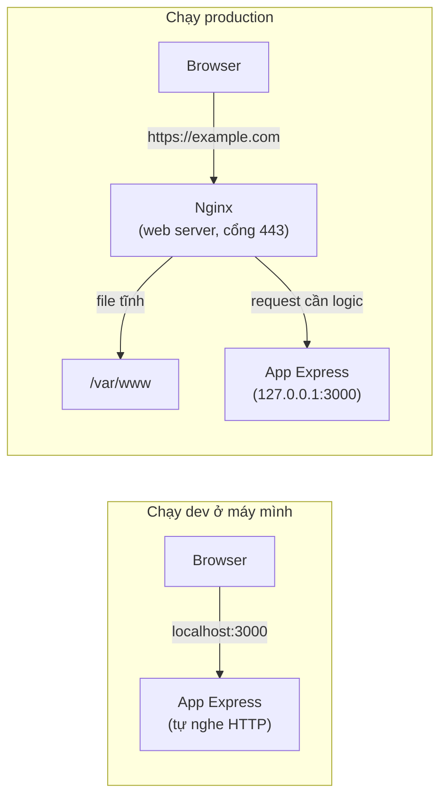

# Web Servers: Nginx, Apache, Caddy

Web server là một **phần mềm** chạy trên máy chủ, nhận request HTTP từ internet và trả về response. Khi lên production, người ta thường đặt một web server chuyên dụng như Nginx đứng trước app Node/Python của bạn để làm "người gác cửa": tự trả file tĩnh, xử lý HTTPS, rồi chuyển request cần logic vào app. Bài này giải thích web server là gì, vì sao cần nó dù app đã tự nhận được HTTP, sau đó giới thiệu Nginx, Apache, Caddy cùng hai khái niệm reverse proxy và load balancing.

[](pathname:///img/backend/web-servers.webp)

---

:::note[Ghi nhớ nhanh]

- ⭐ **Web server là phần mềm "gác cửa" HTTP** — đứng giữa internet và app code; việc đơn giản (file tĩnh, HTTPS, nén, chặn spam) thì tự làm, việc cần logic thì chuyển tiếp vào app (reverse proxy).
- ⭐ **App Express/FastAPI cũng là web server**, nhưng chỉ nên lo logic nghiệp vụ — để Nginx nhận request từ internet, app chỉ nghe ở cổng nội bộ.
- ⭐ **`Nginx` là lựa chọn mặc định 2026** — event-driven nên chịu tải cao, nhẹ (~2MB/worker); `Caddy` mạnh ở auto HTTPS, `Apache` lâu đời với `.htaccess`.
- **Reverse proxy** — ẩn app nội bộ, để Nginx handle TLS còn app chỉ chạy HTTP; app nên bind `127.0.0.1:3000`, đừng expose port trực tiếp.
- **Load balancing** — thuật toán round-robin, `least_conn`, `ip_hash`; Layer 4 (TCP, nhanh) vs Layer 7 (HTTP, linh hoạt).
- **Sticky session** gây bug khi scale stateful app — ưu tiên stateless `JWT` hoặc shared session store (`Redis`).

:::

---

## Mục lục

- [Web server là gì?](#web-server-là-gì)
- [Web server làm gì?](#web-server-làm-gì)
- [Nginx (khuyến nghị)](#nginx-khuyến-nghị)
- [Apache](#apache)
- [Caddy](#caddy)
- [Reverse Proxy](#reverse-proxy)
- [Load Balancing](#load-balancing)
- [Câu hỏi phỏng vấn](#câu-hỏi-phỏng-vấn)

---

## Web server là gì?

Nói ngắn nhất: **web server là phần mềm nghe request HTTP ở cổng 80/443 và trả về response HTTP.** Có hai điểm dễ nhầm với người mới, bài giải quyết trước khi đi vào chi tiết.

### Nhầm lẫn 1: web server là phần mềm, không phải cái máy

Từ "server" được dùng cho cả hai thứ:

- **Cái máy** (máy chủ vật lý, VPS, EC2) — phần cứng để chạy chương trình.
- **Phần mềm** nghe ở một cổng và phục vụ client — Nginx, Apache, Caddy.

Trong bài này, "web server" luôn là **phần mềm**. Một cái máy có thể chạy nhiều web server, và một web server có thể phục vụ nhiều website.

### Nhầm lẫn 2: app của tôi đã nhận HTTP rồi, sao còn cần Nginx?

Đúng là Express, FastAPI, Spring Boot **cũng là web server** theo nghĩa hẹp: chúng nghe HTTP và trả response. Khi bạn chạy `npm start` rồi mở `localhost:3000`, bạn đang dùng web server có sẵn trong app.

Khác biệt nằm ở **phân công việc** khi lên production:

| Việc cần làm | App (Express, FastAPI...) | Web server chuyên dụng (Nginx) |
|---|---|---|
| Chạy logic nghiệp vụ | ✅ Việc chính | ❌ Không làm được |
| Trả file tĩnh (HTML, CSS, JS, ảnh) | Được, nhưng chậm, tốn CPU | ✅ Rất nhanh, gần như miễn phí |
| HTTPS | Được, nhưng phải cài chứng chỉ vào từng app | ✅ Xử lý một chỗ, app bên trong chỉ cần HTTP |
| Chịu hàng chục nghìn kết nối chờ | Vài nghìn là mệt | ✅ Tốn rất ít RAM |
| Nhiều app trên một máy | Mỗi app một cổng, user phải nhớ cổng | ✅ Một cổng 443, chia theo tên miền hoặc đường dẫn |
| Chặn spam, giới hạn request | Phải tự code | ✅ Vài dòng config |

Vì vậy mô hình chuẩn là: **Nginx đứng ngoài nhận hết request từ internet**, việc đơn giản tự làm, request cần logic thì chuyển vào app đang nghe ở cổng nội bộ như `3000`. App không bao giờ lộ trực tiếp ra internet.



Đọc sơ đồ: ở dev, browser nói chuyện thẳng với app. Ở production, browser chỉ nói chuyện với Nginx; Nginx tự trả file tĩnh, còn request cần tính toán mới chuyển vào app. Việc "chuyển tiếp vào app" này gọi là **reverse proxy**, sẽ nói kỹ ở mục sau.

:::tip[Ví dụ đời thường]

Web server giống **lễ tân khách sạn**. Khách bước vào không tự đi tìm phòng — họ nói với lễ tân, lễ tân mới dẫn đi:

- Khách xin tờ rơi, bản đồ → lễ tân **đưa luôn** (serve static file).
- Khách cần gặp nhà bếp → lễ tân **gọi nội bộ** xuống bếp (reverse proxy tới app).
- Khách quậy, gọi 100 cuộc một phút → lễ tân **chặn bớt** (rate limit).

Nhờ vậy các phòng ban bên trong (app của bạn) không cần biết gì về người ngoài đường, cứ làm việc của mình.

:::

---

## Web server làm gì?

Các việc "vặt" của HTTP mà web server gánh thay app:

- **Serve static file** — trả thẳng HTML, CSS, JS, ảnh từ ổ đĩa, không cần qua app.
- **Reverse proxy** — nhận request từ ngoài rồi chuyển tiếp vào app chạy ở cổng nội bộ, trả kết quả về cho client như thể chính nó xử lý.
- **SSL termination** — nhận HTTPS từ client, giải mã, rồi nói HTTP thường với app. Chứng chỉ chỉ cần cài một chỗ.
- **Load balancing** — khi có nhiều bản app chạy song song, chia request đều cho các bản đó.
- **Caching** — nhớ tạm response của app để lần sau trả luôn, khỏi gọi app lại.
- **Compression** — nén response bằng gzip/brotli để tải nhanh hơn.
- **Rate limiting** — giới hạn số request mỗi IP trong một khoảng thời gian, chống spam.
- **URL rewrite, redirect** — đổi đường dẫn, chuyển hướng HTTP sang HTTPS, `www` sang không `www`.

Architecture phổ biến, một Nginx phục vụ nhiều app trên cùng một máy:

```
[Internet] → [Nginx] → [Node.js app:3000]
                    → [Python app:8000]
                    → [Static files /var/www]
```

---

## Nginx (khuyến nghị)

**Phổ biến nhất 2026** — fast, light, mature.

:::tip[Ví dụ đời thường]

Hai kiểu phục vụ trong quán ăn:

- **Apache** — mỗi bàn phân **một nhân viên riêng** đứng cạnh chờ. 1000 bàn thì cần 1000 nhân viên, quán chật cứng người đứng không (thread/process per connection, tốn RAM).
- **Nginx** — **một nhân viên chạy vòng** qua tất cả các bàn, bàn nào giơ tay thì ghé. Phần lớn thời gian khách chỉ ngồi đợi món, nên một người lo được cả trăm bàn (event loop).

Vì thế Nginx nhẹ hơn hẳn khi có rất nhiều kết nối cùng lúc mà đa số đang... rảnh.

:::

Config cơ bản:

```nginx
# /etc/nginx/sites-available/example.com
server {
  listen 80;
  listen [::]:80;
  server_name example.com www.example.com;

  # Redirect HTTP → HTTPS
  return 301 https://$server_name$request_uri;
}

server {
  listen 443 ssl http2;
  listen [::]:443 ssl http2;
  server_name example.com www.example.com;

  ssl_certificate /etc/letsencrypt/live/example.com/fullchain.pem;
  ssl_certificate_key /etc/letsencrypt/live/example.com/privkey.pem;

  # Proxy to Node app
  location / {
    proxy_pass http://localhost:3000;
    proxy_http_version 1.1;
    proxy_set_header Upgrade $http_upgrade;
    proxy_set_header Connection 'upgrade';
    proxy_set_header Host $host;
    proxy_set_header X-Real-IP $remote_addr;
    proxy_set_header X-Forwarded-For $proxy_add_x_forwarded_for;
    proxy_set_header X-Forwarded-Proto $scheme;
    proxy_cache_bypass $http_upgrade;
  }

  # Static files
  location /static/ {
    alias /var/www/example/static/;
    expires 1y;
    add_header Cache-Control "public, immutable";
  }
}
```

Reload config:

```bash
sudo nginx -t        # test syntax
sudo nginx -s reload # reload không downtime
```

:::info[Phân tích]

**Tại sao Nginx phổ biến?**

1. **Event-driven** — handle 10k+ connection / process.
2. **Low memory** — ~2MB per worker.
3. **Mature** — 20+ năm, battle-tested.
4. **Config flexible** — nhiều use case.
5. **Module rich** — gzip, cache, rate limit, auth.

Compare Apache:

- Nginx async event loop, Apache thread/process per connection.
- Nginx faster cho static + high concurrent.
- Apache flexible config `.htaccess` per directory.

Năm 2026, Nginx default cho VPS deploy. Đối thủ chính: **Caddy** (modern,
auto HTTPS), **HAProxy** (load balancer thuần).

:::

---

## Apache

**Lâu đời nhất** — Apache HTTP Server, 1995+.

Setup:

```apache
# /etc/apache2/sites-available/example.com.conf
<VirtualHost *:80>
  ServerName example.com
  Redirect / https://example.com/
</VirtualHost>

<VirtualHost *:443>
  ServerName example.com

  SSLEngine on
  SSLCertificateFile /etc/letsencrypt/live/example.com/fullchain.pem
  SSLCertificateKeyFile /etc/letsencrypt/live/example.com/privkey.pem

  ProxyPreserveHost On
  ProxyPass / http://localhost:3000/
  ProxyPassReverse / http://localhost:3000/
</VirtualHost>
```

**`.htaccess`** — config per directory:

```apache
# .htaccess
RewriteEngine On
RewriteRule ^old-page/?$ /new-page [L,R=301]
```

Phù hợp:

- WordPress hosting truyền thống.
- Shared hosting environment.
- Legacy app `.htaccess` setup.

Nhược điểm so Nginx: chậm hơn under high load, memory cao hơn.

---

## Caddy

**Modern web server** — **auto HTTPS** mặc định.

```bash
# Caddyfile (config siêu đơn giản)
example.com {
  reverse_proxy localhost:3000

  handle_path /static/* {
    root * /var/www/static
    file_server
  }
}
```

Lợi ích:

- **Auto Let's Encrypt** — không cần Certbot setup.
- **Config gọn** — vài dòng cho most case.
- **HTTP/3** native.
- **Modern defaults** — secure cipher, HSTS.

Phù hợp:

- Project nhỏ-vừa cần SSL nhanh.
- Dev không muốn config Nginx phức tạp.
- Side project, prototype.

Trade-off:

- Cộng đồng nhỏ hơn Nginx.
- Ít tài liệu cho edge case.
- Performance OK nhưng kém Nginx high-load.

---

## Reverse Proxy

**Reverse Proxy** đứng trước app, forward request.

:::tip[Ví dụ đời thường]

Reverse proxy giống **hộp thư chung của một chung cư**. Người gửi chỉ biết địa chỉ toà nhà, bỏ thư vào một cửa duy nhất; bảo vệ mới chia thư về từng căn hộ.

- Người lạ **không biết** bạn ở căn nào (client không biết app chạy port 3000).
- Bảo vệ **loại thư rác** trước khi phát (rate limit, chặn bot).
- Thư niêm phong được bảo vệ **bóc bao ngoài** rồi mới đưa vào (SSL termination — Nginx lo HTTPS, app chỉ nói HTTP cho gọn).

Cái giá: mọi thư đều đi qua một cửa. Bảo vệ nghỉ thì cả toà nhà mất liên lạc, nên khâu này phải thật chắc.

:::

Lợi ích:

- **Hide internal** — client chỉ thấy port 443, không biết Node port 3000.
- **SSL termination** — Nginx handle TLS, app dùng HTTP đơn giản.
- **Load balance** nhiều app instance.
- **Caching** static response.
- **Security** — block bot, rate limit edge.
- **Compression** — gzip/brotli automatic.

```
[Client HTTPS] → [Nginx :443] → [Node app :3000]
                  ssl term       internal http
```

Cấu trúc thường gặp:

```nginx
upstream backend {
  server 127.0.0.1:3000;
  server 127.0.0.1:3001;
  server 127.0.0.1:3002;
}

server {
  listen 443 ssl http2;
  server_name api.example.com;

  location / {
    proxy_pass http://backend;
    # ... headers
  }
}
```

---

## Load Balancing

**Phân phối** request giữa nhiều server.

:::tip[Ví dụ đời thường]

Bạn là **người điều phối khách vào các quầy** trong siêu thị. Cách chia khách chính là thuật toán load balancing:

| Cách chia | Ngoài đời | Trong Nginx |
| --- | --- | --- |
| Lần lượt | Khách 1 vào quầy A, khách 2 quầy B, khách 3 lại quầy A... | Round-robin (mặc định) |
| Theo sức | Quầy có 2 thu ngân thì nhận gấp đôi khách | `weight=3` |
| Ai đang rảnh | Nhìn hàng nào ngắn nhất thì đẩy khách vào | `least_conn` |
| Khách quen về đúng quầy | Người này lần nào cũng vào quầy A | `ip_hash` (sticky) |

Chia lần lượt nghe công bằng, nhưng chỉ cần một ông khách mua 100 món là quầy đó tắc — lúc ấy `least_conn` sát thực tế hơn.

:::

**Algorithms** Nginx:

```nginx
upstream backend {
  # Round-robin (default)
  server srv1:3000;
  server srv2:3000;

  # Weighted
  server srv1:3000 weight=3;  # gấp 3 lần
  server srv2:3000 weight=1;

  # Least connections
  least_conn;
  server srv1:3000;
  server srv2:3000;

  # IP hash (sticky session)
  ip_hash;
  server srv1:3000;
  server srv2:3000;
}
```

**Health check**:

```nginx
upstream backend {
  server srv1:3000 max_fails=3 fail_timeout=30s;
  server srv2:3000 max_fails=3 fail_timeout=30s;
  server srv3:3000 backup;  # chỉ dùng khi srv1+srv2 down
}
```

**Layer 4 vs Layer 7**:

- **Layer 4 (TCP)** — load balance theo IP/port, fast (HAProxy).
- **Layer 7 (HTTP)** — load balance theo URL/header, flexible (Nginx).

:::tip[Ví dụ đời thường]

Vẫn là chuyện bảo vệ chia thư, nhưng hai mức khác nhau:

- **Layer 4** — chỉ liếc **địa chỉ ngoài phong bì** rồi ném sang xe nào đang trống. Nhanh, nhưng không biết bên trong viết gì.
- **Layer 7** — **mở thư đọc nội dung**: thư đặt hàng chuyển phòng kinh doanh, thư khiếu nại chuyển chăm sóc khách hàng (route theo URL, header).

Cái giá: đọc thư thì chậm hơn ném phong bì. Đổi lại bạn mới làm được kiểu `/api` đi một cụm server, `/static` đi cụm khác.

:::

Cloud load balancer:

- **AWS ALB** (Application Load Balancer) — Layer 7.
- **AWS NLB** (Network Load Balancer) — Layer 4.
- **GCP Load Balancing**.
- **CloudFlare Load Balancer**.

:::info[Phân tích]

**Sticky sessions** — vấn đề scale stateful app:

```
Bug: User login → server 1 lưu session.
     Request tiếp → server 2 không có session → logout!
```

Fix:

**1. Sticky session** (IP hash) — user luôn về cùng server.
- Đơn giản, nhưng load uneven.

**2. Shared session store** (Redis):
- Mọi server đọc/ghi Redis.
- Phổ biến + recommend.

**3. Stateless JWT**:
- Token tự chứa info, không cần server store.
- Scale tốt nhất.

→ Modern app prefer **stateless** (JWT) hoặc **shared Redis** thay vì
sticky session.

:::

:::tip[Mẹo]

**Pattern deploy production VPS 2026**:

```
[CloudFlare]            ← CDN + DDoS + SSL
    ↓
[Nginx]                 ← Reverse proxy + cache static
    ↓
[Docker container]
├─ Node app instances   ← App backend
├─ PostgreSQL          ← DB
└─ Redis               ← Cache + queue
```

Hoặc dùng PaaS bỏ qua Nginx:

```
[Vercel / Render / Fly.io]  ← Built-in CDN, SSL, scaling
    ↓
[App container]
    ↓
[Managed Postgres + Redis]
```

PaaS đắt hơn nhưng tiết kiệm ops time. VPS cheap hơn nhưng tự maintain.

:::

:::warning[Cần lưu ý]

**Đừng expose app port trực tiếp**:

```
# SAI
ufw allow 3000/tcp     # expose Node app port

# ĐÚNG
ufw allow 80/tcp
ufw allow 443/tcp
ufw deny 3000           # nội bộ only
```

App nên bind `127.0.0.1:3000`, chỉ Nginx local truy cập:

```js
// Express
app.listen(3000, "127.0.0.1");  // not 0.0.0.0
```

Defense in depth: dù Nginx mis-config, app vẫn không accessible direct.

:::

---

## Câu hỏi phỏng vấn

Những câu thường gặp về chủ đề này. Tự trả lời trước, rồi bấm **Xem đáp án** để đối chiếu.

**1. Web server làm những việc gì? Vì sao không nên để app code (Node/Python) trực tiếp nhận request từ internet?**

<details className="qa">
<summary>Xem đáp án</summary>

Web server là phần mềm nghe HTTP ở cổng 80/443 và gánh các việc "vặt" của giao thức: serve static file, reverse proxy vào app, SSL termination, load balancing, caching, nén gzip/brotli, rate limiting, rewrite và redirect.

Express hay FastAPI cũng là web server theo nghĩa hẹp, nhưng lên production thì nên **phân công lại**:

| Việc | App | Nginx |
|---|---|---|
| Logic nghiệp vụ | Việc chính | Không làm được |
| File tĩnh | Chậm, tốn CPU | Rất nhanh |
| HTTPS | Cài cert vào từng app | Xử lý một chỗ |
| Hàng chục nghìn kết nối chờ | Vài nghìn là mệt | Tốn rất ít RAM |
| Nhiều app một máy | Mỗi app một cổng | Một cổng 443, chia theo tên miền |

Ngoài ra còn lý do an toàn: app lộ thẳng ra internet thì mất lớp chắn trước, mọi request rác đều tốn tài nguyên của tiến trình chạy logic, và deploy bản mới không có chỗ nào để drain kết nối. Mô hình chuẩn là Nginx nhận hết, app chỉ nghe ở `127.0.0.1:3000`.

</details>

**2. Phân biệt `forward proxy` và `reverse proxy`. Mỗi loại đứng ở phía nào và phục vụ ai?**

<details className="qa">
<summary>Xem đáp án</summary>

| | `Forward proxy` | `Reverse proxy` |
|---|---|---|
| Đứng ở đâu | Trước **client** | Trước **server** |
| Phục vụ ai | Người dùng | Chủ hệ thống |
| Ai biết nó tồn tại | Client phải cấu hình | Client không biết, tưởng đang nói chuyện thẳng với site |
| Giấu ai | Giấu client khỏi server | Giấu server khỏi client |
| Ví dụ | Proxy công ty, VPN, Squid | Nginx, Caddy, Cloudflare, ALB |

Forward proxy gom traffic của một nhóm người dùng đi ra internet: lọc nội dung, ghi log, cache, vượt chặn địa lý.

Reverse proxy làm ngược lại — bài ví như hộp thư chung của chung cư: người gửi chỉ biết địa chỉ toà nhà, bảo vệ mới chia thư về từng căn. Client thấy duy nhất cổng 443, không biết Node đang chạy ở cổng 3000. Nhờ đó reverse proxy làm được SSL termination, load balancing, cache, rate limit và chặn bot ở ngay biên.

Cả hai đều "trung gian", chỉ khác nhau ở chỗ đứng và ở chỗ ai là người cấu hình chúng.

</details>

**3. Vì sao `Nginx` chịu tải cao hơn Apache ở cùng cấu hình? So sánh mô hình `event-driven` với `process/thread-per-request`.**

<details className="qa">
<summary>Xem đáp án</summary>

Khác biệt nằm ở mô hình xử lý kết nối, đúng như hình ảnh quán ăn trong bài:

- **Apache (mặc định prefork/worker)** — mỗi kết nối chiếm một process hoặc thread riêng. 1000 kết nối là 1000 nhân viên đứng cạnh bàn. Mỗi thread tốn vài MB stack, và khi số thread lớn thì hệ điều hành mất nhiều thời gian chuyển ngữ cảnh hơn là làm việc thật.
- **Nginx** — vài worker process, mỗi worker chạy một vòng lặp sự kiện quét hàng nghìn kết nối, kết nối nào có dữ liệu mới xử lý. Khoảng 2 MB RAM mỗi worker, xử lý được hơn 10 nghìn kết nối đồng thời.

Điểm mấu chốt: phần lớn kết nối HTTP dành **đa số thời gian để chờ** — chờ client gửi nốt, chờ mạng chậm, chờ upstream trả lời. Mô hình một luồng một kết nối đốt tài nguyên cho việc ngồi chờ, còn event loop thì chỉ tốn một entry trong bảng theo dõi.

Nhờ vậy Nginx đặc biệt vượt trội với file tĩnh, kết nối keep-alive nhiều, và các cuộc tấn công giữ kết nối chậm. Apache có MPM event để cải thiện, nhưng module PHP truyền thống lại buộc quay về mô hình cũ.

</details>

**4. So sánh Nginx, Apache và Caddy. Dự án mới bạn chọn cái nào và vì sao?**

<details className="qa">
<summary>Xem đáp án</summary>

| | Nginx | Apache | Caddy |
|---|---|---|---|
| Mô hình | Event-driven | Process/thread per connection | Event-driven (Go) |
| HTTPS | Cần Certbot | Cần Certbot | **Tự động** mặc định |
| Config | Linh hoạt, hơi dài | `.htaccess` theo thư mục | Ngắn nhất |
| HTTP/3 | Có (bản mới) | Hạn chế | Native |
| Cộng đồng | Lớn nhất | Lớn, nhiều tài liệu cũ | Nhỏ hơn |
| Hợp với | Mặc định cho production | WordPress, shared hosting | Project nhỏ, prototype |

Lựa chọn thực tế:

- **Nginx** cho hệ thống production nghiêm túc: tài liệu nhiều nhất, mọi vấn đề đều đã có người gặp, hiệu năng cao ở tải lớn, và gần như mọi hướng dẫn deploy đều viết cho nó.
- **Caddy** khi ưu tiên tốc độ dựng: side project, nội bộ, demo — vài dòng Caddyfile là có HTTPS tự động, khỏi đụng tới Certbot.
- **Apache** chủ yếu khi kế thừa hệ thống cũ, chạy WordPress hoặc shared hosting phụ thuộc `.htaccess`.

Với một dự án mới trên VPS, tôi chọn Nginx; nếu đội nhỏ và không có người chuyên ops thì Caddy là đánh đổi rất hợp lý.

</details>

**5. `.htaccess` của Apache tiện ở điểm gì và đánh đổi lại điều gì về hiệu năng?**

<details className="qa">
<summary>Xem đáp án</summary>

`.htaccess` là file cấu hình đặt **ngay trong thư mục** được phục vụ:

```apache
RewriteEngine On
RewriteRule ^old-page/?$ /new-page [L,R=301]
```

Tiện ở chỗ:

- **Không cần quyền root và không cần restart** — sửa file là có hiệu lực ngay. Đây là lý do shared hosting sống nhờ nó: mỗi khách tự cấu hình phần của mình mà không đụng tới cấu hình chung.
- **Phân quyền theo thư mục** — mỗi ứng dụng, mỗi khách hàng có luật riêng.
- Đi kèm mã nguồn nên deploy là mang theo cấu hình (WordPress, Laravel dựa hẳn vào điều này).

Cái giá là hiệu năng: vì có hiệu lực tức thì nên Apache phải **kiểm tra lại với mỗi request**, và không chỉ một file — nó dò `.htaccess` ở từng cấp thư mục trên đường dẫn. Mỗi request thành vài lần truy cập đĩa cộng với việc parse lại luật, không cache được.

Vì vậy khuyến nghị chuẩn: khi có quyền quản trị, hãy tắt `AllowOverride` và đưa cấu hình vào file chính. Nginx cố ý không có cơ chế tương đương, đổi lại phải reload sau mỗi lần sửa.

</details>

**6. Trong Nginx, `server` block và `location` block khác nhau ra sao? Nginx chọn `location` khớp theo thứ tự ưu tiên nào?**

<details className="qa">
<summary>Xem đáp án</summary>

`server` block định nghĩa một **virtual host**: nghe cổng nào, phục vụ tên miền nào, dùng certificate nào. Nginx chọn server block dựa trên cổng và `server_name` khớp với header `Host`. `location` nằm bên trong server block và chọn xử lý theo **đường dẫn** của request.

```nginx
server {
  listen 443 ssl http2;
  server_name api.example.com;

  location / { proxy_pass http://backend; }
  location /static/ { alias /var/www/example/static/; }
}
```

Thứ tự ưu tiên khi chọn `location`:

1. Khớp chính xác `location = /path` — trúng là dùng ngay, dừng tìm.
2. Tìm prefix khớp **dài nhất** và ghi nhớ lại.
3. Nếu prefix đó khai báo `^~` thì dùng luôn, bỏ qua bước regex.
4. Xét các regex `~` (phân biệt hoa thường) và `~*` (không phân biệt) **theo thứ tự xuất hiện trong file**; regex đầu tiên khớp sẽ thắng.
5. Không regex nào khớp thì quay lại dùng prefix dài nhất đã ghi nhớ.

Điểm dễ nhầm: prefix xét theo **độ dài**, còn regex xét theo **thứ tự viết** — nên đảo thứ tự các khối regex có thể đổi hành vi.

</details>

**7. Giải thích `SSL/TLS termination` tại reverse proxy. Sau khi terminate, traffic từ Nginx tới app nên đi HTTP hay HTTPS?**

<details className="qa">
<summary>Xem đáp án</summary>

`SSL termination` nghĩa là Nginx là điểm kết thúc của kết nối TLS: nó giữ certificate, giải mã HTTPS từ client, rồi nói **HTTP thường** với app phía sau. Bài ví như bảo vệ bóc bao ngoài của thư niêm phong rồi mới đưa vào trong.

Lợi ích: chứng chỉ chỉ cài và gia hạn một chỗ, app không phải biết gì về TLS, và việc mã hoá tập trung giúp cấu hình cipher/HSTS đồng nhất.

Chặng Nginx tới app nên đi HTTP hay HTTPS phụ thuộc chặng đó nằm ở đâu:

- **Cùng một máy**, app bind `127.0.0.1:3000` — HTTP là đủ, vì gói tin không rời khỏi máy. Đây là mô hình phổ biến nhất.
- **Qua mạng nội bộ đáng tin**, ví dụ cùng một VPC riêng — HTTP thường vẫn chấp nhận được, nhiều nơi làm vậy để đỡ chi phí.
- **Qua mạng không kiểm soát** hoặc yêu cầu tuân thủ (PCI, zero-trust) — phải mã hoá lại chặng trong, gọi là **re-encryption** hoặc TLS passthrough.

Nhớ kèm `proxy_set_header X-Forwarded-Proto $scheme;` để app biết client thực ra đang dùng HTTPS, nếu không thì redirect và sinh URL tuyệt đối sẽ sai.

</details>

**8. Đứng sau reverse proxy, app lấy IP thật của client bằng cách nào? Vai trò của `X-Forwarded-For`, `X-Real-IP`, và rủi ro nếu tin header này vô điều kiện?**

<details className="qa">
<summary>Xem đáp án</summary>

Ở tầng TCP, app chỉ thấy IP của Nginx (thường là `127.0.0.1`), nên IP thật phải được truyền qua header:

```nginx
proxy_set_header X-Real-IP $remote_addr;
proxy_set_header X-Forwarded-For $proxy_add_x_forwarded_for;
proxy_set_header X-Forwarded-Proto $scheme;
```

- `X-Real-IP` — một giá trị duy nhất, IP của client kết nối tới Nginx.
- `X-Forwarded-For` — **danh sách** tích luỹ qua từng proxy, dạng `client, proxy1, proxy2`. Biến `$proxy_add_x_forwarded_for` nối thêm IP hiện tại vào giá trị client gửi lên.

Rủi ro khi tin vô điều kiện: header do **client tự đặt được**. Kẻ tấn công gửi `X-Forwarded-For: 1.2.3.4` là qua mặt rate limit theo IP, giả mạo log, thậm chí vượt các luật chỉ cho phép IP nội bộ. Lấy phần tử đầu tiên của chuỗi là lấy đúng thứ kẻ tấn công bịa ra.

Cách làm đúng: khai báo proxy tin cậy và **đếm ngược từ bên phải** đúng số hop do hạ tầng của bạn thêm vào. Express có `app.set("trust proxy", 1)`, Nginx có module `realip` với `set_real_ip_from`. Nếu đứng sau CDN, chỉ tin dải IP của CDN đó.

</details>

**9. So sánh các thuật toán load balancing: round-robin, `weight`, `least_conn`, `ip_hash`. Tình huống nào round-robin gây tắc nghẽn?**

<details className="qa">
<summary>Xem đáp án</summary>

| Thuật toán | Cách chia | Hợp khi nào |
|---|---|---|
| Round-robin (mặc định) | Lần lượt từng server | Server đồng nhất, request đồng đều |
| `weight` | Server mạnh nhận nhiều hơn | Phần cứng không đồng đều |
| `least_conn` | Đẩy vào nơi đang ít kết nối nhất | Thời gian xử lý chênh lệch nhiều |
| `ip_hash` | Cùng IP luôn về cùng server | Cần sticky session |

```nginx
upstream backend {
  least_conn;
  server srv1:3000 weight=3;
  server srv2:3000;
}
```

Round-robin gây tắc khi **thời gian xử lý mỗi request rất khác nhau**. Nó chỉ đếm lượt chứ không nhìn server đang bận tới đâu, nên giống chuyện chia khách siêu thị trong bài: chia lần lượt nghe rất công bằng, nhưng chỉ cần một ông khách mua 100 món là quầy đó tắc mà vẫn tiếp tục bị đẩy khách vào.

Tình huống thực tế: endpoint xuất báo cáo chạy 30 giây xen lẫn endpoint đọc nhanh 10ms, tải file lớn, kết nối WebSocket dài, hoặc một instance vừa khởi động còn đang nạp cache. Những lúc đó `least_conn` bám sát thực tế hơn nhiều.

</details>

**10. Load balancing ở `Layer 4` khác `Layer 7` thế nào? Đánh đổi giữa tốc độ và khả năng route ra sao?**

<details className="qa">
<summary>Xem đáp án</summary>

| | Layer 4 (TCP) | Layer 7 (HTTP) |
|---|---|---|
| Nhìn thấy gì | IP, port | URL, header, cookie, method |
| Xử lý TLS | Chuyển tiếp nguyên gói | Thường terminate tại đây |
| Tốc độ | Nhanh hơn, độ trễ thấp | Chậm hơn vì phải parse |
| Khả năng route | Chỉ chia theo kết nối | Route theo đường dẫn, A/B test, rewrite |
| Ví dụ | HAProxy chế độ TCP, AWS NLB | Nginx, AWS ALB |

Bài ví rất gọn: Layer 4 chỉ liếc địa chỉ ngoài phong bì rồi ném sang xe nào đang trống; Layer 7 mở thư đọc nội dung để chuyển đúng phòng ban.

Đánh đổi: đọc thư thì chậm hơn ném phong bì, và Layer 7 phải giữ trạng thái HTTP, giải mã TLS, dựng lại kết nối phía sau nên tốn CPU hơn. Bù lại chỉ Layer 7 mới làm được những việc như `/api` đi một cụm server còn `/static` đi cụm khác, chia traffic theo phiên bản, viết lại header, cache response, hoặc trả lỗi thân thiện khi upstream chết.

Thực tế nhiều hệ thống dùng cả hai: NLB ở ngoài cùng cho thông lượng và IP tĩnh, rồi Nginx/ALB phía sau lo phần định tuyến theo nội dung.

</details>

**11. `sticky session` giải quyết vấn đề gì và tạo ra vấn đề gì khi scale? Bạn thay thế nó bằng cách nào?**

<details className="qa">
<summary>Xem đáp án</summary>

Vấn đề gốc là app **stateful**:

```
User login → server 1 lưu session trong RAM
Request tiếp → load balancer đẩy sang server 2 → không có session → logout!
```

`sticky session` (trong Nginx là `ip_hash`) chữa bằng cách buộc một người dùng luôn về đúng một server. Đơn giản, không phải sửa code.

Nhưng nó đẻ ra vấn đề khác khi scale:

- **Tải lệch** — băm theo IP không đảm bảo đều, và người dùng sau NAT của cả công ty dồn hết vào một server.
- **Thêm server mới không được chia việc**, vì người dùng cũ đã bị gắn chỗ.
- **Mất session khi một server chết** hoặc khi deploy, người dùng bị đăng xuất hàng loạt.
- **Cản trở autoscaling và rolling deploy** vì không thể rút server ra êm.

Thay thế theo thứ tự ưu tiên:

- **Shared session store** với Redis — mọi server đọc ghi chung, phổ biến và được khuyến nghị, vẫn giữ được khả năng thu hồi phiên.
- **Stateless JWT** — token tự chứa thông tin, scale tốt nhất, nhưng thu hồi khó nên cần thời hạn ngắn kèm refresh token.

Nguyên tắc: làm app stateless rồi mới nói chuyện scale.

</details>

**12. Nginx phát hiện một upstream chết bằng cơ chế nào (`max_fails`, `fail_timeout`, `backup`)? Request đang xử lý dở sẽ ra sao?**

<details className="qa">
<summary>Xem đáp án</summary>

Bản mã nguồn mở của Nginx dùng **passive health check** — nó không chủ động thăm dò mà quan sát chính các request thật:

```nginx
upstream backend {
  server srv1:3000 max_fails=3 fail_timeout=30s;
  server srv2:3000 max_fails=3 fail_timeout=30s;
  server srv3:3000 backup;  # chỉ dùng khi srv1+srv2 down
}
```

- `max_fails` — số lần lỗi liên tiếp trong khoảng `fail_timeout` thì server bị coi là hỏng.
- `fail_timeout` mang hai nghĩa: cửa sổ đếm lỗi, và khoảng thời gian tạm loại server ra khỏi vòng quay. Hết thời gian đó, Nginx thử lại.
- `backup` — chỉ nhận request khi tất cả server chính đã hỏng.

Với request đang dở: nếu lỗi xảy ra **trước khi upstream trả về byte đầu tiên** (kết nối bị từ chối, timeout, lỗi 502), Nginx tự thử server tiếp theo theo `proxy_next_upstream` nên client không thấy gì bất thường. Nhưng nếu response đã bắt đầu truyền thì không quay lại được, client nhận kết nối đứt.

Lưu ý: mặc định Nginx **không** retry request `POST` không idempotent, và health check chủ động (`health_check`) chỉ có ở Nginx Plus hoặc phải dùng HAProxy.

</details>

**13. Cần cấu hình thêm gì để Nginx proxy được `WebSocket`? Vì sao cấu hình proxy mặc định làm rớt kết nối?**

<details className="qa">
<summary>Xem đáp án</summary>

Cần ba dòng, đúng như trong config mẫu của bài:

```nginx
location / {
  proxy_pass http://localhost:3000;
  proxy_http_version 1.1;
  proxy_set_header Upgrade $http_upgrade;
  proxy_set_header Connection "upgrade";
  proxy_read_timeout 3600s;   # tránh bị cắt khi im lặng lâu
}
```

Vì sao mặc định hỏng: WebSocket bắt đầu bằng một request HTTP có `Connection: Upgrade` và `Upgrade: websocket`, server trả `101 Switching Protocols` rồi hai bên giữ nguyên kết nối TCP để nói chuyện hai chiều. Hai thứ trong mặc định phá vỡ điều đó:

- Nginx proxy bằng **HTTP/1.0** với upstream, mà HTTP/1.0 không có cơ chế upgrade.
- `Connection` và `Upgrade` là **header hop-by-hop**, proxy mặc định không chuyển tiếp chúng. App không nhận được yêu cầu nâng cấp nên trả về response HTTP thường, client báo lỗi handshake.

Lỗi thứ hai hay gặp sau khi đã chạy được: kết nối tự rớt sau 60 giây vì `proxy_read_timeout` mặc định, do WebSocket có thể im lặng rất lâu. Chỉnh timeout hoặc bật ping/pong định kỳ ở tầng ứng dụng.

</details>

**14. Bạn cấu hình rate limiting và giới hạn kích thước upload ở Nginx như thế nào? Vì sao nên chặn ở tầng này thay vì tầng app?**

<details className="qa">
<summary>Xem đáp án</summary>

```nginx
# Vùng đếm dùng chung, khoá theo IP
limit_req_zone $binary_remote_addr zone=api:10m rate=10r/s;

server {
  client_max_body_size 10m;      # chặn upload quá lớn

  location /api/ {
    limit_req zone=api burst=20 nodelay;
    limit_conn_status 429;
    proxy_pass http://backend;
  }
}
```

`limit_req_zone` khai báo khoá đếm và tốc độ cho phép, `burst` cho phép dồn một cụm ngắn, `nodelay` xử lý ngay thay vì xếp hàng. Ngoài ra có `limit_conn` giới hạn số kết nối đồng thời.

Vì sao nên chặn ở tầng này:

- **Rẻ hơn rất nhiều** — request bị từ chối ngay ở vòng lặp sự kiện, không tốn một tiến trình app, không chạm database.
- **Bảo vệ được cả lúc app đang quá tải**, đúng lúc cần nhất.
- **Chặn trước khi nhận hết body** — `client_max_body_size` trả `413` ngay, tránh việc app phải đọc và ghi tạm một file khổng lồ.
- **Áp dụng thống nhất** cho mọi app phía sau, không phải cài lại từng nơi.

Vẫn nên có rate limit ở tầng app cho các luật theo nghiệp vụ (theo tài khoản, theo API key) — hai tầng bổ sung cho nhau chứ không thay thế.

</details>

**15. Vì sao nên bind app vào `127.0.0.1` thay vì `0.0.0.0`? Giải thích theo nguyên tắc `defense in depth`.**

<details className="qa">
<summary>Xem đáp án</summary>

`0.0.0.0` nghĩa là nghe trên **mọi network interface**, kể cả IP công cộng — ai biết địa chỉ máy và cổng là gọi thẳng được. `127.0.0.1` chỉ nghe ở loopback, tức chỉ tiến trình trên chính máy đó mới kết nối được, và Nginx là một trong số đó.

```js
app.listen(3000, "127.0.0.1");  // không phải 0.0.0.0
```

```
ufw allow 80/tcp
ufw allow 443/tcp
ufw deny 3000       # nội bộ only
```

Đây là `defense in depth` vì tường lửa đã chặn cổng 3000 rồi, nhưng bạn vẫn bind loopback để phòng trường hợp **lớp kia hỏng**: ai đó sửa luật firewall lúc gỡ lỗi rồi quên trả lại, container map nhầm cổng, nhà cung cấp cloud đổi security group mặc định, hoặc máy có thêm một interface mới. Mỗi lớp chặn một kiểu sai sót khác nhau, nên giữ cả hai thì phải hỏng đồng thời mới thủng.

Hệ quả nếu để lộ cổng app: mọi lớp bảo vệ đặt ở Nginx đều bị đi vòng — rate limit, chặn bot, bắt buộc HTTPS, kiểm header. Với Docker thì tương đương việc map `127.0.0.1:3000:3000` thay vì `3000:3000`.

</details>

**16. Người dùng báo lỗi `502 Bad Gateway`. Bạn debug theo thứ tự nào? Phân biệt `502`, `503` và `504`.**

<details className="qa">
<summary>Xem đáp án</summary>

| Mã | Ý nghĩa | Nguyên nhân thường gặp |
|---|---|---|
| `502` | Upstream trả về phản hồi không hợp lệ hoặc từ chối kết nối | App chết, crash, sai cổng, sai socket |
| `503` | Không có upstream nào phục vụ được | Mọi server bị đánh dấu hỏng, hoặc chính Nginx đang chặn vì rate limit |
| `504` | Upstream nhận request nhưng trả lời quá chậm | Query chậm, deadlock, gọi API ngoài treo |

Thứ tự debug cho `502`:

1. **Đọc error log của Nginx** — `tail -f /var/log/nginx/error.log`. Dòng lỗi thường nói thẳng "connect() failed (111: Connection refused)".
2. **Kiểm app còn sống không** — trạng thái systemd/PM2/container, và log của chính app xem có crash gần đây.
3. **Gọi thẳng upstream từ trên máy** — `curl -v http://127.0.0.1:3000/health`. Chạy được nghĩa là lỗi nằm ở cấu hình proxy, không chạy được thì lỗi ở app.
4. **Đối chiếu cổng và địa chỉ** trong `proxy_pass` với cổng app đang nghe thật.
5. **Kiểm quyền và SELinux/AppArmor** nếu dùng unix socket.
6. **Xem tài nguyên** — hết RAM khiến OOM killer giết tiến trình app, hết file descriptor cũng gây triệu chứng tương tự.

</details>

**17. Nginx serve static file nhanh hơn app server ở điểm nào? `gzip`/`brotli`, cache header và `sendfile` đóng vai trò gì?**

<details className="qa">
<summary>Xem đáp án</summary>

Nginx được viết riêng cho việc đọc file và đẩy ra socket, trong khi app server phải đi qua cả router, middleware, và với Node thì còn cạnh tranh với event loop đang chạy logic nghiệp vụ. Mỗi file tĩnh phục vụ bởi app là một lần chiếm dụng tài nguyên vốn nên dành cho xử lý dữ liệu.

Ba cơ chế cụ thể:

- **`sendfile`** — gọi thẳng syscall để chuyển dữ liệu từ page cache của kernel ra socket, không sao chép qua vùng nhớ của tiến trình. Đây là zero-copy, tiết kiệm cả CPU lẫn băng thông bộ nhớ. Đi kèm `tcp_nopush` để gom gói hiệu quả hơn.
- **`gzip`/`brotli`** — nén trước khi gửi, giảm mạnh kích thước HTML/CSS/JS. Tốt nhất là nén sẵn lúc build rồi bật `gzip_static`/`brotli_static` để khỏi tốn CPU nén lại mỗi request; không nén ảnh và video vì chúng đã nén rồi.
- **Cache header** — như trong config mẫu, `expires 1y` kèm `Cache-Control: public, immutable` cho asset có hash trong tên file, để trình duyệt không hỏi lại lần nào nữa. Kết hợp `ETag` cho file có thể đổi.

Thêm `open_file_cache` để giảm số lần `stat` ổ đĩa với site nhiều file nhỏ.

</details>

**18. Làm sao reload config hoặc deploy bản mới mà không downtime? Giải thích `nginx -s reload` và graceful shutdown ở phía upstream.**

<details className="qa">
<summary>Xem đáp án</summary>

Phía Nginx:

```bash
sudo nginx -t        # luôn test cú pháp trước
sudo nginx -s reload
```

`reload` không giết tiến trình. Master process đọc config mới, **sinh ra worker mới** phục vụ request đến từ giờ, rồi báo worker cũ ngừng nhận kết nối mới nhưng **xử lý nốt** những request đang dở trước khi tự thoát. Trong khoảng chuyển tiếp, hai thế hệ worker cùng chạy nên không có giây nào cổng 443 bị bỏ trống. Nếu config sai thì master giữ nguyên bản cũ — đó là lý do `nginx -t` phải chạy trước.

Phía upstream, deploy không downtime cần app biết **graceful shutdown**:

1. Nhận `SIGTERM` thì lập tức cho health check trả về trạng thái hỏng, để load balancer rút mình ra khỏi vòng quay.
2. Ngừng nhận kết nối mới nhưng phục vụ nốt request đang chạy, đóng keep-alive.
3. Chờ hết một khoảng drain rồi mới đóng kết nối database và thoát, kèm timeout cứng để không treo mãi.

Kết hợp lại là **rolling deploy**: khởi động instance mới, chờ health check xanh, thêm vào upstream, rút instance cũ ra rồi mới tắt. Với một máy đơn thì chạy hai cổng và đổi `proxy_pass` rồi reload — chính là blue-green thu nhỏ.

</details>
