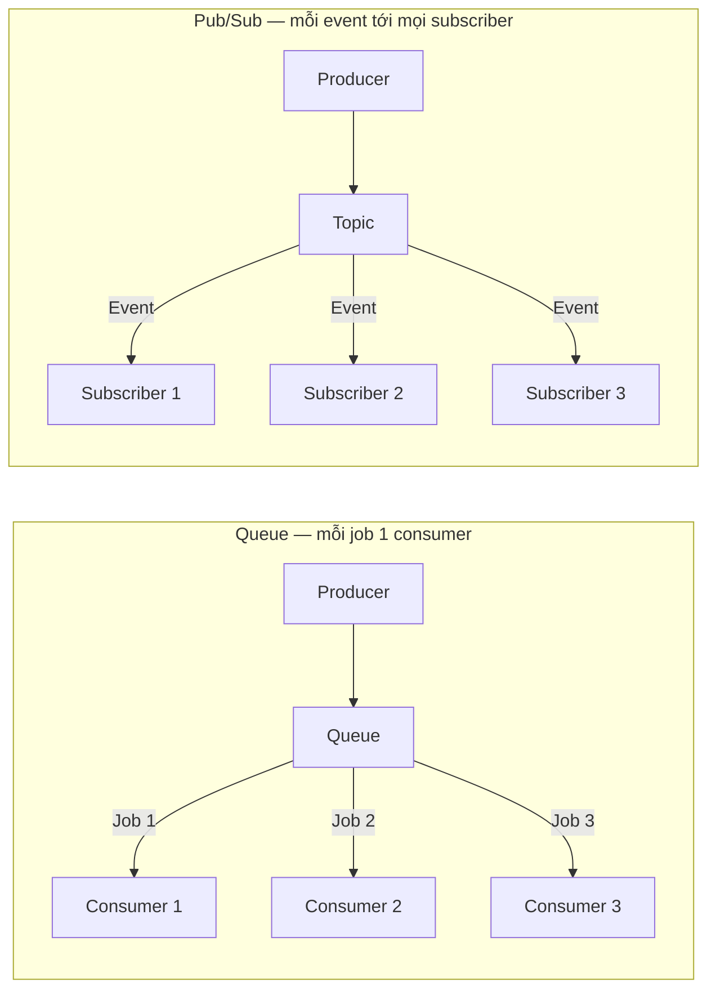

# Message Brokers: Kafka, RabbitMQ, Redis

Message broker là "người trung gian" giúp các phần trong hệ thống gửi tin nhắn cho nhau mà không cần gọi trực tiếp, nhờ vậy việc nặng (gửi email, xử lý ảnh) được làm ngầm phía sau còn người dùng vẫn nhận phản hồi nhanh. Nó quan trọng vì giúp ứng dụng chịu tải tốt hơn, tự retry khi lỗi và dễ mở rộng. Bài này giới thiệu các công cụ phổ biến như Kafka, RabbitMQ, Redis; phần chi tiết nằm bên dưới.

[](pathname:///img/backend/message-brokers.webp)

---

:::note[Ghi nhớ nhanh]

- ⭐ **Message broker decouple producer + consumer** — đẩy việc nặng (email, PDF, xử lý ảnh) chạy async phía sau để user nhận phản hồi nhanh; còn giúp buffer spike, retry, event-driven.
- **2 pattern cốt lõi** — `Queue` (point-to-point, mỗi job **1** consumer, load balance) vs `Pub/Sub` (mỗi event tới **mọi** subscriber); ngoài ra có `Stream` (event log, replay theo offset).
- ⭐ **Chọn công cụ theo nhu cầu** — `Kafka` (throughput rất cao + replay + event sourcing), `RabbitMQ` (task queue + routing linh hoạt), `BullMQ`/Redis Streams (app Node đã có Redis), `SQS` (AWS đơn giản).
- **Redis Pub/Sub** fire-and-forget không persistent (subscriber offline mất message) — dùng Redis Streams / BullMQ khi cần durable queue.
- **Correctness** — đảm bảo `idempotency` (message có thể delivered nhiều lần), Dead Letter Queue cho job fail, ordering theo partition (same key → cùng partition); đa số hệ thống là "at-least-once" + idempotency chứ không exactly-once.

:::

---

## Mục lục

- [Tại sao cần Message Broker?](#tại-sao-cần-message-broker)
- [Patterns](#patterns)
- [Kafka](#kafka)
- [RabbitMQ](#rabbitmq)
- [Redis Pub/Sub](#redis-pubsub)
- [Cloud queues](#cloud-queues)
- [Lựa chọn](#lựa-chọn)
- [Câu hỏi phỏng vấn](#câu-hỏi-phỏng-vấn)

---

## Tại sao cần Message Broker?

**Decouple producer + consumer** — không gọi trực tiếp.

:::tip[Ví dụ đời thường]

Quán ăn đông khách. Nếu bồi bàn nhận order xong phải **đứng lì trong bếp chờ món chín** rồi mới ra tiếp khách kế, quán chết ngộp ngay.

Thực tế bồi bàn **kẹp phiếu order lên giá** rồi quay ra phục vụ tiếp. Cái giá kẹp phiếu đó chính là message broker:

- Khách đông đột biến? Phiếu dồn trên giá, bồi bàn không phải đứng chờ (buffer).
- Đầu bếp làm hỏng món? Lấy lại phiếu làm lại (retry).
- Thêm một đầu bếp là nhanh gấp đôi, bồi bàn chẳng cần biết (decouple).

Cái giá phải trả: khách **không được báo "món xong" ngay lúc gọi** — mọi thứ chuyển từ "xong rồi" thành "sẽ xong sau".

:::

**Use case**:

- **Async job** — gửi email, generate PDF, image processing.
- **Event-driven** — service A publish, service B/C subscribe.
- **Buffer** — handle spike traffic.
- **Retry** — failed job tự retry.
- **Workflow** — multi-step business process.

```
Without broker:
[API] → [Email service] (synchronous, slow)

With broker:
[API] → [Queue] → [Email worker] (async, fast response cho user)
```

---

## Patterns

**1. Queue** (Point-to-point):

```
Producer → [Job1, Job2, Job3] → Consumer1
                              → Consumer2
                              → Consumer3
```

Mỗi job được xử lý bởi **1 consumer** (load balance).

**2. Pub/Sub** (Topic):

```
Producer → [Event] → Topic → Subscriber1 (nhận tất cả)
                           → Subscriber2 (nhận tất cả)
                           → Subscriber3 (nhận tất cả)
```

Mỗi event broadcast đến **tất cả subscriber**.

Điểm khác biệt cốt lõi giữa hai pattern: Queue chia việc (mỗi job **một** consumer), còn Pub/Sub phát tán (mỗi event tới **mọi** subscriber):



:::tip[Ví dụ đời thường]

Vẫn là quán ăn đó:

- **Queue** — **giá kẹp phiếu order**. Đầu bếp nào rảnh thì giật lấy một phiếu, làm xong thì phiếu **biến mất**. Ba đầu bếp là chạy nhanh gấp ba, và không ai nấu trùng món của người khác.
- **Pub/Sub** — **loa thông báo trong quán**: "bàn 5 vừa thanh toán". Thu ngân, kho, bộ phận chăm sóc khách **đều nghe cùng một câu** và mỗi bên làm việc của mình.

Nhớ mẹo này: Queue là **chia việc** (một phiếu, một người làm), Pub/Sub là **báo tin** (một tin, mọi người nghe).

:::

**3. Stream** (Event log):

```
Producer → [E1, E2, E3, ...] → Consumer (replay từ offset bất kỳ)
```

Event lưu trữ lâu dài, consumer đọc theo offset.

:::tip[Ví dụ đời thường]

`Stream` không phải giá kẹp phiếu, mà là **cuốn sổ nhật ký ghi liên tục**: việc gì xảy ra cũng chép thêm một dòng xuống cuối, **không ai được xoá dòng cũ**.

Người đọc sổ tự **kẹp một tờ giấy đánh dấu** đang đọc tới dòng bao nhiêu — đó chính là `offset`. Nhờ vậy:

- Máy hỏng, khởi động lại? Mở đúng chỗ đánh dấu, đọc tiếp.
- Có bộ phận mới vào làm? Lật về dòng 1 đọc lại toàn bộ lịch sử (replay).

Cái giá phải trả: sổ ngày một dày, phải quy định **giữ bao nhiêu ngày rồi xé bớt** (retention), chứ nó không tự vơi như giá kẹp phiếu.

:::

---

## Kafka

**Distributed event streaming platform** — Apache Kafka.

```
Producer → Topic (partitioned, replicated) → Consumer Group
```

Đặc điểm:

- **High throughput** — millions msg/s.
- **Persistent** — lưu disk, retention configurable (days/weeks).
- **Replay** — consumer đọc lại từ bất kỳ offset.
- **Partition** — scale horizontal.
- **Distributed** — Zookeeper hoặc KRaft consensus.

**Use case**:

- Event sourcing.
- Log aggregation.
- Real-time analytics pipeline.
- Microservice event bus.
- Change data capture (Debezium).

```ts
// kafkajs
import { Kafka } from "kafkajs";

const kafka = new Kafka({
  brokers: ["localhost:9092"],
});

// Producer
const producer = kafka.producer();
await producer.connect();
await producer.send({
  topic: "user-events",
  messages: [{ key: userId, value: JSON.stringify(event) }],
});

// Consumer
const consumer = kafka.consumer({ groupId: "email-service" });
await consumer.connect();
await consumer.subscribe({ topic: "user-events" });
await consumer.run({
  eachMessage: async ({ message }) => {
    const event = JSON.parse(message.value.toString());
    await processEvent(event);
  },
});
```

Managed:

- **Confluent Cloud** — Kafka original team.
- **AWS MSK** (Managed Streaming Kafka).
- **Upstash Kafka** — serverless.
- **Redpanda** — Kafka-compat C++ (nhanh hơn 6x).

:::info[Phân tích]

**Kafka phù hợp khi**:

- Throughput **rất cao** (>10k msg/s).
- Cần **replay** event.
- **Event sourcing** architecture.
- Scale multi-tenant.

Overkill nếu:

- App nhỏ, < 100 job/s.
- Simple task queue.
- Operational overhead lớn (Kafka maintain cost cao).

→ Start với **RabbitMQ** hoặc **Redis queue**. Move Kafka khi thực sự cần.

:::

---

## RabbitMQ

**AMQP** message broker — truyền thống, mature.

:::tip[Ví dụ đời thường]

Đặt RabbitMQ cạnh Kafka cho dễ hình dung:

| | RabbitMQ | Kafka |
|--|----------|-------|
| Giống như | **Bưu điện** chia thư theo địa chỉ | **Cuốn sổ cái** ghi liên tục |
| Đọc xong | Thư giao rồi là **hết**, xoá khỏi kho | Dòng ghi **vẫn nằm nguyên đó** |
| Đọc lại | Không | Có, lật về `offset` cũ |
| Mạnh ở | Chia thư khéo: đúng người, có ưu tiên, có hẹn giờ | Chép cực nhanh, cực nhiều, nhiều bên cùng đọc |

Nên: cần **giao đúng việc cho đúng người, có ưu tiên và retry** thì chọn RabbitMQ. Cần **giữ lại toàn bộ lịch sử để nhiều bên cùng đọc và đọc lại** thì chọn Kafka.

:::

```ts
import amqp from "amqplib";

const conn = await amqp.connect("amqp://localhost");
const channel = await conn.createChannel();

await channel.assertQueue("email_queue", { durable: true });

// Producer
channel.sendToQueue(
  "email_queue",
  Buffer.from(JSON.stringify({ to: "user@example.com", subject: "Hi" })),
  { persistent: true }
);

// Consumer
channel.consume("email_queue", async (msg) => {
  if (msg) {
    const data = JSON.parse(msg.content.toString());
    await sendEmail(data);
    channel.ack(msg);
  }
});
```

**Features**:

- **Routing** linh hoạt (direct, topic, fanout, headers exchange).
- **TTL** message, dead letter.
- **Priority queue**.
- **Acknowledgment** + retry.
- **Cluster** + HA.

**Use case**:

- Task queue traditional.
- Service-to-service messaging.
- Complex routing.

---

## Redis Pub/Sub

**Lightweight** pub/sub trong Redis.

```ts
// Publisher
await redis.publish("channel", JSON.stringify(event));

// Subscriber
const sub = new Redis();
sub.subscribe("channel");
sub.on("message", (channel, msg) => {
  console.log(channel, msg);
});
```

**Đặc điểm**:

- **Fire-and-forget** — subscriber offline mất message.
- **Không persistent**.
- **Low latency**.

:::tip[Ví dụ đời thường]

Redis Pub/Sub đúng nghĩa là **loa phường**: phát xong là thôi, không lưu lại băng ghi âm.

Ai đang ở nhà thì nghe được, ai đi vắng đúng lúc đó thì **mất tin luôn**, không có cách nào nghe lại. Đổi lại nó cực nhanh và gần như chẳng tốn gì.

Vậy nên chỉ dùng cho tin **mất cũng không sao**: đếm người online, đẩy notification real-time. Còn việc "phải làm cho bằng được" như trừ tiền hay gửi email thì dùng Redis Streams / BullMQ, nơi tin nhắn được **ghi vào sổ** chứ không bay theo gió.

:::

**Redis Streams** (better cho durable queue):

```ts
// Add to stream
await redis.xadd("events", "*", "type", "login", "userId", "1");

// Read group
await redis.xreadgroup("GROUP", "workers", "worker1",
  "COUNT", 10, "STREAMS", "events", ">");
```

**BullMQ** wrap Redis thành job queue mạnh:

```ts
import { Queue, Worker } from "bullmq";

const queue = new Queue("email", { connection: { host: "localhost" } });

await queue.add("send", { to: "user@example.com" });

const worker = new Worker("email", async (job) => {
  await sendEmail(job.data);
});
```

Features BullMQ: retry, delay, repeat, priority, rate limit, child job.

**Phù hợp**:

- App Node.js cần queue đơn giản.
- Đã có Redis.
- Throughput vừa (< 10k/s).

---

## Cloud queues

**AWS SQS**:

- Managed, simple, cheap.
- FIFO + Standard queue.
- DLQ (dead letter queue) built-in.
- Auto-scale.

**AWS SNS**:

- Pub/sub.
- Fan-out (1 SNS → nhiều SQS).
- Email, SMS, push notification.

**GCP Pub/Sub**:

- Tương đương SNS+SQS.
- Global routing.

**Cloudflare Queues** (mới 2024):

- Edge-native.
- HTTP API.
- Integrate Cloudflare Workers.

```ts
// AWS SQS
import { SQSClient, SendMessageCommand } from "@aws-sdk/client-sqs";

const client = new SQSClient({ region: "us-east-1" });
await client.send(new SendMessageCommand({
  QueueUrl: process.env.QUEUE_URL,
  MessageBody: JSON.stringify({ task: "send-email", userId }),
}));
```

---

## Lựa chọn

```
Throughput rất cao + replay?           → Kafka
Task queue truyền thống + routing?     → RabbitMQ
App Node đã có Redis?                  → BullMQ (Redis Streams)
AWS ecosystem, simple?                 → SQS
Edge / Cloudflare?                     → Cloudflare Queues
Just pub/sub real-time?                → Redis Pub/Sub
```

:::tip[Mẹo]

**Patterns sử dụng queue**:

**1. Background job**:

```ts
// Web handler — fast response
async function handleSignup(data) {
  const user = await db.user.create({ data });

  // Queue background tasks
  await queue.add("send-welcome-email", { userId: user.id });
  await queue.add("create-stripe-customer", { userId: user.id });
  await queue.add("warm-cache", { userId: user.id });

  return user; // fast
}

// Worker process — slow OK
worker.on("send-welcome-email", async ({ userId }) => {
  await emailService.send(...); // 2-3s
});
```

**2. Event-driven microservice**:

```ts
// Order service
await producer.publish("order.created", { orderId, userId, total });

// Email service subscribes
consumer.on("order.created", async (event) => {
  await sendConfirmationEmail(event);
});

// Inventory service subscribes
consumer.on("order.created", async (event) => {
  await reserveInventory(event);
});
```

**3. Rate limiting external API**:

```ts
// External API allow 100 req/min
queue.add("call-api", { ... }, { rateLimit: 100, duration: 60000 });
```

:::

:::warning[Cần lưu ý]

**Patterns đảm bảo correctness**:

**1. Idempotency** — message có thể delivered nhiều lần:

```ts
async function processOrder(orderId: string) {
  // Check if processed
  if (await redis.exists(`processed:${orderId}`)) return;

  await chargePayment(orderId);

  await redis.set(`processed:${orderId}`, "1", "EX", 86400);
}
```

**2. Dead Letter Queue** — message fail nhiều lần → DLQ để inspect:

```ts
new Worker("email", processor, {
  connection,
  removeOnComplete: { count: 1000 },
  removeOnFail: { count: 5000 },
});
```

Failed job tự move DLQ sau N attempt. Manual inspect + replay.

**3. Ordering** — Kafka partition đảm bảo order trong cùng partition.
Cross-partition: không order.

→ **Same key cùng partition** (vd user_id key) → order trong user đó.

**4. Exactly-once** — khó. Đa số system đảm bảo "at-least-once" + idempotency.

:::

---

## Câu hỏi phỏng vấn

Những câu thường gặp về chủ đề này. Tự trả lời trước, rồi bấm **Xem đáp án** để đối chiếu.

**1. Message broker giải quyết được vấn đề gì mà gọi API trực tiếp không giải quyết được? Kể vài use case điển hình.**

<details className="qa">
<summary>Xem đáp án</summary>

Gọi API trực tiếp là **đồng bộ và coupling chặt**: caller phải đứng chờ callee xử lý xong, callee chết thì caller lỗi theo, và mỗi khi thêm một bên quan tâm lại phải sửa code caller. Giống bồi bàn đứng lì trong bếp chờ món chín rồi mới ra tiếp khách kế.

Broker đứng giữa như cái giá kẹp phiếu order, mang lại:

- **Decouple** — producer không cần biết ai xử lý, thêm consumer không phải sửa producer.
- **Async** — trả response cho user ngay, việc nặng chạy ngầm.
- **Buffer** — traffic spike dồn vào queue thay vì đè chết downstream.
- **Retry** — job fail tự thử lại, hết lần thì vào dead letter queue.

Use case điển hình: gửi email, generate PDF, image processing; event-driven giữa các microservice; buffer spike; workflow nhiều bước.

Đánh đổi: user không được báo "xong" ngay lúc gọi, mọi thứ chuyển từ "xong rồi" thành "sẽ xong sau", hệ thống phải chấp nhận eventual consistency.

</details>

**2. Phân biệt ba pattern `queue` (point-to-point), `pub/sub` và `stream`. Với bài toán gửi email thông báo thì chọn cái nào?**

<details className="qa">
<summary>Xem đáp án</summary>

| Pattern | Ai nhận message | Sau khi xử lý |
|---|---|---|
| `Queue` | Đúng **một** consumer, load balance giữa các consumer | Message biến mất khỏi queue |
| `Pub/Sub` | **Mọi** subscriber đang lắng nghe | Không lưu lại, ai vắng mặt là mất tin |
| `Stream` | Consumer đọc theo `offset`, nhiều nhóm cùng đọc độc lập | Event vẫn nằm trong log tới hết retention |

Mẹo nhớ: Queue là **chia việc** (một phiếu, một người làm), Pub/Sub là **báo tin** (một tin, mọi người nghe), Stream là **cuốn sổ nhật ký** đọc lại được.

Gửi email thông báo là một việc cần làm đúng một lần nên chọn `Queue` (BullMQ, RabbitMQ, SQS): chỉ một worker gửi, thêm worker là nhanh hơn, fail thì retry rồi vào DLQ.

Nếu bối cảnh là "order.created" mà nhiều bên cùng phải phản ứng (email, kho, analytics) thì publish event theo pub/sub hoặc stream, còn email service là một subscriber và bên trong nó vẫn đẩy job vào queue để gửi.

</details>

**3. Kafka lưu message theo mô hình nào? Vì sao consumer đọc xong rồi mà message vẫn còn nằm trong `topic`?**

<details className="qa">
<summary>Xem đáp án</summary>

Kafka lưu message như một **append-only log** trên đĩa, chia theo partition. Consumer đọc không phải là "lấy message ra" — nó chỉ **dịch con trỏ offset** của mình, dữ liệu vẫn nằm nguyên tại chỗ.

Message chỉ biến mất theo **retention policy** (quá số ngày hoặc vượt dung lượng đã cấu hình), hoàn toàn không phụ thuộc chuyện đã có ai đọc hay chưa.

Điều này khác hẳn RabbitMQ, nơi message được giao và `ack` là xoá khỏi queue — như bưu điện giao thư xong thì hết, còn Kafka là cuốn sổ cái ghi liên tục.

Lợi ích: nhiều consumer group độc lập cùng đọc một topic mà không giẫm chân nhau; consumer mới có thể **replay** toàn bộ lịch sử từ offset 0, rất hợp event sourcing, rebuild read model hoặc khi phát hiện bug xử lý sai. Đổi lại phải quản lý dung lượng đĩa và chọn retention hợp lý.

</details>

**4. `topic`, `partition` và `offset` liên quan với nhau ra sao? Ai chịu trách nhiệm lưu và commit offset?**

<details className="qa">
<summary>Xem đáp án</summary>

`topic` là tên logic của một luồng event. Mỗi topic được chia thành nhiều `partition` — đây mới là đơn vị lưu trữ vật lý: một log append-only, message trong đó được đánh số tăng dần và con số đó chính là `offset`. Một message được định vị duy nhất bằng bộ ba topic + partition + offset.

Partition cũng là đơn vị song song hoá: nhiều partition thì nhiều consumer đọc song song, throughput tăng theo chiều ngang.

**Offset thuộc về consumer, không phải broker.** Mỗi consumer group giữ offset riêng cho từng partition và tự **commit** lại (Kafka lưu trong topic nội bộ `__consumer_offsets`). Nhờ vậy hai group đọc cùng một topic hoàn toàn độc lập.

Commit tự động theo chu kỳ thì tiện nhưng dễ mất hoặc lặp message khi consumer crash; commit thủ công sau khi xử lý xong cho kiểm soát tốt hơn, đổi lại vẫn phải tự lo idempotency.

</details>

**5. `consumer group` hoạt động thế nào? Nếu số consumer nhiều hơn số partition thì chuyện gì xảy ra?**

<details className="qa">
<summary>Xem đáp án</summary>

`consumer group` là tập các consumer dùng chung một `groupId` để chia nhau công việc của một topic. Kafka gán **mỗi partition cho đúng một consumer trong group**, nhờ vậy message vừa được load balance vừa giữ được thứ tự trong từng partition. Các group khác nhau đọc cùng topic thì mỗi group nhận đủ toàn bộ message — pub/sub ở mức group, queue ở mức trong group.

Nếu số consumer **nhiều hơn** số partition, những consumer dư sẽ **ngồi không**: không được gán partition nào, không nhận message nào. Thêm consumer lúc đó không tăng throughput chút nào, chỉ tốn tài nguyên (tuy vẫn hữu ích như bản dự phòng nóng khi có consumer chết).

Hệ quả thực tế: **số partition là trần song song** của một consumer group. Muốn scale consumer thì phải tăng partition trước, mà tăng partition lại làm thay đổi ánh xạ key nên cần ước lượng dư ngay từ đầu.

</details>

**6. Kafka đảm bảo thứ tự message trong phạm vi nào? Muốn mọi event của cùng một `user_id` giữ đúng thứ tự thì làm sao?**

<details className="qa">
<summary>Xem đáp án</summary>

Kafka **chỉ đảm bảo thứ tự trong phạm vi một partition**, không có thứ tự toàn cục trên cả topic. Message cùng partition được đọc đúng trình tự offset; hai message ở hai partition khác nhau thì không có ràng buộc nào.

Muốn mọi event của cùng một user giữ đúng thứ tự thì **dùng user_id làm message key** — Kafka hash key để chọn partition nên cùng key luôn rơi vào cùng một partition:

```ts
await producer.send({
  topic: "user-events",
  messages: [{ key: userId, value: JSON.stringify(event) }],
});
```

Hai lưu ý kèm theo: mỗi partition chỉ một consumer trong group đọc nên thứ tự được giữ ở phía nhận, nhưng nếu consumer tự xử lý song song nhiều message trong cùng partition thì lại phá vỡ thứ tự; và khi tăng số partition, key cũ có thể ánh xạ sang partition khác nên thứ tự chỉ còn đúng từ thời điểm đó trở đi.

</details>

**7. `rebalance` trong consumer group xảy ra khi nào và gây tác hại gì cho việc xử lý đang dở?**

<details className="qa">
<summary>Xem đáp án</summary>

`rebalance` là lúc Kafka chia lại partition cho các consumer trong group. Nó được kích hoạt khi: có consumer mới join, consumer rời nhóm hoặc crash, consumer bị coi là chết vì trễ heartbeat hay xử lý một message quá lâu, số partition của topic thay đổi, hoặc đơn giản là deploy rolling khiến pod restart.

Tác hại:

- Với giao thức rebalance kiểu cũ, **cả group ngừng tiêu thụ** trong lúc chia lại — lag tăng vọt.
- Công việc đang xử lý dở mà chưa commit offset sẽ bị consumer mới **đọc lại**, gây xử lý trùng. Đây là một lý do nữa để consumer phải idempotent.
- Rebalance liên tiếp (rebalance storm) khiến hệ thống gần như không tiến triển được.

Giảm thiểu: xử lý message nhanh hoặc nới poll interval, đặt session timeout hợp lý, dùng cooperative/incremental rebalance và static membership để restart thường lệ không kích hoạt chia lại toàn bộ.

</details>

**8. Kafka đảm bảo độ bền dữ liệu bằng những cơ chế nào (`replication factor`, `ISR`, `acks`)? Đặt `acks=all` được và mất gì?**

<details className="qa">
<summary>Xem đáp án</summary>

Mỗi partition có `replication factor` bản sao nằm trên các broker khác nhau: một leader nhận ghi, các follower kéo dữ liệu về. `ISR` (in-sync replicas) là tập replica đang bám kịp leader — chỉ replica trong ISR mới đủ tư cách lên làm leader khi leader chết, nhờ vậy không mất dữ liệu đã commit.

`acks` quy định producer chờ tới đâu mới coi là ghi thành công:

| `acks` | Chờ đến khi | Đánh đổi |
|---|---|---|
| `0` | Không chờ gì | Nhanh nhất, mất message dễ nhất |
| `1` | Leader ghi xong | Leader chết trước khi follower sync kịp thì mất |
| `all` | Toàn bộ ISR ghi xong | Bền nhất |

`acks=all` đổi lấy độ bền bằng **latency cao hơn và throughput thấp hơn**, vì producer phải chờ các replica. Nó chỉ thật sự an toàn khi đi kèm `min.insync.replicas` từ 2 trở lên — nếu ISR co lại còn đúng một bản thì acks=all cũng chỉ mạnh ngang acks=1 — và khi tắt unclean leader election.

</details>

**9. RabbitMQ định tuyến message qua `exchange` các kiểu `direct`, `fanout`, `topic` như thế nào?**

<details className="qa">
<summary>Xem đáp án</summary>

Trong RabbitMQ producer không gửi thẳng vào queue mà gửi vào một `exchange` kèm `routing key`; exchange dựa trên các binding để quyết định đẩy message vào queue nào.

| Loại exchange | Cách định tuyến |
|---|---|
| `direct` | Routing key khớp **chính xác** binding key — chia việc theo loại, theo mức độ ưu tiên |
| `fanout` | Bỏ qua routing key, **copy sang mọi queue** đã bind — đúng kiểu broadcast |
| `topic` | Khớp theo mẫu có ký tự đại diện, ví dụ `order.*` hoặc `order.#` — linh hoạt nhất |
| `headers` | Khớp theo header của message thay vì routing key |

Đây chính là thế mạnh của RabbitMQ so với Kafka: định tuyến giống **bưu điện chia thư theo địa chỉ**, rất linh hoạt và kết hợp được với TTL, priority queue, dead letter exchange. Đổi lại message đã giao và ack là xoá, không replay được như Kafka.

</details>

**10. Trong RabbitMQ, `ack`/`nack` và `prefetch` ảnh hưởng ra sao tới độ tin cậy và throughput?**

<details className="qa">
<summary>Xem đáp án</summary>

`ack` là lời xác nhận consumer đã xử lý xong; RabbitMQ chỉ xoá message khỏi queue khi nhận được ack. Consumer chết trước khi ack thì message được **requeue** cho consumer khác — đây là nền tảng của at-least-once. `nack` (hoặc reject) báo xử lý thất bại, kèm cờ requeue để chọn trả lại queue hay đẩy sang dead letter exchange.

Bật auto-ack thì message coi như xong ngay lúc broker gửi đi: nhanh, nhưng consumer crash là **mất việc** (at-most-once).

`prefetch` giới hạn số message chưa ack mà broker được đẩy trước cho một consumer:

- Prefetch quá nhỏ (ví dụ 1) — cân tải rất đều và an toàn, nhưng consumer hay phải chờ round-trip, throughput thấp.
- Prefetch quá lớn — throughput cao nhưng một consumer ôm cả đống message, tải lệch, và khi nó chết thì cả lô phải requeue.

Thực tế: ack thủ công sau khi xử lý xong, prefetch đặt ở mức vừa phải theo thời gian xử lý mỗi job.

</details>

**11. So sánh Kafka và RabbitMQ về mô hình lưu trữ, khả năng replay, throughput và độ phức tạp vận hành. Bạn chọn cái nào cho hệ thống thanh toán, cái nào cho pipeline log?**

<details className="qa">
<summary>Xem đáp án</summary>

| Tiêu chí | Kafka | RabbitMQ |
|---|---|---|
| Mô hình lưu | Log append-only, giữ tới hết retention | Queue, ack xong là xoá |
| Replay | Có, tua lại theo `offset` | Không |
| Throughput | Rất cao, tới hàng triệu msg/s | Vừa phải |
| Định tuyến | Đơn giản: topic và key | Rất linh hoạt: `direct`, `topic`, `fanout`, TTL, priority |
| Vận hành | Nặng: broker, partition, KRaft/ZooKeeper | Nhẹ hơn, mature, dễ dựng |

Hệ thống thanh toán thiên về **RabbitMQ** cho luồng task: cần routing theo loại giao dịch, priority, retry và DLQ rõ ràng, latency thấp. Nếu còn cần audit trail bất biến và nhiều service cùng phản ứng theo event thì Kafka hợp cho luồng event — nhưng chọn gì thì consumer vẫn phải idempotent.

Pipeline log và analytics thì chọn **Kafka**: đúng bài toán throughput lớn, nhiều consumer group độc lập cùng đọc, và cần replay khi job xử lý sai.

</details>

**12. Redis `Pub/Sub` mất message trong tình huống nào? `Redis Streams` khắc phục được điểm gì?**

<details className="qa">
<summary>Xem đáp án</summary>

`Redis Pub/Sub` là **fire-and-forget**, không lưu gì cả — đúng nghĩa loa phường, phát xong là thôi. Message mất khi:

- Subscriber đang offline hoặc chưa kịp subscribe lúc publish.
- Subscriber rớt kết nối, reconnect xong không có cách nào đọc lại khoảng trống đó.
- Redis restart, hoặc buffer output của client đầy khiến client bị ngắt.

Không ack, không retry, không replay. Vì vậy chỉ nên dùng cho tin mất cũng không sao: đếm người online, đẩy notification real-time.

`Redis Streams` khắc phục bằng cách **ghi event vào một log bền** ngay trong Redis, mỗi entry có ID tăng dần:

- Đọc lại lịch sử theo ID được.
- Có consumer group kèm ack và pending list — message chưa ack còn treo lại để worker khác claim khi worker cũ chết.
- Có retention để giới hạn kích thước.

Trên nền đó, `BullMQ` bọc thêm retry, delay, priority, rate limit cho app Node.

</details>

**13. Phân biệt `at-most-once`, `at-least-once` và `exactly-once`. Vì sao exactly-once trong thực tế rất khó đạt?**

<details className="qa">
<summary>Xem đáp án</summary>

| Ngữ nghĩa | Ý nghĩa | Cách thường đạt được |
|---|---|---|
| `at-most-once` | Tối đa một lần, có thể mất | Ack/commit offset **trước** khi xử lý |
| `at-least-once` | Không mất, có thể trùng | Ack/commit **sau** khi xử lý xong |
| `exactly-once` | Đúng một lần | Cần transaction phối hợp giữa broker và nơi ghi kết quả |

Exactly-once khó vì khi lỗi xảy ra đúng khoảng giữa "xử lý xong" và "ack", hệ thống chỉ có hai lựa chọn: thử lại (có thể trùng) hoặc bỏ qua (có thể mất). Ack và side effect nằm ở hai hệ thống khác nhau nên không tồn tại thời điểm nào nguyên tử tuyệt đối; thêm nữa consumer có thể crash đúng khoảnh khắc đó, hoặc rebalance khiến message được giao lại.

Kafka có transaction cho luồng đọc-xử lý-ghi trong nội bộ Kafka, nhưng ngay khi side effect ra ngoài (gửi email, gọi API) thì bảo đảm đó hết hiệu lực. Nên đa số hệ thống chọn **at-least-once cộng idempotency**.

</details>

**14. Consumer `idempotent` nghĩa là gì? Bạn hiện thực ra sao khi consumer vừa ghi database vừa gọi API bên thứ ba?**

<details className="qa">
<summary>Xem đáp án</summary>

Consumer `idempotent` là consumer xử lý cùng một message nhiều lần vẫn cho kết quả như xử lý một lần. Bắt buộc phải có vì broker chỉ đảm bảo at-least-once: retry, requeue, rebalance đều sinh ra bản trùng.

Cách cơ bản là đánh dấu theo business id:

```ts
async function processOrder(orderId: string) {
  if (await redis.exists(`processed:${orderId}`)) return;
  await chargePayment(orderId);
  await redis.set(`processed:${orderId}`, "1", "EX", 86400);
}
```

Khi vừa ghi DB vừa gọi API ngoài thì cờ Redis là chưa đủ, vì crash giữa chừng vẫn gây trùng:

- Phía DB: dùng **transaction** với bảng `processed_messages` có unique key trên message id, để việc đánh dấu nằm chung transaction với thay đổi nghiệp vụ; insert trùng key là biết đã xử lý.
- Phía API ngoài: dùng **idempotency key** nếu nhà cung cấp hỗ trợ (Stripe là ví dụ điển hình) để lần gọi lặp không tạo giao dịch mới.
- Thứ tự an toàn: gọi API với idempotency key, ghi kết quả vào DB cùng transaction đánh dấu, rồi mới ack message.

</details>

**15. `Dead Letter Queue` dùng để làm gì? Thiết kế chính sách retry (số lần, `backoff`) thế nào cho hợp lý trước khi đẩy message vào DLQ?**

<details className="qa">
<summary>Xem đáp án</summary>

`Dead Letter Queue` chứa những message đã retry hết số lần cho phép mà vẫn fail. Mục đích kép: **không để một message độc chặn cả queue** (poison message), và không làm mất dữ liệu — giữ lại để soi log, sửa bug rồi replay.

Chính sách retry hợp lý:

- Phân loại lỗi trước. Lỗi tạm thời (timeout, 5xx, rate limit) mới nên retry; lỗi vĩnh viễn (payload sai, 400, record không tồn tại) nên vào thẳng DLQ vì retry bao nhiêu cũng vô ích.
- Số lần thường 3 đến 5 là đủ.
- `backoff` **luỹ thừa kèm jitter** (1s, 2s, 4s, 8s cộng một lượng ngẫu nhiên) để không dồn đập vào dịch vụ đang yếu và tránh các consumer retry đồng loạt.
- Đặt trần tổng thời gian retry, tôn trọng `Retry-After` khi API trả về.
- Bắt buộc có alert khi DLQ có message, kèm quy trình replay sau khi fix. Consumer phải idempotent vì replay chính là xử lý lại.

</details>

**16. `consumer lag` là gì, đo bằng cách nào, và bạn xử lý ra sao khi lag tăng liên tục?**

<details className="qa">
<summary>Xem đáp án</summary>

`consumer lag` là khoảng cách giữa offset mới nhất trong partition và offset mà consumer group đã commit — tức **số message đang tồn đọng chưa xử lý**.

Đo bằng công cụ sẵn có của Kafka (`kafka-consumer-groups --describe`), hoặc qua Burrow, Prometheus exporter, dashboard của managed service. Với BullMQ/SQS thì chỉ số tương đương là số job đang waiting hoặc số message visible.

Lag tăng liên tục nghĩa là tốc độ produce vượt tốc độ consume. Xử lý theo thứ tự:

- Xem lag tập trung ở partition nào — lệch một partition thường do key phân bố không đều.
- Tối ưu consumer: xử lý theo batch, song song hoá, soi query DB hoặc API ngoài đang nghẽn.
- Scale thêm consumer, nhưng chỉ có tác dụng tới trần bằng số partition, cần thì tăng partition trước.
- Kiểm tra có đang rebalance liên tục hoặc có message độc khiến retry mãi không.
- Cuối cùng là giảm tải phía producer. Nên đặt alert theo ngưỡng lag, đừng chờ tới lúc message chạm retention và mất.

</details>

**17. `Outbox pattern` giải quyết vấn đề gì giữa việc ghi DB và publish message? Vì sao không nên publish ngay bên trong transaction?**

<details className="qa">
<summary>Xem đáp án</summary>

Vấn đề là **dual write**: handler vừa ghi database vừa publish message lên broker, mà hai thứ đó là hai hệ thống riêng, không có transaction chung. Ghi DB xong nhưng publish fail thì service khác không bao giờ biết đơn hàng tồn tại; publish xong mà transaction rollback thì message lại nói về dữ liệu không có thật.

`Outbox pattern`: trong **cùng transaction** với thay đổi nghiệp vụ, ghi thêm một dòng vào bảng `outbox` mô tả event. Commit thì cả dữ liệu lẫn event cùng có, rollback thì cả hai cùng mất. Sau đó một tiến trình riêng (poller, hoặc change data capture kiểu Debezium) đọc bảng outbox, publish lên broker và đánh dấu đã gửi.

Không publish ngay trong transaction vì: gọi broker là I/O ra ngoài, kéo dài thời gian giữ lock; broker chậm hoặc chết sẽ làm transaction fail theo; và quan trọng nhất là **không rút lại được message đã gửi** nếu transaction rollback sau đó. Đổi lại outbox chỉ cho at-least-once, consumer vẫn phải idempotent.

</details>

**18. Khi nào một job queue đơn giản (`BullMQ`, `SQS`) là đủ, và khi nào buộc phải nâng lên Kafka?**

<details className="qa">
<summary>Xem đáp án</summary>

Job queue đơn giản là đủ khi:

- Throughput vừa phải (cỡ dưới 10k msg/s).
- Nhu cầu chỉ là **chạy việc nền**: gửi email, generate PDF, xử lý ảnh, gọi API ngoài có rate limit.
- Mỗi job chỉ cần một consumer xử lý, xong là thôi, không ai cần đọc lại.
- Hạ tầng đã có sẵn Redis (BullMQ) hoặc đã ở trong AWS (SQS) — gần như không tốn thêm chi phí vận hành.

Nên nâng lên Kafka khi:

- Throughput rất cao và cần scale ngang bằng cách tăng partition.
- Cần **replay**: đọc lại lịch sử để rebuild read model, chữa bug xử lý sai, hoặc onboard service mới.
- Nhiều consumer group độc lập cùng đọc một luồng event, tức dùng nó làm event bus cho microservice.
- Làm event sourcing, change data capture, real-time analytics pipeline.

Lời khuyên chung: bắt đầu với RabbitMQ hoặc Redis queue, chỉ chuyển sang Kafka khi thực sự cần, vì chi phí vận hành Kafka không nhỏ.

</details>
