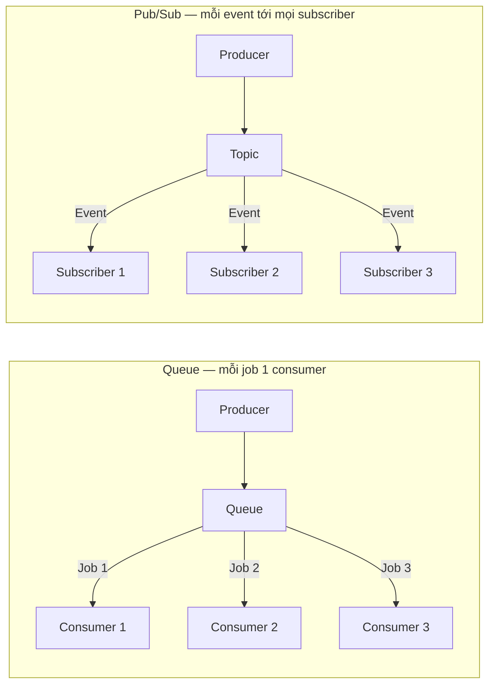

# Message Brokers: Kafka, RabbitMQ, Redis

Message broker là "người trung gian" giúp các phần trong hệ thống gửi tin nhắn cho nhau mà không cần gọi trực tiếp, nhờ vậy việc nặng (gửi email, xử lý ảnh) được làm ngầm phía sau còn người dùng vẫn nhận phản hồi nhanh. Nó quan trọng vì giúp ứng dụng chịu tải tốt hơn, tự retry khi lỗi và dễ mở rộng. Bài này giới thiệu các công cụ phổ biến như Kafka, RabbitMQ, Redis; phần chi tiết nằm bên dưới.

---

:::note[Ghi nhớ nhanh]

- ⭐ **Message broker decouple producer + consumer** — đẩy việc nặng (email, PDF, xử lý ảnh) chạy async phía sau để user nhận phản hồi nhanh; còn giúp buffer spike, retry, event-driven.
- **2 pattern cốt lõi** — `Queue` (point-to-point, mỗi job **1** consumer, load balance) vs `Pub/Sub` (mỗi event tới **mọi** subscriber); ngoài ra có `Stream` (event log, replay theo offset).
- ⭐ **Chọn công cụ theo nhu cầu** — `Kafka` (throughput rất cao + replay + event sourcing), `RabbitMQ` (task queue + routing linh hoạt), `BullMQ`/Redis Streams (app Node đã có Redis), `SQS` (AWS đơn giản).
- **Redis Pub/Sub** fire-and-forget không persistent (subscriber offline mất message) — dùng Redis Streams / BullMQ khi cần durable queue.
- **Correctness** — đảm bảo `idempotency` (message có thể delivered nhiều lần), Dead Letter Queue cho job fail, ordering theo partition (same key → cùng partition); đa số hệ thống là "at-least-once" + idempotency chứ không exactly-once.

:::

---

## Mục lục

- [Tại sao cần Message Broker?](#tại-sao-cần-message-broker)
- [Patterns](#patterns)
- [Kafka](#kafka)
- [RabbitMQ](#rabbitmq)
- [Redis Pub/Sub](#redis-pubsub)
- [Cloud queues](#cloud-queues)
- [Lựa chọn](#lựa-chọn)

---

## Tại sao cần Message Broker?

**Decouple producer + consumer** — không gọi trực tiếp.

:::tip[Ví dụ đời thường]

Quán ăn đông khách. Nếu bồi bàn nhận order xong phải **đứng lì trong bếp chờ món chín** rồi mới ra tiếp khách kế, quán chết ngộp ngay.

Thực tế bồi bàn **kẹp phiếu order lên giá** rồi quay ra phục vụ tiếp. Cái giá kẹp phiếu đó chính là message broker:

- Khách đông đột biến? Phiếu dồn trên giá, bồi bàn không phải đứng chờ (buffer).
- Đầu bếp làm hỏng món? Lấy lại phiếu làm lại (retry).
- Thêm một đầu bếp là nhanh gấp đôi, bồi bàn chẳng cần biết (decouple).

Cái giá phải trả: khách **không được báo "món xong" ngay lúc gọi** — mọi thứ chuyển từ "xong rồi" thành "sẽ xong sau".

:::

**Use case**:

- **Async job** — gửi email, generate PDF, image processing.
- **Event-driven** — service A publish, service B/C subscribe.
- **Buffer** — handle spike traffic.
- **Retry** — failed job tự retry.
- **Workflow** — multi-step business process.

```
Without broker:
[API] → [Email service] (synchronous, slow)

With broker:
[API] → [Queue] → [Email worker] (async, fast response cho user)
```

---

## Patterns

**1. Queue** (Point-to-point):

```
Producer → [Job1, Job2, Job3] → Consumer1
                              → Consumer2
                              → Consumer3
```

Mỗi job được xử lý bởi **1 consumer** (load balance).

**2. Pub/Sub** (Topic):

```
Producer → [Event] → Topic → Subscriber1 (nhận tất cả)
                           → Subscriber2 (nhận tất cả)
                           → Subscriber3 (nhận tất cả)
```

Mỗi event broadcast đến **tất cả subscriber**.

Điểm khác biệt cốt lõi giữa hai pattern: Queue chia việc (mỗi job **một** consumer), còn Pub/Sub phát tán (mỗi event tới **mọi** subscriber):



:::tip[Ví dụ đời thường]

Vẫn là quán ăn đó:

- **Queue** — **giá kẹp phiếu order**. Đầu bếp nào rảnh thì giật lấy một phiếu, làm xong thì phiếu **biến mất**. Ba đầu bếp là chạy nhanh gấp ba, và không ai nấu trùng món của người khác.
- **Pub/Sub** — **loa thông báo trong quán**: "bàn 5 vừa thanh toán". Thu ngân, kho, bộ phận chăm sóc khách **đều nghe cùng một câu** và mỗi bên làm việc của mình.

Nhớ mẹo này: Queue là **chia việc** (một phiếu, một người làm), Pub/Sub là **báo tin** (một tin, mọi người nghe).

:::

**3. Stream** (Event log):

```
Producer → [E1, E2, E3, ...] → Consumer (replay từ offset bất kỳ)
```

Event lưu trữ lâu dài, consumer đọc theo offset.

:::tip[Ví dụ đời thường]

`Stream` không phải giá kẹp phiếu, mà là **cuốn sổ nhật ký ghi liên tục**: việc gì xảy ra cũng chép thêm một dòng xuống cuối, **không ai được xoá dòng cũ**.

Người đọc sổ tự **kẹp một tờ giấy đánh dấu** đang đọc tới dòng bao nhiêu — đó chính là `offset`. Nhờ vậy:

- Máy hỏng, khởi động lại? Mở đúng chỗ đánh dấu, đọc tiếp.
- Có bộ phận mới vào làm? Lật về dòng 1 đọc lại toàn bộ lịch sử (replay).

Cái giá phải trả: sổ ngày một dày, phải quy định **giữ bao nhiêu ngày rồi xé bớt** (retention), chứ nó không tự vơi như giá kẹp phiếu.

:::

---

## Kafka

**Distributed event streaming platform** — Apache Kafka.

```
Producer → Topic (partitioned, replicated) → Consumer Group
```

Đặc điểm:

- **High throughput** — millions msg/s.
- **Persistent** — lưu disk, retention configurable (days/weeks).
- **Replay** — consumer đọc lại từ bất kỳ offset.
- **Partition** — scale horizontal.
- **Distributed** — Zookeeper hoặc KRaft consensus.

**Use case**:

- Event sourcing.
- Log aggregation.
- Real-time analytics pipeline.
- Microservice event bus.
- Change data capture (Debezium).

```ts
// kafkajs
import { Kafka } from "kafkajs";

const kafka = new Kafka({
  brokers: ["localhost:9092"],
});

// Producer
const producer = kafka.producer();
await producer.connect();
await producer.send({
  topic: "user-events",
  messages: [{ key: userId, value: JSON.stringify(event) }],
});

// Consumer
const consumer = kafka.consumer({ groupId: "email-service" });
await consumer.connect();
await consumer.subscribe({ topic: "user-events" });
await consumer.run({
  eachMessage: async ({ message }) => {
    const event = JSON.parse(message.value.toString());
    await processEvent(event);
  },
});
```

Managed:

- **Confluent Cloud** — Kafka original team.
- **AWS MSK** (Managed Streaming Kafka).
- **Upstash Kafka** — serverless.
- **Redpanda** — Kafka-compat C++ (nhanh hơn 6x).

:::info[Phân tích]

**Kafka phù hợp khi**:

- Throughput **rất cao** (>10k msg/s).
- Cần **replay** event.
- **Event sourcing** architecture.
- Scale multi-tenant.

Overkill nếu:

- App nhỏ, < 100 job/s.
- Simple task queue.
- Operational overhead lớn (Kafka maintain cost cao).

→ Start với **RabbitMQ** hoặc **Redis queue**. Move Kafka khi thực sự cần.

:::

---

## RabbitMQ

**AMQP** message broker — truyền thống, mature.

:::tip[Ví dụ đời thường]

Đặt RabbitMQ cạnh Kafka cho dễ hình dung:

| | RabbitMQ | Kafka |
|--|----------|-------|
| Giống như | **Bưu điện** chia thư theo địa chỉ | **Cuốn sổ cái** ghi liên tục |
| Đọc xong | Thư giao rồi là **hết**, xoá khỏi kho | Dòng ghi **vẫn nằm nguyên đó** |
| Đọc lại | Không | Có, lật về `offset` cũ |
| Mạnh ở | Chia thư khéo: đúng người, có ưu tiên, có hẹn giờ | Chép cực nhanh, cực nhiều, nhiều bên cùng đọc |

Nên: cần **giao đúng việc cho đúng người, có ưu tiên và retry** thì chọn RabbitMQ. Cần **giữ lại toàn bộ lịch sử để nhiều bên cùng đọc và đọc lại** thì chọn Kafka.

:::

```ts
import amqp from "amqplib";

const conn = await amqp.connect("amqp://localhost");
const channel = await conn.createChannel();

await channel.assertQueue("email_queue", { durable: true });

// Producer
channel.sendToQueue(
  "email_queue",
  Buffer.from(JSON.stringify({ to: "user@example.com", subject: "Hi" })),
  { persistent: true }
);

// Consumer
channel.consume("email_queue", async (msg) => {
  if (msg) {
    const data = JSON.parse(msg.content.toString());
    await sendEmail(data);
    channel.ack(msg);
  }
});
```

**Features**:

- **Routing** linh hoạt (direct, topic, fanout, headers exchange).
- **TTL** message, dead letter.
- **Priority queue**.
- **Acknowledgment** + retry.
- **Cluster** + HA.

**Use case**:

- Task queue traditional.
- Service-to-service messaging.
- Complex routing.

---

## Redis Pub/Sub

**Lightweight** pub/sub trong Redis.

```ts
// Publisher
await redis.publish("channel", JSON.stringify(event));

// Subscriber
const sub = new Redis();
sub.subscribe("channel");
sub.on("message", (channel, msg) => {
  console.log(channel, msg);
});
```

**Đặc điểm**:

- **Fire-and-forget** — subscriber offline mất message.
- **Không persistent**.
- **Low latency**.

:::tip[Ví dụ đời thường]

Redis Pub/Sub đúng nghĩa là **loa phường**: phát xong là thôi, không lưu lại băng ghi âm.

Ai đang ở nhà thì nghe được, ai đi vắng đúng lúc đó thì **mất tin luôn**, không có cách nào nghe lại. Đổi lại nó cực nhanh và gần như chẳng tốn gì.

Vậy nên chỉ dùng cho tin **mất cũng không sao**: đếm người online, đẩy notification real-time. Còn việc "phải làm cho bằng được" như trừ tiền hay gửi email thì dùng Redis Streams / BullMQ, nơi tin nhắn được **ghi vào sổ** chứ không bay theo gió.

:::

**Redis Streams** (better cho durable queue):

```ts
// Add to stream
await redis.xadd("events", "*", "type", "login", "userId", "1");

// Read group
await redis.xreadgroup("GROUP", "workers", "worker1",
  "COUNT", 10, "STREAMS", "events", ">");
```

**BullMQ** wrap Redis thành job queue mạnh:

```ts
import { Queue, Worker } from "bullmq";

const queue = new Queue("email", { connection: { host: "localhost" } });

await queue.add("send", { to: "user@example.com" });

const worker = new Worker("email", async (job) => {
  await sendEmail(job.data);
});
```

Features BullMQ: retry, delay, repeat, priority, rate limit, child job.

**Phù hợp**:

- App Node.js cần queue đơn giản.
- Đã có Redis.
- Throughput vừa (< 10k/s).

---

## Cloud queues

**AWS SQS**:

- Managed, simple, cheap.
- FIFO + Standard queue.
- DLQ (dead letter queue) built-in.
- Auto-scale.

**AWS SNS**:

- Pub/sub.
- Fan-out (1 SNS → nhiều SQS).
- Email, SMS, push notification.

**GCP Pub/Sub**:

- Tương đương SNS+SQS.
- Global routing.

**Cloudflare Queues** (mới 2024):

- Edge-native.
- HTTP API.
- Integrate Cloudflare Workers.

```ts
// AWS SQS
import { SQSClient, SendMessageCommand } from "@aws-sdk/client-sqs";

const client = new SQSClient({ region: "us-east-1" });
await client.send(new SendMessageCommand({
  QueueUrl: process.env.QUEUE_URL,
  MessageBody: JSON.stringify({ task: "send-email", userId }),
}));
```

---

## Lựa chọn

```
Throughput rất cao + replay?           → Kafka
Task queue truyền thống + routing?     → RabbitMQ
App Node đã có Redis?                  → BullMQ (Redis Streams)
AWS ecosystem, simple?                 → SQS
Edge / Cloudflare?                     → Cloudflare Queues
Just pub/sub real-time?                → Redis Pub/Sub
```

:::tip[Mẹo]

**Patterns sử dụng queue**:

**1. Background job**:

```ts
// Web handler — fast response
async function handleSignup(data) {
  const user = await db.user.create({ data });

  // Queue background tasks
  await queue.add("send-welcome-email", { userId: user.id });
  await queue.add("create-stripe-customer", { userId: user.id });
  await queue.add("warm-cache", { userId: user.id });

  return user; // fast
}

// Worker process — slow OK
worker.on("send-welcome-email", async ({ userId }) => {
  await emailService.send(...); // 2-3s
});
```

**2. Event-driven microservice**:

```ts
// Order service
await producer.publish("order.created", { orderId, userId, total });

// Email service subscribes
consumer.on("order.created", async (event) => {
  await sendConfirmationEmail(event);
});

// Inventory service subscribes
consumer.on("order.created", async (event) => {
  await reserveInventory(event);
});
```

**3. Rate limiting external API**:

```ts
// External API allow 100 req/min
queue.add("call-api", { ... }, { rateLimit: 100, duration: 60000 });
```

:::

:::warning[Cần lưu ý]

**Patterns đảm bảo correctness**:

**1. Idempotency** — message có thể delivered nhiều lần:

```ts
async function processOrder(orderId: string) {
  // Check if processed
  if (await redis.exists(`processed:${orderId}`)) return;

  await chargePayment(orderId);

  await redis.set(`processed:${orderId}`, "1", "EX", 86400);
}
```

**2. Dead Letter Queue** — message fail nhiều lần → DLQ để inspect:

```ts
new Worker("email", processor, {
  connection,
  removeOnComplete: { count: 1000 },
  removeOnFail: { count: 5000 },
});
```

Failed job tự move DLQ sau N attempt. Manual inspect + replay.

**3. Ordering** — Kafka partition đảm bảo order trong cùng partition.
Cross-partition: không order.

→ **Same key cùng partition** (vd user_id key) → order trong user đó.

**4. Exactly-once** — khó. Đa số system đảm bảo "at-least-once" + idempotency.

:::
