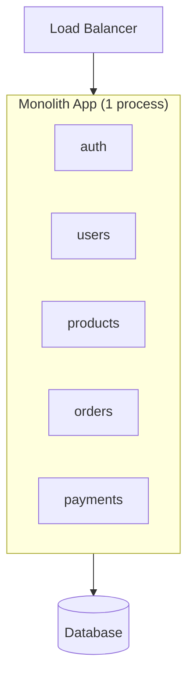
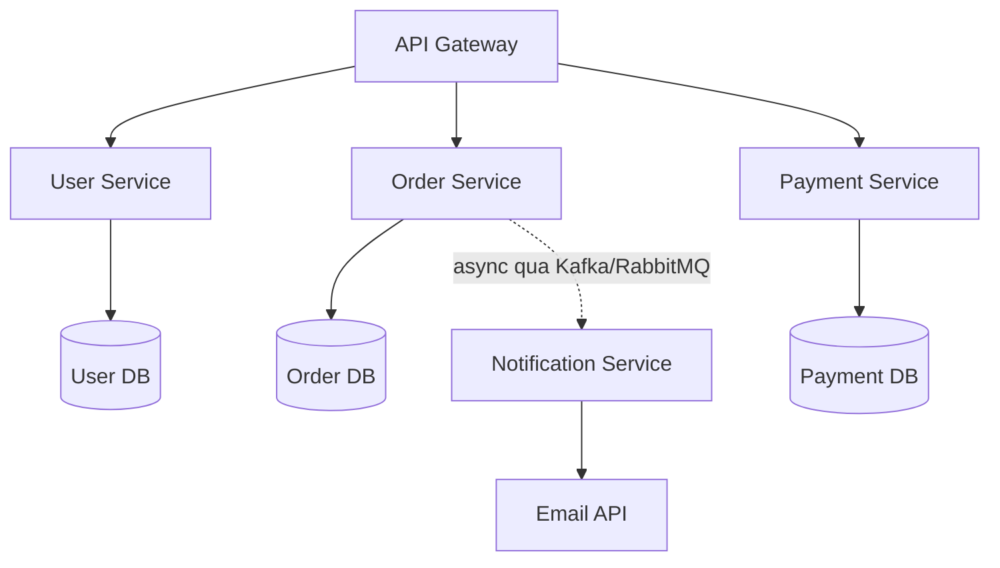

# Monolith, Microservices, Serverless

Đây là các kiểu kiến trúc để tổ chức một ứng dụng backend: gộp tất cả vào một khối (monolith), chia nhỏ thành nhiều dịch vụ riêng (microservices), hay chạy theo từng hàm khi cần (serverless). Hiểu chúng quan trọng vì mỗi cách có ưu nhược điểm riêng, chọn đúng giúp tiết kiệm công sức và dễ mở rộng về sau. Bài này so sánh các kiểu để bạn biết khi nào nên chọn cái nào; phần chi tiết nằm bên dưới.

[](pathname:///img/backend/architecture-patterns.webp)

---

:::note[Ghi nhớ nhanh]

- ⭐ **3 kiểu kiến trúc chính** — Monolith (1 codebase, đơn giản), Microservices (nhiều service deploy độc lập), Serverless (FaaS chạy on-demand, tự scale).
- ⭐ **80% startup không cần microservices** — monolith đủ đến hàng triệu user; `modular monolith` là compromise hiện đại, migrate sang microservice dễ hơn ngược lại.
- **Serverless** hợp traffic spike/cron/webhook, nhưng có cold start, giới hạn thời gian và khó DB pooling.
- **`12-Factor App`** — bộ nguyên tắc cloud-native (config qua env, stateless, log ra stdout...).
- **Chọn theo team size + traffic thực tế**, không chạy theo hype (nhiều công ty lớn đã quay về monolith để tiết kiệm chi phí).

:::

---

## Mục lục

- [Monolith](#monolith)
- [Microservices](#microservices)
- [Serverless](#serverless)
- [SOA và Service Mesh](#soa-và-service-mesh)
- [Twelve Factor Apps](#twelve-factor-apps)
- [Khi nào chọn cái nào?](#khi-nào-chọn-cái-nào)
- [Câu hỏi phỏng vấn](#câu-hỏi-phỏng-vấn)

---

## Monolith

**1 codebase + 1 deploy unit**. Truyền thống, đơn giản.

:::tip[Ví dụ đời thường]

Monolith giống **một nhà hàng duy nhất, một cái bếp**: món khai vị, món chính, tráng miệng đều nấu chung một bếp, chung một cái kho, chung một hoá đơn. Muốn sửa công thức món nào thì cứ vào bếp đó mà sửa, nhìn một cái là thấy hết.

Cái giá phải trả: tối nào khách đông, bạn **không thể chỉ nhân đôi mỗi khu làm món chính** — muốn phục vụ gấp đôi thì phải mở nguyên một nhà hàng y hệt. Và bếp trưởng chỉ đổi cách xếp bếp một chút thôi là **cả nhà hàng phải đóng cửa** vài phút để sắp lại (deploy lại toàn bộ).

:::

```
[Load Balancer] → [Monolith App] → [DB]
                       ↓
                 [auth, users, products, orders, payments...]
                       (cùng process)
```



**Ưu**:

- **Simple** dev + deploy.
- **Easy debug** — stack trace + 1 codebase.
- **Transaction native** — DB transaction qua module.
- **Less infra** — 1 server đủ.
- **Faster** local dev (no network call internal).

**Nhược**:

- Scale **toàn app** — không scale module riêng.
- Big team **conflict** trên cùng codebase.
- Deploy = redeploy hết.
- Tech stack **single** (1 ngôn ngữ, 1 framework).

**Phù hợp**:

- Startup early stage.
- Team < 20 dev.
- App < 100k LOC.

:::info[Phân tích]

**"Modular monolith"** — modern compromise:

```
src/
├── modules/
│   ├── users/       # bounded context
│   │   ├── domain/
│   │   ├── application/
│   │   └── infrastructure/
│   ├── orders/
│   ├── payments/
│   └── shared/
└── app.ts
```

Mỗi module có:

- Boundary rõ.
- Interface (public API).
- Database table riêng.
- Own dependency.

Lợi ích:

- Đơn giản như monolith.
- Scale code organization tốt.
- Migrate sang microservice **dễ dàng** sau (mỗi module → 1 service).

DDD (Domain-Driven Design) + modular monolith = pattern recommended 2026
cho startup.

:::

---

## Microservices

**Nhiều service nhỏ**, deploy độc lập, giao tiếp qua network.

:::tip[Ví dụ đời thường]

Microservices giống **khu food court nhiều ki-ốt riêng**: ki-ốt phở, ki-ốt trà sữa, ki-ốt tráng miệng — mỗi ki-ốt bếp riêng, kho riêng, tự đổi menu mà không phải xin phép ai. Ki-ốt trà sữa đông khách thì **mở thêm 3 quầy trà sữa**, mấy ki-ốt kia giữ nguyên.

Cái giá phải trả: các ki-ốt không còn chung một cái kho, muốn phối hợp thì phải **chạy qua chạy lại nói chuyện với nhau** (network call — chậm hơn hét một tiếng trong bếp). Khách gọi combo phở + trà sữa mà trà sữa hết hàng thì **không có cách nào huỷ nguyên combo trong một nốt nhạc** (mất transaction, phải bù trừ thủ công). Chưa kể phải nuôi thêm đội quản lý mặt bằng, camera, bảng chỉ dẫn (k8s, monitoring, tracing).

:::

```
[API Gateway]
    ↓
├─ [User Service] → [User DB]
├─ [Order Service] → [Order DB]
├─ [Payment Service] → [Payment DB]
└─ [Notification Service] → [Email API]

         ↕ (sync HTTP/gRPC)
         ↕ (async via Kafka/RabbitMQ)
```



Mỗi service có **database riêng** và deploy độc lập; giao tiếp đồng bộ (HTTP/gRPC) hoặc bất đồng bộ (message broker).

**Ưu**:

- **Independent deploy** — release fast.
- **Scale per service** — chỉ scale bottleneck.
- **Tech diversity** — service Go, service Python.
- **Team autonomy** — own service end-to-end.
- **Fault isolation** — 1 service crash, others alive.

**Nhược**:

- **Complexity** — distributed system khó.
- **Network latency** — service call slow hơn function call.
- **Data consistency** — không transaction cross-service.
- **Operational overhead** — k8s, monitoring, tracing mọi service.
- **Debug khó** — trace request qua nhiều service.

**Phù hợp**:

- Team **100+ dev**.
- App **scale rất lớn**.
- Tech stack **đa dạng** cần.
- Compliance — isolation strict.

:::warning[Cần lưu ý]

**"Microservices premium"** — chi phí ẩn:

- DevOps team dedicated (k8s, CI/CD multi-service).
- Service mesh (Istio, Linkerd) cho mTLS, routing.
- Distributed tracing (Jaeger, Tempo).
- Service discovery.
- Circuit breaker.
- Saga pattern cho transaction.
- Event sourcing đôi khi.

→ **80% startup không cần microservices**. Monolith đủ đến hàng triệu user.

Famous quote: "*If you can't build a monolith, what makes you think
microservices are the answer?*" — Simon Brown.

Migrate khi:

- Team > 20 dev và conflict.
- Module scale rất khác nhau.
- Compliance buộc isolation.

:::

---

## Serverless

**FaaS (Function as a Service)** — code chạy on-demand, không quản server.

:::tip[Ví dụ đời thường]

Monolith hay microservices là **thuê xe cả tháng** — xe nằm bãi không chạy bạn vẫn trả tiền. Serverless là **gọi xe theo chuyến**: cần thì mở app, đi xong trả đúng cuốc đó, 1000 người gọi cùng lúc thì hãng tự điều 1000 xe.

Cái giá phải trả: mỗi cuốc phải **chờ tài xế tới đón** (`cold start`), tài xế chỉ chở tối đa 15 phút rồi thả bạn xuống (time limit), và bạn **không để đồ lại trên xe được** (stateless — khó giữ kết nối DB lâu dài). Đi liên tục cả ngày thì gọi theo chuyến lại đắt hơn thuê tháng.

:::

```
[HTTP Request] → [Function (cold start ~ms)] → [DB/Service]
                  ↓
            tự scale 0 → 10000 instance
```

**Provider**:

- **AWS Lambda** — phổ biến nhất.
- **Vercel Functions**.
- **Cloudflare Workers** — edge.
- **GCP Cloud Functions**.
- **Azure Functions**.

**Ưu**:

- **Pay-per-use** — không tính khi idle.
- **Auto scale** — instant scale to traffic.
- **No ops** — provider handle infra.
- **Fast deploy**.

**Nhược**:

- **Cold start** — first request slow (Java/Node 1-3s, Go ~50ms).
- **Time limit** — Lambda 15 min, Vercel 60s.
- **Stateless** — no persistent connection (DB pooling tricky).
- **Vendor lock-in**.
- **Debug** harder (distributed log).
- **Cost** unpredictable nếu traffic spike.

**Phù hợp**:

- API có traffic spike (event-driven).
- Cron job, scheduled task.
- Webhook handler.
- Light API.

**Không phù hợp**:

- App long-running connection (WebSocket).
- Heavy compute > 15 min.
- Đụng DB nhiều (cold start + pool issue).

```ts
// AWS Lambda (Node.js)
export const handler = async (event) => {
  const body = JSON.parse(event.body);

  const user = await db.user.create({ data: body });

  return {
    statusCode: 201,
    body: JSON.stringify(user),
  };
};
```

```ts
// Cloudflare Workers
export default {
  async fetch(request, env) {
    const data = await env.KV.get("key");
    return new Response(data);
  },
};
```

---

## SOA và Service Mesh

**SOA (Service-Oriented Architecture)** — predecessor của microservices.

- Service lớn hơn microservice.
- Communicate qua **ESB (Enterprise Service Bus)**.
- XML/SOAP truyền thống.

Dần dần lose ground vào microservices (lightweight, JSON, HTTP).

:::tip[Ví dụ đời thường]

`SOA` giống công ty kiểu cũ có **một tổng đài trung tâm**: phòng nào muốn nói chuyện với phòng nào cũng phải gọi qua tổng đài, tổng đài nghe rồi chuyển tiếp (`ESB`). Được cái mọi thứ đi qua một chỗ nên dễ kiểm soát, nhưng tổng đài nghỉ một buổi là **cả công ty câm luôn**, và nó dần thành nút thắt cổ chai. Microservices bỏ tổng đài, cho các phòng gọi thẳng cho nhau.

:::

**Service Mesh** — infrastructure layer cho microservice:

```
[Service A] ↔ [Sidecar Proxy] ↔ [Sidecar Proxy] ↔ [Service B]
              (Envoy/Linkerd)    (Envoy/Linkerd)
```

Sidecar handle:

- **mTLS** — encrypt service-to-service.
- **Retry, timeout, circuit breaker**.
- **Load balancing** smart.
- **Tracing** auto-inject.
- **Canary, traffic split** declarative.

:::tip[Ví dụ đời thường]

`Service Mesh` là **gắn cho mỗi phòng ban một anh thư ký riêng ngồi ngay cửa** (sidecar). Phòng ban chỉ việc nói "gửi cái này cho phòng Kế toán"; còn niêm phong phong bì (mTLS), gọi lại khi bên kia bận (retry), ngừng gọi khi bên kia sập (circuit breaker), ghi sổ ai gửi gì lúc mấy giờ (tracing) — thư ký lo hết, **code bên trong phòng không phải sửa một dòng nào**.

Cái giá phải trả: nuôi thêm một anh thư ký cho **mỗi** phòng, tốn RAM/CPU và thêm một lớp phải vận hành. Công ty có 3 phòng thì thuê thư ký làm gì cho tốn.

:::

**Phổ biến**:

- **Istio** — mature, feature-rich.
- **Linkerd** — simpler, Rust.
- **Consul Connect** — HashiCorp.
- **Cilium** — eBPF-based, modern.

Service mesh **chỉ cần** khi đã microservice scale lớn. Project nhỏ →
overkill.

---

## Twelve Factor Apps

**12 principles** cho cloud-native app:

1. **Codebase** — 1 codebase tracked Git, nhiều deploy.
2. **Dependencies** — declare explicit (package.json, requirements.txt).
3. **Config** — env variable, không hardcode.
4. **Backing services** — DB, cache, queue như attached resource (URL).
5. **Build, release, run** — strict separation.
6. **Processes** — stateless, share-nothing.
7. **Port binding** — self-contained, expose via port.
8. **Concurrency** — scale out via process model.
9. **Disposability** — fast startup + graceful shutdown.
10. **Dev/prod parity** — keep similar.
11. **Logs** — stdout, không file.
12. **Admin processes** — one-off task qua script + same env.

:::tip[Ví dụ đời thường]

`12-Factor` giống bộ nội quy cho **căn hộ cho thuê ngắn hạn**: đồ đạc chuẩn hoá để ai vào ở cũng được, **chìa khoá và mã wifi đưa riêng cho khách chứ không khắc lên tường** (config qua env), khách không để đồ cá nhân lại trong phòng (stateless), dọn xong là **cho khách mới vào ở ngay** (startup nhanh, tắt gọn — disposability), và phòng mẫu trên ảnh phải giống hệt phòng thật (dev/prod parity).

Nhờ vậy chủ nhà muốn mở thêm 50 phòng y hệt hay dẹp bớt 10 phòng đều làm trong vài phút — đúng thứ Docker + Kubernetes cần.

:::

Pattern này guideline cho **Docker + Kubernetes + 12-factor** stack hiện đại.

[12factor.net](https://12factor.net) — đọc đầy đủ.

---

## Khi nào chọn cái nào?

```
Team size?

├─ 1-5 dev → Monolith
├─ 5-20 dev → Modular Monolith
├─ 20-100 dev → Microservices (nếu thực sự cần)
└─ 100+ dev → Microservices + Service Mesh

Traffic pattern?

├─ Steady → Monolith / Microservice container
├─ Spike / event-driven → Serverless
└─ Low + free → Serverless free tier

Use case?

├─ MVP, startup → Monolith
├─ Multi-team, scale lớn → Microservices
├─ Internal tool, CRUD → Monolith
└─ AI / processing pipeline → Serverless + queue
```

:::tip[Mẹo]

**Modern architecture stack 2026** cho startup:

```
[Frontend: Next.js + Vercel]
    ↓
[Backend: Node.js + Fastify/Hono]
    (Modular monolith)
    ↓
[DB: PostgreSQL (Neon/Supabase)]
[Cache: Redis (Upstash)]
[Queue: BullMQ / Inngest]
[Search: Meilisearch / Postgres FTS]
[Storage: S3 / Cloudflare R2]
[Email: Resend / Postmark]
[Auth: Clerk / Better Auth]
[Observability: Sentry + Vercel Analytics]
```

Đa số managed, ít ops, scale to millions before refactor.

Khi thực sự cần microservices, **extract module → service** dần dần. Đừng
start với 20 microservice.

:::

:::info[Phân tích]

**Lesson từ industry 2020-2026**:

- **Amazon Prime Video** moved **microservices → monolith** for cost saving.
- **Twitter (X)** simplified service count.
- **Segment** consolidated microservices.
- **Shopify** stays modular monolith.

Trend: "**Right-sized architecture**" — không over-engineer. Microservice
khi **really** cần, không vì hype.

Modular monolith → microservice migration **dễ hơn** ngược lại
(microservice → monolith tốn rất nhiều).

→ Start simple, scale architecture theo team + load thực tế.

:::

---

## Câu hỏi phỏng vấn

Những câu thường gặp về chủ đề này. Tự trả lời trước, rồi đối chiếu lại với nội dung phía trên.

1. So sánh `monolith`, `microservices` và `serverless` trên bốn tiêu chí: tốc độ phát triển, khả năng scale, độ phức tạp vận hành và chi phí. Mỗi kiểu hợp với quy mô team nào?
2. `Modular monolith` là gì? Nó khác `monolith` truyền thống ở điểm nào, và vì sao được xem là bước đệm tốt trước khi tách `microservices`?
3. `12-Factor App` yêu cầu ứng dụng phải `stateless` và đọc config qua biến môi trường. Giải thích vì sao hai nguyên tắc này là điều kiện cần để scale ngang.
4. Những tín hiệu nào cho bạn biết đã đến lúc tách `monolith`? Ngược lại, tín hiệu nào cho thấy team chưa nên đụng vào `microservices`?
5. Mô tả chiến lược tách dần một `monolith` đang chạy production (ví dụ `Strangler Fig`). Bạn chọn service nào để tách đầu tiên và dựa vào tiêu chí gì?
6. Vì sao `microservices` thường đi kèm nguyên tắc `database per service`? Nguyên tắc đó khiến việc join dữ liệu và làm báo cáo khó ra sao, và bạn giải quyết thế nào?
7. Không có transaction xuyên service, bạn đảm bảo nhất quán dữ liệu bằng cách nào? Giải thích `Saga` và so sánh `choreography` với `orchestration`.
8. `Compensating transaction` là gì? Điều gì xảy ra nếu chính bước bù trừ cũng thất bại, và bạn thiết kế phòng ngừa ra sao?
9. `Outbox pattern` giải quyết vấn đề gì khi một service vừa phải ghi database vừa phải publish event? Vì sao không thể chỉ "commit DB xong rồi gọi Kafka"?
10. So sánh giao tiếp `synchronous` (REST/gRPC) với `asynchronous` (message queue) giữa các service, về mức độ coupling và các kiểu hỏng hóc có thể xảy ra. Khi nào chọn cái nào?
11. Giải thích `circuit breaker`, `timeout` và `retry với exponential backoff`. Vì sao retry một cách máy móc có thể biến sự cố nhỏ thành `cascading failure`?
12. `Service discovery` hoạt động thế nào trong môi trường container? Phân biệt client-side và server-side discovery.
13. `API Gateway` giải quyết những vấn đề gì? Nó khác `Service Mesh` ra sao — cái nào lo traffic `north-south`, cái nào lo `east-west`?
14. `Service Mesh` (Istio, Linkerd) cung cấp `mTLS`, retry, tracing, canary ở tầng hạ tầng. Cái giá phải trả về hiệu năng và vận hành là gì?
15. Một request đi qua 8 service và bị chậm bất thường. Bạn điều tra thế nào? Nói về `correlation ID`, `distributed tracing` và bộ ba log / metric / trace.
16. `Cold start` của serverless đến từ đâu? Có những cách nào giảm nó, và vì sao serverless lại khó dùng chung với `connection pooling` của database?
17. Serverless tính tiền theo lượt gọi. Hãy chỉ ra loại workload mà serverless đắt hơn hẳn một VM chạy 24/7, và giải thích vì sao.
18. So sánh `SOA` với `microservices`. Vai trò của `ESB` trong SOA là gì, và vì sao microservices tránh mô hình đó?
19. Amazon Prime Video từng chuyển ngược từ `microservices` về `monolith` để giảm chi phí. Theo bạn nguyên nhân kỹ thuật là gì và bài học rút ra khi chọn kiến trúc?
20. Bạn được giao thiết kế kiến trúc cho một startup 5 kỹ sư, chưa rõ product-market fit. Bạn chọn gì và bảo vệ quyết định đó trước một stakeholder đang muốn `microservices` như thế nào?
