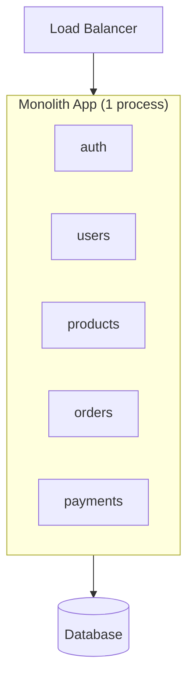
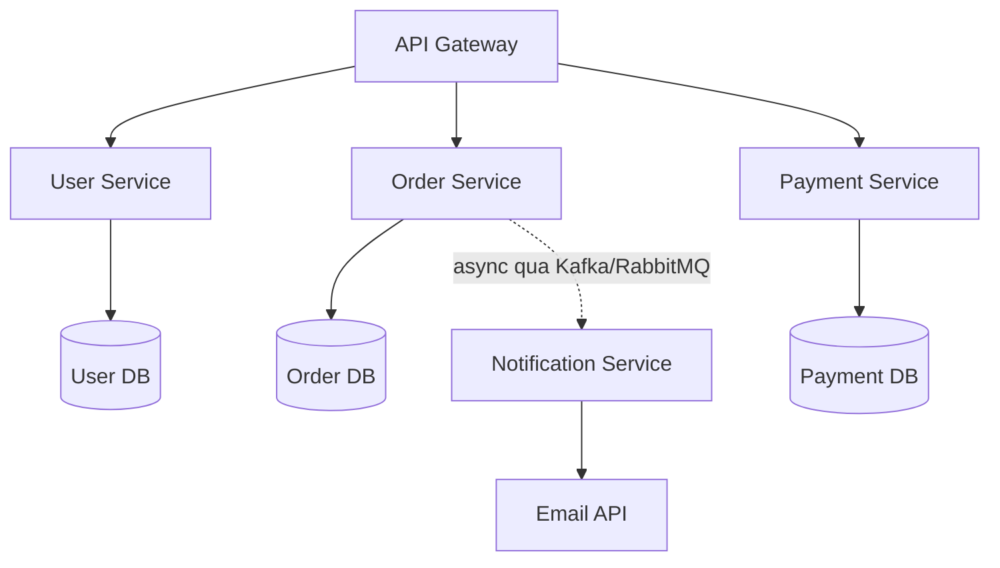

# Monolith, Microservices, Serverless

Đây là các kiểu kiến trúc để tổ chức một ứng dụng backend: gộp tất cả vào một khối (monolith), chia nhỏ thành nhiều dịch vụ riêng (microservices), hay chạy theo từng hàm khi cần (serverless). Hiểu chúng quan trọng vì mỗi cách có ưu nhược điểm riêng, chọn đúng giúp tiết kiệm công sức và dễ mở rộng về sau. Bài này so sánh các kiểu để bạn biết khi nào nên chọn cái nào; phần chi tiết nằm bên dưới.

[](pathname:///img/backend/architecture-patterns.webp)

---

:::note[Ghi nhớ nhanh]

- ⭐ **3 kiểu kiến trúc chính** — Monolith (1 codebase, đơn giản), Microservices (nhiều service deploy độc lập), Serverless (FaaS chạy on-demand, tự scale).
- ⭐ **80% startup không cần microservices** — monolith đủ đến hàng triệu user; `modular monolith` là compromise hiện đại, migrate sang microservice dễ hơn ngược lại.
- **Serverless** hợp traffic spike/cron/webhook, nhưng có cold start, giới hạn thời gian và khó DB pooling.
- **`12-Factor App`** — bộ nguyên tắc cloud-native (config qua env, stateless, log ra stdout...).
- **Chọn theo team size + traffic thực tế**, không chạy theo hype (nhiều công ty lớn đã quay về monolith để tiết kiệm chi phí).

:::

---

## Mục lục

- [Monolith](#monolith)
- [Microservices](#microservices)
- [Serverless](#serverless)
- [SOA và Service Mesh](#soa-và-service-mesh)
- [Twelve Factor Apps](#twelve-factor-apps)
- [Khi nào chọn cái nào?](#khi-nào-chọn-cái-nào)
- [Câu hỏi phỏng vấn](#câu-hỏi-phỏng-vấn)

---

## Monolith

**1 codebase + 1 deploy unit**. Truyền thống, đơn giản.

:::tip[Ví dụ đời thường]

Monolith giống **một nhà hàng duy nhất, một cái bếp**: món khai vị, món chính, tráng miệng đều nấu chung một bếp, chung một cái kho, chung một hoá đơn. Muốn sửa công thức món nào thì cứ vào bếp đó mà sửa, nhìn một cái là thấy hết.

Cái giá phải trả: tối nào khách đông, bạn **không thể chỉ nhân đôi mỗi khu làm món chính** — muốn phục vụ gấp đôi thì phải mở nguyên một nhà hàng y hệt. Và bếp trưởng chỉ đổi cách xếp bếp một chút thôi là **cả nhà hàng phải đóng cửa** vài phút để sắp lại (deploy lại toàn bộ).

:::

```
[Load Balancer] → [Monolith App] → [DB]
                       ↓
                 [auth, users, products, orders, payments...]
                       (cùng process)
```



**Ưu**:

- **Simple** dev + deploy.
- **Easy debug** — stack trace + 1 codebase.
- **Transaction native** — DB transaction qua module.
- **Less infra** — 1 server đủ.
- **Faster** local dev (no network call internal).

**Nhược**:

- Scale **toàn app** — không scale module riêng.
- Big team **conflict** trên cùng codebase.
- Deploy = redeploy hết.
- Tech stack **single** (1 ngôn ngữ, 1 framework).

**Phù hợp**:

- Startup early stage.
- Team < 20 dev.
- App < 100k LOC.

:::info[Phân tích]

**"Modular monolith"** — modern compromise:

```
src/
├── modules/
│   ├── users/       # bounded context
│   │   ├── domain/
│   │   ├── application/
│   │   └── infrastructure/
│   ├── orders/
│   ├── payments/
│   └── shared/
└── app.ts
```

Mỗi module có:

- Boundary rõ.
- Interface (public API).
- Database table riêng.
- Own dependency.

Lợi ích:

- Đơn giản như monolith.
- Scale code organization tốt.
- Migrate sang microservice **dễ dàng** sau (mỗi module → 1 service).

DDD (Domain-Driven Design) + modular monolith = pattern recommended 2026
cho startup.

:::

---

## Microservices

**Nhiều service nhỏ**, deploy độc lập, giao tiếp qua network.

:::tip[Ví dụ đời thường]

Microservices giống **khu food court nhiều ki-ốt riêng**: ki-ốt phở, ki-ốt trà sữa, ki-ốt tráng miệng — mỗi ki-ốt bếp riêng, kho riêng, tự đổi menu mà không phải xin phép ai. Ki-ốt trà sữa đông khách thì **mở thêm 3 quầy trà sữa**, mấy ki-ốt kia giữ nguyên.

Cái giá phải trả: các ki-ốt không còn chung một cái kho, muốn phối hợp thì phải **chạy qua chạy lại nói chuyện với nhau** (network call — chậm hơn hét một tiếng trong bếp). Khách gọi combo phở + trà sữa mà trà sữa hết hàng thì **không có cách nào huỷ nguyên combo trong một nốt nhạc** (mất transaction, phải bù trừ thủ công). Chưa kể phải nuôi thêm đội quản lý mặt bằng, camera, bảng chỉ dẫn (k8s, monitoring, tracing).

:::

```
[API Gateway]
    ↓
├─ [User Service] → [User DB]
├─ [Order Service] → [Order DB]
├─ [Payment Service] → [Payment DB]
└─ [Notification Service] → [Email API]

         ↕ (sync HTTP/gRPC)
         ↕ (async via Kafka/RabbitMQ)
```



Mỗi service có **database riêng** và deploy độc lập; giao tiếp đồng bộ (HTTP/gRPC) hoặc bất đồng bộ (message broker).

**Ưu**:

- **Independent deploy** — release fast.
- **Scale per service** — chỉ scale bottleneck.
- **Tech diversity** — service Go, service Python.
- **Team autonomy** — own service end-to-end.
- **Fault isolation** — 1 service crash, others alive.

**Nhược**:

- **Complexity** — distributed system khó.
- **Network latency** — service call slow hơn function call.
- **Data consistency** — không transaction cross-service.
- **Operational overhead** — k8s, monitoring, tracing mọi service.
- **Debug khó** — trace request qua nhiều service.

**Phù hợp**:

- Team **100+ dev**.
- App **scale rất lớn**.
- Tech stack **đa dạng** cần.
- Compliance — isolation strict.

:::warning[Cần lưu ý]

**"Microservices premium"** — chi phí ẩn:

- DevOps team dedicated (k8s, CI/CD multi-service).
- Service mesh (Istio, Linkerd) cho mTLS, routing.
- Distributed tracing (Jaeger, Tempo).
- Service discovery.
- Circuit breaker.
- Saga pattern cho transaction.
- Event sourcing đôi khi.

→ **80% startup không cần microservices**. Monolith đủ đến hàng triệu user.

Famous quote: "*If you can't build a monolith, what makes you think
microservices are the answer?*" — Simon Brown.

Migrate khi:

- Team > 20 dev và conflict.
- Module scale rất khác nhau.
- Compliance buộc isolation.

:::

---

## Serverless

**FaaS (Function as a Service)** — code chạy on-demand, không quản server.

:::tip[Ví dụ đời thường]

Monolith hay microservices là **thuê xe cả tháng** — xe nằm bãi không chạy bạn vẫn trả tiền. Serverless là **gọi xe theo chuyến**: cần thì mở app, đi xong trả đúng cuốc đó, 1000 người gọi cùng lúc thì hãng tự điều 1000 xe.

Cái giá phải trả: mỗi cuốc phải **chờ tài xế tới đón** (`cold start`), tài xế chỉ chở tối đa 15 phút rồi thả bạn xuống (time limit), và bạn **không để đồ lại trên xe được** (stateless — khó giữ kết nối DB lâu dài). Đi liên tục cả ngày thì gọi theo chuyến lại đắt hơn thuê tháng.

:::

```
[HTTP Request] → [Function (cold start ~ms)] → [DB/Service]
                  ↓
            tự scale 0 → 10000 instance
```

**Provider**:

- **AWS Lambda** — phổ biến nhất.
- **Vercel Functions**.
- **Cloudflare Workers** — edge.
- **GCP Cloud Functions**.
- **Azure Functions**.

**Ưu**:

- **Pay-per-use** — không tính khi idle.
- **Auto scale** — instant scale to traffic.
- **No ops** — provider handle infra.
- **Fast deploy**.

**Nhược**:

- **Cold start** — first request slow (Java/Node 1-3s, Go ~50ms).
- **Time limit** — Lambda 15 min, Vercel 60s.
- **Stateless** — no persistent connection (DB pooling tricky).
- **Vendor lock-in**.
- **Debug** harder (distributed log).
- **Cost** unpredictable nếu traffic spike.

**Phù hợp**:

- API có traffic spike (event-driven).
- Cron job, scheduled task.
- Webhook handler.
- Light API.

**Không phù hợp**:

- App long-running connection (WebSocket).
- Heavy compute > 15 min.
- Đụng DB nhiều (cold start + pool issue).

```ts
// AWS Lambda (Node.js)
export const handler = async (event) => {
  const body = JSON.parse(event.body);

  const user = await db.user.create({ data: body });

  return {
    statusCode: 201,
    body: JSON.stringify(user),
  };
};
```

```ts
// Cloudflare Workers
export default {
  async fetch(request, env) {
    const data = await env.KV.get("key");
    return new Response(data);
  },
};
```

---

## SOA và Service Mesh

**SOA (Service-Oriented Architecture)** — predecessor của microservices.

- Service lớn hơn microservice.
- Communicate qua **ESB (Enterprise Service Bus)**.
- XML/SOAP truyền thống.

Dần dần lose ground vào microservices (lightweight, JSON, HTTP).

:::tip[Ví dụ đời thường]

`SOA` giống công ty kiểu cũ có **một tổng đài trung tâm**: phòng nào muốn nói chuyện với phòng nào cũng phải gọi qua tổng đài, tổng đài nghe rồi chuyển tiếp (`ESB`). Được cái mọi thứ đi qua một chỗ nên dễ kiểm soát, nhưng tổng đài nghỉ một buổi là **cả công ty câm luôn**, và nó dần thành nút thắt cổ chai. Microservices bỏ tổng đài, cho các phòng gọi thẳng cho nhau.

:::

**Service Mesh** — infrastructure layer cho microservice:

```
[Service A] ↔ [Sidecar Proxy] ↔ [Sidecar Proxy] ↔ [Service B]
              (Envoy/Linkerd)    (Envoy/Linkerd)
```

Sidecar handle:

- **mTLS** — encrypt service-to-service.
- **Retry, timeout, circuit breaker**.
- **Load balancing** smart.
- **Tracing** auto-inject.
- **Canary, traffic split** declarative.

:::tip[Ví dụ đời thường]

`Service Mesh` là **gắn cho mỗi phòng ban một anh thư ký riêng ngồi ngay cửa** (sidecar). Phòng ban chỉ việc nói "gửi cái này cho phòng Kế toán"; còn niêm phong phong bì (mTLS), gọi lại khi bên kia bận (retry), ngừng gọi khi bên kia sập (circuit breaker), ghi sổ ai gửi gì lúc mấy giờ (tracing) — thư ký lo hết, **code bên trong phòng không phải sửa một dòng nào**.

Cái giá phải trả: nuôi thêm một anh thư ký cho **mỗi** phòng, tốn RAM/CPU và thêm một lớp phải vận hành. Công ty có 3 phòng thì thuê thư ký làm gì cho tốn.

:::

**Phổ biến**:

- **Istio** — mature, feature-rich.
- **Linkerd** — simpler, Rust.
- **Consul Connect** — HashiCorp.
- **Cilium** — eBPF-based, modern.

Service mesh **chỉ cần** khi đã microservice scale lớn. Project nhỏ →
overkill.

---

## Twelve Factor Apps

**12 principles** cho cloud-native app:

1. **Codebase** — 1 codebase tracked Git, nhiều deploy.
2. **Dependencies** — declare explicit (package.json, requirements.txt).
3. **Config** — env variable, không hardcode.
4. **Backing services** — DB, cache, queue như attached resource (URL).
5. **Build, release, run** — strict separation.
6. **Processes** — stateless, share-nothing.
7. **Port binding** — self-contained, expose via port.
8. **Concurrency** — scale out via process model.
9. **Disposability** — fast startup + graceful shutdown.
10. **Dev/prod parity** — keep similar.
11. **Logs** — stdout, không file.
12. **Admin processes** — one-off task qua script + same env.

:::tip[Ví dụ đời thường]

`12-Factor` giống bộ nội quy cho **căn hộ cho thuê ngắn hạn**: đồ đạc chuẩn hoá để ai vào ở cũng được, **chìa khoá và mã wifi đưa riêng cho khách chứ không khắc lên tường** (config qua env), khách không để đồ cá nhân lại trong phòng (stateless), dọn xong là **cho khách mới vào ở ngay** (startup nhanh, tắt gọn — disposability), và phòng mẫu trên ảnh phải giống hệt phòng thật (dev/prod parity).

Nhờ vậy chủ nhà muốn mở thêm 50 phòng y hệt hay dẹp bớt 10 phòng đều làm trong vài phút — đúng thứ Docker + Kubernetes cần.

:::

Pattern này guideline cho **Docker + Kubernetes + 12-factor** stack hiện đại.

[12factor.net](https://12factor.net) — đọc đầy đủ.

---

## Khi nào chọn cái nào?

```
Team size?

├─ 1-5 dev → Monolith
├─ 5-20 dev → Modular Monolith
├─ 20-100 dev → Microservices (nếu thực sự cần)
└─ 100+ dev → Microservices + Service Mesh

Traffic pattern?

├─ Steady → Monolith / Microservice container
├─ Spike / event-driven → Serverless
└─ Low + free → Serverless free tier

Use case?

├─ MVP, startup → Monolith
├─ Multi-team, scale lớn → Microservices
├─ Internal tool, CRUD → Monolith
└─ AI / processing pipeline → Serverless + queue
```

:::tip[Mẹo]

**Modern architecture stack 2026** cho startup:

```
[Frontend: Next.js + Vercel]
    ↓
[Backend: Node.js + Fastify/Hono]
    (Modular monolith)
    ↓
[DB: PostgreSQL (Neon/Supabase)]
[Cache: Redis (Upstash)]
[Queue: BullMQ / Inngest]
[Search: Meilisearch / Postgres FTS]
[Storage: S3 / Cloudflare R2]
[Email: Resend / Postmark]
[Auth: Clerk / Better Auth]
[Observability: Sentry + Vercel Analytics]
```

Đa số managed, ít ops, scale to millions before refactor.

Khi thực sự cần microservices, **extract module → service** dần dần. Đừng
start với 20 microservice.

:::

:::info[Phân tích]

**Lesson từ industry 2020-2026**:

- **Amazon Prime Video** moved **microservices → monolith** for cost saving.
- **Twitter (X)** simplified service count.
- **Segment** consolidated microservices.
- **Shopify** stays modular monolith.

Trend: "**Right-sized architecture**" — không over-engineer. Microservice
khi **really** cần, không vì hype.

Modular monolith → microservice migration **dễ hơn** ngược lại
(microservice → monolith tốn rất nhiều).

→ Start simple, scale architecture theo team + load thực tế.

:::

---

## Câu hỏi phỏng vấn

Những câu thường gặp về chủ đề này. Tự trả lời trước, rồi bấm **Xem đáp án** để đối chiếu.

**1. So sánh `monolith`, `microservices` và `serverless` trên bốn tiêu chí: tốc độ phát triển, khả năng scale, độ phức tạp vận hành và chi phí. Mỗi kiểu hợp với quy mô team nào?**

<details className="qa">
<summary>Xem đáp án</summary>

| Tiêu chí | `Monolith` | `Microservices` | `Serverless` |
|---|---|---|---|
| Tốc độ phát triển | Nhanh nhất lúc đầu, chậm dần khi codebase phình | Chậm lúc dựng nền, sau đó mỗi team chạy độc lập | Rất nhanh cho case nhỏ, gò bó khi logic phức tạp |
| Scale | Chỉ scale được **cả khối** | Scale từng service theo bottleneck | Tự scale từ 0 tới rất lớn |
| Vận hành | Nhẹ, một deploy unit | Nặng: k8s, monitoring, tracing, service discovery | Provider lo hạ tầng, nhưng debug phân tán khó |
| Chi phí | Dễ đoán, rẻ khi nhỏ | Cao: hạ tầng cộng đội DevOps | Rẻ khi idle, đắt và khó đoán khi traffic lớn liên tục |

Theo quy mô team: 1-5 dev chọn monolith; 5-20 dev chọn modular monolith; 20-100 dev mới cân nhắc microservices nếu thật sự cần; trên 100 dev thì microservices kèm service mesh. Serverless không chia theo team size mà theo dạng tải: spike, cron, webhook, API nhẹ.

</details>

**2. `Modular monolith` là gì? Nó khác `monolith` truyền thống ở điểm nào, và vì sao được xem là bước đệm tốt trước khi tách `microservices`?**

<details className="qa">
<summary>Xem đáp án</summary>

`Modular monolith` vẫn là **một codebase, một deploy unit**, nhưng bên trong được chia thành các module theo bounded context (`users`, `orders`, `payments`...), mỗi module có:

- Ranh giới rõ ràng, chỉ gọi nhau qua interface công khai.
- Bảng database riêng, không module nào chọc thẳng vào bảng của module khác.
- Dependency riêng, phân tầng domain / application / infrastructure.

Khác monolith truyền thống ở chỗ monolith cũ thường là "big ball of mud": mọi thứ gọi thẳng vào nhau, query chéo bảng tuỳ ý, nên gỡ ra rất đau.

Là bước đệm tốt vì nó giữ được toàn bộ ưu điểm của monolith (transaction native, debug dễ, một lần deploy) trong khi **ép sẵn ranh giới service**. Khi thật sự cần tách, mỗi module gần như tương ứng một service, việc còn lại chủ yếu là thay lời gọi hàm bằng lời gọi mạng. Kết hợp với DDD, đây là lựa chọn được khuyến nghị cho startup.

</details>

**3. `12-Factor App` yêu cầu ứng dụng phải `stateless` và đọc config qua biến môi trường. Giải thích vì sao hai nguyên tắc này là điều kiện cần để scale ngang.**

<details className="qa">
<summary>Xem đáp án</summary>

Scale ngang nghĩa là chạy thêm nhiều bản sao giống hệt nhau sau load balancer, và request có thể rơi vào bất kỳ bản nào.

`Stateless` là điều kiện cần vì nếu process giữ state trong bộ nhớ hoặc trên đĩa cục bộ (session, file upload, cache cục bộ) thì request thứ hai của cùng một user rơi sang instance khác sẽ không thấy state đó. Khi ấy phải dùng sticky session — gắn user vào một instance — và mọi lợi ích của scale ngang biến mất, chưa kể instance chết là mất state. Giải pháp: đẩy state ra backing service (Postgres, Redis, S3), process chỉ còn là đơn vị tính toán vứt đi được (disposability).

Config qua **biến môi trường** là điều kiện cần vì cùng một image phải chạy được ở dev, staging, production mà chỉ khác env. Nếu config nằm trong code thì mỗi môi trường một build, mất dev/prod parity, và secret bị commit vào git.

Hai nguyên tắc này chính là nền tảng để Docker và Kubernetes có thể tạo, giết, thay thế pod tuỳ ý.

</details>

**4. Những tín hiệu nào cho bạn biết đã đến lúc tách `monolith`? Ngược lại, tín hiệu nào cho thấy team chưa nên đụng vào `microservices`?**

<details className="qa">
<summary>Xem đáp án</summary>

Tín hiệu nên tách:

- Team vượt khoảng 20 dev và **đụng nhau liên tục** trên cùng codebase, merge conflict và hàng đợi release kéo dài.
- Các module có nhu cầu scale **rất khác nhau** — một phần ngốn CPU gấp nhiều lần phần còn lại mà vẫn phải nhân bản cả khối.
- Một phần cần tech stack khác hẳn, hoặc vòng đời release khác hẳn.
- Compliance buộc cách ly dữ liệu, hạ tầng riêng.
- Một module lỗi kéo sập cả app và không có cách nào cách ly.

Tín hiệu chưa nên đụng vào:

- Team dưới 20 người, chưa có DevOps chuyên trách.
- Chưa có CI/CD tốt, chưa có monitoring, log tập trung, tracing.
- Ranh giới domain còn mơ hồ — tách sai chỗ sẽ tạo ra "distributed monolith", tệ hơn cả monolith.
- Vấn đề thật ra là hiệu năng một truy vấn hay tổ chức code kém, chứ không phải kiến trúc.

Câu nói kinh điển của Simon Brown: nếu chưa build nổi một monolith tử tế thì microservices không phải câu trả lời.

</details>

**5. Mô tả chiến lược tách dần một `monolith` đang chạy production (ví dụ `Strangler Fig`). Bạn chọn service nào để tách đầu tiên và dựa vào tiêu chí gì?**

<details className="qa">
<summary>Xem đáp án</summary>

`Strangler Fig` là tách **dần dần**, không viết lại từ đầu: đặt một lớp chặn (API gateway hoặc reverse proxy) trước monolith, rồi từng chức năng một được cài đặt lại ở service mới và route sang đó, monolith co lại cho tới khi biến mất.

Các bước thường làm:

1. Dựng gateway định tuyến trước, mọi traffic vẫn về monolith.
2. Chọn một module, làm rõ ranh giới và tách dữ liệu của nó ra trước (bỏ join chéo, thay bằng API hoặc event).
3. Viết service mới, chạy song song và đối chiếu kết quả với monolith.
4. Chuyển traffic từ từ (canary, feature flag), giữ đường lùi.
5. Xoá code cũ trong monolith, lặp lại với module kế tiếp.

Chọn module đầu tiên theo tiêu chí: **ít phụ thuộc nhất** vào phần còn lại, ranh giới rõ, ít bảng dùng chung; có nhu cầu scale hoặc release riêng rõ rệt; rủi ro nghiệp vụ thấp nếu lỗi. Ví dụ điển hình là notification hoặc search — thường là đường một chiều, không nằm trong transaction tiền bạc.

</details>

**6. Vì sao `microservices` thường đi kèm nguyên tắc `database per service`? Nguyên tắc đó khiến việc join dữ liệu và làm báo cáo khó ra sao, và bạn giải quyết thế nào?**

<details className="qa">
<summary>Xem đáp án</summary>

Vì nếu nhiều service dùng chung một database thì lược đồ trở thành mặt tiếp xúc chung: đổi một cột là phải phối hợp deploy nhiều service, khoá và tải của service này đè lên service kia, và mỗi service không còn tự chọn được loại database phù hợp. Khi đó ta có "distributed monolith" — chịu đủ cái khổ của phân tán mà chẳng được tính độc lập.

Cái mất: không còn `JOIN` xuyên service và không còn transaction chung. Một trang hiển thị đơn hàng kèm thông tin người mua giờ cần hai lời gọi; báo cáo tổng hợp không viết nổi bằng một câu SQL.

Cách giải quyết:

- **API composition** — service tổng hợp gọi vài service rồi ghép kết quả; đơn giản nhưng không hợp truy vấn lớn.
- **CQRS với read model**: dựng sẵn một bảng đọc được cập nhật qua event, phục vụ màn hình cần dữ liệu từ nhiều nguồn.
- **Data warehouse / lake** cho báo cáo và analytics, nạp bằng CDC (Debezium) hoặc ETL định kỳ — đừng làm báo cáo nặng trên database nghiệp vụ.
- Chấp nhận eventual consistency và thiết kế UX phù hợp.

</details>

**7. Không có transaction xuyên service, bạn đảm bảo nhất quán dữ liệu bằng cách nào? Giải thích `Saga` và so sánh `choreography` với `orchestration`.**

<details className="qa">
<summary>Xem đáp án</summary>

`Saga` chia một giao dịch nghiệp vụ dài thành **chuỗi transaction cục bộ**, mỗi transaction nằm gọn trong một service. Nếu một bước fail, saga chạy các **compensating transaction** để hoàn tác những bước đã xong, thay vì rollback nguyên tử như database. Kết quả là nhất quán cuối cùng (eventual consistency), không phải nhất quán tức thời.

| | `Choreography` | `Orchestration` |
|---|---|---|
| Điều phối | Không ai cầm trịch; mỗi service nghe event và phát event tiếp | Một orchestrator ra lệnh từng bước và theo dõi trạng thái |
| Coupling | Lỏng, dễ thêm service mới | Chặt hơn vào orchestrator |
| Theo dõi luồng | Khó — luồng nằm rải rác, dễ thành "ai gọi ai" rối rắm | Dễ — luồng nằm một chỗ, dễ log và debug |
| Hợp với | Saga ngắn, 2-3 bước | Saga dài, nhiều nhánh rẽ và bù trừ |

Thực tế: luồng đơn giản thì choreography cho nhẹ; luồng thanh toán, đặt hàng nhiều bước thì orchestration dễ vận hành hơn nhiều. Cả hai đều đòi consumer idempotent vì message có thể tới nhiều lần.

</details>

**8. `Compensating transaction` là gì? Điều gì xảy ra nếu chính bước bù trừ cũng thất bại, và bạn thiết kế phòng ngừa ra sao?**

<details className="qa">
<summary>Xem đáp án</summary>

`Compensating transaction` là thao tác nghiệp vụ **hoàn tác hậu quả** của một bước đã commit: đã trừ tiền thì hoàn tiền, đã giữ hàng trong kho thì trả lại, đã tạo đơn thì huỷ đơn. Nó không phải rollback của database — dữ liệu cũ đã commit và có thể đã bị bên khác nhìn thấy, nên bù trừ là một hành động mới, và đôi khi không thể hoàn tác thật (email đã gửi đi rồi).

Nếu bước bù trừ cũng fail, hệ thống rơi vào trạng thái dở dang: tiền đã trừ mà hàng không có. Đây là tình huống tệ nhất của saga.

Phòng ngừa:

- Bù trừ phải **idempotent** và được retry với backoff, tuyệt đối không bỏ qua lỗi.
- Ghi trạng thái saga bền vững để khôi phục và chạy tiếp sau khi service restart.
- Hết số lần retry thì đẩy vào dead letter queue kèm **alert cho người thật**.
- Thiết kế thứ tự bước sao cho việc khó hoàn tác nhất nằm **cuối cùng**, và ưu tiên "reserve rồi confirm" thay vì làm thật rồi mới huỷ.

</details>

**9. `Outbox pattern` giải quyết vấn đề gì khi một service vừa phải ghi database vừa phải publish event? Vì sao không thể chỉ "commit DB xong rồi gọi Kafka"?**

<details className="qa">
<summary>Xem đáp án</summary>

Vấn đề là **dual write** vào hai hệ thống không chung transaction. "Commit DB xong rồi gọi Kafka" hỏng ở đúng khe hở giữa hai lời gọi: nếu service crash hoặc broker lỗi ngay sau commit, dữ liệu đã đổi nhưng **không ai biết** — service khác vĩnh viễn không nhận được event. Làm ngược lại (publish trước) thì gặp rủi ro đối xứng: event đã bay đi trong khi transaction rollback, các service khác phản ứng theo dữ liệu không tồn tại.

`Outbox pattern`: trong **cùng transaction** với thay đổi nghiệp vụ, ghi thêm một dòng vào bảng `outbox` mô tả event. Commit thì cả hai cùng có, rollback thì cả hai cùng mất — tính nguyên tử được database đảm bảo. Sau đó một tiến trình riêng (poller, hoặc CDC kiểu Debezium đọc WAL) đọc bảng outbox, publish lên broker rồi đánh dấu đã gửi.

Đổi lại: event có độ trễ nhỏ và chỉ đảm bảo at-least-once (poller có thể gửi lại dòng chưa kịp đánh dấu), nên consumer vẫn phải idempotent.

</details>

**10. So sánh giao tiếp `synchronous` (REST/gRPC) với `asynchronous` (message queue) giữa các service, về mức độ coupling và các kiểu hỏng hóc có thể xảy ra. Khi nào chọn cái nào?**

<details className="qa">
<summary>Xem đáp án</summary>

| Tiêu chí | Sync (REST/gRPC) | Async (message queue) |
|---|---|---|
| Coupling | Cả về thời gian lẫn địa chỉ: callee phải sống và phải biết gọi ai | Lỏng: producer chỉ cần broker, không biết ai nghe |
| Kiểu hỏng | Callee chậm thì caller bị chặn, timeout, lan thành cascading failure | Broker chết, message tồn đọng, consumer lag tăng |
| Kết quả | Có ngay, dễ lập trình | Trả lời sau, phải xử lý eventual consistency |
| Thêm bên quan tâm | Phải sửa caller | Thêm subscriber, không đụng producer |

Chọn sync khi **cần câu trả lời ngay để tiếp tục**: kiểm tra quyền, đọc dữ liệu hiển thị, xác thực thanh toán. Ưu tiên gRPC cho gọi nội bộ nhiều và cần hiệu năng, luôn kèm timeout, retry, circuit breaker.

Chọn async khi việc có thể làm sau hoặc nhiều bên cùng quan tâm: gửi email, cập nhật search index, phát sinh báo cáo, thông báo "order.created" cho kho và analytics. Async còn giúp buffer spike và cách ly lỗi — consumer chết không làm hỏng request của người dùng.

Thực tế hệ thống tốt dùng cả hai, đúng chỗ.

</details>

**11. Giải thích `circuit breaker`, `timeout` và `retry với exponential backoff`. Vì sao retry một cách máy móc có thể biến sự cố nhỏ thành `cascading failure`?**

<details className="qa">
<summary>Xem đáp án</summary>

- `timeout` — trần thời gian chờ một lời gọi. Không có nó thì thread và connection bị giữ vô hạn khi downstream treo, và caller cạn tài nguyên.
- `retry với exponential backoff` — thử lại sau những khoảng chờ tăng dần (1s, 2s, 4s) cộng jitter ngẫu nhiên, và chỉ retry lỗi tạm thời.
- `circuit breaker` — đếm tỉ lệ lỗi; vượt ngưỡng thì "ngắt mạch", các lời gọi tiếp theo **fail ngay lập tức** không đi ra ngoài nữa. Sau một lúc chuyển sang trạng thái half-open cho vài request thăm dò, ổn thì đóng mạch lại.

Retry máy móc gây `cascading failure` vì dịch vụ downstream đang quá tải lại phải nhận **thêm** lượng request nhân đôi, nhân ba nên càng chết sâu hơn; retry ở nhiều tầng lồng nhau thì số lần nhân theo cấp số nhân; không có jitter thì mọi client retry cùng một nhịp (thundering herd). Trong khi chờ, caller giữ thread và connection, cạn tài nguyên rồi chính nó cũng chết, kéo tiếp tầng trên.

Vì vậy bộ ba này phải đi cùng nhau, kèm giới hạn số lần retry và bulkhead để cô lập tài nguyên.

</details>

**12. `Service discovery` hoạt động thế nào trong môi trường container? Phân biệt client-side và server-side discovery.**

<details className="qa">
<summary>Xem đáp án</summary>

Trong môi trường container, IP của instance thay đổi liên tục (pod bị giết và tạo lại, autoscale lên xuống), nên không thể hardcode địa chỉ. `Service discovery` giải bài toán "service B hiện đang ở những đâu".

Cơ chế chung: mỗi instance **đăng ký** vào một registry khi khởi động và bị gỡ khi chết hoặc fail health check; bên gọi **tra cứu** registry để lấy danh sách địa chỉ còn sống.

| | Client-side | Server-side |
|---|---|---|
| Ai tra registry | Chính client, rồi tự chọn instance và load balance | Một thành phần trung gian (load balancer, proxy) |
| Ví dụ | Eureka kèm thư viện trong app, Consul | Kubernetes Service, API gateway, sidecar trong service mesh |
| Ưu | Bớt một chặng mạng, client tự chọn chiến lược | App không cần biết gì, đa ngôn ngữ dễ |
| Nhược | Phải nhúng thư viện vào mọi service, mọi ngôn ngữ | Thêm một hop và một thành phần phải vận hành |

Với Kubernetes, việc này gần như trong suốt: gọi theo **tên Service**, DNS nội bộ phân giải ra ClusterIP và kube-proxy phân phối tới các pod đang ready.

</details>

**13. `API Gateway` giải quyết những vấn đề gì? Nó khác `Service Mesh` ra sao — cái nào lo traffic `north-south`, cái nào lo `east-west`?**

<details className="qa">
<summary>Xem đáp án</summary>

`API Gateway` là cửa ngõ duy nhất cho traffic từ bên ngoài vào hệ thống. Nó gom những việc mà không service nào nên làm lại: định tuyến theo path và host, xác thực và phân quyền ở biên, rate limiting, TLS termination, CORS, versioning, đôi khi cả tổng hợp nhiều lời gọi cho một màn hình. Nhờ đó client chỉ cần biết một địa chỉ và không phải biết hệ thống có bao nhiêu service.

`Service Mesh` lo giao tiếp **giữa các service với nhau** bên trong cluster, qua sidecar proxy đặt cạnh mỗi service: mTLS, retry, timeout, circuit breaker, tracing tự động, canary và traffic split khai báo được.

Phân vai gọn:

- Gateway lo traffic `north-south` — ngoài vào trong.
- Mesh lo traffic `east-west` — service gọi service.

Hai thứ bổ sung nhau chứ không thay thế nhau. Dự án nhỏ hầu như chỉ cần gateway; mesh chỉ đáng khi đã có nhiều service, vì mỗi service phải nuôi thêm một sidecar.

</details>

**14. `Service Mesh` (Istio, Linkerd) cung cấp `mTLS`, retry, tracing, canary ở tầng hạ tầng. Cái giá phải trả về hiệu năng và vận hành là gì?**

<details className="qa">
<summary>Xem đáp án</summary>

Điểm hay là mọi thứ nằm ở hạ tầng: code trong service không phải sửa một dòng nào mà vẫn có mã hoá, retry, circuit breaker và tracing — như gắn cho mỗi phòng ban một thư ký riêng ngồi ngay cửa.

Cái giá về hiệu năng:

- Mỗi lời gọi đi qua **hai proxy** (sidecar bên gửi và bên nhận), cộng thêm độ trễ ở mỗi chặng.
- Mỗi pod phải nuôi thêm một container sidecar, tốn thêm CPU và RAM — nhân với số pod thì không hề nhỏ.
- mTLS thêm chi phí bắt tay và mã hoá.

Cái giá về vận hành:

- Thêm một control plane phải cài, nâng cấp, vá lỗi; upgrade mesh là việc rủi ro.
- Đường đi của request phức tạp hơn, debug khó hơn: lỗi có thể nằm ở app, ở sidecar, hoặc ở cấu hình routing.
- Cấu hình khai báo rất mạnh nhưng học mất thời gian, cấu hình sai dễ chặn nhầm traffic.
- Cần người hiểu mesh trong team.

Kết luận: chỉ dùng khi đã microservices ở quy mô lớn. Ba service mà dựng mesh là overkill.

</details>

**15. Một request đi qua 8 service và bị chậm bất thường. Bạn điều tra thế nào? Nói về `correlation ID`, `distributed tracing` và bộ ba log / metric / trace.**

<details className="qa">
<summary>Xem đáp án</summary>

Điều kiện tiên quyết là mỗi request có một `correlation ID` (trace ID) sinh ở gateway, được **truyền qua mọi lời gọi** và ghi vào mọi dòng log. Nhờ đó gom được toàn bộ log của một request dù nằm rải ở 8 service.

`Distributed tracing` (Jaeger, Tempo, OpenTelemetry) dựng từ các span: mỗi chặng xử lý là một span có thời điểm bắt đầu, thời lượng và quan hệ cha con. Nhìn biểu đồ waterfall là thấy ngay chặng nào ngốn thời gian, chặng nào chạy tuần tự trong khi đáng lẽ song song, hay bị gọi lặp kiểu N+1.

Bộ ba bổ sung nhau:

- **Metric** trả lời "có vấn đề không, ở đâu" — p95/p99 latency, error rate, throughput theo service. Dùng để phát hiện và cảnh báo.
- **Trace** trả lời "chậm ở chặng nào" — khoanh vùng đúng service và đúng lời gọi.
- **Log** trả lời "vì sao" — chi tiết lỗi, tham số, stack trace tại đúng chặng đó.

Quy trình: nhìn metric để khoanh vùng, mở trace của request chậm để tìm chặng nghi ngờ, rồi lọc log theo correlation ID để tìm nguyên nhân gốc (query chậm, API ngoài, lock, retry lặp).

</details>

**16. `Cold start` của serverless đến từ đâu? Có những cách nào giảm nó, và vì sao serverless lại khó dùng chung với `connection pooling` của database?**

<details className="qa">
<summary>Xem đáp án</summary>

`Cold start` là thời gian provider phải dựng một môi trường chạy mới khi chưa có instance nào rảnh: cấp sandbox, tải code, khởi động runtime, nạp dependency, rồi mới chạy phần khởi tạo của app. Java và Node thường mất khoảng một đến vài giây, Go nhẹ hơn nhiều. Instance đang ấm thì gần như không có độ trễ này.

Giảm cold start:

- Thu nhỏ bundle, bớt dependency nặng, tránh khởi tạo tốn kém ở scope toàn cục.
- Chọn runtime nhẹ, hoặc nền tảng edge khởi động nhanh như Cloudflare Workers.
- Provisioned concurrency hoặc giữ ấm, đổi tiền lấy độ trễ.
- Giảm số lần scale từ 0 bằng cách gom traffic.

Về `connection pooling`: pool chỉ có ý nghĩa khi tiến trình sống lâu và tái dùng kết nối. Serverless thì mỗi instance là một tiến trình ngắn, số instance nhảy từ 0 lên hàng nghìn theo traffic, nên mỗi instance mở pool riêng và tổng số kết nối bùng nổ, vượt giới hạn của Postgres. Cách xử lý: dùng connection pooler bên ngoài (PgBouncer, Prisma Accelerate, Neon/Supabase pooler) hoặc truy cập database qua HTTP.

</details>

**17. Serverless tính tiền theo lượt gọi. Hãy chỉ ra loại workload mà serverless đắt hơn hẳn một VM chạy 24/7, và giải thích vì sao.**

<details className="qa">
<summary>Xem đáp án</summary>

Loại workload đắt nhất trên serverless là **tải cao và đều liên tục 24/7**: một API nội bộ luôn có vài nghìn request mỗi giây, hoặc một pipeline xử lý chạy không nghỉ.

Lý do: serverless lấy tiền theo số lượt gọi nhân thời gian chạy nhân bộ nhớ cấp phát, với đơn giá cho mỗi đơn vị tính toán **cao hơn nhiều** so với thuê máy trần. Mô hình đó lãi khi máy của bạn phần lớn thời gian nằm không — bạn không trả cho phần idle. Nhưng khi máy chạy gần 100% suốt ngày thì chẳng còn phần idle nào để tiết kiệm, và bạn chỉ đang trả giá lẻ cho thứ có thể mua sỉ.

Vài kiểu khác cũng bất lợi: job chạy dài (Lambda giới hạn 15 phút, Vercel còn ngắn hơn), workload ngốn CPU mà phải cấp nhiều RAM chỉ để có thêm CPU, kết nối dài như WebSocket, và ứng dụng gọi database dày đặc (thêm chi phí pooler).

Đúng bài của serverless là traffic spike, cron, webhook, API nhẹ — đúng như bài đã nêu: gọi xe theo chuyến thì rẻ, đi cả ngày thì nên thuê tháng.

</details>

**18. So sánh `SOA` với `microservices`. Vai trò của `ESB` trong SOA là gì, và vì sao microservices tránh mô hình đó?**

<details className="qa">
<summary>Xem đáp án</summary>

| Tiêu chí | `SOA` | `Microservices` |
|---|---|---|
| Kích thước service | Lớn, theo phòng ban hoặc hệ thống | Nhỏ, theo bounded context |
| Giao tiếp | Qua `ESB` tập trung | Gọi thẳng nhau qua HTTP/gRPC hoặc message broker |
| Giao thức | XML/SOAP, chuẩn nặng | JSON/HTTP, gRPC, nhẹ |
| Dữ liệu | Thường dùng chung database doanh nghiệp | Database per service |
| Triển khai | Theo đợt, phối hợp nhiều bên | Deploy độc lập, liên tục |

`ESB` là tổng đài trung tâm: mọi service nói chuyện với nhau đều qua nó, và nó ôm luôn định tuyến, chuyển đổi định dạng, cả logic nghiệp vụ orchestration.

Microservices tránh mô hình đó vì ESB trở thành **điểm chết đơn lẻ và nút thắt cổ chai**: tổng đài nghỉ thì cả công ty câm, mọi thay đổi đều phải đi qua một đội quản lý ESB nên mất tính tự chủ, và logic nghiệp vụ bị rò rỉ vào tầng hạ tầng. Triết lý thay thế là "smart endpoints, dumb pipes" — logic nằm trong service, đường truyền càng đơn giản càng tốt.

</details>

**19. Amazon Prime Video từng chuyển ngược từ `microservices` về `monolith` để giảm chi phí. Theo bạn nguyên nhân kỹ thuật là gì và bài học rút ra khi chọn kiến trúc?**

<details className="qa">
<summary>Xem đáp án</summary>

Trường hợp đó là **một thành phần** trong hệ thống giám sát chất lượng audio/video, không phải toàn bộ Prime Video. Thiết kế ban đầu chia nhỏ thành nhiều bước phối hợp bằng orchestration, và dữ liệu trung gian (khung hình) phải đi qua storage dùng chung giữa các bước.

Nguyên nhân kỹ thuật: đây là pipeline xử lý dữ liệu lớn, chạy liên tục, các bước gắn bó chặt với nhau. Khi tách nhỏ, mỗi lần chuyển bước phải trả phí điều phối cộng phí truyền dữ liệu qua mạng và storage — những chi phí tăng tuyến tính theo lượng dữ liệu và chiếm phần lớn hoá đơn. Gộp lại thành một tiến trình thì dữ liệu nằm trong bộ nhớ và chuyển bước chỉ là lời gọi hàm.

Bài học: kiến trúc phải chọn theo **đặc tính workload** chứ không theo hype — pipeline dữ liệu gắn bó chặt không hợp với việc cắt nhỏ; chi phí truyền dữ liệu và điều phối giữa các service là có thật và thường bị bỏ qua; đi cả hai chiều đều hợp lệ, đúng kích cỡ (right-sized architecture) mới là mục tiêu.

</details>

**20. Bạn được giao thiết kế kiến trúc cho một startup 5 kỹ sư, chưa rõ product-market fit. Bạn chọn gì và bảo vệ quyết định đó trước một stakeholder đang muốn `microservices` như thế nào?**

<details className="qa">
<summary>Xem đáp án</summary>

Chọn **modular monolith**: một codebase chia module theo bounded context, database Postgres, cache Redis, job queue (BullMQ/Inngest), phần lớn hạ tầng dùng dịch vụ managed để gần như không tốn người vận hành. Bám 12-Factor để sẵn sàng scale ngang khi cần.

Lập luận bảo vệ:

- Với 5 kỹ sư và chưa có product-market fit, tài nguyên khan hiếm nhất là **thời gian tìm đúng sản phẩm**. Microservices lấy đi thời gian đó để trả cho k8s, CI nhiều service, tracing, saga.
- Microservices chỉ đáng khi vấn đề là **tổ chức con người** hoặc scale lệch rõ rệt — cả hai đều chưa xảy ra.
- Monolith đủ phục vụ tới hàng triệu user; nhiều công ty lớn còn quay ngược về monolith để tiết kiệm.
- Khi domain còn mơ hồ, tách sớm gần như chắc chắn tách sai chỗ, tạo ra distributed monolith — tệ hơn cả monolith.
- Rủi ro được kiểm soát: modular monolith giữ sẵn ranh giới nên khi cần chỉ việc **extract từng module thành service**; chiều ngược lại tốn hơn rất nhiều.

Kèm theo, đặt trước tiêu chí kích hoạt việc tách (quy mô team, mức scale lệch, compliance) để quyết định dựa trên dữ liệu.

</details>
