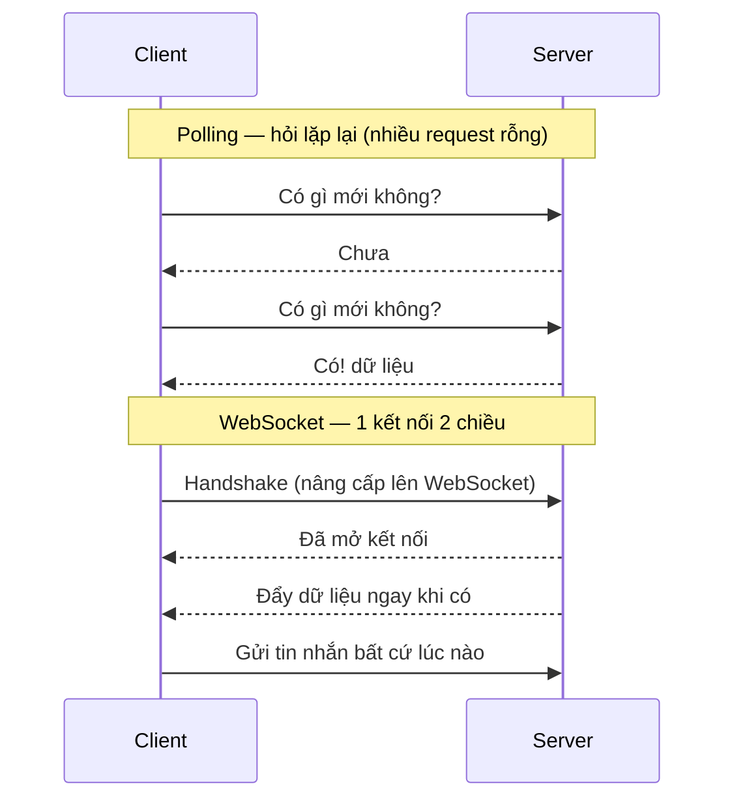

# WebSocket, SSE, Long Polling

Đây là các kỹ thuật giúp server và trình duyệt trao đổi dữ liệu theo thời gian thực, ví dụ như chat, thông báo tức thì hay xem giá cổ phiếu cập nhật liên tục mà không cần tải lại trang. Hiểu chúng quan trọng vì mỗi cách phù hợp với một tình huống khác nhau: một chiều hay hai chiều, đơn giản hay cần độ trễ thấp. Bài này giới thiệu WebSocket, SSE, Long Polling và WebRTC; phần chi tiết nằm bên dưới.

[](pathname:///img/backend/real-time.webp)

---

:::note[Ghi nhớ nhanh]

- ⭐ **`SSE` (one-way server→client, chạy trên HTTP, auto-reconnect sẵn) vs `WebSocket` (hai chiều, full-duplex TCP)** — mỗi cái hợp một tình huống.
- ⭐ **Nhiều case "chat" thực ra dùng `SSE` + fetch POST** đơn giản hơn setup WebSocket; SSE cũng chuẩn cho AI streaming.
- **`WebSocket` là stateful** — scale cần sticky session + Redis pub/sub để broadcast giữa các server.
- **`Long Polling` đã legacy** (2026); **`WebRTC`** cho video/audio P2P nên dùng managed (LiveKit, Daily...).
- **Managed service** (Pusher, Ably, Supabase Realtime, Liveblocks) giảm ~90% effort so với tự build.

:::

---

## Mục lục

- [Real-time options](#real-time-options)
- [Server-Sent Events (SSE)](#server-sent-events-sse)
- [WebSocket](#websocket)
- [Long Polling](#long-polling)
- [WebRTC](#webrtc)
- [Lựa chọn](#lựa-chọn)
- [Câu hỏi phỏng vấn](#câu-hỏi-phỏng-vấn)

---

## Real-time options

| Option | Direction | Use case |
|--------|-----------|---------|
| **Polling** | Client pull | Simple, low-frequency update |
| **Long Polling** | Client pull, server delay | Legacy compat |
| **SSE** | Server → Client | One-way notification |
| **WebSocket** | Bi-directional | Chat, gaming, collab |
| **WebRTC** | Peer-to-peer | Video call, file transfer |

So sánh cách trao đổi dữ liệu — Polling hỏi lặp lại tốn request, còn WebSocket giữ một kết nối hai chiều mở liên tục:



---

## Server-Sent Events (SSE)

**One-way** server → client, qua HTTP.

:::tip[Ví dụ đời thường]

`SSE` giống **cái đài phát thanh**: bạn dò đúng kênh, đài cứ thế nói, bạn cứ thế nghe. Đài **không nghe được bạn** — muốn góp ý thì phải nhắn tin bằng đường khác (một request `fetch`/POST bình thường). Mất sóng thì máy tự dò lại giúp bạn (auto-reconnect có sẵn trong trình duyệt).

Đúng kiểu này là: bảng giá cổ phiếu chạy, thông báo mới nhảy lên, và AI gõ từng chữ ra màn hình.

:::

```ts
// Server (Node Express)
app.get("/events", (req, res) => {
  res.setHeader("Content-Type", "text/event-stream");
  res.setHeader("Cache-Control", "no-cache");
  res.setHeader("Connection", "keep-alive");

  const interval = setInterval(() => {
    res.write(`data: ${JSON.stringify({ time: Date.now() })}\n\n`);
  }, 1000);

  req.on("close", () => clearInterval(interval));
});
```

```ts
// Client (browser)
const source = new EventSource("/events");

source.onmessage = (event) => {
  const data = JSON.parse(event.data);
  console.log(data);
};

source.onerror = () => {
  console.log("SSE disconnected, auto-reconnect");
};
```

**Ưu**:

- **Simple HTTP** — proxy/firewall friendly.
- **Auto-reconnect** built-in browser.
- **Text-based** — easy debug.
- **HTTP/2 multiplex** — many SSE 1 connection.

**Nhược**:

- **One-way** — không client → server (dùng fetch riêng).
- **Browser limit** — 6 SSE / domain (HTTP/2 OK).
- **No binary**.

**Phù hợp**:

- Stock price updates.
- Notification.
- AI chat streaming (ChatGPT, Claude).
- Activity feed.

---

## WebSocket

**Full-duplex** TCP connection, sau khi handshake HTTP upgrade.

:::tip[Ví dụ đời thường]

`WebSocket` giống **cuộc gọi điện thoại**: quay số một lần (handshake), sau đó **đường dây mở suốt**, hai bên nói xen kẽ nhau lúc nào cũng được, không phải bấm số lại cho từng câu.

Cái giá phải trả: tổng đài phải **giữ dây cho từng người**, kể cả lúc không ai nói. Nghìn người online là nghìn sợi dây phải nuôi. Có nhiều tổng đài thì phải đảm bảo bạn luôn quay về đúng tổng đài đang cầm dây của mình (`sticky session`), và các tổng đài phải nối với nhau để chuyển lời qua lại (Redis pub/sub).

:::

```ts
// Server (Node với ws)
import { WebSocketServer } from "ws";

const wss = new WebSocketServer({ port: 8080 });

wss.on("connection", (ws) => {
  console.log("Client connected");

  ws.on("message", (data) => {
    console.log("Received:", data.toString());

    // Echo back
    ws.send(data);

    // Broadcast to all
    wss.clients.forEach(client => {
      if (client.readyState === WebSocket.OPEN) {
        client.send(data);
      }
    });
  });

  ws.on("close", () => console.log("Client disconnected"));
});
```

```ts
// Client (browser)
const ws = new WebSocket("ws://localhost:8080");

ws.onopen = () => ws.send("Hello");
ws.onmessage = (event) => console.log(event.data);
ws.onclose = () => console.log("Disconnected");
```

**Library** Node:

- **ws** — minimal.
- **Socket.IO** — feature-rich (fallback, room, ack).
- **uWebSockets.js** — high performance.
- **Bun WebSocket** — built-in.

**Socket.IO** popular:

```ts
import { Server } from "socket.io";

const io = new Server(httpServer);

io.on("connection", (socket) => {
  socket.join("room1");

  socket.on("message", (data) => {
    io.to("room1").emit("message", data);
  });
});
```

Features:

- **Room** — group socket.
- **Acknowledgment** — confirm receive.
- **Auto-reconnect**.
- **Fallback** (long-polling cho old browser).
- **Namespace**.

**Phù hợp**:

- Real-time chat.
- Collaborative editor (Figma, Google Docs).
- Multiplayer game.
- Live trading.

:::info[Phân tích]

**WebSocket scaling challenge**:

WebSocket = **stateful connection**. Khác stateless HTTP:

- Server cần giữ connection — không scale = trivial.
- **Sticky session** với load balancer.
- **Pub/Sub backend** để broadcast giữa server (Redis).

Pattern scale:

```
[Client1] → [LB sticky] → [WS Server 1]
[Client2] → [LB sticky] → [WS Server 2]
                              ↕
                          [Redis Pub/Sub]
```

Client1 send msg → WS Server 1 → publish Redis → WS Server 2 receive →
forward to Client2.

Library handle:

- **Socket.IO Redis adapter**.
- **Pusher** — managed service.
- **Ably**, **Liveblocks**, **Soketi**.

Managed service đáng cân nhắc cho startup — đỡ ops phức tạp.

:::

---

## Long Polling

**Client** request, server giữ connection cho đến khi có data hoặc timeout.

:::tip[Ví dụ đời thường]

- **Polling** — cứ 5 giây bạn lại **gọi hỏi shipper "tới chưa anh?"**. 9/10 cuộc nhận về "chưa", tốn tiền điện thoại mà tin vẫn trễ tới 5 giây.
- **Long Polling** — bạn gọi một cuộc rồi **giữ máy chờ im lặng**; shipper tới nơi mới lên tiếng, hoặc 30 giây không có gì thì cúp và bạn gọi lại cuộc mới. Ít cuộc gọi rỗng hơn, tin cũng đến nhanh hơn.

Nhưng vẫn là **gọi đi gọi lại**, mỗi cuộc lại chào hỏi từ đầu, và server phải ôm cả đống cuộc đang treo máy. Đã có "đài phát thanh" (`SSE`) và "điện thoại hai chiều" (`WebSocket`) thì không ai làm vậy nữa.

:::

```ts
// Client
async function poll() {
  while (true) {
    try {
      const res = await fetch("/long-poll", { timeout: 30000 });
      const data = await res.json();
      processData(data);
    } catch (err) {
      await sleep(1000);
    }
  }
}
```

```ts
// Server — Express
app.get("/long-poll", async (req, res) => {
  const data = await waitForUpdate(30000); // timeout 30s
  res.json(data);
});
```

**Ưu**:

- Compat browser cũ (IE).
- Firewall friendly (HTTP).

**Nhược**:

- **High latency** so WebSocket.
- **HTTP overhead** mỗi poll.
- **Server connection** stack up.

Năm 2026, **legacy**. Dùng SSE hoặc WebSocket thay.

---

## WebRTC

**Peer-to-peer** giữa browser/native, **không qua server** (sau setup).

:::tip[Ví dụ đời thường]

`WebRTC` giống **hai người nhờ tổng đài nối máy, xong rồi nói thẳng với nhau**. Tổng đài (signaling server) chỉ làm mỗi việc lúc đầu: trao "số nhà" của hai bên cho nhau (offer, answer, ICE). Nối được rồi thì **hình và tiếng đi thẳng từ máy này sang máy kia**, không vòng qua tổng đài nữa — nhờ vậy mới mượt.

Cái giá phải trả: nhà ai cũng có tường rào (NAT/firewall) nên nhiều ca vẫn phải đi vòng qua **một chỗ trung chuyển** (TURN server) rất tốn băng thông. Họp 10 người mà ai cũng gửi hình cho 9 người còn lại thì máy chịu không nổi — nên video conference hãy dùng dịch vụ managed (SFU).

:::

Use case:

- **Video / audio call** (Google Meet, Zoom).
- **File transfer**.
- **Live streaming** P2P.

**3 component**:

- **MediaStream** — audio/video stream.
- **RTCPeerConnection** — connection between peers.
- **RTCDataChannel** — arbitrary data P2P.

Signaling server (WebSocket) để 2 peer **tìm thấy nhau**:

```
Peer A → Signaling Server → Peer B
         (offer, answer, ICE)
                ↓
Peer A ←─────── direct P2P ────────→ Peer B
                (audio/video/data)
```

Setup phức tạp. Library hỗ trợ:

- **Simple-peer** (Node + browser).
- **PeerJS**.
- **LiveKit** — managed WebRTC SFU.
- **Daily.co**, **Agora**, **Twilio Video**.

Cho video conference, **dùng managed** thay tự build (TURN/STUN, scale).

---

## Lựa chọn

```
Use case?

├─ Chat 1-1, room chat                      → WebSocket
├─ Streaming AI response                     → SSE
├─ Live notification                         → SSE
├─ Collaborative editor (Figma-like)         → WebSocket
├─ Live dashboard, stock price               → SSE / WebSocket
├─ Video / voice call                        → WebRTC (managed)
└─ Update mỗi 30s+                           → Polling đơn giản
```

:::tip[Mẹo]

**SSE vs WebSocket — khi nào chọn?**

| | SSE | WebSocket |
|--|-----|-----------|
| Direction | Server → Client | Bi-directional |
| Protocol | HTTP | TCP (upgraded từ HTTP) |
| Auto-reconnect | **Native** | Cần lib |
| Binary | Không | Có |
| Browser support | Modern | Modern |
| Server complexity | Low | Medium-High |
| Scale | HTTP load balancer | Sticky + pub/sub backend |

**Default SSE** khi:

- Chỉ cần server push (notification, AI streaming, live updates).
- Đỡ infra cost.

**WebSocket** khi:

- Cần bi-directional (chat).
- Low latency critical.
- Binary data (gaming, file).

Nhiều case "chat" thực ra **dùng SSE** + fetch POST cho gửi tin — đơn giản
hơn WebSocket setup.

:::

:::info[Phân tích]

**Real-time platform 2026**:

**Managed**:

- **Pusher** — phổ biến.
- **Ably** — feature-rich.
- **Liveblocks** — collab editor specific.
- **Soketi** — open-source Pusher-compatible.
- **Supabase Realtime** — Postgres trigger + WebSocket.
- **PartyKit** — Cloudflare Workers + WebSocket.

**Self-host**:

- **Socket.IO** + Redis adapter.
- **Centrifugo** — Go-based, mạnh.
- **NATS** — messaging + pub/sub.

Cho startup 2026, **Supabase Realtime** hoặc **Liveblocks** giảm 90% effort
so với roll-your-own.

:::

---

## Câu hỏi phỏng vấn

Những câu thường gặp về chủ đề này. Tự trả lời trước, rồi đối chiếu lại với nội dung phía trên.

1. Liệt kê các kỹ thuật cập nhật real-time: `short polling`, `long polling`, `SSE`, `WebSocket`, `WebRTC`, `webhook`. Mỗi cái hợp với tình huống nào?
2. `Short polling` và `long polling` khác nhau ra sao? Vì sao long polling giảm được request rỗng nhưng vẫn không scale tốt ở quy mô lớn?
3. `SSE` hoạt động thế nào ở tầng HTTP? Mô tả định dạng message với các field `data:`, `event:`, `id:`, `retry:`.
4. `SSE` có auto-reconnect sẵn trong trình duyệt. Client dùng cơ chế nào để nối tiếp đúng chỗ bị đứt, và server cần làm gì để hỗ trợ?
5. Vì sao dưới HTTP/1.1 trình duyệt chỉ mở được khoảng 6 kết nối `SSE` cho mỗi domain? HTTP/2 khắc phục hạn chế đó bằng cách nào?
6. Mô tả `WebSocket handshake`: client gửi những header gì (`Upgrade: websocket`, `Sec-WebSocket-Key`) và server đáp lại ra sao (`101 Switching Protocols`)?
7. Sau handshake, WebSocket không còn là HTTP nữa. Điều đó ảnh hưởng thế nào tới authentication bằng cookie/header, tới proxy, load balancer và caching?
8. So sánh `SSE` và `WebSocket` về chiều dữ liệu, độ phức tạp triển khai, hỗ trợ binary và khả năng đi qua proxy/firewall. Bạn mặc định chọn cái nào, và khi nào đổi ý?
9. Bạn xác thực và phân quyền một kết nối WebSocket như thế nào? Vì sao nhét token vào query string là rủi ro, và có phương án nào tốt hơn?
10. Làm sao phát hiện một client WebSocket đã "chết" mà không đóng kết nối tử tế? Giải thích `ping/pong heartbeat` và cách chọn khoảng thời gian timeout.
11. Client mất mạng rồi kết nối lại. Bạn thiết kế `reconnect với exponential backoff + jitter` và cơ chế bù các message bị lỡ ra sao?
12. WebSocket là stateful — vì sao scale ngang khó hơn HTTP stateless? Vai trò của `sticky session` là gì và nó gây ra hạn chế nào?
13. Có 3 server, user A nối vào server 1 còn user B nối vào server 2. Làm sao broadcast một tin nhắn tới cả hai? Mô tả kiến trúc dùng `Redis pub/sub` adapter hoặc message bus.
14. Thiết kế backend cho một hệ thống chat 100k người online đồng thời: bạn tổ chức `room`, trạng thái `presence` (ai đang online) và lưu lịch sử tin nhắn thế nào?
15. Làm sao đảm bảo thứ tự và không mất tin nhắn trong hệ thống real-time? Nói về `acknowledgment`, sequence number và xử lý message trùng.
16. `Backpressure` trong real-time là gì? Khi server đẩy nhanh hơn client tiêu thụ thì điều gì xảy ra và bạn xử lý ra sao?
17. `WebRTC` khác WebSocket ở điểm nào? Vì sao vẫn cần server cho `signaling`, `STUN` và `TURN` dù WebRTC là peer-to-peer?
18. Khi nào WebRTC dạng P2P mesh không còn đủ và phải chuyển sang `SFU`/`MCU`? Cho ví dụ theo số lượng người tham gia cuộc gọi.
19. So sánh việc tự dựng WebSocket với dùng managed service (Pusher, Ably, Supabase Realtime, Liveblocks). Đánh đổi về chi phí, vendor lock-in và khả năng kiểm soát là gì?
20. Thiết kế tính năng "soạn thảo cộng tác thời gian thực" (kiểu Google Docs). Bạn chọn giao thức nào, và xử lý xung đột chỉnh sửa bằng `OT` hay `CRDT`? Vì sao?
