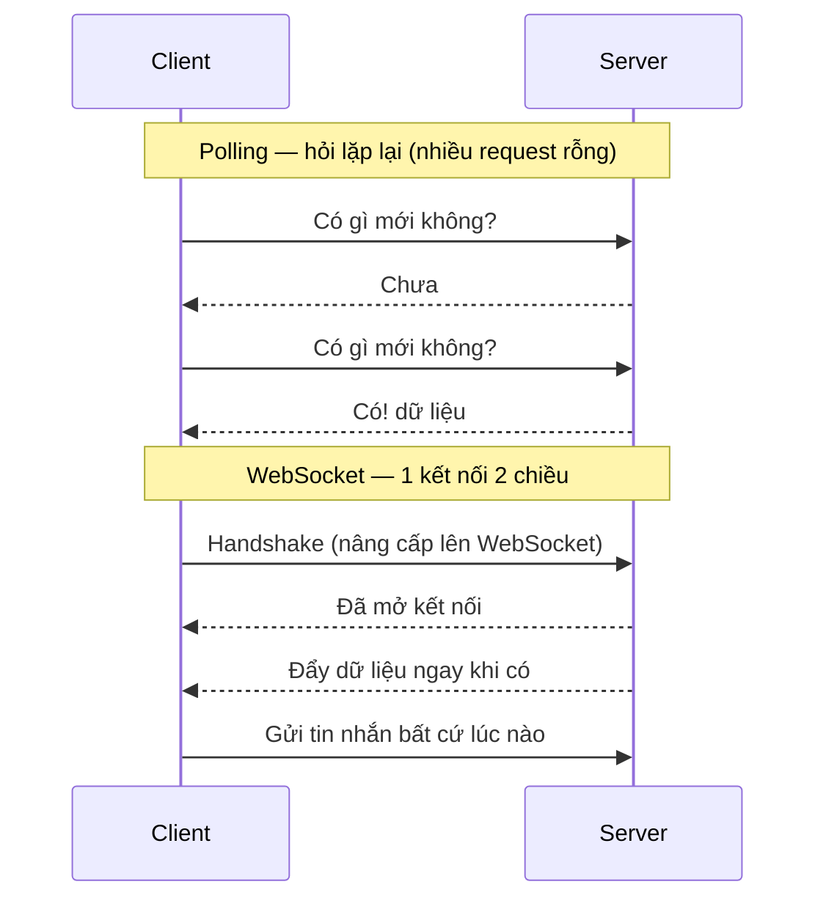

# WebSocket, SSE, Long Polling

Đây là các kỹ thuật giúp server và trình duyệt trao đổi dữ liệu theo thời gian thực, ví dụ như chat, thông báo tức thì hay xem giá cổ phiếu cập nhật liên tục mà không cần tải lại trang. Hiểu chúng quan trọng vì mỗi cách phù hợp với một tình huống khác nhau: một chiều hay hai chiều, đơn giản hay cần độ trễ thấp. Bài này giới thiệu WebSocket, SSE, Long Polling và WebRTC; phần chi tiết nằm bên dưới.

---

:::note[Ghi nhớ nhanh]

- ⭐ **`SSE` (one-way server→client, chạy trên HTTP, auto-reconnect sẵn) vs `WebSocket` (hai chiều, full-duplex TCP)** — mỗi cái hợp một tình huống.
- ⭐ **Nhiều case "chat" thực ra dùng `SSE` + fetch POST** đơn giản hơn setup WebSocket; SSE cũng chuẩn cho AI streaming.
- **`WebSocket` là stateful** — scale cần sticky session + Redis pub/sub để broadcast giữa các server.
- **`Long Polling` đã legacy** (2026); **`WebRTC`** cho video/audio P2P nên dùng managed (LiveKit, Daily...).
- **Managed service** (Pusher, Ably, Supabase Realtime, Liveblocks) giảm ~90% effort so với tự build.

:::

---

## Mục lục

- [Real-time options](#real-time-options)
- [Server-Sent Events (SSE)](#server-sent-events-sse)
- [WebSocket](#websocket)
- [Long Polling](#long-polling)
- [WebRTC](#webrtc)
- [Lựa chọn](#lựa-chọn)

---

## Real-time options

| Option | Direction | Use case |
|--------|-----------|---------|
| **Polling** | Client pull | Simple, low-frequency update |
| **Long Polling** | Client pull, server delay | Legacy compat |
| **SSE** | Server → Client | One-way notification |
| **WebSocket** | Bi-directional | Chat, gaming, collab |
| **WebRTC** | Peer-to-peer | Video call, file transfer |

So sánh cách trao đổi dữ liệu — Polling hỏi lặp lại tốn request, còn WebSocket giữ một kết nối hai chiều mở liên tục:



---

## Server-Sent Events (SSE)

**One-way** server → client, qua HTTP.

```ts
// Server (Node Express)
app.get("/events", (req, res) => {
  res.setHeader("Content-Type", "text/event-stream");
  res.setHeader("Cache-Control", "no-cache");
  res.setHeader("Connection", "keep-alive");

  const interval = setInterval(() => {
    res.write(`data: ${JSON.stringify({ time: Date.now() })}\n\n`);
  }, 1000);

  req.on("close", () => clearInterval(interval));
});
```

```ts
// Client (browser)
const source = new EventSource("/events");

source.onmessage = (event) => {
  const data = JSON.parse(event.data);
  console.log(data);
};

source.onerror = () => {
  console.log("SSE disconnected, auto-reconnect");
};
```

**Ưu**:

- **Simple HTTP** — proxy/firewall friendly.
- **Auto-reconnect** built-in browser.
- **Text-based** — easy debug.
- **HTTP/2 multiplex** — many SSE 1 connection.

**Nhược**:

- **One-way** — không client → server (dùng fetch riêng).
- **Browser limit** — 6 SSE / domain (HTTP/2 OK).
- **No binary**.

**Phù hợp**:

- Stock price updates.
- Notification.
- AI chat streaming (ChatGPT, Claude).
- Activity feed.

---

## WebSocket

**Full-duplex** TCP connection, sau khi handshake HTTP upgrade.

```ts
// Server (Node với ws)
import { WebSocketServer } from "ws";

const wss = new WebSocketServer({ port: 8080 });

wss.on("connection", (ws) => {
  console.log("Client connected");

  ws.on("message", (data) => {
    console.log("Received:", data.toString());

    // Echo back
    ws.send(data);

    // Broadcast to all
    wss.clients.forEach(client => {
      if (client.readyState === WebSocket.OPEN) {
        client.send(data);
      }
    });
  });

  ws.on("close", () => console.log("Client disconnected"));
});
```

```ts
// Client (browser)
const ws = new WebSocket("ws://localhost:8080");

ws.onopen = () => ws.send("Hello");
ws.onmessage = (event) => console.log(event.data);
ws.onclose = () => console.log("Disconnected");
```

**Library** Node:

- **ws** — minimal.
- **Socket.IO** — feature-rich (fallback, room, ack).
- **uWebSockets.js** — high performance.
- **Bun WebSocket** — built-in.

**Socket.IO** popular:

```ts
import { Server } from "socket.io";

const io = new Server(httpServer);

io.on("connection", (socket) => {
  socket.join("room1");

  socket.on("message", (data) => {
    io.to("room1").emit("message", data);
  });
});
```

Features:

- **Room** — group socket.
- **Acknowledgment** — confirm receive.
- **Auto-reconnect**.
- **Fallback** (long-polling cho old browser).
- **Namespace**.

**Phù hợp**:

- Real-time chat.
- Collaborative editor (Figma, Google Docs).
- Multiplayer game.
- Live trading.

:::info[Phân tích]

**WebSocket scaling challenge**:

WebSocket = **stateful connection**. Khác stateless HTTP:

- Server cần giữ connection — không scale = trivial.
- **Sticky session** với load balancer.
- **Pub/Sub backend** để broadcast giữa server (Redis).

Pattern scale:

```
[Client1] → [LB sticky] → [WS Server 1]
[Client2] → [LB sticky] → [WS Server 2]
                              ↕
                          [Redis Pub/Sub]
```

Client1 send msg → WS Server 1 → publish Redis → WS Server 2 receive →
forward to Client2.

Library handle:

- **Socket.IO Redis adapter**.
- **Pusher** — managed service.
- **Ably**, **Liveblocks**, **Soketi**.

Managed service đáng cân nhắc cho startup — đỡ ops phức tạp.

:::

---

## Long Polling

**Client** request, server giữ connection cho đến khi có data hoặc timeout.

```ts
// Client
async function poll() {
  while (true) {
    try {
      const res = await fetch("/long-poll", { timeout: 30000 });
      const data = await res.json();
      processData(data);
    } catch (err) {
      await sleep(1000);
    }
  }
}
```

```ts
// Server — Express
app.get("/long-poll", async (req, res) => {
  const data = await waitForUpdate(30000); // timeout 30s
  res.json(data);
});
```

**Ưu**:

- Compat browser cũ (IE).
- Firewall friendly (HTTP).

**Nhược**:

- **High latency** so WebSocket.
- **HTTP overhead** mỗi poll.
- **Server connection** stack up.

Năm 2026, **legacy**. Dùng SSE hoặc WebSocket thay.

---

## WebRTC

**Peer-to-peer** giữa browser/native, **không qua server** (sau setup).

Use case:

- **Video / audio call** (Google Meet, Zoom).
- **File transfer**.
- **Live streaming** P2P.

**3 component**:

- **MediaStream** — audio/video stream.
- **RTCPeerConnection** — connection between peers.
- **RTCDataChannel** — arbitrary data P2P.

Signaling server (WebSocket) để 2 peer **tìm thấy nhau**:

```
Peer A → Signaling Server → Peer B
         (offer, answer, ICE)
                ↓
Peer A ←─────── direct P2P ────────→ Peer B
                (audio/video/data)
```

Setup phức tạp. Library hỗ trợ:

- **Simple-peer** (Node + browser).
- **PeerJS**.
- **LiveKit** — managed WebRTC SFU.
- **Daily.co**, **Agora**, **Twilio Video**.

Cho video conference, **dùng managed** thay tự build (TURN/STUN, scale).

---

## Lựa chọn

```
Use case?

├─ Chat 1-1, room chat                      → WebSocket
├─ Streaming AI response                     → SSE
├─ Live notification                         → SSE
├─ Collaborative editor (Figma-like)         → WebSocket
├─ Live dashboard, stock price               → SSE / WebSocket
├─ Video / voice call                        → WebRTC (managed)
└─ Update mỗi 30s+                           → Polling đơn giản
```

:::tip[Mẹo]

**SSE vs WebSocket — khi nào chọn?**

| | SSE | WebSocket |
|--|-----|-----------|
| Direction | Server → Client | Bi-directional |
| Protocol | HTTP | TCP (upgraded từ HTTP) |
| Auto-reconnect | **Native** | Cần lib |
| Binary | Không | Có |
| Browser support | Modern | Modern |
| Server complexity | Low | Medium-High |
| Scale | HTTP load balancer | Sticky + pub/sub backend |

**Default SSE** khi:

- Chỉ cần server push (notification, AI streaming, live updates).
- Đỡ infra cost.

**WebSocket** khi:

- Cần bi-directional (chat).
- Low latency critical.
- Binary data (gaming, file).

Nhiều case "chat" thực ra **dùng SSE** + fetch POST cho gửi tin — đơn giản
hơn WebSocket setup.

:::

:::info[Phân tích]

**Real-time platform 2026**:

**Managed**:

- **Pusher** — phổ biến.
- **Ably** — feature-rich.
- **Liveblocks** — collab editor specific.
- **Soketi** — open-source Pusher-compatible.
- **Supabase Realtime** — Postgres trigger + WebSocket.
- **PartyKit** — Cloudflare Workers + WebSocket.

**Self-host**:

- **Socket.IO** + Redis adapter.
- **Centrifugo** — Go-based, mạnh.
- **NATS** — messaging + pub/sub.

Cho startup 2026, **Supabase Realtime** hoặc **Liveblocks** giảm 90% effort
so với roll-your-own.

:::
