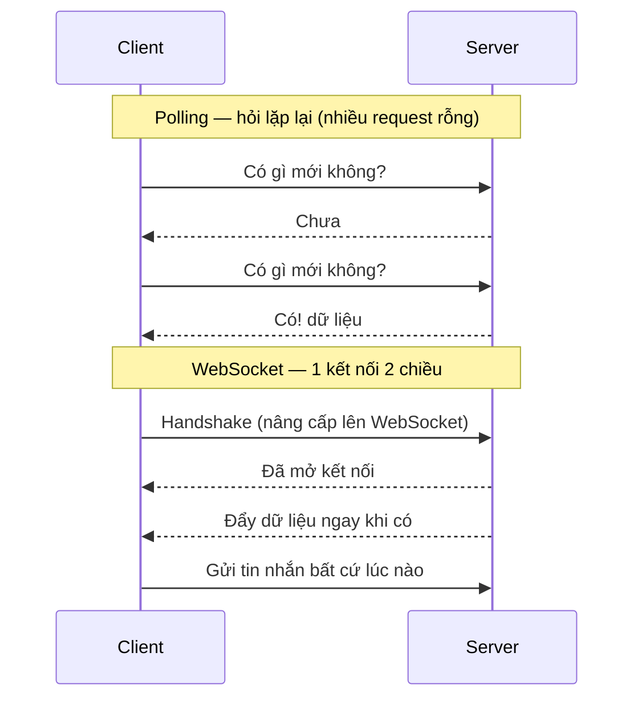

# WebSocket, SSE, Long Polling

Đây là các kỹ thuật giúp server và trình duyệt trao đổi dữ liệu theo thời gian thực, ví dụ như chat, thông báo tức thì hay xem giá cổ phiếu cập nhật liên tục mà không cần tải lại trang. Hiểu chúng quan trọng vì mỗi cách phù hợp với một tình huống khác nhau: một chiều hay hai chiều, đơn giản hay cần độ trễ thấp. Bài này giới thiệu WebSocket, SSE, Long Polling và WebRTC; phần chi tiết nằm bên dưới.

[](pathname:///img/backend/real-time.webp)

---

:::note[Ghi nhớ nhanh]

- ⭐ **`SSE` (one-way server→client, chạy trên HTTP, auto-reconnect sẵn) vs `WebSocket` (hai chiều, full-duplex TCP)** — mỗi cái hợp một tình huống.
- ⭐ **Nhiều case "chat" thực ra dùng `SSE` + fetch POST** đơn giản hơn setup WebSocket; SSE cũng chuẩn cho AI streaming.
- **`WebSocket` là stateful** — scale cần sticky session + Redis pub/sub để broadcast giữa các server.
- **`Long Polling` đã legacy** (2026); **`WebRTC`** cho video/audio P2P nên dùng managed (LiveKit, Daily...).
- **Managed service** (Pusher, Ably, Supabase Realtime, Liveblocks) giảm ~90% effort so với tự build.

:::

---

## Mục lục

- [Real-time options](#real-time-options)
- [Server-Sent Events (SSE)](#server-sent-events-sse)
- [WebSocket](#websocket)
- [Long Polling](#long-polling)
- [WebRTC](#webrtc)
- [Lựa chọn](#lựa-chọn)
- [Câu hỏi phỏng vấn](#câu-hỏi-phỏng-vấn)

---

## Real-time options

| Option | Direction | Use case |
|--------|-----------|---------|
| **Polling** | Client pull | Simple, low-frequency update |
| **Long Polling** | Client pull, server delay | Legacy compat |
| **SSE** | Server → Client | One-way notification |
| **WebSocket** | Bi-directional | Chat, gaming, collab |
| **WebRTC** | Peer-to-peer | Video call, file transfer |

So sánh cách trao đổi dữ liệu — Polling hỏi lặp lại tốn request, còn WebSocket giữ một kết nối hai chiều mở liên tục:



---

## Server-Sent Events (SSE)

**One-way** server → client, qua HTTP.

:::tip[Ví dụ đời thường]

`SSE` giống **cái đài phát thanh**: bạn dò đúng kênh, đài cứ thế nói, bạn cứ thế nghe. Đài **không nghe được bạn** — muốn góp ý thì phải nhắn tin bằng đường khác (một request `fetch`/POST bình thường). Mất sóng thì máy tự dò lại giúp bạn (auto-reconnect có sẵn trong trình duyệt).

Đúng kiểu này là: bảng giá cổ phiếu chạy, thông báo mới nhảy lên, và AI gõ từng chữ ra màn hình.

:::

```ts
// Server (Node Express)
app.get("/events", (req, res) => {
  res.setHeader("Content-Type", "text/event-stream");
  res.setHeader("Cache-Control", "no-cache");
  res.setHeader("Connection", "keep-alive");

  const interval = setInterval(() => {
    res.write(`data: ${JSON.stringify({ time: Date.now() })}\n\n`);
  }, 1000);

  req.on("close", () => clearInterval(interval));
});
```

```ts
// Client (browser)
const source = new EventSource("/events");

source.onmessage = (event) => {
  const data = JSON.parse(event.data);
  console.log(data);
};

source.onerror = () => {
  console.log("SSE disconnected, auto-reconnect");
};
```

**Ưu**:

- **Simple HTTP** — proxy/firewall friendly.
- **Auto-reconnect** built-in browser.
- **Text-based** — easy debug.
- **HTTP/2 multiplex** — many SSE 1 connection.

**Nhược**:

- **One-way** — không client → server (dùng fetch riêng).
- **Browser limit** — 6 SSE / domain (HTTP/2 OK).
- **No binary**.

**Phù hợp**:

- Stock price updates.
- Notification.
- AI chat streaming (ChatGPT, Claude).
- Activity feed.

---

## WebSocket

**Full-duplex** TCP connection, sau khi handshake HTTP upgrade.

:::tip[Ví dụ đời thường]

`WebSocket` giống **cuộc gọi điện thoại**: quay số một lần (handshake), sau đó **đường dây mở suốt**, hai bên nói xen kẽ nhau lúc nào cũng được, không phải bấm số lại cho từng câu.

Cái giá phải trả: tổng đài phải **giữ dây cho từng người**, kể cả lúc không ai nói. Nghìn người online là nghìn sợi dây phải nuôi. Có nhiều tổng đài thì phải đảm bảo bạn luôn quay về đúng tổng đài đang cầm dây của mình (`sticky session`), và các tổng đài phải nối với nhau để chuyển lời qua lại (Redis pub/sub).

:::

```ts
// Server (Node với ws)
import { WebSocketServer } from "ws";

const wss = new WebSocketServer({ port: 8080 });

wss.on("connection", (ws) => {
  console.log("Client connected");

  ws.on("message", (data) => {
    console.log("Received:", data.toString());

    // Echo back
    ws.send(data);

    // Broadcast to all
    wss.clients.forEach(client => {
      if (client.readyState === WebSocket.OPEN) {
        client.send(data);
      }
    });
  });

  ws.on("close", () => console.log("Client disconnected"));
});
```

```ts
// Client (browser)
const ws = new WebSocket("ws://localhost:8080");

ws.onopen = () => ws.send("Hello");
ws.onmessage = (event) => console.log(event.data);
ws.onclose = () => console.log("Disconnected");
```

**Library** Node:

- **ws** — minimal.
- **Socket.IO** — feature-rich (fallback, room, ack).
- **uWebSockets.js** — high performance.
- **Bun WebSocket** — built-in.

**Socket.IO** popular:

```ts
import { Server } from "socket.io";

const io = new Server(httpServer);

io.on("connection", (socket) => {
  socket.join("room1");

  socket.on("message", (data) => {
    io.to("room1").emit("message", data);
  });
});
```

Features:

- **Room** — group socket.
- **Acknowledgment** — confirm receive.
- **Auto-reconnect**.
- **Fallback** (long-polling cho old browser).
- **Namespace**.

**Phù hợp**:

- Real-time chat.
- Collaborative editor (Figma, Google Docs).
- Multiplayer game.
- Live trading.

:::info[Phân tích]

**WebSocket scaling challenge**:

WebSocket = **stateful connection**. Khác stateless HTTP:

- Server cần giữ connection — không scale = trivial.
- **Sticky session** với load balancer.
- **Pub/Sub backend** để broadcast giữa server (Redis).

Pattern scale:

```
[Client1] → [LB sticky] → [WS Server 1]
[Client2] → [LB sticky] → [WS Server 2]
                              ↕
                          [Redis Pub/Sub]
```

Client1 send msg → WS Server 1 → publish Redis → WS Server 2 receive →
forward to Client2.

Library handle:

- **Socket.IO Redis adapter**.
- **Pusher** — managed service.
- **Ably**, **Liveblocks**, **Soketi**.

Managed service đáng cân nhắc cho startup — đỡ ops phức tạp.

:::

---

## Long Polling

**Client** request, server giữ connection cho đến khi có data hoặc timeout.

:::tip[Ví dụ đời thường]

- **Polling** — cứ 5 giây bạn lại **gọi hỏi shipper "tới chưa anh?"**. 9/10 cuộc nhận về "chưa", tốn tiền điện thoại mà tin vẫn trễ tới 5 giây.
- **Long Polling** — bạn gọi một cuộc rồi **giữ máy chờ im lặng**; shipper tới nơi mới lên tiếng, hoặc 30 giây không có gì thì cúp và bạn gọi lại cuộc mới. Ít cuộc gọi rỗng hơn, tin cũng đến nhanh hơn.

Nhưng vẫn là **gọi đi gọi lại**, mỗi cuộc lại chào hỏi từ đầu, và server phải ôm cả đống cuộc đang treo máy. Đã có "đài phát thanh" (`SSE`) và "điện thoại hai chiều" (`WebSocket`) thì không ai làm vậy nữa.

:::

```ts
// Client
async function poll() {
  while (true) {
    try {
      const res = await fetch("/long-poll", { timeout: 30000 });
      const data = await res.json();
      processData(data);
    } catch (err) {
      await sleep(1000);
    }
  }
}
```

```ts
// Server — Express
app.get("/long-poll", async (req, res) => {
  const data = await waitForUpdate(30000); // timeout 30s
  res.json(data);
});
```

**Ưu**:

- Compat browser cũ (IE).
- Firewall friendly (HTTP).

**Nhược**:

- **High latency** so WebSocket.
- **HTTP overhead** mỗi poll.
- **Server connection** stack up.

Năm 2026, **legacy**. Dùng SSE hoặc WebSocket thay.

---

## WebRTC

**Peer-to-peer** giữa browser/native, **không qua server** (sau setup).

:::tip[Ví dụ đời thường]

`WebRTC` giống **hai người nhờ tổng đài nối máy, xong rồi nói thẳng với nhau**. Tổng đài (signaling server) chỉ làm mỗi việc lúc đầu: trao "số nhà" của hai bên cho nhau (offer, answer, ICE). Nối được rồi thì **hình và tiếng đi thẳng từ máy này sang máy kia**, không vòng qua tổng đài nữa — nhờ vậy mới mượt.

Cái giá phải trả: nhà ai cũng có tường rào (NAT/firewall) nên nhiều ca vẫn phải đi vòng qua **một chỗ trung chuyển** (TURN server) rất tốn băng thông. Họp 10 người mà ai cũng gửi hình cho 9 người còn lại thì máy chịu không nổi — nên video conference hãy dùng dịch vụ managed (SFU).

:::

Use case:

- **Video / audio call** (Google Meet, Zoom).
- **File transfer**.
- **Live streaming** P2P.

**3 component**:

- **MediaStream** — audio/video stream.
- **RTCPeerConnection** — connection between peers.
- **RTCDataChannel** — arbitrary data P2P.

Signaling server (WebSocket) để 2 peer **tìm thấy nhau**:

```
Peer A → Signaling Server → Peer B
         (offer, answer, ICE)
                ↓
Peer A ←─────── direct P2P ────────→ Peer B
                (audio/video/data)
```

Setup phức tạp. Library hỗ trợ:

- **Simple-peer** (Node + browser).
- **PeerJS**.
- **LiveKit** — managed WebRTC SFU.
- **Daily.co**, **Agora**, **Twilio Video**.

Cho video conference, **dùng managed** thay tự build (TURN/STUN, scale).

---

## Lựa chọn

```
Use case?

├─ Chat 1-1, room chat                      → WebSocket
├─ Streaming AI response                     → SSE
├─ Live notification                         → SSE
├─ Collaborative editor (Figma-like)         → WebSocket
├─ Live dashboard, stock price               → SSE / WebSocket
├─ Video / voice call                        → WebRTC (managed)
└─ Update mỗi 30s+                           → Polling đơn giản
```

:::tip[Mẹo]

**SSE vs WebSocket — khi nào chọn?**

| | SSE | WebSocket |
|--|-----|-----------|
| Direction | Server → Client | Bi-directional |
| Protocol | HTTP | TCP (upgraded từ HTTP) |
| Auto-reconnect | **Native** | Cần lib |
| Binary | Không | Có |
| Browser support | Modern | Modern |
| Server complexity | Low | Medium-High |
| Scale | HTTP load balancer | Sticky + pub/sub backend |

**Default SSE** khi:

- Chỉ cần server push (notification, AI streaming, live updates).
- Đỡ infra cost.

**WebSocket** khi:

- Cần bi-directional (chat).
- Low latency critical.
- Binary data (gaming, file).

Nhiều case "chat" thực ra **dùng SSE** + fetch POST cho gửi tin — đơn giản
hơn WebSocket setup.

:::

:::info[Phân tích]

**Real-time platform 2026**:

**Managed**:

- **Pusher** — phổ biến.
- **Ably** — feature-rich.
- **Liveblocks** — collab editor specific.
- **Soketi** — open-source Pusher-compatible.
- **Supabase Realtime** — Postgres trigger + WebSocket.
- **PartyKit** — Cloudflare Workers + WebSocket.

**Self-host**:

- **Socket.IO** + Redis adapter.
- **Centrifugo** — Go-based, mạnh.
- **NATS** — messaging + pub/sub.

Cho startup 2026, **Supabase Realtime** hoặc **Liveblocks** giảm 90% effort
so với roll-your-own.

:::

---

## Câu hỏi phỏng vấn

Những câu thường gặp về chủ đề này. Tự trả lời trước, rồi bấm **Xem đáp án** để đối chiếu.

**1. Liệt kê các kỹ thuật cập nhật real-time: `short polling`, `long polling`, `SSE`, `WebSocket`, `WebRTC`, `webhook`. Mỗi cái hợp với tình huống nào?**

<details className="qa">
<summary>Xem đáp án</summary>

| Kỹ thuật | Chiều dữ liệu | Hợp với |
| --- | --- | --- |
| `Short polling` | Client hỏi lặp lại | Dữ liệu đổi chậm, cập nhật mỗi 30s trở lên — đơn giản, đủ dùng |
| `Long polling` | Client hỏi, server giữ máy chờ | Tương thích trình duyệt cũ; năm 2026 coi như legacy |
| `SSE` | Server → Client | Notification, bảng giá chạy, AI streaming từng chữ, activity feed |
| `WebSocket` | Hai chiều, full-duplex | Chat, editor cộng tác, game nhiều người, live trading |
| `WebRTC` | Peer-to-peer | Gọi video/audio, truyền file trực tiếp giữa hai máy |
| `Webhook` | Server → Server | Hệ thống bên ngoài báo sự kiện cho backend của bạn (thanh toán, CI) |

Lưu ý phân biệt: `webhook` không phải kỹ thuật cho trình duyệt — nó là callback HTTP giữa các server. Còn lại đều là cách trình duyệt nhận dữ liệu mới. Mặc định nên bắt đầu từ cái đơn giản nhất đủ dùng: polling → SSE → WebSocket.

</details>

**2. `Short polling` và `long polling` khác nhau ra sao? Vì sao long polling giảm được request rỗng nhưng vẫn không scale tốt ở quy mô lớn?**

<details className="qa">
<summary>Xem đáp án</summary>

- **Short polling** — cứ 5 giây lại gọi hỏi shipper "tới chưa anh?". 9/10 cuộc nhận về "chưa", tốn request mà tin vẫn trễ tới 5 giây.
- **Long polling** — gọi một cuộc rồi **giữ máy chờ im lặng**; server chỉ trả lời khi có dữ liệu, hoặc timeout (thường 30s) thì đóng và client gọi lại.

Long polling giảm hẳn request rỗng và giảm độ trễ vì dữ liệu được đẩy đi ngay khi có. Nhưng vẫn không scale tốt:

- Mỗi lần có dữ liệu là **kết thúc một request và mở request mới** — lại handshake, lại gửi đủ bộ header, cookie. Với luồng dữ liệu dày thì overhead HTTP rất lớn.
- Server phải **ôm hàng loạt request đang treo**; mô hình thread-per-request sẽ cạn thread, còn mô hình async thì vẫn tốn file descriptor và bộ nhớ.
- Có **khoảng trống giữa hai cuộc gọi** — message phát ra đúng lúc đó có thể lỡ, nên cần buffer phía server.
- Proxy và load balancer hay tự cắt kết nối treo lâu.

Đã có SSE và WebSocket thì không còn lý do chọn long polling, trừ khi phải tương thích môi trường rất cũ.

</details>

**3. `SSE` hoạt động thế nào ở tầng HTTP? Mô tả định dạng message với các field `data:`, `event:`, `id:`, `retry:`.**

<details className="qa">
<summary>Xem đáp án</summary>

`SSE` chỉ là **một response HTTP không bao giờ kết thúc**: server trả `Content-Type: text/event-stream`, kèm `Cache-Control: no-cache` và `Connection: keep-alive`, rồi cứ thế `write` thêm dữ liệu vào body. Trình duyệt dùng `EventSource` để đọc dần. Vì vẫn là HTTP thuần nên proxy, firewall, load balancer đều xử lý được bình thường.

Định dạng là text, mỗi message là một khối dòng, **kết thúc bằng một dòng trống**:

```
id: 42
event: price
data: {"symbol":"VNM","price":61500}
retry: 3000

```

- `data:` — nội dung message; lặp nhiều dòng `data:` thì chúng được nối lại bằng ký tự xuống dòng.
- `event:` — tên sự kiện, để client lắng nghe riêng bằng `addEventListener("price", ...)`; bỏ trống thì rơi vào `onmessage`.
- `id:` — số thứ tự message, trình duyệt ghi nhớ để gửi lại khi reconnect.
- `retry:` — nói cho trình duyệt đợi bao nhiêu mili giây trước khi kết nối lại.

Dòng bắt đầu bằng `:` là comment, thường dùng làm heartbeat giữ kết nối không bị proxy cắt.

</details>

**4. `SSE` có auto-reconnect sẵn trong trình duyệt. Client dùng cơ chế nào để nối tiếp đúng chỗ bị đứt, và server cần làm gì để hỗ trợ?**

<details className="qa">
<summary>Xem đáp án</summary>

Cơ chế nằm ở cặp `id:` và header `Last-Event-ID`:

- Mỗi message server gửi kèm một `id:`. Trình duyệt **tự ghi nhớ id cuối cùng nhận được**.
- Khi kết nối đứt, `EventSource` tự mở lại sau khoảng thời gian `retry:` và **tự đính header `Last-Event-ID`** vào request mới.
- Server đọc header đó và **gửi tiếp những message sau id ấy**, thay vì bắt đầu lại từ đầu.

Phía server cần chuẩn bị:

- **Luôn gán id đơn điệu tăng** cho mỗi message.
- **Lưu đệm** một cửa sổ message gần đây (Redis stream, bảng log có index theo id) đủ dài để bù cho khoảng đứt kết nối thông thường.
- Xử lý trường hợp id quá cũ, không còn trong buffer: trả về một **snapshot trạng thái hiện tại** rồi stream tiếp, thay vì im lặng bỏ sót.
- Gửi **heartbeat** định kỳ (dòng comment) để proxy không cắt kết nối, và để client phát hiện đứt sớm.

Lưu ý: auto-reconnect chỉ chạy khi kết nối đứt bất thường. Nếu server đóng bằng HTTP 204 hoặc client gọi `source.close()` thì trình duyệt sẽ không thử lại.

</details>

**5. Vì sao dưới HTTP/1.1 trình duyệt chỉ mở được khoảng 6 kết nối `SSE` cho mỗi domain? HTTP/2 khắc phục hạn chế đó bằng cách nào?**

<details className="qa">
<summary>Xem đáp án</summary>

Vì HTTP/1.1 **một kết nối TCP chỉ phục vụ một request tại một thời điểm**, và trình duyệt tự giới hạn khoảng 6 kết nối đồng thời cho mỗi origin (để không làm nghẽn server). SSE giữ request mở vĩnh viễn, nên mỗi stream chiếm trọn một trong 6 khe đó. Mở 6 tab cùng một trang có SSE là khe cạn sạch — các request thường (ảnh, API) bị treo chờ, và trang trông như bị đơ. Con số này tính theo origin và **dùng chung cho cả các tab khác của cùng domain**.

HTTP/2 giải quyết bằng **multiplexing**: nhiều stream chạy song song **trên cùng một kết nối TCP**, mỗi stream có id riêng, các frame đan xen nhau. Giới hạn không còn là 6 kết nối mà là `SETTINGS_MAX_CONCURRENT_STREAMS` do server công bố — thường khoảng 100 hoặc hơn. Nhờ đó nhiều SSE stream cùng lúc trở nên bình thường.

Lưu ý thực tế: HTTP/2 trong trình duyệt gần như luôn đi kèm HTTPS, nên muốn hưởng lợi thì phải bật TLS và bảo đảm toàn tuyến (kể cả reverse proxy) đều nói HTTP/2.

</details>

**6. Mô tả `WebSocket handshake`: client gửi những header gì (`Upgrade: websocket`, `Sec-WebSocket-Key`) và server đáp lại ra sao (`101 Switching Protocols`)?**

<details className="qa">
<summary>Xem đáp án</summary>

Handshake bắt đầu bằng **một request HTTP GET bình thường** xin nâng cấp giao thức:

```
GET /chat HTTP/1.1
Host: example.com
Upgrade: websocket
Connection: Upgrade
Sec-WebSocket-Key: dGhlIHNhbXBsZSBub25jZQ==
Sec-WebSocket-Version: 13
```

Server chấp nhận thì trả về:

```
HTTP/1.1 101 Switching Protocols
Upgrade: websocket
Connection: Upgrade
Sec-WebSocket-Accept: s3pPLMBiTxaQ9kYGzzhZRbK+xOo=
```

Trong đó `Sec-WebSocket-Key` là một chuỗi ngẫu nhiên do client sinh; server nối nó với một GUID cố định trong chuẩn, băm SHA-1 rồi mã hóa base64 để tạo `Sec-WebSocket-Accept`. Mục đích **không phải bảo mật** mà là chứng minh bên kia thực sự hiểu giao thức WebSocket, tránh trường hợp một proxy hay server cũ vô tình trả lời nhầm.

Sau khi nhận 101, cùng kết nối TCP đó **ngừng nói HTTP** và chuyển sang khung dữ liệu WebSocket, hai chiều, cho tới khi một bên đóng. Các header tùy chọn khác: `Sec-WebSocket-Protocol` (thỏa thuận subprotocol) và `Sec-WebSocket-Extensions` (ví dụ nén `permessage-deflate`).

</details>

**7. Sau handshake, WebSocket không còn là HTTP nữa. Điều đó ảnh hưởng thế nào tới authentication bằng cookie/header, tới proxy, load balancer và caching?**

<details className="qa">
<summary>Xem đáp án</summary>

Toàn bộ header, cookie chỉ tồn tại **đúng một lần ở request handshake**; sau đó dòng dữ liệu là frame nhị phân, không còn khái niệm header cho từng message.

Hệ quả:

- **Authentication** — chỉ xác thực được **một lần lúc bắt tay**. Cookie có gửi kèm (nếu cùng origin), nhưng API `WebSocket` của trình duyệt **không cho set header tùy ý**, nên không gắn được `Authorization: Bearer`. Sau khi kết nối mở, token hết hạn cũng không có gì tự động ngắt — phải tự kiểm tra định kỳ trong tầng ứng dụng. Ngoài ra cookie đi kèm tự động mở ra nguy cơ CSWSH, nên phải kiểm tra header `Origin`.
- **Proxy / firewall** — proxy cũ hoặc cấu hình sai sẽ không hiểu `Upgrade` và cắt kết nối. Nginx phải bật chuyển tiếp header `Upgrade`/`Connection` và nới `proxy_read_timeout`, nếu không kết nối im lặng sẽ bị đóng.
- **Load balancer** — không còn cân bằng theo từng request được nữa; một kết nối gắn chặt với một server suốt vòng đời, nên cần **sticky session** và phải tính tới việc deploy làm rớt hàng loạt kết nối.
- **Caching** — CDN và HTTP cache **hoàn toàn không dùng được**; mọi dữ liệu đi thẳng tới server gốc.

</details>

**8. So sánh `SSE` và `WebSocket` về chiều dữ liệu, độ phức tạp triển khai, hỗ trợ binary và khả năng đi qua proxy/firewall. Bạn mặc định chọn cái nào, và khi nào đổi ý?**

<details className="qa">
<summary>Xem đáp án</summary>

| | `SSE` | `WebSocket` |
| --- | --- | --- |
| Chiều dữ liệu | Server → Client | Hai chiều, full-duplex |
| Giao thức | HTTP thuần | TCP nâng cấp từ HTTP |
| Auto-reconnect | Có sẵn trong trình duyệt | Phải tự viết hoặc dùng lib |
| Binary | Không, chỉ text | Có |
| Proxy/firewall | Rất thân thiện, không cần cấu hình gì thêm | Cần proxy hỗ trợ `Upgrade`, hay bị cắt |
| Độ phức tạp server | Thấp | Trung bình đến cao |
| Scale | Load balancer HTTP thông thường | Sticky session + pub/sub backend |

**Mặc định chọn SSE** khi chỉ cần server đẩy xuống: thông báo, bảng giá, AI streaming, live dashboard. Nó rẻ về hạ tầng, dễ debug (text đọc được), và tự reconnect.

**Đổi sang WebSocket** khi: cần hai chiều với tần suất cao và độ trễ thấp (game, editor cộng tác, trading), cần truyền binary, hoặc cần các tiện ích như room và acknowledgment.

Điểm đáng nhớ: nhiều tính năng "chat" thực ra chỉ cần **SSE để nhận + `fetch` POST để gửi** — đơn giản hơn hẳn việc dựng WebSocket.

</details>

**9. Bạn xác thực và phân quyền một kết nối WebSocket như thế nào? Vì sao nhét token vào query string là rủi ro, và có phương án nào tốt hơn?**

<details className="qa">
<summary>Xem đáp án</summary>

Xác thực nên làm **ngay ở handshake**, trước khi chấp nhận nâng cấp — từ chối sớm rẻ hơn nhiều so với đóng kết nối sau.

Vì sao query string rủi ro: URL bị ghi vào **access log của server, proxy, CDN**, nằm trong lịch sử trình duyệt, và lọt ra ngoài qua header `Referer`. Token là bí mật dài hạn mà lại rải khắp log — chỉ cần một người có quyền đọc log là chiếm được phiên.

Phương án tốt hơn:

- **Ticket dùng một lần** — client gọi một API HTTP đã xác thực để xin ticket ngắn hạn (vài chục giây, dùng một lần), rồi mới mở WebSocket kèm ticket đó. Lộ log cũng vô hại vì ticket hết hiệu lực ngay.
- **Cookie `HttpOnly` + `Secure`** — trình duyệt tự gửi khi cùng origin; bắt buộc phải **kiểm tra header `Origin`** để chặn cross-site WebSocket hijacking.
- **Message xác thực đầu tiên** — mở kết nối ở trạng thái chưa xác thực, client gửi token trong message đầu, server đặt timeout vài giây, không hợp lệ thì đóng.

Phân quyền thì kiểm tra ở hai mức: lúc kết nối (user này là ai) và **mỗi lần vào room hay gửi message** (user này có quyền với tài nguyên đó không). Đừng tin dữ liệu client tự khai. Thêm nữa, token hết hạn giữa chừng cần được phát hiện và buộc kết nối làm mới.

</details>

**10. Làm sao phát hiện một client WebSocket đã "chết" mà không đóng kết nối tử tế? Giải thích `ping/pong heartbeat` và cách chọn khoảng thời gian timeout.**

<details className="qa">
<summary>Xem đáp án</summary>

Mất sóng, rút dây mạng hay tắt máy đột ngột đều **không sinh ra gói FIN**, nên phía server vẫn nghĩ kết nối còn sống và tiếp tục giữ tài nguyên. Cách phát hiện là **heartbeat**.

Giao thức WebSocket có sẵn hai loại frame điều khiển: server gửi **ping**, client (do trình duyệt xử lý tự động, không cần code) trả lời **pong**. Cơ chế thường dùng:

```ts
// mỗi kết nối gắn cờ isAlive
setInterval(() => {
  wss.clients.forEach((ws) => {
    if (ws.isAlive === false) return ws.terminate(); // không pong → cắt
    ws.isAlive = false;
    ws.ping();
  });
}, 30000);
// ws.on("pong", () => { ws.isAlive = true; });
```

Chọn khoảng thời gian: ping mỗi **20–30 giây** là điểm cân bằng phổ biến — đủ ngắn để giữ kết nối sống qua các proxy và NAT (nhiều thiết bị cắt phiên nhàn rỗi sau 60 giây), đủ dài để không tốn băng thông vô ích. Timeout chờ pong nên bằng khoảng **2–3 chu kỳ ping** để tránh cắt oan client đang có mạng chập chờn. Nếu client chạy trên mobile thì ping thưa hơn để đỡ hao pin. Phía client cũng nên tự theo dõi: quá lâu không nhận được gì thì chủ động đóng và reconnect.

</details>

**11. Client mất mạng rồi kết nối lại. Bạn thiết kế `reconnect với exponential backoff + jitter` và cơ chế bù các message bị lỡ ra sao?**

<details className="qa">
<summary>Xem đáp án</summary>

**Backoff + jitter** — đừng thử lại ngay lập tức và đều đặn, vì khi server vừa hồi phục thì toàn bộ client sẽ ập vào cùng lúc (thundering herd) và đánh sập nó lần nữa:

```ts
const delay = Math.min(maxDelay, base * 2 ** attempt);
const wait = delay * (0.5 + Math.random() * 0.5); // jitter: 50–100% của delay
```

Thực hành tốt: `base` khoảng 1 giây, trần `maxDelay` khoảng 30 giây, đếm số lần thử và **reset về 0 khi kết nối ổn định được vài giây** (không reset ngay lúc vừa mở, tránh vòng lặp mở-đứt liên tục). Khi trình duyệt báo `online` trở lại thì thử lại ngay, không chờ hết backoff.

**Bù message bị lỡ** — nguyên tắc giống `Last-Event-ID` của SSE:

- Mỗi message mang **sequence number** hoặc cursor đơn điệu tăng theo từng room/stream.
- Client lưu id cuối cùng đã xử lý; lúc reconnect thì gửi kèm id đó.
- Server đọc từ **buffer gần đây** (Redis stream, bảng message có index) và phát lại phần còn thiếu.
- Nếu khoảng trống quá lớn hoặc id đã bị dọn, trả về **snapshot trạng thái hiện tại** rồi stream tiếp — đúng đắn hơn là im lặng bỏ sót.

Client phải **idempotent** vì phần bù có thể trùng với message đã nhận: khử trùng theo id trước khi hiển thị.

</details>

**12. WebSocket là stateful — vì sao scale ngang khó hơn HTTP stateless? Vai trò của `sticky session` là gì và nó gây ra hạn chế nào?**

<details className="qa">
<summary>Xem đáp án</summary>

Với HTTP stateless, mỗi request độc lập nên load balancer ném vào server nào cũng được; thêm server là tăng năng lực ngay. WebSocket thì **kết nối sống lâu và gắn với đúng một tiến trình**: server đó giữ socket, giữ danh sách room, giữ trạng thái phiên trong bộ nhớ. Từ đó sinh ra ba khó khăn: một server chỉ gánh được số kết nối hữu hạn (bộ nhớ, file descriptor), server này không tự biết ai đang nối vào server kia, và khi deploy thì mọi kết nối trên server cũ đều rớt cùng lúc.

**Sticky session** bảo đảm một client luôn quay về **đúng server đang giữ kết nối của mình** (theo IP hoặc cookie do load balancer gắn). Nó cần thiết ngay từ lúc handshake — nhất là với Socket.IO, khi giai đoạn bắt tay có thể gồm nhiều request.

Hạn chế nó mang lại:

- **Tải lệch** — server chạy lâu tích tụ nhiều kết nối, server mới thêm vào vẫn rỗng vì kết nối cũ không di chuyển.
- **Không rút server êm được** — muốn gỡ một node là phải chấp nhận cắt kết nối, cần drain và client tự reconnect.
- **Vẫn chưa giải quyết broadcast** — user ở hai server khác nhau vẫn không nói chuyện được; phải có pub/sub backend.

</details>

**13. Có 3 server, user A nối vào server 1 còn user B nối vào server 2. Làm sao broadcast một tin nhắn tới cả hai? Mô tả kiến trúc dùng `Redis pub/sub` adapter hoặc message bus.**

<details className="qa">
<summary>Xem đáp án</summary>

Vấn đề: `wss.clients` của server 1 **chỉ chứa client đang nối vào chính nó**. Giải pháp là đặt một lớp pub/sub ở giữa để các server nói chuyện với nhau:

```
[Client A] → [LB sticky] → [WS Server 1]
[Client B] → [LB sticky] → [WS Server 2]
                                ↕
                          [Redis Pub/Sub]
```

Luồng đi: A gửi message → server 1 nhận → **publish lên Redis** theo channel tương ứng room → cả ba server đều subscribe nên đều nhận được → mỗi server **chỉ forward tới những client của riêng nó** đang ở trong room đó. Server 2 vì vậy đẩy được tới B.

Trong thực tế hiếm khi tự viết: Socket.IO có sẵn **Redis adapter** làm đúng việc này, kèm hỗ trợ room xuyên server. Ngoài Redis pub/sub còn có NATS, Kafka hoặc Redis Streams.

Điểm khác biệt đáng cân nhắc: **Redis pub/sub là fire-and-forget** — server đang down lúc message phát ra sẽ mất luôn, không có replay. Nếu nghiệp vụ không cho phép mất tin (chat lưu lịch sử), hãy **ghi message vào DB trước** rồi mới publish, và cho client đồng bộ lại theo sequence number lúc reconnect.

</details>

**14. Thiết kế backend cho một hệ thống chat 100k người online đồng thời: bạn tổ chức `room`, trạng thái `presence` (ai đang online) và lưu lịch sử tin nhắn thế nào?**

<details className="qa">
<summary>Xem đáp án</summary>

**Tầng kết nối** — nhiều node WebSocket sau load balancer có sticky session, mỗi node gánh khoảng vài chục nghìn kết nối. Dùng Redis pub/sub (hoặc NATS) làm xương sống để broadcast giữa các node.

**Room** — không giữ danh sách thành viên trong bộ nhớ một node. Mỗi node chỉ nhớ *client của mình thuộc room nào*; còn membership chính thức nằm ở DB, và mỗi room ứng với một channel pub/sub. Room đông (kiểu kênh phát sóng hàng chục nghìn người) nên tách riêng và **gộp message theo lô** trước khi đẩy, tránh đẩy từng cái.

**Presence** — lưu trong Redis với `SETEX` khóa `presence:userId` có TTL ngắn (vài chục giây), client gia hạn bằng heartbeat; hết hạn tự hiểu là offline. Cách này chịu được việc node chết đột ngột. Trạng thái online của cả room lấy bằng một lệnh đọc nhiều khóa. Với danh sách bạn bè lớn, phát sự kiện online/offline **có debounce** để tránh bão thông báo khi mạng chập chờn.

**Lịch sử tin nhắn** — ghi vào DB **trước khi** broadcast, mỗi message có `sequence` tăng dần theo room và server-side timestamp. Phân trang theo cursor (không dùng `OFFSET`), đánh index theo `(room_id, sequence)`, và phân vùng theo thời gian để dữ liệu cũ không làm chậm truy vấn nóng. Reconnect thì client xin phần thiếu theo sequence cuối cùng đã có.

</details>

**15. Làm sao đảm bảo thứ tự và không mất tin nhắn trong hệ thống real-time? Nói về `acknowledgment`, sequence number và xử lý message trùng.**

<details className="qa">
<summary>Xem đáp án</summary>

Ba lớp bổ trợ nhau:

- **Acknowledgment** — client gửi message kèm một `clientMessageId`; server lưu xong mới trả ack kèm id và sequence chính thức. Chưa nhận ack thì client giữ message ở trạng thái "đang gửi" và **gửi lại** sau timeout. Socket.IO có sẵn cơ chế ack này.
- **Sequence number** — server (không phải client) gán số thứ tự **đơn điệu tăng theo từng room**. Client theo dõi số cuối cùng đã nhận; thấy nhảy cóc là biết bị lỡ và chủ động xin lại khoảng thiếu. Không dựa vào timestamp của client vì đồng hồ máy người dùng không đáng tin.
- **Khử trùng** — vì gửi lại nên message sẽ trùng. Server đặt **unique constraint trên `clientMessageId`** để insert lần hai không tạo bản ghi mới mà trả về bản cũ; client cũng lọc theo id trước khi render.

Về thứ tự: chỉ nên đảm bảo **trong phạm vi một room**, không cố làm toàn cục vì chi phí quá lớn. Muốn không mất tin thì nguyên tắc là **ghi bền vững trước, broadcast sau** — Redis pub/sub không lưu lại nên không thể là nguồn sự thật. Tổng thể, đây là mô hình at-least-once cộng với khử trùng để đạt hiệu ứng exactly-once.

</details>

**16. `Backpressure` trong real-time là gì? Khi server đẩy nhanh hơn client tiêu thụ thì điều gì xảy ra và bạn xử lý ra sao?**

<details className="qa">
<summary>Xem đáp án</summary>

**Backpressure** là tình huống bên sản xuất dữ liệu nhanh hơn bên tiêu thụ. Với WebSocket, khi client mạng yếu hoặc tab bị treo, dữ liệu server gửi không đi hết được và **dồn lại trong buffer gửi của socket**. Buffer phình ra ăn RAM; vài trăm client như vậy đủ làm node hết bộ nhớ hoặc bị OOM kill — tức là một client chậm kéo sập dịch vụ của mọi người.

Cách xử lý:

- **Theo dõi độ dài buffer** trước khi gửi (`ws.bufferedAmount`), vượt ngưỡng thì ngừng đẩy cho client đó.
- **Drop có chọn lọc** — với dữ liệu kiểu trạng thái (giá cổ phiếu, vị trí con trỏ), chỉ cần **giá trị mới nhất**: bỏ các bản cũ chưa gửi thay vì xếp hàng hết. Với dữ liệu kiểu sự kiện không được mất thì phải buffer có giới hạn và cho phép client xin lại sau.
- **Gộp và giảm tần suất** — gộp nhiều cập nhật trong 50–100ms thành một message, hoặc throttle theo khả năng của từng client.
- **Nén** (`permessage-deflate`) khi payload text lớn, đổi CPU lấy băng thông.
- **Ngắt client quá tải** — vượt ngưỡng lâu thì đóng kết nối, để client tự reconnect và đồng bộ lại từ snapshot. Thà cắt một client còn hơn để nó làm hỏng cả node.

</details>

**17. `WebRTC` khác WebSocket ở điểm nào? Vì sao vẫn cần server cho `signaling`, `STUN` và `TURN` dù WebRTC là peer-to-peer?**

<details className="qa">
<summary>Xem đáp án</summary>

Khác biệt cốt lõi: WebSocket là **client ↔ server**, mọi byte đều đi qua server; WebRTC là **peer ↔ peer**, dữ liệu đi thẳng giữa hai máy sau khi đã kết nối. WebRTC chạy trên UDP là chính, ưu tiên độ trễ thấp và chấp nhận mất gói — rất hợp audio/video; WebSocket chạy trên TCP, đảm bảo thứ tự và không mất dữ liệu.

Nhưng "peer-to-peer" không có nghĩa là không cần server:

- **Signaling server** — hai peer không có cách nào tự tìm thấy nhau. Phải có một kênh trung gian (thường chính là WebSocket) để trao đổi `offer`, `answer` và các ICE candidate. Giống tổng đài chỉ làm mỗi việc lúc đầu: trao "số nhà" của hai bên cho nhau.
- **STUN** — hầu hết máy nằm sau NAT và không biết IP công khai của chính mình. STUN server trả lời câu hỏi "nhìn từ ngoài, tôi là địa chỉ nào?" — rất nhẹ, gần như miễn phí.
- **TURN** — khi NAT hoặc firewall chặt tới mức không thể nối trực tiếp, dữ liệu phải **đi vòng qua một chỗ trung chuyển**. TURN rất tốn băng thông vì toàn bộ luồng media chạy qua nó, nhưng không có thì một phần đáng kể người dùng sẽ không gọi được.

Sau khi kết nối, WebRTC còn có `RTCDataChannel` để truyền dữ liệu tùy ý P2P, không chỉ audio/video.

</details>

**18. Khi nào WebRTC dạng P2P mesh không còn đủ và phải chuyển sang `SFU`/`MCU`? Cho ví dụ theo số lượng người tham gia cuộc gọi.**

<details className="qa">
<summary>Xem đáp án</summary>

Trong **mesh**, mỗi người kết nối trực tiếp với tất cả những người còn lại, nên mỗi máy phải **gửi đi N−1 luồng video** và nhận về N−1 luồng. Chi phí tăng theo bình phương số người:

- 2–3 người: mesh rất tốt, độ trễ thấp nhất, không tốn server.
- 4–5 người: bắt đầu nặng, đặc biệt với máy yếu và mạng upload hạn chế của người dùng gia đình.
- Từ khoảng 6 người trở lên: gần như không dùng nổi — máy nóng, quạt gào, hình giật.

**SFU (Selective Forwarding Unit)** — mỗi peer chỉ **gửi lên một luồng duy nhất**, server chuyển tiếp cho những người khác mà không giải mã lại. Upload phía client giảm mạnh, server tốn băng thông nhưng nhẹ về CPU. Đây là kiến trúc tiêu chuẩn cho hội họp vài chục tới hàng trăm người, và cho phép mỗi người nhận chất lượng phù hợp với đường truyền của mình (simulcast).

**MCU (Multipoint Control Unit)** — server giải mã, trộn tất cả thành **một luồng duy nhất** rồi gửi xuống. Client nhẹ nhất (hợp thiết bị yếu, hoặc khi cần ghi hình/phát ra RTMP), nhưng server tốn CPU khủng khiếp và độ trễ cao hơn vì phải transcode.

Lời khuyên thực tế: trừ khi chỉ làm gọi 1-1, hãy dùng **dịch vụ managed** (LiveKit, Daily, Agora, Twilio Video) thay vì tự dựng SFU và hạ tầng TURN.

</details>

**19. So sánh việc tự dựng WebSocket với dùng managed service (Pusher, Ably, Supabase Realtime, Liveblocks). Đánh đổi về chi phí, vendor lock-in và khả năng kiểm soát là gì?**

<details className="qa">
<summary>Xem đáp án</summary>

| Tiêu chí | Tự dựng | Managed |
| --- | --- | --- |
| Thời gian lên sản phẩm | Hàng tuần: scale, sticky, pub/sub, reconnect, presence | Vài ngày, SDK có sẵn |
| Chi phí | Rẻ ở quy mô lớn, nhưng tốn người vận hành | Trả theo kết nối/message, đắt dần khi tăng trưởng |
| Vận hành | Bạn chịu on-call, deploy làm rớt kết nối, giám sát | Nhà cung cấp lo, có SLA |
| Kiểm soát | Toàn quyền về giao thức, hạ tầng, dữ liệu | Giới hạn trong tính năng họ hỗ trợ |
| Lock-in | Không | Có — SDK và mô hình channel riêng của từng bên |
| Dữ liệu | Nằm trong hạ tầng của bạn | Đi qua bên thứ ba, cần cân nhắc tuân thủ |

Kinh nghiệm chung: với startup, managed service **giảm khoảng 90% công sức** so với tự làm — Supabase Realtime, Liveblocks, Pusher, Ably đều đáng cân nhắc. Tự dựng chỉ đáng khi lưu lượng đã đủ lớn để chi phí dịch vụ vượt chi phí đội ngũ, khi có yêu cầu đặc thù về giao thức, hoặc khi dữ liệu không được rời hạ tầng của mình.

Giảm lock-in bằng cách **bọc SDK sau một interface nội bộ** và tránh để mô hình channel của nhà cung cấp rò rỉ vào domain. Cũng có lựa chọn trung gian: self-host bản open-source tương thích (Soketi, Centrifugo) — đổi được nhà cung cấp mà vẫn giữ SDK.

</details>

**20. Thiết kế tính năng "soạn thảo cộng tác thời gian thực" (kiểu Google Docs). Bạn chọn giao thức nào, và xử lý xung đột chỉnh sửa bằng `OT` hay `CRDT`? Vì sao?**

<details className="qa">
<summary>Xem đáp án</summary>

**Giao thức: WebSocket.** Soạn thảo cộng tác cần hai chiều, tần suất rất cao (mỗi phím gõ), độ trễ thấp và truyền được binary — SSE cộng POST không đáp ứng nổi. Kèm theo đó là presence (con trỏ và vùng chọn của từng người) qua cùng kết nối, thường tách sang channel riêng vì loại dữ liệu này **được phép mất** (chỉ cần giá trị mới nhất).

**Xử lý xung đột:**

| | `OT` (Operational Transformation) | `CRDT` |
| --- | --- | --- |
| Cách hoạt động | Biến đổi operation theo những thao tác đồng thời đã xảy ra | Cấu trúc dữ liệu tự hội tụ, phép merge giao hoán |
| Cần server trung tâm | Có — để sắp thứ tự chuẩn | Không bắt buộc, hợp P2P và offline |
| Kích thước dữ liệu | Gọn | Tốn hơn vì mang metadata/tombstone |
| Độ khó cài đặt | Thuật toán transform rất dễ sai | Khó về lý thuyết nhưng đã có thư viện tốt |

**Chọn CRDT** cho một dự án mới, dùng thư viện đã trưởng thành (Yjs, Automerge): hỗ trợ offline tốt, không cần tự viết hàm transform — phần dễ sai nhất của OT. Google Docs dùng OT vì ra đời trước khi CRDT thực dụng, đó là lý do lịch sử chứ không phải lựa chọn tốt hơn hôm nay.

Phần còn lại: server đóng vai trò relay và lưu trữ, **chốt snapshot định kỳ** để tài liệu mới mở không phải replay toàn bộ lịch sử; và nếu không muốn tự dựng thì Liveblocks hoặc PartyKit đã gói sẵn cả WebSocket lẫn CRDT.

</details>
