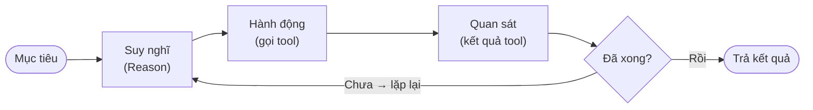

# AI Agent là gì?

Bài này giải thích khái niệm **AI agent** (tác nhân AI) — điều làm nên sự khác
biệt giữa một chatbot trả lời câu hỏi và một trợ lý có thể **tự hành động** để
hoàn thành mục tiêu. Bạn sẽ hiểu agent là gì, nó khác chatbot ra sao, **vòng lặp
agent** vận hành thế nào, và vì sao Claude (đặc biệt là Claude Code) được xem là
một agent. Hiểu rõ điều này giúp bạn biết khi nào nên giao việc cho Claude tự làm
thay vì hỏi từng bước.

---

## Mục lục

- [Từ chatbot đến agent](#từ-chatbot-đến-agent)
- [AI agent là gì?](#ai-agent-là-gì-1)
- [Vòng lặp agent (agent loop)](#vòng-lặp-agent-agent-loop)
- [Công cụ (tool) — tay chân của agent](#công-cụ-tool--tay-chân-của-agent)
- [Tính tự chủ: agent tự quyết tới đâu?](#tính-tự-chủ-agent-tự-quyết-tới-đâu)
- [Ví dụ thực tế](#ví-dụ-thực-tế)
- [Tóm tắt](#tóm-tắt)

---

## Từ chatbot đến agent

Khi mới dùng Claude trên web, bạn trải nghiệm nó như một **chatbot**: bạn hỏi, nó
trả lời bằng văn bản. Mỗi lượt là một câu hỏi và một câu trả lời. Claude không
"làm" gì cả — nó chỉ sinh ra chữ.

Một **agent** thì khác: thay vì chỉ trả lời, nó có thể **tự thực hiện một chuỗi
hành động** để đạt mục tiêu bạn giao. Ví dụ thay vì chỉ *mô tả* cách sửa lỗi, một
agent có thể tự mở file, sửa code, chạy thử, đọc lỗi, rồi sửa tiếp — cho tới khi
xong.

> **Chatbot**: hỏi–đáp một lượt, chỉ sinh văn bản.
> **Agent**: nhận mục tiêu, tự lặp đi lặp lại "suy nghĩ → hành động → quan sát"
> cho tới khi hoàn thành.

## AI agent là gì?

**AI agent** (tác nhân AI) là một hệ thống dùng mô hình ngôn ngữ (LLM) làm "bộ
não" để **tự lập kế hoạch và thực hiện hành động** nhằm đạt một mục tiêu, thay vì
chỉ trả lời một câu hỏi đơn lẻ.

Một agent điển hình có ba thành phần:

| Thành phần | Vai trò | Ví dụ ở Claude Code |
| --- | --- | --- |
| **Bộ não (LLM)** | Suy nghĩ, lập kế hoạch, quyết định bước tiếp theo | Mô hình Claude |
| **Công cụ (tools)** | Cách agent tác động lên thế giới bên ngoài | Đọc/ghi file, chạy lệnh terminal, tìm kiếm |
| **Vòng lặp (loop)** | Cơ chế lặp lại cho tới khi đạt mục tiêu | Sửa code → chạy test → đọc lỗi → sửa tiếp |

Điểm cốt lõi: agent **không dừng ở một câu trả lời**. Nó tiếp tục hành động, quan
sát kết quả, và điều chỉnh — giống cách một người thật xử lý công việc.

## Vòng lặp agent (agent loop)

Trái tim của mọi agent là **vòng lặp agent** — chu trình lặp đi lặp lại gồm ba
bước:

1. **Suy nghĩ (Reason)** — agent nhìn vào mục tiêu và tình hình hiện tại, quyết
   định việc cần làm tiếp theo.
2. **Hành động (Act)** — agent gọi một **công cụ** để thực hiện việc đó (vd chạy
   một lệnh, đọc một file).
3. **Quan sát (Observe)** — agent nhận kết quả từ công cụ (vd nội dung file, thông
   báo lỗi) và đưa vào ngữ cảnh để suy nghĩ cho bước sau.

Vòng lặp này lặp lại cho tới khi mục tiêu hoàn thành (hoặc agent kết luận không
làm được).

```text
        ┌─────────────────────────────────────────┐
        │                                         │
        ▼                                         │
   [Suy nghĩ] ───► [Hành động: gọi tool] ───► [Quan sát kết quả]
        ▲                                         │
        │                                         │
        └──────────── chưa xong? lặp lại ─────────┘
                            │
                         xong ► trả kết quả
```



Ví dụ cụ thể với yêu cầu *"Sửa lỗi khiến test thất bại"*:

1. **Suy nghĩ**: cần xem test nào đang fail → **Hành động**: chạy lệnh test →
   **Quan sát**: đọc thông báo lỗi.
2. **Suy nghĩ**: lỗi ở file `user.ts` dòng 42 → **Hành động**: đọc file →
   **Quan sát**: thấy code sai.
3. **Suy nghĩ**: cần sửa dòng 42 → **Hành động**: chỉnh file → **Quan sát**: chạy
   lại test → pass → **xong**.

## Công cụ (tool) — tay chân của agent

Nếu LLM là bộ não thì **công cụ (tool)** là tay chân — thứ cho phép agent *làm*
chứ không chỉ *nói*. Một công cụ là một chức năng cụ thể agent có thể gọi.

Cơ chế gọi công cụ gọi là **tool use** (hay *function calling* — gọi hàm): mô
hình không tự chạy lệnh, mà nó *yêu cầu* hệ thống chạy một công cụ với tham số cụ
thể, rồi nhận kết quả về.

Ví dụ các công cụ Claude Code dùng:

- **Đọc / ghi file** — xem và chỉnh sửa mã nguồn.
- **Chạy lệnh terminal** — chạy test, build, cài thư viện, dùng `git`.
- **Tìm kiếm trong dự án** — định vị đoạn code liên quan.
- **Tìm kiếm web** — tra cứu thông tin mới (khi được bật).

> Một mô hình **không có công cụ** chỉ là chatbot: nó mô tả cách làm. Một mô hình
> **có công cụ + vòng lặp** trở thành agent: nó tự làm.

## Tính tự chủ: agent tự quyết tới đâu?

**Tự chủ (autonomy)** là mức độ agent được phép tự quyết và hành động mà không cần
hỏi bạn. Đây là một thang đo, không phải hai thái cực:

| Mức tự chủ | Mô tả | Ví dụ |
| --- | --- | --- |
| **Thấp** | Hỏi xác nhận trước mỗi hành động | Hỏi trước khi sửa từng file |
| **Vừa** | Tự làm các bước nhỏ, hỏi khi việc quan trọng/khó đảo ngược | Tự sửa code nhưng hỏi trước khi `git push` |
| **Cao** | Tự chạy cả chuỗi dài tới khi xong | Tự sửa lỗi rồi chạy test lặp lại đến khi pass |

Tự chủ cao chạy nhanh hơn nhưng rủi ro hơn — vì thế các hành động **khó đảo
ngược** (xoá file, đẩy code lên server, gửi dữ liệu ra ngoài) nên luôn được xác
nhận. Claude Code dùng cơ chế **permission** (xin phép) để cân bằng: nó tự làm
việc an toàn, nhưng xin phép trước khi làm việc nhạy cảm.

:::tip Agent giỏi không phải agent "tự tung tự tác"
Một agent tốt biết **khi nào nên hỏi**. Việc nhỏ, an toàn thì tự làm; việc lớn,
khó sửa thì dừng lại xác nhận với bạn. Bạn kiểm soát mức tự chủ này.
:::

## Ví dụ thực tế

So sánh cùng một yêu cầu ở hai chế độ:

**Chế độ chatbot** (claude.ai, hỏi–đáp):

> Bạn: "Làm sao thêm chức năng đăng nhập vào app?"
> Claude: *mô tả các bước, đưa đoạn code mẫu để bạn tự dán vào.*

**Chế độ agent** (Claude Code):

> Bạn: "Thêm chức năng đăng nhập vào app."
> Claude: tự đọc cấu trúc dự án → tạo file mới → viết code → cài thư viện cần
> thiết → chạy test → sửa lỗi phát sinh → báo cáo kết quả. *Bạn chỉ cần xem lại.*

Cùng một mô hình Claude, nhưng khi được trao **công cụ + vòng lặp + quyền hành
động**, nó chuyển từ "người tư vấn" thành "người làm việc".

## Tóm tắt

- **AI agent** = LLM (bộ não) + **công cụ** (tay chân) + **vòng lặp** (cơ chế lặp
  lại) để **tự hành động** đạt mục tiêu, không chỉ trả lời một câu.
- **Chatbot** chỉ sinh văn bản; **agent** suy nghĩ → hành động → quan sát, lặp
  lại cho tới khi xong.
- **Tool use** (gọi công cụ) là cách agent tác động ra ngoài: đọc/ghi file, chạy
  lệnh, tìm kiếm...
- **Tính tự chủ** là thang đo agent tự quyết tới đâu; hành động khó đảo ngược nên
  luôn được xác nhận (cơ chế **permission**).
- **Claude Code** chính là Claude vận hành ở chế độ agent — đây là lý do nó có thể
  tự lập trình giúp bạn, không chỉ gợi ý code.

Bài tiếp theo sẽ giới thiệu **Skill** — cách "dạy" cho agent những kỹ năng chuyên
biệt, đóng gói lại để dùng nhiều lần.
