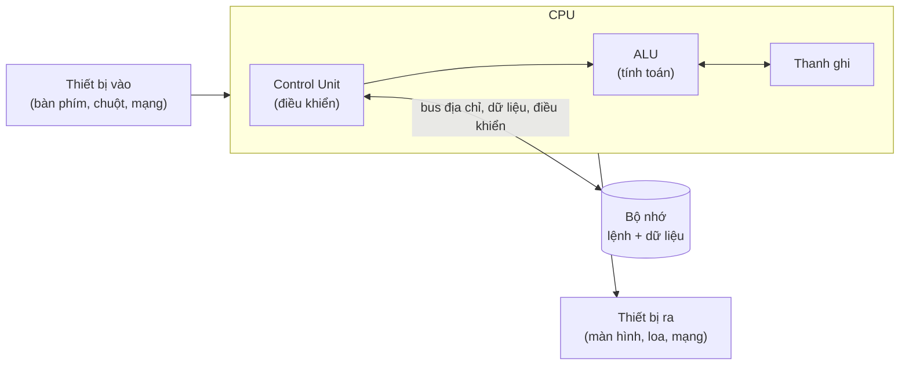
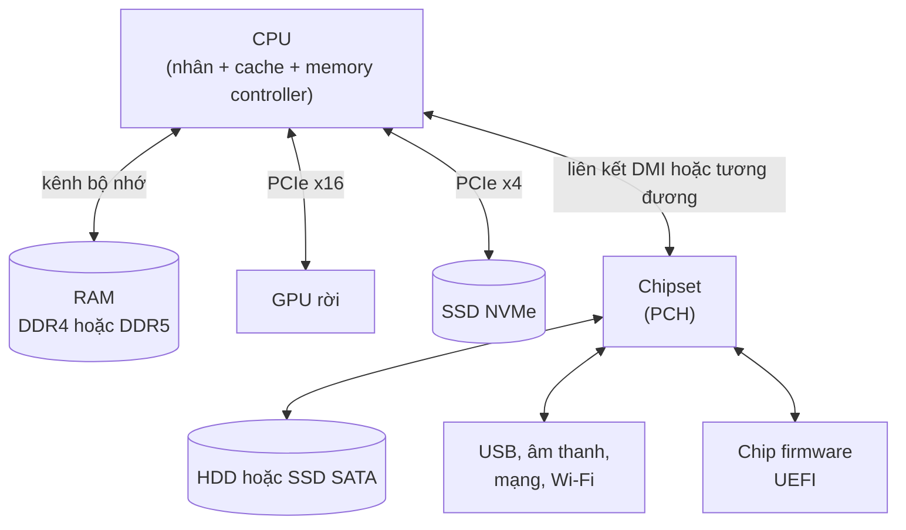
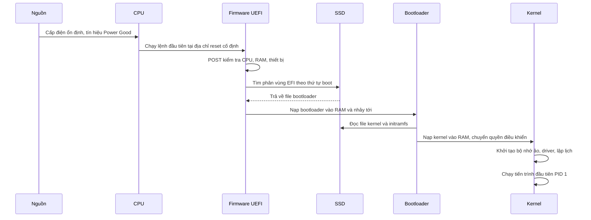

# Cấu tạo máy tính

**Máy tính** (computer) là một cỗ máy nhận **dữ liệu vào** (input), **xử lý** nó theo một danh sách lệnh gọi là **chương trình** (program), rồi đưa ra **kết quả** (output) và có thể **lưu trữ** lại. Dù là laptop, điện thoại, server trong data center hay con chip trong máy giặt, gần như tất cả đều xây trên cùng một ý tưởng từ năm 1945: **CPU** lấy lệnh và dữ liệu từ **bộ nhớ**, tính toán, rồi ghi kết quả trở lại — lặp đi lặp lại hàng tỉ lần mỗi giây.

**Tương tự đơn giản:** Máy tính giống một **văn phòng kế toán**. **CPU** là nhân viên kế toán làm phép tính cực nhanh nhưng chỉ làm đúng những gì được giao. **RAM** là mặt bàn làm việc — để hồ sơ đang xử lý, rộng thì làm được nhiều việc cùng lúc, nhưng tan ca (tắt máy) là dọn sạch. **SSD/HDD** là tủ hồ sơ lưu trữ lâu dài. **Mainboard** là toà nhà với hành lang (bus) nối các phòng. **Nguồn điện** là điện lưới, còn **thiết bị I/O** là quầy lễ tân nhận yêu cầu và trả kết quả cho khách.

---

:::note[Ghi nhớ nhanh]

- ⭐ **Kiến trúc von Neumann:** CPU + bộ nhớ chứa **cả lệnh lẫn dữ liệu** + thiết bị vào/ra, nối với nhau bằng **bus**. Gần như mọi máy tính hiện đại đều theo mô hình này (có biến thể).
- ⭐ **CPU chỉ làm việc trực tiếp với RAM (và cache), không chạy thẳng từ SSD** — muốn chạy chương trình, hệ điều hành phải nạp nó từ SSD vào RAM trước.
- **RAM nhanh nhưng mất dữ liệu khi tắt điện** (volatile); **SSD/HDD chậm hơn nhưng giữ dữ liệu lâu dài** (non-volatile).
- **Mainboard + bus** là "đường giao thông" nối CPU, RAM, GPU, SSD; băng thông bus giới hạn tốc độ trao đổi dữ liệu.
- **Bật máy:** firmware (BIOS/UEFI) kiểm tra phần cứng → nạp **bootloader** → bootloader nạp **kernel** hệ điều hành → kernel khởi động các dịch vụ và giao diện.

:::

---

## Mục lục

- [Vì sao cần hiểu cấu tạo máy tính?](#vì-sao-cần-hiểu-cấu-tạo-máy-tính)
- [1. Kiến trúc von Neumann](#1-kiến-trúc-von-neumann)
- [2. Các bộ phận chính của máy tính](#2-các-bộ-phận-chính-của-máy-tính)
- [3. RAM và ổ lưu trữ khác nhau thế nào](#3-ram-và-ổ-lưu-trữ-khác-nhau-thế-nào)
- [4. Mainboard và bus](#4-mainboard-và-bus)
- [5. Chuyện gì xảy ra khi bật máy](#5-chuyện-gì-xảy-ra-khi-bật-máy)
- [6. Mở một ứng dụng thì dữ liệu đi đâu](#6-mở-một-ứng-dụng-thì-dữ-liệu-đi-đâu)
- [Khi nào cần nhớ?](#khi-nào-cần-nhớ)
- [Lỗi thường gặp](#lỗi-thường-gặp)
- [Câu hỏi phỏng vấn](#câu-hỏi-phỏng-vấn)

---

## Vì sao cần hiểu cấu tạo máy tính?

**Vấn đề:** Là dev web, ta thường chỉ thấy máy tính qua lớp trừu tượng: `npm run dev`, một tab Chrome, một container Docker, một instance EC2 "2 vCPU, 4 GB RAM". Khi có chuyện — build chậm, server chết vì hết RAM, app khởi động mất 30 giây, laptop quạt kêu ầm ầm — ta không biết nên nghi ngờ bộ phận nào: CPU, RAM, ổ đĩa hay mạng? Mua máy mới hay thuê server cũng chọn theo cảm tính.

**Giải pháp:** Nắm được **mỗi bộ phận làm gì, nhanh chậm ra sao và nối với nhau thế nào** cho bạn một "bản đồ" để chẩn đoán. Build chậm vì CPU 100% hay vì ổ đĩa đọc ghi liên tục? Server chậm vì CPU hay vì RAM đầy phải dùng swap? Bản đồ này cũng là nền cho các bài sau: thanh ghi, cache, tiến trình, bộ nhớ ảo.

:::tip[Dùng thực tế]

- **Chọn cấu hình server/cloud:** API Node.js nặng tính toán cần nhiều CPU; service cache hay Elasticsearch cần nhiều RAM; database cần SSD nhanh (IOPS cao).
- **Đọc monitoring:** biểu đồ CPU, RAM, disk I/O, network trên Grafana/CloudWatch chính là các bộ phận trong bài này.
- **Tối ưu thời gian khởi động app:** hiểu rằng app phải được đọc từ SSD vào RAM giúp bạn hiểu vì sao bundle nhỏ, lazy loading, cold start của serverless lại quan trọng.
- **Debug máy dev:** `npm install` chậm trên HDD, Docker Desktop "ăn" RAM, Chrome nhiều tab làm máy giật vì hết RAM phải swap.

:::

---

## 1. Kiến trúc von Neumann

Năm 1945, nhà toán học **John von Neumann** mô tả (trong bản báo cáo "First Draft of a Report on the EDVAC") một thiết kế máy tính mà sau này được gọi là **kiến trúc von Neumann** (von Neumann architecture). Ý tưởng then chốt: **chương trình được lưu trong bộ nhớ giống như dữ liệu** (stored-program concept). Trước đó, nhiều máy tính phải "lập trình" bằng cách cắm lại dây hoặc gạt công tắc.

Kiến trúc gồm các khối:

| Khối | Tên tiếng Anh | Vai trò |
| --- | --- | --- |
| **Khối điều khiển** | Control Unit (CU) | Đọc lệnh từ bộ nhớ, giải mã, điều phối các khối khác |
| **Khối số học – logic** | Arithmetic Logic Unit (ALU) | Thực hiện phép cộng, trừ, so sánh, AND/OR... |
| **Thanh ghi** | Registers | Ô nhớ siêu nhỏ, siêu nhanh nằm trong CPU |
| **Bộ nhớ** | Memory | Chứa **cả lệnh lẫn dữ liệu** |
| **Thiết bị vào/ra** | Input/Output (I/O) | Bàn phím, màn hình, mạng, ổ đĩa... |
| **Bus** | Bus | Đường truyền nối các khối với nhau |

CU + ALU + thanh ghi ngày nay được gói chung thành **CPU** (Central Processing Unit — bộ xử lý trung tâm).



### Nút thắt von Neumann

Vì lệnh và dữ liệu cùng đi qua **một đường bus** tới bộ nhớ, CPU thường phải **chờ** bộ nhớ. CPU hiện đại chạy ở vài GHz (mỗi chu kỳ dưới 1 ns), trong khi truy cập RAM mất khoảng 80–100 ns. Hiện tượng này gọi là **nút thắt von Neumann** (von Neumann bottleneck). Phần lớn kỹ thuật tăng tốc CPU hiện đại — cache nhiều tầng, pipeline, dự đoán rẽ nhánh, prefetch — đều nhằm "giấu" độ trễ này.

### Von Neumann và Harvard

| | Von Neumann | Harvard |
| --- | --- | --- |
| **Bộ nhớ lệnh và dữ liệu** | Chung một bộ nhớ, chung bus | Tách riêng, bus riêng |
| **Ưu điểm** | Đơn giản, linh hoạt (chương trình có thể sinh ra chương trình — như JIT) | Đọc lệnh và dữ liệu song song |
| **Ví dụ** | Mô hình bộ nhớ của PC, server | Nhiều vi điều khiển (microcontroller), DSP |

CPU hiện đại (x86, ARM) thực chất là **"Harvard sửa đổi"** (modified Harvard): bên trong chip, cache L1 tách thành L1 lệnh (L1i) và L1 dữ liệu (L1d), nhưng nhìn từ phía lập trình viên thì RAM vẫn là một không gian chung theo kiểu von Neumann.

---

## 2. Các bộ phận chính của máy tính

| Bộ phận | Vai trò | Thông số hay gặp | Ví dụ thực tế |
| --- | --- | --- | --- |
| **CPU** | Thực thi lệnh của chương trình | Số nhân (core), xung nhịp (GHz), cache | Intel Core i7, AMD Ryzen, Apple M3 |
| **RAM** | Bộ nhớ làm việc cho chương trình đang chạy | Dung lượng (GB), loại (DDR4/DDR5), tốc độ (MT/s) | 16 GB DDR5-5600 |
| **SSD/HDD** | Lưu trữ lâu dài: hệ điều hành, app, file | Dung lượng (TB), tốc độ đọc ghi, IOPS | SSD NVMe 1 TB |
| **Mainboard** | Bảng mạch nối mọi bộ phận | Socket CPU, chipset, khe RAM, khe PCIe | Bo mạch ATX |
| **GPU** | Xử lý đồ hoạ và tính toán song song lớn | Số nhân xử lý, VRAM | NVIDIA RTX, GPU tích hợp trong Apple M |
| **Nguồn (PSU)** | Biến điện xoay chiều thành điện một chiều cho linh kiện | Công suất (W), hiệu suất (80 Plus) | PSU 650 W |
| **Thiết bị I/O** | Giao tiếp với người dùng và thế giới bên ngoài | Chuẩn kết nối (USB, HDMI, Ethernet, Wi-Fi) | Bàn phím, màn hình, card mạng |

### 2.1. CPU — "bộ não" thực thi lệnh

CPU làm đúng một việc: **lấy lệnh → giải mã → thực thi**, lặp mãi (chi tiết ở bài 1.5). Một CPU hiện đại có:

- **Nhiều nhân (core):** mỗi nhân là một bộ xử lý độc lập, chạy được một luồng lệnh riêng. Laptop phổ thông có khoảng 8–16 nhân, server có thể tới hàng trăm nhân.
- **Xung nhịp (clock speed):** số chu kỳ mỗi giây, ví dụ 3.5 GHz là 3,5 tỉ chu kỳ/giây. Xung nhịp cao không có nghĩa là nhanh hơn nếu so giữa hai kiến trúc khác nhau, vì số lệnh làm được trong một chu kỳ khác nhau.
- **Cache L1/L2/L3:** bộ nhớ nhỏ, rất nhanh nằm ngay trên chip (bài 1.6).

### 2.2. RAM — bộ nhớ làm việc

**RAM** (Random Access Memory — bộ nhớ truy cập ngẫu nhiên) chứa **mã lệnh và dữ liệu của các chương trình đang chạy**: code JS đã được V8 biên dịch, các object trên heap, stack của từng luồng, buffer mạng... "Truy cập ngẫu nhiên" nghĩa là đọc ô nhớ ở bất kỳ địa chỉ nào cũng mất thời gian gần như nhau (khác với băng từ phải tua). RAM là **volatile** — mất điện là mất hết.

### 2.3. Ổ lưu trữ — SSD và HDD

| | HDD (ổ đĩa cứng) | SSD SATA | SSD NVMe |
| --- | --- | --- | --- |
| **Cơ chế** | Đĩa từ quay + đầu đọc cơ học | Chip nhớ flash NAND | Chip flash NAND qua PCIe |
| **Tốc độ đọc tuần tự** | khoảng 100–250 MB/s | tối đa khoảng 550 MB/s (giới hạn SATA III) | khoảng 3.000–7.000 MB/s (PCIe 3.0/4.0), cao hơn với PCIe 5.0 |
| **Độ trễ truy cập ngẫu nhiên** | khoảng 5–10 ms (phải chờ đầu đọc di chuyển, đĩa quay) | khoảng 50–100 µs | khoảng 20–100 µs |
| **Chống sốc** | Kém (có bộ phận cơ học) | Tốt | Tốt |
| **Giá mỗi GB** | Rẻ nhất | Trung bình | Trung bình đến cao |
| **Dùng cho** | Lưu trữ lớn, backup, NAS | Máy cũ, nâng cấp giá rẻ | Máy dev, database, server hiện đại |

Điểm khác biệt lớn nhất với dev không phải tốc độ đọc tuần tự mà là **truy cập ngẫu nhiên**: `node_modules` có hàng chục nghìn file nhỏ, HDD phải "nhảy" đầu đọc cho từng file nên chậm hơn SSD hàng chục đến hàng trăm lần.

### 2.4. GPU — xử lý song song

**GPU** (Graphics Processing Unit) có hàng nghìn nhân nhỏ, mỗi nhân đơn giản hơn nhân CPU, nhưng làm **cùng một phép tính trên rất nhiều dữ liệu cùng lúc**. Ban đầu dùng để tô màu pixel, nay dùng cho machine learning, xử lý video, và cả trình duyệt (Chrome dùng GPU để vẽ trang, chạy CSS transform, WebGL/WebGPU).

| | CPU | GPU |
| --- | --- | --- |
| **Số nhân** | Ít (vài đến vài chục, server tới hàng trăm) | Rất nhiều (hàng nghìn) |
| **Mỗi nhân** | Mạnh, xử lý logic phức tạp, rẽ nhánh nhiều | Đơn giản, tối ưu cho phép tính lặp lại |
| **Giỏi việc** | Logic tuần tự, hệ điều hành, web server | Đồ hoạ, nhân ma trận, huấn luyện AI |
| **Bộ nhớ** | Dùng RAM hệ thống | VRAM riêng (card rời) hoặc chia sẻ RAM (GPU tích hợp) |

### 2.5. Nguồn và thiết bị I/O

- **PSU** (Power Supply Unit — bộ nguồn) chuyển điện lưới xoay chiều thành các mức điện một chiều (12V, 5V, 3.3V) cho linh kiện. Nguồn yếu hoặc kém chất lượng gây sập máy ngẫu nhiên khi tải nặng.
- **Thiết bị I/O** (Input/Output): bàn phím, chuột, màn hình, card mạng, USB, cả ổ SSD cũng được hệ điều hành coi là thiết bị I/O. CPU giao tiếp với chúng qua **driver**, **ngắt** (interrupt) và **DMA** (Direct Memory Access — thiết bị tự chép dữ liệu vào RAM mà không cần CPU chép từng byte). Chi tiết ở bài 1.7.

---

## 3. RAM và ổ lưu trữ khác nhau thế nào

Người mới hay gọi chung "bộ nhớ" cho cả RAM lẫn SSD. Thực tế chúng đóng vai trò hoàn toàn khác nhau:

| Tiêu chí | RAM | SSD/HDD |
| --- | --- | --- |
| **Mục đích** | Bộ nhớ làm việc của chương trình **đang chạy** | Lưu trữ **lâu dài** |
| **Khi mất điện** | Mất toàn bộ (volatile) | Giữ nguyên (non-volatile) |
| **Độ trễ** | khoảng 80–100 ns | SSD khoảng 20–100 µs, HDD khoảng 5–10 ms |
| **Chênh lệch** | — | SSD chậm hơn RAM khoảng 1.000 lần, HDD khoảng 100.000 lần |
| **Đơn vị truy cập** | Từng byte (thực tế theo cache line 64 byte) | Theo khối (block/page, thường 4 KB) |
| **CPU truy cập** | Trực tiếp bằng lệnh load/store | Gián tiếp qua driver, hệ điều hành, I/O |
| **Dung lượng điển hình** | 8–64 GB (máy cá nhân) | 256 GB – vài TB |
| **Giá mỗi GB** | Đắt hơn nhiều | Rẻ hơn nhiều |
| **Tương tự** | Mặt bàn làm việc | Tủ hồ sơ |

Điều quan trọng nhất: **CPU không thể thực thi lệnh trực tiếp từ SSD**. Mọi chương trình phải được nạp vào RAM trước. Đó là lý do "RAM 8 GB" giới hạn số app bạn mở cùng lúc, còn "SSD 1 TB" giới hạn số app bạn **cài** được.

Nếu nhân độ trễ lên cho dễ hình dung — coi 1 ns là 1 giây:

| Thao tác | Độ trễ thật (xấp xỉ) | Nếu 1 ns = 1 giây |
| --- | --- | --- |
| Đọc thanh ghi / cache L1 | khoảng 1 ns | 1 giây |
| Đọc RAM | khoảng 100 ns | gần 2 phút |
| Đọc ngẫu nhiên SSD NVMe | khoảng 20–100 µs | khoảng 6 giờ đến hơn 1 ngày |
| Đọc ngẫu nhiên HDD | khoảng 5–10 ms | khoảng 2–4 tháng |

---

## 4. Mainboard và bus

**Mainboard** (motherboard — bo mạch chủ) là tấm mạch in lớn nơi gắn mọi linh kiện: socket CPU, khe RAM, khe PCIe cho GPU và SSD NVMe, cổng SATA, cổng USB, chip âm thanh, chip mạng, và **chip firmware** chứa BIOS/UEFI.

**Bus** là tập hợp các đường dẫn tín hiệu dùng để truyền dữ liệu giữa các bộ phận. Về mặt khái niệm, kiến trúc cổ điển có 3 loại bus:

| Loại bus | Chiều | Chở gì |
| --- | --- | --- |
| **Bus địa chỉ** (address bus) | CPU → bộ nhớ/thiết bị | "Tôi muốn đọc/ghi ô nhớ địa chỉ X" |
| **Bus dữ liệu** (data bus) | Hai chiều | Nội dung được đọc hoặc ghi |
| **Bus điều khiển** (control bus) | Hai chiều | Tín hiệu đọc/ghi, xung nhịp, ngắt |

Máy tính hiện đại không còn một "bus chung" cho tất cả, mà dùng các kết nối điểm-điểm tốc độ cao:

| Kết nối | Nối cái gì | Ghi chú |
| --- | --- | --- |
| **Bộ điều khiển bộ nhớ** (memory controller) | CPU ↔ RAM | Nằm ngay trong CPU từ khoảng 2008–2011 (AMD sớm hơn từ 2003) |
| **PCIe** (PCI Express) | CPU ↔ GPU, SSD NVMe, card mạng | Chia làn (lane): x1, x4, x16; mỗi thế hệ gấp đôi băng thông |
| **SATA** | Chipset ↔ HDD, SSD SATA | Giới hạn khoảng 600 MB/s (SATA III) |
| **USB, Thunderbolt** | Thiết bị ngoài | USB-C là đầu cắm, không phải chuẩn tốc độ |



Trên các chip kiểu **SoC** (System on a Chip) như Apple M-series hay chip điện thoại, CPU, GPU, bộ điều khiển bộ nhớ và nhiều thành phần khác nằm chung một chip, RAM được đặt sát cạnh trong cùng gói (package) — nên không nâng cấp RAM được nhưng băng thông cao và tiết kiệm điện.

---

## 5. Chuyện gì xảy ra khi bật máy

Khi vừa bật nguồn, RAM trống rỗng, CPU chưa biết hệ điều hành ở đâu. Máy phải tự "kéo mình lên" — quá trình gọi là **boot** (từ cụm "pull oneself up by one's bootstraps").



| Bước | Ai làm | Việc chính |
| --- | --- | --- |
| **1. Cấp nguồn** | PSU | Ổn định điện áp, báo "Power Good" cho mainboard |
| **2. Reset CPU** | CPU | Bắt đầu chạy lệnh ở một **địa chỉ cố định** trỏ vào chip firmware |
| **3. Firmware** | BIOS hoặc UEFI | **POST** (Power-On Self-Test): kiểm tra RAM, CPU, thiết bị; khởi tạo bộ điều khiển; chọn ổ boot |
| **4. Bootloader** | GRUB, Windows Boot Manager, systemd-boot, iBoot (Apple) | Tìm và nạp kernel cùng initramfs vào RAM |
| **5. Kernel** | Linux, Windows NT, XNU (macOS) | Khởi tạo quản lý bộ nhớ, driver, bộ lập lịch, mount hệ thống file |
| **6. User space** | systemd/init (Linux), launchd (macOS) | Chạy các dịch vụ nền, màn hình đăng nhập, giao diện |

### BIOS và UEFI

| | BIOS (Legacy) | UEFI |
| --- | --- | --- |
| **Ra đời** | Từ những năm 1980 (IBM PC) | Chuẩn hoá từ giữa những năm 2000, phổ biến sau 2010 |
| **Chế độ CPU khi chạy** | 16-bit real mode | 32/64-bit |
| **Bảng phân vùng** | MBR — tối đa khoảng 2 TB, 4 phân vùng chính | GPT — ổ cực lớn, tới 128 phân vùng (mặc định trên Windows) |
| **Cách tìm bootloader** | Đọc 512 byte đầu ổ (MBR) | Đọc file `.efi` trong phân vùng EFI (FAT32) |
| **Bảo mật** | Không có cơ chế xác thực | **Secure Boot**: chỉ chạy bootloader có chữ ký hợp lệ |

Ngày nay người ta vẫn quen gọi "vào BIOS" dù máy thực chất dùng UEFI.

---

## 6. Mở một ứng dụng thì dữ liệu đi đâu

Giả sử bạn gõ `node server.js` trong terminal. Đây là hành trình rút gọn:


1. **Shell** (zsh, bash) gọi system call để kernel tạo tiến trình mới và chạy file `node`.
2. **Kernel** đọc header của file thực thi (định dạng ELF trên Linux, Mach-O trên macOS, PE trên Windows), tạo **không gian địa chỉ ảo** cho tiến trình.
3. Kernel **không** chép cả file vào RAM ngay. Nó ánh xạ (map) file vào bộ nhớ ảo; khi CPU chạm tới trang nào chưa có trong RAM, xảy ra **page fault** và kernel mới đọc trang đó từ SSD (gọi là **demand paging** — chi tiết ở bài 2.4 Quản lý bộ nhớ). Nếu file đã được đọc gần đây, nó có thể đang nằm sẵn trong **page cache** của hệ điều hành → khởi động nhanh hơn hẳn lần đầu.
4. **CPU** lấy từng lệnh từ RAM, qua cache L3 → L2 → L1, vào thanh ghi, rồi thực thi.
5. Node đọc `server.js` (lại từ SSD vào RAM), V8 phân tích và biên dịch JS thành mã máy, mã máy đó cũng nằm trong RAM.
6. Khi server lắng nghe cổng 3000, dữ liệu mạng đến **card mạng** → được DMA chép vào RAM → kernel báo cho Node qua cơ chế sự kiện (epoll/kqueue).

Ta có thể tự quan sát một phần quá trình này trong Node.js:

```js
// Đo thời gian đọc file lần đầu và lần hai — lần hai thường nhanh hơn
// vì dữ liệu đã nằm trong page cache (RAM) của hệ điều hành
import { readFileSync } from 'node:fs';
import { performance } from 'node:perf_hooks';

function timeRead(path) {
  const start = performance.now();
  const buf = readFileSync(path); // SSD → RAM (hoặc page cache → RAM của tiến trình)
  const ms = (performance.now() - start).toFixed(2);
  console.log(`Đọc ${buf.length} byte mất ${ms} ms`);
}

timeRead('./big-file.bin'); // lần 1: có thể phải đọc thật từ SSD
timeRead('./big-file.bin'); // lần 2: thường lấy từ page cache, nhanh hơn
```

```js
// Xem tiến trình Node đang dùng bao nhiêu RAM
const mb = (n) => (n / 1024 / 1024).toFixed(1) + ' MB';
const { rss, heapTotal, heapUsed, external } = process.memoryUsage();

console.log('RSS (tổng RAM vật lý tiến trình đang chiếm):', mb(rss));
console.log('Heap V8 đã cấp:', mb(heapTotal));
console.log('Heap V8 đang dùng:', mb(heapUsed));
console.log('Bộ nhớ ngoài heap (Buffer, ...):', mb(external));
```

Và thông tin phần cứng của máy:

```js
import os from 'node:os';

console.log('Kiến trúc CPU:', os.arch());              // 'x64' hoặc 'arm64'
console.log('Số nhân logic:', os.cpus().length);
console.log('Model CPU:', os.cpus()[0]?.model);
console.log('Tổng RAM:', (os.totalmem() / 1024 ** 3).toFixed(1), 'GB');
console.log('RAM còn trống:', (os.freemem() / 1024 ** 3).toFixed(1), 'GB');
```

---

## Khi nào cần nhớ?

- **Chọn và đọc cấu hình máy:**
  - Workload nặng tính toán (build, nén ảnh, mã hoá) → cần CPU mạnh, nhiều nhân
  - Nhiều dữ liệu cần giữ trong bộ nhớ (cache, database, nhiều container) → cần nhiều RAM
  - Đọc ghi file nhiều, database → cần SSD NVMe, IOPS cao
- **Chẩn đoán chậm:**
  - CPU 100% → nút thắt ở tính toán
  - RAM đầy, swap tăng → nút thắt ở bộ nhớ
  - Disk I/O cao, CPU thấp, tiến trình ở trạng thái chờ I/O → nút thắt ở ổ đĩa
- **Tối ưu khởi động:** app phải đọc từ ổ đĩa vào RAM rồi mới chạy → giảm kích thước bundle, lazy load module, tránh đọc file đồng bộ lúc khởi động.
- **Best practice:**
  - Luôn dùng SSD cho máy dev và database
  - Đặt giới hạn bộ nhớ (memory limit) cho container để một service không "ăn" hết RAM của máy
  - Nhớ rằng "vCPU" trên cloud thường là **một luồng phần cứng** (hyper-thread), không phải một nhân vật lý đầy đủ

---

## Lỗi thường gặp

### Lỗi 1: Nhầm RAM với dung lượng lưu trữ

"Máy em 512 GB bộ nhớ" — đó là SSD, không phải RAM. Hết dung lượng SSD thì không cài thêm được; hết RAM thì máy chậm, app bị đóng. Hai vấn đề khác nhau, cách giải quyết khác nhau.

### Lỗi 2: Nghĩ CPU chạy chương trình trực tiếp từ ổ đĩa

CPU chỉ đọc lệnh qua bộ nhớ (RAM và cache). Ổ đĩa là thiết bị I/O, chậm hơn RAM hàng nghìn lần. Mọi chương trình đều được nạp vào RAM (theo từng trang, khi cần) trước khi chạy.

### Lỗi 3: So sánh CPU chỉ bằng GHz

Chip 3.0 GHz đời mới có thể nhanh hơn chip 4.0 GHz đời cũ vì làm được nhiều lệnh hơn mỗi chu kỳ (IPC — Instructions Per Cycle), cache lớn hơn, nhiều nhân hơn. So sánh hiệu năng phải dựa vào benchmark cho đúng loại công việc.

### Lỗi 4: Nghĩ thêm RAM luôn làm máy nhanh hơn

Thêm RAM chỉ giúp khi bạn **đang thiếu** RAM (đang dùng swap). Nếu máy 32 GB mà chỉ dùng 10 GB, nâng lên 64 GB không nhanh hơn chút nào. Khi đó nút thắt nằm ở chỗ khác (CPU, ổ đĩa, mạng).

### Lỗi 5: Coi "vào BIOS" và "UEFI" là hai thứ có trên cùng một máy

Máy hiện đại hầu hết chỉ có UEFI (có thể kèm chế độ tương thích CSM để giả lập BIOS cũ). "BIOS" chỉ còn là tên gọi quen miệng cho màn hình cài đặt firmware.

---

## Câu hỏi phỏng vấn

Những câu thường gặp về chủ đề này. Tự trả lời trước, rồi bấm **Xem đáp án** để đối chiếu.

**1. Kiến trúc von Neumann là gì? Nút thắt von Neumann là gì?**

<details className="qa">
<summary>Xem đáp án</summary>

Kiến trúc von Neumann gồm CPU (khối điều khiển + ALU + thanh ghi), **một bộ nhớ chứa cả lệnh lẫn dữ liệu**, thiết bị vào/ra, nối nhau bằng bus. Ý tưởng cốt lõi là **chương trình được lưu trong bộ nhớ** như dữ liệu.

**Nút thắt von Neumann:** lệnh và dữ liệu cùng đi qua đường truyền tới bộ nhớ, mà bộ nhớ chậm hơn CPU rất nhiều, nên CPU thường phải chờ. Cache, prefetch, pipeline là các kỹ thuật giảm thiểu nút thắt này.

</details>

**2. RAM và SSD khác nhau thế nào? Vì sao không dùng SSD thay RAM?**

<details className="qa">
<summary>Xem đáp án</summary>

- **RAM:** volatile, độ trễ khoảng 100 ns, CPU truy cập trực tiếp theo byte, đắt, dung lượng nhỏ.
- **SSD:** non-volatile, độ trễ khoảng chục đến trăm µs (chậm hơn khoảng 1.000 lần), truy cập theo khối qua driver, rẻ, dung lượng lớn.

Không thay được vì SSD quá chậm cho việc CPU đọc ghi liên tục, và flash NAND có giới hạn số lần ghi. Khi hệ điều hành buộc phải dùng SSD làm "RAM phụ" (swap), máy chậm đi rõ rệt.

</details>

**3. Mô tả quá trình khởi động máy tính từ lúc bấm nút nguồn.**

<details className="qa">
<summary>Xem đáp án</summary>

1. PSU ổn định điện, báo Power Good.
2. CPU reset, chạy lệnh tại địa chỉ cố định trỏ vào chip firmware.
3. Firmware (BIOS/UEFI) chạy POST, khởi tạo phần cứng, tìm thiết bị boot.
4. Firmware nạp **bootloader** (GRUB, Windows Boot Manager...) vào RAM.
5. Bootloader nạp **kernel** (và initramfs) vào RAM rồi chuyển quyền.
6. Kernel khởi tạo bộ nhớ ảo, driver, scheduler, mount filesystem, chạy tiến trình đầu tiên (systemd/launchd), từ đó khởi động dịch vụ và giao diện.

</details>

**4. Khi chạy một chương trình, dữ liệu đi từ SSD tới CPU thế nào?**

<details className="qa">
<summary>Xem đáp án</summary>

Kernel tạo tiến trình, ánh xạ file thực thi vào không gian địa chỉ ảo. Khi CPU truy cập trang chưa có trong RAM → **page fault** → kernel đọc trang từ SSD (hoặc lấy từ page cache) vào RAM. Sau đó CPU đọc lệnh và dữ liệu từ RAM qua các tầng cache L3 → L2 → L1 rồi vào thanh ghi để thực thi. Lần chạy thứ hai thường nhanh hơn vì file đã nằm trong page cache.

</details>

**5. BIOS và UEFI khác nhau ở điểm nào?**

<details className="qa">
<summary>Xem đáp án</summary>

- BIOS chạy ở chế độ 16-bit, dùng MBR (ổ tối đa khoảng 2 TB, 4 phân vùng chính), đọc 512 byte đầu ổ để tìm bootloader.
- UEFI chạy 32/64-bit, dùng GPT (ổ rất lớn, nhiều phân vùng), đọc file `.efi` trong phân vùng EFI, hỗ trợ **Secure Boot** để chỉ chạy bootloader có chữ ký hợp lệ.

</details>

**6. CPU và GPU khác nhau thế nào? Khi nào dùng GPU?**

<details className="qa">
<summary>Xem đáp án</summary>

CPU có ít nhân mạnh, tối ưu cho logic tuần tự, nhiều rẽ nhánh, độ trễ thấp. GPU có hàng nghìn nhân đơn giản, tối ưu cho **cùng một phép tính trên lượng dữ liệu lớn** (song song dữ liệu). Dùng GPU cho đồ hoạ, xử lý ảnh/video, nhân ma trận trong machine learning; web server, database, logic nghiệp vụ vẫn chạy trên CPU.

</details>
