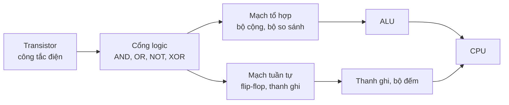
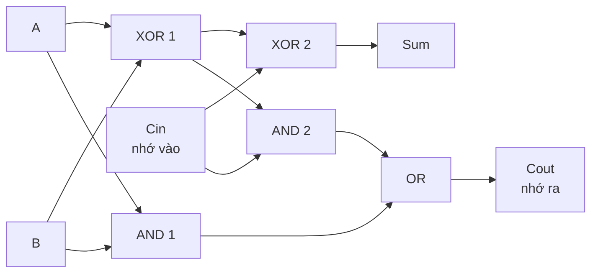
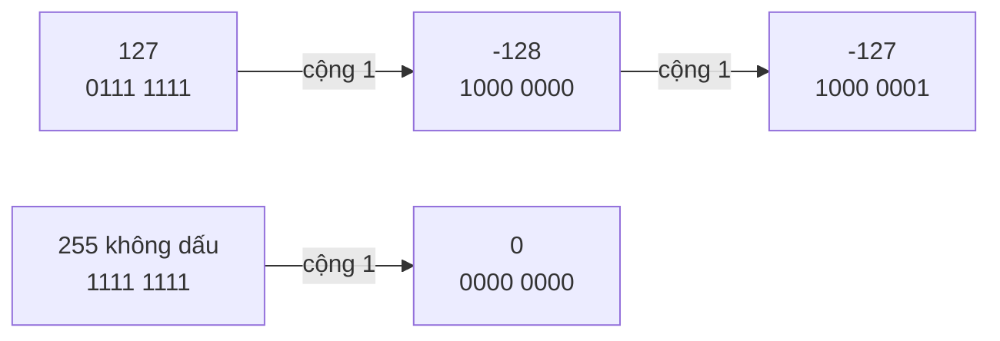
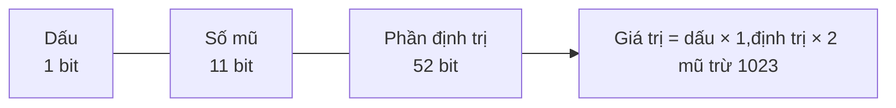

# Máy tính tính toán thế nào

Bên trong máy tính không có số 7, chữ "A" hay màu đỏ — chỉ có **hàng tỉ công tắc điện tí hon** (transistor), mỗi cái ở một trong hai trạng thái: có điện hoặc không có điện, tức **1** hoặc **0**. Bằng cách ghép các công tắc này thành **cổng logic** (logic gate), rồi ghép cổng logic thành **mạch cộng**, rồi thành **ALU**, máy tính làm được mọi phép toán. Mọi thứ khác — số âm, số thực, chữ cái, emoji — chỉ là **quy ước** về cách diễn giải một dãy bit.

**Tương tự đơn giản:** Hãy hình dung một dãy **bóng đèn** trên tường, mỗi bóng chỉ bật hoặc tắt. Một bóng chỉ nói được "có/không". Tám bóng đã có 256 tổ hợp — đủ để đánh số 256 thứ khác nhau. Cách bạn **đọc** dãy đèn ấy (là một con số, một chữ cái hay một màu) phụ thuộc vào **bảng quy ước** mà mọi người cùng thống nhất. Còn các cổng logic giống những "luật bật đèn": "bóng C sáng khi cả A **và** B cùng sáng".

---

:::note[Ghi nhớ nhanh]

- ⭐ **Mọi dữ liệu là bit; ý nghĩa nằm ở cách diễn giải** — cùng 8 bit `11111111` có thể là 255 (số không dấu), -1 (số có dấu bù 2) hay một phần của ký tự UTF-8.
- ⭐ **Số trong JavaScript là số thực 64-bit IEEE 754** — vì vậy `0.1 + 0.2 !== 0.3` và số nguyên chỉ chính xác tới `2^53 - 1`; cần lớn hơn thì dùng `BigInt`.
- **Transistor → cổng logic (AND, OR, NOT, XOR) → bộ cộng → ALU** — toàn bộ phép tính của CPU xây từ các khối đơn giản này.
- **Số âm dùng bù 2 (two's complement):** đảo bit rồi cộng 1; phép trừ trở thành phép cộng.
- **Số nguyên có kích thước cố định nên có thể tràn (overflow)** — phép toán bit trong JS chuyển số về **32-bit có dấu**.

:::

---

## Mục lục

- [Vì sao cần hiểu máy tính tính toán thế nào?](#vì-sao-cần-hiểu-máy-tính-tính-toán-thế-nào)
- [1. Bit, byte và các hệ cơ số](#1-bit-byte-và-các-hệ-cơ-số)
- [2. Từ transistor đến cổng logic](#2-từ-transistor-đến-cổng-logic)
- [3. Bộ cộng và ALU](#3-bộ-cộng-và-alu)
- [4. Số âm và bù 2](#4-số-âm-và-bù-2)
- [5. Tràn số](#5-tràn-số)
- [6. Phép toán bit trong JavaScript](#6-phép-toán-bit-trong-javascript)
- [7. Số thực dấu phẩy động IEEE 754](#7-số-thực-dấu-phẩy-động-ieee-754)
- [8. Mã hoá ký tự ASCII, Unicode, UTF-8](#8-mã-hoá-ký-tự-ascii-unicode-utf-8)
- [Khi nào cần nhớ?](#khi-nào-cần-nhớ)
- [Lỗi thường gặp](#lỗi-thường-gặp)
- [Câu hỏi phỏng vấn](#câu-hỏi-phỏng-vấn)

---

## Vì sao cần hiểu máy tính tính toán thế nào?

**Vấn đề:** Dev web gặp hằng ngày những hành vi "kỳ lạ": `0.1 + 0.2` ra `0.30000000000000004`; ID từ API dạng số 19 chữ số bị đổi giá trị khi `JSON.parse`; `'é'.length` lúc ra 1 lúc ra 2; tính tiền bị lệch 1 đồng; một dòng `x | 0` trong code cũ khiến số lớn bị biến thành số âm. Không hiểu biểu diễn số bên dưới thì chỉ có thể "thử đến khi đúng".

**Giải pháp:** Hiểu **hệ nhị phân, bù 2, IEEE 754 và UTF-8** giúp bạn đoán trước được kết quả, chọn đúng kiểu dữ liệu (`number`, `BigInt`, số nguyên đơn vị nhỏ nhất cho tiền tệ, `Decimal` trong Java) và đọc được hex dump, mã màu, permission, bit flag.

:::tip[Dùng thực tế]

- **Tiền tệ:** lưu tiền dưới dạng số nguyên theo đơn vị nhỏ nhất (đồng, cent) hoặc dùng `BigDecimal` (Java), không dùng số thực.
- **ID lớn:** Snowflake ID của Twitter/Discord dài 64-bit, vượt `Number.MAX_SAFE_INTEGER` → API phải trả dưới dạng chuỗi, client dùng `BigInt`.
- **Bit flag và quyền:** quyền file Unix `chmod 755`, cờ trong React (lanes), Permission bitmask của Discord đều là phép toán bit.
- **Xử lý chuỗi và file:** đếm ký tự, cắt chuỗi có emoji, đọc file nhị phân, decode `Buffer` cần hiểu UTF-8.

:::

---

## 1. Bit, byte và các hệ cơ số

**Bit** (binary digit) là đơn vị thông tin nhỏ nhất: 0 hoặc 1. **Byte** là nhóm **8 bit**, biểu diễn được 2⁸ = 256 giá trị (0–255). Với `n` bit ta có `2^n` tổ hợp.

| Số bit | Số giá trị | Dải không dấu | Ví dụ dùng |
| --- | --- | --- | --- |
| 1 | 2 | 0–1 | Boolean |
| 8 (1 byte) | 256 | 0–255 | Một kênh màu RGB, `Uint8Array` |
| 16 | 65.536 | 0–65.535 | Số cổng mạng (port), đơn vị mã UTF-16 |
| 32 | khoảng 4,29 tỉ | 0–4.294.967.295 | Địa chỉ IPv4, `int` của Java (có dấu) |
| 64 | khoảng 1,8 × 10¹⁹ | 0 đến 2⁶⁴ - 1 | `long` của Java, con trỏ trên máy 64-bit |

### Hệ nhị phân, thập phân, thập lục phân

| Hệ | Cơ số | Chữ số | Tiền tố trong JS | Ví dụ (số 255) |
| --- | --- | --- | --- | --- |
| Nhị phân (binary) | 2 | 0–1 | `0b` | `0b11111111` |
| Bát phân (octal) | 8 | 0–7 | `0o` | `0o377` |
| Thập phân (decimal) | 10 | 0–9 | (không) | `255` |
| Thập lục phân (hexadecimal) | 16 | 0–9, A–F | `0x` | `0xFF` |

Đổi nhị phân sang thập phân: mỗi bit nhân với lũy thừa của 2 theo vị trí.

```text
  1    0    1    1    0    1    0    1      (nhị phân)
 128  64   32   16    8    4    2    1      (trọng số 2^7 ... 2^0)
 128 + 0 + 32 + 16 +  0 +  4 +  0 +  1  = 181 (thập phân)
```

**Hex rất tiện vì 1 chữ số hex = đúng 4 bit**, nên 1 byte = đúng 2 chữ số hex. Đó là lý do mã màu CSS `#FF8800`, địa chỉ bộ nhớ `0x7ffd...`, hash SHA-256, UUID đều viết bằng hex.

```js
// Chuyển đổi giữa các hệ cơ số trong JavaScript
const n = 181;
console.log(n.toString(2));   // '10110101' — sang nhị phân
console.log(n.toString(16));  // 'b5' — sang hex
console.log(parseInt('10110101', 2)); // 181
console.log(parseInt('ff', 16));      // 255
console.log(0b1010, 0o17, 0xff);      // 10 15 255

// Mã màu CSS: tách 3 kênh R, G, B từ chuỗi hex
const hex = 'FF8800';
const [r, g, b] = [0, 2, 4].map((i) => parseInt(hex.slice(i, i + 2), 16));
console.log(r, g, b); // 255 136 0
```

### Đơn vị dung lượng: KB và KiB

| Tiền tố SI (cơ số 10) | Giá trị | Tiền tố IEC (cơ số 2) | Giá trị |
| --- | --- | --- | --- |
| kB (kilobyte) | 1.000 byte | KiB (kibibyte) | 1.024 byte |
| MB | 10⁶ byte | MiB | 2²⁰ = 1.048.576 byte |
| GB | 10⁹ byte | GiB | 2³⁰ byte |

Nhà sản xuất ổ cứng dùng GB (10⁹) còn nhiều hệ điều hành hiển thị theo cơ số 2, nên ổ "1 TB" hiện ra chỉ khoảng 931 GiB.

---

## 2. Từ transistor đến cổng logic

**Transistor** là một công tắc điều khiển bằng điện: điện áp ở cực điều khiển (gate) quyết định dòng điện có chảy qua hay không. Chip hiện đại chứa **hàng chục tỉ transistor** — ví dụ Apple M1 có khoảng 16 tỉ, Apple M3 Max khoảng 92 tỉ.

Ghép vài transistor ta được **cổng logic**, mạch nhận 1–2 bit vào và cho ra 1 bit theo một quy tắc cố định:

| Cổng | Ký hiệu toán | Ra 1 khi | JS tương đương (với bit) |
| --- | --- | --- | --- |
| **NOT** | ¬A | A = 0 | `~a & 1` hoặc `!a` |
| **AND** | A ∧ B | Cả A và B đều 1 | `a & b` |
| **OR** | A ∨ B | Ít nhất một bên là 1 | `a \| b` |
| **XOR** | A ⊕ B | A và B **khác nhau** | `a ^ b` |
| **NAND** | ¬(A ∧ B) | Không phải cả hai đều 1 | `~(a & b) & 1` |

**Bảng chân trị** (truth table):

| A | B | AND | OR | XOR | NAND |
| --- | --- | --- | --- | --- | --- |
| 0 | 0 | 0 | 0 | 0 | 1 |
| 0 | 1 | 0 | 1 | 1 | 1 |
| 1 | 0 | 0 | 1 | 1 | 1 |
| 1 | 1 | 1 | 1 | 0 | 0 |

Một sự thật thú vị: **chỉ với cổng NAND** (hoặc chỉ NOR) có thể dựng được mọi cổng khác — gọi là cổng **vạn năng** (universal gate). Trong thực tế, chip CMOS dùng nhiều loại cổng nhưng ý tưởng là như nhau.



- **Mạch tổ hợp** (combinational): đầu ra chỉ phụ thuộc đầu vào hiện tại — bộ cộng, bộ so sánh.
- **Mạch tuần tự** (sequential): có "trí nhớ", đầu ra phụ thuộc cả trạng thái trước — **flip-flop** lưu được 1 bit, ghép nhiều flip-flop thành thanh ghi (bài 1.3).

---

## 3. Bộ cộng và ALU

### Half adder — bộ cộng nửa

Cộng hai bit A + B cho ra **tổng** (sum) và **số nhớ** (carry):

| A | B | Carry | Sum |
| --- | --- | --- | --- |
| 0 | 0 | 0 | 0 |
| 0 | 1 | 0 | 1 |
| 1 | 0 | 0 | 1 |
| 1 | 1 | 1 | 0 |

Nhìn bảng sẽ thấy: **Sum = A XOR B**, **Carry = A AND B**. Chỉ cần 2 cổng!

### Full adder — bộ cộng đủ

Khi cộng nhiều bit, mỗi cột còn phải cộng thêm số nhớ từ cột bên phải (Cin). Full adder nhận 3 bit A, B, Cin:

- **Sum = A XOR B XOR Cin**
- **Cout = (A AND B) OR (Cin AND (A XOR B))**



Nối 32 hoặc 64 full adder thành chuỗi (số nhớ của bit này đưa sang bit kế tiếp) ta được **bộ cộng gợn sóng** (ripple-carry adder) cộng được số 32/64-bit. CPU thật dùng các thiết kế nhanh hơn như **carry-lookahead** để không phải chờ số nhớ truyền qua từng bit.

Mô phỏng bằng JavaScript chỉ dùng cổng logic:

```js
// Half adder và full adder chỉ dùng phép toán bit trên 0/1
const halfAdder = (a, b) => ({ sum: a ^ b, carry: a & b });

const fullAdder = (a, b, cin) => {
  const s1 = a ^ b;
  return { sum: s1 ^ cin, carry: (a & b) | (cin & s1) };
};

// Cộng hai số 8-bit bằng chuỗi 8 full adder (ripple-carry)
function add8(x, y) {
  let result = 0;
  let carry = 0;
  for (let i = 0; i < 8; i++) {
    const a = (x >> i) & 1; // lấy bit thứ i
    const b = (y >> i) & 1;
    const { sum, carry: c } = fullAdder(a, b, carry);
    result |= sum << i;     // đặt bit thứ i của kết quả
    carry = c;
  }
  return { result, carryOut: carry }; // carryOut = 1 nghĩa là tràn với số không dấu
}

console.log(add8(100, 55));  // { result: 155, carryOut: 0 }
console.log(add8(200, 100)); // { result: 44, carryOut: 1 } — 300 không vừa 8 bit
```

### ALU

**ALU** (Arithmetic Logic Unit) là khối mạch gom nhiều phép toán: cộng, trừ, AND, OR, XOR, NOT, dịch bit, so sánh. Nó nhận hai toán hạng và một **mã phép toán** (opcode) chọn phép nào, rồi xuất kết quả kèm các **cờ trạng thái** (flags): kết quả bằng 0 (Zero), âm (Negative/Sign), có nhớ (Carry), tràn có dấu (Overflow). Lệnh rẽ nhánh `if` dựa vào các cờ này (bài 1.3).

| Đầu vào ALU | Ý nghĩa |
| --- | --- |
| Toán hạng A, B | Hai số cần tính (thường lấy từ thanh ghi) |
| Mã phép toán | Chọn cộng, trừ, AND, OR... |
| **Đầu ra** | |
| Kết quả | Ghi vào thanh ghi đích |
| Cờ Z, N, C, V | Dùng cho so sánh và rẽ nhánh |

Phép nhân và chia phức tạp hơn, thường có khối mạch riêng và mất nhiều chu kỳ hơn phép cộng; số thực do **FPU** (Floating-Point Unit) xử lý.

---

## 4. Số âm và bù 2

Làm sao biểu diễn -5 khi chỉ có 0 và 1? Có ba cách đã từng được dùng:

| Cách | Ý tưởng | -5 với 8 bit | Nhược điểm |
| --- | --- | --- | --- |
| Dấu và độ lớn (sign-magnitude) | Bit đầu là dấu | `10000101` | Có hai số 0 (+0, -0), phép cộng phức tạp |
| Bù 1 (one's complement) | Đảo tất cả bit | `11111010` | Vẫn có hai số 0 |
| **Bù 2 (two's complement)** | Đảo bit rồi **cộng 1** | `11111011` | Gần như không có — **chuẩn hiện nay** |

**Cách lấy số đối trong bù 2:** đảo tất cả bit, rồi cộng 1.

```text
 5   = 0000 0101
 đảo = 1111 1010
 +1  = 1111 1011   → đây là -5

Kiểm tra: 5 + (-5)
   0000 0101
 + 1111 1011
 -----------
 1 0000 0000   → bỏ bit nhớ thứ 9, còn 0000 0000 = 0 ✓
```

Ưu điểm lớn: **phép trừ trở thành phép cộng** (`a - b = a + (~b + 1)`), CPU dùng chung một bộ cộng cho cả số có dấu và không dấu. Bit cao nhất (MSB) cho biết dấu: 1 là âm.

Với `n` bit, dải số có dấu là **-2^(n-1) đến 2^(n-1) - 1**:

| Kiểu | Bit | Nhỏ nhất | Lớn nhất |
| --- | --- | --- | --- |
| `byte` (Java), `Int8Array` | 8 | -128 | 127 |
| `short`, `Int16Array` | 16 | -32.768 | 32.767 |
| `int`, `Int32Array` | 32 | -2.147.483.648 | 2.147.483.647 |
| `long`, `BigInt64Array` | 64 | khoảng -9,22 × 10¹⁸ | khoảng 9,22 × 10¹⁸ |

```js
// Cùng một byte 0xFF nhưng đọc theo hai cách
const buf = new ArrayBuffer(1);
new Uint8Array(buf)[0] = 0xff;
console.log(new Uint8Array(buf)[0]); // 255 — không dấu
console.log(new Int8Array(buf)[0]);  // -1  — có dấu (bù 2)

// Xem dạng bù 2 32-bit của số âm: >>> 0 ép về số không dấu 32-bit
console.log((-5 >>> 0).toString(2)); // '11111111111111111111111111111011'
```

---

## 5. Tràn số

Số nguyên trong phần cứng có **kích thước cố định**. Khi kết quả vượt dải biểu diễn, bit thừa bị bỏ đi và giá trị "quay vòng" — gọi là **tràn số** (overflow).



| Ngôn ngữ | Khi tràn số nguyên |
| --- | --- |
| **Java** | `int` quay vòng im lặng: `Integer.MAX_VALUE + 1 == Integer.MIN_VALUE`. Dùng `Math.addExact` để ném `ArithmeticException` |
| **C/C++** | Không dấu: quay vòng. Có dấu: **hành vi không xác định** (undefined behavior) |
| **JavaScript `number`** | Không quay vòng mà **mất độ chính xác** sau `2^53 - 1`, tới khoảng 1,8 × 10³⁰⁸ thì thành `Infinity` |
| **JavaScript phép toán bit, `Int32Array`** | Quay vòng theo 32-bit có dấu hoặc kích thước của typed array |
| **JavaScript `BigInt`** | Không tràn, chỉ giới hạn bởi bộ nhớ |

```js
// Typed array quay vòng như phần cứng
const a = new Int8Array([127]);
a[0] += 1;
console.log(a[0]); // -128

const u = new Uint8Array([255]);
u[0] += 1;
console.log(u[0]); // 0

// Number: không quay vòng nhưng mất chính xác sau 2^53 - 1
console.log(Number.MAX_SAFE_INTEGER);              // 9007199254740991
console.log(2 ** 53 === 2 ** 53 + 1);              // true (!)
console.log(Number.isSafeInteger(2 ** 53));        // false

// ID 64-bit từ API: parse bằng JSON.parse sẽ làm sai số
console.log(JSON.parse('{"id": 1234567890123456789}').id); // 1234567890123456800
console.log(BigInt('1234567890123456789') + 1n);           // 1234567890123456790n
```

Tràn số từng gây sự cố thật: tên lửa **Ariane 5** (1996) nổ sau khoảng 37 giây bay vì chuyển số thực 64-bit sang số nguyên 16-bit có dấu bị tràn; bộ đếm lượt xem YouTube từng phải nâng từ 32-bit lên 64-bit (2014) khi video "Gangnam Style" vượt 2.147.483.647 lượt xem; và **sự cố năm 2038** khi thời gian Unix lưu bằng số nguyên 32-bit có dấu sẽ tràn vào ngày 19/01/2038.

---

## 6. Phép toán bit trong JavaScript

| Toán tử | Tên | Ví dụ | Kết quả | Dùng để |
| --- | --- | --- | --- | --- |
| `&` | AND | `0b1100 & 0b1010` | `0b1000` (8) | Kiểm tra / lọc bit (mask) |
| `\|` | OR | `0b1100 \| 0b1010` | `0b1110` (14) | Bật bit |
| `^` | XOR | `0b1100 ^ 0b1010` | `0b0110` (6) | Đảo bit, so sánh khác nhau |
| `~` | NOT | `~5` | `-6` | Đảo mọi bit (`~x === -x - 1`) |
| `<<` | Dịch trái | `1 << 4` | `16` | Nhân với 2^n |
| `>>` | Dịch phải có dấu | `-16 >> 2` | `-4` | Chia cho 2^n, giữ dấu |
| `>>>` | Dịch phải không dấu | `-1 >>> 0` | `4294967295` | Ép về số không dấu 32-bit |

**Lưu ý quan trọng:** trước khi làm phép toán bit, JS **chuyển số về số nguyên 32-bit có dấu** (bỏ phần thập phân, bỏ các bit cao). Kết quả cũng là 32-bit có dấu (trừ `>>>` cho ra không dấu).

```js
// Bit flag: lưu nhiều cờ boolean trong một số
const READ = 1 << 0;    // 0b001 = 1
const WRITE = 1 << 1;   // 0b010 = 2
const EXECUTE = 1 << 2; // 0b100 = 4

const perms = READ | WRITE;                     // bật READ và WRITE → 3
const canWrite = (perms & WRITE) !== 0;         // kiểm tra bit → true
const withExec = perms | EXECUTE;               // bật thêm EXECUTE → 7 (giống chmod 7)
const noWrite = withExec & ~WRITE;              // tắt WRITE → 5
const toggled = perms ^ READ;                   // đảo READ → 2

console.log({ perms, canWrite, withExec, noWrite, toggled });

// Kiểm tra số chẵn lẻ và lũy thừa của 2
const isOdd = (n) => (n & 1) === 1;
const isPowerOf2 = (n) => n > 0 && (n & (n - 1)) === 0;
console.log(isOdd(7), isPowerOf2(64), isPowerOf2(96)); // true true false

// Cạm bẫy: phép toán bit cắt về 32-bit có dấu
console.log(3.7 | 0);              // 3 — bỏ phần thập phân (mẹo cũ thay Math.trunc)
console.log(2 ** 31 | 0);          // -2147483648 — tràn!
console.log(5_000_000_000 | 0);    // 705032704 — mất bit cao
console.log(Math.trunc(5_000_000_000)); // 5000000000 — dùng cái này cho số lớn

// BigInt hỗ trợ phép toán bit không giới hạn 32-bit (trừ >>>)
console.log((1n << 40n) | 1n);     // 1099511627777n
```

---

## 7. Số thực dấu phẩy động IEEE 754

`number` trong JavaScript (và `double` trong Java) là **số dấu phẩy động độ chính xác kép** (double-precision floating-point) theo chuẩn **IEEE 754**, dùng **64 bit** chia làm 3 phần, giống ký hiệu khoa học `±1,xxx × 2^e`:

| Phần | Số bit | Ý nghĩa |
| --- | --- | --- |
| **Dấu** (sign) | 1 | 0 là dương, 1 là âm |
| **Số mũ** (exponent) | 11 | Lũy thừa của 2 (lưu kèm độ lệch 1023) |
| **Phần định trị** (mantissa/fraction) | 52 | Các chữ số sau dấu phẩy nhị phân (cộng thêm 1 bit ẩn → 53 bit chính xác) |



| | `float` (32-bit) | `double` (64-bit, JS `number`) |
| --- | --- | --- |
| Bit dấu / mũ / định trị | 1 / 8 / 23 | 1 / 11 / 52 |
| Chữ số thập phân chính xác | khoảng 7 | khoảng 15–17 |
| Số nguyên chính xác tới | 2²⁴ = 16.777.216 | 2⁵³ = 9.007.199.254.740.992 |
| Giá trị lớn nhất | khoảng 3,4 × 10³⁸ | khoảng 1,8 × 10³⁰⁸ |

### Vì sao `0.1 + 0.2 !== 0.3`?

Giống như 1/3 không viết chính xác được trong hệ thập phân (0,3333...), **0,1 không viết chính xác được trong hệ nhị phân**: nó là `0.0001100110011...` lặp vô hạn. Với 52 bit định trị, máy phải **làm tròn**. Cả 0,1 và 0,2 đều bị làm tròn lệch một chút, cộng lại thì sai số cộng dồn, và kết quả làm tròn ra số double gần nhất **khác** với số double gần nhất của 0,3.

```js
console.log(0.1 + 0.2);            // 0.30000000000000004
console.log(0.1 + 0.2 === 0.3);    // false

// Xem giá trị thật đang được lưu
console.log((0.1).toFixed(20));    // '0.10000000000000000555'
console.log((0.3).toFixed(20));    // '0.29999999999999998890'

// Cách 1: so sánh với sai số cho phép
const almostEqual = (a, b, eps = Number.EPSILON) => Math.abs(a - b) < eps;
console.log(almostEqual(0.1 + 0.2, 0.3)); // true

// Cách 2: tiền tệ — tính bằng số nguyên đơn vị nhỏ nhất
const priceCents = 1999;                 // 19,99 USD lưu là 1999 cent
const totalCents = priceCents * 3;       // 5997 — chính xác tuyệt đối
console.log((totalCents / 100).toFixed(2)); // '59.97' — chỉ đổi khi hiển thị

// Cách 3: định dạng khi hiển thị
console.log((0.1 + 0.2).toFixed(2));     // '0.30'

// Các giá trị đặc biệt của IEEE 754
console.log(1 / 0, -1 / 0, 0 / 0);       // Infinity -Infinity NaN
console.log(NaN === NaN, Object.is(NaN, NaN)); // false true
console.log(0 === -0, Object.is(0, -0));       // true false
```

Đây **không phải lỗi của JavaScript** — Java `double`, Python `float`, C `double` đều cho kết quả y hệt vì cùng dùng IEEE 754. Java có `BigDecimal`, Python có `decimal` cho số thập phân chính xác; JS hiện cần thư viện như `decimal.js` hoặc `big.js`.

---

## 8. Mã hoá ký tự ASCII, Unicode, UTF-8

Máy tính lưu chữ bằng cách gán **mỗi ký tự một con số** rồi lưu con số đó.

| Chuẩn | Ra đời | Ý tưởng | Kích thước |
| --- | --- | --- | --- |
| **ASCII** | 1963 | 128 ký tự: chữ Latin không dấu, số, dấu câu, ký tự điều khiển | 7 bit (thường lưu trong 1 byte) |
| **Unicode** | 1991 | **Bảng mã chung** cho mọi chữ viết, mỗi ký tự một **code point** `U+XXXX` | Hơn 150.000 ký tự đã gán, không gian tới U+10FFFF |
| **UTF-8** | 1992–1993 | Cách **lưu** code point Unicode thành 1–4 byte | Ký tự ASCII 1 byte, tiếng Việt có dấu thường 2–3 byte, emoji 4 byte |
| **UTF-16** | 1996 | Lưu code point thành 1–2 đơn vị 16-bit | Dùng trong chuỗi JS, Java, Windows |

Unicode là **bảng số** ("chữ A là số 65, chữ ệ là U+1EC7"), còn UTF-8/UTF-16 là **cách mã hoá** số đó thành byte. UTF-8 tương thích ngược với ASCII và hiện chiếm áp đảo trên web (khoảng 98% trang web).

| Ký tự | Code point | UTF-8 (byte) | Số byte UTF-8 | JS `.length` (đơn vị UTF-16) |
| --- | --- | --- | --- | --- |
| `A` | U+0041 | `41` | 1 | 1 |
| `é` | U+00E9 | `C3 A9` | 2 | 1 |
| `ệ` | U+1EC7 | `E1 BB 87` | 3 | 1 |
| `😀` | U+1F600 | `F0 9F 98 80` | 4 | 2 |

```js
// Chuỗi JS là dãy đơn vị UTF-16, không phải dãy "ký tự"
const s = 'Việt😀';
console.log(s.length);                         // 6 — emoji chiếm 2 đơn vị UTF-16
console.log([...s].length);                    // 5 — đếm theo code point
console.log(new TextEncoder().encode(s).length); // 10 — số byte UTF-8 (1+1+3+1+4)

console.log('A'.charCodeAt(0));                // 65
console.log('😀'.codePointAt(0).toString(16)); // '1f600'

// Cùng chữ "é" có thể là 1 code point hoặc 2 (e + dấu sắc tổ hợp)
const e1 = 'é';
const e2 = 'é';
console.log(e1 === e2, e1.length, e2.length);  // false 1 2
console.log(e1 === e2.normalize('NFC'));       // true — chuẩn hoá trước khi so sánh

// Node.js: Buffer cho thấy byte UTF-8 thật
console.log(Buffer.from('ệ', 'utf8'));         // <Buffer e1 bb 87>
```

---

## Khi nào cần nhớ?

- **Làm việc với tiền, số lượng, đo lường:**
  - Tiền → số nguyên đơn vị nhỏ nhất, hoặc thư viện decimal (`BigDecimal` trong Java)
  - So sánh số thực → dùng sai số `epsilon`, không dùng `===`
  - Hiển thị → `toFixed`, `Intl.NumberFormat`
- **Làm việc với ID và số lớn:**
  - ID 64-bit (Snowflake, `BIGINT` trong PostgreSQL) → truyền qua API dưới dạng chuỗi, dùng `BigInt` khi cần tính
  - Kiểm tra `Number.isSafeInteger` khi nhận số từ ngoài vào
- **Phép toán bit:** bit flag, quyền truy cập, mask, hash, đọc giao thức nhị phân — nhớ giới hạn 32-bit có dấu.
- **Chuỗi:** dùng `[...str]` hoặc `Intl.Segmenter` để đếm ký tự hiển thị, `TextEncoder` để đếm byte (giới hạn cột DB, payload), `normalize('NFC')` trước khi so sánh hoặc tìm kiếm tiếng Việt.

---

## Lỗi thường gặp

### Lỗi 1: Dùng số thực để tính tiền

`0.1 + 0.2` ra `0.30000000000000004`; cộng dồn hàng nghìn giao dịch sai số càng lớn. Hãy lưu tiền bằng số nguyên theo đơn vị nhỏ nhất hoặc dùng kiểu decimal. Cột DB cũng nên là `NUMERIC`/`DECIMAL` thay vì `FLOAT`/`DOUBLE`.

### Lỗi 2: Nghĩ `0.1 + 0.2` là bug riêng của JavaScript

Mọi ngôn ngữ dùng IEEE 754 đều như vậy. Khác biệt duy nhất là JS chỉ có một kiểu số `number` (là double), nên dev JS gặp nhiều hơn.

### Lỗi 3: Dùng `| 0` hoặc `~~x` để làm tròn số lớn

Phép toán bit cắt số về 32-bit có dấu: `5_000_000_000 | 0` cho `705032704`. Dùng `Math.trunc`, `Math.floor` cho số vượt khoảng 2,1 tỉ (ví dụ timestamp tính bằng mili giây).

### Lỗi 4: Đếm độ dài chuỗi bằng `.length` rồi cắt

`.length` đếm đơn vị UTF-16, không phải ký tự. Cắt `str.slice(0, n)` có thể chặt đôi emoji, tạo ký tự lỗi. Giới hạn của DB (ví dụ `VARCHAR(255)` trong MySQL tính theo ký tự, nhưng index tính theo byte) cũng khác `.length`.

### Lỗi 5: Gửi ID 64-bit dưới dạng số JSON

`JSON.parse` biến số thành `number`, số vượt `2^53 - 1` bị làm tròn → sai ID, gọi API cập nhật nhầm bản ghi. Backend nên serialize các ID này thành chuỗi.

---

## Câu hỏi phỏng vấn

Những câu thường gặp về chủ đề này. Tự trả lời trước, rồi bấm **Xem đáp án** để đối chiếu.

**1. Vì sao `0.1 + 0.2 !== 0.3` trong JavaScript? Xử lý thế nào?**

<details className="qa">
<summary>Xem đáp án</summary>

`number` là double IEEE 754 (64-bit, 52 bit định trị). 0,1 và 0,2 là phân số lặp vô hạn trong hệ nhị phân nên bị làm tròn khi lưu. Tổng hai giá trị đã làm tròn được làm tròn tiếp ra `0.30000000000000004`, khác với giá trị double gần nhất của 0,3.

Cách xử lý: so sánh với sai số (`Math.abs(a - b) < Number.EPSILON`, hoặc epsilon phù hợp với độ lớn), tính tiền bằng số nguyên đơn vị nhỏ nhất hoặc thư viện decimal, làm tròn khi hiển thị.

</details>

**2. Bù 2 là gì? Vì sao máy tính dùng nó để biểu diễn số âm?**

<details className="qa">
<summary>Xem đáp án</summary>

Số đối của x trong bù 2 = đảo tất cả bit của x rồi cộng 1. Bit cao nhất là bit dấu. Với n bit, dải là -2^(n-1) đến 2^(n-1) - 1 (8 bit: -128 đến 127).

Lý do dùng: chỉ có **một số 0**, và **phép trừ trở thành phép cộng** (`a - b = a + (~b + 1)`), nên CPU dùng chung một bộ cộng cho cả số có dấu và không dấu, mạch đơn giản hơn.

</details>

**3. `Number.MAX_SAFE_INTEGER` là bao nhiêu và vì sao?**

<details className="qa">
<summary>Xem đáp án</summary>

`2^53 - 1 = 9007199254740991`. Double có 52 bit định trị cộng 1 bit ẩn = 53 bit chính xác. Sau ngưỡng này, khoảng cách giữa hai số double liền kề lớn hơn 1, nên không phải số nguyên nào cũng biểu diễn được (`2**53 === 2**53 + 1` là `true`). Cần số nguyên lớn hơn thì dùng `BigInt`.

</details>

**4. Half adder và full adder khác nhau thế nào?**

<details className="qa">
<summary>Xem đáp án</summary>

- **Half adder** cộng 2 bit: Sum = A XOR B, Carry = A AND B. Không nhận số nhớ từ cột trước.
- **Full adder** cộng 3 bit (A, B và số nhớ vào Cin): Sum = A XOR B XOR Cin, Cout = (A AND B) OR (Cin AND (A XOR B)).

Nối n full adder thành chuỗi được bộ cộng n-bit (ripple-carry). CPU thực tế dùng carry-lookahead để nhanh hơn.

</details>

**5. Tràn số là gì? Java và JavaScript xử lý khác nhau thế nào?**

<details className="qa">
<summary>Xem đáp án</summary>

Tràn số xảy ra khi kết quả vượt dải biểu diễn của kiểu có kích thước cố định; bit thừa bị bỏ và giá trị quay vòng.

- **Java:** `int`/`long` quay vòng im lặng (`Integer.MAX_VALUE + 1` thành `Integer.MIN_VALUE`); dùng `Math.addExact` để phát hiện.
- **JavaScript `number`:** không quay vòng mà mất chính xác sau `2^53 - 1`, rất lớn thì thành `Infinity`. Nhưng phép toán bit và typed array thì quay vòng theo 32-bit hoặc kích thước phần tử. `BigInt` không bị tràn.

</details>

**6. Unicode và UTF-8 khác nhau thế nào? Vì sao `'😀'.length === 2`?**

<details className="qa">
<summary>Xem đáp án</summary>

**Unicode** là bảng gán mỗi ký tự một số (code point, ví dụ U+1F600). **UTF-8** là cách mã hoá code point thành 1–4 byte (tương thích ASCII). Chuỗi JS lưu theo **UTF-16**: code point vượt U+FFFF (như emoji) cần 2 đơn vị 16-bit (cặp surrogate), mà `.length` đếm đơn vị UTF-16 nên ra 2. Đếm theo code point dùng `[...str].length`, đếm theo ký tự hiển thị dùng `Intl.Segmenter`.

</details>
