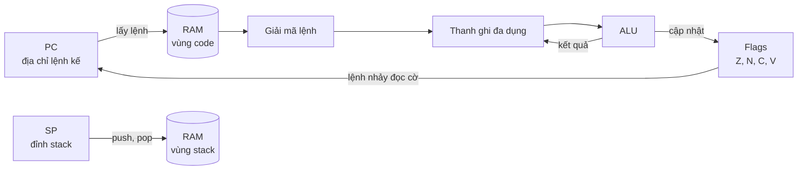
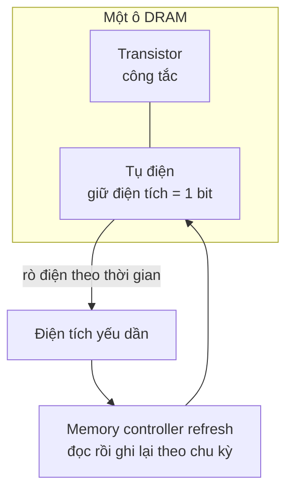
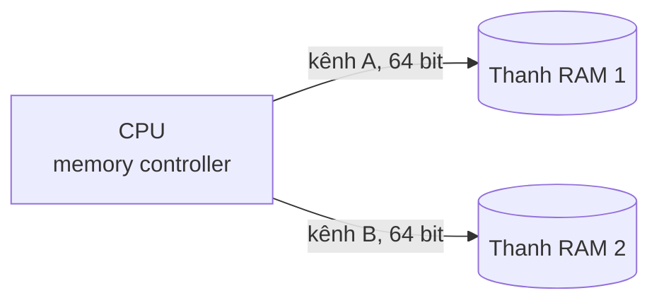
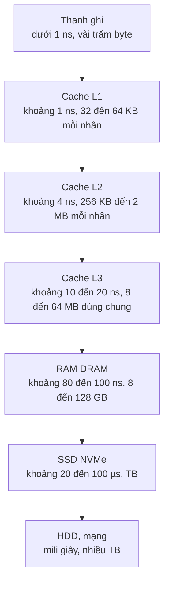

# Thanh ghi và RAM

**Thanh ghi** (register) là những ô nhớ **cực nhỏ và cực nhanh nằm ngay bên trong CPU** — nơi CPU đặt dữ liệu đang tính toán. **RAM** (Random Access Memory) là **bộ nhớ chính** nằm ngoài CPU, lớn hơn hàng triệu lần nhưng chậm hơn hàng trăm lần, chứa toàn bộ chương trình đang chạy và dữ liệu của nó. Mỗi ô của RAM có một **địa chỉ** (address) — một con số — và CPU đọc ghi RAM bằng cách nói "cho tôi byte ở địa chỉ X".

**Tương tự đơn giản:** CPU là **người thợ mộc**. **Thanh ghi** là **hai bàn tay** — chỉ cầm được vài món nhưng dùng ngay lập tức. **Cache** là **thắt lưng đồ nghề**. **RAM** là **giá dụng cụ trong xưởng**, mỗi ngăn có đánh số (địa chỉ), phải đi vài bước mới lấy được. **SSD** là **kho ở bên kia đường**. Người thợ giỏi luôn sắp xếp để thứ cần dùng nhất nằm gần tay nhất.

---

:::note[Ghi nhớ nhanh]

- ⭐ **Phân cấp bộ nhớ:** thanh ghi (dưới 1 ns) → L1 (khoảng 1 ns) → L2 → L3 → RAM (khoảng 100 ns) → SSD (hàng chục µs). Càng xa CPU càng **lớn, rẻ, chậm**.
- ⭐ **RAM là một mảng byte khổng lồ có đánh số địa chỉ** — con trỏ, tham chiếu object trong JS/Java thực chất là các địa chỉ này (được runtime che đi).
- **Thanh ghi đặc biệt:** Program Counter (địa chỉ lệnh kế tiếp), Stack Pointer (đỉnh stack), Flags (kết quả so sánh).
- **SRAM nhanh, đắt, dùng làm cache; DRAM rẻ, dày đặc, dùng làm RAM chính** và phải **làm tươi** (refresh) liên tục vì tụ điện bị rò điện.
- **Endianness:** x86 và ARM (cấu hình thông dụng) là **little-endian**, giao thức mạng dùng **big-endian** — nhớ khi đọc dữ liệu nhị phân bằng `DataView`.

:::

---

## Mục lục

- [Vì sao cần hiểu thanh ghi và RAM?](#vì-sao-cần-hiểu-thanh-ghi-và-ram)
- [1. Thanh ghi là gì](#1-thanh-ghi-là-gì)
- [2. RAM và địa chỉ bộ nhớ](#2-ram-và-địa-chỉ-bộ-nhớ)
- [3. Word size 32-bit và 64-bit](#3-word-size-32-bit-và-64-bit)
- [4. SRAM và DRAM](#4-sram-và-dram)
- [5. DDR và kênh đôi](#5-ddr-và-kênh-đôi)
- [6. Phân cấp bộ nhớ](#6-phân-cấp-bộ-nhớ)
- [7. Endianness](#7-endianness)
- [8. RAM bao nhiêu là đủ và hết RAM thì sao](#8-ram-bao-nhiêu-là-đủ-và-hết-ram-thì-sao)
- [Khi nào cần nhớ?](#khi-nào-cần-nhớ)
- [Lỗi thường gặp](#lỗi-thường-gặp)
- [Câu hỏi phỏng vấn](#câu-hỏi-phỏng-vấn)

---

## Vì sao cần hiểu thanh ghi và RAM?

**Vấn đề:** Trong JS hay Java, ta tạo object, mảng thoải mái mà không thấy địa chỉ bộ nhớ nào. Nhưng rồi gặp: duyệt mảng 2 chiều theo cột chậm hơn theo hàng vài lần; `Float64Array` nhanh hơn mảng object nhiều lần; đọc file ảnh/âm thanh bằng `DataView` ra số sai hoàn toàn; container bị kill với lỗi `OOMKilled`; server chậm dần rồi đứng hình vì swap. Tất cả đều bắt nguồn từ cách **bộ nhớ thật sự hoạt động**.

**Giải pháp:** Có mô hình rõ ràng về **thanh ghi → cache → RAM**, về địa chỉ và cách byte được xếp trong bộ nhớ, bạn sẽ biết vì sao **dữ liệu nằm liền nhau** chạy nhanh, đọc đúng dữ liệu nhị phân, và cấu hình RAM cho máy/container hợp lý.

:::tip[Dùng thực tế]

- **Hiệu năng:** dùng mảng liền mạch (typed array, mảng số) thay vì mảng object rải rác khi xử lý dữ liệu lớn — CPU tận dụng cache tốt hơn.
- **Dữ liệu nhị phân:** đọc file PNG, WAV, giao thức WebSocket, protobuf, `Buffer` trong Node.js cần chọn đúng big/little endian.
- **Vận hành:** đặt `--max-old-space-size` cho Node, `-Xmx` cho JVM, memory limit cho container phù hợp với RAM thật.
- **Chọn máy:** biết khi nào cần thêm RAM (đang swap) và khi nào RAM nhiều cũng vô ích.

:::

---

## 1. Thanh ghi là gì

Thanh ghi là các ô nhớ được dựng từ **flip-flop** ngay trong lõi CPU, mỗi thanh ghi thường rộng bằng **word size** (64 bit trên CPU 64-bit). CPU **chỉ tính toán được trên dữ liệu trong thanh ghi** (một số kiến trúc như x86 cho phép một toán hạng nằm trong bộ nhớ, nhưng bên trong vẫn phải nạp vào trước). Số lượng rất ít: x86-64 có **16 thanh ghi đa dụng** 64-bit, ARM64 (AArch64) có **31 thanh ghi đa dụng** 64-bit.

| Loại thanh ghi | Tên x86-64 | Tên ARM64 | Vai trò |
| --- | --- | --- | --- |
| **Đa dụng** (general-purpose) | `rax`, `rbx`, `rcx`, `rdx`, `rsi`, `rdi`, `r8`–`r15`... | `x0`–`x30` | Chứa số, địa chỉ, tham số hàm, giá trị trả về |
| **Program Counter** (PC) | `rip` (Instruction Pointer) | `pc` | Địa chỉ của **lệnh kế tiếp** cần thực thi |
| **Stack Pointer** (SP) | `rsp` | `sp` | Địa chỉ **đỉnh stack** của luồng hiện tại |
| **Flags / trạng thái** | `rflags` | `nzcv` (một phần của PSTATE) | Cờ Zero, Sign/Negative, Carry, Overflow sau phép tính |
| **Vector / số thực** | `xmm0`–`xmm15`, `ymm`, `zmm` | `v0`–`v31` | Tính số thực, SIMD (một lệnh xử lý nhiều số) |

### Program Counter — "ngón tay chỉ dòng"

PC giữ địa chỉ của lệnh tiếp theo. Sau mỗi lệnh, PC tự tăng tới lệnh kế. Lệnh nhảy (`jmp`, `call`, `ret`, `if`) thực chất là **ghi một giá trị mới vào PC**. Khi debugger dừng ở breakpoint, dòng đang được highlight chính là nơi PC trỏ tới.

### Stack Pointer — đỉnh ngăn xếp

Mỗi luồng có một vùng **stack** trong RAM để lưu biến cục bộ, tham số và **địa chỉ trả về** khi gọi hàm. SP trỏ vào đỉnh stack; gọi hàm thì SP dịch xuống (stack trên x86 và ARM mọc về phía địa chỉ thấp), return thì dịch lên. Lỗi `RangeError: Maximum call stack size exceeded` trong JS hay `StackOverflowError` trong Java chính là SP vượt quá vùng stack cho phép.

### Flags — kết quả so sánh

Lệnh so sánh (`cmp`) thực chất là phép **trừ** chỉ để lấy cờ: nếu `a - b` bằng 0 thì cờ Zero bật → `a == b`. Lệnh nhảy có điều kiện (`je`, `jne`, `jl`...) đọc cờ để quyết định có nhảy hay không. Đó là cách `if (a === b)` được thực hiện ở cấp phần cứng.



---

## 2. RAM và địa chỉ bộ nhớ

Từ góc nhìn của chương trình, RAM là **một mảng byte rất dài**, mỗi byte có một **địa chỉ** là số thứ tự của nó, thường viết bằng hex.

```text
Địa chỉ        Nội dung (1 byte mỗi ô)
0x1000         0x48   ← 'H'
0x1001         0x69   ← 'i'
0x1002         0x00
0x1003         0x2A   ← 42
...
```

- **Biến** trong ngôn ngữ bậc cao là tên đặt cho một vùng địa chỉ.
- **Con trỏ** (pointer) trong C là một biến chứa địa chỉ.
- **Tham chiếu** (reference) tới object trong JS/Java cũng là địa chỉ (hoặc gần như vậy), chỉ là runtime không cho bạn xem hay tính toán trên nó, và **garbage collector** có thể di chuyển object rồi tự cập nhật tham chiếu.

```js
// Hai biến cùng trỏ tới một object = cùng giữ một địa chỉ
const a = { count: 1 };
const b = a;            // chép địa chỉ, không chép object
const c = { ...a };     // tạo object mới ở địa chỉ khác
console.log(a === b);   // true — cùng địa chỉ
console.log(a === c);   // false — khác địa chỉ dù nội dung giống nhau
```

Thực tế, địa chỉ mà chương trình thấy là **địa chỉ ảo** (virtual address). Phần cứng **MMU** (Memory Management Unit) cùng hệ điều hành dịch nó sang **địa chỉ vật lý** trên thanh RAM thật. Nhờ vậy mỗi tiến trình tưởng mình có cả không gian bộ nhớ riêng, không đụng được vào bộ nhớ của tiến trình khác (chi tiết ở bài 2.4 Quản lý bộ nhớ).

### Truy cập theo cache line

CPU không đọc RAM từng byte mà theo khối **cache line**, thường **64 byte** trên x86 và đa số chip ARM (Apple M-series dùng 128 byte). Đọc 1 byte thì cả 64 byte xung quanh cũng được đưa vào cache. Vì vậy **dữ liệu nằm liền nhau** được đọc nhanh hơn hẳn dữ liệu rải rác:

```js
// Duyệt mảng 2 chiều lưu phẳng (row-major): hàng i, cột j ở vị trí i * N + j
const N = 4096;
const grid = new Float64Array(N * N);

function sumByRow() {
  let s = 0;
  for (let i = 0; i < N; i++)
    for (let j = 0; j < N; j++) s += grid[i * N + j]; // đi liền nhau trong RAM
  return s;
}

function sumByCol() {
  let s = 0;
  for (let j = 0; j < N; j++)
    for (let i = 0; i < N; i++) s += grid[i * N + j]; // mỗi bước nhảy N * 8 byte
  return s;
}

console.time('theo hàng'); sumByRow(); console.timeEnd('theo hàng');
console.time('theo cột');  sumByCol(); console.timeEnd('theo cột');
// Trên đa số máy, duyệt theo cột chậm hơn rõ rệt (thường vài lần)
```

---

## 3. Word size 32-bit và 64-bit

**Word size** (độ dài từ máy) là số bit CPU xử lý tự nhiên trong một thao tác — bằng độ rộng thanh ghi đa dụng và thường là độ rộng địa chỉ.

| | 32-bit | 64-bit |
| --- | --- | --- |
| **Thanh ghi đa dụng** | 32 bit | 64 bit |
| **Không gian địa chỉ lý thuyết** | 2³² byte = **4 GiB** | 2⁶⁴ byte = 16 EiB |
| **Thực tế dùng** | Mỗi tiến trình thường chỉ dùng được 2–3 GiB | x86-64 hiện dùng 48 bit địa chỉ ảo (256 TiB), có CPU hỗ trợ 57 bit |
| **Kích thước con trỏ** | 4 byte | 8 byte |
| **Ví dụ** | Windows XP 32-bit, ARMv7 (điện thoại cũ) | Gần như mọi PC, server, điện thoại hiện nay |

Đây là lý do máy Windows 32-bit cắm 8 GB RAM vẫn chỉ thấy khoảng 3,x GB. Ngược lại, con trỏ 8 byte làm chương trình 64-bit tốn RAM hơn — vì thế V8 dùng kỹ thuật **pointer compression** (nén con trỏ xuống 32-bit trong heap) và JVM có **compressed oops** khi heap nhỏ hơn khoảng 32 GB.

---

## 4. SRAM và DRAM

Có hai công nghệ chính làm bộ nhớ RAM:

| | SRAM (Static RAM) | DRAM (Dynamic RAM) |
| --- | --- | --- |
| **Cấu tạo 1 bit** | Khoảng 6 transistor (mạch flip-flop) | 1 transistor + 1 tụ điện |
| **Tốc độ** | Rất nhanh (gần tốc độ CPU) | Chậm hơn nhiều |
| **Mật độ** | Thấp — tốn diện tích chip | Cao — chứa được nhiều GB |
| **Giá mỗi bit** | Rất đắt | Rẻ |
| **Cần refresh** | Không, giữ dữ liệu khi còn điện | **Có**, liên tục |
| **Dùng làm** | Thanh ghi file, cache L1/L2/L3 | RAM chính (thanh DDR), VRAM (GDDR), HBM |

### Vì sao DRAM cần refresh?

Mỗi bit DRAM được lưu bằng **điện tích trong một tụ điện cực nhỏ**: có điện tích là 1, không có là 0. Tụ điện này **rò điện dần** qua thời gian, chỉ sau vài chục mili giây là không phân biệt được 0 và 1 nữa. Vì vậy bộ điều khiển bộ nhớ phải **đọc rồi ghi lại** (làm tươi — refresh) từng hàng của DRAM theo chu kỳ — theo chuẩn JEDEC, mỗi ô phải được refresh trong vòng **64 ms** ở nhiệt độ thường (32 ms khi nóng). Trong lúc refresh, hàng đó tạm thời không truy cập được, góp phần làm DRAM chậm hơn SRAM.

Thêm nữa, việc đọc DRAM là **đọc phá huỷ** (destructive read) — đọc xong tụ mất điện tích, phải ghi lại. Chữ "Dynamic" chính là ám chỉ việc phải duy trì liên tục này; "Static" thì giữ nguyên khi còn điện.



---

## 5. DDR và kênh đôi

Thanh RAM trong máy tính hiện nay là **DDR SDRAM** (Double Data Rate Synchronous DRAM):

- **Synchronous:** hoạt động đồng bộ theo xung nhịp.
- **Double Data Rate:** truyền dữ liệu ở **cả sườn lên và sườn xuống** của xung nhịp → gấp đôi số lần truyền mỗi chu kỳ. Vì vậy tốc độ được ghi là **MT/s** (mega transfers per second): DDR4-3200 nghĩa là 3.200 triệu lần truyền mỗi giây với xung nhịp thật 1.600 MHz.

| Thế hệ | Tốc độ chuẩn JEDEC (xấp xỉ) | Điện áp | Ghi chú |
| --- | --- | --- | --- |
| DDR3 | 800–2.133 MT/s | 1,5 V (DDR3L 1,35 V) | Máy đời khoảng 2007–2015 |
| DDR4 | 1.600–3.200 MT/s | 1,2 V | Phổ biến từ khoảng 2015 |
| DDR5 | 4.800–8.800 MT/s | 1,1 V | Từ khoảng 2021, mỗi thanh chia 2 kênh con 32-bit |
| LPDDR4X/LPDDR5 | Cao, tiết kiệm điện | Thấp hơn | Laptop mỏng, điện thoại, Apple M-series |

**Băng thông một kênh** = tốc độ truyền × độ rộng bus (64 bit = 8 byte). Ví dụ DDR4-3200: 3.200 × 10⁶ × 8 byte = **25,6 GB/s**.

### Kênh đôi (dual channel)

Bộ điều khiển bộ nhớ có thể có nhiều **kênh** (channel) độc lập. Cắm 2 thanh RAM vào đúng 2 kênh khác nhau thì CPU đọc ghi song song cả hai → **băng thông lý thuyết gấp đôi** (DDR4-3200 kênh đôi: khoảng 51,2 GB/s). Đó là lý do **2 thanh 8 GB thường tốt hơn 1 thanh 16 GB** cho GPU tích hợp và các tác vụ cần băng thông. Server dùng 8–12 kênh mỗi CPU.



Kênh đôi tăng **băng thông** (bao nhiêu byte mỗi giây), **không** giảm đáng kể **độ trễ** (mất bao lâu để byte đầu tiên tới).

---

## 6. Phân cấp bộ nhớ

Không có loại bộ nhớ nào vừa nhanh, vừa lớn, vừa rẻ. Giải pháp là xếp nhiều tầng: tầng trên nhỏ và nhanh giữ **bản sao** của dữ liệu hay dùng ở tầng dưới. Nhờ **tính cục bộ** (locality — dữ liệu vừa dùng hoặc nằm cạnh dữ liệu vừa dùng thường sắp được dùng tiếp), phần lớn truy cập được phục vụ ở tầng nhanh.



| Tầng | Công nghệ | Độ trễ (xấp xỉ) | Số chu kỳ ở 4 GHz (xấp xỉ) | Ai quản lý |
| --- | --- | --- | --- | --- |
| Thanh ghi | Flip-flop | dưới 1 ns | 0–1 | Compiler/JIT |
| L1 | SRAM | khoảng 1 ns | khoảng 4–5 | Phần cứng |
| L2 | SRAM | khoảng 4 ns | khoảng 12–16 | Phần cứng |
| L3 | SRAM | khoảng 10–20 ns | khoảng 40–80 | Phần cứng |
| RAM | DRAM | khoảng 80–100 ns | khoảng 300–400 | Hệ điều hành |
| SSD NVMe | Flash NAND | khoảng 20–100 µs | hàng trăm nghìn | Hệ điều hành |
| HDD | Đĩa từ | khoảng 5–10 ms | hàng chục triệu | Hệ điều hành |
| Mạng trong data center | — | khoảng 0,5 ms khứ hồi | hàng triệu | Ứng dụng |

Một lần **cache miss** phải xuống RAM tốn khoảng vài trăm chu kỳ — đủ để CPU thực hiện hàng trăm phép cộng. Chi tiết về cache ở bài 1.6.

---

## 7. Endianness

Một số 32-bit chiếm 4 byte. Câu hỏi là: byte nào đặt ở địa chỉ thấp nhất? Đó là **endianness** (thứ tự byte).

- **Big-endian:** byte **lớn nhất** (most significant) đặt ở địa chỉ thấp nhất — giống cách ta viết số từ trái sang phải.
- **Little-endian:** byte **nhỏ nhất** (least significant) đặt ở địa chỉ thấp nhất.

Ví dụ số `0x12345678` lưu tại địa chỉ `0x100`:

| Địa chỉ | `0x100` | `0x101` | `0x102` | `0x103` |
| --- | --- | --- | --- | --- |
| **Big-endian** | `12` | `34` | `56` | `78` |
| **Little-endian** | `78` | `56` | `34` | `12` |

| Nơi dùng | Endianness |
| --- | --- |
| CPU x86, x86-64 (Intel, AMD) | Little-endian |
| ARM (Apple M-series, điện thoại, AWS Graviton) | Hỗ trợ cả hai, nhưng hệ điều hành thông dụng chạy **little-endian** |
| Giao thức mạng TCP/IP ("network byte order") | **Big-endian** |
| File PNG, JPEG, class file của Java | Big-endian |
| File WAV, BMP, WebAssembly | Little-endian |

Trong JS, **typed array dùng endianness của máy** (gần như luôn little-endian), còn **`DataView` mặc định big-endian** và cho phép chọn:

```js
const buf = new ArrayBuffer(4);
const view = new DataView(buf);

// Ghi số 0x12345678 theo big-endian (mặc định của DataView)
view.setUint32(0, 0x12345678);
console.log([...new Uint8Array(buf)].map((b) => b.toString(16))); // ['12','34','56','78']

// Ghi lại theo little-endian (tham số thứ 3 = true)
view.setUint32(0, 0x12345678, true);
console.log([...new Uint8Array(buf)].map((b) => b.toString(16))); // ['78','56','34','12']

// Đọc sai endianness → ra số hoàn toàn khác
console.log(view.getUint32(0, true).toString(16));  // '12345678' — đúng
console.log(view.getUint32(0).toString(16));        // '78563412' — sai

// Kiểm tra endianness của máy đang chạy
const isLittleEndian = new Uint8Array(new Uint32Array([1]).buffer)[0] === 1;
console.log('Máy little-endian?', isLittleEndian); // true trên x86 và Apple M
```

```js
// Đọc chiều rộng, chiều cao từ header file PNG (lưu big-endian)
import { readFileSync } from 'node:fs';

function pngSize(path) {
  const buf = readFileSync(path);
  const view = new DataView(buf.buffer, buf.byteOffset, buf.byteLength);
  // 8 byte chữ ký + 4 byte độ dài + 4 byte 'IHDR' → width ở offset 16, height ở 20
  return { width: view.getUint32(16), height: view.getUint32(20) }; // big-endian
}
```

Node.js `Buffer` có cặp hàm rõ ràng: `readUInt32BE` / `readUInt32LE`.

---

## 8. RAM bao nhiêu là đủ và hết RAM thì sao

Không có con số chung — phụ thuộc vào thứ bạn chạy **cùng lúc**. Tham khảo cho dev (xấp xỉ, năm 2025–2026):

| Nhu cầu | RAM gợi ý (tham khảo) | Lý do |
| --- | --- | --- |
| Lướt web, văn phòng | 8 GB | Trình duyệt hiện đại tốn khá nhiều RAM mỗi tab |
| Dev web frontend/backend | 16 GB | IDE + trình duyệt + Node dev server + vài container |
| Dev nhiều container, Android emulator, JVM lớn | 32 GB | Docker, Kubernetes local, Gradle, Android Studio đều nặng |
| Chạy mô hình AI cục bộ, data lớn | 64 GB trở lên | Mô hình phải nằm trong RAM/VRAM |

Cách kiểm tra máy có thiếu RAM: xem **swap** đang dùng và **memory pressure** (macOS Activity Monitor), `free -h` hoặc `vmstat` trên Linux. RAM "đã dùng" cao **chưa chắc** là thiếu — hệ điều hành cố ý dùng RAM trống làm **page cache** cho file, và sẽ nhả ra khi cần.

### Hết RAM thì sao?

1. Hệ điều hành thu hồi page cache, nén bộ nhớ (macOS, Windows có memory compression).
2. Đẩy các trang ít dùng ra ổ đĩa — gọi là **swap** (hoặc page file trên Windows). Đọc lại từ SSD chậm hơn RAM khoảng 1.000 lần, nên máy **chậm đi rõ rệt** thay vì báo lỗi ngay.
3. Nếu vẫn không đủ, Linux kích hoạt **OOM killer** (Out Of Memory) giết tiến trình tốn RAM nhất; trong Kubernetes container bị đánh dấu `OOMKilled`.
4. Ở mức ứng dụng, V8 hay JVM chạm giới hạn heap riêng thì báo `JavaScript heap out of memory` hoặc `java.lang.OutOfMemoryError`, kể cả khi máy còn RAM.

Chi tiết swap, bộ nhớ ảo và paging ở bài 2.4 Quản lý bộ nhớ.

---

## Khi nào cần nhớ?

- **Tối ưu vòng lặp và cấu trúc dữ liệu:**
  - Dữ liệu số lớn → typed array (`Float64Array`, `Int32Array`) thay vì mảng object
  - Duyệt theo đúng thứ tự lưu trong bộ nhớ (theo hàng với mảng row-major)
  - Gom dữ liệu hay dùng cùng nhau nằm liền nhau
- **Xử lý dữ liệu nhị phân:** luôn xác định rõ endianness của định dạng; dùng `DataView` hoặc `Buffer.readXxxBE/LE`, không dùng typed array trực tiếp cho dữ liệu big-endian.
- **Cấu hình runtime và container:**
  - Node: `--max-old-space-size` (MB) nhỏ hơn memory limit của container
  - JVM: `-Xmx` hoặc `-XX:MaxRAMPercentage` để chừa chỗ cho metaspace, stack, buffer ngoài heap
  - Theo dõi swap — swap tăng liên tục là dấu hiệu thiếu RAM
- **Best practice:** đo bằng benchmark và profiler trước khi kết luận nguyên nhân là bộ nhớ.

---

## Lỗi thường gặp

### Lỗi 1: Nghĩ biến trong JS/Java nằm trong thanh ghi

Thanh ghi chỉ có vài chục cái và do compiler/JIT phân bổ tạm thời. Hầu hết biến, object nằm trong RAM (stack hoặc heap) và chỉ được nạp vào thanh ghi khi tính toán. Bạn không điều khiển trực tiếp được việc này trong ngôn ngữ bậc cao.

### Lỗi 2: Thấy RAM "đã dùng" 90% là kết luận thiếu RAM

Hệ điều hành dùng RAM trống làm page cache — RAM trống là RAM lãng phí. Chỉ số đáng tin hơn là **swap đang tăng**, **memory pressure**, số **major page fault**, hoặc tiến trình bị OOM kill.

### Lỗi 3: Đọc dữ liệu nhị phân bằng typed array mà quên endianness

`new Uint32Array(buffer)` đọc theo endianness của máy (little-endian). Dữ liệu từ mạng hoặc file PNG là big-endian → số ra sai hoàn toàn. Dùng `DataView` với tham số endianness rõ ràng.

### Lỗi 4: Nghĩ kênh đôi làm RAM "nhanh gấp đôi" mọi việc

Kênh đôi tăng **băng thông**, không giảm **độ trễ** truy cập. Ứng dụng nhạy độ trễ (nhiều truy cập ngẫu nhiên nhỏ) hưởng lợi ít; ứng dụng cần băng thông lớn (GPU tích hợp, xử lý video, nén) hưởng lợi nhiều.

### Lỗi 5: Đặt heap của Node/JVM bằng đúng memory limit của container

Tiến trình còn dùng bộ nhớ ngoài heap: stack của các luồng, code đã JIT, `Buffer`, thư viện native. Đặt heap bằng đúng limit thì container sẽ bị `OOMKilled`. Nên chừa ra khoảng 20–30% (tuỳ ứng dụng, cần đo thực tế).

---

## Câu hỏi phỏng vấn

Những câu thường gặp về chủ đề này. Tự trả lời trước, rồi bấm **Xem đáp án** để đối chiếu.

**1. Thanh ghi là gì? Kể tên vài thanh ghi đặc biệt và vai trò của chúng.**

<details className="qa">
<summary>Xem đáp án</summary>

Thanh ghi là ô nhớ nhỏ nhất, nhanh nhất, nằm trong CPU, rộng bằng word size. CPU tính toán trên dữ liệu trong thanh ghi.

- **Program Counter** (`rip`, `pc`): địa chỉ lệnh kế tiếp; lệnh nhảy/gọi hàm thay đổi PC.
- **Stack Pointer** (`rsp`, `sp`): địa chỉ đỉnh stack, thay đổi khi gọi hàm, return, push, pop.
- **Flags** (`rflags`, `nzcv`): cờ Zero, Negative, Carry, Overflow từ phép tính trước, dùng cho lệnh nhảy có điều kiện.
- **Thanh ghi đa dụng**: chứa toán hạng, địa chỉ, tham số hàm, giá trị trả về.

</details>

**2. SRAM và DRAM khác nhau thế nào? Vì sao DRAM cần refresh?**

<details className="qa">
<summary>Xem đáp án</summary>

- **SRAM:** khoảng 6 transistor mỗi bit, nhanh, đắt, mật độ thấp, không cần refresh → dùng làm cache.
- **DRAM:** 1 transistor + 1 tụ điện mỗi bit, chậm hơn, rẻ, mật độ cao → dùng làm RAM chính.

DRAM lưu bit bằng điện tích trong tụ điện, tụ rò điện dần nên sau vài chục ms dữ liệu sẽ mất. Bộ điều khiển phải đọc rồi ghi lại từng hàng theo chu kỳ (chuẩn JEDEC: trong vòng 64 ms ở nhiệt độ thường). Đọc DRAM cũng là đọc phá huỷ nên phải ghi lại.

</details>

**3. Big-endian và little-endian là gì? Khi nào dev web cần quan tâm?**

<details className="qa">
<summary>Xem đáp án</summary>

Là thứ tự đặt các byte của một số nhiều byte trong bộ nhớ. Big-endian đặt byte lớn nhất ở địa chỉ thấp nhất; little-endian đặt byte nhỏ nhất ở địa chỉ thấp nhất. `0x12345678` lưu big-endian là `12 34 56 78`, little-endian là `78 56 34 12`.

x86 và ARM (thông dụng) là little-endian; mạng TCP/IP và nhiều định dạng file (PNG) là big-endian. Dev web gặp khi đọc ghi dữ liệu nhị phân: `DataView` (mặc định big-endian, có tham số `littleEndian`), `Buffer.readUInt32BE/LE`, WebSocket frame, file âm thanh, ảnh.

</details>

**4. Vì sao duyệt mảng 2 chiều theo hàng thường nhanh hơn theo cột?**

<details className="qa">
<summary>Xem đáp án</summary>

Mảng row-major lưu các phần tử cùng hàng liền nhau trong RAM. CPU nạp dữ liệu theo **cache line** (thường 64 byte), nên duyệt theo hàng dùng hết các phần tử trong mỗi cache line đã nạp (tính cục bộ không gian) và bộ prefetch dự đoán được. Duyệt theo cột nhảy cách quãng, mỗi bước có thể là một cache miss phải xuống RAM — tốn khoảng vài trăm chu kỳ mỗi lần.

</details>

**5. Hệ thống 32-bit giới hạn RAM bao nhiêu và vì sao?**

<details className="qa">
<summary>Xem đáp án</summary>

Địa chỉ 32 bit đánh số được 2³² byte = 4 GiB, nên không gian địa chỉ tối đa là 4 GiB, và một phần còn bị dành cho thiết bị (memory-mapped I/O), nên thực tế hệ điều hành thường chỉ thấy khoảng 3,x GB. Mỗi tiến trình thường chỉ dùng được 2–3 GiB. CPU 64-bit (x86-64 dùng 48 bit địa chỉ ảo = 256 TiB) gỡ bỏ giới hạn này, đổi lại con trỏ 8 byte tốn bộ nhớ hơn (V8 và JVM có kỹ thuật nén con trỏ để bù).

</details>

**6. Khi máy hết RAM thì điều gì xảy ra?**

<details className="qa">
<summary>Xem đáp án</summary>

Hệ điều hành lần lượt: thu hồi page cache, nén bộ nhớ (nếu hỗ trợ), đẩy trang ít dùng ra **swap** trên ổ đĩa — làm máy chậm đi rất nhiều vì ổ đĩa chậm hơn RAM hàng nghìn lần. Nếu vẫn thiếu, Linux chạy **OOM killer** giết tiến trình tốn RAM nhất (container báo `OOMKilled`). Độc lập với đó, runtime như V8/JVM có giới hạn heap riêng và ném lỗi out of memory khi chạm giới hạn.

</details>
