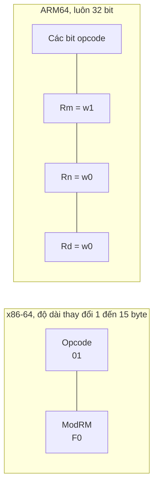
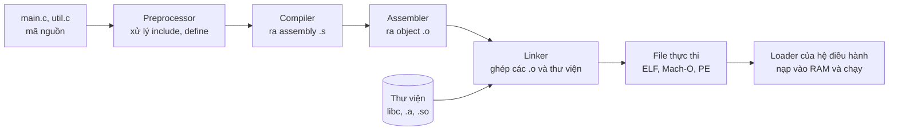
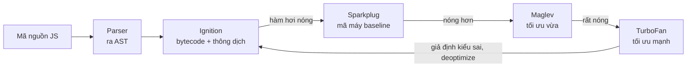
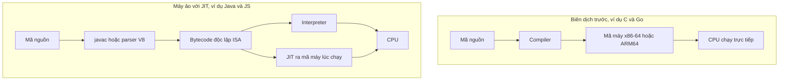

# Lệnh và chương trình

Với CPU, một **chương trình** (program) chỉ là **một dãy lệnh máy** (machine instruction) nằm trong bộ nhớ — mỗi lệnh là vài byte mô tả một việc rất nhỏ: "cộng hai thanh ghi", "nạp 8 byte từ địa chỉ X", "nhảy tới địa chỉ Y nếu kết quả bằng 0". Tập hợp tất cả các lệnh mà một dòng CPU hiểu được gọi là **kiến trúc tập lệnh** (ISA — Instruction Set Architecture), ví dụ **x86-64** của Intel/AMD hay **ARM64** của Apple M-series và điện thoại. Code JavaScript, Java, TypeScript của bạn, bằng cách này hay cách khác, cuối cùng đều phải biến thành các lệnh máy đó.

**Tương tự đơn giản:** ISA giống **bộ từ vựng của một ngôn ngữ** mà CPU nói. CPU Intel nói "tiếng x86", Apple M3 nói "tiếng ARM". **Mã máy** là câu viết bằng ngôn ngữ đó dưới dạng số. **Assembly** là cùng câu ấy nhưng viết bằng chữ cho người đọc được. **Compiler** là **phiên dịch viên dịch trước cả cuốn sách**, **interpreter** là **phiên dịch viên dịch từng câu khi đang nói**, còn **JIT** là phiên dịch viên vừa dịch cabin vừa ghi nhớ những câu hay lặp lại để lần sau đọc luôn bản dịch sẵn.

---

:::note[Ghi nhớ nhanh]

- ⭐ **ISA là "hợp đồng" giữa phần mềm và phần cứng** — mã máy viết cho x86-64 không chạy trực tiếp trên ARM64 và ngược lại.
- ⭐ **Biên dịch vs thông dịch vs JIT:** C/Go/Rust biên dịch trước ra mã máy; JS và Java chạy qua **máy ảo** (V8, JVM) vừa thông dịch vừa **JIT** biên dịch đoạn code "nóng" ra mã máy lúc chạy.
- **Mỗi lệnh máy = opcode (làm gì) + operand (làm trên cái gì)**; assembly là dạng chữ, đọc được của mã máy.
- **CISC (x86) vs RISC (ARM, RISC-V):** CISC có lệnh dài ngắn khác nhau, nhiều chế độ địa chỉ; RISC có lệnh cố định 4 byte, đơn giản, tiết kiệm điện.
- **Từ mã nguồn tới file chạy:** compiler → assembler → linker → file thực thi (ELF, Mach-O, PE) gắn với **cả ISA lẫn hệ điều hành**.

:::

---

## Mục lục

- [Vì sao cần hiểu lệnh và chương trình?](#vì-sao-cần-hiểu-lệnh-và-chương-trình)
- [1. Kiến trúc tập lệnh ISA](#1-kiến-trúc-tập-lệnh-isa)
- [2. Mã máy, opcode và operand](#2-mã-máy-opcode-và-operand)
- [3. Assembly qua ví dụ hàm cộng](#3-assembly-qua-ví-dụ-hàm-cộng)
- [4. CISC và RISC](#4-cisc-và-risc)
- [5. Từ mã nguồn tới file chạy](#5-từ-mã-nguồn-tới-file-chạy)
- [6. Biên dịch, thông dịch và JIT](#6-biên-dịch-thông-dịch-và-jit)
- [7. Vì sao binary Mac ARM không chạy trên Windows x86](#7-vì-sao-binary-mac-arm-không-chạy-trên-windows-x86)
- [Khi nào cần nhớ?](#khi-nào-cần-nhớ)
- [Lỗi thường gặp](#lỗi-thường-gặp)
- [Câu hỏi phỏng vấn](#câu-hỏi-phỏng-vấn)

---

## Vì sao cần hiểu lệnh và chương trình?

**Vấn đề:** Dev web gặp những lỗi kiểu: `npm install` trên Mac M chạy ngon nhưng deploy lên server Linux x86 thì báo `invalid ELF header`; Docker image build trên Mac chạy trên server báo `exec format error`; module native như `bcrypt`, `sharp` phải build lại; code JS chạy chậm trong vài giây đầu rồi mới nhanh; Java service "warm up" mất mấy phút sau khi deploy. Không hiểu mã máy, ISA và JIT thì những lỗi này giống "ma thuật".

**Giải pháp:** Nắm được **chuỗi biến đổi từ mã nguồn tới lệnh máy** và vì sao lệnh máy gắn chặt với ISA và hệ điều hành, bạn sẽ biết khi nào cần build lại, khi nào cần image multi-arch, vì sao JIT cần warm-up, và vì sao Node/Java "viết một lần chạy mọi nơi" còn binary C/Go thì không.

:::tip[Dùng thực tế]

- **Docker và CI/CD:** build image `linux/amd64` và `linux/arm64` (`docker buildx --platform`), chọn đúng kiến trúc cho instance AWS Graviton (ARM) hay x86.
- **Native module của Node.js:** `sharp`, `bcrypt`, `better-sqlite3`, `esbuild`, `@swc/core` có file `.node` hoặc binary riêng cho từng hệ điều hành và CPU — không chép `node_modules` giữa máy khác kiến trúc.
- **Hiệu năng runtime:** hiểu JIT để biết vì sao benchmark cần warm-up, vì sao hàm nhận kiểu dữ liệu "lộn xộn" chạy chậm (bị deoptimize).
- **Đọc profiler và crash:** flame graph, stack trace native, core dump đều chứa địa chỉ lệnh máy và tên hàm từ bảng symbol.

:::

---

## 1. Kiến trúc tập lệnh ISA

**ISA** quy định mọi thứ phần mềm cần biết để ra lệnh cho CPU:

| Thành phần của ISA | Ví dụ |
| --- | --- |
| **Danh sách lệnh** | `add`, `sub`, `mul`, `load`, `store`, `jmp`, `call`, `ret`, lệnh SIMD |
| **Thanh ghi** | Số lượng, tên, độ rộng (x86-64: 16 thanh ghi đa dụng; ARM64: 31) |
| **Kiểu dữ liệu** | Số nguyên 8/16/32/64-bit, số thực 32/64-bit, vector |
| **Chế độ địa chỉ** (addressing mode) | Lấy toán hạng từ thanh ghi, hằng số, hay `[base + index * scale + offset]` |
| **Cách mã hoá lệnh** | Lệnh dài bao nhiêu byte, bit nào là opcode |
| **Mô hình bộ nhớ** | Endianness, thứ tự đọc ghi giữa các nhân |

ISA là **giao diện**, còn **vi kiến trúc** (microarchitecture) là **cách hiện thực** bên trong. Intel Core và AMD Zen là hai vi kiến trúc khác hẳn nhau nhưng cùng ISA x86-64, nên cùng chạy được một file `.exe`. Giống như hai class khác nhau cùng implement một interface.

| ISA | Ai phát triển | Dùng ở đâu |
| --- | --- | --- |
| **x86-64** (AMD64) | AMD (2000, mở rộng từ x86 của Intel) | PC, laptop Windows, đa số server |
| **ARM64** (AArch64) | Arm Holdings (ARMv8-A, 2011) | Điện thoại, Apple M-series, AWS Graviton, Raspberry Pi |
| **RISC-V** | UC Berkeley (2010), chuẩn mở | Vi điều khiển, chip nhúng, đang mở rộng sang máy chủ |
| **WebAssembly** | W3C (2017) | ISA "ảo" chạy trong trình duyệt, được dịch tiếp sang ISA thật |

---

## 2. Mã máy, opcode và operand

**Mã máy** (machine code) là dãy byte mà CPU đọc trực tiếp. Mỗi lệnh gồm:

- **Opcode** (operation code — mã phép toán): cho biết **làm gì** (cộng, nạp, nhảy...).
- **Operand** (toán hạng): cho biết **làm trên cái gì** — thanh ghi nào, hằng số nào, địa chỉ bộ nhớ nào.

Ví dụ lệnh x86-64 `add eax, esi` (cộng `esi` vào `eax`) được mã hoá thành 2 byte `01 F0`:

| Byte | Nhị phân | Ý nghĩa |
| --- | --- | --- |
| `01` | `0000 0001` | **Opcode:** ADD, dạng "thanh ghi/bộ nhớ += thanh ghi" 32-bit |
| `F0` | `11 110 000` | **Byte ModRM:** `11` = cả hai là thanh ghi; `110` = `esi` (nguồn); `000` = `eax` (đích) |

Lệnh ARM64 `add w0, w0, w1` thì luôn dài đúng **4 byte**, là số 32-bit `0x0B010000`, trong đó các nhóm bit cố định chỉ ra opcode, thanh ghi nguồn `w0`, `w1` và đích `w0`.



CPU thực thi theo chu trình **fetch → decode → execute**: lấy byte lệnh tại địa chỉ trong Program Counter, giải mã opcode và operand, cho ALU thực hiện, rồi tăng PC sang lệnh kế (chi tiết ở bài 1.5).

---

## 3. Assembly qua ví dụ hàm cộng

**Assembly** (hợp ngữ) là cách viết mã máy bằng chữ: mỗi dòng assembly tương ứng (gần như) đúng một lệnh máy. Chương trình **assembler** chuyển assembly thành mã máy.

Hàm C đơn giản:

```c
// add.c — hàm cộng hai số nguyên 32-bit
int add(int a, int b) {
    return a + b;
}
```

**x86-64** (cú pháp Intel, quy ước gọi hàm System V trên Linux/macOS: tham số thứ nhất ở `edi`, thứ hai ở `esi`, kết quả trả về ở `eax`):

```nasm
; Dạng dễ đọc — mỗi dòng một lệnh, bên phải là mã máy tương ứng
add:
    mov  eax, edi      ; 89 F8   — chép a vào eax
    add  eax, esi      ; 01 F0   — eax = eax + b
    ret                ; C3      — trả về, kết quả nằm trong eax

; GCC/Clang với -O2 thường sinh ra phiên bản gọn hơn:
;   lea  eax, [rdi + rsi]   ; 8D 04 37 — tính địa chỉ rdi + rsi, dùng như phép cộng
;   ret
```

**ARM64** (quy ước AAPCS64: tham số ở `w0`, `w1`, kết quả trả về ở `w0`):

```nasm
add:
    add  w0, w0, w1    ; 0x0B010000 — w0 = w0 + w1 (3 toán hạng: đích, nguồn 1, nguồn 2)
    ret                ; 0xD65F03C0 — nhảy về địa chỉ trong thanh ghi x30 (link register)
```

Một ví dụ có vòng lặp — tính tổng mảng — để thấy `if`/`for` biến thành **so sánh + nhảy có điều kiện**:

```c
// Tổng các phần tử của mảng
long sum(const long *arr, long n) {
    long s = 0;
    for (long i = 0; i < n; i++) s += arr[i];
    return s;
}
```

```nasm
; x86-64, viết tay cho dễ đọc (rdi = arr, rsi = n, rax = s, rcx = i)
sum:
    xor   eax, eax              ; s = 0 (XOR với chính nó luôn ra 0, lệnh ngắn hơn mov)
    xor   ecx, ecx              ; i = 0
.loop:
    cmp   rcx, rsi              ; so sánh i với n → cập nhật cờ
    jge   .done                 ; nếu i >= n thì nhảy tới .done
    add   rax, [rdi + rcx*8]    ; s += arr[i] — mỗi phần tử 8 byte
    inc   rcx                   ; i++
    jmp   .loop                 ; quay lại đầu vòng lặp
.done:
    ret                         ; trả về s trong rax
```

Bạn có thể tự xem assembly mà compiler sinh ra bằng `gcc -O2 -S add.c` (ra file `add.s`), `objdump -d` cho file đã biên dịch, hoặc trang **Compiler Explorer** (godbolt.org). Với Node.js, `node --print-bytecode --print-bytecode-filter=add file.js` in ra bytecode của V8.

| Thao tác | x86-64 | ARM64 |
| --- | --- | --- |
| Cộng | `add eax, esi` (2 toán hạng, đích cũng là nguồn) | `add w0, w0, w1` (3 toán hạng) |
| Nạp từ bộ nhớ | `mov rax, [rdi]` hoặc dùng thẳng trong `add rax, [rdi]` | `ldr x0, [x1]` — chỉ lệnh load/store mới chạm bộ nhớ |
| Ghi ra bộ nhớ | `mov [rdi], rax` | `str x0, [x1]` |
| So sánh và nhảy | `cmp` + `jge` | `cmp` + `b.ge` |
| Gọi hàm | `call` (đẩy địa chỉ trả về lên stack) | `bl` (lưu địa chỉ trả về vào `x30`) |

---

## 4. CISC và RISC

| Tiêu chí | CISC (Complex Instruction Set Computer) | RISC (Reduced Instruction Set Computer) |
| --- | --- | --- |
| **Đại diện** | x86, x86-64 | ARM, RISC-V, MIPS, PowerPC |
| **Độ dài lệnh** | Thay đổi (x86: 1–15 byte) | Cố định (ARM64, RISC-V cơ bản: 4 byte) |
| **Truy cập bộ nhớ** | Nhiều lệnh tính toán được dùng toán hạng trong bộ nhớ | **Load/store architecture:** chỉ lệnh load/store chạm bộ nhớ |
| **Số thanh ghi** | Ít hơn (x86-64: 16 đa dụng) | Nhiều hơn (ARM64: 31) |
| **Giải mã lệnh** | Phức tạp hơn, tốn transistor và điện | Đơn giản, dễ giải mã song song nhiều lệnh |
| **Triết lý** | Một lệnh làm nhiều việc | Lệnh đơn giản, compiler ghép lại |
| **Thế mạnh truyền thống** | Tương thích ngược hàng chục năm phần mềm | Hiệu năng trên mỗi watt, thiết bị di động |

Ranh giới ngày nay đã mờ: CPU x86 hiện đại **giải mã lệnh CISC thành các vi lệnh** (micro-ops) kiểu RISC bên trong rồi mới thực thi; ngược lại ARM64 cũng có những lệnh khá phức tạp (SIMD, mã hoá AES). Khác biệt lớn còn lại nằm ở **độ dài lệnh cố định** giúp chip ARM giải mã nhiều lệnh cùng lúc dễ hơn, và ở hệ sinh thái.

### Câu chuyện Apple M-series

Tháng 11/2020, Apple ra mắt **M1** — chip ARM64 thiết kế riêng — thay cho Intel x86 trên Mac. M1 cho hiệu năng đơn nhân cạnh tranh với chip x86 cao cấp thời điểm đó trong khi tiêu thụ điện thấp hơn nhiều, nhờ giải mã rộng (nhiều lệnh mỗi chu kỳ), cache lớn và RAM nằm chung gói chip (unified memory). Để chạy app x86 cũ, Apple dùng **Rosetta 2**: dịch mã máy x86-64 sang ARM64 (chủ yếu dịch trước khi cài/chạy lần đầu, kèm dịch lúc chạy cho code JIT). Trên server, AWS **Graviton** (ARM) cũng ngày càng phổ biến nhờ giá trên hiệu năng tốt.

---

## 5. Từ mã nguồn tới file chạy

Với ngôn ngữ biên dịch như C, quá trình gồm các bước:



| Bước | Công cụ | Đầu vào → đầu ra | Việc chính |
| --- | --- | --- | --- |
| **Tiền xử lý** | `cpp` | `.c` → `.i` | Chèn nội dung `#include`, thay macro `#define` |
| **Biên dịch** (compile) | `gcc`, `clang` | `.i` → `.s` | Phân tích cú pháp, kiểm tra kiểu, **tối ưu**, sinh assembly cho ISA đích |
| **Hợp dịch** (assemble) | `as` | `.s` → `.o` | Chuyển assembly thành mã máy; còn "lỗ" chờ địa chỉ của hàm ở file khác |
| **Liên kết** (link) | `ld`, `lld` | nhiều `.o` + thư viện → file chạy | Ghép các file, **giải quyết symbol** (hàm `printf` ở đâu), sắp xếp địa chỉ |
| **Nạp** (load) | Kernel + dynamic loader | file chạy → tiến trình | Map file vào bộ nhớ, nạp thư viện động (`.so`, `.dylib`, `.dll`), nhảy tới điểm vào |

```bash
gcc -E main.c -o main.i     # chỉ tiền xử lý
gcc -S main.c -o main.s     # dừng ở assembly
gcc -c main.c -o main.o     # dừng ở object file
gcc main.o util.o -o app    # liên kết thành file chạy
file app                    # xem định dạng: ELF 64-bit x86-64 hay Mach-O arm64...
```

**Liên kết tĩnh** (static linking) chép mã thư viện vào luôn file chạy — file lớn nhưng tự chạy được (Go mặc định gần như vậy). **Liên kết động** (dynamic linking) chỉ ghi tên thư viện, tới lúc chạy mới nạp — file nhỏ, nhiều chương trình dùng chung một bản thư viện trong RAM, nhưng máy đích phải có đúng thư viện (nguồn gốc lỗi kiểu `GLIBC_2.34 not found`).

Thế giới JS cũng có các bước tương tự nhưng ở mức cao hơn: TypeScript compiler (`tsc`) chuyển TS thành JS (gọi là **transpile** vì đích vẫn là ngôn ngữ bậc cao), bundler (webpack, Vite, esbuild) đóng vai trò giống **linker** — ghép các module, giải quyết `import`, loại bỏ code không dùng (tree shaking).

---

## 6. Biên dịch, thông dịch và JIT

| | Biên dịch trước (AOT) | Thông dịch (interpret) | JIT (Just-In-Time) |
| --- | --- | --- | --- |
| **Khi nào ra mã máy** | Trước khi chạy, một lần | Không bao giờ — interpreter đọc và làm theo từng lệnh | **Trong lúc chạy**, cho đoạn code chạy nhiều |
| **Khởi động** | Nhanh | Nhanh | Chậm hơn lúc đầu (cần warm-up) |
| **Tốc độ chạy lâu dài** | Rất nhanh | Chậm nhất | Nhanh, có thể tối ưu theo dữ liệu thực tế |
| **Tính di động** | Phải build cho từng ISA + hệ điều hành | Chạy ở mọi nơi có interpreter | Chạy ở mọi nơi có máy ảo |
| **Ví dụ** | C, C++, Rust, Go, Swift | Bash, CPython (chủ yếu) | V8 (JS), HotSpot JVM (Java), .NET CLR |

### JavaScript trong V8

V8 (engine của Chrome, Node.js, Deno) dùng nhiều tầng: code được parse thành AST, rồi **Ignition** biên dịch ra **bytecode** và thông dịch. Hàm nào chạy nhiều lần ("nóng") sẽ được các tầng JIT biên dịch ra mã máy: **Sparkplug** (nhanh, ít tối ưu), **Maglev** (tối ưu vừa), **TurboFan** (tối ưu mạnh dựa trên kiểu dữ liệu đã quan sát). Nếu giả định về kiểu bị sai (ví dụ hàm vốn nhận số giờ nhận chuỗi), V8 **deoptimize** — bỏ mã máy đã tối ưu, quay về bytecode.



```js
// Hàm "đơn hình" (monomorphic) — luôn nhận cùng kiểu → JIT tối ưu tốt
function add(a, b) {
  return a + b; // V8 quan sát: a, b luôn là số nguyên nhỏ → sinh lệnh cộng số nguyên
}

for (let i = 0; i < 1e6; i++) add(i, 1); // làm hàm "nóng" để JIT biên dịch

// Đột nhiên gọi với chuỗi → giả định bị phá, V8 có thể deoptimize
add('a', 'b');

// Chạy thử để xem quá trình tối ưu và deopt:
//   node --trace-opt --trace-deopt file.js
```

### Java trên JVM

Java đi theo mô hình **hai bước**: `javac` biên dịch `.java` thành **bytecode** trong file `.class` — một tập lệnh của **máy ảo** (JVM), không phải của CPU thật. Lúc chạy, HotSpot JVM thông dịch bytecode, rồi dùng **JIT C1** (biên dịch nhanh) và **C2** (tối ưu mạnh) cho code nóng — gọi là **tiered compilation**. Ngoài ra **GraalVM Native Image** cho phép biên dịch AOT Java thành file chạy native khởi động rất nhanh.

```java
// Add.java
public class Add {
    static int add(int a, int b) { return a + b; }
}
```

```text
$ javac Add.java && javap -c Add
  static int add(int, int);
    Code:
       0: iload_0      // đẩy tham số a lên stack toán hạng
       1: iload_1      // đẩy tham số b
       2: iadd         // lấy 2 giá trị, cộng, đẩy kết quả
       3: ireturn      // trả về giá trị trên đỉnh stack
```

Bytecode JVM là máy **dựa trên stack** (stack-based), còn CPU thật dựa trên thanh ghi — JIT lo việc chuyển đổi này. Một file `.class` (hoặc `.jar`) chạy được trên mọi máy có JVM, bất kể x86 hay ARM: đó là ý nghĩa của khẩu hiệu "Write once, run anywhere".



---

## 7. Vì sao binary Mac ARM không chạy trên Windows x86

Một file thực thi gắn với **ba thứ cùng lúc**, sai một thứ là không chạy được:

| Yếu tố | Mac Apple M | Windows PC Intel | Hậu quả nếu khác |
| --- | --- | --- | --- |
| **ISA** | ARM64 | x86-64 | CPU không hiểu byte lệnh — như đọc sách tiếng Nhật cho người chỉ biết tiếng Anh |
| **Định dạng file thực thi** | Mach-O | PE (`.exe`) | Loader của hệ điều hành không nhận ra file |
| **Hệ điều hành và ABI** | macOS: system call của XNU, thư viện `libSystem` | Windows: Win32 API, `kernel32.dll`, quy ước gọi hàm Microsoft x64 | Kể cả cùng ISA, lời gọi hệ thống và thư viện khác nhau |

Vì vậy cần **build riêng cho từng cặp (hệ điều hành, kiến trúc)** — gọi là **target**: `darwin-arm64`, `darwin-x64`, `linux-x64`, `linux-arm64`, `win32-x64`... Các cách vượt qua:

- **Universal binary** (macOS): một file chứa cả mã x86-64 và ARM64.
- **Giả lập / dịch nhị phân:** Rosetta 2 (x86 trên Mac ARM), Prism (x86 trên Windows ARM), QEMU (Docker chạy image khác kiến trúc — chậm hơn đáng kể).
- **Dùng bytecode / máy ảo:** Java, JS, Python, WebAssembly — chỉ cần runtime có bản cho máy đích.

```js
// Node.js: biết mình đang chạy trên target nào
console.log(process.platform, process.arch); // ví dụ 'darwin' 'arm64' hoặc 'linux' 'x64'

// Đây là cách các package như esbuild, @swc/core chọn đúng binary:
// package.json khai báo optionalDependencies cho từng target,
// npm chỉ cài gói khớp với "os" và "cpu" của máy hiện tại.
const target = `${process.platform}-${process.arch}`;
console.log(`Cần binary cho target: ${target}`);
```

```bash
# Build Docker image cho server x86 từ máy Mac ARM
docker buildx build --platform linux/amd64 -t myapp:amd64 .

# Build một image multi-arch cho cả hai kiến trúc
docker buildx build --platform linux/amd64,linux/arm64 -t myapp:latest --push .
```

---

## Khi nào cần nhớ?

- **Deploy và đóng gói:**
  - Build Docker image đúng `--platform` với server, hoặc build multi-arch
  - Không commit hay chép `node_modules` giữa các máy; chạy `npm ci` trên máy hoặc container đích
  - Lỗi `exec format error`, `invalid ELF header`, `wrong architecture` → nghĩ ngay tới sai ISA hoặc sai hệ điều hành
- **Hiệu năng:**
  - Benchmark JS/Java luôn có giai đoạn warm-up để JIT kịp tối ưu
  - Giữ hàm "nóng" nhận kiểu dữ liệu ổn định, object cùng "hình dạng" (cùng thứ tự thuộc tính)
  - Serverless/CLI cần khởi động nhanh → cân nhắc AOT (Go, Rust, GraalVM Native Image)
- **Đọc lỗi và debug:** stack trace native, `objdump`, Compiler Explorer giúp hiểu code thật sự chạy gì.
- **Best practice:** chọn ngôn ngữ/runtime theo yêu cầu: tính di động (JVM, JS), tốc độ khởi động (AOT), hay hiệu năng đỉnh lâu dài (AOT hoặc JIT đều tốt).

---

## Lỗi thường gặp

### Lỗi 1: Nghĩ JavaScript chỉ được "thông dịch" nên luôn chậm

V8 biên dịch JIT code nóng ra mã máy tối ưu; với code số học ổn định, JS có thể đạt tốc độ cùng bậc với code biên dịch. "Ngôn ngữ thông dịch hay biên dịch" là đặc điểm của **cách hiện thực** (implementation), không phải của bản thân ngôn ngữ.

### Lỗi 2: Nghĩ bytecode Java là mã máy

Bytecode là lệnh cho **máy ảo JVM**, CPU không chạy trực tiếp được. Chính vì vậy `.class` chạy được trên mọi kiến trúc có JVM, còn JIT lo phần biến bytecode thành mã máy của CPU cụ thể.

### Lỗi 3: Nghĩ chỉ cần cùng hệ điều hành là binary chạy được

Linux x86-64 và Linux ARM64 cùng hệ điều hành nhưng khác ISA → binary không chạy chéo. Ngược lại, cùng x86-64 nhưng Linux và Windows khác định dạng file và ABI → cũng không chạy chéo. Phải khớp **cả hai**.

### Lỗi 4: Nghĩ CISC luôn chậm hơn RISC (hoặc ngược lại)

Hiệu năng phụ thuộc chủ yếu vào **vi kiến trúc**, tiến trình sản xuất, cache, bộ nhớ — không chỉ ISA. CPU x86 hiện đại bên trong cũng chạy vi lệnh kiểu RISC. Apple M-series nhanh vì thiết kế tổng thể tốt, không chỉ vì là ARM.

### Lỗi 5: Nghĩ TypeScript được "biên dịch ra mã máy"

`tsc` chỉ xoá kiểu và chuyển TS thành JS (transpile). Kiểu TypeScript không tồn tại lúc chạy và không giúp V8 tối ưu trực tiếp; V8 tự quan sát kiểu thật của giá trị khi chạy.

---

## Câu hỏi phỏng vấn

Những câu thường gặp về chủ đề này. Tự trả lời trước, rồi bấm **Xem đáp án** để đối chiếu.

**1. ISA là gì? Khác gì với vi kiến trúc?**

<details className="qa">
<summary>Xem đáp án</summary>

**ISA** (Instruction Set Architecture) là đặc tả giao diện giữa phần mềm và CPU: danh sách lệnh, thanh ghi, kiểu dữ liệu, chế độ địa chỉ, cách mã hoá lệnh, mô hình bộ nhớ. Ví dụ x86-64, ARM64, RISC-V.

**Vi kiến trúc** là cách hiện thực ISA trong silicon: pipeline bao sâu, bao nhiêu ALU, cache lớn cỡ nào, dự đoán rẽ nhánh ra sao. Intel Core và AMD Zen khác vi kiến trúc nhưng cùng ISA x86-64 nên chạy cùng phần mềm.

</details>

**2. CISC và RISC khác nhau thế nào? x86 và ARM thuộc loại nào?**

<details className="qa">
<summary>Xem đáp án</summary>

- **CISC** (x86): lệnh dài ngắn khác nhau (1–15 byte), nhiều chế độ địa chỉ, lệnh tính toán có thể dùng toán hạng trong bộ nhớ, giải mã phức tạp.
- **RISC** (ARM, RISC-V): lệnh cố định (4 byte), kiến trúc load/store (chỉ load/store chạm bộ nhớ), nhiều thanh ghi, giải mã đơn giản, tiết kiệm điện.

Ngày nay ranh giới mờ dần: x86 dịch lệnh thành micro-ops kiểu RISC bên trong. Khác biệt thực tế nằm ở độ khó giải mã song song và hệ sinh thái.

</details>

**3. Compiler, assembler và linker làm gì?**

<details className="qa">
<summary>Xem đáp án</summary>

- **Compiler:** dịch mã nguồn thành assembly (hoặc thẳng ra mã máy) cho ISA đích, kèm kiểm tra kiểu và tối ưu.
- **Assembler:** chuyển assembly thành mã máy trong object file (`.o`), còn để trống địa chỉ các symbol ở file khác.
- **Linker:** ghép các object file và thư viện, giải quyết symbol (hàm nào ở đâu), sắp xếp địa chỉ, tạo file thực thi (ELF, Mach-O, PE). Liên kết tĩnh chép thư viện vào file; liên kết động để loader nạp thư viện lúc chạy.

</details>

**4. Biên dịch, thông dịch và JIT khác nhau thế nào? V8 và JVM thuộc loại nào?**

<details className="qa">
<summary>Xem đáp án</summary>

- **AOT:** dịch ra mã máy trước khi chạy — khởi động nhanh, chạy nhanh, nhưng phải build theo từng target.
- **Thông dịch:** interpreter đọc và thực hiện từng lệnh — di động, khởi động nhanh, chạy chậm.
- **JIT:** chạy bằng interpreter/bytecode trước, đoạn code nóng được biên dịch ra mã máy lúc chạy, có thể tối ưu dựa trên dữ liệu thực tế; cần thời gian warm-up.

**V8** là JIT nhiều tầng (Ignition bytecode → Sparkplug → Maglev → TurboFan, có deoptimize). **HotSpot JVM** thông dịch bytecode từ `javac` rồi JIT bằng C1/C2 (tiered compilation). Cả hai đều kết hợp thông dịch và JIT.

</details>

**5. Vì sao file chạy build trên Mac M1 không chạy được trên Windows x86? Làm sao để phần mềm chạy được trên cả hai?**

<details className="qa">
<summary>Xem đáp án</summary>

Khác cả ba thứ: **ISA** (ARM64 vs x86-64 — CPU không hiểu lệnh), **định dạng file** (Mach-O vs PE — loader không nhận), **hệ điều hành và ABI** (system call, thư viện, quy ước gọi hàm khác nhau).

Cách giải quyết: build riêng cho từng target (CI build matrix, Docker multi-arch), universal binary trên macOS, dùng lớp dịch/giả lập (Rosetta 2, Prism, QEMU), hoặc dùng runtime trung gian độc lập ISA (JVM, Node.js, WebAssembly).

</details>

**6. Opcode và operand là gì? Cho ví dụ.**

<details className="qa">
<summary>Xem đáp án</summary>

Mỗi lệnh máy gồm **opcode** — mã cho biết phép toán (cộng, nạp, nhảy...) — và **operand** — các toán hạng (thanh ghi, hằng số, địa chỉ bộ nhớ). Ví dụ `add eax, esi` trên x86-64: opcode là ADD (byte `01`), operand là hai thanh ghi `eax` (đích) và `esi` (nguồn), được mã hoá trong byte ModRM `F0`. Trên ARM64, `add w0, w0, w1` gói opcode và cả ba thanh ghi vào một lệnh 32-bit `0x0B010000`.

</details>
