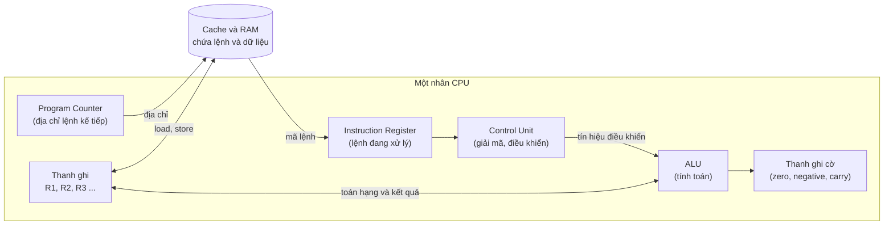
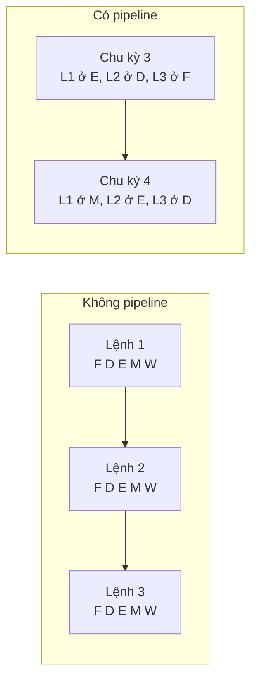
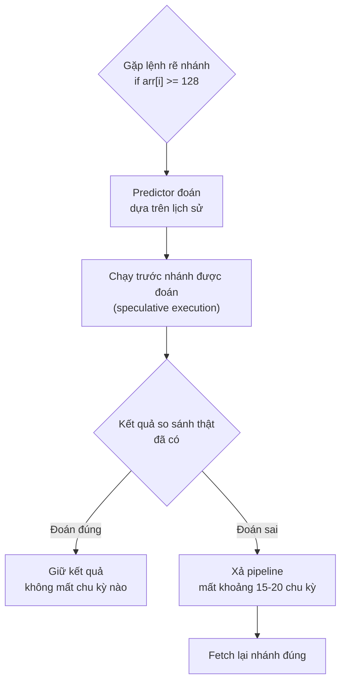
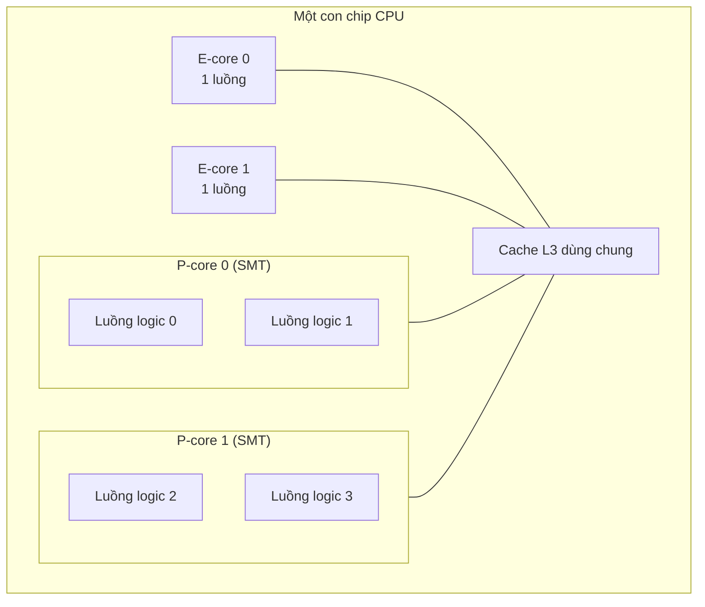

# CPU thực thi chương trình

**CPU** (Central Processing Unit — bộ xử lý trung tâm) là phần cứng **đọc từng lệnh máy trong RAM, hiểu lệnh đó muốn gì, rồi làm đúng việc đó** — cộng hai số, so sánh, nhảy sang lệnh khác, đọc hay ghi bộ nhớ. Toàn bộ "trí thông minh" của máy tính thực chất chỉ là một vòng lặp cực kỳ đơn giản: **lấy lệnh → giải mã → thực thi → ghi kết quả**, lặp lại hàng tỉ lần mỗi giây. Mọi thứ còn lại (pipeline, dự đoán rẽ nhánh, đa nhân...) đều là kỹ thuật để vòng lặp đó chạy **nhanh hơn**.

**Tương tự đơn giản:** CPU giống **một đầu bếp làm theo công thức**. **Bộ đếm chương trình** là ngón tay chỉ vào dòng công thức đang đọc. **Bộ điều khiển** là bộ não đọc hiểu dòng đó. **ALU** là đôi tay thái, trộn, nêm. **Thanh ghi** là vài cái bát đang cầm trên tay. Đầu bếp giỏi không chỉ làm nhanh tay (GHz cao), mà còn **làm gối đầu nhiều món cùng lúc** (pipeline), **đoán trước món tiếp theo để chuẩn bị** (branch prediction), và nhà hàng lớn thì **thuê nhiều đầu bếp** (multi-core).

---

:::note[Ghi nhớ nhanh]

- ⭐ **CPU lặp mãi chu trình fetch → decode → execute → write-back**, dùng bộ đếm chương trình (program counter) để biết lệnh tiếp theo nằm ở đâu.
- ⭐ **Hiệu năng ≠ chỉ GHz** — thời gian chạy phụ thuộc vào **số lệnh × số chu kỳ mỗi lệnh ÷ tần số**; một CPU 3 GHz có IPC cao có thể nhanh hơn CPU 4 GHz có IPC thấp.
- **Pipeline** cho nhiều lệnh chồng lên nhau ở các giai đoạn khác nhau; **hazard** (xung đột) và **dự đoán rẽ nhánh sai** làm pipeline phải chờ hoặc xả bỏ.
- **Out-of-order execution** cho phép CPU chạy lệnh sau trước nếu lệnh trước đang phải chờ dữ liệu, nhưng kết quả vẫn được "công bố" đúng thứ tự.
- **Đa nhân + SMT (hyper-threading)** giúp chạy nhiều luồng song song — nhưng chương trình phải **được viết để dùng nhiều luồng** (Node.js mặc định chỉ chạy JS trên một luồng).

:::

---

## Mục lục

- [Vì sao cần hiểu CPU thực thi chương trình?](#vì-sao-cần-hiểu-cpu-thực-thi-chương-trình)
- [1. Bên trong CPU có gì?](#1-bên-trong-cpu-có-gì)
- [2. Chu trình fetch, decode, execute, write-back](#2-chu-trình-fetch-decode-execute-write-back)
- [3. Xung nhịp, GHz và IPC](#3-xung-nhịp-ghz-và-ipc)
- [4. Pipeline và hazard](#4-pipeline-và-hazard)
- [5. Dự đoán rẽ nhánh (branch prediction)](#5-dự-đoán-rẽ-nhánh-branch-prediction)
- [6. Thực thi không theo thứ tự (out-of-order)](#6-thực-thi-không-theo-thứ-tự-out-of-order)
- [7. Đa nhân, hyper-threading và P-core E-core](#7-đa-nhân-hyper-threading-và-p-core-e-core)
- [8. GPU khác CPU thế nào?](#8-gpu-khác-cpu-thế-nào)
- [9. Liên hệ với Node.js: một luồng và worker_threads](#9-liên-hệ-với-nodejs-một-luồng-và-worker_threads)
- [10. Đọc thông số CPU khi mua máy hay thuê server](#10-đọc-thông-số-cpu-khi-mua-máy-hay-thuê-server)
- [Khi nào cần nhớ?](#khi-nào-cần-nhớ)
- [Lỗi thường gặp](#lỗi-thường-gặp)
- [Câu hỏi phỏng vấn](#câu-hỏi-phỏng-vấn)

---

## Vì sao cần hiểu CPU thực thi chương trình?

**Vấn đề:** Dev web thường coi CPU là "hộp đen": code chậm thì thuê máy mạnh hơn. Nhưng rồi gặp những chuyện khó giải thích: server 16 nhân mà app Node.js chỉ dùng hết **một nhân** rồi đứng im; một vòng lặp chạy nhanh gấp mấy lần chỉ vì **dữ liệu đã được sắp xếp**; máy 5 GHz đời cũ lại thua laptop 3.5 GHz đời mới; bảng giá cloud ghi "2 vCPU" nhưng thực ra chỉ là **một nhân vật lý** với hai luồng phần cứng.

**Giải pháp:** Hiểu mô hình bên trong CPU — chu trình lệnh, pipeline, dự đoán rẽ nhánh, đa nhân — giúp bạn **đoán được** đoạn code nào sẽ nặng, khi nào nên tách việc sang luồng khác, và đọc thông số phần cứng một cách tỉnh táo thay vì chỉ nhìn con số GHz.

:::tip[Dùng thực tế]

- **API Node.js bị nghẽn:** một request xử lý ảnh/mã hoá nặng làm mọi request khác phải chờ — cần biết vì sao và chuyển sang `worker_threads` hoặc chạy nhiều process (cluster, PM2).
- **Chọn instance cloud:** phân biệt vCPU, nhân vật lý, CPU "burstable" (t3, t4g...) để không trả tiền cho hiệu năng không có thật.
- **Tối ưu vòng lặp nóng (hot loop):** xử lý hàng triệu bản ghi trong ETL, render, game — biết vì sao nhánh khó đoán làm chậm.
- **Đọc profiler và `htop`:** hiểu "CPU 100%" của một nhân khác gì "load average 8" trên máy 8 nhân.

:::

---

## 1. Bên trong CPU có gì?

Ở mức khái niệm, một nhân CPU (core) gồm các khối sau:

| Thành phần | Tên tiếng Anh | Vai trò | Tương tự bếp |
| --- | --- | --- | --- |
| **Bộ điều khiển** | Control Unit (CU) | Giải mã lệnh, phát tín hiệu điều khiển cho các khối khác | Bộ não đọc công thức |
| **Khối số học – logic** | ALU (Arithmetic Logic Unit) | Cộng, trừ, AND, OR, so sánh, dịch bit | Đôi tay làm món |
| **Khối dấu phẩy động** | FPU (Floating Point Unit) | Tính toán số thực (`number` của JS là số thực 64-bit) | Dụng cụ chuyên dụng |
| **Thanh ghi đa dụng** | General-purpose registers | Ô nhớ siêu nhanh trong CPU chứa toán hạng đang dùng | Bát đang cầm trên tay |
| **Bộ đếm chương trình** | Program Counter (PC), trên x86 gọi là IP/RIP | Giữ **địa chỉ** của lệnh tiếp theo | Ngón tay chỉ dòng công thức |
| **Thanh ghi lệnh** | Instruction Register (IR) | Giữ lệnh vừa lấy về để giải mã | Dòng công thức đang đọc |
| **Thanh ghi cờ** | Flags / Status register | Ghi kết quả so sánh: bằng 0, âm, tràn số... | Ghi chú "nếm thấy mặn" |
| **Cache L1/L2** | Cache | Bản sao dữ liệu/lệnh hay dùng, gần CPU (xem bài 6) | Mặt bàn bếp |



Điểm quan trọng: **lệnh và dữ liệu cùng nằm trong bộ nhớ** (kiến trúc von Neumann, xem bài 1.1). CPU không "biết" byte nào là lệnh, byte nào là dữ liệu — nó chỉ lấy byte ở địa chỉ mà PC đang trỏ tới và coi đó là lệnh.

---

## 2. Chu trình fetch, decode, execute, write-back

Mỗi lệnh máy đi qua các bước:

| Bước | Tên | Việc xảy ra |
| --- | --- | --- |
| 1 | **Fetch** (lấy lệnh) | Đọc lệnh tại địa chỉ trong PC vào IR, rồi tăng PC sang lệnh kế tiếp |
| 2 | **Decode** (giải mã) | CU phân tích lệnh: loại phép toán gì, toán hạng ở thanh ghi nào hay ô nhớ nào |
| 3 | **Execute** (thực thi) | ALU tính toán, hoặc tính địa chỉ bộ nhớ, hoặc quyết định có nhảy hay không |
| 4 | **Memory** (truy cập bộ nhớ, nếu cần) | Lệnh load/store đọc hoặc ghi RAM (qua cache) |
| 5 | **Write-back** (ghi kết quả) | Ghi kết quả vào thanh ghi đích, cập nhật cờ |


### Minh hoạ với một đoạn lệnh nhỏ

Giả sử ta có đoạn JS:

```js
// x nằm trong RAM, ta muốn tính y = x + 5
let y = x + 5;
```

Trình biên dịch JIT của V8 có thể sinh ra mã máy tương đương với đoạn assembly giả lập (pseudo-assembly) sau. Mỗi lệnh dài 4 byte, `x` ở địa chỉ `0x2000`, `y` ở `0x2004`:

```asm
; Địa chỉ  Lệnh
0x100:  LOAD  R1, [0x2000]   ; R1 = giá trị trong RAM tại địa chỉ của x
0x104:  ADD   R1, R1, #5     ; R1 = R1 + 5
0x108:  STORE R1, [0x2004]   ; ghi R1 vào RAM tại địa chỉ của y
```

Giả sử ban đầu `PC = 0x100` và RAM tại `0x2000` đang chứa số `10`:

| Chu trình | PC lúc fetch | Fetch | Decode | Execute | Memory | Write-back | Sau đó |
| --- | --- | --- | --- | --- | --- | --- | --- |
| Lệnh 1 | `0x100` | Lấy `LOAD R1, [0x2000]`, PC thành `0x104` | "Đọc bộ nhớ vào R1, địa chỉ 0x2000" | Tính địa chỉ = `0x2000` | Đọc được `10` | `R1 = 10` | R1 = 10 |
| Lệnh 2 | `0x104` | Lấy `ADD`, PC thành `0x108` | "Cộng R1 với hằng số 5" | ALU: `10 + 5 = 15` | (không cần) | `R1 = 15` | R1 = 15 |
| Lệnh 3 | `0x108` | Lấy `STORE`, PC thành `0x10C` | "Ghi R1 vào địa chỉ 0x2004" | Tính địa chỉ = `0x2004` | Ghi `15` vào RAM | (không có) | `y = 15` |

Một **lệnh nhảy** (jump/branch) chỉ đơn giản là lệnh **ghi giá trị mới vào PC**. Vòng `for`, `if`, gọi hàm, `return` — tất cả cuối cùng đều là thay đổi PC:

```asm
0x200:  CMP  R1, #0          ; so sánh R1 với 0, cập nhật cờ
0x204:  JEQ  0x300           ; nếu bằng 0 thì PC = 0x300 (nhảy), không thì đi tiếp 0x208
0x208:  ...                  ; nhánh "else"
```

---

## 3. Xung nhịp, GHz và IPC

CPU hoạt động theo **xung nhịp** (clock) — một tín hiệu dao động đều đặn, mỗi "tích tắc" là một **chu kỳ** (cycle). Các mạch bên trong chuyển trạng thái theo nhịp này.

- **3 GHz** = 3 tỉ chu kỳ mỗi giây → mỗi chu kỳ khoảng **0,33 ns**.
- Trong 0,33 ns, ánh sáng chỉ đi được khoảng 10 cm — đây là một lý do tần số khó tăng mãi.

Sau khoảng năm 2005, tần số CPU gần như "dừng" ở mức khoảng 3–5 GHz vì **nhiệt và điện năng** tăng quá nhanh khi tăng xung (hiện tượng gọi là "power wall"). Từ đó, hiệu năng tăng chủ yếu nhờ **làm nhiều việc hơn mỗi chu kỳ** và **thêm nhân**.

**IPC** (Instructions Per Cycle — số lệnh hoàn thành mỗi chu kỳ) là thước đo "một chu kỳ làm được bao nhiêu việc". Công thức hiệu năng cơ bản:

```text
Thời gian chạy = Số lệnh / (IPC × Tần số)
```

| CPU giả định | Tần số | IPC trung bình | Lệnh mỗi giây (xấp xỉ) |
| --- | --- | --- | --- |
| A — đời cũ | 4,5 GHz | 1,0 | 4,5 tỉ |
| B — đời mới | 3,5 GHz | 2,0 | 7,0 tỉ |

CPU B chậm xung hơn nhưng **nhanh hơn khoảng 55%**. Nhân hiện đại về lý thuyết có thể hoàn thành vài lệnh mỗi chu kỳ (rộng khoảng 4–8 lệnh), nhưng thực tế IPC còn phụ thuộc rất nhiều vào **code và dữ liệu**: cache miss, dự đoán rẽ nhánh sai đều kéo IPC xuống.

:::warning[Turbo và xung "tối đa"]
Con số như "lên tới 5,0 GHz" là **xung turbo** — thường chỉ đạt được trên một vài nhân, trong thời gian ngắn, khi còn dư nhiệt. Chạy tải nặng trên tất cả các nhân, xung thực tế thường thấp hơn.
:::

---

## 4. Pipeline và hazard

Nếu mỗi lệnh phải đi hết 5 bước rồi lệnh sau mới bắt đầu, phần lớn mạch trong CPU sẽ ngồi chơi. **Pipeline** (đường ống) cho phép **lệnh sau bắt đầu fetch khi lệnh trước đang decode** — giống dây chuyền giặt – sấy – gấp quần áo.

| Chu kỳ | 1 | 2 | 3 | 4 | 5 | 6 | 7 |
| --- | --- | --- | --- | --- | --- | --- | --- |
| Lệnh 1 | F | D | E | M | W | | |
| Lệnh 2 | | F | D | E | M | W | |
| Lệnh 3 | | | F | D | E | M | W |

Mỗi lệnh vẫn mất 5 chu kỳ (**độ trễ — latency** không đổi), nhưng **cứ mỗi chu kỳ lại có một lệnh hoàn thành** (**thông lượng — throughput** tăng lên gần 5 lần). CPU thực tế có pipeline dài khoảng 14–20 tầng và nhiều pipeline chạy song song (superscalar).



### Hazard — khi dây chuyền bị kẹt

| Loại hazard | Nguyên nhân | Ví dụ | Cách CPU xử lý |
| --- | --- | --- | --- |
| **Data hazard** (dữ liệu) | Lệnh sau cần kết quả lệnh trước chưa xong | `ADD R1, R1, #5` ngay sau `LOAD R1` | **Forwarding** (chuyển thẳng kết quả), hoặc **stall** (chèn chu kỳ chờ) |
| **Control hazard** (điều khiển) | Chưa biết lệnh nhảy có nhảy hay không, nên chưa biết fetch lệnh nào | `if`, vòng lặp | **Dự đoán rẽ nhánh** (mục 5) |
| **Structural hazard** (tài nguyên) | Hai lệnh cùng cần một khối phần cứng | Hai lệnh cùng cần cổng truy cập bộ nhớ | Nhân đôi tài nguyên, tách cache lệnh/dữ liệu |

```js
// Data hazard ở mức tư duy: phép tính sau phụ thuộc phép tính trước
let a = arr[i];      // LOAD — nếu cache miss, phải chờ hàng trăm chu kỳ
let b = a * 2;       // phải đợi a
let c = b + 1;       // phải đợi b — chuỗi phụ thuộc, khó chạy song song

// Ngược lại, các phép tính độc lập có thể chồng lên nhau trong pipeline
let p = x * 2;
let q = y * 3;       // không phụ thuộc p, CPU có thể làm cùng lúc
```

---

## 5. Dự đoán rẽ nhánh (branch prediction)

Pipeline dài 15–20 tầng nghĩa là khi gặp `if`, CPU **phải đoán** nhánh nào sẽ chạy và fetch trước lệnh của nhánh đó — nếu đợi biết chắc thì pipeline sẽ trống rỗng. **Branch predictor** ghi nhớ lịch sử các lần rẽ nhánh trước để đoán.

- **Đoán đúng:** gần như không tốn gì.
- **Đoán sai (misprediction):** phải **xả bỏ** (flush) các lệnh đã làm dở và fetch lại — tốn khoảng **15–20 chu kỳ** trên CPU hiện đại.



### Ví dụ kinh điển: mảng đã sắp xếp chạy nhanh hơn

Đây là một câu hỏi rất nổi tiếng trên Stack Overflow ("Why is processing a sorted array faster than processing an unsorted array?"): với C++, vòng lặp trên mảng đã sắp xếp nhanh hơn **khoảng 6 lần**. Phiên bản JS:

```js
const N = 1 << 20; // khoảng 1 triệu phần tử
const random = Array.from({ length: N }, () => Math.floor(Math.random() * 256));
const sorted = [...random].sort((a, b) => a - b); // tạo bản sao đã sắp xếp, không sửa mảng gốc

function sumBig(arr) {
  let sum = 0;
  for (let round = 0; round < 50; round++) {
    for (let i = 0; i < arr.length; i++) {
      // Nhánh này: với mảng ngẫu nhiên thì đúng/sai lộn xộn 50-50 -> khó đoán
      // Với mảng đã sắp xếp: sai sai sai ... rồi đúng đúng đúng -> rất dễ đoán
      if (arr[i] >= 128) sum += arr[i];
    }
  }
  return sum;
}

for (const [name, arr] of [['ngẫu nhiên', random], ['đã sắp xếp', sorted]]) {
  const t0 = performance.now();
  sumBig(arr);
  console.log(name, (performance.now() - t0).toFixed(0), 'ms');
}
```

- **Mảng ngẫu nhiên:** predictor đoán sai khoảng một nửa số lần → mỗi lần sai mất hàng chục chu kỳ.
- **Mảng đã sắp xếp:** nửa đầu toàn "không", nửa sau toàn "có" → predictor gần như luôn đúng.

:::info[Kết quả trong JS có thể khác]
Trình biên dịch (C++ với `-O3`, hay JIT của V8) đôi khi biến `if` này thành lệnh **không rẽ nhánh** (branchless, ví dụ lệnh `cmov` trên x86). Khi đó chênh lệch biến mất. Vì vậy hãy đo trên máy và phiên bản Node của bạn — nhưng **nguyên lý** thì không đổi: nhánh khó đoán trong vòng lặp nóng là chi phí thật.
:::

Mẹo viết code thân thiện với predictor: gom dữ liệu cùng loại xử lý chung, tránh `if` phụ thuộc dữ liệu ngẫu nhiên trong vòng lặp nóng, hoặc dùng phép toán thay rẽ nhánh khi hợp lý.

---

## 6. Thực thi không theo thứ tự (out-of-order)

Khi một lệnh `LOAD` bị cache miss, nó có thể phải chờ RAM khoảng **100 ns — tức vài trăm chu kỳ**. Nếu CPU chờ đúng thứ tự, mọi lệnh phía sau cũng đứng im. **Out-of-order execution** (OoO) giải quyết bằng cách:

1. Đọc trước một "cửa sổ" nhiều lệnh (hàng trăm lệnh trên nhân hiện đại).
2. Lệnh nào **đã đủ dữ liệu đầu vào** thì cho chạy trước, bất kể thứ tự trong chương trình.
3. Dùng **reorder buffer** để **công bố kết quả (retire) đúng thứ tự gốc** — chương trình nhìn từ ngoài vẫn như chạy tuần tự.

| Thứ tự trong code | Phụ thuộc | Thứ tự CPU có thể chạy |
| --- | --- | --- |
| 1. `a = arr[i]` (cache miss) | — | Bắt đầu sớm, chờ RAM |
| 2. `b = a + 1` | cần `a` | Chờ lệnh 1 |
| 3. `c = x * y` | độc lập | **Chạy ngay** trong lúc chờ |
| 4. `d = c - 2` | cần `c` | Chạy ngay sau lệnh 3 |

Kỹ thuật đi kèm là **register renaming** (đổi tên thanh ghi) để các lệnh không "giành" nhau một thanh ghi kiến trúc, và **speculative execution** (thực thi suy đoán) theo dự đoán rẽ nhánh. Lỗ hổng bảo mật **Spectre và Meltdown** (công bố năm 2018) chính là khai thác dấu vết mà thực thi suy đoán để lại trong cache.

:::note
OoO là lý do vì sao trong lập trình đa luồng, **thứ tự ghi bộ nhớ mà luồng khác nhìn thấy** có thể khác thứ tự trong code — đó là chuyện của **memory model** và các cơ chế như `Atomics` trong JS hay `volatile`/`synchronized` trong Java (xem bài 2.3 Đồng thời và đồng bộ).
:::

---

## 7. Đa nhân, hyper-threading và P-core E-core

### Đa nhân (multi-core)

Khi không tăng xung được nữa, nhà sản xuất đặt **nhiều nhân CPU hoàn chỉnh** lên một con chip. Mỗi nhân có pipeline, thanh ghi, L1/L2 riêng; thường dùng chung L3.

### Hyper-threading / SMT

**SMT** (Simultaneous Multithreading), Intel gọi là **Hyper-Threading** (ra mắt năm 2002), cho **một nhân vật lý chạy hai luồng phần cứng**: nhân có hai bộ thanh ghi và PC, nhưng **dùng chung** ALU, cache, pipeline. Khi luồng A đang chờ RAM, luồng B tận dụng các khối đang rảnh.

- Hệ điều hành thấy 1 nhân SMT là **2 CPU logic**.
- Lợi ích thường chỉ khoảng **10–30%**, tuỳ khối lượng công việc — **không phải gấp đôi**. Với tải tính toán thuần đã dùng hết ALU, lợi ích có thể gần bằng 0.

### P-core và E-core

Kiến trúc lai (hybrid) có hai loại nhân trên cùng chip:

| Loại | Đặc điểm | Dùng cho |
| --- | --- | --- |
| **P-core** (Performance) | To, nhanh, IPC cao, tốn điện | Tác vụ nặng, cần phản hồi nhanh |
| **E-core** (Efficiency) | Nhỏ, tiết kiệm điện, chậm hơn | Tác vụ nền, đa luồng số lượng lớn |

Ý tưởng bắt nguồn từ ARM **big.LITTLE** trên điện thoại (khoảng năm 2011), sau đó Apple M1 (2020) và Intel thế hệ 12 Alder Lake (2021) đưa lên máy tính. Hệ điều hành cần bộ lập lịch "hiểu" hai loại nhân để đặt đúng việc vào đúng nhân.



| Khái niệm | Ví dụ "8 nhân 16 luồng" | Ý nghĩa |
| --- | --- | --- |
| Nhân vật lý (core) | 8 | Số bộ thực thi độc lập thật sự |
| Luồng phần cứng (thread) | 16 | Số CPU logic OS nhìn thấy (nhờ SMT) |
| Luồng phần mềm | hàng nghìn | Do OS lập lịch lên 16 CPU logic |

---

## 8. GPU khác CPU thế nào?

| Tiêu chí | CPU | GPU |
| --- | --- | --- |
| Số nhân | Vài đến vài chục nhân "to" | Hàng nghìn nhân "nhỏ" (ví dụ RTX 4090 có 16.384 CUDA core) |
| Tối ưu cho | **Độ trễ thấp** cho từng luồng | **Thông lượng cao** cho hàng nghìn luồng giống nhau |
| Điều khiển | Dự đoán rẽ nhánh, OoO phức tạp | Đơn giản, nhiều luồng chạy **cùng một lệnh** trên dữ liệu khác nhau (SIMT) |
| Rẽ nhánh | Xử lý tốt | Kém — các luồng trong nhóm rẽ khác nhau phải chạy lần lượt |
| Phù hợp | Logic nghiệp vụ, web server, OS, DB | Đồ hoạ, ma trận, huấn luyện/chạy mô hình AI, xử lý ảnh/video |

**Tương tự:** CPU như vài **giáo sư** giải được mọi bài toán khó; GPU như **hàng nghìn học sinh** chỉ giỏi phép nhân, nhưng cùng lúc nhân được hàng nghìn cặp số. Web dev gặp GPU khi dùng WebGL/WebGPU, CSS `transform` được tăng tốc phần cứng, hay gọi API mô hình AI chạy trên GPU.

---

## 9. Liên hệ với Node.js: một luồng và worker_threads

Code JS của bạn trong Node.js chạy trên **một luồng chính** (main thread) với event loop. Một luồng chỉ chạy được trên **một CPU logic** tại một thời điểm. Hệ quả:

- I/O (mạng, file) không chặn luồng chính vì được giao cho OS/libuv (xem bài 7 Ngắt).
- Nhưng **tính toán nặng** (hash mật khẩu tự viết, nén, xử lý ảnh, vòng lặp lớn) **chặn toàn bộ event loop** — mọi request khác phải chờ.

```js
// cpu-heavy.js — ví dụ chặn event loop
import http from 'node:http';

function fib(n) {
  return n < 2 ? n : fib(n - 1) + fib(n - 2); // đệ quy tốn CPU
}

http.createServer((req, res) => {
  if (req.url === '/slow') {
    res.end(String(fib(42))); // mất vài giây, trong lúc đó server "đơ" với mọi request
    return;
  }
  res.end('ok'); // request này cũng phải chờ /slow xong
}).listen(3000);
```

Giải pháp: đẩy việc nặng sang **worker thread** — một luồng hệ điều hành riêng, có V8 isolate và event loop riêng, nên chạy được **song song trên nhân khác**:

```js
// main.js
import { Worker } from 'node:worker_threads';
import os from 'node:os';

console.log('Số CPU logic khả dụng:', os.availableParallelism()); // Node 18.14+

function runFib(n) {
  return new Promise((resolve, reject) => {
    const worker = new Worker(new URL('./fib-worker.js', import.meta.url), { workerData: n });
    worker.once('message', resolve);   // nhận kết quả từ worker
    worker.once('error', reject);      // lỗi trong worker
  });
}

// Chạy 4 phép tính song song trên 4 nhân thay vì tuần tự trên 1 nhân
const results = await Promise.all([40, 40, 40, 40].map(runFib));
console.log(results);
```

```js
// fib-worker.js
import { parentPort, workerData } from 'node:worker_threads';

const fib = (n) => (n < 2 ? n : fib(n - 1) + fib(n - 2));
parentPort.postMessage(fib(workerData)); // gửi kết quả về luồng chính
```

| Cách dùng nhiều nhân | Đơn vị | Chia sẻ bộ nhớ | Dùng khi |
| --- | --- | --- | --- |
| `worker_threads` | Luồng trong cùng process | Có thể qua `SharedArrayBuffer` | Tính toán nặng trong một service |
| `cluster` / PM2 cluster mode | Nhiều process | Không | Scale HTTP server ra mọi nhân |
| Nhiều container/pod | Nhiều process trên nhiều máy | Không | Scale ngang trên hạ tầng |

Thêm worker **nhiều hơn số CPU logic** thường không nhanh hơn với tải tính toán thuần — các luồng chỉ thay nhau chạy (context switch, xem bài 2.1 Tiến trình và luồng). Java thì khác: JVM có đa luồng thật từ đầu, một ứng dụng Spring Boot dùng thread pool chạy được trên mọi nhân.

---

## 10. Đọc thông số CPU khi mua máy hay thuê server

| Thông số | Đọc thế nào | Lưu ý |
| --- | --- | --- |
| **Số nhân / số luồng** | "8C/16T" = 8 nhân vật lý, 16 luồng | Với hybrid: ghi rõ bao nhiêu P-core, bao nhiêu E-core |
| **Xung cơ bản / turbo** | Base 3,0 GHz, turbo 5,0 GHz | Turbo chỉ ngắn hạn, ít nhân |
| **Thế hệ / kiến trúc** | Zen 4, Raptor Lake, Apple M3, Graviton 3... | Đời mới thường IPC cao hơn rõ rệt — so sánh GHz giữa các đời là vô nghĩa |
| **Cache L3** | 16 MB, 32 MB... | Ảnh hưởng nhiều tới DB, game, biên dịch (xem bài 6) |
| **TDP / công suất** | 15 W (laptop mỏng) đến 125 W+ (desktop) | Laptop mỏng giới hạn nhiệt → không giữ được xung cao lâu |
| **vCPU (cloud)** | 1 vCPU | Trên đa số instance x86 của AWS, 1 vCPU = **1 luồng SMT** (nửa nhân vật lý); trên AWS Graviton, 1 vCPU = 1 nhân vật lý |
| **Burstable** | AWS t3/t4g, GCP e2-micro... | Chỉ được dùng CPU cao trong thời gian giới hạn theo "credit", hết credit thì bị bóp |

Cách xem trên máy:

```bash
# Linux: số nhân, luồng, model, cache
lscpu
nproc                       # số CPU logic khả dụng

# macOS
sysctl -n machdep.cpu.brand_string
sysctl -n hw.physicalcpu hw.logicalcpu
```

```js
// Trong Node.js hoặc trình duyệt
import os from 'node:os';
console.log(os.cpus()[0].model, os.cpus().length); // model và số CPU logic
// Trình duyệt: navigator.hardwareConcurrency
```

---

## Khi nào cần nhớ?

- **Cần nghĩ tới CPU khi:**
  - Một endpoint làm CPU một nhân chạm 100% trong khi các nhân khác rảnh → tách sang worker hoặc chạy nhiều process
  - Vòng lặp xử lý hàng triệu phần tử chậm bất thường → nghĩ tới rẽ nhánh khó đoán, chuỗi phụ thuộc dữ liệu, cache (bài 6)
  - Chọn cấu hình server: đếm nhân vật lý thật, kiểm tra loại instance burstable
  - Benchmark: phải warm-up (JIT, turbo, cache) và đo nhiều lần
- **Không cần bận tâm khi:**
  - Code chủ yếu chờ I/O (gọi DB, gọi API) — CPU gần như rảnh, nút thắt nằm ở chỗ khác
  - Tối ưu vi mô (micro-optimization) mà chưa có số liệu profiler
- **Best practice:**
  - Profile trước (`node --cpu-prof`, Chrome DevTools, `perf`), tối ưu sau
  - Số worker cho việc tính toán ≈ `os.availableParallelism()` (hoặc trừ 1 cho luồng chính)
  - So sánh CPU bằng benchmark thực tế (Geekbench, SPEC, hoặc chính workload của bạn), không bằng GHz

---

## Lỗi thường gặp

### Lỗi 1: Nghĩ "GHz cao hơn = nhanh hơn"

GHz chỉ là một nửa công thức. IPC, cache, số nhân, và việc CPU có giữ được xung dưới tải hay không đều quan trọng. Một chip đời mới 3,5 GHz có thể nhanh hơn chip đời cũ 4,5 GHz đáng kể.

### Lỗi 2: Nghĩ hyper-threading nhân đôi hiệu năng

"8 nhân 16 luồng" không bằng 16 nhân. Hai luồng SMT dùng chung ALU và cache của một nhân; lợi ích thường khoảng 10–30%. Tương tự, "4 vCPU" trên cloud x86 thường chỉ là **2 nhân vật lý**.

### Lỗi 3: Nghĩ `async/await` làm code chạy song song trên nhiều nhân

`async` chỉ giúp **không chờ I/O**; code JS vẫn chạy trên một luồng. Bọc một vòng lặp tính toán nặng trong `async function` **không** làm nó chạy trên nhân khác — muốn vậy phải dùng `worker_threads` hoặc nhiều process.

### Lỗi 4: Tạo hàng trăm worker cho việc tính toán

Số việc chạy **thật sự song song** bị giới hạn bởi số CPU logic. Thêm worker vượt quá con số đó chỉ tăng chi phí bộ nhớ và chuyển ngữ cảnh.

### Lỗi 5: Nghĩ CPU chạy lệnh đúng từng dòng như trong code

Trình biên dịch sắp xếp lại lệnh, CPU chạy out-of-order và suy đoán. Trong một luồng, kết quả luôn như tuần tự; nhưng giữa nhiều luồng chia sẻ bộ nhớ, thứ tự quan sát được có thể khác — cần primitive đồng bộ đúng cách.

---

## Câu hỏi phỏng vấn

Những câu thường gặp về chủ đề này. Tự trả lời trước, rồi bấm **Xem đáp án** để đối chiếu.

**1. Mô tả chu trình fetch – decode – execute của CPU. Program counter có vai trò gì?**

<details className="qa">
<summary>Xem đáp án</summary>

- **Fetch:** đọc lệnh tại địa chỉ mà **program counter (PC)** trỏ tới, rồi tăng PC sang lệnh kế tiếp.
- **Decode:** control unit giải mã lệnh — phép toán gì, toán hạng ở đâu.
- **Execute:** ALU tính toán hoặc tính địa chỉ; lệnh load/store truy cập bộ nhớ.
- **Write-back:** ghi kết quả vào thanh ghi đích.

PC quyết định "lệnh nào chạy tiếp". Lệnh nhảy, gọi hàm, `return` thực chất là ghi giá trị mới vào PC.

</details>

**2. Vì sao CPU 3 GHz có thể nhanh hơn CPU 4 GHz?**

<details className="qa">
<summary>Xem đáp án</summary>

Vì thời gian chạy = số lệnh / (IPC × tần số). CPU đời mới thường có **IPC cao hơn** (pipeline rộng hơn, dự đoán rẽ nhánh tốt hơn, cửa sổ out-of-order lớn hơn, cache lớn hơn). Ngoài ra còn tập lệnh mới (SIMD), số nhân, và khả năng giữ xung dưới tải. GHz chỉ so sánh có ý nghĩa giữa hai CPU **cùng kiến trúc**.

</details>

**3. Pipeline là gì? Kể các loại hazard.**

<details className="qa">
<summary>Xem đáp án</summary>

Pipeline chia việc xử lý lệnh thành nhiều giai đoạn và cho nhiều lệnh **chồng lên nhau** ở các giai đoạn khác nhau — độ trễ mỗi lệnh không đổi nhưng thông lượng tăng.

- **Data hazard:** lệnh sau cần kết quả của lệnh trước → forwarding hoặc stall.
- **Control hazard:** chưa biết nhánh nào → dự đoán rẽ nhánh, đoán sai thì xả pipeline.
- **Structural hazard:** hai lệnh tranh cùng một khối phần cứng → nhân đôi tài nguyên.

</details>

**4. Vì sao xử lý mảng đã sắp xếp có thể nhanh hơn mảng chưa sắp xếp, dù cùng số phần tử?**

<details className="qa">
<summary>Xem đáp án</summary>

Do **branch prediction**. Với điều kiện như `if (arr[i] >= 128)`, mảng ngẫu nhiên làm kết quả đúng/sai lộn xộn → predictor đoán sai khoảng 50% → mỗi lần sai mất khoảng 15–20 chu kỳ để xả pipeline. Mảng đã sắp xếp tạo chuỗi "sai...sai, đúng...đúng" → predictor gần như luôn đúng. Nếu trình biên dịch sinh mã không rẽ nhánh (`cmov`) thì chênh lệch biến mất.

</details>

**5. Hyper-threading là gì? "8 nhân 16 luồng" có nghĩa là gì?**

<details className="qa">
<summary>Xem đáp án</summary>

Hyper-threading (SMT) cho một nhân vật lý chạy hai luồng phần cứng: mỗi luồng có thanh ghi và PC riêng nhưng dùng chung ALU, cache, pipeline. Khi một luồng chờ bộ nhớ, luồng kia dùng tài nguyên rảnh. "8 nhân 16 luồng" = 8 nhân vật lý, OS thấy 16 CPU logic. Lợi ích thường khoảng 10–30%, không gấp đôi.

</details>

**6. Node.js là single-thread, vậy làm sao tận dụng server nhiều nhân?**

<details className="qa">
<summary>Xem đáp án</summary>

Code JS chạy trên một luồng chính, nhưng:

- I/O được libuv/OS xử lý bất đồng bộ (libuv còn có thread pool cho file, DNS, crypto).
- Việc tính toán nặng: dùng **`worker_threads`** để chạy song song trên nhân khác.
- Scale HTTP: chạy nhiều process bằng **`cluster`**, PM2 cluster mode, hoặc nhiều container sau load balancer.

Số worker tính toán hợp lý ≈ số CPU logic (`os.availableParallelism()`).

</details>
