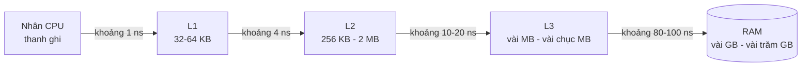
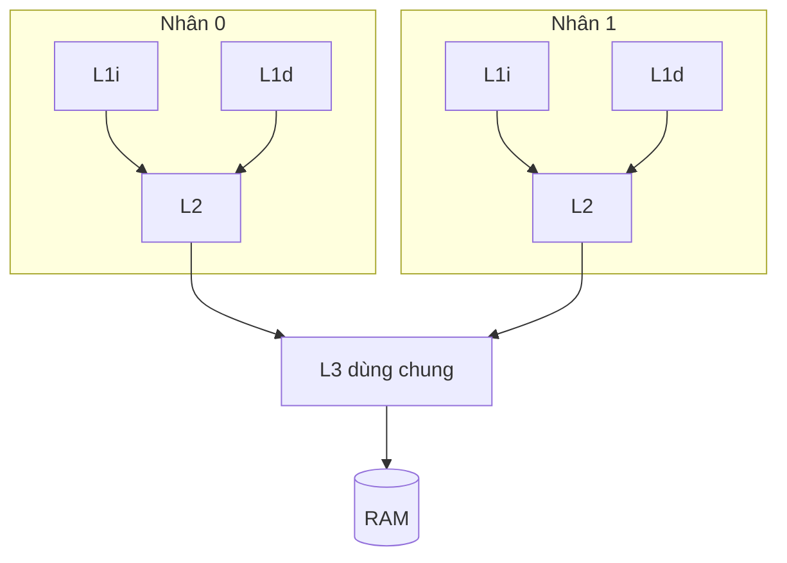
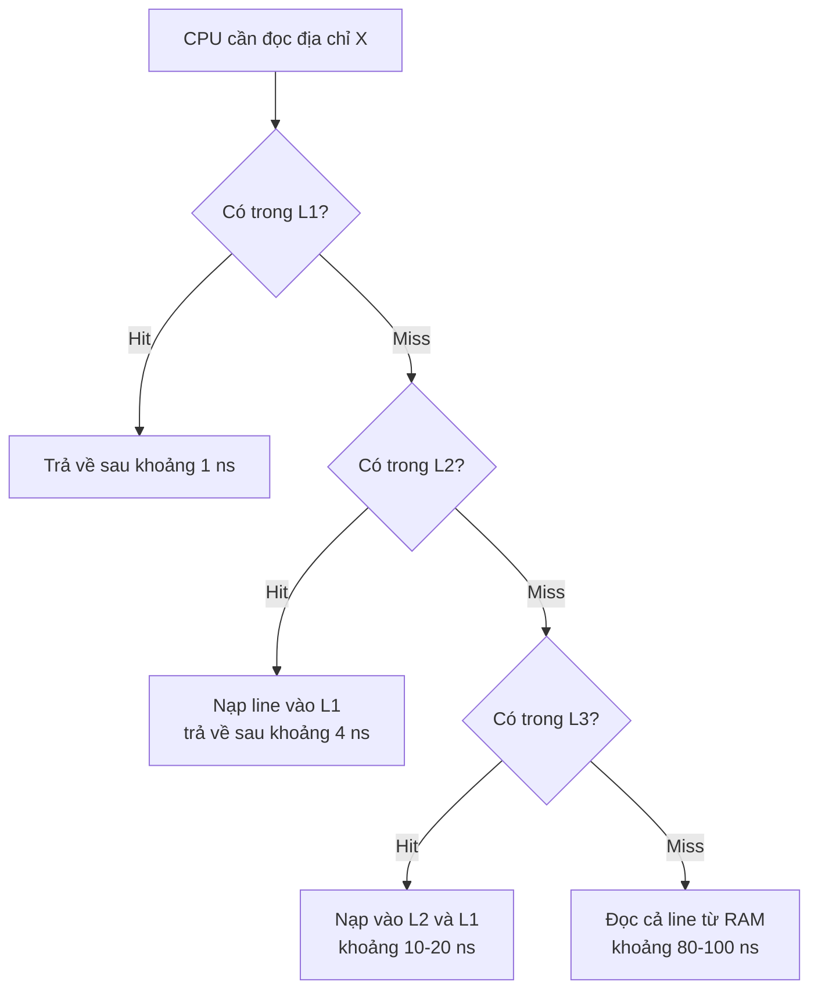
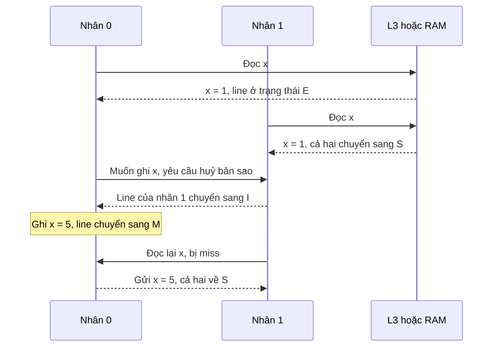
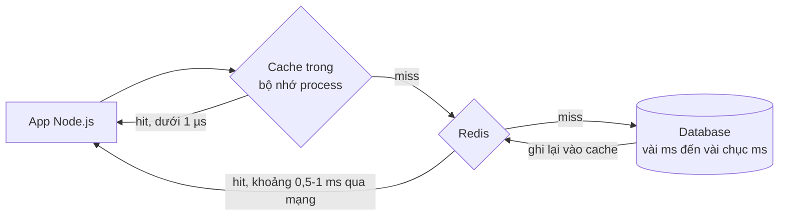

# CPU cache

**CPU cache** (bộ nhớ đệm của CPU) là vùng nhớ **nhỏ nhưng cực nhanh** nằm ngay trên chip CPU, giữ **bản sao** của những phần dữ liệu và lệnh trong RAM mà CPU vừa dùng hoặc sắp dùng. Cache tồn tại vì một sự thật phũ phàng: CPU xử lý một phép cộng chỉ mất khoảng **0,3 ns**, còn đọc một giá trị từ RAM mất khoảng **80–100 ns** — nếu lần nào cũng phải chờ RAM, CPU sẽ ngồi chơi tới hơn 99% thời gian.

**Tương tự đơn giản:** Đầu bếp (CPU) nấu ăn. **Tủ lạnh** (RAM) ở góc bếp, mỗi lần ra lấy mất vài chục giây. Vì vậy đầu bếp bày sẵn nguyên liệu hay dùng lên **mặt bàn ngay trước mặt** (L1), có thêm **kệ cạnh bàn** (L2) và **tủ mát chung của cả bếp** (L3). Khi ra tủ lạnh, đầu bếp không lấy **một quả trứng**, mà lấy **cả khay trứng** (cache line) — vì kiểu gì lát nữa cũng cần quả bên cạnh.

---

:::note[Ghi nhớ nhanh]

- ⭐ **Cache hoạt động nhờ tính cục bộ (locality)** — dữ liệu vừa dùng sẽ sớm được dùng lại (temporal), dữ liệu nằm cạnh cũng sắp được dùng (spatial).
- ⭐ **Đơn vị trao đổi là cache line, thường 64 byte** — đọc 1 byte là kéo cả 64 byte về; duyệt bộ nhớ **tuần tự** nhanh hơn rất nhiều so với nhảy lung tung.
- **Phân cấp L1 (riêng, nhỏ nhất, nhanh nhất) → L2 → L3 (dùng chung, lớn nhất)** rồi mới đến RAM.
- **Mảng liên tục thân thiện với cache hơn linked list** — dù độ phức tạp Big-O như nhau.
- **Nhiều nhân cần giữ cache nhất quán (coherence, giao thức MESI)** — hai luồng ghi vào hai biến khác nhau nhưng chung một cache line sẽ gây **false sharing**.

:::

---

## Mục lục

- [Vì sao cần CPU cache?](#vì-sao-cần-cpu-cache)
- [1. Khoảng cách tốc độ giữa CPU và RAM](#1-khoảng-cách-tốc-độ-giữa-cpu-và-ram)
- [2. Các cấp cache L1, L2, L3](#2-các-cấp-cache-l1-l2-l3)
- [3. Cache line 64 byte](#3-cache-line-64-byte)
- [4. Tính cục bộ, cache hit và cache miss](#4-tính-cục-bộ-cache-hit-và-cache-miss)
- [5. Duyệt mảng 2 chiều theo hàng và theo cột](#5-duyệt-mảng-2-chiều-theo-hàng-và-theo-cột)
- [6. Mảng liên tục và linked list](#6-mảng-liên-tục-và-linked-list)
- [7. Chính sách thay thế và chính sách ghi](#7-chính-sách-thay-thế-và-chính-sách-ghi)
- [8. Cache coherence và MESI](#8-cache-coherence-và-mesi)
- [9. False sharing](#9-false-sharing)
- [10. Liên hệ với cache tầng ứng dụng như Redis](#10-liên-hệ-với-cache-tầng-ứng-dụng-như-redis)
- [Khi nào cần nhớ?](#khi-nào-cần-nhớ)
- [Lỗi thường gặp](#lỗi-thường-gặp)
- [Câu hỏi phỏng vấn](#câu-hỏi-phỏng-vấn)

---

## Vì sao cần CPU cache?

**Vấn đề:** Tốc độ CPU tăng nhanh hơn tốc độ RAM rất nhiều qua các thập kỷ (hiện tượng gọi là **memory wall** — bức tường bộ nhớ). Một nhân CPU hiện đại có thể thực hiện vài lệnh mỗi chu kỳ ở 3–5 GHz, nhưng một lần đọc RAM tốn khoảng **300–400 chu kỳ**. Không có gì đệm ở giữa, mọi pipeline, out-of-order, branch prediction (xem bài 5) đều vô nghĩa vì CPU luôn phải chờ dữ liệu.

**Giải pháp:** Đặt nhiều tầng bộ nhớ **SRAM** nhỏ, nhanh, đắt ngay cạnh nhân CPU. Phần cứng tự động giữ lại những gì vừa dùng và **nạp trước** (prefetch) những gì có vẻ sắp dùng. Với chương trình "ngoan" (truy cập có tính cục bộ), **phần lớn lượt đọc được phục vụ từ cache** — thường hơn 90–95% với dữ liệu có tính cục bộ tốt.

:::tip[Dùng thực tế]

- **Xử lý dữ liệu lớn trong Node/Java:** chọn `Float64Array`/mảng nguyên thuỷ thay cho mảng object, duyệt đúng chiều — có thể nhanh hơn vài lần mà không đổi thuật toán.
- **Chọn cấu trúc dữ liệu:** biết vì sao `ArrayList` thường thắng `LinkedList` trong Java, kể cả với thao tác chèn ở giữa danh sách nhỏ.
- **Code đa luồng hiệu năng cao:** tránh false sharing khi nhiều worker cùng cập nhật bộ đếm trong `SharedArrayBuffer`, hay `AtomicLong` trong Java.
- **Thiết kế cache tầng ứng dụng (Redis, CDN):** các khái niệm hit ratio, eviction LRU, write-through/write-back, invalidation y hệt CPU cache.

:::

---

## 1. Khoảng cách tốc độ giữa CPU và RAM

Số liệu dưới đây là **xấp xỉ** cho một CPU desktop/server khoảng 3–4 GHz; con số cụ thể khác nhau theo đời chip.

| Tầng | Độ trễ (xấp xỉ) | Số chu kỳ ở 3 GHz (xấp xỉ) | Nếu 1 chu kỳ = 1 giây |
| --- | --- | --- | --- |
| Thanh ghi | dưới 0,3 ns | 0–1 | 1 giây |
| L1 cache | khoảng 1 ns | khoảng 4–5 | vài giây |
| L2 cache | khoảng 3–5 ns | khoảng 12–15 | khoảng 15 giây |
| L3 cache | khoảng 10–20 ns | khoảng 40–60 | khoảng 1 phút |
| RAM | khoảng 80–100 ns | khoảng 300 | khoảng 5 phút |
| SSD NVMe | khoảng 20–100 µs | hàng chục nghìn | khoảng nửa ngày tới vài ngày |



Vì sao không làm cache to bằng RAM? Vì **SRAM** (dùng cho cache, khoảng 6 transistor mỗi bit) tốn diện tích và đắt hơn **DRAM** (dùng cho RAM, 1 transistor + 1 tụ mỗi bit) rất nhiều; và cache càng to thì **tra cứu càng chậm** — đó là lý do phải chia nhiều cấp (xem thêm bài 1.3 Thanh ghi và RAM).

---

## 2. Các cấp cache L1, L2, L3

| Cấp | Phạm vi | Dung lượng điển hình | Ghi chú |
| --- | --- | --- | --- |
| **L1i** (instruction) | Riêng mỗi nhân | khoảng 32–64 KB | Chứa **lệnh** máy |
| **L1d** (data) | Riêng mỗi nhân | khoảng 32–48 KB (x86) | Chứa **dữ liệu** |
| **L2** | Thường riêng mỗi nhân | khoảng 256 KB – 2 MB | Chứa cả lệnh và dữ liệu |
| **L3** (LLC — last level cache) | Dùng chung cho nhiều nhân | khoảng 8 – 96 MB | Nơi các nhân "gặp nhau" |

L1 được tách thành **L1i** và **L1d** để giai đoạn fetch lệnh và giai đoạn đọc dữ liệu trong pipeline không tranh nhau một cổng truy cập (structural hazard, xem bài 5). Các chip Apple M-series có L1 lớn hơn hẳn (P-core của M1 có L1i 192 KB, L1d 128 KB), cho thấy con số này phụ thuộc thiết kế.



Xem cache trên máy của bạn:

```bash
# Linux
lscpu | grep -i cache
getconf LEVEL1_DCACHE_LINESIZE   # kích thước cache line, thường là 64

# macOS
sysctl hw.l1dcachesize hw.l2cachesize hw.cachelinesize
```

---

## 3. Cache line 64 byte

Cache **không** lưu từng byte riêng lẻ. Nó chia RAM thành các khối liên tiếp gọi là **cache line** (dòng cache), trên hầu hết CPU x86 và nhiều chip ARM là **64 byte** (Apple M-series dùng 128 byte). Khi CPU đọc **một** byte chưa có trong cache, **cả line 64 byte** chứa byte đó được kéo về.

| Kiểu dữ liệu | Kích thước | Số phần tử trong 1 line 64 byte |
| --- | --- | --- |
| `Int8Array` / `byte` | 1 byte | 64 |
| `Int32Array` / `int` | 4 byte | 16 |
| `Float64Array` / `double` / `number` | 8 byte | 8 |

Hệ quả: đọc `arr[0]` của một `Float64Array` bị miss, nhưng `arr[1]`…`arr[7]` sau đó **gần như miễn phí**. Thêm vào đó, **prefetcher** phần cứng nhận ra mẫu truy cập tuần tự và **nạp trước** các line tiếp theo trước khi bạn cần.

```text
Địa chỉ RAM:  0x1000 ............................ 0x103F | 0x1040 ............ 0x107F
              [-------------- line A (64 byte) -------]  [------ line B -------]
Float64Array:  a[0] a[1] a[2] a[3] a[4] a[5] a[6] a[7]     a[8] ... a[15]
               ^ miss -> nạp cả line A, a[1..7] là hit
```

---

## 4. Tính cục bộ, cache hit và cache miss

| Khái niệm | Ý nghĩa | Ví dụ trong code |
| --- | --- | --- |
| **Temporal locality** (cục bộ thời gian) | Thứ vừa dùng sẽ **sớm được dùng lại** | Biến `sum` trong vòng lặp, hàm được gọi liên tục |
| **Spatial locality** (cục bộ không gian) | Thứ **nằm cạnh** thứ vừa dùng cũng sắp được dùng | Duyệt mảng `arr[i]`, `arr[i+1]`... |
| **Cache hit** | Dữ liệu cần **có sẵn** trong cache | Nhanh, vài chu kỳ |
| **Cache miss** | Phải đi tìm ở cấp thấp hơn | Chậm, tới hàng trăm chu kỳ nếu phải xuống RAM |
| **Hit ratio** | Tỉ lệ hit trên tổng số truy cập | Chỉ số sống còn của mọi loại cache |



Ba nguyên nhân miss kinh điển (gọi là "3C"):

- **Compulsory** (bắt buộc): lần đầu chạm vào dữ liệu — không tránh được, chỉ giảm nhờ prefetch.
- **Capacity** (dung lượng): dữ liệu đang dùng lớn hơn cache — giảm bằng cách xử lý theo khối nhỏ (blocking/tiling).
- **Conflict** (xung đột): nhiều địa chỉ tranh cùng một vị trí trong cache (do cache chia thành các tập — set-associative).

---

## 5. Duyệt mảng 2 chiều theo hàng và theo cột

Đây là ví dụ kinh điển nhất. Ma trận được lưu **theo hàng** (row-major): hàng 0 nằm liền nhau, rồi tới hàng 1... Dùng một `Float64Array` phẳng để kiểm soát bố cục bộ nhớ:

```js
const N = 4096;                              // ma trận 4096 x 4096
const m = new Float64Array(N * N);           // khoảng 128 MB, liên tục trong bộ nhớ
for (let i = 0; i < m.length; i++) m[i] = i % 10;

// Phần tử (hàng r, cột c) nằm ở chỉ số r * N + c

function sumByRow(a) {
  let s = 0;
  for (let r = 0; r < N; r++) {
    for (let c = 0; c < N; c++) {
      s += a[r * N + c];                     // c tăng 1 -> địa chỉ tăng 8 byte -> tuần tự
    }
  }
  return s;
}

function sumByCol(a) {
  let s = 0;
  for (let c = 0; c < N; c++) {
    for (let r = 0; r < N; r++) {
      s += a[r * N + c];                     // r tăng 1 -> địa chỉ nhảy N * 8 = 32 KB
    }
  }
  return s;
}

for (const fn of [sumByRow, sumByCol]) {
  const t0 = performance.now();
  fn(m);
  console.log(fn.name, (performance.now() - t0).toFixed(0), 'ms');
}
```

Cùng số phép cộng, cùng Big-O là O(N²), nhưng trên đa số máy `sumByCol` **chậm hơn nhiều lần** (thường vài lần đến hơn 10 lần, tuỳ máy):

| | Theo hàng | Theo cột |
| --- | --- | --- |
| Bước nhảy địa chỉ giữa 2 lần đọc | 8 byte | 32 KB |
| Số phần tử dùng được mỗi line nạp về | 8 / 8 | 1 / 8 |
| Prefetcher | Đoán trúng mẫu tuần tự | Khó theo kịp, mỗi lần đọc là một line mới |
| Kết quả | Hầu hết là hit | Hầu hết là miss |

Khi duyệt theo cột, mỗi lần đọc chỉ dùng **8 byte trong 64 byte** vừa kéo về; tới lúc quay lại cột kế tiếp thì line cũ đã bị đẩy khỏi cache từ lâu (ma trận 128 MB lớn hơn L3 rất nhiều).

:::info[Mảng của mảng trong JS]
Với `number[][]` (mảng các mảng), mỗi hàng là một object riêng, có thể nằm rải rác trên heap. Duyệt theo cột khi đó còn tệ hơn: mỗi bước phải đọc con trỏ tới một hàng khác rồi mới tới phần tử. Với Java, `double[][]` cũng là "mảng của các mảng" như vậy.
:::

---

## 6. Mảng liên tục và linked list

```js
// Mảng liên tục: các số nằm sát nhau trong một vùng nhớ
const arr = new Float64Array(1_000_000).fill(1);

// Linked list: mỗi node là một object riêng, nằm đâu đó trên heap
let head = null;
for (let i = 0; i < 1_000_000; i++) head = { value: 1, next: head };

function sumArray(a) {
  let s = 0;
  for (let i = 0; i < a.length; i++) s += a[i];   // đọc tuần tự, prefetcher làm việc tốt
  return s;
}

function sumList(node) {
  let s = 0;
  while (node !== null) {
    s += node.value;
    node = node.next;  // "pointer chasing": phải đọc xong node này mới biết node kế ở đâu
  }
  return s;
}
```

| Tiêu chí | Mảng liên tục | Linked list |
| --- | --- | --- |
| Bố cục bộ nhớ | Liền mạch | Rải rác |
| Spatial locality | Rất tốt | Kém |
| Prefetcher | Đoán được | Không đoán được địa chỉ kế tiếp |
| Song song hoá truy cập | CPU tính trước được địa chỉ `a[i+1]` | Chuỗi phụ thuộc: chờ `next` mới đi tiếp |
| Chi phí bộ nhớ | Chỉ dữ liệu | Thêm con trỏ + header object mỗi node |

Đây là lý do trong thực tế `ArrayList` của Java hay mảng JS thường nhanh hơn `LinkedList` ở hầu hết thao tác, dù sách giáo khoa nói chèn giữa danh sách liên kết là O(1). Garbage collector kiểu "copying/compacting" của V8 và JVM đôi khi xếp các node gần nhau hơn, nhưng không đảm bảo.

---

## 7. Chính sách thay thế và chính sách ghi

### Thay thế (replacement / eviction)

Cache đầy thì phải **đuổi** (evict) một line cũ để lấy chỗ:

| Chính sách | Cách chọn line bị đuổi | Ghi chú |
| --- | --- | --- |
| **LRU** (Least Recently Used) | Line lâu nhất chưa được dùng | Tốt về lý thuyết, tốn mạch để theo dõi chính xác |
| **Pseudo-LRU** | Xấp xỉ LRU bằng ít bit | Phổ biến trong CPU thật |
| **Random** | Ngẫu nhiên | Đơn giản, đôi khi tốt bất ngờ |
| **FIFO** | Line vào sớm nhất | Đơn giản, bỏ qua tần suất dùng |

### Ghi (write policy)

| Chính sách | Khi CPU ghi | Ưu điểm | Nhược điểm |
| --- | --- | --- | --- |
| **Write-through** | Ghi cache **và** ghi luôn xuống cấp dưới | Cấp dưới luôn mới, đơn giản | Tốn băng thông |
| **Write-back** | Chỉ ghi cache, đánh dấu line là **dirty**; khi bị đuổi mới ghi xuống | Ít lưu lượng, nhanh | Phức tạp, cấp dưới tạm thời cũ |

CPU hiện đại chủ yếu dùng **write-back** cho L1d/L2/L3.

---

## 8. Cache coherence và MESI

Mỗi nhân có L1/L2 riêng. Nếu nhân 0 và nhân 1 cùng giữ bản sao của biến `x`, rồi nhân 0 ghi `x = 5`, thì bản sao của nhân 1 trở nên **cũ**. **Cache coherence** (tính nhất quán cache) là cơ chế phần cứng đảm bảo các nhân không đọc phải dữ liệu cũ của cùng một địa chỉ.

Giao thức phổ biến nhất ở mức khái niệm là **MESI** — mỗi cache line ở một trong 4 trạng thái:

| Trạng thái | Ý nghĩa |
| --- | --- |
| **M** — Modified | Chỉ cache này có, **đã sửa**, RAM đang cũ |
| **E** — Exclusive | Chỉ cache này có, **chưa sửa**, giống RAM |
| **S** — Shared | Nhiều cache cùng có, chỉ đọc, giống RAM |
| **I** — Invalid | Line không hợp lệ, coi như không có |



CPU thật dùng các biến thể như **MESIF** (Intel) hay **MOESI** (AMD), nhưng ý tưởng giống nhau. Điểm cần nhớ: **mỗi lần ghi vào một line đang được chia sẻ đều phát sinh lưu lượng giữa các nhân** — và đó là nguồn gốc của false sharing.

:::note
Coherence chỉ đảm bảo **một địa chỉ** không có hai giá trị mâu thuẫn. Nó **không** đảm bảo thứ tự giữa các địa chỉ khác nhau hay tính nguyên tử của `count++` — những thứ đó cần `Atomics`, lock, `volatile`... (xem bài 2.3 Đồng thời và đồng bộ).
:::

---

## 9. False sharing

**False sharing** (chia sẻ giả) xảy ra khi hai luồng trên hai nhân **ghi vào hai biến khác nhau** nhưng hai biến đó **nằm chung một cache line**. Về logic chúng không chia sẻ gì, nhưng phần cứng coherence làm việc theo **line**, nên line bị "giật qua giật lại" giữa hai nhân liên tục.

```js
// main.js — hai worker cùng tăng bộ đếm riêng của mình
import { Worker } from 'node:worker_threads';

const INTS_PER_LINE = 16;                    // 64 byte / 4 byte mỗi Int32
const sab = new SharedArrayBuffer(4 * INTS_PER_LINE * 2);

async function run(indexes) {
  const t0 = performance.now();
  const jobs = indexes.map((index) => new Promise((resolve, reject) => {
    const w = new Worker(new URL('./counter-worker.js', import.meta.url), {
      workerData: { sab, index },
    });
    w.once('exit', resolve);
    w.once('error', reject);
  }));
  await Promise.all(jobs);
  return (performance.now() - t0).toFixed(0);
}

// Chỉ số 0 và 1: cách nhau 4 byte -> CHUNG một cache line -> false sharing
console.log('Chung line:', await run([0, 1]), 'ms');
// Chỉ số 0 và 16: cách nhau 64 byte -> KHÁC cache line
console.log('Khác line :', await run([0, INTS_PER_LINE]), 'ms');
```

```js
// counter-worker.js
import { workerData } from 'node:worker_threads';

const counters = new Int32Array(workerData.sab);
for (let i = 0; i < 50_000_000; i++) {
  Atomics.add(counters, workerData.index, 1); // mỗi worker chỉ ghi vào ô của mình
}
```

Trên máy nhiều nhân, phiên bản "chung line" thường chậm hơn rõ rệt (tuỳ CPU có thể vài lần). Cách khắc phục là **padding** — chèn khoảng trống để mỗi biến nóng nằm trên line riêng:

| Ngôn ngữ / thư viện | Cách tránh false sharing |
| --- | --- |
| JS (`SharedArrayBuffer`) | Đặt các ô cách nhau ít nhất 64 byte (hoặc 128 byte cho an toàn) |
| Java | Annotation `@Contended` (nội bộ JDK), lớp `LongAdder` dùng các ô đã padding |
| C/C++ | `alignas(64)`, `std::hardware_destructive_interference_size` (C++17) |
| Go | Thêm trường đệm, ví dụ mảng byte kích thước cố định giữa các trường |

---

## 10. Liên hệ với cache tầng ứng dụng như Redis

Dev web gặp "cache" nhiều nhất ở tầng ứng dụng: Redis, Memcached, CDN, cache HTTP của trình duyệt. **Ý tưởng hoàn toàn giống CPU cache** — chỉ khác thang đo thời gian.

| Khái niệm CPU cache | Tương ứng ở tầng ứng dụng |
| --- | --- |
| L1/L2/L3 → RAM | Cache trong process (Map/LRU) → Redis → Database |
| Cache line | Cache cả object/trang thay vì từng trường |
| Hit ratio | Tỉ lệ hit của Redis (`keyspace_hits` / tổng) |
| LRU eviction | `maxmemory-policy allkeys-lru` của Redis (Redis dùng LRU xấp xỉ) |
| Write-through / write-back | Pattern write-through / write-behind khi ghi DB |
| Coherence | **Cache invalidation** — xoá/cập nhật cache khi DB thay đổi |
| Prefetch | Cache warming, nạp trước dữ liệu hot |



```js
// Cache-aside đơn giản: cùng logic hit/miss như CPU cache
async function getUser(id, { redis, db }) {
  const key = `user:${id}`;
  const cached = await redis.get(key);
  if (cached !== null) return JSON.parse(cached);          // cache hit

  const user = await db.findUserById(id);                  // cache miss -> xuống tầng chậm
  if (user) await redis.set(key, JSON.stringify(user), { EX: 300 }); // TTL 5 phút
  return user;
}
```

Câu đùa nổi tiếng của Phil Karlton — "Chỉ có hai việc khó trong khoa học máy tính: cache invalidation và đặt tên" — đúng ở cả hai tầng: CPU phải tốn cả giao thức MESI để giải quyết bài toán mà ứng dụng của bạn gặp khi cache Redis bị cũ.

---

## Khi nào cần nhớ?

- **Cần nghĩ tới cache khi:**
  - Xử lý mảng/ma trận lớn, xử lý ảnh, mô phỏng, game, ETL hàng triệu dòng
  - Chọn giữa cấu trúc dữ liệu liên tục (mảng, typed array) và cấu trúc dựa trên con trỏ (linked list, cây nhiều object nhỏ)
  - Viết code đa luồng có bộ đếm/biến chia sẻ ghi liên tục
  - Thiết kế cache ứng dụng: chọn TTL, eviction, chiến lược invalidation
- **Không cần bận tâm khi:**
  - Code chủ yếu chờ I/O (gọi DB, HTTP) — độ trễ mạng lớn hơn cache miss hàng nghìn lần
  - Dữ liệu nhỏ, vừa trong L1/L2 — mọi cách duyệt đều nhanh
- **Best practice:**
  - Duyệt dữ liệu theo đúng thứ tự lưu trữ trong bộ nhớ
  - Với dữ liệu số lớn, ưu tiên `TypedArray` thay vì mảng object
  - Gom dữ liệu hay dùng cùng nhau vào gần nhau ("struct of arrays" khi chỉ cần vài trường)
  - Đo bằng profiler/benchmark thực tế; trên Linux có thể dùng `perf stat -e cache-misses`

---

## Lỗi thường gặp

### Lỗi 1: Nghĩ Big-O là tất cả

Hai thuật toán cùng O(n) có thể chênh nhau vài lần chỉ vì một cái duyệt tuần tự, một cái nhảy lung tung trong bộ nhớ. Big-O bỏ qua hằng số — và hằng số do cache quyết định thường rất lớn.

### Lỗi 2: Nghĩ CPU cache là thứ lập trình viên điều khiển

CPU cache do **phần cứng quản lý tự động**; bạn không "put/get" vào L1 được. Bạn chỉ **ảnh hưởng gián tiếp** qua cách sắp xếp dữ liệu và thứ tự truy cập.

### Lỗi 3: Nhầm cache coherence với an toàn luồng

Coherence đảm bảo các nhân thấy giá trị nhất quán của một địa chỉ, **không** làm `count++` trở thành nguyên tử. Hai luồng cùng `count++` vẫn có thể mất cập nhật — cần `Atomics.add`, lock hoặc `AtomicInteger`.

### Lỗi 4: Nghĩ biến khác nhau thì không ảnh hưởng nhau giữa các luồng

Hai biến khác nhau nhưng chung cache line vẫn "giẫm chân" nhau qua false sharing. Biến nóng được nhiều luồng ghi nên được padding sang line riêng.

### Lỗi 5: Nghĩ cache line luôn là 64 byte

Phổ biến nhất là 64 byte (x86, nhiều chip ARM), nhưng Apple M-series dùng 128 byte, và một số prefetcher kéo theo cặp line liền kề. Khi padding chống false sharing, dùng 128 byte là lựa chọn an toàn hơn.

---

## Câu hỏi phỏng vấn

Những câu thường gặp về chủ đề này. Tự trả lời trước, rồi bấm **Xem đáp án** để đối chiếu.

**1. Vì sao CPU cần cache? Phân biệt L1, L2, L3.**

<details className="qa">
<summary>Xem đáp án</summary>

Vì RAM chậm hơn CPU rất nhiều: một lần đọc RAM khoảng 80–100 ns, tương đương vài trăm chu kỳ CPU. Cache SRAM nhỏ và nhanh giữ dữ liệu vừa/sắp dùng để giảm thời gian chờ.

- **L1:** riêng mỗi nhân, nhỏ nhất (khoảng 32–64 KB), nhanh nhất (khoảng 1 ns), tách L1i (lệnh) và L1d (dữ liệu).
- **L2:** thường riêng mỗi nhân, khoảng 256 KB – 2 MB, khoảng 3–5 ns.
- **L3:** dùng chung giữa các nhân, vài MB tới vài chục MB, khoảng 10–20 ns.

</details>

**2. Cache line là gì? Nó ảnh hưởng tới cách viết code thế nào?**

<details className="qa">
<summary>Xem đáp án</summary>

Cache line là đơn vị trao đổi giữa cache và RAM, thường 64 byte. Đọc 1 byte sẽ kéo cả line về. Vì vậy:

- Duyệt dữ liệu **tuần tự** tận dụng hết line (spatial locality) và giúp prefetcher.
- Dữ liệu hay dùng cùng nhau nên nằm gần nhau.
- Biến được nhiều luồng ghi nên nằm ở line riêng để tránh false sharing.

</details>

**3. Vì sao duyệt mảng 2 chiều theo hàng nhanh hơn theo cột?**

<details className="qa">
<summary>Xem đáp án</summary>

Ma trận lưu theo hàng (row-major) trong JS typed array phẳng, C, Java (từng hàng). Duyệt theo hàng → địa chỉ tăng đều 8 byte → mỗi line 64 byte dùng hết 8 phần tử, prefetcher đoán được. Duyệt theo cột → mỗi bước nhảy cả một hàng (ví dụ 32 KB) → mỗi lần đọc là một line mới, chỉ dùng 1/8, line bị đuổi trước khi được dùng lại → miss liên tục. Cùng O(N²) nhưng có thể chậm hơn nhiều lần.

</details>

**4. Giải thích temporal locality và spatial locality, cho ví dụ.**

<details className="qa">
<summary>Xem đáp án</summary>

- **Temporal:** dữ liệu vừa dùng sẽ sớm dùng lại — biến tích luỹ `sum` trong vòng lặp, thân vòng lặp được fetch lặp lại.
- **Spatial:** dữ liệu gần dữ liệu vừa dùng sẽ sớm được dùng — duyệt `arr[i]`, `arr[i + 1]`, lệnh máy nằm liên tiếp nhau.

Cache khai thác temporal bằng cách giữ lại dữ liệu vừa dùng, khai thác spatial bằng cách nạp cả line và prefetch.

</details>

**5. False sharing là gì? Làm sao phát hiện và khắc phục?**

<details className="qa">
<summary>Xem đáp án</summary>

Hai luồng ghi vào **hai biến khác nhau** nằm **chung một cache line**. Giao thức coherence (MESI) làm việc theo line nên mỗi lần ghi buộc line ở nhân kia bị huỷ (Invalid) → line bị chuyển qua lại liên tục, hiệu năng giảm mạnh dù logic không chia sẻ gì.

Phát hiện: benchmark thấy thêm luồng mà không nhanh hơn; công cụ như `perf c2c` trên Linux. Khắc phục: padding/căn lề để mỗi biến nóng ở line riêng (`@Contended`, `LongAdder` trong Java, `alignas(64)` trong C++, giãn chỉ số trong `SharedArrayBuffer`), hoặc cho mỗi luồng đếm cục bộ rồi gộp cuối cùng.

</details>

**6. So sánh write-through và write-back. Liên hệ với cache Redis.**

<details className="qa">
<summary>Xem đáp án</summary>

- **Write-through:** ghi cache đồng thời ghi xuống tầng dưới → tầng dưới luôn mới, nhưng mỗi lần ghi đều chậm và tốn băng thông.
- **Write-back:** chỉ ghi cache, đánh dấu dirty, ghi xuống khi bị đuổi → nhanh, ít lưu lượng, nhưng có lúc tầng dưới cũ và có rủi ro mất dữ liệu nếu cache mất trước khi ghi.

Ở tầng ứng dụng: write-through = ghi DB và cập nhật Redis cùng lúc; write-behind (write-back) = ghi Redis trước, đẩy xuống DB bất đồng bộ qua queue — nhanh hơn nhưng có nguy cơ mất dữ liệu nếu Redis sập.

</details>
