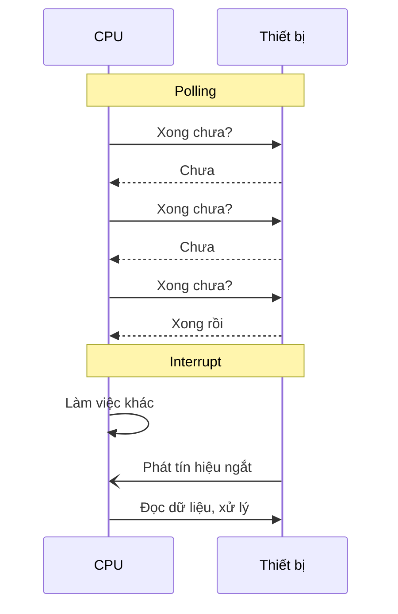
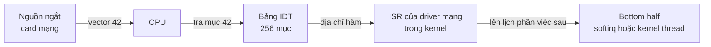
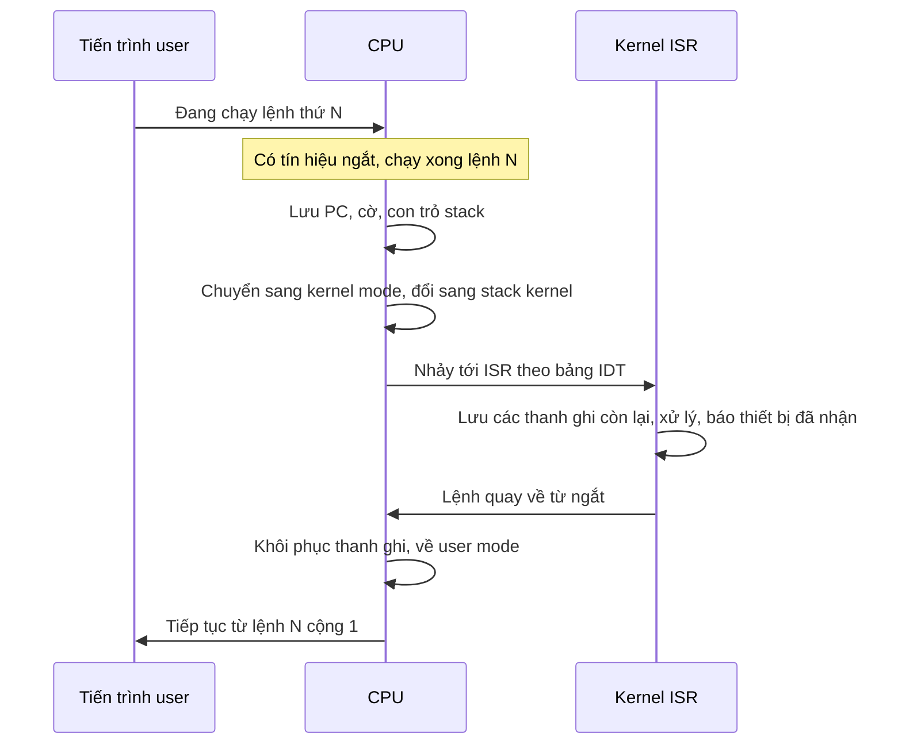
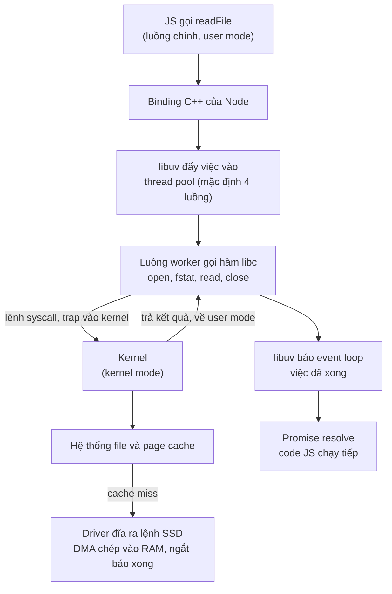
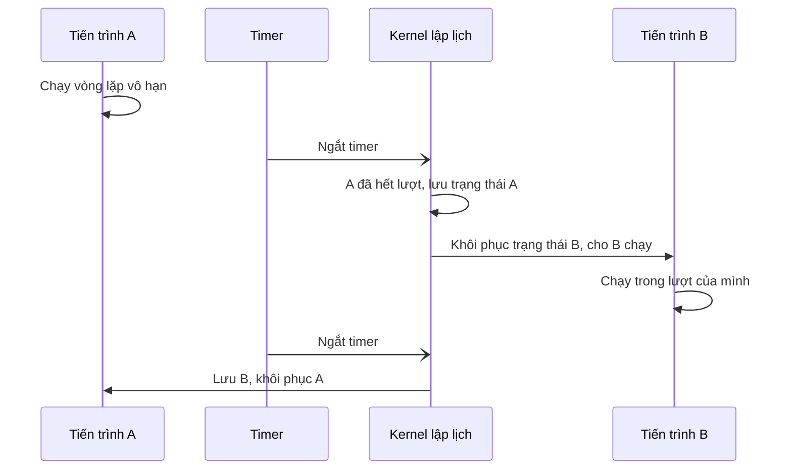
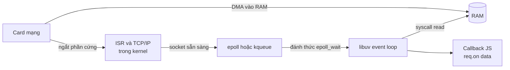

# Ngắt (interrupt)

**Ngắt** (interrupt) là **tín hiệu báo cho CPU tạm dừng việc đang làm** để xử lý một sự kiện cần chú ý ngay — một phím vừa được bấm, một gói tin vừa tới card mạng, bộ hẹn giờ vừa hết giờ, hoặc chính chương trình vừa làm điều không hợp lệ như chia cho 0. CPU lưu lại trạng thái hiện tại, nhảy tới một đoạn code xử lý của hệ điều hành, xử lý xong thì **quay lại đúng chỗ cũ** như chưa có gì xảy ra. Ngắt là cơ chế giúp CPU **không phải ngồi chờ** thiết bị chậm, và là nền móng của đa nhiệm, system call và toàn bộ I/O bất đồng bộ.

**Tương tự đơn giản:** Bạn đang chờ shipper giao hàng. Cách 1: **cứ 1 phút lại chạy ra cửa xem** (polling) — mệt và chẳng làm được gì khác. Cách 2: **lắp chuông cửa** (interrupt) — bạn cứ làm việc, chuông reo thì đánh dấu trang sách đang đọc (lưu trạng thái), ra nhận hàng (xử lý ngắt), rồi quay lại đọc tiếp từ trang đó (khôi phục trạng thái).

---

:::note[Ghi nhớ nhanh]

- ⭐ **Interrupt = "chuông cửa" của CPU** — thiết bị hoặc sự kiện báo cho CPU, thay vì CPU phải liên tục hỏi (polling).
- ⭐ **System call là cách duy nhất để code user mode nhờ kernel làm việc đặc quyền** — `fs.readFile` trong Node cuối cùng đi xuống các syscall `open`, `read`, `close`.
- **Hai nhóm lớn:** ngắt phần cứng (bàn phím, card mạng, timer) và ngắt phần mềm/ngoại lệ (system call, chia cho 0, page fault).
- **Timer interrupt là nền tảng của đa nhiệm** — nhờ nó kernel giành lại CPU định kỳ để chuyển sang tiến trình khác.
- **DMA + interrupt** cho phép thiết bị tự chép dữ liệu vào RAM rồi mới báo CPU — cơ sở để event loop của Node.js xử lý hàng nghìn kết nối mà không chặn.

:::

---

## Mục lục

- [Vì sao cần ngắt?](#vì-sao-cần-ngắt)
- [1. Polling và interrupt](#1-polling-và-interrupt)
- [2. Ngắt phần cứng](#2-ngắt-phần-cứng)
- [3. Ngắt phần mềm, trap và exception](#3-ngắt-phần-mềm-trap-và-exception)
- [4. Bảng vector ngắt và trình xử lý ngắt (ISR)](#4-bảng-vector-ngắt-và-trình-xử-lý-ngắt-isr)
- [5. Chuyện gì xảy ra khi CPU nhận ngắt?](#5-chuyện-gì-xảy-ra-khi-cpu-nhận-ngắt)
- [6. User mode và kernel mode](#6-user-mode-và-kernel-mode)
- [7. System call: từ fs.readFile xuống syscall read](#7-system-call-từ-fsreadfile-xuống-syscall-read)
- [8. Timer interrupt và đa nhiệm](#8-timer-interrupt-và-đa-nhiệm)
- [9. DMA](#9-dma)
- [10. Liên hệ event loop, libuv và I/O bất đồng bộ](#10-liên-hệ-event-loop-libuv-và-io-bất-đồng-bộ)
- [Khi nào cần nhớ?](#khi-nào-cần-nhớ)
- [Lỗi thường gặp](#lỗi-thường-gặp)
- [Câu hỏi phỏng vấn](#câu-hỏi-phỏng-vấn)

---

## Vì sao cần ngắt?

**Vấn đề:** Thiết bị ngoại vi chậm hơn CPU khủng khiếp. Người gõ phím vài phím mỗi giây; một gói tin mạng có thể tới sau vài mili giây; đọc ổ cứng mất cả mili giây — trong khi CPU chạy hàng tỉ chu kỳ mỗi giây. Nếu CPU phải **liên tục kiểm tra** từng thiết bị xem "có gì mới chưa", nó sẽ đốt gần hết thời gian vào việc hỏi han vô ích. Tệ hơn, một chương trình viết vòng lặp vô hạn sẽ **chiếm CPU mãi mãi**, hệ điều hành không có cách nào giành lại quyền điều khiển.

**Giải pháp:** Cho thiết bị và sự kiện **chủ động báo** cho CPU qua một đường tín hiệu riêng. CPU kiểm tra tín hiệu này sau mỗi lệnh (phần cứng làm, gần như miễn phí); khi có ngắt, CPU tự động chuyển sang code của kernel. Cùng cơ chế đó được dùng cho lỗi (chia cho 0, truy cập bộ nhớ sai), cho system call, và cho bộ hẹn giờ giúp kernel lập lịch.

:::tip[Dùng thực tế]

- **Hiểu vì sao Node.js xử lý được hàng chục nghìn kết nối với một luồng:** I/O được kernel và thiết bị lo bằng DMA + interrupt, luồng JS chỉ nhận thông báo "đã xong".
- **Debug hiệu năng server:** đọc `%sy` (thời gian kernel) và `%si`/`%hi` (xử lý ngắt) trong `top`, xem `/proc/interrupts` khi card mạng bị nghẽn.
- **Truy vết chương trình:** dùng `strace` (Linux) hay `dtruss` (macOS) để xem ứng dụng gọi những syscall nào, vì sao nó chậm hoặc lỗi quyền.
- **Hiểu lỗi crash:** `Segmentation fault`, `SIGFPE`, page fault, OOM đều bắt đầu từ một exception của CPU.

:::

---

## 1. Polling và interrupt

| Tiêu chí | Polling (thăm dò) | Interrupt (ngắt) |
| --- | --- | --- |
| Cách làm | CPU hỏi thiết bị định kỳ "xong chưa?" | Thiết bị báo CPU khi có sự kiện |
| Ví dụ đời thường | Cứ 1 phút chạy ra cửa xem shipper | Chuông cửa reo |
| Lãng phí CPU | Cao khi sự kiện hiếm | Thấp, chỉ tốn khi có sự kiện |
| Độ trễ phản hồi | Phụ thuộc chu kỳ hỏi | Gần như tức thì |
| Khi tải cực cao | Hiệu quả (luôn có việc khi hỏi) | Có thể "bão ngắt" (interrupt storm) |
| Dùng ở đâu | Card mạng tốc độ rất cao, DPDK, vòng lặp nhúng đơn giản | Hầu hết thiết bị trong máy tính |

```js
// Polling ở tầng ứng dụng: hỏi API mỗi 2 giây xem job xong chưa
const timer = setInterval(async () => {
  try {
    const res = await fetch('/api/jobs/42');
    const job = await res.json();
    if (job.status === 'done') clearInterval(timer); // phần lớn lần hỏi là vô ích
  } catch (err) {
    console.error('Lỗi khi kiểm tra job:', err);
  }
}, 2000);

// "Interrupt" ở tầng ứng dụng: server chủ động đẩy sự kiện khi xong (WebSocket, SSE, webhook)
const events = new EventSource('/api/jobs/42/events');
events.addEventListener('done', () => events.close());
```

Thực tế Linux dùng kiểu **lai**: cơ chế **NAPI** cho card mạng nhận ngắt khi lưu lượng thấp, nhưng khi gói tin dồn dập thì **tắt ngắt và chuyển sang polling** để tránh bão ngắt.



---

## 2. Ngắt phần cứng

**Ngắt phần cứng** (hardware interrupt) do thiết bị bên ngoài nhân CPU phát ra qua một đường tín hiệu. Trên PC hiện đại, tín hiệu đi qua **bộ điều khiển ngắt** (interrupt controller — trên x86 là **APIC**) để phân loại, ưu tiên và chuyển tới đúng nhân CPU.

| Nguồn | Khi nào phát ngắt | Kernel làm gì |
| --- | --- | --- |
| **Bàn phím / chuột** (USB) | Có phím bấm, chuột di chuyển | Đọc mã phím, chuyển tới ứng dụng đang focus |
| **Card mạng** (NIC) | Gói tin đã được chép vào RAM, hoặc đã gửi xong | Xử lý ngăn xếp TCP/IP, đánh thức tiến trình đang chờ socket |
| **Ổ đĩa** (SSD/HDD) | Lệnh đọc/ghi đã hoàn tất | Đánh dấu buffer đã sẵn sàng, đánh thức tiến trình chờ |
| **Timer** | Hết một khoảng thời gian định trước | Cập nhật đồng hồ, lập lịch lại tiến trình (mục 8) |
| **Ngắt liên bộ xử lý** (IPI) | Nhân này cần báo nhân khác | Ví dụ yêu cầu nhân khác xoá TLB, lập lịch lại |

Ngắt phần cứng có thể bị **che** (mask) tạm thời khi kernel đang làm việc nhạy cảm, trừ **NMI** (Non-Maskable Interrupt — ngắt không che được) dành cho lỗi phần cứng nghiêm trọng hoặc watchdog.

Trên Linux, xem số ngắt mỗi nhân đã nhận:

```bash
cat /proc/interrupts      # mỗi dòng là một nguồn ngắt, mỗi cột là một CPU
watch -n1 'grep -i eth /proc/interrupts'   # theo dõi ngắt của card mạng
```

---

## 3. Ngắt phần mềm, trap và exception

Không phải ngắt nào cũng đến từ thiết bị. Nhiều ngắt **do chính lệnh đang chạy gây ra** — gọi chung là **ngắt đồng bộ** (synchronous), vì nó xảy ra đúng tại một lệnh cụ thể.

| Loại | Nguyên nhân | Ví dụ | Sau khi xử lý |
| --- | --- | --- | --- |
| **Trap** (bẫy) | Lệnh **cố ý** gọi vào kernel | Lệnh `syscall` (x86-64), `svc` (ARM64), breakpoint của debugger | Quay lại lệnh **tiếp theo** |
| **Fault** (lỗi khắc phục được) | Lệnh gặp vấn đề kernel có thể sửa | **Page fault** — trang bộ nhớ chưa nạp vào RAM | Chạy **lại chính lệnh đó** |
| **Abort** (lỗi nghiêm trọng) | Lỗi phần cứng không khôi phục được | Double fault, lỗi kiểm tra máy (machine check) | Thường dừng tiến trình hoặc cả hệ thống |

Một số exception thường gặp trên x86:

| Vector | Tên | Khi nào xảy ra | Hậu quả với chương trình |
| --- | --- | --- | --- |
| 0 | Divide Error (`#DE`) | Chia **số nguyên** cho 0 | Linux gửi tín hiệu `SIGFPE`, mặc định huỷ tiến trình |
| 6 | Invalid Opcode (`#UD`) | Gặp mã lệnh không hợp lệ | `SIGILL` |
| 13 | General Protection (`#GP`) | Vi phạm quyền, ví dụ user mode chạy lệnh đặc quyền | Thường là `SIGSEGV` |
| 14 | Page Fault (`#PF`) | Truy cập trang chưa có trong RAM hoặc không có quyền | Kernel nạp trang (bình thường) hoặc gửi `SIGSEGV` (lỗi thật) |

```c
// C: chia số nguyên cho 0 -> CPU phát exception #DE -> kernel gửi SIGFPE
#include <stdio.h>
int main(void) {
  volatile int zero = 0;      // volatile để trình biên dịch không tự tối ưu bỏ phép chia
  printf("%d\n", 10 / zero);  // chương trình bị huỷ: "Floating point exception"
  return 0;
}
```

```js
// JS: number là số thực dấu phẩy động, chia cho 0 KHÔNG gây exception phần cứng
console.log(10 / 0);   // Infinity — theo chuẩn IEEE 754
console.log(0 / 0);    // NaN

// BigInt là số nguyên, nhưng V8 kiểm tra bằng phần mềm và ném lỗi JS
try {
  console.log(10n / 0n);
} catch (err) {
  console.error(err.name, err.message); // RangeError: Division by zero
}
```

Trong Java, `10 / 0` với `int` ném `ArithmeticException` — JVM có thể dựa vào exception phần cứng hoặc tự kiểm tra, rồi chuyển thành exception Java cho bạn bắt.

:::info[Page fault không phải lúc nào cũng là lỗi]
Phần lớn page fault là **hoàn toàn bình thường**: khi chương trình chạm vào một trang bộ nhớ lần đầu, hoặc trang đã bị đẩy ra swap, kernel sẽ nạp trang vào RAM rồi chạy lại lệnh. Chỉ khi địa chỉ thật sự không hợp lệ thì mới thành `Segmentation fault` (xem bài 2.4 Quản lý bộ nhớ).
:::

---

## 4. Bảng vector ngắt và trình xử lý ngắt (ISR)

Mỗi loại ngắt có một **số hiệu** gọi là **vector**. Kernel chuẩn bị sẵn một bảng — **bảng vector ngắt** (interrupt vector table; trên x86 gọi là **IDT** — Interrupt Descriptor Table, có 256 mục) — ánh xạ mỗi vector tới địa chỉ của một hàm xử lý gọi là **ISR** (Interrupt Service Routine — trình xử lý ngắt).

| Vector (x86) | Dành cho |
| --- | --- |
| 0 – 31 | Exception do CPU định nghĩa (chia cho 0, page fault...) |
| 32 – 255 | Ngắt từ thiết bị qua APIC, IPI, và các mục kernel tự định nghĩa |



ISR phải **chạy rất nhanh** vì trong lúc đó các ngắt khác có thể bị che. Linux vì vậy chia việc thành hai nửa:

- **Top half** (nửa trên — chính là ISR): xác nhận ngắt với thiết bị, ghi lại "có việc", thoát ngay.
- **Bottom half** (nửa dưới — softirq, tasklet, workqueue): xử lý phần nặng sau đó, khi ngắt đã được mở lại. Ví dụ xử lý TCP/IP cho gói tin vừa nhận.

---

## 5. Chuyện gì xảy ra khi CPU nhận ngắt?



Từng bước:

1. **Hoàn tất lệnh hiện tại** (với ngắt phần cứng) — CPU kiểm tra tín hiệu ngắt giữa các lệnh.
2. **Lưu trạng thái tối thiểu:** phần cứng tự đẩy PC, thanh ghi cờ, con trỏ stack lên **stack của kernel**.
3. **Chuyển chế độ:** từ user mode sang kernel mode (mục 6).
4. **Tra bảng vector** và nhảy tới ISR tương ứng.
5. **ISR xử lý:** lưu thêm các thanh ghi nó dùng, làm việc, báo cho interrupt controller là đã xong (EOI — End Of Interrupt).
6. **Quay về:** lệnh đặc biệt (trên x86-64 là `iretq`) khôi phục trạng thái và chế độ cũ. Chương trình tiếp tục như chưa từng bị gián đoạn.

Nếu trong lúc xử lý, kernel quyết định **chuyển sang tiến trình khác** (ví dụ do timer, xem mục 8), bước 6 sẽ khôi phục trạng thái của **tiến trình khác** — đó chính là **context switch** (xem bài 2.1 Tiến trình và luồng).

---

## 6. User mode và kernel mode

CPU hiện đại có ít nhất hai **chế độ đặc quyền** (privilege level). Trên x86 gọi là các **ring**: ring 0 cho kernel, ring 3 cho ứng dụng (ring 1, 2 hầu như không dùng).

| Tiêu chí | User mode (ring 3) | Kernel mode (ring 0) |
| --- | --- | --- |
| Ai chạy | Node.js, JVM, trình duyệt, mọi ứng dụng | Kernel, driver thiết bị |
| Truy cập phần cứng trực tiếp | Không | Có |
| Lệnh đặc quyền (tắt ngắt, đổi bảng trang...) | Bị cấm — chạy là sinh exception `#GP` | Được phép |
| Bộ nhớ nhìn thấy | Chỉ không gian địa chỉ của chính mình | Toàn bộ |
| Lỗi nghiêm trọng gây ra | Chỉ tiến trình đó chết | Có thể sập cả máy (kernel panic, màn hình xanh) |

Cách **duy nhất** để chuyển từ user mode sang kernel mode là qua **ngắt**: ngắt phần cứng, exception, hoặc **system call** (trap có chủ đích). Ứng dụng không thể "tự nhảy" vào code kernel tuỳ ý — CPU chỉ cho vào đúng các điểm vào đã đăng ký trong bảng vector hoặc thanh ghi cấu hình syscall.

---

## 7. System call: từ fs.readFile xuống syscall read

**System call** (lời gọi hệ thống, syscall) là "API" mà kernel cung cấp cho ứng dụng: mở file, đọc/ghi, tạo socket, cấp phát bộ nhớ, tạo tiến trình... Trên Linux x86-64, ứng dụng đặt **số hiệu syscall** vào thanh ghi `rax` (ví dụ `read` là 0, `write` là 1), các tham số vào `rdi`, `rsi`, `rdx`..., rồi chạy lệnh `syscall`.

```asm
; Gọi read(fd, buf, count) trực tiếp trên Linux x86-64 — minh hoạ
mov rax, 0          ; số hiệu syscall read
mov rdi, 3          ; fd = 3 (file đã mở)
mov rsi, buf        ; địa chỉ vùng nhớ nhận dữ liệu
mov rdx, 4096       ; đọc tối đa 4096 byte
syscall             ; trap vào kernel, kết quả (số byte đọc được) nằm ở rax
```

Khi bạn viết JS:

```js
import { readFile } from 'node:fs/promises';

try {
  const text = await readFile('./config.json', 'utf8');
  console.log(JSON.parse(text));
} catch (err) {
  console.error('Không đọc được file cấu hình:', err.code); // ví dụ ENOENT do syscall open trả về
}
```

Hành trình đi xuống:



Có thể **tận mắt** thấy các syscall này trên Linux:

```bash
# Theo dõi các syscall liên quan file của tiến trình node và mọi luồng con
strace -f -e trace=openat,read,close node -e "require('fs').readFile('config.json', () => {})"
# Kết quả (rút gọn) sẽ có các dòng dạng openat(..., "config.json", O_RDONLY|O_CLOEXEC) = 17
# và read(17, "...", ...) = số byte đọc được
```

Lưu ý: `fs.readFile` dùng **thread pool** của libuv vì trên hầu hết hệ điều hành, đọc file thông thường không có API bất đồng bộ dễ dùng như socket. Một số phiên bản libuv trên Linux có thể dùng **io_uring** cho một số thao tác file, nhưng mô hình tư duy ở trên vẫn đúng.

Syscall **tốn hơn nhiều so với gọi hàm thường** (phải chuyển chế độ, lưu/khôi phục trạng thái, các biện pháp giảm thiểu lỗ hổng như Meltdown làm chi phí tăng thêm). Vì vậy đọc file theo khối lớn, ghi log theo lô (buffered), và dùng stream hợp lý giúp giảm số syscall.

---

## 8. Timer interrupt và đa nhiệm

Nếu một tiến trình chạy `while (true) {}` thì sao? Nó không bao giờ gọi syscall, không bao giờ tự nhường CPU. Câu trả lời là **timer interrupt**: phần cứng hẹn giờ phát ngắt **định kỳ**, buộc CPU quay về kernel dù tiến trình có muốn hay không.

- Linux truyền thống cấu hình tần số tick bằng `CONFIG_HZ`, thường là **100, 250 hoặc 1000** lần mỗi giây tuỳ bản phân phối.
- Kernel hiện đại hỗ trợ chế độ **tickless** (`NO_HZ`) — khi CPU rảnh thì không phát tick định kỳ để tiết kiệm điện, chỉ hẹn giờ đúng lúc cần.

Mỗi lần timer ngắt, kernel cập nhật thời gian chạy của tiến trình hiện tại và quyết định có cần **chuyển sang tiến trình khác** không. Đây gọi là **đa nhiệm ưu tiên** (preemptive multitasking).



| Kiểu đa nhiệm | Ai quyết định nhường CPU | Ví dụ |
| --- | --- | --- |
| **Preemptive** (ưu tiên, cưỡng chế) | Kernel, nhờ timer interrupt | Linux, Windows, macOS hiện đại |
| **Cooperative** (hợp tác) | Chính chương trình tự nhường | Windows 3.x, Mac OS cổ điển (trước OS X), **event loop của JS** |

Thú vị là event loop của Node.js/trình duyệt là **đa nhiệm hợp tác** ở tầng ứng dụng: một callback chạy `while (true) {}` sẽ chặn mọi callback khác — kernel vẫn cho tiến trình khác chạy, nhưng **bên trong tiến trình Node** không ai giành lại được luồng JS.

---

## 9. DMA

Không có DMA, để đọc 1 MB từ card mạng, CPU phải tự chép **từng chữ** từ thiết bị vào RAM — gọi là **PIO** (Programmed I/O). **DMA** (Direct Memory Access — truy cập bộ nhớ trực tiếp) cho phép thiết bị **tự chép dữ liệu vào/ra RAM**, CPU chỉ cần:

1. Chỉ cho thiết bị: "chép N byte vào vùng RAM ở địa chỉ X".
2. Đi làm việc khác.
3. Nhận **một ngắt** khi thiết bị chép xong.

| Tiêu chí | PIO | DMA |
| --- | --- | --- |
| Ai chép dữ liệu | CPU, từng đơn vị nhỏ | Thiết bị / bộ điều khiển DMA |
| CPU bận trong lúc truyền | Có | Không |
| Số ngắt | Có thể mỗi đơn vị dữ liệu một ngắt | Một ngắt khi xong cả khối |
| Dùng cho | Thiết bị đơn giản, chậm | Card mạng, SSD NVMe, GPU, âm thanh |

Card mạng hiện đại dùng **vòng đệm** (ring buffer) trong RAM: card tự ghi gói tin vào các ô trống bằng DMA, rồi phát ngắt (hoặc gộp nhiều gói rồi mới ngắt — **interrupt coalescing**) để giảm số lần làm phiền CPU.

---

## 10. Liên hệ event loop, libuv và I/O bất đồng bộ

Ghép tất cả lại, đây là điều thực sự xảy ra khi một server Node.js chờ hàng nghìn request HTTP:

1. Luồng JS gọi `server.listen()`; libuv đăng ký các socket với cơ chế của kernel: **epoll** (Linux), **kqueue** (macOS/BSD), **IOCP** (Windows).
2. Không có việc gì, event loop gọi `epoll_wait` (một syscall) — luồng **ngủ trong kernel**, không tốn CPU.
3. Gói tin tới: card mạng **DMA** dữ liệu vào RAM → phát **ngắt** → ISR + bottom half xử lý TCP/IP → kernel đánh dấu socket "có dữ liệu" → đánh thức luồng đang ngủ trong `epoll_wait`.
4. libuv nhận danh sách socket sẵn sàng → gọi `read` lấy dữ liệu → đưa callback/Promise vào hàng đợi → **code JS của bạn chạy**.



| Tầng | Cơ chế "đừng chờ, hãy báo tôi" |
| --- | --- |
| Phần cứng | Interrupt + DMA |
| Kernel | epoll / kqueue / IOCP, đánh thức tiến trình đang ngủ |
| libuv | Event loop + thread pool cho việc không có API bất đồng bộ |
| JavaScript | Callback, Promise, `async/await`, EventEmitter |

Cùng **một ý tưởng** — "đăng ký trước, khi xong thì báo" — xuất hiện ở mọi tầng. `await` trong JS về bản chất là phiên bản cấp cao của chuông cửa phần cứng.

---

## Khi nào cần nhớ?

- **Cần nghĩ tới ngắt và syscall khi:**
  - Server có `%sy` (CPU trong kernel) hoặc `%si` (softirq) cao bất thường trong `top` — có thể do quá nhiều syscall nhỏ hoặc lưu lượng mạng lớn
  - Ứng dụng ghi log/ghi file từng dòng nhỏ, gọi `fs.*Sync` trong vòng lặp — tốn syscall và chặn event loop
  - Cần biết ứng dụng thật sự làm gì với hệ thống: dùng `strace`, `ltrace`, `dtruss`
  - Thiết kế API: polling vs push (WebSocket, SSE, webhook) — cùng đánh đổi như polling vs interrupt
- **Không cần bận tâm khi:**
  - Viết logic nghiệp vụ thông thường — runtime và OS lo hết
- **Best practice:**
  - Dùng API bất đồng bộ của Node cho I/O; tránh `readFileSync` trong đường xử lý request
  - Gom ghi (buffer, stream) để giảm số syscall
  - Đừng chặn event loop bằng vòng lặp dài — event loop không có timer interrupt để cứu bạn

---

## Lỗi thường gặp

### Lỗi 1: Nghĩ ngắt là "lỗi"

Ngắt là cơ chế **bình thường** và xảy ra hàng nghìn tới hàng trăm nghìn lần mỗi giây trên một máy đang chạy. Chỉ một số exception (chia cho 0, page fault không hợp lệ) mới là dấu hiệu lỗi.

### Lỗi 2: Nghĩ I/O bất đồng bộ nghĩa là "có một luồng khác đang chờ"

Với socket mạng, **không có luồng nào ngồi chờ** từng kết nối: thiết bị dùng DMA, báo bằng ngắt, kernel đánh dấu sẵn sàng qua epoll/kqueue. Chỉ một số thao tác (đọc file, DNS `lookup`, một số hàm `crypto`) mới dùng thread pool của libuv.

### Lỗi 3: Nghĩ syscall rẻ như gọi hàm

Mỗi syscall phải chuyển user mode sang kernel mode và quay lại, lưu/khôi phục trạng thái, có thể làm bẩn cache/TLB. Hàng triệu lần `write` vài byte chậm hơn rất nhiều so với vài lần `write` khối lớn.

### Lỗi 4: Nghĩ `1 / 0` trong JS làm CPU phát exception

`number` trong JS là số thực IEEE 754, chia cho 0 cho ra `Infinity` hoặc `NaN` — không có exception nào. Exception chia cho 0 của CPU chỉ xảy ra với **phép chia số nguyên** (C, mã máy); `BigInt` thì V8 tự kiểm tra và ném `RangeError`.

### Lỗi 5: Nghĩ hệ điều hành cũng sẽ cứu event loop khỏi vòng lặp vô hạn

Timer interrupt giúp **các tiến trình khác** vẫn chạy được, nhưng trong tiến trình Node, luồng JS bị một callback chiếm thì mọi request khác đều phải chờ. Event loop là đa nhiệm **hợp tác**.

---

## Câu hỏi phỏng vấn

Những câu thường gặp về chủ đề này. Tự trả lời trước, rồi bấm **Xem đáp án** để đối chiếu.

**1. Interrupt là gì? So sánh polling và interrupt.**

<details className="qa">
<summary>Xem đáp án</summary>

Interrupt là tín hiệu làm CPU tạm dừng việc đang làm, lưu trạng thái, chạy trình xử lý ngắt (ISR) của kernel rồi quay lại. 

- **Polling:** CPU định kỳ hỏi thiết bị — lãng phí khi sự kiện hiếm, độ trễ phụ thuộc chu kỳ hỏi, nhưng hiệu quả khi tải cực cao.
- **Interrupt:** thiết bị chủ động báo — tiết kiệm CPU, phản hồi nhanh, nhưng tải quá cao có thể gây bão ngắt.

Thực tế dùng lai, ví dụ NAPI của Linux chuyển từ ngắt sang polling khi gói tin dồn dập.

</details>

**2. Phân biệt ngắt phần cứng, trap và exception (fault).**

<details className="qa">
<summary>Xem đáp án</summary>

- **Ngắt phần cứng:** bất đồng bộ, đến từ thiết bị (bàn phím, card mạng, timer) qua interrupt controller.
- **Trap:** đồng bộ, do lệnh **cố ý** gọi vào kernel — system call, breakpoint. Quay về lệnh kế tiếp.
- **Fault/exception:** đồng bộ, do lệnh gặp vấn đề — page fault (kernel sửa được rồi chạy lại lệnh), chia số nguyên cho 0 (thường dẫn tới `SIGFPE`), vi phạm quyền (`SIGSEGV`).

</details>

**3. Điều gì xảy ra từ lúc CPU nhận ngắt tới lúc chương trình chạy tiếp?**

<details className="qa">
<summary>Xem đáp án</summary>

1. CPU hoàn tất lệnh hiện tại.
2. Phần cứng lưu PC, cờ, con trỏ stack lên stack kernel.
3. Chuyển sang kernel mode.
4. Tra bảng vector (IDT trên x86) để lấy địa chỉ ISR.
5. ISR lưu thêm thanh ghi, xử lý, báo EOI; phần nặng hoãn sang bottom half.
6. Lệnh quay về từ ngắt (`iretq`) khôi phục trạng thái và chế độ. Nếu kernel quyết định lập lịch lại, trạng thái được khôi phục có thể là của tiến trình khác (context switch).

</details>

**4. System call là gì? Vì sao ứng dụng không thể truy cập phần cứng trực tiếp?**

<details className="qa">
<summary>Xem đáp án</summary>

System call là giao diện để code user mode yêu cầu kernel làm việc đặc quyền (I/O, cấp phát bộ nhớ, tạo tiến trình). Ứng dụng đặt số hiệu syscall và tham số vào thanh ghi, rồi chạy lệnh trap (`syscall` trên x86-64) để vào kernel ở một điểm vào cố định.

Ứng dụng chạy ở user mode (ring 3): lệnh đặc quyền bị CPU chặn, bộ nhớ bị giới hạn trong không gian địa chỉ riêng. Điều này bảo vệ hệ thống — một app lỗi không thể ghi đè dữ liệu app khác hay làm sập kernel. Ví dụ `fs.readFile` trong Node cuối cùng gọi các syscall `openat`, `read`, `close` từ thread pool của libuv.

</details>

**5. Timer interrupt liên quan gì tới đa nhiệm?**

<details className="qa">
<summary>Xem đáp án</summary>

Timer phần cứng phát ngắt định kỳ (hoặc theo hẹn giờ ở chế độ tickless). Mỗi lần ngắt, kernel giành lại CPU dù tiến trình đang chạy có tự nhường hay không, kiểm tra lượt chạy, và có thể context switch sang tiến trình khác. Nhờ vậy một chương trình `while (true)` không chiếm CPU mãi — đó là **đa nhiệm ưu tiên** (preemptive). Ngược lại, event loop của JS là đa nhiệm hợp tác: callback không nhường thì callback khác không chạy được.

</details>

**6. DMA là gì? Nó giúp Node.js xử lý nhiều kết nối như thế nào?**

<details className="qa">
<summary>Xem đáp án</summary>

DMA cho phép thiết bị tự chép dữ liệu giữa thiết bị và RAM mà CPU không phải chép từng phần; xong mới phát một ngắt. Khi request tới, card mạng DMA gói tin vào RAM rồi ngắt; kernel xử lý TCP/IP và đánh dấu socket sẵn sàng trong epoll/kqueue; event loop của libuv đang ngủ trong `epoll_wait` được đánh thức, đọc dữ liệu và chạy callback JS. Không có luồng nào phải ngồi chờ từng kết nối, nên một luồng JS phục vụ được hàng nghìn kết nối đồng thời.

</details>
