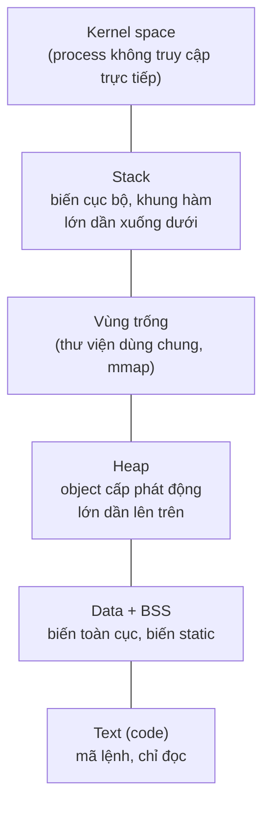
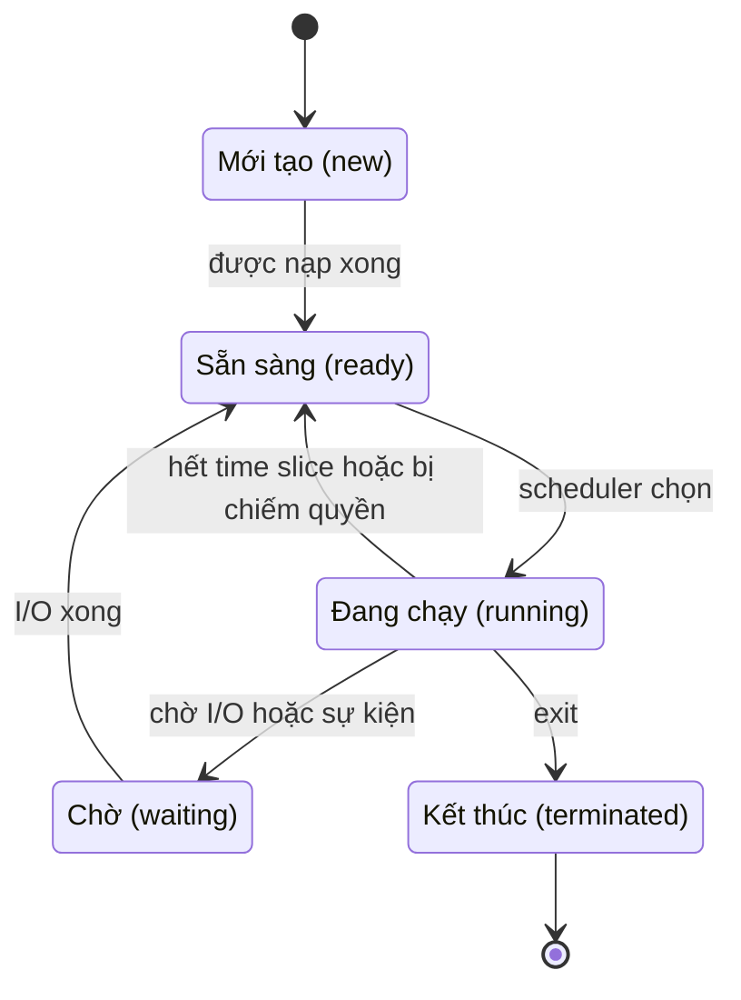
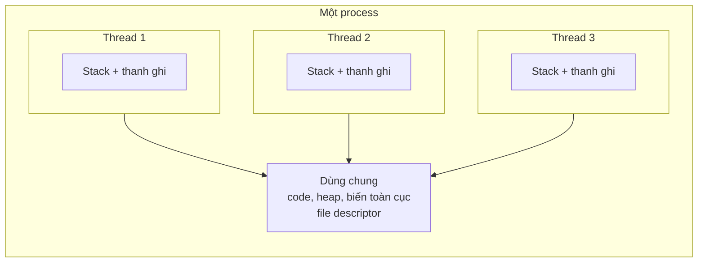
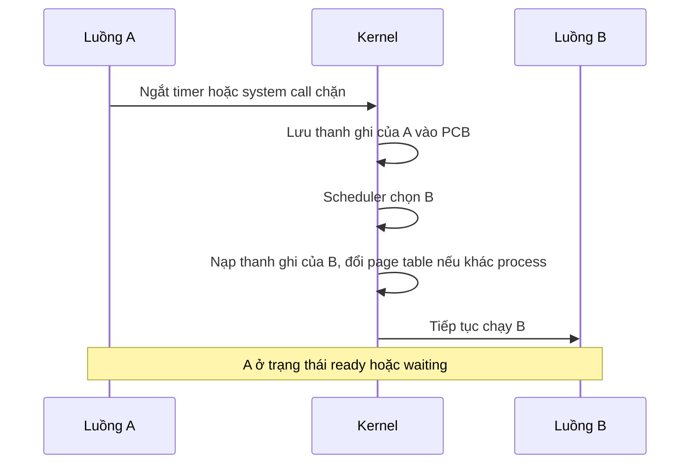
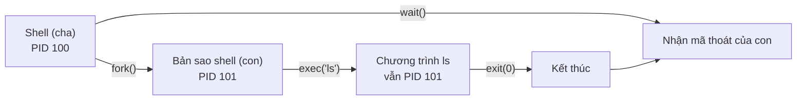
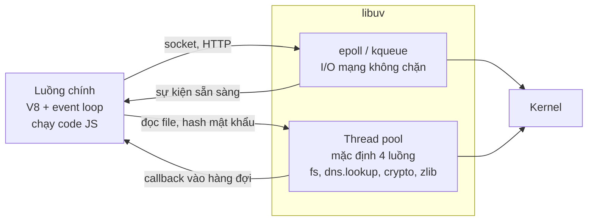

# Tiến trình và luồng

**Tiến trình** (process) là **một chương trình đang chạy**: gồm mã lệnh đã được nạp vào RAM, dữ liệu, trạng thái thanh ghi CPU và các tài nguyên hệ điều hành cấp cho nó (file đang mở, socket, bộ nhớ). **Luồng** (thread) là **một dòng thực thi bên trong tiến trình** — một tiến trình có thể có nhiều luồng chạy song song, dùng chung bộ nhớ của tiến trình đó. Đây là hai đơn vị cơ bản mà hệ điều hành dùng để chia CPU cho hàng trăm chương trình cùng lúc.

**Tương tự đơn giản:** **Chương trình** là cuốn công thức nấu ăn nằm trên kệ. **Tiến trình** là một gian bếp đang nấu theo cuốn công thức đó — có bếp riêng, tủ lạnh riêng, nguyên liệu riêng. **Luồng** là các đầu bếp trong cùng gian bếp: họ dùng chung tủ lạnh và mặt bàn (bộ nhớ), mỗi người làm một việc, nhưng cũng dễ giẫm chân nhau nếu không phối hợp. Mở thêm một gian bếp mới (tạo process) thì tốn kém hơn nhiều so với gọi thêm một đầu bếp (tạo thread).

---

:::note[Ghi nhớ nhanh]

- ⭐ **Process có không gian địa chỉ riêng, thread trong cùng process dùng chung bộ nhớ** — process cô lập và an toàn hơn, thread nhẹ và giao tiếp nhanh hơn nhưng dễ dính race condition.
- ⭐ **Node.js chạy JavaScript trên một luồng chính** (event loop), còn I/O nặng như đọc file, DNS, crypto được đẩy sang **thread pool của libuv** (mặc định 4 luồng); muốn dùng nhiều nhân thì dùng `cluster` hoặc `worker_threads`.
- **Process đi qua các trạng thái** new → ready → running → waiting → terminated; bộ lập lịch quyết định ai được chạy.
- **Context switch có chi phí** — lưu/nạp thanh ghi, đổi bảng trang, làm nguội cache và TLB; quá nhiều thread đồng nghĩa với nhiều thời gian "đổi ca" thay vì làm việc.
- **Java 21 có virtual threads** — hàng triệu luồng nhẹ do JVM quản lý, chạy trên vài luồng hệ điều hành.

:::

---

## Mục lục

- [Vì sao cần tiến trình và luồng?](#vì-sao-cần-tiến-trình-và-luồng)
- [1. Chương trình và tiến trình](#1-chương-trình-và-tiến-trình)
- [2. Không gian địa chỉ của tiến trình](#2-không-gian-địa-chỉ-của-tiến-trình)
- [3. PCB và trạng thái của tiến trình](#3-pcb-và-trạng-thái-của-tiến-trình)
- [4. Luồng là gì](#4-luồng-là-gì)
- [5. Context switch và chi phí](#5-context-switch-và-chi-phí)
- [6. Tạo tiến trình với fork và exec](#6-tạo-tiến-trình-với-fork-và-exec)
- [7. Giao tiếp giữa các tiến trình](#7-giao-tiếp-giữa-các-tiến-trình)
- [8. Mô hình của Node.js](#8-mô-hình-của-nodejs)
- [9. Mô hình của Java](#9-mô-hình-của-java)
- [10. Chrome và kiến trúc nhiều tiến trình](#10-chrome-và-kiến-trúc-nhiều-tiến-trình)
- [Khi nào cần nhớ?](#khi-nào-cần-nhớ)
- [Lỗi thường gặp](#lỗi-thường-gặp)
- [Câu hỏi phỏng vấn](#câu-hỏi-phỏng-vấn)

---

## Vì sao cần tiến trình và luồng?

**Vấn đề:** Máy tính chỉ có vài nhân CPU và một khối RAM, nhưng bạn đang mở cùng lúc trình duyệt, VS Code, Docker, Slack, terminal chạy `npm run dev`... Nếu mọi chương trình cùng ghi đè lên một vùng RAM và tranh nhau CPU không có trật tự, một chương trình lỗi sẽ kéo sập tất cả, và chương trình chạy vòng lặp vô hạn sẽ chiếm CPU mãi mãi. Ngay trong một chương trình, nếu chỉ có một dòng thực thi, mỗi lần chờ đọc đĩa hay chờ mạng là cả chương trình đứng hình.

**Giải pháp:** Hệ điều hành đóng gói mỗi chương trình đang chạy thành một **tiến trình** có vùng nhớ riêng được bảo vệ, rồi **luân phiên** cho các tiến trình dùng CPU. Bên trong tiến trình, **luồng** cho phép làm nhiều việc cùng lúc (một luồng chờ mạng, luồng khác tính toán) mà vẫn chia sẻ dữ liệu dễ dàng.

:::tip[Dùng thực tế]

- **Scale app Node.js:** hiểu vì sao một process Node chỉ "ăn" một nhân CPU, và khi nào cần PM2 cluster mode, `worker_threads` hay chạy nhiều container.
- **Tuning Spring Boot:** chọn kích thước thread pool của Tomcat (mặc định tối đa 200 luồng), HikariCP, hay bật virtual threads (`spring.threads.virtual.enabled=true` từ Spring Boot 3.2).
- **Debug server:** đọc `ps`, `top`, `htop` để thấy process nào ăn CPU/RAM, process zombie, số luồng của một JVM.
- **Hiểu Docker:** mỗi container thực chất là các process bình thường của Linux được cô lập bằng namespace và cgroup.

:::

---

## 1. Chương trình và tiến trình

| | Chương trình (program) | Tiến trình (process) |
| --- | --- | --- |
| **Bản chất** | File nằm trên đĩa (mã máy, bytecode, script) | Thực thể đang chạy trong RAM |
| **Trạng thái** | Tĩnh, bị động | Động, có trạng thái thanh ghi, con trỏ lệnh |
| **Tài nguyên** | Không có | Có bộ nhớ, file descriptor, socket, PID |
| **Số lượng** | Một file | Có thể có nhiều process cùng chạy một chương trình |
| **Ví dụ** | `/usr/bin/node`, `app.jar` | `node server.js` với PID 4321 |

Một chương trình có thể sinh ra nhiều tiến trình: mở 3 cửa sổ terminal là có 3 process `zsh` độc lập, mỗi cái có **PID** (process ID) riêng.

```bash
# Xem các process node đang chạy cùng PID, %CPU, %MEM
ps -eo pid,ppid,pcpu,pmem,comm | grep node

# Xem số luồng (cột NLWP) của từng process Java
ps -eLf | grep java | head
```

---

## 2. Không gian địa chỉ của tiến trình

Mỗi tiến trình được cấp một **không gian địa chỉ** (address space) riêng — một dải địa chỉ bộ nhớ ảo mà nó "tưởng" là của riêng mình (chi tiết ở bài 2.4 Quản lý bộ nhớ). Không gian này được chia thành các vùng:



| Vùng | Chứa gì | Đặc điểm |
| --- | --- | --- |
| **Text (code)** | Mã máy của chương trình | Chỉ đọc, có thể chia sẻ giữa các process chạy cùng chương trình |
| **Data / BSS** | Biến toàn cục, biến static (BSS là phần chưa khởi tạo, được gán 0) | Kích thước cố định khi nạp |
| **Heap** | Vùng nhớ cấp phát động (`malloc`, `new`, object JS) | Lớn dần khi cần, do allocator hoặc GC quản lý |
| **Stack** | Khung hàm (stack frame): tham số, biến cục bộ, địa chỉ trả về | Mỗi **luồng** có một stack riêng, kích thước giới hạn |

Với JavaScript hay Java, bạn không thấy trực tiếp các vùng này, nhưng chúng vẫn tồn tại: engine V8 hay JVM là một chương trình C++ chạy trong một process, và **heap của V8/JVM** chính là một vùng được engine xin từ hệ điều hành rồi tự quản lý bằng garbage collector.

---

## 3. PCB và trạng thái của tiến trình

Hệ điều hành theo dõi mỗi tiến trình bằng một cấu trúc dữ liệu gọi là **PCB** (Process Control Block). Trên Linux, đó là struct `task_struct` trong kernel.

| Thông tin trong PCB | Ý nghĩa |
| --- | --- |
| **PID, PPID** | Mã tiến trình và mã tiến trình cha |
| **Trạng thái** | new, ready, running, waiting, terminated |
| **Program counter + thanh ghi** | Được lưu lại khi process bị tạm dừng để chạy tiếp đúng chỗ |
| **Thông tin lập lịch** | Độ ưu tiên, giá trị `nice`, thời gian CPU đã dùng |
| **Thông tin bộ nhớ** | Con trỏ tới bảng trang (page table), giới hạn vùng nhớ |
| **Tài nguyên** | Danh sách file descriptor đang mở, socket, thư mục làm việc |
| **Quyền** | User ID, group ID |

Vòng đời của một tiến trình:



- **New:** đang được tạo, cấp PCB, nạp chương trình.
- **Ready:** đã sẵn sàng, chỉ đang chờ tới lượt dùng CPU (nằm trong hàng đợi ready).
- **Running:** đang thực thi lệnh trên một nhân CPU. Mỗi nhân tại một thời điểm chỉ chạy một luồng.
- **Waiting (blocked):** đang chờ một việc gì đó — đọc đĩa, chờ gói tin mạng, chờ khoá. Lúc này nó **không tốn CPU**.
- **Terminated:** đã kết thúc. Trên Linux, process con đã chết nhưng cha chưa gọi `wait()` để lấy mã thoát sẽ thành **zombie** (trạng thái `Z` trong `ps`).

---

## 4. Luồng là gì

**Luồng** (thread) là đơn vị nhỏ nhất được bộ lập lịch đưa lên CPU. Mọi process có ít nhất một luồng (luồng chính). Các luồng trong cùng process **dùng chung** code, heap, biến toàn cục, file đang mở, nhưng **mỗi luồng có riêng** stack, thanh ghi và program counter.



### Process và thread khác nhau thế nào

| Tiêu chí | Process | Thread |
| --- | --- | --- |
| **Bộ nhớ** | Không gian địa chỉ riêng | Dùng chung bộ nhớ của process |
| **Chi phí tạo** | Lớn (tạo bảng trang, PCB, sao chép tài nguyên) | Nhỏ hơn nhiều |
| **Context switch** | Đắt hơn (đổi bảng trang, xả TLB) | Rẻ hơn (cùng không gian địa chỉ) |
| **Giao tiếp** | Cần IPC (pipe, socket, shared memory) | Đọc/ghi trực tiếp biến chung |
| **Cô lập lỗi** | Một process crash không ảnh hưởng process khác | Một thread làm hỏng bộ nhớ có thể kéo sập cả process |
| **Đồng bộ** | Ít khi cần | Bắt buộc cẩn thận (lock, atomic) để tránh race condition |
| **Ví dụ** | Mỗi worker của PM2 cluster, mỗi container | Các luồng request của Tomcat, thread pool của libuv |

Trên Linux, kernel thực ra coi thread và process gần như giống nhau: cả hai đều là "task", được tạo bằng system call `clone()` với các cờ khác nhau quy định chia sẻ những gì (bộ nhớ, file descriptor...).

---

## 5. Context switch và chi phí

**Context switch** (chuyển ngữ cảnh) là việc CPU ngừng chạy luồng A để chuyển sang chạy luồng B. Hệ điều hành phải:

1. Lưu thanh ghi, program counter, con trỏ stack của A vào PCB/TCB.
2. Chọn luồng tiếp theo (bộ lập lịch).
3. Nạp thanh ghi của B. Nếu B thuộc **process khác**, còn phải đổi bảng trang (page table).
4. Chuyển quyền điều khiển cho B.



**Chi phí trực tiếp** (lưu/nạp thanh ghi, chạy code kernel) thường ở mức **vài micro giây**. **Chi phí gián tiếp** thường lớn hơn: dữ liệu của B không có trong cache L1/L2 (cache "nguội"), TLB bị xả khi đổi process, nên B chạy chậm một lúc sau khi được nạp. Vì vậy:

- Tạo 10.000 thread để xử lý 10.000 kết nối thường **chậm hơn** dùng event loop hoặc một thread pool vừa phải — CPU tốn thời gian đổi ca thay vì làm việc.
- Đây chính là lý do Nginx và Node.js chọn mô hình **event-driven** với ít luồng.

Xem số lần context switch của một process trên Linux:

```bash
# voluntary = tự nhường (chờ I/O), nonvoluntary = bị chiếm quyền (hết time slice)
grep ctxt /proc/<PID>/status

# Theo dõi toàn hệ thống mỗi giây, cột "cs" là context switch/giây
vmstat 1
```

---

## 6. Tạo tiến trình với fork và exec

Trên hệ Unix (Linux, macOS), process mới được tạo bằng hai bước:

- **`fork()`**: nhân bản process hiện tại thành một process con gần như giống hệt (cùng code, bản sao bộ nhớ, cùng file đang mở). Hàm trả về **0 trong process con** và **PID của con trong process cha**.
- **`exec()`**: thay toàn bộ chương trình của process hiện tại bằng một chương trình khác (giữ nguyên PID).

Shell chạy lệnh `ls` chính là: `fork()` ra một bản sao của shell, process con gọi `exec("ls")`, process cha gọi `wait()` chờ con kết thúc.



`fork()` không sao chép toàn bộ RAM ngay lập tức mà dùng kỹ thuật **copy-on-write** (sao chép khi ghi): cha và con dùng chung các trang nhớ, chỉ khi một bên ghi vào trang nào thì trang đó mới được nhân bản. Nhờ vậy `fork()` nhanh dù process lớn.

Trong Node.js, module `child_process` bọc các cơ chế này:

```js
// Node.js: chạy một chương trình khác trong process con
const { spawn, fork } = require('node:child_process');

// spawn: chạy lệnh bất kỳ (tương đương fork + exec)
const ls = spawn('ls', ['-la']);
ls.stdout.on('data', (chunk) => process.stdout.write(chunk));
ls.on('close', (code) => console.log(`ls kết thúc với mã ${code}`));

// fork của Node: tạo process Node con, có sẵn kênh IPC để gửi message
const child = fork('./worker.js');
child.send({ task: 'resize', file: 'a.png' });
child.on('message', (msg) => console.log('Con trả về:', msg));
```

Java dùng `ProcessBuilder`:

```java
// Java: chạy lệnh ngoài trong process con và đọc output
ProcessBuilder pb = new ProcessBuilder("ls", "-la");
pb.redirectErrorStream(true); // gộp stderr vào stdout
Process p = pb.start();
try (var reader = new BufferedReader(new InputStreamReader(p.getInputStream()))) {
    reader.lines().forEach(System.out::println);
}
int exitCode = p.waitFor(); // tương đương wait() của Unix
System.out.println("Mã thoát: " + exitCode);
```

---

## 7. Giao tiếp giữa các tiến trình

Vì process có bộ nhớ riêng, muốn trao đổi dữ liệu chúng phải dùng **IPC** (Inter-Process Communication):

| Cơ chế | Mô tả | Ví dụ thực tế |
| --- | --- | --- |
| **Pipe** | Luồng byte một chiều giữa hai process | `cat log.txt \| grep ERROR` |
| **Socket** | Giao tiếp qua mạng hoặc Unix domain socket trên cùng máy | App kết nối PostgreSQL, Docker CLI nói chuyện với `/var/run/docker.sock` |
| **Shared memory** | Nhiều process map cùng một vùng RAM, nhanh nhất nhưng phải tự đồng bộ | PostgreSQL dùng shared buffers giữa các backend process |
| **Message queue** | Gửi thông điệp có cấu trúc qua kernel | POSIX message queue |
| **Signal** | Thông báo ngắn không kèm dữ liệu | `SIGTERM` khi `docker stop`, `SIGINT` khi bấm Ctrl+C |
| **File** | Ghi/đọc file chung | Đơn giản nhưng chậm và khó đồng bộ |

Ở mức hệ thống phân tán, HTTP, gRPC hay Kafka cũng là "IPC giữa các máy".

---

## 8. Mô hình của Node.js

Node.js thường bị gọi là "đơn luồng", nhưng chính xác hơn: **code JavaScript của bạn chạy trên một luồng chính**, còn process Node có thêm nhiều luồng khác.



- **I/O mạng** (HTTP, TCP) không dùng thread pool mà dùng cơ chế thông báo của kernel (epoll trên Linux, kqueue trên macOS).
- **Thread pool của libuv** mặc định **4 luồng**, chỉnh bằng biến môi trường `UV_THREADPOOL_SIZE` (tối đa 1024). Nó phục vụ các API không có phiên bản bất đồng bộ ở kernel: phần lớn `fs`, `dns.lookup`, `crypto.pbkdf2`, `crypto.scrypt`, `zlib`.
- Hệ quả: nếu 4 request cùng gọi `bcrypt`/`pbkdf2` nặng, request thứ 5 đọc file cũng phải xếp hàng chờ.
- Nếu code JS chạy vòng lặp nặng (parse JSON 100 MB, tính toán), **event loop bị chặn**, mọi request khác đứng chờ.

Ba cách tận dụng nhiều nhân:

| Cách | Bản chất | Dùng khi |
| --- | --- | --- |
| **`cluster`** / PM2 cluster mode | Nhiều **process** Node, cùng lắng nghe một cổng | Scale HTTP server trên một máy |
| **`worker_threads`** | Nhiều **luồng**, mỗi luồng có V8 isolate và event loop riêng, có thể chia sẻ `SharedArrayBuffer` | Tác vụ tính toán nặng (xử lý ảnh, nén, parse lớn) |
| **Nhiều container** | Nhiều process trên nhiều máy, sau load balancer | Môi trường Kubernetes, scale ngang |

```js
// Node.js: đẩy việc tính toán nặng sang worker_threads để không chặn event loop
const { Worker, isMainThread, parentPort, workerData } = require('node:worker_threads');

if (isMainThread) {
  const worker = new Worker(__filename, { workerData: 40 });
  worker.on('message', (result) => console.log('fib(40) =', result));
  worker.on('error', (err) => console.error('Worker lỗi:', err));
  console.log('Luồng chính vẫn rảnh để xử lý request khác');
} else {
  // Code này chạy trên một luồng khác
  const fib = (n) => (n < 2 ? n : fib(n - 1) + fib(n - 2));
  parentPort.postMessage(fib(workerData));
}
```

---

## 9. Mô hình của Java

Java từ đầu đã hỗ trợ đa luồng. Mỗi `java.lang.Thread` truyền thống (gọi là **platform thread**) ánh xạ **1:1** với một luồng của hệ điều hành, có stack riêng (mặc định khoảng 1 MB trên Linux 64-bit, chỉnh bằng `-Xss`).

```java
// Java: tạo platform thread trực tiếp (ít dùng trong thực tế)
Thread t = new Thread(() -> System.out.println("Chạy trên " + Thread.currentThread()));
t.start();
t.join(); // chờ luồng kết thúc

// Thực tế dùng thread pool để tái sử dụng luồng, tránh chi phí tạo/huỷ
ExecutorService pool = Executors.newFixedThreadPool(8);
Future<Integer> f = pool.submit(() -> heavyCompute());
System.out.println(f.get());
pool.shutdown();
```

Vấn đề: mỗi platform thread khá nặng, nên server kiểu "một request một thread" (Tomcat) bị giới hạn ở vài trăm đến vài nghìn request đồng thời. Khi request chủ yếu **chờ I/O** (gọi DB, gọi API khác), các thread nằm chờ mà vẫn chiếm bộ nhớ.

**Virtual threads** (chính thức từ **Java 21**, JEP 444) giải quyết điều này: là luồng nhẹ do JVM quản lý, nhiều virtual thread được "gắn" luân phiên lên một số ít platform thread (gọi là carrier thread). Khi virtual thread gọi I/O chặn, JVM gỡ nó ra khỏi carrier để carrier chạy virtual thread khác.

```java
// Java 21: mỗi tác vụ một virtual thread, tạo hàng trăm nghìn vẫn ổn
try (var executor = Executors.newVirtualThreadPerTaskExecutor()) {
    for (int i = 0; i < 100_000; i++) {
        int id = i;
        executor.submit(() -> {
            Thread.sleep(Duration.ofSeconds(1)); // chặn virtual thread, không chặn luồng OS
            return id;
        });
    }
} // close() chờ tất cả tác vụ xong
```

| | Platform thread | Virtual thread (Java 21) | Node.js event loop |
| --- | --- | --- | --- |
| **Ánh xạ** | 1:1 với luồng OS | M:N trên carrier thread | 1 luồng JS + thread pool |
| **Chi phí** | Nặng (stack cỡ MB) | Nhẹ (stack nằm trên heap, lớn dần) | Rất nhẹ (chỉ là callback/Promise) |
| **Phong cách code** | Code chặn, tuần tự | Code chặn, tuần tự | Bất đồng bộ (`async/await`) |
| **Phù hợp** | Tác vụ tính toán (CPU-bound) | Nhiều tác vụ chờ I/O | Nhiều tác vụ chờ I/O |
| **Lưu ý** | Giới hạn số lượng | Không tăng tốc tác vụ CPU-bound | Không được chặn event loop |

---

## 10. Chrome và kiến trúc nhiều tiến trình

Chrome là ví dụ kinh điển về việc chọn **process** thay vì **thread** để đổi lấy an toàn:

- **Browser process:** giao diện, thanh địa chỉ, quản lý tab.
- **Renderer process:** chạy HTML/CSS/JavaScript của trang. Với tính năng **Site Isolation**, Chrome cố gắng tách mỗi **site** vào renderer process riêng (thường hiểu đơn giản là "mỗi tab một process", nhưng các tab cùng site có thể dùng chung, và khi thiếu RAM Chrome sẽ gộp bớt).
- **GPU process, Network service, các utility process** khác.

Lợi ích: một tab treo hoặc crash ("Aw, Snap!") không làm sập cả trình duyệt; renderer chạy trong **sandbox** với quyền hạn chế; trang độc hại khó đọc bộ nhớ của trang khác (quan trọng sau lỗ hổng Spectre). Cái giá: Chrome tốn RAM hơn mô hình một process nhiều thread. Mở Task Manager của Chrome (Shift+Esc trên Windows/Linux) để thấy từng process.

---

## Khi nào cần nhớ?

- **Chọn mô hình xử lý song song:**
  - Tác vụ chờ I/O nhiều (API, DB): event loop của Node.js hoặc virtual threads của Java là đủ.
  - Tác vụ tính toán nặng: `worker_threads` trong Node.js, thread pool cố định bằng số nhân trong Java.
  - Cần cô lập lỗi hoặc bảo mật: tách process (hoặc container).
- **Khi vận hành:** đọc PID, trạng thái (`R`, `S`, `D`, `Z` trong `ps`), số luồng, số context switch.
- **Best practice:**
  - Không tự tạo thread không giới hạn, luôn dùng pool hoặc virtual thread.
  - Xử lý `SIGTERM` để tắt app gọn gàng (đóng kết nối DB, hoàn thành request đang dở).
  - Dùng init process (`docker run --init` hoặc `tini`) để dọn zombie trong container.

---

## Lỗi thường gặp

### Lỗi 1: Nghĩ rằng Node.js chỉ có một luồng nên không bao giờ có vấn đề luồng

Code JS chạy trên một luồng, nhưng thread pool của libuv chỉ có 4 luồng mặc định. Một API vừa băm mật khẩu bằng `crypto.pbkdf2` vừa đọc file có thể bị nghẽn ở pool mà CPU vẫn rảnh. Cân nhắc tăng `UV_THREADPOOL_SIZE` hoặc tách tác vụ nặng ra worker.

### Lỗi 2: Chặn event loop bằng code đồng bộ

Dùng `fs.readFileSync`, `JSON.parse` một payload khổng lồ, hay vòng lặp tính toán dài trong handler HTTP làm **mọi request** khác phải chờ. Dùng API bất đồng bộ, chia nhỏ công việc hoặc chuyển sang `worker_threads`.

### Lỗi 3: Tạo quá nhiều platform thread trong Java

`new Thread(...)` cho mỗi request hoặc `Executors.newCachedThreadPool()` không giới hạn có thể tạo hàng nghìn luồng, tốn hàng GB bộ nhớ cho stack, context switch liên tục, thậm chí lỗi `OutOfMemoryError: unable to create native thread`. Dùng pool có giới hạn hoặc virtual threads.

### Lỗi 4: Bỏ quên process con

Gọi `spawn` mà không xử lý sự kiện `exit`/`error`, hoặc process cha không `wait()` khiến process con thành zombie, chiếm chỗ trong bảng process. Trong container, app chạy với PID 1 mà không xử lý tín hiệu khiến `docker stop` phải chờ 10 giây rồi `SIGKILL`.

### Lỗi 5: Nghĩ virtual threads làm mọi thứ nhanh hơn

Virtual threads tăng **số tác vụ đồng thời** khi phần lớn thời gian là chờ I/O, không làm một tác vụ tính toán chạy nhanh hơn. Với tác vụ CPU-bound, số luồng hữu ích vẫn bị giới hạn bởi số nhân CPU.

---

## Câu hỏi phỏng vấn

Những câu thường gặp về chủ đề này. Tự trả lời trước, rồi bấm **Xem đáp án** để đối chiếu.

**1. Process và thread khác nhau thế nào?**

<details className="qa">
<summary>Xem đáp án</summary>

- **Process** là chương trình đang chạy, có không gian địa chỉ riêng và tài nguyên riêng (file descriptor, PID). Process bị cô lập nên một process crash không ảnh hưởng process khác; giao tiếp phải qua IPC.
- **Thread** là dòng thực thi trong process. Các thread cùng process dùng chung heap, code, biến toàn cục; mỗi thread có stack và thanh ghi riêng. Tạo và chuyển đổi thread rẻ hơn, giao tiếp nhanh hơn nhưng phải đồng bộ để tránh race condition, và một thread lỗi có thể làm sập cả process.

</details>

**2. Context switch là gì? Vì sao nó tốn kém?**

<details className="qa">
<summary>Xem đáp án</summary>

Là việc CPU ngừng chạy luồng này và chuyển sang luồng khác: lưu thanh ghi, program counter của luồng cũ, chọn luồng mới, nạp trạng thái của luồng mới (và đổi page table nếu khác process).

Tốn kém vì ngoài chi phí trực tiếp (vài micro giây chạy code kernel), còn chi phí gián tiếp: cache CPU và TLB bị "nguội", luồng mới chạy chậm một lúc. Quá nhiều luồng sẽ khiến CPU dành nhiều thời gian cho việc đổi ca.

</details>

**3. Node.js là đơn luồng phải không? Nó xử lý hàng nghìn kết nối đồng thời bằng cách nào?**

<details className="qa">
<summary>Xem đáp án</summary>

Code JavaScript chạy trên **một luồng chính** với event loop, nhưng process Node có thêm các luồng khác: thread pool của libuv (mặc định 4) cho file system, DNS lookup, crypto, zlib, cùng các luồng của V8 (GC, compiler).

Với I/O mạng, libuv dùng epoll/kqueue: đăng ký với kernel rồi nhận thông báo khi socket sẵn sàng, không cần một luồng cho mỗi kết nối. Luồng chính chỉ chạy các callback ngắn, nên một luồng phục vụ được hàng nghìn kết nối, miễn là không có code đồng bộ chặn lâu.

</details>

**4. `fork()` hoạt động thế nào? Copy-on-write là gì?**

<details className="qa">
<summary>Xem đáp án</summary>

`fork()` tạo process con là bản sao của process cha; trả về 0 ở con và PID của con ở cha. Thường con gọi tiếp `exec()` để chạy chương trình khác.

Copy-on-write: sau `fork()`, cha và con dùng chung các trang nhớ vật lý, được đánh dấu chỉ đọc. Khi một bên ghi vào trang nào, kernel bắt lỗi trang, sao chép riêng trang đó cho bên ghi. Nhờ vậy `fork()` nhanh và tiết kiệm RAM, đặc biệt khi con gọi `exec()` ngay.

</details>

**5. Virtual threads trong Java 21 khác platform thread thế nào? Khi nào nên dùng?**

<details className="qa">
<summary>Xem đáp án</summary>

- **Platform thread** ánh xạ 1:1 với luồng OS, nặng, số lượng bị giới hạn ở mức nghìn.
- **Virtual thread** do JVM lập lịch, nhiều virtual thread chạy trên vài carrier thread (mặc định số carrier bằng số nhân). Khi gặp I/O chặn, virtual thread được gỡ khỏi carrier, nên có thể tạo hàng triệu virtual thread.

Nên dùng cho server có nhiều tác vụ chờ I/O (gọi DB, HTTP) với phong cách code chặn quen thuộc. Không giúp tác vụ CPU-bound. Cần lưu ý các thư viện giới hạn tài nguyên bằng pool (ví dụ connection pool DB vẫn là giới hạn thật), và không nên đưa virtual thread vào pool.

</details>

**6. Vì sao Chrome dùng nhiều process thay vì nhiều thread?**

<details className="qa">
<summary>Xem đáp án</summary>

Để **cô lập lỗi và bảo mật**: renderer của mỗi site chạy trong process riêng có sandbox. Một trang treo hay crash không kéo sập trình duyệt; mã độc trên một trang khó đọc dữ liệu của trang khác vì không cùng không gian địa chỉ (đặc biệt quan trọng sau Spectre). Đổi lại, Chrome tốn RAM hơn vì mỗi process có bộ nhớ và bản sao engine riêng.

</details>
