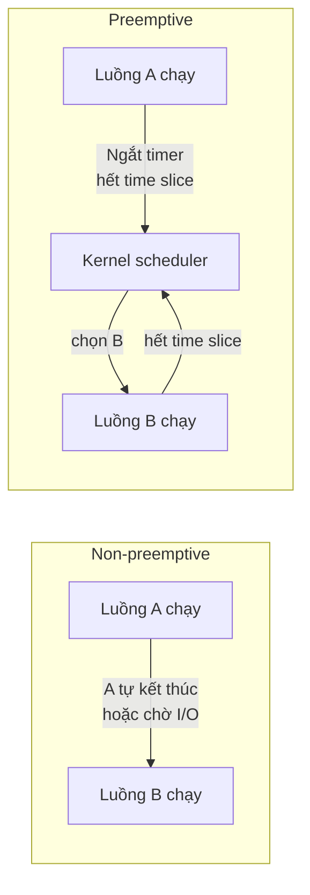
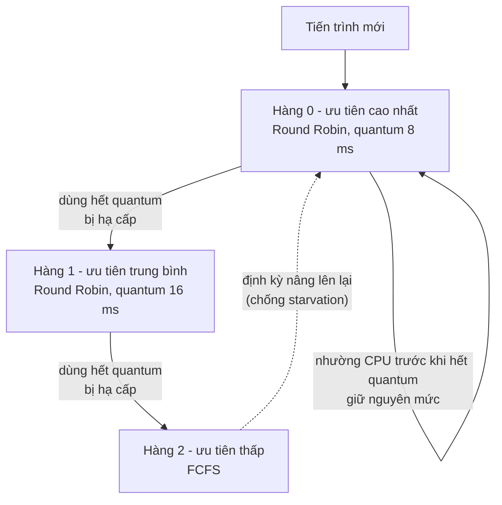
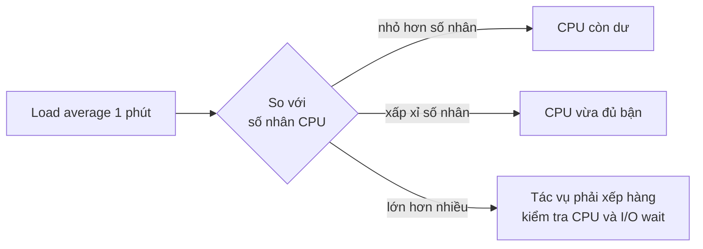

# Lập lịch CPU

**Lập lịch CPU** (CPU scheduling) là việc hệ điều hành quyết định **luồng nào được chạy trên nhân CPU nào, vào lúc nào và trong bao lâu**. Thành phần làm việc này gọi là **bộ lập lịch** (scheduler). Mỗi khi một luồng hết lượt, phải chờ I/O, hay có luồng mới sẵn sàng, scheduler lại chọn người kế tiếp từ hàng đợi ready theo một **thuật toán lập lịch** (scheduling algorithm).

**Tương tự đơn giản:** Hãy nghĩ tới **quầy giao dịch ngân hàng** chỉ có vài nhân viên (nhân CPU) nhưng hàng chục khách (tiến trình). Phục vụ ai đến trước làm trước (FCFS)? Ưu tiên khách có việc nhanh (SJF)? Mỗi khách chỉ được 5 phút rồi xếp lại cuối hàng (Round Robin)? Ưu tiên khách VIP (Priority)? Mỗi cách có cái lợi và cái hại: khách việc nhỏ phải chờ khách làm thủ tục vay vốn cả tiếng, hoặc khách thường bị VIP chen mãi không tới lượt.

---

:::note[Ghi nhớ nhanh]

- ⭐ **Không có thuật toán tốt nhất cho mọi tiêu chí** — tối ưu throughput, waiting time, response time hay công bằng thường mâu thuẫn nhau; OS thực tế dùng thuật toán lai.
- ⭐ **Preemptive (chiếm quyền) là chuẩn của OS hiện đại** — kernel có thể ngắt luồng đang chạy khi hết time slice, nên một vòng lặp vô hạn không treo cả máy. Event loop của Node.js thì ngược lại: không chiếm quyền, một callback chạy lâu chặn tất cả.
- **SJF cho waiting time trung bình nhỏ nhất** nhưng cần biết trước thời gian chạy; **Round Robin** công bằng, response time tốt, hiệu quả phụ thuộc time quantum.
- **Priority dễ gây starvation** (chết đói) — khắc phục bằng **aging** (tăng dần độ ưu tiên cho tiến trình chờ lâu).
- **Linux dùng CFS (từ 2.6.23) và EEVDF (từ 6.6)** — chia CPU theo trọng số `nice` thay vì hàng đợi ưu tiên cứng.

:::

---

## Mục lục

- [Vì sao cần bộ lập lịch?](#vì-sao-cần-bộ-lập-lịch)
- [1. Preemptive và non-preemptive](#1-preemptive-và-non-preemptive)
- [2. Tiêu chí đánh giá](#2-tiêu-chí-đánh-giá)
- [3. FCFS](#3-fcfs)
- [4. SJF và SRTF](#4-sjf-và-srtf)
- [5. Round Robin](#5-round-robin)
- [6. Priority scheduling](#6-priority-scheduling)
- [7. Multilevel feedback queue](#7-multilevel-feedback-queue)
- [8. Bộ lập lịch của Linux](#8-bộ-lập-lịch-của-linux)
- [9. CPU-bound, I/O-bound, nice và load average](#9-cpu-bound-io-bound-nice-và-load-average)
- [Khi nào cần nhớ?](#khi-nào-cần-nhớ)
- [Lỗi thường gặp](#lỗi-thường-gặp)
- [Câu hỏi phỏng vấn](#câu-hỏi-phỏng-vấn)

---

## Vì sao cần bộ lập lịch?

**Vấn đề:** Một máy 8 nhân có thể đang chứa hàng trăm tiến trình với hàng nghìn luồng. Phần lớn chúng đang ngủ chờ I/O, nhưng số luồng sẵn sàng chạy vẫn thường nhiều hơn số nhân. Nếu cứ để luồng nào đang chạy thì chạy mãi, một tác vụ nén video sẽ khiến con trỏ chuột đứng hình; nếu chuyển đổi quá thường xuyên, CPU tốn hết thời gian cho context switch.

**Giải pháp:** Scheduler cân bằng các mục tiêu: **giữ CPU luôn bận**, **phản hồi nhanh** cho tác vụ tương tác (gõ phím, request HTTP), **công bằng** giữa các tiến trình, và **tôn trọng độ ưu tiên** mà người dùng hoặc admin đặt ra.

:::tip[Dùng thực tế]

- **Chạy job nặng mà không ảnh hưởng server:** chạy backup, build, import dữ liệu với `nice -n 19` để nhường CPU cho app chính.
- **Đọc chỉ số giám sát:** hiểu load average 12 trên máy 4 nhân nghĩa là gì, vì sao CPU 100% mà app vẫn chậm.
- **Thiết kế job queue và worker:** các khái niệm FCFS, priority, starvation, aging áp dụng y hệt cho BullMQ, RabbitMQ priority queue hay Kubernetes scheduler.
- **Viết code Node.js không chặn:** event loop là một bộ lập lịch không chiếm quyền, hiểu điều này để biết vì sao phải chia nhỏ tác vụ dài.

:::

---

## 1. Preemptive và non-preemptive

| | Non-preemptive (không chiếm quyền) | Preemptive (chiếm quyền) |
| --- | --- | --- |
| **Khi nào đổi luồng** | Chỉ khi luồng đang chạy tự nhường: kết thúc, chờ I/O, gọi yield | Thêm cả khi hết time slice hoặc có luồng ưu tiên cao hơn sẵn sàng |
| **Cơ chế** | Luồng hợp tác (cooperative) | Kernel dùng ngắt timer để giành lại CPU |
| **Ưu điểm** | Đơn giản, ít context switch, ít lo race condition | Phản hồi tốt, một luồng lỗi không chiếm CPU mãi |
| **Nhược điểm** | Một luồng chạy lâu làm cả hệ thống đứng | Cần đồng bộ cẩn thận, tốn chi phí chuyển đổi |
| **Ví dụ** | Windows 3.1, Mac OS 9, **event loop của Node.js/trình duyệt** | Linux, Windows NT trở đi, macOS hiện đại |



Liên hệ với JavaScript: event loop chạy từng callback **cho tới khi xong** (run-to-completion), không ai ngắt được nó giữa chừng. Đó là lập lịch **hợp tác**:

```js
// Node.js: callback này chiếm luồng chính 5 giây, mọi request khác phải chờ
app.get('/report', (req, res) => {
  const end = Date.now() + 5000;
  while (Date.now() < end) {} // "vòng lặp bận", event loop không thể chen vào
  res.send('xong');
});

// Cách hợp tác: chia việc thành từng mẻ nhỏ, nhường event loop giữa các mẻ
async function processInChunks(items, handle, chunkSize = 1000) {
  for (let i = 0; i < items.length; i += chunkSize) {
    items.slice(i, i + chunkSize).forEach(handle);
    // Nhường lượt cho I/O và các callback khác trước khi làm mẻ tiếp theo
    await new Promise((resolve) => setImmediate(resolve));
  }
}
```

---

## 2. Tiêu chí đánh giá

| Tiêu chí | Định nghĩa | Muốn |
| --- | --- | --- |
| **CPU utilization** | Tỉ lệ thời gian CPU bận làm việc có ích | Cao |
| **Throughput** (thông lượng) | Số tiến trình hoàn thành trong một đơn vị thời gian | Cao |
| **Turnaround time** (thời gian hoàn thành) | Thời điểm kết thúc − thời điểm đến | Thấp |
| **Waiting time** (thời gian chờ) | Tổng thời gian nằm trong hàng đợi ready = turnaround − burst | Thấp |
| **Response time** (thời gian phản hồi) | Thời điểm được chạy lần đầu − thời điểm đến | Thấp, quan trọng với tác vụ tương tác |
| **Fairness** (công bằng) | Không ai bị bỏ đói | Cao |

Trong đó **burst time** là lượng thời gian CPU mà tiến trình cần (trong một đợt chạy).

---

## 3. FCFS

**FCFS** (First-Come, First-Served — đến trước phục vụ trước) là thuật toán đơn giản nhất: một hàng đợi FIFO, không chiếm quyền.

Ví dụ: ba tiến trình cùng đến lúc 0, burst time lần lượt P1 = 24, P2 = 3, P3 = 3 (đơn vị ms).

**Thứ tự đến P1, P2, P3:**

```mermaid
gantt
  title FCFS theo thứ tự P1, P2, P3
  dateFormat X
  axisFormat %s
  section CPU
  P1 : 0, 24
  P2 : 24, 27
  P3 : 27, 30
```



| Tiến trình | Burst | Bắt đầu | Kết thúc | Turnaround | Waiting |
| --- | --- | --- | --- | --- | --- |
| P1 | 24 | 0 | 24 | 24 | 0 |
| P2 | 3 | 24 | 27 | 27 | 24 |
| P3 | 3 | 27 | 30 | 30 | 27 |
| **Trung bình** | | | | **27** | **17** |

Nếu thứ tự đến là P2, P3, P1 thì waiting time lần lượt là 0, 3, 6, trung bình chỉ **3 ms** — chênh gần 6 lần chỉ vì thứ tự. Hiện tượng các tiến trình ngắn phải xếp hàng sau một tiến trình dài gọi là **convoy effect** (hiệu ứng đoàn xe).

- **Ưu điểm:** dễ cài đặt, công bằng theo thứ tự đến, không starvation.
- **Nhược điểm:** waiting time trung bình phụ thuộc thứ tự, tệ cho hệ thống tương tác.

---

## 4. SJF và SRTF

**SJF** (Shortest Job First) chọn tiến trình có **burst time ngắn nhất** chạy trước. Có thể chứng minh SJF cho **waiting time trung bình nhỏ nhất** trong các thuật toán không chiếm quyền với cùng tập tiến trình. Bản chiếm quyền gọi là **SRTF** (Shortest Remaining Time First): khi tiến trình mới đến có thời gian còn lại ngắn hơn tiến trình đang chạy, nó chiếm CPU ngay.

Ví dụ với thời điểm đến khác nhau:

| Tiến trình | Thời điểm đến | Burst |
| --- | --- | --- |
| P1 | 0 | 8 |
| P2 | 1 | 4 |
| P3 | 2 | 9 |
| P4 | 3 | 5 |

**SJF (không chiếm quyền):** lúc 0 chỉ có P1 nên P1 chạy hết 0–8. Lúc 8, chọn ngắn nhất trong P2 (4), P4 (5), P3 (9).

| Tiến trình | Chạy | Kết thúc | Turnaround | Waiting |
| --- | --- | --- | --- | --- |
| P1 | 0–8 | 8 | 8 | 0 |
| P2 | 8–12 | 12 | 11 | 7 |
| P4 | 12–17 | 17 | 14 | 9 |
| P3 | 17–26 | 26 | 24 | 15 |
| **Trung bình** | | | **14,25** | **7,75** |

**SRTF (chiếm quyền):** lúc 1, P2 đến với 4 ms, ít hơn 7 ms còn lại của P1, nên P2 chiếm CPU.

```mermaid
gantt
  title SRTF cho P1 đến P4
  dateFormat X
  axisFormat %s
  section CPU
  P1 : 0, 1
  P2 : 1, 5
  P4 : 5, 10
  P1 tiếp : 10, 17
  P3 : 17, 26
```



| Tiến trình | Kết thúc | Turnaround | Waiting |
| --- | --- | --- | --- |
| P1 | 17 | 17 | 9 |
| P2 | 5 | 4 | 0 |
| P3 | 26 | 24 | 15 |
| P4 | 10 | 7 | 2 |
| **Trung bình** | | **13** | **6,5** |

Vấn đề thực tế: OS **không biết trước** một tiến trình sẽ cần CPU bao lâu. Người ta chỉ có thể **ước lượng** dựa vào lịch sử, ví dụ trung bình mũ (exponential average) của các burst trước. Ngoài ra tiến trình dài có thể bị **starvation** nếu tiến trình ngắn đến liên tục.

---

## 5. Round Robin

**Round Robin (RR)** chia thời gian thành các lượt nhỏ gọi là **time quantum** (hay time slice). Mỗi tiến trình được chạy tối đa một quantum, hết lượt mà chưa xong thì bị chiếm quyền và xếp lại **cuối hàng**.

Quay lại ví dụ P1 = 24, P2 = 3, P3 = 3 cùng đến lúc 0, với **quantum = 4 ms**:

```mermaid
gantt
  title Round Robin với quantum 4
  dateFormat X
  axisFormat %s
  section CPU
  P1 : 0, 4
  P2 : 4, 7
  P3 : 7, 10
  P1 tiếp : 10, 30
```



| Tiến trình | Kết thúc | Turnaround | Waiting | Response |
| --- | --- | --- | --- | --- |
| P1 | 30 | 30 | 6 | 0 |
| P2 | 7 | 7 | 4 | 4 |
| P3 | 10 | 10 | 7 | 7 |
| **Trung bình** | | **15,67** | **5,67** | **3,67** |

So với FCFS (waiting trung bình 17), RR tốt hơn nhiều vì P2, P3 không phải chờ P1 chạy hết.

**Chọn quantum thế nào:**

| Quantum | Hệ quả |
| --- | --- |
| **Rất lớn** | RR thoái hoá thành FCFS |
| **Rất nhỏ** | Phản hồi nhanh nhưng phần lớn thời gian dành cho context switch |
| **Hợp lý** | Lớn hơn nhiều so với chi phí context switch (vài µs); quy tắc kinh nghiệm: khoảng 80% số burst CPU ngắn hơn quantum. Thực tế thường từ vài ms đến vài chục ms |

Mô phỏng Round Robin bằng TypeScript để tự kiểm tra bảng trên:

```ts
// TypeScript: mô phỏng Round Robin, các tiến trình đều đến lúc 0
interface Proc { readonly name: string; readonly burst: number }

function roundRobin(procs: readonly Proc[], quantum: number) {
  const remaining = new Map(procs.map((p) => [p.name, p.burst]));
  const queue = procs.map((p) => p.name);
  const finish = new Map<string, number>();
  let time = 0;

  while (queue.length > 0) {
    const name = queue.shift()!;
    const run = Math.min(quantum, remaining.get(name)!);
    time += run;
    const left = remaining.get(name)! - run;
    remaining.set(name, left);
    if (left > 0) queue.push(name); // chưa xong, xếp lại cuối hàng
    else finish.set(name, time);
  }

  // waiting = turnaround - burst (vì thời điểm đến = 0)
  return procs.map((p) => ({ name: p.name, waiting: finish.get(p.name)! - p.burst }));
}

console.log(roundRobin([{ name: 'P1', burst: 24 }, { name: 'P2', burst: 3 }, { name: 'P3', burst: 3 }], 4));
// [ { name: 'P1', waiting: 6 }, { name: 'P2', waiting: 4 }, { name: 'P3', waiting: 7 } ]
```

---

## 6. Priority scheduling

Mỗi tiến trình có một **độ ưu tiên** (priority), scheduler luôn chọn tiến trình ưu tiên cao nhất (có thể chiếm quyền hoặc không). SJF thực chất là một dạng priority với "ưu tiên = burst ngắn".

- **Starvation** (chết đói): tiến trình ưu tiên thấp có thể **không bao giờ** được chạy nếu tiến trình ưu tiên cao liên tục đến. Có giai thoại rằng khi tắt máy IBM 7094 ở MIT năm 1973, người ta tìm thấy một tiến trình ưu tiên thấp được nộp từ năm 1967 vẫn chưa chạy.
- **Aging** (lão hoá): định kỳ **tăng độ ưu tiên** cho tiến trình chờ lâu, đảm bảo cuối cùng ai cũng tới lượt.
- **Priority inversion** (đảo ngược ưu tiên): tiến trình ưu tiên cao chờ khoá mà tiến trình ưu tiên thấp đang giữ, trong khi tiến trình ưu tiên trung bình chiếm CPU. Sự cố nổi tiếng: tàu Mars Pathfinder (1997) bị reset liên tục vì lỗi này; cách sửa là **priority inheritance** (tạm nâng ưu tiên cho tiến trình giữ khoá).

Java cho phép gợi ý độ ưu tiên luồng, nhưng đó **chỉ là gợi ý** — trên Linux, JVM mặc định bỏ qua nó:

```java
// Java: priority từ 1 (MIN) đến 10 (MAX), mặc định 5 (NORM)
Thread background = new Thread(() -> rebuildSearchIndex());
background.setPriority(Thread.MIN_PRIORITY); // chỉ là gợi ý cho OS
background.start();

// Cách đáng tin hơn: tách job nặng ra pool riêng, giới hạn số luồng
ExecutorService reportPool = Executors.newFixedThreadPool(2);
reportPool.submit(() -> generateMonthlyReport());
```

---

## 7. Multilevel feedback queue

**MLFQ** (Multilevel Feedback Queue) dùng **nhiều hàng đợi** với độ ưu tiên khác nhau, và **di chuyển** tiến trình giữa các hàng đợi dựa trên hành vi thực tế — nhờ đó không cần biết trước burst time.



Quy tắc cơ bản:

1. Tiến trình mới vào hàng ưu tiên cao nhất.
2. Dùng **hết** quantum → có vẻ là tác vụ tính toán (CPU-bound) → **hạ cấp**.
3. Nhường CPU **trước khi hết** quantum (vì chờ I/O) → có vẻ là tác vụ tương tác → **giữ mức cao**.
4. Định kỳ **nâng tất cả** lên hàng cao nhất (priority boost) để chống starvation.

Kết quả: tác vụ tương tác (editor, shell) được phản hồi nhanh, tác vụ dài vẫn được chạy. Các bộ lập lịch của Windows và macOS dựa trên ý tưởng hàng đợi ưu tiên có điều chỉnh động tương tự.

---

## 8. Bộ lập lịch của Linux

| Bộ lập lịch | Thời gian | Ý tưởng chính |
| --- | --- | --- |
| **O(1) scheduler** | Linux 2.6.0 đến 2.6.22 | Mảng hàng đợi theo priority, chọn luồng trong thời gian hằng số |
| **CFS** (Completely Fair Scheduler) | Linux 2.6.23 (2007) đến 6.5 | Mô phỏng một CPU "lý tưởng" chia đều cho mọi luồng |
| **EEVDF** (Earliest Eligible Virtual Deadline First) | Từ Linux 6.6 (2023) | Kế thừa ý tưởng công bằng của CFS, bổ sung "deadline ảo" để xử lý độ trễ tốt hơn |

Ở mức khái niệm, **CFS** hoạt động như sau:

- Mỗi luồng có **vruntime** (virtual runtime) — thời gian CPU đã dùng, được **điều chỉnh theo trọng số**: luồng ưu tiên cao (nice thấp) có vruntime tăng chậm hơn.
- Các luồng ready được lưu trong **cây đỏ đen** (red-black tree) sắp theo vruntime.
- Scheduler luôn chọn luồng có **vruntime nhỏ nhất** (bị "thiệt" nhiều nhất) để chạy.
- Luồng ngủ lâu chờ I/O khi thức dậy có vruntime thấp, nên được chạy sớm, giúp tác vụ tương tác mượt.

**EEVDF** giữ ý tưởng chia CPU theo trọng số, nhưng mỗi luồng còn có một **deadline ảo** (virtual deadline) phụ thuộc vào độ dài lượt chạy nó yêu cầu; trong các luồng "đủ điều kiện" (chưa dùng vượt phần của mình), luồng có deadline sớm nhất được chạy trước. Nhờ đó luồng cần độ trễ thấp được phục vụ nhanh hơn mà không cần nhiều quy tắc heuristic như CFS.

Ngoài ra Linux có các lớp lập lịch **thời gian thực** (`SCHED_FIFO`, `SCHED_RR`, `SCHED_DEADLINE`) luôn được ưu tiên trước các luồng thường.

---

## 9. CPU-bound, I/O-bound, nice và load average

| | CPU-bound | I/O-bound |
| --- | --- | --- |
| **Đặc điểm** | Phần lớn thời gian tính toán, burst CPU dài | Phần lớn thời gian chờ đĩa, mạng, DB; burst CPU ngắn |
| **Ví dụ** | Nén video, mã hoá, build webpack, tính hash mật khẩu | Web API gọi DB, proxy, crawler |
| **Scheduler đối xử** | Bị hạ ưu tiên dần (MLFQ) hoặc vruntime tăng nhanh | Được chạy sớm khi thức dậy để phản hồi nhanh |
| **Scale bằng** | Thêm nhân CPU, chia việc ra nhiều luồng/process | Bất đồng bộ, tăng số tác vụ đồng thời |
| **Trong Node.js** | Làm nghẽn event loop, cần `worker_threads` | Điểm mạnh của event loop |

### nice

`nice` là giá trị từ **-20** (ưu tiên cao nhất) đến **19** (thấp nhất), mặc định **0**. Với CFS, chênh nhau 1 mức nice tương ứng khoảng **10% CPU** khi hai luồng tranh nhau (trọng số chênh khoảng 1,25 lần). User thường chỉ được **tăng** nice (giảm ưu tiên); muốn giảm nice cần quyền root.

```bash
# Chạy backup với ưu tiên thấp nhất để không ảnh hưởng app
nice -n 19 pg_dump mydb > backup.sql

# Đổi nice của process đang chạy (PID 1234)
renice -n 10 -p 1234

# Cột NI trong top/htop là giá trị nice, PR là priority kernel dùng
top
```

### Load average

```bash
uptime
# 10:15:01 up 12 days,  3:02,  2 users,  load average: 3.52, 2.10, 1.05
```

Ba con số là **trung bình trượt** (có trọng số mũ) của số tác vụ đang chạy hoặc chờ CPU trong **1, 5 và 15 phút** gần nhất. Trên Linux, con số này còn tính cả tác vụ ở trạng thái **D** (uninterruptible sleep, thường là đang chờ đĩa) nên load cao chưa chắc là do CPU.



Ví dụ trên máy 4 nhân: load 2 là còn dư một nửa; load 4 là vừa đủ; load 12 nghĩa là trung bình 8 tác vụ đang phải chờ. So sánh 3 con số để biết xu hướng: `3.52, 2.10, 1.05` là tải **đang tăng**.

---

## Khi nào cần nhớ?

- **Vận hành server:**
  - Đọc load average so với số nhân (`nproc`), phân biệt CPU bận (`%us`, `%sy` trong `top`) và chờ I/O (`%wa`).
  - Chạy job nền bằng `nice`/`ionice` để không tranh tài nguyên với app chính.
- **Thiết kế hệ thống hàng đợi:**
  - Job ưu tiên cần cơ chế chống starvation (aging hoặc hạn mức cho từng mức ưu tiên).
  - Tách hàng đợi cho job ngắn và job dài để tránh convoy effect.
- **Viết code Node.js:** coi event loop như scheduler không chiếm quyền — callback nào cũng phải ngắn.
- **Container:** giới hạn CPU của Docker/Kubernetes (`--cpus`, `resources.limits.cpu`) được thực thi bằng cơ chế CFS bandwidth control của cgroup; vượt quota sẽ bị **throttle** (tạm dừng) dù máy còn CPU rảnh.

---

## Lỗi thường gặp

### Lỗi 1: Nghĩ CPU 100% là hệ thống quá tải

CPU 100% với load average bằng số nhân chỉ là CPU đang làm việc hết công suất. Quá tải là khi **hàng đợi** dài (load lớn hơn nhiều so với số nhân) và độ trễ tăng. Ngược lại, load cao mà CPU thấp thường là nghẽn I/O.

### Lỗi 2: Đặt thread priority để "sửa" hiệu năng Java

`Thread.setPriority` trên Linux mặc định không có tác dụng. Cách đúng là giới hạn số luồng của từng loại việc (pool riêng), hoặc tách tác vụ nặng ra process/service khác.

### Lỗi 3: Priority queue không có chống starvation

Hệ thống job chỉ lấy job ưu tiên cao trước: khi tải cao, job ưu tiên thấp (gửi email tổng hợp, dọn dữ liệu) nằm chờ hàng ngày. Cần aging hoặc chia tỉ lệ (ví dụ 4 job cao thì 1 job thấp).

### Lỗi 4: Giới hạn CPU container quá thấp cho app đa luồng

Đặt `limits.cpu: 1` cho JVM có hàng chục luồng GC và JIT: các luồng dùng hết quota trong vài ms đầu của mỗi chu kỳ 100 ms rồi bị throttle, latency p99 tăng vọt. Theo dõi chỉ số throttling của cgroup và đặt limit phù hợp.

### Lỗi 5: Dùng vòng lặp bận để chờ

`while (!ready) {}` để chờ cờ thay đổi chiếm trọn một nhân và, trong JS, cờ sẽ không bao giờ đổi vì event loop bị chặn. Hãy dùng sự kiện, Promise, `await` hoặc cơ chế chờ của OS (condition variable, `Thread.sleep`).

---

## Câu hỏi phỏng vấn

Những câu thường gặp về chủ đề này. Tự trả lời trước, rồi bấm **Xem đáp án** để đối chiếu.

**1. Preemptive và non-preemptive scheduling khác nhau thế nào?**

<details className="qa">
<summary>Xem đáp án</summary>

- **Non-preemptive:** luồng chạy cho tới khi tự nhường (kết thúc, chờ I/O, yield). Đơn giản nhưng một luồng chạy lâu chặn tất cả. Event loop của Node.js/trình duyệt hoạt động kiểu này với từng callback.
- **Preemptive:** kernel dùng ngắt timer để giành lại CPU khi hết time slice hoặc có luồng ưu tiên cao hơn. Phản hồi tốt và an toàn hơn, đổi lại phải đồng bộ cẩn thận vì luồng có thể bị ngắt ở bất kỳ đâu. Mọi OS phổ biến hiện nay đều preemptive.

</details>

**2. Cho P1 = 24, P2 = 3, P3 = 3 (đều đến lúc 0). Tính waiting time trung bình với FCFS và Round Robin quantum 4.**

<details className="qa">
<summary>Xem đáp án</summary>

- **FCFS** (P1, P2, P3): waiting = 0, 24, 27 → trung bình **17**.
- **RR q = 4:** lịch chạy P1 (0–4), P2 (4–7), P3 (7–10), P1 (10–30). Waiting = turnaround − burst = 30 − 24 = 6, 7 − 3 = 4, 10 − 3 = 7 → trung bình 17/3 ≈ **5,67**.

RR tốt hơn vì các tiến trình ngắn không bị kẹt sau tiến trình dài (convoy effect).

</details>

**3. Starvation là gì? Khắc phục thế nào?**

<details className="qa">
<summary>Xem đáp án</summary>

Starvation là khi một tiến trình **chờ mãi không được chạy** vì luôn có tiến trình khác được ưu tiên hơn, thường gặp với priority scheduling và SJF/SRTF (tiến trình dài bị tiến trình ngắn chen liên tục).

Khắc phục bằng **aging**: tăng dần độ ưu tiên theo thời gian chờ; hoặc định kỳ nâng tất cả lên mức cao nhất như MLFQ; hoặc dùng thuật toán theo phần chia công bằng như CFS.

</details>

**4. Vì sao SJF tối ưu về lý thuyết nhưng khó dùng trong thực tế?**

<details className="qa">
<summary>Xem đáp án</summary>

SJF cho waiting time trung bình nhỏ nhất (với một tập tiến trình cho trước, khi xét các thuật toán không chiếm quyền), nhưng cần **biết trước burst time**, điều mà OS không thể biết. Chỉ có thể ước lượng từ lịch sử (trung bình mũ). Ngoài ra nó có thể làm tiến trình dài bị starvation. MLFQ là cách thực tế để xấp xỉ SJF: quan sát hành vi để đoán tiến trình nào ngắn/tương tác.

</details>

**5. Load average là gì? Load 6 trên máy 4 nhân có đáng lo không?**

<details className="qa">
<summary>Xem đáp án</summary>

Load average là trung bình trượt số tác vụ đang chạy hoặc chờ chạy trong 1, 5, 15 phút; trên Linux tính cả tác vụ chờ I/O không ngắt được (trạng thái D).

Load 6 trên 4 nhân nghĩa là trung bình có khoảng 2 tác vụ phải chờ. Cần xem xu hướng (3 con số tăng hay giảm) và nguyên nhân: nếu `%wa` cao thì nghẽn ở đĩa, nếu `%us` cao thì thật sự thiếu CPU. Thoáng qua thì bình thường, kéo dài thì cần scale hoặc tối ưu.

</details>

**6. Linux CFS chọn luồng chạy tiếp theo như thế nào?**

<details className="qa">
<summary>Xem đáp án</summary>

Mỗi luồng có **vruntime** — thời gian CPU đã dùng chia theo trọng số (phụ thuộc giá trị nice). Các luồng ready được lưu trong cây đỏ đen theo vruntime, scheduler luôn chọn luồng có vruntime nhỏ nhất (nút trái nhất). Luồng ưu tiên cao có vruntime tăng chậm hơn nên được chạy nhiều hơn. Từ Linux 6.6, CFS được thay bằng **EEVDF**, vẫn chia CPU theo trọng số nhưng chọn luồng đủ điều kiện có deadline ảo sớm nhất, giúp kiểm soát độ trễ tốt hơn.

</details>
