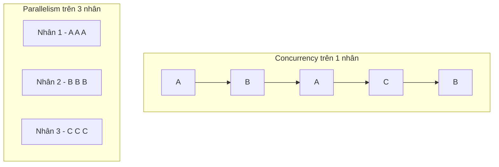
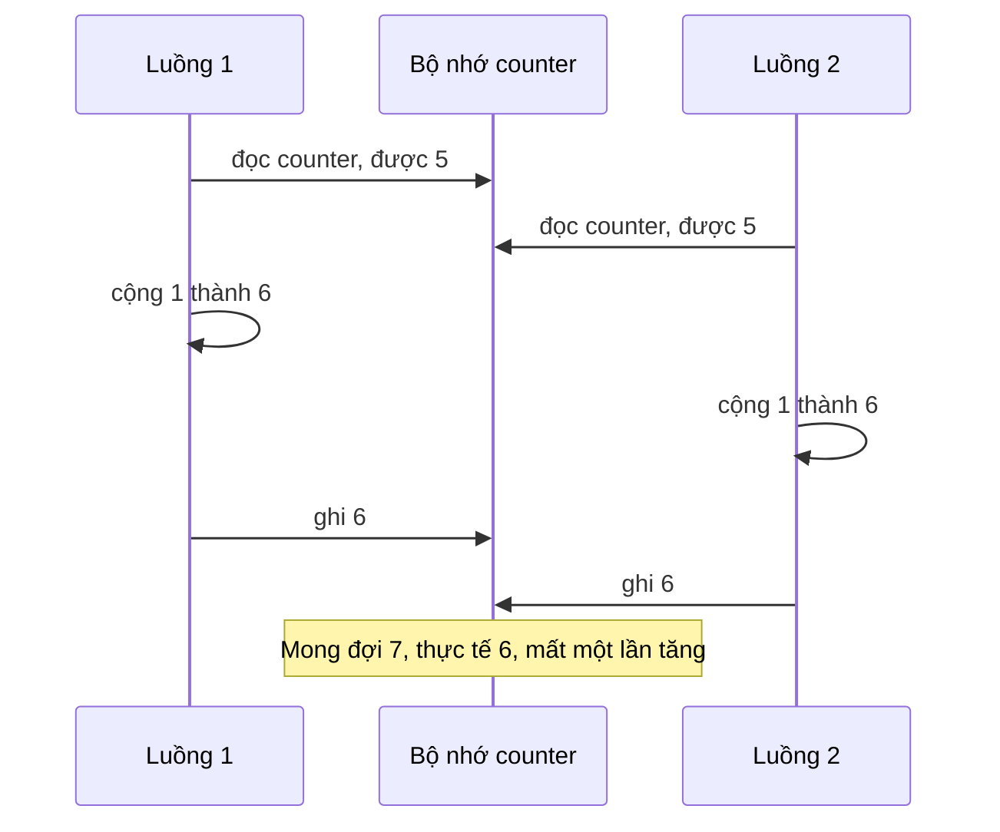
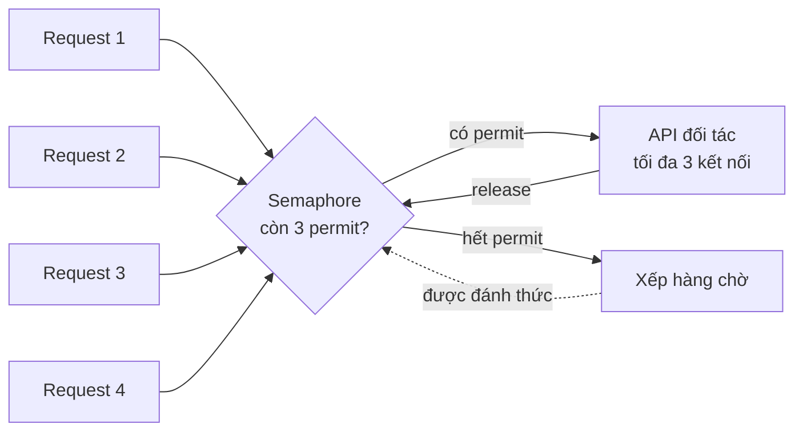
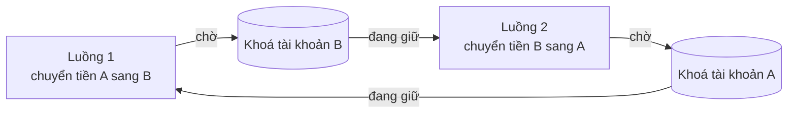

# Đồng thời và đồng bộ

**Đồng thời** (concurrency) là khả năng một hệ thống **xử lý nhiều công việc trong cùng một khoảng thời gian**, bằng cách xen kẽ chúng hoặc chạy chúng thật sự song song. Khi nhiều luồng (hoặc nhiều tác vụ bất đồng bộ) cùng đọc/ghi một dữ liệu chung, kết quả có thể sai tuỳ thứ tự thực thi. **Đồng bộ** (synchronization) là tập hợp các kỹ thuật — lock, mutex, semaphore, thao tác nguyên tử — để kiểm soát thứ tự đó và giữ dữ liệu đúng.

**Tương tự đơn giản:** Hai người cùng rút tiền từ **một tài khoản chung** ở hai cây ATM khác nhau vào cùng một giây. Cả hai máy cùng đọc số dư 1 triệu, cùng cho rút 800 nghìn, cùng ghi lại số dư 200 nghìn. Ngân hàng mất 800 nghìn. **Lock** giống như quy định "mỗi lần chỉ một máy được mở sổ tài khoản này": máy thứ hai phải đợi máy thứ nhất ghi xong.

---

:::note[Ghi nhớ nhanh]

- ⭐ **Race condition xảy ra khi kết quả phụ thuộc thứ tự xen kẽ** của các thao tác trên dữ liệu chung — `counter++` không nguyên tử (đọc, cộng, ghi là 3 bước) nên hai luồng cùng tăng sẽ mất cập nhật.
- ⭐ **Không có thread vẫn có race** — trong JavaScript, mọi `await` giữa bước "đọc" và bước "ghi" là một chỗ hở để tác vụ khác chen vào.
- **Mutex** cho đúng một luồng vào critical section; **semaphore** đếm, cho tối đa N luồng (ví dụ giới hạn N kết nối).
- **Deadlock cần đủ 4 điều kiện Coffman**: loại trừ lẫn nhau, giữ và chờ, không chiếm quyền, chờ vòng tròn — phá một điều kiện là phòng được, cách phổ biến nhất là **khoá theo thứ tự cố định**.
- **Database cũng là bài toán đồng thời** — dùng `UPDATE ... SET x = x - 1` nguyên tử, `SELECT ... FOR UPDATE` hoặc optimistic locking với cột version.

:::

---

## Mục lục

- [Vì sao cần đồng bộ?](#vì-sao-cần-đồng-bộ)
- [1. Concurrency và parallelism](#1-concurrency-và-parallelism)
- [2. Race condition](#2-race-condition)
- [3. Critical section, lock và mutex](#3-critical-section-lock-và-mutex)
- [4. Semaphore](#4-semaphore)
- [5. Thao tác nguyên tử](#5-thao-tác-nguyên-tử)
- [6. Deadlock](#6-deadlock)
- [7. Livelock và starvation](#7-livelock-và-starvation)
- [8. Race condition trong async JavaScript](#8-race-condition-trong-async-javascript)
- [9. Lock ở database](#9-lock-ở-database)
- [Khi nào cần nhớ?](#khi-nào-cần-nhớ)
- [Lỗi thường gặp](#lỗi-thường-gặp)
- [Câu hỏi phỏng vấn](#câu-hỏi-phỏng-vấn)

---

## Vì sao cần đồng bộ?

**Vấn đề:** CPU ngày nay có nhiều nhân, server Java xử lý hàng trăm request trên hàng trăm luồng, app Node.js chạy nhiều instance cùng ghi vào một database. Bất cứ khi nào có **dữ liệu chung** và **nhiều bên cùng sửa**, ta có nguy cơ: bán vượt số vé, trừ tiền hai lần, đếm lượt xem sai, cache bị ghi đè bằng dữ liệu cũ. Tệ hơn, các lỗi này **không tái hiện ổn định** — chạy thử 100 lần đúng, lên production lúc tải cao mới sai.

**Giải pháp:** Xác định chính xác **critical section** (đoạn code đụng vào dữ liệu chung), rồi dùng công cụ phù hợp để đảm bảo các thao tác trong đó diễn ra **như một khối không thể chia cắt**: thao tác nguyên tử cho phép tính đơn giản, mutex/lock cho đoạn code dài hơn, semaphore để giới hạn số người dùng đồng thời, và lock/transaction của database khi dữ liệu nằm trong DB.

:::tip[Dùng thực tế]

- **Thương mại điện tử:** chống bán vượt tồn kho khi flash sale, mỗi đơn hàng trừ kho đúng một lần.
- **Thanh toán:** tránh trừ tiền hai lần khi user bấm nút hai lần hoặc client retry (kết hợp idempotency key).
- **Giới hạn tài nguyên:** chỉ cho tối đa 10 request đồng thời tới API đối tác, 20 kết nối tới DB.
- **Code frontend:** user gõ nhanh vào ô tìm kiếm, response cũ về sau ghi đè kết quả mới (race giữa các request).

:::

---

## 1. Concurrency và parallelism

| | Concurrency (đồng thời) | Parallelism (song song) |
| --- | --- | --- |
| **Định nghĩa** | Nhiều việc **tiến triển** trong cùng khoảng thời gian | Nhiều việc **thực thi cùng một thời điểm** |
| **Cần đa nhân?** | Không, một nhân xen kẽ cũng được | Có, cần nhiều nhân/CPU |
| **Mục tiêu** | Cấu trúc chương trình xử lý nhiều việc, không bị chặn khi chờ | Tăng tốc độ tính toán |
| **Ví dụ** | Node.js một luồng phục vụ 10.000 kết nối | Chia ảnh 4K thành 8 phần xử lý trên 8 nhân |



Câu nói nổi tiếng của Rob Pike: *"Concurrency is about dealing with lots of things at once. Parallelism is about doing lots of things at once."* Lưu ý: race condition **không cần** đa nhân. Trên một nhân, luồng vẫn có thể bị ngắt giữa chừng (preemption) và luồng khác chen vào. Với đa nhân, vấn đề còn phức tạp thêm vì mỗi nhân có cache riêng và CPU/compiler có thể **sắp xếp lại** (reorder) thứ tự đọc/ghi bộ nhớ; đó là lý do các ngôn ngữ có **memory model** và từ khoá như `volatile` trong Java.

---

## 2. Race condition

**Race condition** (điều kiện tranh chấp) là lỗi khi kết quả của chương trình phụ thuộc vào **thứ tự xen kẽ không kiểm soát** của các luồng.

Câu lệnh `counter++` trông như một bước, nhưng CPU thực hiện 3 bước: **đọc** giá trị vào thanh ghi, **cộng** 1, **ghi** lại bộ nhớ. Hai luồng xen kẽ như sau sẽ mất một lần tăng:



Tái hiện trong Java:

```java
// Java: hai luồng cùng tăng một biến chung 1 triệu lần
public class RaceDemo {
    private static int counter = 0;

    public static void main(String[] args) throws InterruptedException {
        Runnable task = () -> {
            for (int i = 0; i < 1_000_000; i++) {
                counter++; // không nguyên tử: đọc - cộng - ghi
            }
        };
        Thread t1 = new Thread(task);
        Thread t2 = new Thread(task);
        t1.start(); t2.start();
        t1.join(); t2.join();
        // Mong đợi 2000000, thực tế thường nhỏ hơn và mỗi lần chạy một khác
        System.out.println("counter = " + counter);
    }
}
```

Tái hiện trong Node.js với `worker_threads` và `SharedArrayBuffer` (bộ nhớ thật sự dùng chung giữa các luồng):

```js
// Node.js: hai worker cùng tăng một ô nhớ dùng chung
const { Worker, isMainThread, workerData } = require('node:worker_threads');

if (isMainThread) {
  const shared = new SharedArrayBuffer(4); // 4 byte = một Int32
  const counter = new Int32Array(shared);
  let done = 0;
  for (let i = 0; i < 2; i++) {
    const w = new Worker(__filename, { workerData: shared });
    w.on('exit', () => {
      done += 1;
      // Mong đợi 2000000, thực tế thường nhỏ hơn
      if (done === 2) console.log('counter =', counter[0]);
    });
  }
} else {
  const counter = new Int32Array(workerData);
  for (let i = 0; i < 1_000_000; i++) {
    counter[0]++; // đọc - cộng - ghi, không nguyên tử
  }
}
```

---

## 3. Critical section, lock và mutex

**Critical section** (vùng găng) là đoạn code truy cập dữ liệu chung, mà tại mỗi thời điểm **chỉ được phép có một luồng** thực thi. Một giải pháp đúng cho bài toán critical section cần:

1. **Loại trừ lẫn nhau** (mutual exclusion): tối đa một luồng ở trong.
2. **Tiến triển** (progress): nếu không ai ở trong, một luồng muốn vào phải được vào.
3. **Chờ có giới hạn** (bounded waiting): không luồng nào phải chờ mãi.

**Lock** / **mutex** (mutual exclusion) là công cụ phổ biến nhất: luồng **acquire** (lấy khoá) trước khi vào critical section và **release** (trả khoá) khi ra. Luồng khác đến lấy khoá khi khoá đang bị giữ sẽ bị **chặn** (ngủ) cho đến khi khoá được trả. Mutex có khái niệm **chủ sở hữu**: luồng nào khoá thì chỉ luồng đó được mở.

```java
// Java cách 1: synchronized, JVM tự lấy và trả khoá kể cả khi có exception
public class Counter {
    private int value = 0;

    public synchronized void increment() {
        value++; // chỉ một luồng chạy được dòng này tại một thời điểm
    }

    public synchronized int get() {
        return value;
    }
}

// Java cách 2: ReentrantLock, linh hoạt hơn (tryLock, timeout, fairness)
private final ReentrantLock lock = new ReentrantLock();

public void transfer(Account from, Account to, long amount) {
    lock.lock();
    try {
        from.withdraw(amount);
        to.deposit(amount);
    } finally {
        lock.unlock(); // luôn trả khoá trong finally
    }
}
```

| Công cụ | Mô tả | Khi nào dùng |
| --- | --- | --- |
| **Mutex / lock** | Một luồng giữ khoá, luồng khác ngủ chờ | Critical section bất kỳ |
| **Spinlock** | Luồng chờ bằng vòng lặp kiểm tra liên tục, không ngủ | Critical section cực ngắn, chủ yếu trong kernel; tránh dùng ở tầng ứng dụng |
| **Read-write lock** | Nhiều luồng đọc cùng lúc, ghi thì độc quyền | Dữ liệu đọc nhiều ghi ít (`ReentrantReadWriteLock`) |
| **Reentrant lock** | Luồng đang giữ khoá có thể lấy lại chính khoá đó | Phương thức đồng bộ gọi phương thức đồng bộ khác |

---

## 4. Semaphore

**Semaphore** (do Dijkstra đề xuất) là một biến đếm với hai thao tác nguyên tử:

- **wait** (còn gọi là P, `acquire`): giảm bộ đếm; nếu bộ đếm đã về 0 thì chờ.
- **signal** (còn gọi là V, `release`): tăng bộ đếm, đánh thức một luồng đang chờ.

| | Binary semaphore | Counting semaphore | Mutex |
| --- | --- | --- | --- |
| **Giá trị** | 0 hoặc 1 | 0 đến N | Khoá/mở |
| **Số luồng vào cùng lúc** | 1 | Tối đa N | 1 |
| **Chủ sở hữu** | Không, luồng khác có thể release | Không | Có, chỉ luồng giữ khoá được mở |
| **Dùng cho** | Báo hiệu giữa các luồng | Giới hạn tài nguyên có N bản: kết nối, slot | Bảo vệ critical section |



Ví dụ Java: chỉ cho tối đa 10 luồng gọi API đối tác cùng lúc.

```java
// Java: counting semaphore giới hạn 10 lời gọi đồng thời
private final Semaphore permits = new Semaphore(10);

public String callPartner(String payload) throws InterruptedException {
    permits.acquire(); // hết permit thì chờ ở đây
    try {
        return httpClient.post("/partner", payload);
    } finally {
        permits.release(); // trả permit cho luồng khác
    }
}
```

Trong Node.js không có luồng chặn, nhưng ý tưởng semaphore vẫn dùng để **giới hạn số Promise chạy đồng thời** (thư viện `p-limit` làm đúng việc này):

```ts
// TypeScript: semaphore bất đồng bộ đơn giản
class AsyncSemaphore {
  private readonly waiters: Array<() => void> = [];
  constructor(private permits: number) {}

  async acquire(): Promise<void> {
    if (this.permits > 0) { this.permits -= 1; return; }
    await new Promise<void>((resolve) => this.waiters.push(resolve)); // xếp hàng
  }

  release(): void {
    const next = this.waiters.shift();
    if (next) next();          // chuyển permit thẳng cho người đang chờ
    else this.permits += 1;
  }
}

const sem = new AsyncSemaphore(5); // tối đa 5 request cùng lúc
async function fetchLimited(url: string): Promise<Response> {
  await sem.acquire();
  try {
    return await fetch(url);
  } finally {
    sem.release();
  }
}

// 100 URL nhưng không bao giờ quá 5 request đang bay cùng lúc
await Promise.all(urls.map(fetchLimited));
```

---

## 5. Thao tác nguyên tử

**Thao tác nguyên tử** (atomic operation) là thao tác mà các luồng khác chỉ thấy **trước** hoặc **sau** nó, không bao giờ thấy trạng thái dở dang. CPU cung cấp lệnh nguyên tử ở mức phần cứng, ví dụ **CAS** (compare-and-swap): "nếu giá trị hiện tại bằng A thì ghi B, trả về có thành công không". Với phép toán đơn giản trên một biến, atomic nhanh hơn lock vì không phải đưa luồng đi ngủ.

```java
// Java: AtomicInteger dùng lệnh CAS của CPU, không cần synchronized
private static final AtomicInteger counter = new AtomicInteger(0);

Runnable task = () -> {
    for (int i = 0; i < 1_000_000; i++) {
        counter.incrementAndGet(); // nguyên tử
    }
};
// Kết quả luôn đúng 2000000

// Với bộ đếm bị nhiều luồng tranh nhau ghi, LongAdder còn nhanh hơn
private static final LongAdder hits = new LongAdder();
hits.increment();
long total = hits.sum();
```

```js
// Node.js: sửa ví dụ worker ở trên bằng Atomics
const counter = new Int32Array(workerData);
for (let i = 0; i < 1_000_000; i++) {
  Atomics.add(counter, 0, 1); // đọc - cộng - ghi nguyên tử trên SharedArrayBuffer
}
// Luồng chính đọc bằng Atomics.load(counter, 0) sẽ được đúng 2000000
```

| Cách | Ưu điểm | Nhược điểm |
| --- | --- | --- |
| **Atomic** (`AtomicInteger`, `Atomics`) | Nhanh, không chặn, không deadlock | Chỉ cho thao tác trên một biến |
| **Lock** | Bảo vệ được nhiều bước, nhiều biến | Chậm hơn khi tranh chấp, có nguy cơ deadlock |
| **Không chia sẻ** (message passing, bất biến) | Không cần đồng bộ | Phải sao chép hoặc thiết kế lại dữ liệu |

---

## 6. Deadlock

**Deadlock** (bế tắc) là tình huống một nhóm luồng **chờ nhau vĩnh viễn**: mỗi luồng giữ một tài nguyên và chờ tài nguyên đang bị luồng khác trong nhóm giữ.



```java
// Java: deadlock kinh điển, hai luồng lấy khoá theo thứ tự ngược nhau
void transfer(Account from, Account to, long amount) {
    synchronized (from) {          // luồng 1 khoá A, luồng 2 khoá B
        synchronized (to) {        // luồng 1 chờ B, luồng 2 chờ A, kẹt mãi
            from.withdraw(amount);
            to.deposit(amount);
        }
    }
}

// Sửa: luôn khoá theo thứ tự cố định (ví dụ theo id tăng dần)
void transferSafe(Account from, Account to, long amount) {
    Account first = from.getId() < to.getId() ? from : to;
    Account second = first == from ? to : from;
    synchronized (first) {
        synchronized (second) {
            from.withdraw(amount);
            to.deposit(amount);
        }
    }
}
```

### Bốn điều kiện Coffman

Deadlock chỉ xảy ra khi **cả 4 điều kiện** cùng đúng (Coffman, 1971):

| Điều kiện | Ý nghĩa | Cách phá |
| --- | --- | --- |
| **Mutual exclusion** (loại trừ lẫn nhau) | Tài nguyên chỉ một luồng dùng được tại một thời điểm | Dùng tài nguyên chia sẻ được (đọc chung, cấu trúc lock-free) |
| **Hold and wait** (giữ và chờ) | Luồng giữ tài nguyên này trong khi chờ tài nguyên khác | Lấy tất cả khoá một lần, hoặc không giữ gì khi chờ |
| **No preemption** (không chiếm quyền) | Không ai giật được tài nguyên khỏi luồng đang giữ | Dùng `tryLock` với timeout, thất bại thì nhả hết và thử lại |
| **Circular wait** (chờ vòng tròn) | Tồn tại vòng tròn luồng chờ nhau | **Khoá theo thứ tự toàn cục cố định** — cách phổ biến nhất |

Bốn hướng xử lý: **phòng ngừa** (prevention, phá một điều kiện), **tránh** (avoidance, như thuật toán Banker kiểm tra trước khi cấp tài nguyên), **phát hiện và khôi phục** (detection, như database phát hiện vòng chờ rồi huỷ một transaction), và **lờ đi** (nhiều OS chọn cách này với tài nguyên ứng dụng). Trong Java, `jstack <pid>` in ra "Found one Java-level deadlock" khi phát hiện vòng chờ giữa các luồng.

---

## 7. Livelock và starvation

| | Deadlock | Livelock | Starvation |
| --- | --- | --- | --- |
| **Trạng thái luồng** | Ngủ chờ, không làm gì | Vẫn chạy, liên tục đổi trạng thái | Một số luồng chạy, một luồng không tới lượt |
| **Tốn CPU?** | Không | Có | Có (các luồng khác) |
| **Ví dụ** | Hai luồng giữ khoá chéo | Hai luồng cùng `tryLock` thất bại, cùng nhả, cùng thử lại đúng lúc | Luồng ưu tiên thấp, lock không công bằng bị luồng khác giành mãi |
| **Cách xử lý** | Thứ tự khoá, timeout | Thêm độ trễ ngẫu nhiên (jitter) trước khi thử lại | Lock công bằng (`new ReentrantLock(true)`), aging |

Livelock giống hai người gặp nhau trong hành lang hẹp: cả hai cùng tránh sang trái, rồi cùng tránh sang phải, mãi không ai đi qua được. Đó cũng là lý do retry trong hệ thống phân tán luôn cần **exponential backoff + jitter**.

---

## 8. Race condition trong async JavaScript

JavaScript chạy code của bạn trên một luồng, nên `counter++` thuần trong một process Node **không bao giờ** bị xen giữa. Nhưng race condition vẫn xuất hiện ở **ranh giới `await`**: giữa lúc đọc và lúc ghi, event loop có thể chạy một request khác.

```js
// Node.js: hai request đồng thời cùng mua sản phẩm cuối cùng
app.post('/buy', async (req, res) => {
  const product = await db.products.findById(req.body.id); // đọc stock = 1
  if (product.stock < 1) return res.status(409).send('Hết hàng');
  // await ở đây cho request thứ hai chạy dòng đọc ở trên, cũng thấy stock = 1
  await payments.charge(req.user, product.price);
  await db.products.update(product.id, { stock: product.stock - 1 }); // cả hai ghi 0
  res.send('Thành công'); // bán 2 sản phẩm trong khi kho chỉ có 1
});
```

Cách sửa: đẩy phép "kiểm tra và cập nhật" vào **một thao tác nguyên tử ở database**, như phần 9 bên dưới. Nếu chỉ có một process và dữ liệu nằm trong bộ nhớ, có thể tuần tự hoá các tác vụ bằng một mutex bất đồng bộ (ví dụ thư viện `async-mutex`), nhưng cách này **không còn đúng** khi chạy nhiều instance.

Race phía frontend cũng rất phổ biến:

```ts
// React: response của lần gõ cũ về sau, ghi đè kết quả của lần gõ mới
useEffect(() => {
  const controller = new AbortController();
  fetch(`/api/search?q=${encodeURIComponent(query)}`, { signal: controller.signal })
    .then((r) => r.json())
    .then(setResults)
    .catch((err) => {
      if (err.name !== 'AbortError') console.error('Tìm kiếm lỗi:', err);
    });
  return () => controller.abort(); // huỷ request cũ khi query đổi
}, [query]);
```

---

## 9. Lock ở database

Khi chạy nhiều instance của app, lock trong bộ nhớ (synchronized, mutex) chỉ có tác dụng **trong một process**. Dữ liệu chung nằm ở database thì phải đồng bộ ở database.

```sql
-- Cách 1: cập nhật nguyên tử có điều kiện, đơn giản và hiệu quả nhất
UPDATE products SET stock = stock - 1
WHERE id = 42 AND stock >= 1;
-- Kiểm tra số dòng bị ảnh hưởng: 0 nghĩa là hết hàng

-- Cách 2: pessimistic locking, khoá dòng cho tới khi transaction kết thúc
BEGIN;
SELECT stock FROM products WHERE id = 42 FOR UPDATE; -- transaction khác phải chờ
UPDATE products SET stock = stock - 1 WHERE id = 42;
COMMIT;

-- Cách 3: optimistic locking với cột version
UPDATE products SET stock = 9, version = version + 1
WHERE id = 42 AND version = 7;
-- 0 dòng bị ảnh hưởng nghĩa là có người sửa trước, đọc lại rồi thử lại
```

| Chiến lược | Cơ chế | Phù hợp |
| --- | --- | --- |
| **Atomic update** | Gộp kiểm tra và ghi vào một câu lệnh | Bộ đếm, trừ kho, trừ số dư |
| **Pessimistic** (`FOR UPDATE`) | Khoá dòng trước khi sửa | Tranh chấp cao, logic nhiều bước |
| **Optimistic** (version) | Không khoá, phát hiện xung đột lúc ghi | Tranh chấp thấp, JPA `@Version` |
| **Advisory / distributed lock** | Khoá theo tên (`pg_advisory_lock`, Redis) | Đảm bảo chỉ một instance chạy cron job |

Database cũng có deadlock: hai transaction khoá hai dòng theo thứ tự ngược nhau. PostgreSQL tự phát hiện (kiểm tra sau `deadlock_timeout`, mặc định 1 giây) và huỷ một transaction với lỗi `deadlock detected`; MySQL InnoDB phát hiện ngay và rollback một bên. App cần **retry** transaction bị huỷ, và nên cập nhật các dòng theo thứ tự cố định (ví dụ theo id tăng dần).

---

## Khi nào cần nhớ?

- **Mọi chỗ có trạng thái chung và nhiều bên ghi:**
  - Biến static/singleton trong Spring bean (bean mặc định là singleton, dùng chung giữa các luồng request).
  - Cache trong bộ nhớ, bộ đếm, rate limiter.
  - Bản ghi trong database được nhiều request cùng sửa.
- **Chọn công cụ:**
  - Một biến đơn giản → atomic.
  - Nhiều bước trong một process → lock/mutex.
  - Giới hạn số lượng đồng thời → semaphore.
  - Nhiều instance → database transaction, atomic update hoặc distributed lock.
- **Best practice:**
  - Thu nhỏ critical section, không gọi I/O chậm khi đang giữ khoá.
  - Ưu tiên dữ liệu bất biến và các cấu trúc có sẵn (`ConcurrentHashMap`) hơn tự viết lock.
  - Luôn trả khoá trong `finally`.

---

## Lỗi thường gặp

### Lỗi 1: Kiểm tra rồi mới hành động (check-then-act)

`if (!map.containsKey(k)) map.put(k, v)` hay "đọc stock rồi mới trừ" là hai bước tách rời, luồng khác có thể chen giữa. Dùng thao tác gộp: `map.putIfAbsent`, `computeIfAbsent`, `UPDATE ... WHERE stock >= 1`.

### Lỗi 2: Dùng lock trong bộ nhớ cho hệ thống nhiều instance

`synchronized` hay `async-mutex` chỉ khoá trong một process. Khi scale lên 3 pod, ba khoá độc lập không bảo vệ được gì. Đồng bộ ở tầng dữ liệu chung (DB, Redis).

### Lỗi 3: Giữ khoá khi gọi I/O

Gọi HTTP hay query DB bên trong `synchronized` làm mọi luồng khác xếp hàng theo độ trễ mạng. Chuẩn bị dữ liệu bên ngoài, chỉ giữ khoá cho phần cập nhật trạng thái.

### Lỗi 4: Lấy nhiều khoá không theo thứ tự

Hai đoạn code khoá A rồi B và B rồi A là công thức của deadlock, cả trong Java lẫn trong transaction database. Quy ước thứ tự khoá toàn cục và dùng timeout.

### Lỗi 5: Nghĩ async JS không cần quan tâm race condition

Mỗi `await` là một điểm mà tác vụ khác có thể chạy xen vào. Logic "đọc, await, ghi" trên dữ liệu chung luôn cần kiểm tra lại tính nguyên tử.

---

## Câu hỏi phỏng vấn

Những câu thường gặp về chủ đề này. Tự trả lời trước, rồi bấm **Xem đáp án** để đối chiếu.

**1. Concurrency và parallelism khác nhau thế nào?**

<details className="qa">
<summary>Xem đáp án</summary>

- **Concurrency:** nhiều tác vụ cùng tiến triển trong một khoảng thời gian, có thể xen kẽ trên một nhân. Là cách **cấu trúc** chương trình.
- **Parallelism:** nhiều tác vụ chạy **cùng một lúc** trên nhiều nhân. Là cách **thực thi** để nhanh hơn.

Node.js một luồng là concurrent nhưng không parallel (với code JS); Java với nhiều luồng trên máy đa nhân là cả hai.

</details>

**2. Vì sao `counter++` không an toàn khi nhiều luồng cùng chạy? Sửa thế nào?**

<details className="qa">
<summary>Xem đáp án</summary>

Vì nó gồm 3 bước: đọc giá trị, cộng 1, ghi lại. Hai luồng có thể cùng đọc giá trị cũ rồi cùng ghi giá trị mới giống nhau, làm mất một lần tăng (lost update).

Cách sửa: dùng thao tác nguyên tử (`AtomicInteger.incrementAndGet()`, `LongAdder`, `Atomics.add` trong JS), hoặc bảo vệ bằng `synchronized`/lock. `volatile` **không đủ** vì nó chỉ đảm bảo tính nhìn thấy (visibility), không đảm bảo tính nguyên tử.

</details>

**3. Mutex và semaphore khác nhau thế nào?**

<details className="qa">
<summary>Xem đáp án</summary>

- **Mutex:** khoá loại trừ, chỉ một luồng vào critical section; có chủ sở hữu, luồng nào khoá thì luồng đó mở.
- **Semaphore:** bộ đếm permit, cho tối đa N luồng cùng lúc; không có chủ sở hữu, luồng khác có thể release. Binary semaphore (N = 1) giống mutex về hành vi nhưng hay dùng để báo hiệu giữa các luồng.

Ví dụ: mutex để bảo vệ cập nhật một cấu trúc dữ liệu; semaphore để giới hạn 10 kết nối tới một dịch vụ.

</details>

**4. Nêu 4 điều kiện của deadlock và cách phòng tránh.**

<details className="qa">
<summary>Xem đáp án</summary>

1. **Mutual exclusion** — tài nguyên không chia sẻ được.
2. **Hold and wait** — giữ tài nguyên trong khi chờ tài nguyên khác.
3. **No preemption** — không thể giật tài nguyên.
4. **Circular wait** — có vòng chờ.

Phá một trong bốn là đủ. Thực tế: khoá theo thứ tự cố định (phá circular wait), lấy tất cả khoá cùng lúc (phá hold and wait), `tryLock` có timeout rồi nhả hết và thử lại (phá no preemption). Database thì phát hiện deadlock và huỷ một transaction, app cần retry.

</details>

**5. JavaScript đơn luồng thì có race condition không?**

<details className="qa">
<summary>Xem đáp án</summary>

Có. Code đồng bộ giữa hai `await` không bị xen ngang, nhưng tại mỗi `await` event loop có thể chạy tác vụ khác. Logic "đọc dữ liệu, await thứ gì đó, ghi dữ liệu dựa trên giá trị đã đọc" sẽ bị race khi hai request chạy đồng thời. Ngoài ra còn race giữa nhiều instance Node cùng ghi DB, race giữa các response fetch ở frontend, và race thật sự giữa các worker dùng `SharedArrayBuffer`.

Cách xử lý: thao tác nguyên tử ở DB, transaction/lock ở DB, mutex bất đồng bộ trong một process, `AbortController` để huỷ request cũ ở frontend.

</details>

**6. Optimistic locking và pessimistic locking khác nhau thế nào? Khi nào dùng cái nào?**

<details className="qa">
<summary>Xem đáp án</summary>

- **Pessimistic:** khoá dữ liệu ngay khi đọc (`SELECT ... FOR UPDATE`), transaction khác phải chờ. An toàn, phù hợp khi tranh chấp cao, nhưng giảm thông lượng và có nguy cơ deadlock.
- **Optimistic:** không khoá; khi ghi kiểm tra cột `version` (hoặc timestamp) có còn như lúc đọc không, nếu không thì báo xung đột và thử lại. Phù hợp khi tranh chấp thấp, đọc nhiều ghi ít (JPA `@Version`).

Với phép tính đơn giản như trừ kho, một câu `UPDATE ... SET stock = stock - 1 WHERE stock >= 1` nguyên tử thường là đủ và tốt nhất.

</details>
