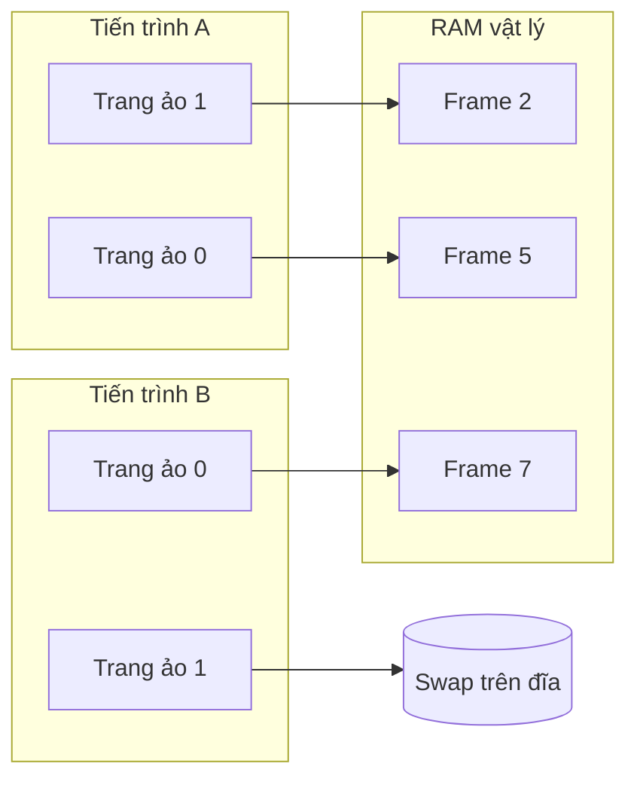
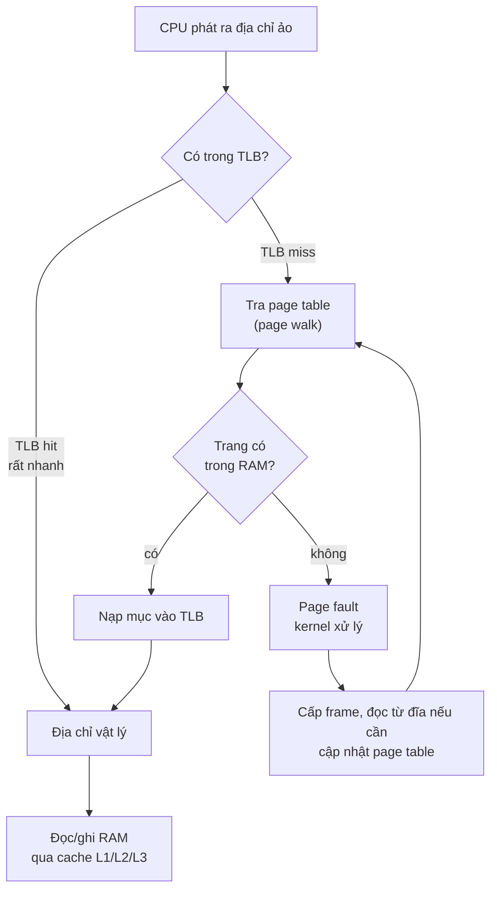
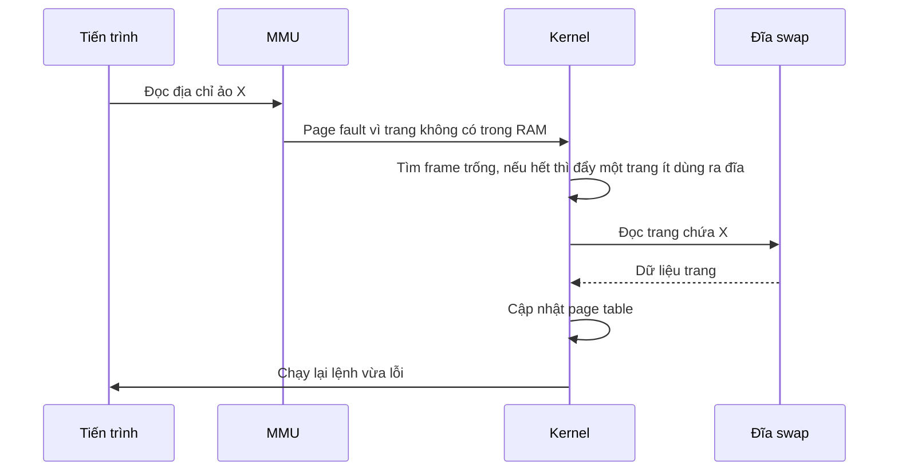
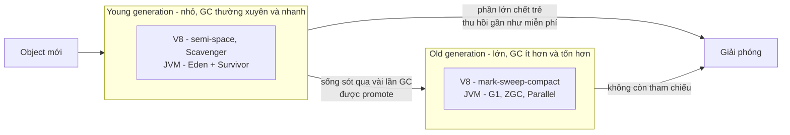
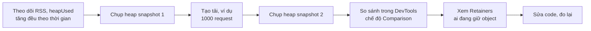

# Quản lý bộ nhớ

**Quản lý bộ nhớ** (memory management) là cách hệ điều hành và môi trường chạy (runtime) **cấp phát, theo dõi, bảo vệ và thu hồi RAM** cho các chương trình. Ở tầng hệ điều hành, đó là **bộ nhớ ảo** (virtual memory): mỗi tiến trình thấy một không gian địa chỉ riêng, liền mạch, được ánh xạ sang RAM vật lý qua phần cứng MMU. Ở tầng ngôn ngữ, đó là **stack, heap** và **garbage collector** (bộ thu gom rác) của V8 hay JVM quyết định object sống bao lâu.

**Tương tự đơn giản:** Hãy nghĩ về một **khách sạn**. Mỗi đoàn khách (tiến trình) nhận một tấm bản đồ riêng ghi "phòng 1, phòng 2, phòng 3..." — đó là **địa chỉ ảo**. Lễ tân (MMU + hệ điều hành) giữ sổ đối chiếu "phòng 1 của đoàn A thực ra là phòng 507". Khách sạn hết phòng thì đồ của đoàn ít dùng được chuyển tạm xuống kho (**swap**). Còn **garbage collector** là nhân viên dọn phòng: phòng nào không còn ai giữ chìa khoá thì dọn để cho khách khác.

---

:::note[Ghi nhớ nhanh]

- ⭐ **Mỗi tiến trình dùng địa chỉ ảo**, MMU dịch sang địa chỉ vật lý theo từng **trang** (page, thường 4 KB) qua **page table**, có **TLB** làm cache cho phép dịch — nhờ vậy các tiến trình cô lập và RAM được dùng linh hoạt.
- ⭐ **Memory leak trong JS/Java vẫn xảy ra dù có GC** — GC chỉ thu hồi object **không còn được tham chiếu**; closure, listener, biến toàn cục, cache không giới hạn giữ tham chiếu mãi thì RAM tăng mãi.
- **Page fault** là khi trang chưa có trong RAM; quá nhiều page fault phải đọc đĩa dẫn đến **thrashing**, máy chậm như rùa.
- **Stack** nhỏ, nhanh, tự giải phóng theo lời gọi hàm; **heap** lớn, linh hoạt, do GC hoặc lập trình viên quản lý.
- **Container vượt memory limit sẽ bị OOM kill** (exit code 137) — đặt giới hạn heap của Node/JVM thấp hơn limit của container.

:::

---

## Mục lục

- [Vì sao cần quản lý bộ nhớ?](#vì-sao-cần-quản-lý-bộ-nhớ)
- [1. Địa chỉ ảo và địa chỉ vật lý](#1-địa-chỉ-ảo-và-địa-chỉ-vật-lý)
- [2. Paging, page table và TLB](#2-paging-page-table-và-tlb)
- [3. Page fault, swap và thrashing](#3-page-fault-swap-và-thrashing)
- [4. OOM killer](#4-oom-killer)
- [5. Stack và heap](#5-stack-và-heap)
- [6. Cấp phát thủ công và garbage collection](#6-cấp-phát-thủ-công-và-garbage-collection)
- [7. Memory leak trong JavaScript](#7-memory-leak-trong-javascript)
- [8. Đọc process.memoryUsage và giới hạn container](#8-đọc-processmemoryusage-và-giới-hạn-container)
- [Khi nào cần nhớ?](#khi-nào-cần-nhớ)
- [Lỗi thường gặp](#lỗi-thường-gặp)
- [Câu hỏi phỏng vấn](#câu-hỏi-phỏng-vấn)

---

## Vì sao cần quản lý bộ nhớ?

**Vấn đề:** Nếu mọi chương trình dùng thẳng địa chỉ RAM vật lý, chương trình A có thể vô tình (hoặc cố ý) ghi đè dữ liệu của chương trình B hay của chính hệ điều hành. Mỗi chương trình phải biết trước nó được nạp ở địa chỉ nào; RAM bị phân mảnh thành nhiều lỗ trống nhỏ không dùng được; tổng bộ nhớ các chương trình cần vượt quá RAM thì không chạy nổi. Ở tầng ứng dụng, quên giải phóng bộ nhớ thì rò rỉ, giải phóng hai lần hoặc dùng sau khi giải phóng thì crash hoặc lỗ hổng bảo mật.

**Giải pháp:** **Bộ nhớ ảo** tách địa chỉ chương trình nhìn thấy khỏi vị trí thật trong RAM: mỗi tiến trình có không gian riêng được bảo vệ, chỉ những trang thực sự dùng mới chiếm RAM, trang ít dùng có thể đẩy ra đĩa. Ở tầng ngôn ngữ, **garbage collection** tự động thu hồi object không còn dùng, loại bỏ cả một lớp lỗi của quản lý thủ công.

:::tip[Dùng thực tế]

- **Pod bị OOMKilled:** hiểu vì sao Node/Java trong Kubernetes bị giết dù heap "chưa đầy", và cấu hình `--max-old-space-size`, `-XX:MaxRAMPercentage` cho đúng.
- **Server chậm bất thường:** nhận ra dấu hiệu swap và thrashing qua `free -h`, `vmstat`.
- **Memory leak:** RAM của app Node tăng đều sau mỗi lần deploy cho tới khi crash, cần chụp heap snapshot để tìm thủ phạm.
- **Hiểu lỗi:** `RangeError: Maximum call stack size exceeded`, `JavaScript heap out of memory`, `java.lang.OutOfMemoryError: Java heap space`.

:::

---

## 1. Địa chỉ ảo và địa chỉ vật lý

| | Địa chỉ ảo (virtual address) | Địa chỉ vật lý (physical address) |
| --- | --- | --- |
| **Ai dùng** | Chương trình (mọi con trỏ, mọi tham chiếu object) | Phần cứng RAM |
| **Phạm vi** | Riêng cho từng tiến trình | Dùng chung toàn máy |
| **Kích thước** | x86-64 phổ biến dùng 48 bit, tức 256 TB không gian ảo | Bằng dung lượng RAM thật (8 GB, 64 GB...) |
| **Ví dụ** | Hai tiến trình đều có thể có biến ở địa chỉ `0x7ffd1000` | Hai biến đó nằm ở hai ô RAM khác nhau |

**MMU** (Memory Management Unit) là bộ phận phần cứng trong CPU, **dịch mọi địa chỉ ảo sang địa chỉ vật lý** ở mỗi lần truy cập bộ nhớ, dựa trên bảng ánh xạ do hệ điều hành chuẩn bị. Nếu tiến trình truy cập địa chỉ không được phép, MMU báo lỗi và hệ điều hành gửi tín hiệu `SIGSEGV` — đó là lỗi **segmentation fault** quen thuộc của C/C++.



Lợi ích của bộ nhớ ảo:

- **Cô lập:** tiến trình này không thể đọc bộ nhớ của tiến trình khác.
- **Đơn giản cho chương trình:** mỗi chương trình thấy một dải địa chỉ liền mạch, không cần biết RAM thật bị chia mảnh thế nào.
- **Dùng nhiều hơn RAM thật:** chỉ trang đang dùng mới cần ở RAM.
- **Chia sẻ hiệu quả:** thư viện dùng chung (như `libc`) chỉ nạp một bản vào RAM, ánh xạ vào nhiều tiến trình; `fork()` dùng copy-on-write.

---

## 2. Paging, page table và TLB

**Paging** (phân trang) chia không gian ảo thành các khối cố định gọi là **trang** (page) và RAM vật lý thành các khối cùng kích thước gọi là **khung trang** (frame). Kích thước phổ biến là **4 KB** trên x86-64 (Apple Silicon dùng 16 KB); ngoài ra có **huge page** 2 MB hoặc 1 GB cho ứng dụng dùng nhiều bộ nhớ như database.

Một địa chỉ ảo được tách thành **số trang** và **offset** trong trang. Với trang 4 KB = 2^12 byte, 12 bit thấp là offset:

| Bước | Giá trị |
| --- | --- |
| Địa chỉ ảo | `0x1234` |
| Số trang ảo (bỏ 12 bit thấp) | `0x1` |
| Offset (12 bit thấp) | `0x234` |
| Page table: trang 1 ánh xạ tới | frame 5 |
| Địa chỉ vật lý = frame × 4096 + offset | `0x5000 + 0x234 = 0x5234` |

**Page table** (bảng trang) là bảng do hệ điều hành quản lý, mỗi tiến trình có một bảng riêng. Mỗi mục (page table entry) ghi frame tương ứng cùng các bit: **present** (trang có trong RAM không), **read/write**, **user/kernel**, **dirty** (đã bị ghi), **accessed** (vừa được truy cập). Vì không gian 48 bit rất lớn, x86-64 dùng bảng trang **nhiều cấp** (4 cấp, hoặc 5 cấp trên CPU mới) để không phải lưu mục cho vùng chưa dùng.

Tra bảng trang nhiều cấp nghĩa là mỗi lần truy cập bộ nhớ lại tốn thêm vài lần đọc RAM — quá chậm. Vì thế CPU có **TLB** (Translation Lookaside Buffer), một cache nhỏ (thường vài chục đến vài nghìn mục) lưu các phép dịch trang gần đây.



Vì mỗi tiến trình có page table riêng, khi context switch sang tiến trình khác, các mục TLB cũ không còn đúng — đây là một phần lý do context switch giữa process đắt hơn giữa thread (xem bài 2.1). CPU hiện đại có gắn nhãn tiến trình vào mục TLB (PCID trên x86) để giảm chi phí này.

---

## 3. Page fault, swap và thrashing

**Page fault** (lỗi trang) xảy ra khi chương trình truy cập một trang mà mục page table đánh dấu **không có trong RAM**. Đây là **ngắt** bình thường, không phải lỗi chương trình (xem bài 1.7 về ngắt):

| Loại | Khi nào | Chi phí |
| --- | --- | --- |
| **Minor (soft) page fault** | Trang đã có trong RAM nhưng chưa được ánh xạ (lần đầu chạm vào vùng vừa cấp phát, trang thư viện dùng chung, copy-on-write) | Nhỏ, cỡ micro giây |
| **Major (hard) page fault** | Phải đọc trang từ đĩa (từ swap hoặc từ file được map) | Lớn: hàng chục micro giây với SSD NVMe, vài mili giây với HDD |
| **Invalid** | Địa chỉ không thuộc vùng hợp lệ | Tiến trình nhận `SIGSEGV` |



**Swap** là vùng trên đĩa dùng làm nơi chứa tạm các trang bị đẩy khỏi RAM khi RAM đầy. Hệ điều hành chọn trang ít dùng gần đây để đẩy ra (xấp xỉ thuật toán **LRU**, Least Recently Used).

**Thrashing** xảy ra khi tổng bộ nhớ các tiến trình **đang tích cực dùng** (working set) vượt quá RAM: hệ thống liên tục đẩy trang ra rồi lại đọc vào, CPU gần như chỉ chờ đĩa. Dấu hiệu: máy rất chậm, `vmstat` cột `si`/`so` (swap in/out) liên tục khác 0, `%wa` cao, trong khi CPU dùng cho ứng dụng thấp. Vì truy cập RAM cỡ 100 ns còn đọc SSD cỡ 100 µs (chênh khoảng 1000 lần), chỉ một tỉ lệ nhỏ truy cập phải đọc đĩa đã làm chương trình chậm đi nhiều lần.

```bash
# Xem RAM và swap
free -h

# Theo dõi mỗi giây: si/so là swap in/out, wa là % CPU chờ I/O
vmstat 1

# Số page fault của một process: min_flt và maj_flt
ps -o pid,min_flt,maj_flt,rss,comm -p 1234
```

---

## 4. OOM killer

Linux cho phép **overcommit**: tiến trình xin cấp phát nhiều hơn RAM còn trống vẫn thường được đồng ý, vì nhiều chương trình xin nhưng không dùng hết. Khi RAM và swap thật sự cạn, kernel kích hoạt **OOM killer** (Out-Of-Memory killer): chọn một tiến trình (dựa trên điểm `oom_score`, chủ yếu theo lượng bộ nhớ đang dùng) và giết nó bằng `SIGKILL` để cứu hệ thống.

- Thường nạn nhân là tiến trình to nhất — hay chính là database hoặc app của bạn.
- Xem log: `dmesg | grep -i "killed process"` hoặc `journalctl -k`.
- Có thể điều chỉnh độ ưu tiên bị giết qua `/proc/<pid>/oom_score_adj` (từ -1000 đến 1000).

Trong container, giới hạn bộ nhớ được thực thi bởi **cgroup**: khi tổng bộ nhớ của container vượt `--memory` (Docker) hoặc `resources.limits.memory` (Kubernetes), OOM killer giết process bên trong container. Kubernetes hiển thị trạng thái `OOMKilled` với exit code **137** (= 128 + 9, tín hiệu `SIGKILL`).

---

## 5. Stack và heap

| | Stack | Heap |
| --- | --- | --- |
| **Chứa gì** | Khung hàm: tham số, biến cục bộ, địa chỉ trả về | Object, mảng, closure, chuỗi dài, dữ liệu sống lâu |
| **Cấp phát / giải phóng** | Tự động khi gọi hàm và khi hàm trả về (chỉ dịch con trỏ stack) | Cấp phát động; giải phóng bởi GC hoặc `free`/`delete` |
| **Tốc độ** | Rất nhanh, thân thiện cache | Chậm hơn, có thể phân mảnh |
| **Kích thước** | Nhỏ, cố định cho mỗi luồng (thường 1–8 MB) | Lớn, giới hạn bởi RAM và cấu hình runtime |
| **Phạm vi** | Riêng cho mỗi luồng | Dùng chung giữa các luồng của tiến trình |
| **Lỗi điển hình** | Stack overflow (đệ quy quá sâu) | Memory leak, out of memory |

Trong **Java**, biến kiểu nguyên thuỷ (`int`, `double`...) cục bộ và **tham chiếu** nằm trên stack, còn object thật mà tham chiếu trỏ tới nằm trên heap. (JIT có thể tối ưu bằng escape analysis để bỏ cấp phát heap cho object không thoát khỏi hàm, nhưng về mặt khái niệm vẫn hiểu như trên.)

```java
// Java: phần nào nằm ở stack, phần nào ở heap
void handle() {
    int count = 3;                       // count nằm trên stack
    User user = new User("An");          // biến tham chiếu user ở stack, object User ở heap
    List<User> list = new ArrayList<>(); // tương tự: list ở stack, ArrayList ở heap
    list.add(user);
}   // hàm trả về: khung stack bị bỏ; object trên heap chờ GC nếu không ai tham chiếu

// Đệ quy không điểm dừng làm tràn stack
int depth(int n) { return depth(n + 1); } // ném java.lang.StackOverflowError
```

Trong **JavaScript**, V8 tự quyết định nơi lưu, nhưng mô hình tư duy tương tự: khung hàm nằm trên stack, object/mảng/closure nằm trên heap được GC quản lý.

```js
// JavaScript: đệ quy quá sâu làm tràn call stack
function sum(n) {
  return n === 0 ? 0 : n + sum(n - 1);
}
sum(10);        // 55
sum(1_000_000); // RangeError: Maximum call stack size exceeded

// Cách sửa: chuyển sang vòng lặp, không tốn thêm khung stack
function sumLoop(n) {
  let total = 0;
  for (let i = 1; i <= n; i++) total += i;
  return total;
}
```

---

## 6. Cấp phát thủ công và garbage collection

| | Cấp phát thủ công (C/C++) | Garbage collection (JS, Java, Go, C#) |
| --- | --- | --- |
| **Cách dùng** | `malloc`/`free`, `new`/`delete` | Chỉ cấp phát, runtime tự thu hồi |
| **Hiệu năng** | Dự đoán được, không có pause của GC | Có thể có pause, tốn thêm CPU và RAM |
| **Lỗi thường gặp** | Quên `free` (leak), `free` hai lần, dùng sau khi `free` (use-after-free) | Leak do còn giữ tham chiếu, pause GC dài |
| **An toàn bộ nhớ** | Thấp, nguồn gốc của nhiều lỗ hổng bảo mật | Cao |

(Rust là hướng thứ ba: không có GC nhưng compiler kiểm tra quyền sở hữu (ownership) để tự chèn lệnh giải phóng đúng chỗ.)

### Mark-and-sweep

GC hiện đại không đếm tham chiếu đơn thuần (reference counting không thu hồi được hai object trỏ vòng vào nhau) mà dựa trên **khả năng tiếp cận** (reachability):

1. **Mark:** bắt đầu từ các **gốc** (GC roots — biến toàn cục, biến trên stack của mọi luồng, thanh ghi), đi theo mọi tham chiếu và đánh dấu object đến được.
2. **Sweep:** object không được đánh dấu là rác, thu hồi vùng nhớ.
3. **Compact** (tuỳ chọn): dồn object còn sống lại gần nhau để giảm phân mảnh.

### Generational GC

Quan sát thực nghiệm (**generational hypothesis**): **hầu hết object chết rất trẻ** — object tạm trong một request, chuỗi trung gian, mảng sau `map`. Vì vậy cả V8 và JVM chia heap theo **thế hệ**:



| | V8 (Node.js, Chrome) | JVM (HotSpot) |
| --- | --- | --- |
| **Young gen** | Hai semi-space, thuật toán Scavenge (sao chép object sống sang nửa kia) | Eden + 2 Survivor space |
| **Old gen** | Mark-sweep-compact, phần lớn chạy song song/đồng thời (dự án Orinoco) | G1 (mặc định từ Java 9), ZGC và Shenandoah cho pause rất thấp, Parallel GC cho throughput |
| **Giới hạn heap** | `--max-old-space-size=<MB>` | `-Xmx`, hoặc `-XX:MaxRAMPercentage` |
| **Mặc định** | Phụ thuộc phiên bản Node và RAM khả dụng | Max heap mặc định bằng 1/4 RAM khả dụng (JVM nhận biết giới hạn container từ JDK 10 và 8u191) |

---

## 7. Memory leak trong JavaScript

**Memory leak** trong ngôn ngữ có GC là khi object **không còn cần nữa nhưng vẫn còn được tham chiếu** từ một gốc nào đó, nên GC không dám thu hồi. Bốn thủ phạm thường gặp:

```js
// 1. Biến toàn cục vô tình: quên khai báo hoặc gắn vào module scope
const sessions = []; // sống suốt vòng đời process
app.use((req, res, next) => {
  sessions.push({ req, at: Date.now() }); // mỗi request thêm một phần tử, không bao giờ xoá
  next();
});

// 2. Cache không giới hạn
const cache = new Map();
async function getUser(id) {
  if (!cache.has(id)) cache.set(id, await db.users.findById(id)); // tăng mãi theo số user
  return cache.get(id);
}
// Sửa: dùng LRU có giới hạn (thư viện lru-cache) hoặc TTL

// 3. Event listener không gỡ
function subscribe(socket) {
  const onPrice = (p) => socket.send(JSON.stringify(p));
  priceFeed.on('update', onPrice); // priceFeed giữ tham chiếu tới onPrice và socket
  socket.on('close', () => priceFeed.off('update', onPrice)); // phải gỡ khi đóng
}

// 4. Closure giữ dữ liệu lớn
function makeHandler() {
  const bigData = Buffer.alloc(50 * 1024 * 1024); // 50 MB
  return () => bigData.length; // closure giữ bigData sống chừng nào handler còn sống
}
const handlers = [];
setInterval(() => handlers.push(makeHandler()), 1000); // mỗi giây thêm 50 MB không thu hồi được
```

Ở frontend (React, Vue), các nguồn leak tương tự: `setInterval`, `addEventListener` trên `window`, subscription không huỷ khi component unmount — luôn dọn dẹp trong hàm cleanup của `useEffect`.

### Phát hiện bằng heap snapshot



```bash
# Chạy Node với inspector, mở chrome://inspect, tab Memory, Take heap snapshot
node --inspect server.js

# Hoặc ghi snapshot ra file khi gửi tín hiệu (không cần mở DevTools)
node --heapsnapshot-signal=SIGUSR2 server.js
kill -USR2 <pid>   # tạo file .heapsnapshot, mở bằng tab Memory của Chrome DevTools
```

Trong code, có thể gọi `v8.writeHeapSnapshot()`. Với Java, dùng `jmap -dump:live,format=b,file=heap.hprof <pid>` hoặc bật `-XX:+HeapDumpOnOutOfMemoryError`, rồi phân tích bằng Eclipse MAT hay VisualVM. Lưu ý chụp snapshot sẽ tạm dừng process và cần thêm RAM xấp xỉ kích thước heap.

---

## 8. Đọc process.memoryUsage và giới hạn container

```js
// Node.js: in mức dùng bộ nhớ theo MB mỗi 10 giây
const toMB = (bytes) => Math.round(bytes / 1024 / 1024);
setInterval(() => {
  const { rss, heapTotal, heapUsed, external, arrayBuffers } = process.memoryUsage();
  console.log(JSON.stringify({
    rss: toMB(rss),             // tổng RAM vật lý process đang chiếm
    heapTotal: toMB(heapTotal), // heap V8 đã xin từ OS
    heapUsed: toMB(heapUsed),   // phần heap đang chứa object
    external: toMB(external),   // bộ nhớ C++ gắn với object JS (Buffer...)
    arrayBuffers: toMB(arrayBuffers),
  }));
}, 10_000).unref();
```

| Trường | Ý nghĩa | Khi tăng mãi nghĩa là |
| --- | --- | --- |
| **rss** (Resident Set Size) | Toàn bộ RAM vật lý của process: heap V8, code, stack, Buffer, thư viện native | Leak ở đâu đó, có thể ngoài heap JS |
| **heapTotal** | Tổng heap V8 đã cấp | V8 đang nới heap |
| **heapUsed** | Phần heap đang dùng | Leak object JS (sau khi GC vẫn không giảm) |
| **external** | Bộ nhớ ngoài heap gắn với object JS | Leak `Buffer`, dữ liệu native |
| **arrayBuffers** | Phần của external dành cho `ArrayBuffer`/`Buffer` | Giữ Buffer quá lâu |

`heapUsed` dao động răng cưa (tăng rồi giảm sau mỗi lần GC) là bình thường; đáng lo là **đáy** của răng cưa tăng dần.

### Liên hệ với Docker và Kubernetes

Giới hạn bộ nhớ của container áp lên **toàn bộ RSS** (cùng page cache được tính cho cgroup), không chỉ heap. Nếu cho Node heap tối đa 2 GB trong container limit 2 GB, process sẽ bị OOM kill trước khi V8 kịp báo lỗi heap — vì còn Buffer, stack, code, bộ nhớ native.

```bash
# Node: để heap thấp hơn limit, chừa chỗ cho phần ngoài heap (ví dụ limit 1 GiB)
docker run --memory=1g -e NODE_OPTIONS="--max-old-space-size=768" my-node-app

# Java: để JVM tự tính heap theo limit container
docker run --memory=1g my-java-app java -XX:MaxRAMPercentage=75.0 -jar app.jar

# Xem container nào sắp chạm limit
docker stats
```

| Triệu chứng | Nguyên nhân thường gặp |
| --- | --- |
| `FATAL ERROR: ... JavaScript heap out of memory` | Heap V8 chạm `--max-old-space-size` |
| `java.lang.OutOfMemoryError: Java heap space` | Heap JVM chạm `-Xmx` |
| Pod `OOMKilled`, exit code 137, không có stack trace | Tổng bộ nhớ process vượt memory limit của container |
| App chậm dần, CPU cao vì GC chạy liên tục | Heap gần đầy, GC thu hồi được rất ít (thường do leak) |

---

## Khi nào cần nhớ?

- **Cấu hình deploy:**
  - Đặt memory limit cho container và giới hạn heap runtime thấp hơn (khoảng 70–80% limit).
  - Cân nhắc tắt hoặc hạn chế swap trên server chạy database và dịch vụ cần độ trễ thấp.
- **Giám sát:** theo dõi RSS, heapUsed sau GC, số lần GC và thời gian pause, số lần restart vì OOM.
- **Viết code:**
  - Cache luôn có giới hạn kích thước hoặc TTL.
  - Mọi `on`/`addEventListener`/`setInterval` đều có chỗ gỡ tương ứng.
  - Xử lý file lớn bằng stream thay vì đọc toàn bộ vào bộ nhớ.
  - Tránh đệ quy sâu với dữ liệu đầu vào không giới hạn.
- **Hiệu năng:** dữ liệu nằm liền nhau (mảng) thân thiện với cache và TLB hơn dữ liệu rải rác (danh sách liên kết, object lồng nhau).

---

## Lỗi thường gặp

### Lỗi 1: Đặt heap bằng đúng memory limit của container

`-Xmx2g` trong container `limit: 2Gi`, hoặc `--max-old-space-size=2048` cũng vậy: JVM còn metaspace, stack của các luồng, code cache, buffer native; Node còn Buffer và bộ nhớ native. Tổng vượt limit và bị OOM kill không kèm log lỗi. Chừa 20–30% cho phần ngoài heap.

### Lỗi 2: Nghĩ có GC thì không thể leak

GC chỉ thu hồi object không còn tham chiếu. Map toàn cục làm cache, mảng log trong bộ nhớ, listener quên gỡ đều giữ object sống mãi. Leak trong JS/Java là leak **logic**, phải tìm "ai đang giữ" bằng heap snapshot.

### Lỗi 3: Chỉ nhìn heapUsed mà bỏ qua RSS

RSS tăng trong khi heapUsed ổn định thường là leak ngoài heap: Buffer giữ lâu, module native, hoặc phân mảnh bộ nhớ của allocator. Phải theo dõi cả hai.

### Lỗi 4: Gọi GC thủ công để "chữa" leak

`global.gc()` (cần cờ `--expose-gc`) hay `System.gc()` không thu hồi được object còn tham chiếu, chỉ gây thêm pause. Hãy sửa nguyên nhân giữ tham chiếu.

### Lỗi 5: Đọc file lớn vào bộ nhớ một lần

`fs.readFileSync` file log 3 GB hoặc `JSON.parse` response hàng trăm MB khiến heap tăng vọt, dễ OOM. Dùng stream (`fs.createReadStream`, `readline`), xử lý theo từng phần, hoặc phân trang dữ liệu từ API/DB.

---

## Câu hỏi phỏng vấn

Những câu thường gặp về chủ đề này. Tự trả lời trước, rồi bấm **Xem đáp án** để đối chiếu.

**1. Bộ nhớ ảo là gì? Vì sao cần nó?**

<details className="qa">
<summary>Xem đáp án</summary>

Bộ nhớ ảo cho mỗi tiến trình một không gian địa chỉ riêng; MMU dịch địa chỉ ảo sang địa chỉ vật lý theo từng trang dựa trên page table do hệ điều hành quản lý.

Lợi ích: **cô lập** các tiến trình (không đọc/ghi được bộ nhớ của nhau), chương trình thấy **không gian liền mạch** dù RAM thật bị phân mảnh, chỉ trang đang dùng mới chiếm RAM nên **tổng bộ nhớ có thể vượt RAM** (nhờ swap, lazy allocation), **chia sẻ** thư viện và copy-on-write khi `fork()`.

</details>

**2. TLB là gì? Điều gì xảy ra khi TLB miss và khi page fault?**

<details className="qa">
<summary>Xem đáp án</summary>

TLB là cache trong CPU lưu các phép dịch trang ảo sang frame vật lý gần đây.

- **TLB miss:** CPU (hoặc kernel trên một số kiến trúc) tra page table nhiều cấp trong RAM, nạp kết quả vào TLB. Chậm hơn hit nhưng vẫn ở mức chục đến trăm nano giây.
- **Page fault:** mục page table báo trang không có trong RAM; CPU ngắt vào kernel, kernel cấp frame, đọc dữ liệu từ đĩa nếu cần (major fault), cập nhật page table rồi cho chạy lại lệnh. Nếu địa chỉ không hợp lệ, tiến trình nhận `SIGSEGV`.

</details>

**3. Stack và heap khác nhau thế nào? Khi nào gặp stack overflow?**

<details className="qa">
<summary>Xem đáp án</summary>

- **Stack:** mỗi luồng một stack, chứa khung hàm (tham số, biến cục bộ, địa chỉ trả về); cấp phát/giải phóng tự động theo lời gọi hàm, rất nhanh nhưng nhỏ (thường 1–8 MB).
- **Heap:** dùng chung trong tiến trình, chứa object cấp phát động, lớn và linh hoạt, do GC hoặc lập trình viên giải phóng.

Stack overflow xảy ra khi số khung hàm vượt kích thước stack, thường do đệ quy không có điểm dừng hoặc quá sâu (JS: `RangeError: Maximum call stack size exceeded`, Java: `StackOverflowError`). Sửa bằng vòng lặp hoặc giới hạn độ sâu.

</details>

**4. Garbage collector hoạt động thế nào? Generational GC dựa trên giả thuyết gì?**

<details className="qa">
<summary>Xem đáp án</summary>

GC theo kiểu tracing (mark-and-sweep): từ các GC root (biến toàn cục, stack các luồng, thanh ghi) đánh dấu mọi object đến được; object không được đánh dấu bị thu hồi; có thể compact để giảm phân mảnh. Cách này xử lý được tham chiếu vòng, điều mà reference counting không làm được.

Generational GC dựa trên giả thuyết **phần lớn object chết trẻ**. Heap chia thành young gen (nhỏ, GC thường xuyên, rẻ vì chỉ sao chép số ít object còn sống) và old gen (lớn, GC ít hơn). Object sống sót qua vài lần GC được chuyển lên old gen. V8 dùng Scavenger cho young và mark-sweep-compact cho old; JVM dùng Eden/Survivor cho young và G1 (mặc định), ZGC, Shenandoah...

</details>

**5. Kể các nguyên nhân memory leak phổ biến trong Node.js và cách tìm ra chúng.**

<details className="qa">
<summary>Xem đáp án</summary>

Nguyên nhân: biến toàn cục/module-level tích luỹ dữ liệu, cache Map không giới hạn, event listener và `setInterval` không gỡ, closure giữ object lớn, giữ tham chiếu tới `req`/`res` sau khi request kết thúc, Buffer giữ lâu (leak ngoài heap).

Cách tìm: theo dõi `process.memoryUsage()` (đáy heapUsed tăng dần, RSS tăng), chụp hai heap snapshot trước và sau khi tạo tải (`node --inspect` hoặc `--heapsnapshot-signal`), so sánh bằng chế độ Comparison trong Chrome DevTools, xem cột **Retainers** để biết chuỗi tham chiếu nào giữ object.

</details>

**6. Vì sao app Node/Java trong Kubernetes bị OOMKilled dù chưa thấy lỗi heap?**

<details className="qa">
<summary>Xem đáp án</summary>

Memory limit của container (thực thi bằng cgroup) tính trên **toàn bộ bộ nhớ của process** — heap cộng stack các luồng, code, Buffer, metaspace (JVM), bộ nhớ native — chứ không chỉ heap. Nếu giới hạn heap đặt bằng hoặc sát limit, tổng bộ nhớ vượt limit trước khi heap đầy, kernel OOM killer giết process bằng `SIGKILL` (exit code 137) nên không có stack trace.

Cách xử lý: đặt heap khoảng 70–80% limit (`--max-old-space-size`, `-XX:MaxRAMPercentage`), theo dõi RSS, tìm leak ngoài heap nếu RSS tăng mãi.

</details>
