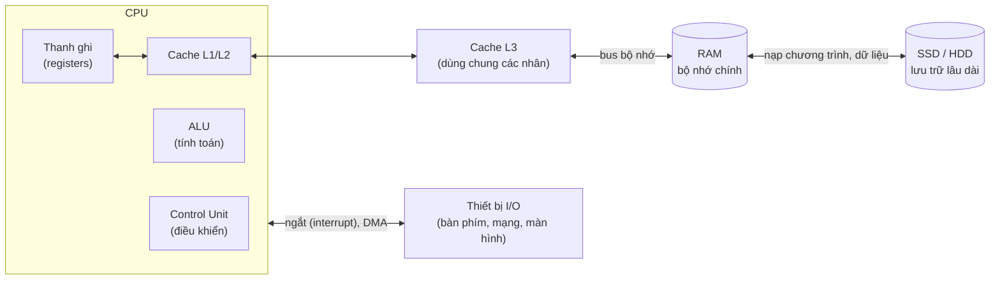

# Computer Science

Đây là lộ trình **Computer Science** (khoa học máy tính) bám theo [roadmap.sh/computer-science](https://roadmap.sh/computer-science), bắt đầu từ nhánh nền tảng nhất: **máy tính hoạt động thế nào**. Ở đây bạn sẽ biết CPU là gì, RAM là gì, cache là gì, một dòng code biến thành lệnh máy rồi được CPU chạy ra sao, và hệ điều hành chia CPU, RAM cho hàng trăm chương trình cùng lúc như thế nào. Mỗi **thuật ngữ chuyên ngành** đều được giải thích ngay khi xuất hiện.

**Tương tự đơn giản:** Hãy hình dung máy tính là **một căn bếp nhà hàng**. **CPU** là đầu bếp, chỉ làm theo công thức từng bước một nhưng cực nhanh. **Thanh ghi** là vài thứ đầu bếp đang cầm trên tay. **Cache** là mặt bàn bếp ngay trước mặt. **RAM** là tủ lạnh trong bếp. **Ổ cứng/SSD** là kho hàng ở tầng hầm. **Chương trình** là cuốn công thức, còn **hệ điều hành** là bếp trưởng phân việc để nhiều món được nấu xen kẽ mà không ai giẫm chân ai.

---

:::note[Ghi nhớ nhanh]

- ⭐ **CPU xử lý, RAM ghi nhớ tạm thời** — CPU thực thi lệnh; RAM chứa chương trình đang chạy và dữ liệu của nó, mất sạch khi tắt máy.
- ⭐ **Hệ thống phân cấp bộ nhớ** — thanh ghi → cache L1/L2/L3 → RAM → SSD/HDD: càng xuống dưới càng chậm nhưng càng lớn và càng rẻ.
- **Mọi thứ là số nhị phân** — số, chữ, ảnh, cả lệnh của chương trình đều được lưu thành các bit 0/1.
- **CPU lặp mãi một chu trình** — lấy lệnh (fetch) → giải mã (decode) → thực thi (execute), hàng tỉ lần mỗi giây.
- **Tiến trình, luồng và bộ nhớ ảo** — cách hệ điều hành cho nhiều chương trình dùng chung CPU và RAM một cách an toàn.

:::

---

## Vì sao lập trình viên cần hiểu máy tính hoạt động thế nào?

**Vấn đề:** Viết JavaScript hay Java hằng ngày, ta ít khi nghĩ tới phần cứng. Nhưng rồi sẽ gặp những câu hỏi mà không hiểu bên dưới thì không trả lời được: vì sao duyệt mảng theo hàng nhanh hơn theo cột vài lần? Vì sao `0.1 + 0.2 !== 0.3`? Vì sao app Node.js chỉ dùng một nhân CPU? Vì sao server hết RAM thì chậm như rùa thay vì báo lỗi ngay? Vì sao hai luồng cùng cộng một biến lại ra kết quả sai?

**Giải pháp:** Nắm mô hình tư duy về **CPU, bộ nhớ và hệ điều hành** giúp bạn đoán được code sẽ chạy nhanh hay chậm, hiểu lỗi đồng thời (concurrency), đọc được số liệu monitoring (CPU %, RAM, swap) và lập luận tốt hơn trong system design.

:::tip[Dùng thực tế]

- **Tối ưu hiệu năng:** hiểu cache và độ trễ bộ nhớ để viết vòng lặp, cấu trúc dữ liệu thân thiện với CPU.
- **Debug lỗi khó:** race condition, deadlock, memory leak, sai số dấu phẩy động.
- **Vận hành server:** đọc `top`/`htop`, hiểu load average, swap, OOM killer, chọn cấu hình máy (bao nhiêu nhân, bao nhiêu RAM).
- **Phỏng vấn:** câu hỏi về process vs thread, stack vs heap, virtual memory xuất hiện rất thường xuyên.

:::

---

## Bức tranh tổng thể

| Tầng | Độ trễ truy cập (xấp xỉ) | Dung lượng điển hình |
|------|--------------------------|----------------------|
| Thanh ghi | dưới 1 ns | vài trăm byte |
| Cache L1 | ~1 ns | 32–64 KB mỗi nhân |
| Cache L2 | ~4 ns | 256 KB – 2 MB mỗi nhân |
| Cache L3 | ~10–20 ns | 8 – 64 MB dùng chung |
| RAM | ~80–100 ns | 8 – 128 GB |
| SSD NVMe | ~20–100 µs | 512 GB – vài TB |
| HDD | ~5–10 ms | vài TB |

---

## Nội dung tài liệu

| # | Chủ đề | Bạn sẽ học được gì |
|---|--------|--------------------|
| 1.1 | **Cấu tạo máy tính** | Kiến trúc von Neumann, CPU, RAM, ổ lưu trữ, mainboard, bus, quá trình khởi động |
| 1.2 | **Máy tính tính toán thế nào** | Hệ nhị phân, cổng logic, ALU, số âm, phép toán bit, số thực dấu phẩy động |
| 1.3 | **Thanh ghi và RAM** | Thanh ghi, địa chỉ bộ nhớ, SRAM vs DRAM, phân cấp bộ nhớ, endianness |
| 1.4 | **Lệnh và chương trình** | Tập lệnh (ISA), mã máy, assembly, CISC vs RISC, biên dịch / thông dịch / JIT |
| 1.5 | **CPU thực thi chương trình** | Chu trình fetch-decode-execute, xung nhịp, pipeline, đa nhân, hyper-threading |
| 1.6 | **CPU cache** | L1/L2/L3, cache line, tính cục bộ, cache hit/miss, false sharing |
| 1.7 | **Ngắt (interrupt)** | Ngắt phần cứng/phần mềm, system call, polling vs interrupt, DMA |
| 2.1 | **Tiến trình và luồng** | Process vs thread, context switch, fork, mô hình của Node.js và Java |
| 2.2 | **Lập lịch CPU** | FCFS, SJF, Round Robin, priority, bộ lập lịch của Linux |
| 2.3 | **Đồng thời và đồng bộ** | Race condition, lock, mutex, semaphore, deadlock |
| 2.4 | **Quản lý bộ nhớ** | Bộ nhớ ảo, paging, page fault, swap, stack vs heap, garbage collection |

Bắt đầu từ chủ đề **1. Cấu tạo máy tính** ở thanh bên trái.
