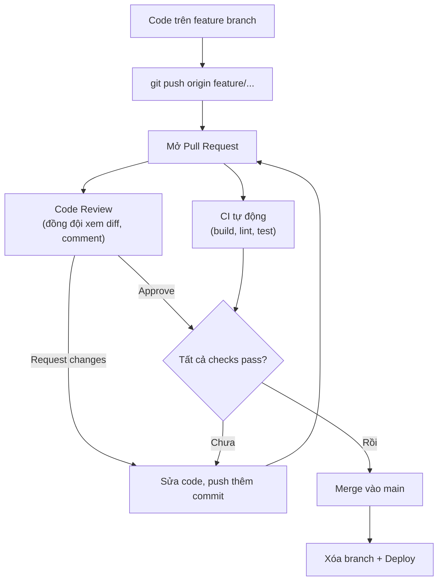

# Pull Request và Code Review

Pull Request (PR) và Code Review là **hai trụ cột** của quy trình phát triển phần mềm hiện đại. Nếu bạn làm việc trong bất kỳ công ty phần mềm nào, bạn sẽ tạo PR và review code **hàng ngày**. Bài này sẽ giúp bạn hiểu PR là gì, cách tạo PR tốt, quy trình code review, và các best practices mà mọi team chuyên nghiệp đều áp dụng.

---

:::note[Ghi nhớ nhanh]

- ⭐ **Pull Request là đề xuất merge nhánh feature vào nhánh chính** — mở không gian code review và chạy CI tự động trước khi được merge.
- ⭐ **Ba merge option** — Merge Commit (giữ đủ lịch sử), Squash (gộp thành 1 commit, main sạch nhất), Rebase (lịch sử thẳng); Squash phổ biến nhất cho team hiện đại.
- **PR tốt: nhỏ (< 400 dòng), 1 mục đích, mô tả rõ, kèm tests** — và tự self-review trước khi assign reviewer.
- **Code review kiểm tra correctness, security, performance, readability, testing** — phân loại feedback thành MUST FIX, SHOULD FIX và NIT.
- **Draft PR để nhận feedback sớm khi code chưa xong** — giải quyết conflict bằng cách merge/rebase main vào feature rồi push lại.

:::

---

## Mục lục

- [Vì sao có Pull Request & code review?](#vì-sao-có-pull-request--code-review)
- [1. Pull Request (PR) là gì?](#1-pull-request-pr-là-gì)
- [2. Tạo Pull Request trên GitHub](#2-tạo-pull-request-trên-github)
- [3. PR Template — Mẫu mô tả PR](#3-pr-template-mẫu-mô-tả-pr)
- [Summary](#summary)
- [Changes](#changes)
- [Type of Change](#type-of-change)
- [Test Plan](#test-plan)
- [Screenshots](#screenshots)
- [Checklist](#checklist)
- [4. Code Review — Tại sao quan trọng?](#4-code-review-tại-sao-quan-trọng)
- [5. Review trên GitHub](#5-review-trên-github)
- [6. Suggestion Feature — Đề xuất code trực tiếp](#6-suggestion-feature-đề-xuất-code-trực-tiếp)
- [7. Draft PR — Work in Progress](#7-draft-pr-work-in-progress)
- [8. Merge Options — 3 cách merge PR](#8-merge-options-3-cách-merge-pr)
- [9. Resolving PR Conflicts](#9-resolving-pr-conflicts)
- [10. CI/CD Checks trên PR](#10-cicd-checks-trên-pr)
- [11. Best Practices](#11-best-practices)
- [12. Lỗi thường gặp](#12-lỗi-thường-gặp)
- [13. Câu hỏi phỏng vấn](#13-câu-hỏi-phỏng-vấn)

---

## Vì sao có Pull Request & code review?

**Vấn đề:** Nếu ai cũng push thẳng vào `main`, code chưa được kiểm chứng — lỗi, thiếu test, style không nhất quán — sẽ lọt thẳng vào sản phẩm. Không ai nhìn lại code của nhau, nên chất lượng giảm dần và kiến thức không lan toả trong team (chỉ người viết hiểu phần mình làm).

**Giải pháp:** **Pull Request** là lời đề nghị gộp nhánh của bạn vào nhánh chính. Nó mở ra một không gian để đồng đội **code review** — xem diff, bình luận, yêu cầu sửa — đồng thời để **CI tự động** chạy build và test, rồi mới merge. PR vừa là cổng kiểm soát chất lượng, vừa là kênh chia sẻ kiến thức cho cả team.

:::tip[Dùng thực tế]

- Mở một PR cho mỗi feature/fix, thay vì commit thẳng lên `main`.
- Review giúp phát hiện bug và đề xuất cải thiện trước khi code lên production.
- Gắn CI bắt buộc pass (build, lint, test) làm điều kiện để merge.
- Ghi lại lý do thay đổi qua phần mô tả và thảo luận trong PR — sau này tra cứu dễ dàng.

:::

---

## 1. Pull Request (PR) là gì?

**Pull Request** là một **đề xuất** (request) để merge code từ nhánh này sang nhánh khác. Nó nói: "Tôi đã hoàn thành code trên nhánh feature, hãy **kéo** (pull) code của tôi vào nhánh main."

### Tại sao không push thẳng vào main?

```
Không có PR (nguy hiểm):
  Developer A ---push--> main ----> Production
  (code chưa review)      (code lỗi)    (bug trên production!)

Có PR (an toàn):
  Developer A ---push--> feature branch
                             |
                             v
                         Pull Request
                             |
                             v
                         Code Review (đồng đội kiểm tra)
                             |
                             v
                         CI/CD (tests tự động chạy)
                             |
                             v
                         Approve + Merge --> main --> Production
                                                     (code đã kiểm tra)
```

Sơ đồ luồng Pull Request hoàn chỉnh — review và CI chạy song song, chỉ merge khi cả hai đều xanh:



### PR = Cơ hội để:

| Mục đích               | Giải thích                                  |
| ---------------------- | ------------------------------------------- |
| **Review code**        | Đồng đội kiểm tra logic, bảo mật, hiệu suất |
| **Thảo luận**          | Trao đổi về cách tiếp cận, đề xuất cải tiến |
| **Chạy tests tự động** | CI/CD kiểm tra build, tests, lint           |
| **Tài liệu hóa**       | Mô tả thay đổi, lý do, cách test            |
| **Chia sẻ kiến thức**  | Cả team học từ code của nhau                |

---

## 2. Tạo Pull Request trên GitHub

### Quy trình tạo PR

```bash
# Bước 1: Tạo nhánh feature
git checkout -b feature/add-search

# Bước 2: Code và commit
git add src/search.js src/search.test.js
git commit -m "feat: add search functionality"

# Bước 3: Push nhánh lên remote
git push -u origin feature/add-search

# Bước 4: Tạo PR trên GitHub
# GitHub sẽ hiển thị banner "Compare & pull request" sau khi push
# Hoặc vào tab "Pull requests" → "New pull request"
```

### Các thành phần của PR

Khi tạo PR trên GitHub, bạn cần điền:

| Thành phần      | Mô tả                                    | Bắt buộc? |
| --------------- | ---------------------------------------- | --------- |
| **Title**       | Tiêu đề ngắn gọn mô tả thay đổi          | Có        |
| **Description** | Mô tả chi tiết: tại sao, cách, ảnh hưởng | Nên có    |
| **Reviewers**   | Ai sẽ review code                        | Nên chọn  |
| **Assignees**   | Ai chịu trách nhiệm PR này               | Tùy team  |
| **Labels**      | Nhãn phân loại (bug, feature, docs...)   | Nên có    |
| **Milestone**   | PR thuộc milestone nào                   | Tùy team  |
| **Projects**    | PR thuộc project board nào               | Tùy team  |

### Viết Title tốt

```markdown
# SAI: Quá chung chung

Fix bug
Update code
Some changes

# SAI: Quá dài

Fix the bug where the login button doesn't work when user enters email without @ symbol and clicks submit

# ĐÚNG: Ngắn gọn, rõ ràng, dùng conventional commits

feat: add search functionality with autocomplete
fix: resolve login validation for invalid email format
refactor: extract auth logic into separate service
docs: update API documentation for v2 endpoints
```

---

## 3. PR Template — Mẫu mô tả PR

Một PR template tốt giúp đảm bảo mọi PR đều có đủ thông tin cần thiết.

### Template mẫu

```markdown
## Summary

<!-- Mô tả ngắn gọn: thay đổi gì, tại sao -->

Thêm tính năng tìm kiếm sản phẩm với autocomplete.
Cần thiết để cải thiện UX theo feedback từ user survey (Issue #45).

## Changes

<!-- Liệt kê các thay đổi chính -->

- Thêm component `SearchBar` với debounce 300ms
- Thêm API endpoint `/api/search` với full-text search
- Thêm unit tests cho search logic
- Cập nhật navigation để hiển thị search bar

## Type of Change

- [ ] Bug fix (non-breaking change which fixes an issue)
- [x] New feature (non-breaking change which adds functionality)
- [ ] Breaking change (fix or feature that would cause existing functionality to not work as expected)

## Test Plan

<!-- Mô tả cách test thay đổi này -->

- [x] Unit tests: `npm test -- --grep "search"`
- [x] Manual testing: mở /products, gõ tìm kiếm, kiểm tra kết quả
- [x] Edge cases: empty query, special characters, very long query
- [ ] Performance: kiểm tra response time < 200ms

## Screenshots

<!-- Đính kèm screenshots nếu có thay đổi UI -->

| Before       | After        |
| ------------ | ------------ |
| (screenshot) | (screenshot) |

## Checklist

- [x] Code follows project style guidelines
- [x] Self-review completed
- [x] Tests added and passing
- [x] No console.log statements
- [ ] Documentation updated
```

### Thiết lập PR template cho repo

Tạo file `.github/PULL_REQUEST_TEMPLATE.md` trong repo. Khi ai đó tạo PR, GitHub tự động điền template vào phần description.

---

## 4. Code Review — Tại sao quan trọng?

Code review là quá trình **đồng đội đọc và đánh giá code** trước khi merge. Đây KHÔNG phải để "bắt lỗi" hay "chỉ trích" — mà là để **cải thiện chất lượng code** và **chia sẻ kiến thức**.

### Lợi ích của Code Review

```
Không có Code Review:             Có Code Review:

Developer viết code               Developer viết code
        |                                |
        v                                v
  Push → Main → Bug!              Push → PR → Review
                                              |
                                    +----+----+----+
                                    |    |    |    |
                                   Bugs Logic Style Security
                                    |    |    |    |
                                    v    v    v    v
                                      Feedback
                                         |
                                    Fix → Approve → Merge → Main
                                                         (code tốt hơn!)
```

| Lợi ích                    | Giải thích                               |
| -------------------------- | ---------------------------------------- |
| **Phát hiện bug sớm**      | 2 cặp mắt tốt hơn 1                      |
| **Cải thiện code quality** | Góp ý về cấu trúc, naming, patterns      |
| **Chia sẻ kiến thức**      | Cả team hiểu toàn bộ codebase            |
| **Đảm bảo consistency**    | Code style nhất quán trong dự án         |
| **Mentoring**              | Senior hướng dẫn junior thông qua review |
| **Giảm bus factor**        | Nhiều người hiểu code = ít rủi ro        |

### Mindset khi review (RẤT QUAN TRỌNG)

**Người review:**

- Tôn trọng — code là sản phẩm trí tuệ của người khác
- Mang tính xây dựng — không chỉ chê, mà gợi ý cách tốt hơn
- Hỏi thay vì phán xét — "Tại sao chọn cách này?" thay vì "Cách này sai"
- Khen khi code tốt — nhận xét tích cực cũng quan trọng

**Người được review:**

- Không defensive — feedback là để cải thiện, không phải tấn công
- Giải thích context — reviewer có thể thiếu bối cảnh
- Cảm ơn reviewer — họ bỏ thời gian đọc code của bạn
- Học hỏi — mỗi review là cơ hội học điều mới

---

## 5. Review trên GitHub

### Cách review

1. Vào **Pull Request** > tab **Files changed**
2. Đọc qua tất cả thay đổi (diff)
3. Click vào dòng code muốn comment > viết nhận xét
4. Sau khi review xong, click **Review changes**:
   - **Comment** — nhận xét chung, không approve/reject
   - **Approve** — đồng ý merge
   - **Request changes** — yêu cầu sửa trước khi merge

### Các loại comment

```
1. COMMENT (nhận xét thường)
   "Có thể dùng optional chaining ở đây: user?.name"

2. SUGGESTION (đề xuất thay đổi code trực tiếp)
   GitHub cho phép viết code suggestion, tác giả chỉ cần click
   "Apply suggestion" là code được cập nhật.

3. QUESTION (câu hỏi)
   "Tại sao dùng setTimeout thay vì debounce từ lodash?"

4. PRAISE (khen ngợi)
   "Clean implementation! Cách xử lý error ở đây rất tốt."

5. NITPICK (chi tiết nhỏ, không bắt buộc sửa)
   "Nit: có thể đổi tên biến `d` thành `data` cho rõ nghĩa hơn"
```

### Review Checklist

Khi review code, kiểm tra các khía cạnh sau:

```
Logic & Correctness:
☐ Code có làm đúng yêu cầu không?
☐ Edge cases đã được xử lý chưa?
☐ Có bug tiềm ẩn không?

Security:
☐ Input validation đầy đủ?
☐ Không có SQL injection, XSS?
☐ Không có hardcoded secrets?
☐ Authentication/authorization đúng?

Performance:
☐ Có query N+1 không?
☐ Có vòng lặp không cần thiết không?
☐ Cần caching không?
☐ Memory leaks?

Readability:
☐ Tên biến/hàm có rõ nghĩa không?
☐ Code có comment khi cần không?
☐ Hàm có quá dài không? (>50 dòng)
☐ Nesting có quá sâu không? (>4 levels)

Testing:
☐ Tests có đủ không?
☐ Tests có đúng logic không?
☐ Edge cases được test chưa?
☐ Coverage đạt yêu cầu?

Style & Convention:
☐ Theo coding conventions của dự án?
☐ Formatting đúng?
☐ Import gọn gàng?
```

---

## 6. Suggestion Feature — Đề xuất code trực tiếp

GitHub cho phép reviewer **viết code suggestion** ngay trong comment. Tác giả PR chỉ cần click "Apply suggestion" là code được cập nhật, không cần sửa tay.

### Cách dùng

Khi review, click vào dòng code muốn suggest, rồi dùng cú pháp:

````markdown
```suggestion
const userName = user?.name ?? 'Anonymous';
```
````

Tác giả PR sẽ thấy:

```
Reviewer suggests:
- const userName = user.name ? user.name : 'Anonymous';
+ const userName = user?.name ?? 'Anonymous';

[Apply suggestion] [Add to batch]
```

### Multi-line suggestion

Có thể suggest thay đổi nhiều dòng bằng cách chọn (drag) nhiều dòng trước khi comment.

### Batch suggestions

Nếu có nhiều suggestions, tác giả có thể:

1. Click **"Add suggestion to batch"** cho từng suggestion
2. Sau khi thêm hết, click **"Commit suggestions"**
3. Tất cả suggestions được apply trong **1 commit** duy nhất

---

## 7. Draft PR — Work in Progress

Khi bạn muốn tạo PR sớm để **nhận feedback** nhưng code **chưa hoàn thành**:

### Tạo Draft PR

```
Trên GitHub khi tạo PR:
- Thay vì click "Create pull request"
- Click mũi tên dropdown bên cạnh
- Chọn "Create draft pull request"
```

### Đặc điểm Draft PR

| Tính năng              | Draft PR          | Regular PR       |
| ---------------------- | ----------------- | ---------------- |
| **Merge được?**        | Không             | Có               |
| **Review được?**       | Có                | Có               |
| **CI chạy?**           | Có (tùy cấu hình) | Có               |
| **Giao diện**          | Nhãn "Draft" xám  | Nhãn "Open" xanh |
| **Thông báo reviewer** | Không (ít spam)   | Có               |

### Khi nào dùng Draft PR

- Code mới xong 50%, muốn hỏi ý kiến về hướng tiếp cận
- Muốn chạy CI trên code chưa hoàn thiện
- Muốn thảo luận design trước khi code xong
- WIP (Work In Progress) cần nhiều ngày

### Chuyển từ Draft sang Ready

Khi code hoàn thành, click **"Ready for review"** ở cuối PR. PR chuyển từ Draft sang Open, reviewer nhận thông báo.

---

## 8. Merge Options — 3 cách merge PR

GitHub cung cấp 3 cách merge PR, mỗi cách tạo ra lịch sử commit khác nhau:

### Option 1: Merge Commit (Create a merge commit)

```
Trước merge:
  main:    A---B---C
                    \
  feature:           D---E---F

Sau merge (merge commit):
  main:    A---B---C-----------M
                    \         /
                     D---E---F

  M = merge commit (commit đặc biệt nối 2 nhánh)
```

**Đặc điểm:**

- Giữ nguyên tất cả commit từ feature branch
- Tạo thêm 1 merge commit
- Lịch sử rõ ràng: biết khi nào nhánh được merge
- **Phù hợp:** Team muốn giữ lịch sử đầy đủ

### Option 2: Squash and Merge

```
Trước merge:
  main:    A---B---C
                    \
  feature:           D---E---F (3 commit riêng lẻ)

Sau squash merge:
  main:    A---B---C---S

  S = 1 commit duy nhất chứa tất cả thay đổi từ D+E+F
```

**Đặc điểm:**

- Gộp tất cả commit thành 1 commit
- Lịch sử main sạch sẽ (1 commit = 1 feature)
- Mất chi tiết commit riêng lẻ
- **Phù hợp:** Team muốn lịch sử main gọn gàng

### Option 3: Rebase and Merge

```
Trước merge:
  main:    A---B---C
                    \
  feature:           D---E---F

Sau rebase merge:
  main:    A---B---C---D'---E'---F'

  D', E', F' = commit được replay lại trên đầu C
```

**Đặc điểm:**

- Đặt lại commit lên đầu main (thẳng hàng)
- Không tạo merge commit
- Lịch sử thẳng (linear), dễ đọc
- Hash commit thay đổi (D -> D')
- **Phù hợp:** Team muốn lịch sử linear

### So sánh 3 options

| Tiêu chí         | Merge Commit        | Squash                | Rebase                 |
| ---------------- | ------------------- | --------------------- | ---------------------- |
| **Lịch sử**      | Đầy đủ, có nhánh rẽ | Gọn, 1 commit/feature | Thẳng, giữ từng commit |
| **Merge commit** | Có                  | Không                 | Không                  |
| **Commit hash**  | Giữ nguyên          | Commit mới            | Hash mới               |
| **Rollback**     | Revert merge commit | Revert 1 commit       | Revert từng commit     |
| **Đọc log**      | Phức tạp            | Đơn giản nhất         | Đơn giản               |
| **Phổ biến**     | Team truyền thống   | Team hiện đại         | Team pro               |

**Khuyên dùng cho người mới:** **Squash and Merge** — lịch sử main luôn sạch, 1 commit = 1 PR, dễ revert.

---

## 9. Resolving PR Conflicts

Khi code trên PR **xung đột** với nhánh target (thường là main), bạn cần giải quyết conflict trước khi merge.

### Phát hiện conflict

GitHub hiển thị thông báo:

```
This branch has conflicts that must be resolved
Conflicting files:
  src/app.js
  src/config.js
```

### Cách giải quyết

```bash
# Cách 1: Giải quyết trên command line (khuyên dùng)

# Cập nhật main mới nhất
git checkout main
git pull origin main

# Quay lại nhánh feature
git checkout feature/add-search

# Merge main vào feature (hoặc rebase)
git merge main
# CONFLICT (content): Merge conflict in src/app.js

# Mở file bị conflict, sửa thủ công
# Tìm và sửa các đoạn:
# <<<<<<< HEAD
# (code của bạn trên feature branch)
# =======
# (code trên main)
# >>>>>>> main

# Sau khi sửa, commit
git add src/app.js
git commit -m "fix: resolve merge conflict with main"
git push origin feature/add-search

# PR trên GitHub sẽ tự cập nhật — conflict đã được giải quyết
```

```bash
# Cách 2: Giải quyết trên GitHub (conflict đơn giản)
# GitHub có editor trực tiếp cho conflict đơn giản
# Click "Resolve conflicts" trên PR page
# Sửa conflict trong web editor
# Click "Mark as resolved" → "Commit merge"
```

---

## 10. CI/CD Checks trên PR

Khi tạo PR, GitHub Actions (hoặc CI/CD khác) tự động chạy:

```
Pull Request #42: "feat: add search"

Checks:
  ✅ CI / build (Ubuntu)          — 2m 30s
  ✅ CI / lint                     — 45s
  ✅ CI / test                     — 1m 15s
  ❌ CI / e2e-tests               — Failed (3m 20s)
  ⏳ Deploy Preview               — In progress

Status: Some checks were not successful
  1 failing, 3 successful, and 1 pending check
```

### Khi check fail

```bash
# 1. Click vào check đã fail để xem log
# 2. Tìm lỗi trong log
# 3. Sửa lỗi trên local
git add src/search.test.js
git commit -m "fix: update e2e test for search"
git push origin feature/add-search

# 4. CI tự động chạy lại
# 5. Đợi tất cả checks pass
```

### Branch protection + CI

Nếu repo có branch protection yêu cầu checks pass:

- **Tất cả checks phải pass** mới được merge
- Nút "Merge" bị disable cho đến khi checks pass
- Reviewer không thể bypass (nếu cấu hình đúng)

---

## 11. Best Practices

### Cho người tạo PR

```
1. PR NHỎ (< 400 dòng thay đổi)
   - Dễ review hơn
   - Ít conflict hơn
   - Merge nhanh hơn
   - Ít bug hơn

2. MÔ TẢ RÕ
   - Thay đổi gì? Tại sao?
   - Cách test
   - Screenshots (nếu UI thay đổi)

3. SELF-REVIEW TRƯỚC
   - Đọc lại code trên GitHub trước khi assign reviewer
   - Bạn thường thấy lỗi khi đọc trên giao diện web

4. 1 PR = 1 MỤC ĐÍCH
   - Không trộn feature + refactor + fix bug trong 1 PR
   - Mỗi PR giải quyết 1 vấn đề

5. TESTS ĐI KÈM
   - Code mới phải có tests
   - Fix bug phải có test reproduce bug

6. CẬP NHẬT THƯỜNG XUYÊN
   - Rebase/merge main vào feature branch thường xuyên
   - Tránh conflict lớn vào cuối
```

### Cho reviewer

```
1. REVIEW KỊP THỜI
   - Đừng để PR chờ quá 24 giờ
   - Review chậm = blocking teammate

2. PHÂN BIỆT MỨC ĐỘ
   - MUST FIX: bug, security issue, logic sai
   - SHOULD FIX: performance, readability
   - NIT: style, naming (không bắt buộc sửa)

3. GIẢI THÍCH TẠI SAO
   - Không chỉ nói "sai" mà giải thích lý do
   - Đưa ra cách làm tốt hơn

4. KHEN KHI TỐT
   - "Cách xử lý error ở đây rất clean!"
   - Positive feedback quan trọng không kém

5. KHÔNG PERFECTIONISM
   - Good enough > Perfect
   - Đừng block PR vì nit-pick nhỏ
```

---

## 12. Lỗi thường gặp

### Lỗi 1: PR quá lớn (> 1000 dòng)

```
Vấn đề: Không ai muốn review PR 1000 dòng
Hậu quả: Review qua loa, bug lọt vào main

Cách phòng tránh:
- Chia feature lớn thành nhiều PR nhỏ
- Mỗi PR < 400 dòng thay đổi
- PR 1: setup + models
- PR 2: business logic
- PR 3: UI + tests
```

### Lỗi 2: Không self-review trước khi assign reviewer

```
Vấn đề: console.log, TODO, code comment dở dang
Hậu quả: Reviewer phải nhắc những lỗi cơ bản, lãng phí thời gian

Cách phòng tránh:
- Đọc lại PR trên GitHub trước khi assign
- Dùng "Files changed" tab để xem diff
- Check: có console.log không? có code thừa không?
```

### Lỗi 3: Mô tả PR trống hoặc quá ngắn

```
Vấn đề:
  Title: "fix bug"
  Description: (trống)

Reviewer không biết:
- Bug gì? Ở đâu?
- Sửa bằng cách nào?
- Test thế nào?

Cách sửa: Dùng PR template, mô tả đầy đủ
```

### Lỗi 4: Review mang tính phán xét

```
SAI: "Code này tệ quá, viết lại đi"
SAI: "Ai viết thế này???"
SAI: "Junior thật"

ĐÚNG: "Có thể dùng pattern X ở đây, sẽ dễ maintain hơn. Ví dụ: ..."
ĐÚNG: "Có một edge case chưa được xử lý: khi input là null..."
ĐÚNG: "Suggestion: tách hàm này thành 2 hàm nhỏ hơn để dễ test"
```

### Lỗi 5: Không giải quyết conflict trước khi merge

```
Vấn đề: PR có conflict nhưng cố gắng merge
Hậu quả: GitHub không cho merge (nút Merge bị disable)

Cách sửa:
git checkout feature-branch
git merge main  # hoặc git rebase main
# Giải quyết conflict
git push
```

---

## 13. Câu hỏi phỏng vấn

### Câu 1: Pull Request là gì? Tại sao team nên dùng PR thay vì push thẳng vào main?

**Trả lời:** Pull Request là đề xuất merge code từ nhánh feature vào nhánh chính (main/develop). Team nên dùng PR vì: (1) Code được review trước khi merge, giảm bug, (2) CI/CD tự động chạy tests, (3) Tạo tài liệu về thay đổi code, (4) Chia sẻ kiến thức trong team khi review, (5) Dễ rollback nếu có vấn đề. Push thẳng vào main nguy hiểm vì không ai kiểm tra code, có thể đưa bug lên production.

### Câu 2: So sánh 3 merge options: Merge Commit, Squash, và Rebase.

**Trả lời:** Merge Commit giữ nguyên tất cả commit và tạo thêm merge commit, lịch sử đầy đủ nhưng phức tạp. Squash gộp tất cả commit thành 1, lịch sử main sạch nhất, phù hợp khi commit trong PR không có ý nghĩa riêng lẻ. Rebase đặt lại commit lên đầu target branch, lịch sử linear, không tạo merge commit. Squash phổ biến nhất trong team hiện đại vì giữ main branch clean (1 commit = 1 feature/fix).

### Câu 3: Bạn review code thế nào? Checklist review gồm những gì?

**Trả lời:** Tôi review theo các khía cạnh: (1) Correctness — code có làm đúng yêu cầu, edge cases đã xử lý chưa, (2) Security — input validation, không hardcode secrets, SQL injection/XSS prevention, (3) Performance — query N+1, vòng lặp không cần thiết, cần caching không, (4) Readability — naming rõ ràng, hàm nhỏ, nesting không quá sâu, (5) Testing — tests đủ, logic test đúng, (6) Style — theo conventions dự án. Tôi phân loại feedback thành MUST FIX (bug, security), SHOULD FIX (performance), và NIT (style).

### Câu 4: Khi nào dùng Draft PR?

**Trả lời:** Dùng Draft PR khi: (1) Code chưa hoàn thành nhưng muốn nhận feedback sớm về hướng tiếp cận, (2) Muốn chạy CI trên code WIP, (3) Muốn thảo luận design trước khi code xong, (4) Feature lớn cần nhiều ngày, muốn cho team biết đang làm gì. Draft PR không thể merge, không gửi thông báo cho reviewer (tránh spam). Khi xong, chuyển sang "Ready for review".

### Câu 5: PR tốt có những đặc điểm gì?

**Trả lời:** PR tốt cần: (1) Nhỏ (< 400 dòng) — dễ review, ít bug, (2) 1 mục đích duy nhất — không trộn feature + refactor, (3) Mô tả rõ ràng — what, why, how, test plan, (4) Tests đi kèm — code mới có tests, (5) Self-review trước — tác giả đọc lại trước khi assign reviewer, (6) Cập nhật với main — không có conflict, (7) CI pass — build và tests đều pass.

### Câu 6: Làm thế nào để giải quyết conflict trong Pull Request?

**Trả lời:** Có 2 cách: (1) Command line (khuyên dùng) — checkout nhánh feature, merge/rebase main vào, giải quyết conflict thủ công, commit và push. PR tự cập nhật. (2) GitHub web editor — cho conflict đơn giản, click "Resolve conflicts", sửa trực tiếp trên web. Cách 1 được khuyên dùng vì linh hoạt hơn, có thể chạy tests local trước khi push. Best practice: rebase/merge main vào feature branch thường xuyên để tránh conflict lớn.
