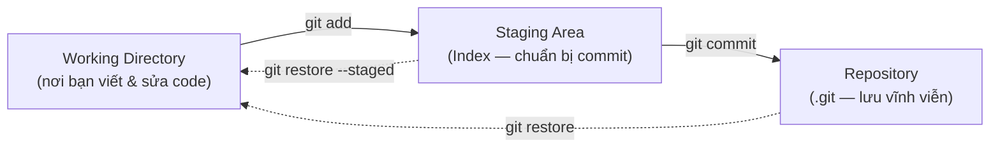
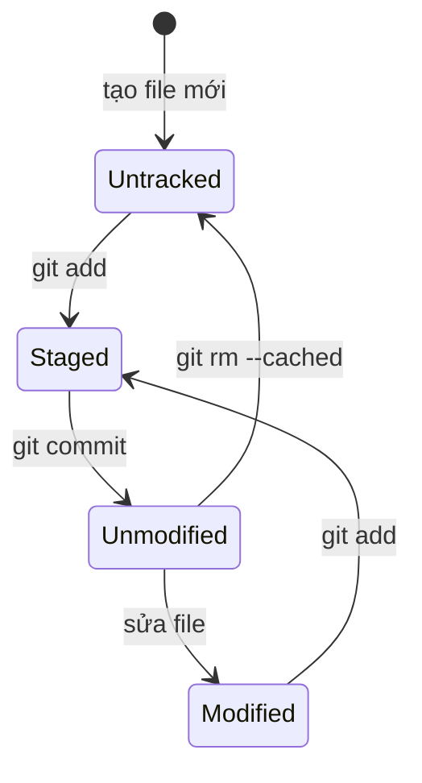

# Các khái niệm cốt lõi trong Git

Trước khi gõ bất kỳ lệnh Git nào, bạn cần hiểu **cách Git suy nghĩ**. Bài này giải thích các khái niệm nền tảng mà mọi thứ trong Git đều xây dựng trên đó.

---

## Mục lục

- [Vì sao Git có vùng staging & snapshot?](#vì-sao-git-có-vùng-staging--snapshot)
- [1. Ba vùng làm việc của Git](#1-ba-vùng-làm-việc-của-git)
- [2. Commit là gì?](#2-commit-là-gì)
- [3. SHA-1 Hash — Định danh duy nhất](#3-sha-1-hash-định-danh-duy-nhất)
- [4. HEAD là gì?](#4-head-là-gì)
- [5. Branch (Nhánh)](#5-branch-nhánh)
- [6. Detached HEAD](#6-detached-head)
- [7. Sơ đồ Commit History](#7-sơ-đồ-commit-history)
- [8. Thư mục .git](#8-thư-mục-git)
- [9. File States trong Git](#9-file-states-trong-git)
- [10. Lỗi thường gặp](#10-lỗi-thường-gặp)
- [11. Câu hỏi phỏng vấn](#11-câu-hỏi-phỏng-vấn)
- [Tổng kết](#tổng-kết)

---

## Vì sao Git có vùng staging & snapshot?

**Vấn đề:**

Khi bạn sửa nhiều file cho nhiều mục đích khác nhau, nếu commit "tất cả một lần" thì lịch sử lộn xộn, khó review và khó revert từng phần. Bạn cũng cần biết rõ file nào đang ở trạng thái nào.

```bash
# Bạn sửa 3 file cho 3 việc khác nhau:
# - login.js     (tính năng đăng nhập)
# - register.js  (tính năng đăng ký)
# - style.css    (sửa giao diện)

git commit -am "sua nhieu thu"
# -> Gộp hết vào 1 commit: lịch sử rối, không tách/revert được từng việc
```

**Giải pháp:**

Git tách quy trình thành 3 vùng và mỗi commit là một snapshot toàn bộ dự án.

```bash
# 3 vùng: Working Directory (đang sửa)
#         -> STAGING AREA (chọn lọc thay đổi sẽ vào commit)
#         -> Repository (commit đã lưu)

git add login.js
git commit -m "feat: them tinh nang dang nhap"   # 1 snapshot, có hash định danh

git add register.js
git commit -m "feat: them tinh nang dang ky"      # snapshot riêng, gọn gàng

# Mỗi commit lưu ảnh chụp TOÀN BỘ dự án (không chỉ diff),
# cho phép commit có chủ đích, dễ review và revert từng phần.
```

:::tip[Dùng thực tế]

- **Chọn lọc file vào commit:** `git add` chỉ những file liên quan, để commit gọn và đúng chủ đề.
- **Tách thành nhiều commit ý nghĩa:** mỗi việc một commit, dễ review và revert riêng lẻ.
- **Kiểm tra trạng thái:** dùng `git status` để biết file nào đang Modified, Staged hay Untracked.
- **Hiểu commit là snapshot:** mỗi commit là ảnh chụp toàn bộ dự án, có hash để truy xuất bất cứ lúc nào.

:::

---

## 1. Ba vùng làm việc của Git

Đây là khái niệm **quan trọng nhất** để hiểu Git. Mỗi file trong dự án của bạn tồn tại ở một trong 3 vùng:

```
+-------------------+     git add     +-------------------+    git commit    +-------------------+
|                   | -------------> |                   | --------------> |                   |
|  WORKING          |                |  STAGING AREA     |                 |  REPOSITORY       |
|  DIRECTORY        |                |  (Index)          |                 |  (.git)           |
|                   |                |                   |                 |                   |
|  Nơi bạn VIẾT    |                |  Nơi bạn CHUẨN   |                 |  Nơi Git LƯU      |
|  và CHỈNH SỬA    |                |  BỊ cho commit    |                 |  VĨNH VIỄN        |
|  code             |                |  tiếp theo        |                 |                   |
|                   | <------------- |                   | <-------------- |                   |
+-------------------+  git restore   +-------------------+  git restore    +-------------------+
                                                            --staged
```

Sơ đồ tổng quan dòng chảy giữa 3 vùng:



### 1.1 Working Directory (Thư mục làm việc)

Đây là **thư mục thực** trên máy tính của bạn — nơi bạn mở file, viết code, sửa lỗi.

```bash
# Bạn sửa file index.html
# -> File index.html ở trạng thái "modified" trong Working Directory

# Bạn tạo file mới style.css
# -> File style.css ở trạng thái "untracked" trong Working Directory
```

**Trạng thái file trong Working Directory:**

| Trạng thái     | Ý nghĩa                                 |
| -------------- | --------------------------------------- |
| **Untracked**  | File mới, Git chưa biết đến             |
| **Modified**   | File đã thay đổi so với lần commit cuối |
| **Deleted**    | File đã bị xoá                          |
| **Unmodified** | File không thay đổi gì                  |

### 1.2 Staging Area (Vùng chuẩn bị)

Đây là vùng **trung gian** — nơi bạn chọn những thay đổi nào sẽ được đưa vào commit tiếp theo.

```bash
# Thêm file vào Staging Area
git add index.html
# -> index.html chuyển từ Working Directory sang Staging Area

# Thêm tất cả file đã thay đổi
git add .
```

**Tại sao cần Staging Area? Tại sao không commit thẳng?**

Ví dụ thực tế: Bạn đang làm 2 việc cùng lúc:

```bash
# Bạn sửa 3 file:
# - login.js      (tính năng đăng nhập)
# - register.js   (tính năng đăng ký)
# - style.css     (sửa giao diện)

# KHÔNG CÓ Staging Area (kiểu SVN):
svn commit -m "them login va sua giao dien"
# -> Commit hết, không tách được

# CÓ Staging Area (Git):
git add login.js
git commit -m "feat: them tinh nang dang nhap"

git add register.js
git commit -m "feat: them tinh nang dang ky"

git add style.css
git commit -m "fix: sua loi giao dien trang chu"
# -> Tách thành 3 commit rõ ràng!
```

Staging Area cho phép bạn **chọn lọc** (selective commit) — chỉ commit những gì liên quan với nhau.

### 1.3 Repository (Kho lưu trữ)

Đây là **cơ sở dữ liệu** của Git, nằm trong thư mục `.git/`. Khi bạn `git commit`, Git lấy snapshot từ Staging Area và lưu vĩnh viễn vào đây.

```bash
git commit -m "feat: them tinh nang dang nhap"
# -> Tạo 1 commit mới trong Repository
# -> Commit này sẽ tồn tại MÃI MÃI (trừ khi bạn cố ý xoá)
```

### Toàn cảnh dòng chảy

```
Bạn sửa file  --->  git add  --->  git commit
    |                  |               |
    v                  v               v
 Working           Staging         Repository
 Directory          Area           (.git/)
    |                  |               |
    |   "Tôi đã sửa   |  "Tôi muốn   |  "Đã lưu thành
    |    xong"         |   commit      |   công vào
    |                  |   những       |   lịch sử"
    |                  |   thay đổi    |
    |                  |   này"        |
```

---

## 2. Commit là gì?

### Commit = Snapshot, không phải Diff

Nhiều người nghĩ commit là "lưu sự thay đổi". **Sai.**

Commit là **ảnh chụp toàn bộ trạng thái** của dự án tại một thời điểm.

```
Commit A:  [index.html v1] [style.css v1] [app.js v1]
    |
    v
Commit B:  [index.html v2] [style.css v1] [app.js v1]
    |       (đã sửa)        (không đổi,    (không đổi,
    v                        link đến v1)    link đến v1)
Commit C:  [index.html v2] [style.css v2] [app.js v2]
            (link đến v2)   (đã sửa)       (đã sửa)
```

**Tương tự như save game:**

| Game                              | Git                               |
| --------------------------------- | --------------------------------- |
| Save game                         | git commit                        |
| Load game                         | git checkout                      |
| Save slot 1, 2, 3...              | Commit A, B, C...                 |
| Mỗi save slot = trạng thái đầy đủ | Mỗi commit = snapshot đầy đủ      |
| Có thể load bất kỳ save nào       | Có thể checkout bất kỳ commit nào |

### Cấu trúc của một commit

```bash
git log --format=fuller -1
```

```
commit a1b2c3d4e5f6g7h8i9j0k1l2m3n4o5p6q7r8s9t0  <-- SHA-1 hash (định danh duy nhất)
Author:     Nguyen Van A <nguyenvana@example.com>    <-- Người viết code
AuthorDate: Mon Mar 25 10:30:00 2025 +0700           <-- Ngày viết
Commit:     Nguyen Van A <nguyenvana@example.com>    <-- Người commit
CommitDate: Mon Mar 25 10:30:00 2025 +0700           <-- Ngày commit
Parent:     f0e1d2c3b4a5...                          <-- Commit cha

    feat: them tinh nang dang nhap                   <-- Commit message
```

Mỗi commit chứa:

- **SHA-1 hash** — định danh duy nhất (40 ký tự hex)
- **Author** — người viết code
- **Committer** — người tạo commit (thường là cùng 1 người)
- **Date** — thời gian
- **Parent** — commit trước đó (commit đầu tiên không có parent)
- **Tree** — snapshot của tất cả file
- **Message** — mô tả thay đổi

---

## 3. SHA-1 Hash — Định danh duy nhất

Mỗi đối tượng trong Git (commit, file, tree...) đều có một **SHA-1 hash** — chuỗi 40 ký tự hex:

```
a1b2c3d4e5f6g7h8i9j0k1l2m3n4o5p6q7r8s9t0
```

### Tại sao dùng hash?

1. **Duy nhất:** Xác suất 2 commit có cùng hash là gần như 0
2. **Toàn vẹn:** Nếu nội dung thay đổi, hash sẽ khác — phát hiện được giả mạo
3. **Nhanh:** So sánh 2 hash để biết 2 đối tượng có giống nhau không

### Sử dụng hash trong thực tế

```bash
# Xem chi tiết 1 commit bằng full hash
git show a1b2c3d4e5f6g7h8i9j0k1l2m3n4o5p6q7r8s9t0

# Chỉ cần 7 ký tự đầu (Git tự tìm)
git show a1b2c3d

# Xem diff giữa 2 commit
git diff a1b2c3d f4e5d6c
```

Bạn **không cần nhớ** full hash. Git chỉ cần đủ ký tự đầu để phân biệt (thường là 7 ký tự).

---

## 4. HEAD là gì?

**HEAD** là một **con trỏ** (pointer) cho Git biết: "Bạn đang ở đâu trong lịch sử?"

### Trường hợp bình thường: HEAD trỏ đến branch

```
                       HEAD
                        |
                        v
                       main
                        |
                        v
commit A <--- commit B <--- commit C
```

HEAD -> main -> commit C. Nghĩa là bạn đang ở nhánh `main`, tại commit mới nhất `C`.

### Khi bạn commit mới

```bash
git commit -m "commit D"
```

```
                                    HEAD
                                     |
                                     v
                                    main
                                     |
                                     v
commit A <--- commit B <--- commit C <--- commit D
```

HEAD vẫn trỏ đến `main`, nhưng `main` tiến lên commit D.

### Xem HEAD đang ở đâu

```bash
# Xem HEAD
cat .git/HEAD
# ref: refs/heads/main   <-- HEAD trỏ đến branch main

# Xem commit mà HEAD đang trỏ đến
git rev-parse HEAD
# a1b2c3d4e5f6...
```

### Các cách tham chiếu tương đối từ HEAD

```bash
HEAD          # Commit hiện tại
HEAD~1        # Commit trước đó 1 bước (parent)
HEAD~2        # Commit trước đó 2 bước (grandparent)
HEAD~3        # Commit trước đó 3 bước

# Ví dụ:
git show HEAD       # Xem commit hiện tại
git show HEAD~1     # Xem commit trước
git diff HEAD~2     # So sánh với 2 commit trước
```

```
HEAD~3 <--- HEAD~2 <--- HEAD~1 <--- HEAD
commit A     commit B     commit C    commit D
```

---

## 5. Branch (Nhánh)

### Branch chỉ là một pointer

Đây là điều nhiều người bất ngờ: **branch trong Git chỉ là một file nhỏ chứa hash của commit**. Không có "copy code", không có "thư mục riêng".

```bash
# Xem nội dung của branch
cat .git/refs/heads/main
# a1b2c3d4e5f6...   <-- Chỉ là 1 dòng hash!
```

### Tại sao branch rẻ và nhanh?

Vì tạo branch = tạo 1 file 41 bytes (40 ký tự hash + newline). So sánh:

| Hệ thống | Tạo branch           | Kích thước |
| -------- | -------------------- | ---------- |
| SVN      | Copy toàn bộ thư mục | Hàng MB-GB |
| Git      | Tạo 1 file 41 bytes  | 41 bytes   |

### Branch hoạt động như thế nào

```
                       HEAD
                        |
                        v
                       main
                        |
                        v
commit A <--- commit B <--- commit C
```

Tạo branch mới:

```bash
git branch feature
```

```
                       HEAD
                        |
                        v
                       main
                        |
                        v
commit A <--- commit B <--- commit C
                              ^
                              |
                           feature
```

Giờ cả `main` và `feature` đều trỏ đến commit C. Chuyển sang `feature`:

```bash
git checkout feature
```

```
                       main
                        |
                        v
commit A <--- commit B <--- commit C
                              ^
                              |
                           feature
                              ^
                              |
                             HEAD
```

HEAD chuyển sang `feature`. Commit mới sẽ tiến `feature` lên:

```bash
git commit -m "them tinh nang moi"
```

```
                       main
                        |
                        v
commit A <--- commit B <--- commit C
                              \
                               \
                                commit D
                                  ^
                                  |
                               feature
                                  ^
                                  |
                                 HEAD
```

`main` vẫn ở commit C. `feature` tiến lên commit D. Đây là cách Git hỗ trợ **làm việc song song** trên nhiều nhánh.

---

## 6. Detached HEAD

### Khi nào xảy ra?

Khi bạn checkout trực tiếp một commit (thay vì một branch):

```bash
git checkout a1b2c3d
# Warning: You are in 'detached HEAD' state...
```

```
                       main
                        |
                        v
commit A <--- commit B <--- commit C
   ^
   |
  HEAD        <-- HEAD KHÔNG trỏ đến branch nào!
(detached)
```

### Tại sao nguy hiểm?

Nếu bạn tạo commit trong trạng thái detached HEAD:

```bash
git commit -m "thu nghiem"
```

```
                       main
                        |
                        v
commit A <--- commit B <--- commit C
   \
    \
     commit X   <-- Commit này không thuộc branch nào!
       ^
       |
      HEAD
```

Khi bạn chuyển về `main`, commit X sẽ **không có branch nào trỏ đến** và có thể bị Git dọn dẹp (garbage collect) sau một thời gian.

### Cách xử lý

```bash
# Cách 1: Tạo branch mới tại vị trí hiện tại
git checkout -b save-my-work

# Cách 2: Quay về branch cũ (bỏ mất commit trong detached HEAD)
git checkout main

# Cách 3: Nếu đã quay về main nhưng muốn cứu commit cũ
git reflog                    # Tìm hash của commit đã mất
git branch save-my-work abc123   # Tạo branch tại commit đó
```

**Quy tắc:** Luôn làm việc trên branch, tránh trạng thái detached HEAD trừ khi chỉ muốn **xem** code cũ.

---

## 7. Sơ đồ Commit History

Commit history trong Git là một **Directed Acyclic Graph (DAG)** — đồ thị có hướng, không có vòng lặp.

### Lịch sử tuyến tính (đơn giản)

```
commit A <--- commit B <--- commit C <--- commit D
(init)                                    (HEAD -> main)
```

Mỗi commit trỏ về parent của nó (commit trước đó).

### Lịch sử có branching và merging

```
commit A <--- commit B <--- commit C <--- commit F (merge) <--- commit G
                \                          /                     (HEAD -> main)
                 \                        /
                  commit D <--- commit E
                  (feature branch)
```

Commit F là **merge commit** — có 2 parent (C và E).

### Đọc lịch sử bằng `git log --graph`

```bash
git log --oneline --graph --all
```

```
*   f1a2b3c (HEAD -> main) Merge branch 'feature'
|\
| * e4d5c6b (feature) them validation
| * d7e8f9a them form login
|/
* c1b2a3d sua trang chu
* b4c5d6e them CSS
* a7b8c9d init project
```

Cách đọc:

- `*` = 1 commit
- `|` = dòng lịch sử của 1 branch
- `\` và `/` = branch tách ra hoặc merge vào
- `(HEAD -> main)` = HEAD đang ở branch main tại commit này

---

## 8. Thư mục .git

Khi bạn `git init`, Git tạo thư mục `.git/` — **toàn bộ "bộ não" của Git** nằm ở đây.

```bash
ls -la .git/
```

```
.git/
├── HEAD            # Con trỏ đến branch hiện tại
├── config          # Cấu hình local của repo này
├── description     # Mô tả repo (dùng cho GitWeb, ít khi cần)
├── hooks/          # Scripts chạy tự động (pre-commit, post-commit...)
├── index           # Staging Area (binary file)
├── info/           # Thông tin bổ sung
│   └── exclude     # Gitignore local (không commit)
├── objects/        # TẤT CẢ dữ liệu: commits, trees, blobs
│   ├── pack/       # Dữ liệu đã nén
│   └── info/
└── refs/           # BRANCH và TAG pointers
    ├── heads/      # Local branches
    │   └── main    # File nhỏ chứa hash của commit mới nhất trên main
    ├── tags/       # Tags
    └── remotes/    # Remote tracking branches
        └── origin/
            └── main
```

### Các thành phần quan trọng

| Thư mục/File    | Chức năng               | Ghi chú                                 |
| --------------- | ----------------------- | --------------------------------------- |
| `HEAD`          | Trỏ đến branch hiện tại | `ref: refs/heads/main`                  |
| `objects/`      | Lưu tất cả dữ liệu      | commits, files (blobs), trees           |
| `refs/heads/`   | Các branch local        | Mỗi branch = 1 file chứa hash           |
| `refs/remotes/` | Các branch remote       | Tracking branches                       |
| `refs/tags/`    | Các tag                 | Đánh dấu phiên bản                      |
| `index`         | Staging Area            | File binary, dùng `git ls-files` để đọc |
| `config`        | Config local            | Ghi đè global config                    |
| `hooks/`        | Hook scripts            | Tự động chạy khi commit, push...        |

### Xem nội dung objects

Git lưu 3 loại object:

```
+-----------+     +-----------+     +-----------+
|   BLOB    |     |   TREE    |     |  COMMIT   |
| (nội dung |     | (thư mục) |     | (snapshot)|
|  file)    |     |           |     |           |
| "hello"   |     | blob a1.. |     | tree b2.. |
|           |     | blob c3.. |     | parent d4 |
|           |     | tree e5.. |     | author... |
+-----------+     +-----------+     +-----------+
```

- **Blob:** Nội dung của 1 file (không có tên file!)
- **Tree:** Giống như thư mục — chứa danh sách blobs và trees con
- **Commit:** Metadata + pointer đến tree (snapshot)

```bash
# Xem loại object
git cat-file -t a1b2c3d
# commit

# Xem nội dung object
git cat-file -p a1b2c3d
# tree b4c5d6e7...
# parent f8a9b0c1...
# author Nguyen Van A <email> 1711234567 +0700
# committer Nguyen Van A <email> 1711234567 +0700
#
# feat: them tinh nang dang nhap
```

**Bạn không cần nhớ chi tiết này cho công việc hàng ngày.** Nhưng hiểu cách Git lưu dữ liệu sẽ giúp bạn debug khi gặp vấn đề.

---

## 9. File States trong Git

Tổng hợp trạng thái của file trong Git:

```
                    Untracked        Unmodified       Modified         Staged
                        |                |                |               |
                        |   git add      |                |               |
                        |--------------->|                |               |
                        |                |   Sửa file     |               |
                        |                |--------------->|               |
                        |                |                |   git add     |
                        |                |                |-------------->|
                        |                |                |               |
                        |                |   git commit   |               |
                        |                |<-------------------------------|
                        |   git rm       |                |               |
                        |<---------------|                |               |
                        |                |                |               |
```

Vòng đời của một file trong Git dưới dạng sơ đồ trạng thái:



| Trạng thái     | Mô tả                             | Hiển thị trong `git status`       |
| -------------- | --------------------------------- | --------------------------------- |
| **Untracked**  | File mới, Git chưa quản lý        | `Untracked files:` (đỏ)           |
| **Unmodified** | File không thay đổi               | Không hiển thị                    |
| **Modified**   | File đã sửa nhưng chưa stage      | `Changes not staged:` (đỏ)        |
| **Staged**     | File đã được add, sẵn sàng commit | `Changes to be committed:` (xanh) |

---

## 10. Lỗi thường gặp

### Lỗi 1: Không hiểu tại sao cần `git add` trước `git commit`

```bash
# Người mới thường hỏi: "Tại sao không commit thẳng?"
# Trả lời: Staging Area cho phép bạn CHỌN LỌC thay đổi

# Ví dụ: bạn sửa 5 file nhưng chỉ muốn commit 2 file
git add file1.js file2.js
git commit -m "feat: them tinh nang A"
# -> Chỉ 2 file được commit

# 3 file còn lại commit riêng
git add file3.js file4.js file5.js
git commit -m "fix: sua loi B"
```

### Lỗi 2: Nhầm HEAD với branch

```
HEAD  = "Bạn đang ở đâu?"     (con trỏ di động)
Branch = "Nhóm commit này"    (tên nhãn cho commit)

HEAD thường trỏ đến 1 branch.
Khi commit, branch tiến lên, HEAD đi theo.
```

### Lỗi 3: Nghĩ branch là "copy" của code

```
SAI:  "Tạo branch = copy toàn bộ code"
ĐÚNG: "Tạo branch = tạo 1 pointer 41 bytes"

Git KHÔNG copy bất kỳ file nào khi tạo branch.
Tất cả branches chia sẻ cùng dữ liệu objects.
```

### Lỗi 4: Hoảng sợ khi thấy "detached HEAD"

```bash
# Không phải lỗi! Chỉ là cảnh báo.
# Git nói: "Bạn đang không ở trên branch nào"

# Cách xử lý an toàn:
git checkout -b ten-branch-moi    # Tạo branch tại đây
# hoặc
git checkout main                  # Quay về branch cũ
```

### Lỗi 5: Xoá thư mục .git

```bash
# TUYỆT ĐỐI KHÔNG XOÁ .git/
rm -rf .git   # MẤT HẾT LỊCH SỬ!

# .git chứa TOÀN BỘ lịch sử, branches, configs
# Xoá nó = mất hết mọi thứ, chỉ còn file hiện tại
```

---

## 11. Câu hỏi phỏng vấn

### Câu 1: Giải thích 3 vùng làm việc của Git.

**Trả lời mẫu:**

> Git có 3 vùng: (1) Working Directory — nơi bạn chỉnh sửa file trực tiếp, (2) Staging Area (Index) — vùng trung gian, chọn những thay đổi cần commit, và (3) Repository (.git) — cơ sở dữ liệu lưu trữ vĩnh viễn các commit. Luồng làm việc: sửa file ở Working Directory -> `git add` để đưa vào Staging -> `git commit` để lưu vào Repository. Staging Area cho phép selective commit — chỉ commit những thay đổi liên quan với nhau.

### Câu 2: Commit trong Git là snapshot hay diff? Giải thích.

**Trả lời mẫu:**

> Commit là snapshot — ảnh chụp toàn bộ trạng thái của dự án tại thời điểm commit. Git không lưu diff giữa các version. Tuy nhiên, Git tối ưu bằng cách: nếu file không thay đổi, Git chỉ lưu một link (reference) đến blob cũ thay vì copy lại. Nhờ vậy Git vừa nhanh (truy xuất trực tiếp snapshot) vừa tiết kiệm dung lượng (không lưu trùng lặp).

### Câu 3: HEAD là gì? Detached HEAD là gì?

**Trả lời mẫu:**

> HEAD là con trỏ cho biết vị trí hiện tại trong lịch sử Git. Bình thường, HEAD trỏ đến một branch (ví dụ main), và khi commit, branch đó tiến lên commit mới. Detached HEAD xảy ra khi checkout trực tiếp một commit thay vì branch — khi đó HEAD trỏ đến commit cụ thể thay vì branch. Commit trong trạng thái này sẽ không thuộc branch nào và có thể bị mất khi chuyển branch. Cách xử lý: tạo branch mới tại vị trí đó bằng `git checkout -b ten-branch`.

### Câu 4: Branch trong Git là gì về mặt kỹ thuật?

**Trả lời mẫu:**

> Về kỹ thuật, branch chỉ là một file nhỏ (41 bytes) chứa SHA-1 hash của commit mới nhất trên branch đó. Ví dụ, file `.git/refs/heads/main` chứa hash của commit cuối trên main. Vì tạo branch chỉ là tạo 1 file nhỏ, nên thao tác branching trong Git cực nhanh, khác với SVN phải copy toàn bộ thư mục.

### Câu 5: Git lưu dữ liệu như thế nào bên trong thư mục .git?

**Trả lời mẫu:**

> Git lưu 3 loại object trong `.git/objects/`: (1) Blob — nội dung file (không có tên file), (2) Tree — giống thư mục, chứa danh sách blobs và trees con, (3) Commit — metadata (author, date, message) + pointer đến tree root. Mỗi object được định danh bằng SHA-1 hash của nội dung. HEAD là file trỏ đến branch hiện tại, refs/heads/ chứa các branch pointer, và index là Staging Area.

---

## Tổng kết

| Khái niệm         | Mô tả               | Ví von                        |
| ----------------- | ------------------- | ----------------------------- |
| Working Directory | Nơi bạn làm việc    | Bàn làm việc                  |
| Staging Area      | Nơi chuẩn bị commit | Giỏ hàng trước khi thanh toán |
| Repository        | Nơi lưu vĩnh viễn   | Kho hàng sau khi thanh toán   |
| Commit            | Snapshot của dự án  | Save game                     |
| SHA-1 Hash        | Định danh duy nhất  | Số CMND của commit            |
| HEAD              | Vị trí hiện tại     | "Bạn đang ở đây"              |
| Branch            | Pointer đến commit  | Nhãn dán trang sách           |
| .git/             | Cơ sở dữ liệu Git   | "Bộ não" của Git              |

**Bước tiếp theo:** Thực hành các lệnh Git cơ bản — init, add, commit, log, diff.
