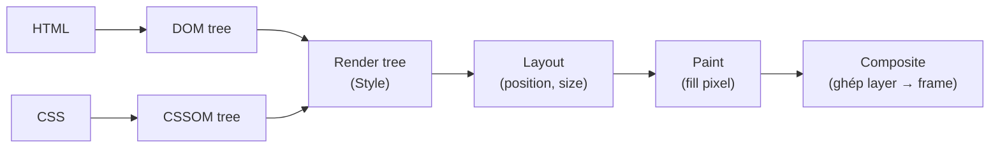

# Browser Rendering Pipeline

> *Hiểu rendering pipeline = biết tại sao animation lag, scroll giật, page chậm — và quan trọng hơn, cách fix.*

---

## Câu 1: Browser render page như thế nào? `[Intermediate]`

### Câu hỏi

> Em mô tả pipeline browser từ khi nhận HTML đến khi pixel hiện ra màn hình.

### Giải thích lý thuyết

**Critical Rendering Path** (đơn giản hoá):

1. **Parse HTML** → DOM tree.
2. **Parse CSS** → CSSOM tree.
3. **Style** — combine DOM + CSSOM → render tree.
4. **Layout** (reflow) — tính position, size của mọi visible element.
5. **Paint** — fill pixel vào layer.
6. **Composite** — combine các layer thành frame cuối.



Biết mỗi thay đổi style "nhảy vào" pipeline từ bước nào giải thích vì sao `transform`/`opacity` (chỉ Composite) rẻ hơn nhiều so với đổi `width`/`top` (phải chạy lại từ Layout):

Thay đổi style có thể trigger lại bước nào:

| Property change | Step trigger              |
| --------------- | ------------------------- |
| `width`, `height`, `top`, `left`, `padding`, font | Layout → Paint → Composite |
| `color`, `background`, `box-shadow`, `border-radius` | Paint → Composite |
| `transform`, `opacity` | Composite only (cheap!) |

### Code minh hoạ

```javascript
// Trigger Layout (expensive)
element.style.width = "200px";
element.style.padding = "10px";
element.style.fontSize = "20px";

// Trigger Paint (medium)
element.style.background = "red";
element.style.color = "blue";
element.style.boxShadow = "0 0 10px black";

// Trigger Composite only (cheap, GPU)
element.style.transform = "translateX(100px)";
element.style.opacity = "0.5";

// Animation BÀI HỌC: dùng transform/opacity, không dùng top/left/width
// ❌ Animate position bằng top
.box {
  animation: move 1s;
}
@keyframes move {
  from { top: 0; }
  to { top: 100px; }
}
/* Mỗi frame trigger Layout — janky */

// ✅ Animate bằng transform
@keyframes move {
  from { transform: translateY(0); }
  to { transform: translateY(100px); }
}
/* Chỉ composite — GPU, 60fps smooth */

// Promote layer cho animation
.box {
  will-change: transform; /* hint browser tạo composite layer */
}

// Backface visibility cho 3D
.flipper {
  transform-style: preserve-3d;
  backface-visibility: hidden; /* tránh paint mặt sau */
}
```

```javascript
// Đo render performance trong DevTools
performance.mark("start");
// Trigger DOM update
element.classList.add("active");
performance.mark("end");
performance.measure("render", "start", "end");

// Hoặc dùng requestAnimationFrame để đo frame time
let lastTime = performance.now();
function frame(time) {
  const delta = time - lastTime;
  console.log(`Frame: ${delta.toFixed(2)}ms`);
  // Mục tiêu: <16.67ms (60fps), <8.33ms (120fps)
  lastTime = time;
  requestAnimationFrame(frame);
}
requestAnimationFrame(frame);
```

### Đáp án mẫu

> "Pipeline: parse HTML thành DOM, parse CSS thành CSSOM, combine thành render tree, layout (tính position/size), paint (fill pixel vào layer), composite (combine layer thành frame). Quan trọng: thay đổi style trigger lại stage khác nhau. `width`/`height`/`top`/`left` trigger **Layout** — đắt nhất, browser phải tính lại position của mọi descendant. `color`/`background`/`box-shadow` trigger **Paint** — vừa. `transform`/`opacity` chỉ trigger **Composite** — chỉ GPU, cực rẻ. Đây là lý do rule vàng cho animation: **dùng `transform` và `opacity`, tránh `top`/`left`/`width`**. Animate position bằng `top` thì mỗi frame trigger layout, janky; bằng `transform: translate` thì composite-only, smooth 60fps. `will-change: transform` hint browser tạo composite layer riêng cho element đó, nhưng dùng sparingly — mỗi layer tốn GPU memory."

---

## Câu 2: Reflow vs Repaint — và cách tối ưu `[Intermediate]`

### Câu hỏi

> Code này có vấn đề gì về performance?
>
> ```javascript
> elements.forEach((el, i) => {
>   el.style.left = (el.offsetLeft + 10) + "px";
> });
> ```

### Giải thích lý thuyết

**Layout thrashing**: read + write style trong cùng loop → trigger reflow nhiều lần.

Khi gọi `offsetLeft` (read), browser phải đảm bảo layout up-to-date → flush queued style change → reflow ngay. Sau đó write trigger reflow nữa. Loop N element → N×2 reflow → cực chậm.

Fix: tách read và write thành 2 phase — batch read trước, batch write sau.

### Code minh hoạ

```javascript
// ❌ Layout thrashing — N×2 reflow
elements.forEach((el) => {
  el.style.left = (el.offsetLeft + 10) + "px";
  // Read offsetLeft → trigger reflow để đảm bảo accurate
  // Write left → trigger reflow nữa
});

// ✅ Batch: read tất cả trước
const lefts = elements.map((el) => el.offsetLeft);
elements.forEach((el, i) => {
  el.style.left = (lefts[i] + 10) + "px";
});

// Pattern: requestAnimationFrame cho write
function moveElements(elements) {
  const lefts = elements.map((el) => el.offsetLeft); // batch read

  requestAnimationFrame(() => {
    elements.forEach((el, i) => {
      el.style.transform = `translateX(${lefts[i] + 10}px)`; // batch write
    });
  });
}

// FastDOM lib pattern (legacy nhưng đúng concept)
const reads = [];
const writes = [];

elements.forEach((el) => {
  reads.push(() => el.offsetLeft);
});

requestAnimationFrame(() => {
  const lefts = reads.map((r) => r());
  elements.forEach((el, i) => {
    el.style.transform = `translateX(${lefts[i] + 10}px)`;
  });
});

// Properties trigger reflow khi đọc
const reflowTriggers = [
  "offsetWidth", "offsetHeight", "offsetTop", "offsetLeft",
  "clientWidth", "clientHeight", "scrollTop", "scrollLeft",
  "getBoundingClientRect()", "getComputedStyle()",
  "innerText", "scrollWidth", "scrollHeight",
];

// React: dùng useLayoutEffect cho measure + sync update
useLayoutEffect(() => {
  const rect = ref.current.getBoundingClientRect(); // measure
  setWidth(rect.width); // update state — render xong commit ngay
}, []);
// useEffect chạy sau paint → flash của giá trị cũ
// useLayoutEffect chạy sau DOM mutation trước paint → no flash
```

### Đáp án mẫu

> "Code này gây **layout thrashing**. Mỗi iteration: `offsetLeft` (read) buộc browser flush style queue + reflow để return giá trị accurate; rồi set `left` (write) trigger reflow nữa. Loop 100 element = ~200 reflow trong 1 frame — chắc chắn lag. Fix: **batch read trước, batch write sau**. Map qua elements lấy offsetLeft vào array, rồi loop set transform. Một detail: em đổi `style.left` thành `style.transform` — chỉ composite, không trigger layout, smooth hơn nhiều. Properties trigger reflow khi đọc gồm: offset/client/scroll dimensions, `getBoundingClientRect`, `getComputedStyle`, `innerText`. Trong React, em dùng `useLayoutEffect` (không `useEffect`) khi cần measure DOM rồi update state — chạy sync sau DOM mutation, trước paint, no flash của intermediate state."

---

## Câu 3: Tại sao animation lag và cách fix `[Senior]`

### Câu hỏi

> User báo animation hover scale của card "giật cục". Em debug?

### Giải thích lý thuyết

Animation 60fps cần mỗi frame ≤16.67ms. Causes lag:

1. **Animate property trigger Layout** (`width`, `top`) thay vì composite (`transform`).
2. **Heavy paint** — `box-shadow` blur lớn, gradient phức tạp.
3. **Main thread block** — JS chạy lâu khiến browser miss frame.
4. **Layer explosion** — quá nhiều `will-change` tạo memory pressure GPU.
5. **Large repaint area** — element to + animation cause repaint cả vùng.

Cách debug:
- DevTools Performance tab → record session, xem long task, dropped frame.
- Rendering tab → bật "Paint flashing" (xanh = repaint zones).
- Layers tab → xem composite layers.

### Code minh hoạ

```css
/* ❌ Animate width trigger Layout */
.card:hover {
  width: 220px; /* scale from 200 */
  transition: width 0.3s;
}

/* ✅ Animate transform */
.card:hover {
  transform: scale(1.1);
  transition: transform 0.3s;
}

/* Heavy box-shadow gây paint lag */
.card {
  box-shadow: 0 20px 80px rgba(0,0,0,0.3); /* large blur radius — chậm */
}

/* Tối ưu: pseudo-element + opacity transition */
.card {
  position: relative;
}
.card::after {
  content: "";
  position: absolute;
  inset: 0;
  box-shadow: 0 20px 80px rgba(0,0,0,0.3);
  opacity: 0;
  transition: opacity 0.3s;
  pointer-events: none;
}
.card:hover::after {
  opacity: 1;
}
/* Composite-only — không re-paint shadow */

/* Promote layer cho animation */
.card {
  will-change: transform;
  /* Browser tạo composite layer riêng — animation độc lập */
}

/* Cleanup will-change sau animation */
.card.animating {
  will-change: transform;
}
/* Set khi bắt đầu animation, remove khi xong */

/* contain — isolate element, reduce repaint cost */
.card {
  contain: layout style paint;
  /* Browser biết element này contained, không ảnh hưởng ngoài */
}

/* content-visibility — defer offscreen render */
.section {
  content-visibility: auto;
  contain-intrinsic-size: 0 500px;
  /* Browser skip render offscreen section đến khi scroll gần */
}
```

```javascript
// Đo dropped frame
let prevTime = performance.now();
let dropped = 0;

function tick(time) {
  const delta = time - prevTime;
  if (delta > 16.67 * 2) {
    dropped++;
    console.warn(`Dropped frame: ${delta.toFixed(1)}ms`);
  }
  prevTime = time;
  requestAnimationFrame(tick);
}
requestAnimationFrame(tick);

// React: dùng Framer Motion cho animation phức tạp
import { motion } from "framer-motion";

<motion.div
  whileHover={{ scale: 1.1 }}
  transition={{ duration: 0.3 }}
/>
// Framer Motion tự dùng transform, requestAnimationFrame, optimize
```

### Đáp án mẫu

> "Em mở DevTools Performance tab, record interaction. Check 3 thứ: thứ nhất, **JS long task** trên main thread block frame; thứ hai, **layout shift** (yellow bars) trong timeline; thứ ba, **paint flashing** trong Rendering tab xem repaint area to cỡ nào. Nguyên nhân phổ biến: animate property trigger Layout (`width`, `top`) thay vì composite (`transform`). Fix bằng `transform: scale(1.1)` thay vì `width: 220px`. Cho box-shadow nặng, em dùng pseudo-element trick: `::after` chứa shadow, fade in qua opacity — composite only, không re-paint shadow mỗi frame. Promote layer với `will-change: transform` cho element animate — browser tạo composite layer riêng, animation độc lập khỏi main paint. Modern CSS: `contain: layout style paint` isolate element, `content-visibility: auto` defer offscreen render — cả 2 đều giảm work browser phải làm mỗi frame. Cuối cùng: dùng Framer Motion cho complex animation — họ đã optimize hết."

---

## Câu 4: Critical Rendering Path optimization `[Senior]`

### Câu hỏi

> Page load chậm. LCP 5s. Em làm gì để giảm xuống 2s?

### Giải thích lý thuyết

LCP = thời gian render largest content element (image, heading). Phụ thuộc:

1. **TTFB** (Time to First Byte) — server response.
2. **Resource load** — HTML, CSS, font, image.
3. **Render-blocking resource** — CSS phải parse xong mới render.
4. **JS parse/execute** — block render nếu không defer.

Tối ưu:
- **Critical CSS inline** — inline above-fold CSS, defer rest.
- **Preload critical resource** — `<link rel="preload">` cho LCP image, font.
- **Defer non-critical JS** — `defer`, `async`, dynamic import.
- **Compress** — Brotli > gzip ~15% smaller.
- **CDN** — geographically close.
- **Server-side render / Stream** — HTML đến nhanh, no JS wait.
- **Image format** — WebP/AVIF.

### Code minh hoạ

```html
<!-- Preload critical resource -->
<head>
  <link rel="preload" href="/hero.avif" as="image" type="image/avif" fetchpriority="high" />
  <link rel="preload" href="/fonts/inter.woff2" as="font" type="font/woff2" crossorigin />
  <link rel="preload" href="/styles/critical.css" as="style" />

  <!-- Preconnect cho domain dùng sớm -->
  <link rel="preconnect" href="https://cdn.example.com" />
  <link rel="dns-prefetch" href="https://api.example.com" />

  <!-- Inline critical CSS -->
  <style>
    /* Above-the-fold styles */
    body { font-family: system-ui; margin: 0; }
    .hero { background: #fafafa; height: 100vh; }
  </style>

  <!-- Defer non-critical CSS -->
  <link rel="preload" href="/styles/main.css" as="style" onload="this.rel='stylesheet'" />
  <noscript><link rel="stylesheet" href="/styles/main.css" /></noscript>

  <!-- Async/defer JS -->
  <script src="/analytics.js" async></script>      <!-- không depend, load song song -->
  <script src="/app.js" defer></script>             <!-- depend DOM, exec sau parse -->
  <script type="module" src="/main.js"></script>   <!-- module deferred mặc định -->
</head>

<body>
  <!-- LCP image với priority hint -->
  
</body>
```

```javascript
// Next.js — built-in optimization
import Image from "next/image";

// LCP image
<Image src="/hero.jpg" width={1200} height={600} priority alt="" />

// Font preload tự động
import { Inter } from "next/font/google";
const inter = Inter({ subsets: ["latin"] });

// Dynamic import cho non-critical
const Chart = dynamic(() => import("./Chart"), { ssr: false });

// Resource hint helper
<head>
  <link rel="preconnect" href="https://api.example.com" />
  <link rel="modulepreload" href="/_next/static/chunks/main.js" />
</head>
```

```javascript
// Measure LCP
import { onLCP } from "web-vitals";

onLCP((metric) => {
  console.log("LCP:", metric.value);
  console.log("Element:", metric.entries[0].element);
  // Element gây LCP — biết tối ưu cái nào
});

// Chrome DevTools > Lighthouse > LCP detail cũng cho biết
```

### Đáp án mẫu

> "Em phân tích LCP element trước qua DevTools Lighthouse — biết cái gì là LCP (thường là hero image). Sau đó optimize theo thứ tự ROI: thứ nhất, **preload + fetchpriority='high'** cho LCP image — browser tải parallel với HTML parse thay vì chờ. Thứ hai, **next/image với `priority` prop** — Next tự inject preload + serve optimal format (AVIF/WebP). Thứ ba, **inline critical CSS** (CSS above-the-fold) và defer rest — không có render-blocking. Thứ tư, **preconnect** cho domain dùng sớm (API, CDN) — DNS + TCP + TLS handshake xong trước khi cần fetch. Thứ năm, **streaming SSR** với Next.js — server gửi HTML ngay khi có header + LCP, không chờ rest. Thứ sáu, **CDN gần user** — TTFB từ 500ms (origin VN xa) xuống 50ms (CDN edge). Cuối cùng, image format: WebP giảm 30%, AVIF 50% so với JPEG — tải nhanh hơn rõ. Một trang em từng tối ưu: LCP 5.2s → 1.4s chỉ với image format + preload + critical CSS — không refactor architecture."

---

## Câu 5: GPU acceleration và composite layers `[Senior]`

### Câu hỏi

> Em nghe nói "promote layer để animation mượt hơn". Làm sao? Khi nào KHÔNG nên?

### Giải thích lý thuyết

Browser composite layer được render bởi GPU, độc lập khỏi main thread. Animate composite property (transform, opacity) trên layer riêng = không block main, GPU handle frame.

Cách promote:
- `will-change: transform` — explicit hint.
- `transform: translateZ(0)` — trick cũ, force layer.
- `position: fixed/sticky` — auto promote.
- `<video>`, `<canvas>`, `<iframe>` — auto promote.

Trade-off:
- Mỗi layer tốn GPU memory.
- Quá nhiều layer → memory pressure, có thể slow down trên device yếu.
- "Layer explosion" — element trở thành parent stacking context, sub-element cũng tạo layer.

### Code minh hoạ

```css
/* Explicit promote */
.modal {
  will-change: transform;
}

/* Lifetime: chỉ set khi cần animate */
.modal {
  /* will-change KHÔNG ở đây — không animate ổn định */
}
.modal.animating {
  will-change: transform;
  /* Set ngay trước animation, remove sau */
}

/* Anti-pattern: will-change everywhere */
* {
  will-change: transform; /* ❌ layer explosion */
}

/* Auto-promote elements */
.sticky-header { position: sticky; }   /* auto */
.modal { position: fixed; }             /* auto */
video, canvas, iframe { /* auto */ }
```

```javascript
// DevTools: View > Show Layers (Layers panel)
// Hiện tất cả composite layers, memory each consume

// Programmatic detect layer issue
const layerCount = document.querySelectorAll("*").length;
console.log(`Total elements: ${layerCount}`);

// Hoặc dùng performance.measureUserAgentSpecificMemory (experimental)
const memory = await performance.measureUserAgentSpecificMemory();
console.log("Memory:", memory);

// Cleanup will-change dynamic
function animate(element) {
  element.style.willChange = "transform";

  element.addEventListener("animationend", () => {
    element.style.willChange = "auto"; // cleanup
  }, { once: true });

  element.classList.add("animating");
}

// CSS contain — isolate without forcing layer
.widget {
  contain: layout style paint;
  /* Browser optimize, không cần layer */
}
```

### Đáp án mẫu

> "Promote layer = browser tạo composite layer riêng cho element, animation chạy trên GPU độc lập main thread. Cách: `will-change: transform` (explicit), hoặc auto qua `position: fixed/sticky`, `<video>`. Trade-off: mỗi layer tốn GPU memory — đặc biệt trên device yếu (mobile cũ, low-end). Em KHÔNG promote khi: element không thực sự animate; element static lâu dài; layer quá nhiều và parent stacking context tạo cascade — gây 'layer explosion'. Best practice: set `will-change` **right before** animation, remove sau khi xong (qua JS event listener). Không set permanent trong CSS. Một alternative tốt hơn cho isolation: **`contain: layout style paint`** — browser biết element này contained, optimize internally, không cần force layer. Dùng cho widget, card list, dashboard component. Debug: DevTools > Layers panel hiển thị memory mỗi layer — nếu thấy 100+ layer là red flag, audit lại."

---

## Câu 6: Performance Observer và Real User Monitoring `[Senior]`

### Câu hỏi

> Em monitor performance ở field thế nào? Lab test (Lighthouse) đủ chưa?

### Giải thích lý thuyết

**Lab test** (Lighthouse local) reproducible nhưng không phản ánh user thật:
- Lab dùng device cố định, network throttle giả lập.
- Real user: device đa dạng, network biến động, location khác.

**Real User Monitoring (RUM)**: collect metric từ real user qua `PerformanceObserver`, gửi về analytics.

Key metrics:
- **LCP** — Largest Contentful Paint.
- **INP** — Interaction to Next Paint (thay FID 2024).
- **CLS** — Cumulative Layout Shift.
- **TTFB** — Time to First Byte.
- **FCP** — First Contentful Paint.

### Code minh hoạ

```javascript
// Web Vitals lib (Google official)
import { onLCP, onINP, onCLS, onFCP, onTTFB } from "web-vitals";

function send(metric) {
  // Use sendBeacon để gửi không block navigation
  const body = JSON.stringify(metric);

  if (navigator.sendBeacon) {
    navigator.sendBeacon("/api/vitals", body);
  } else {
    fetch("/api/vitals", { method: "POST", body, keepalive: true });
  }
}

onLCP(send);
onINP(send);
onCLS(send);
onFCP(send);
onTTFB(send);

// PerformanceObserver — fine-grained control
const lcpObserver = new PerformanceObserver((list) => {
  const entries = list.getEntries();
  const lastEntry = entries[entries.length - 1];
  console.log("LCP:", lastEntry.startTime, "Element:", lastEntry.element);
});
lcpObserver.observe({ type: "largest-contentful-paint", buffered: true });

// Long task — task >50ms
const longTaskObserver = new PerformanceObserver((list) => {
  for (const entry of list.getEntries()) {
    console.warn("Long task:", entry.duration, entry.attribution);
  }
});
longTaskObserver.observe({ type: "longtask", buffered: true });

// Layout shift
const clsObserver = new PerformanceObserver((list) => {
  for (const entry of list.getEntries()) {
    if (entry.hadRecentInput) continue; // ignore user-initiated shift
    console.log("Layout shift:", entry.value, entry.sources);
  }
});
clsObserver.observe({ type: "layout-shift", buffered: true });

// Resource timing — biết file nào chậm load
const resourceObserver = new PerformanceObserver((list) => {
  for (const entry of list.getEntries()) {
    if (entry.duration > 1000) {
      console.warn("Slow resource:", entry.name, entry.duration);
    }
  }
});
resourceObserver.observe({ type: "resource", buffered: true });

// Backend: aggregate + alert
// app/api/vitals/route.ts
export async function POST(req) {
  const metric = await req.json();
  await analytics.track({
    metric: metric.name,
    value: metric.value,
    rating: metric.rating, // good/needs-improvement/poor
    userAgent: req.headers.get("user-agent"),
    url: metric.url,
  });

  // Alert nếu p75 LCP > 2.5s
  return Response.json({ ok: true });
}
```

```jsx
// Next.js: built-in vitals reporting
// app/layout.tsx
import { SpeedInsights } from "@vercel/speed-insights/next";
import { Analytics } from "@vercel/analytics/react";

export default function RootLayout({ children }) {
  return (
    <html>
      <body>
        {children}
        <SpeedInsights />
        <Analytics />
      </body>
    </html>
  );
}

// Pages Router cũ: reportWebVitals
export function reportWebVitals(metric) {
  // metric.name = "LCP" | "FID" | "CLS" | ...
  fetch("/api/vitals", { method: "POST", body: JSON.stringify(metric) });
}
```

### Đáp án mẫu

> "Lab test không đủ. Lighthouse chạy với device profile cố định, network throttle giả lập — không match real user. Em luôn pair với **RUM** dùng `web-vitals` lib gửi metric từ real user về backend. Key metric: LCP, INP, CLS, TTFB, FCP. Gửi bằng `navigator.sendBeacon` thay vì fetch — không block navigation khi user rời page. Backend aggregate theo **p75** (75th percentile) — đo trải nghiệm user 'thường', không phải worst case. Threshold Google: LCP good ≤2.5s, INP ≤200ms, CLS ≤0.1. Em alert nếu p75 vượt threshold trong 24h. `PerformanceObserver` cho fine-grained control: observe `longtask` (>50ms block main thread) — biết khi nào JS chạy lâu; `layout-shift` — biết element nào gây CLS với `entry.sources`; `resource` timing — biết file nào slow. Với Next.js em dùng `@vercel/speed-insights` — RUM tích hợp, không cần tự viết backend. Khi LCP của 1 phần user fail thường xuyên, thường là device/region cụ thể — segment data theo userAgent/country để tìm pattern."

---

## Bẫy thường gặp khi trả lời

| Sai lầm                                                | Đúng là                                                              |
| ------------------------------------------------------ | -------------------------------------------------------------------- |
| "Animate bằng top/left mượt hơn vì có position"        | Trigger Layout — janky. Dùng transform                                |
| "`will-change` luôn cải thiện performance"             | Memory cost; lạm dụng gây slow down                                  |
| "Lighthouse score 100 là đủ"                           | Lab; real user có thể vẫn slow do device/network                     |
| "GPU acceleration miễn phí"                            | Tốn GPU memory; layer explosion thực sự tệ                            |
| "Critical CSS inline làm page chậm hơn"                | Ngược lại — render ngay không chờ external CSS                       |
