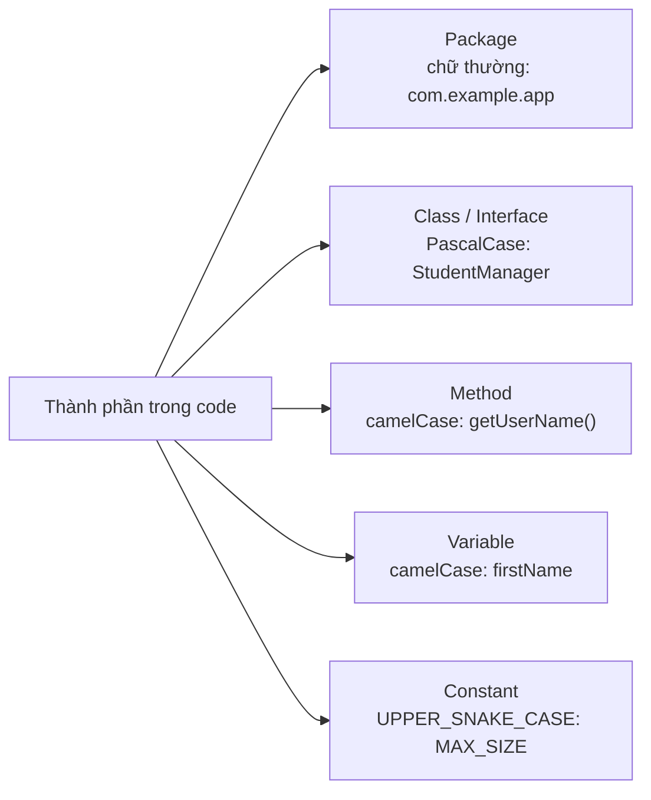

# Tiêu chuẩn coding trong Java - Coding Standards

**Coding Standards** (tiêu chuẩn lập trình) là tập hợp các quy tắc và quy ước khi viết code. Tuân thủ tiêu chuẩn giúp code dễ đọc, dễ bảo trì và nhất quán giữa các thành viên trong nhóm.

Sơ đồ dưới đây tóm tắt quy tắc đặt tên cho từng thành phần trong code Java:



Đọc sơ đồ: mỗi loại thành phần có một kiểu viết tên riêng — nắm quy tắc này giúp code của bạn trông "đúng chuẩn Java" ngay từ cái nhìn đầu tiên.

---

## Quy tắc đặt tên (Naming Conventions)

### 1. Package (Gói)

- Viết **toàn bộ chữ thường**
- Dùng dấu chấm phân cấp
- Thường theo tên miền đảo ngược

```java
// Đúng
package com.company.project.module;
package vn.example.helloworld;

// Sai
package Com.Company.Project;
package myPackage;
```

### 2. Class và Interface (Lớp và Giao diện)

- Dùng **PascalCase** (UpperCamelCase): chữ cái đầu mỗi từ viết HOA
- Tên danh từ, mô tả đối tượng

```java
// Đúng
public class StudentManager {}
public class BankAccount {}
public interface Serializable {}
public interface Comparable<T> {}

// Sai
public class studentManager {}
public class bank_account {}
```

### 3. Method (Phương thức)

- Dùng **camelCase**: chữ cái đầu từ đầu viết thường, các từ tiếp theo viết HOA
- Tên động từ, mô tả hành động

```java
// Đúng
public void printReport() {}
public String getUserName() {}
public boolean isValid() {}
public int calculateTotal() {}

// Sai
public void PrintReport() {}
public void print_report() {}
```

### 4. Biến (Variable)

- Dùng **camelCase**
- Tên ngắn gọn, có ý nghĩa

```java
// Đúng
int studentAge = 20;
String firstName = "An";
boolean isActive = true;
double accountBalance = 1000.0;

// Sai
int a = 20;          // quá ngắn, không rõ nghĩa
int student_age = 20; // dùng gạch dưới
int StudentAge = 20;  // viết hoa chữ đầu
```

### 5. Hằng số (Constant)

- Viết **toàn bộ CHỮ HOA**
- Các từ nối bằng dấu **gạch dưới** `_`
- Khai báo `static final`

```java
// Đúng
public static final int MAX_SIZE = 100;
public static final double PI = 3.14159;
public static final String APP_NAME = "MyApp";

// Sai
public static final int maxSize = 100;
public static final double pi = 3.14159;
```

---

## Quy tắc định dạng code (Formatting)

### Thụt đầu dòng (Indentation)

Dùng **4 dấu cách** (hoặc 1 tab) cho mỗi cấp thụt:

```java
public class Example {
    public void method() {
        if (condition) {
            for (int i = 0; i < 10; i++) {
                System.out.println(i);
            }
        }
    }
}
```

### Dấu ngoặc nhọn `{}`

Dấu `{` mở ngoặc đặt **cùng dòng** với khai báo (kiểu K&R):

```java
// Đúng (Java convention)
public class MyClass {
    public void myMethod() {
        if (x > 0) {
            // code
        }
    }
}

// Sai (Allman style — không dùng trong Java)
public class MyClass
{
    public void myMethod()
    {
    }
}
```

### Độ dài dòng

Mỗi dòng **không quá 80-120 ký tự**. Nếu dài hơn, xuống dòng:

```java
// Cách ngắt dòng dài
String message = "Đây là một chuỗi rất dài cần phải "
        + "ngắt thành nhiều dòng cho dễ đọc.";

// Ngắt dòng tham số phương thức
public void createUser(
        String firstName,
        String lastName,
        String email,
        int age) {
    // ...
}
```

---

## Quy tắc viết comment (Commenting)

### Javadoc comment — tài liệu công khai

```java
/**
 * Tính tổng hai số nguyên.
 *
 * @param a số thứ nhất
 * @param b số thứ hai
 * @return tổng của a và b
 */
public int add(int a, int b) {
    return a + b;
}
```

### Comment giải thích logic phức tạp

```java
// Tính tổng từ 1 đến n theo công thức Gauss
int sum = n * (n + 1) / 2;

/*
 * Kiểm tra số nguyên tố:
 * - Nếu n < 2: không phải số nguyên tố
 * - Chỉ cần kiểm tra đến sqrt(n)
 */
```

### Không viết comment thừa

```java
// Sai: comment thừa, code đã rõ nghĩa
int age = 25;  // gán 25 cho biến age

// Đúng: comment giải thích tại sao, không giải thích cái gì
int retryCount = 3;  // Số lần thử lại khi gặp lỗi mạng
```

---

## Một số quy tắc khác

### Khai báo một biến mỗi dòng

```java
// Đúng
int a = 1;
int b = 2;

// Sai
int a = 1, b = 2;
```

### Luôn dùng dấu ngoặc nhọn cho if/for/while

```java
// Đúng: an toàn hơn
if (condition) {
    doSomething();
}

// Sai: dễ gây bug khi thêm dòng sau
if (condition)
    doSomething();
```

### Xử lý ngoại lệ đúng cách

```java
// Sai: bắt exception quá chung, nuốt lỗi
try {
    // code
} catch (Exception e) {
    // bỏ trống
}

// Đúng: xử lý cụ thể
try {
    // code
} catch (IOException e) {
    System.err.println("Lỗi đọc file: " + e.getMessage());
    throw e;
}
```

---

## Công cụ hỗ trợ

| Công cụ | Chức năng |
|---|---|
| **Checkstyle** | Kiểm tra tự động coding standards |
| **SonarQube** | Phân tích chất lượng code toàn diện |
| **Google Java Format** | Tự động format code theo chuẩn Google |
| **IntelliJ/Eclipse** | Tích hợp sẵn formatter |

---

## Tóm tắt

| Thành phần | Quy tắc đặt tên | Ví dụ |
|---|---|---|
| Package | chữ thường | `com.example.app` |
| Class/Interface | PascalCase | `StudentManager` |
| Method | camelCase | `getUserName()` |
| Variable | camelCase | `firstName` |
| Constant | UPPER_SNAKE_CASE | `MAX_SIZE` |
