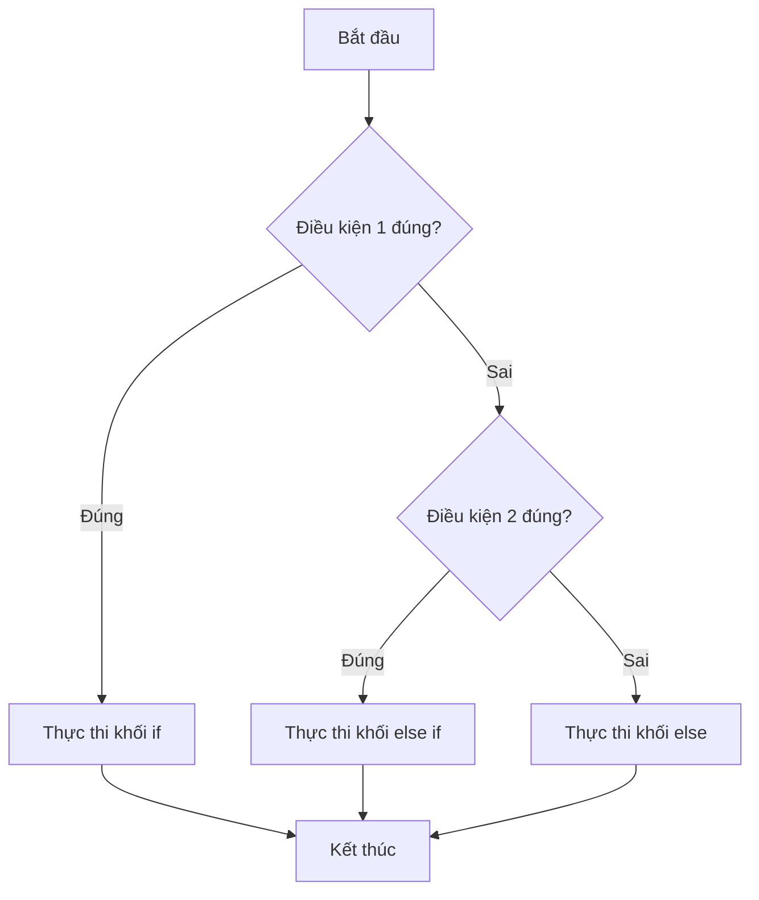

# Mệnh đề if-else trong Java

> 📝 Nội dung sẽ được bổ sung sau (xem lộ trình Java chính).

Sơ đồ dưới đây minh họa luồng rẽ nhánh của cấu trúc `if - else if - else`:

Đọc sơ đồ: chương trình kiểm tra lần lượt từng điều kiện; khi gặp điều kiện đúng đầu tiên thì chạy khối tương ứng rồi bỏ qua các nhánh còn lại. Nếu không điều kiện nào đúng, khối `else` sẽ chạy.

:::note[Ghi nhớ nhanh]

- ⭐ **Kiểm tra tuần tự, dừng ở điều kiện đúng đầu tiên** — `if - else if - else` xét từng điều kiện từ trên xuống; điều kiện đúng đầu tiên được chạy, các nhánh còn lại bị bỏ qua.
- **`else` là nhánh dự phòng** — chỉ chạy khi không điều kiện nào ở trên đúng.
- **Mỗi lần chạy chỉ đi vào một khối** — sau khi thực thi xong một nhánh, luồng nhảy tới điểm kết thúc chung.

:::
