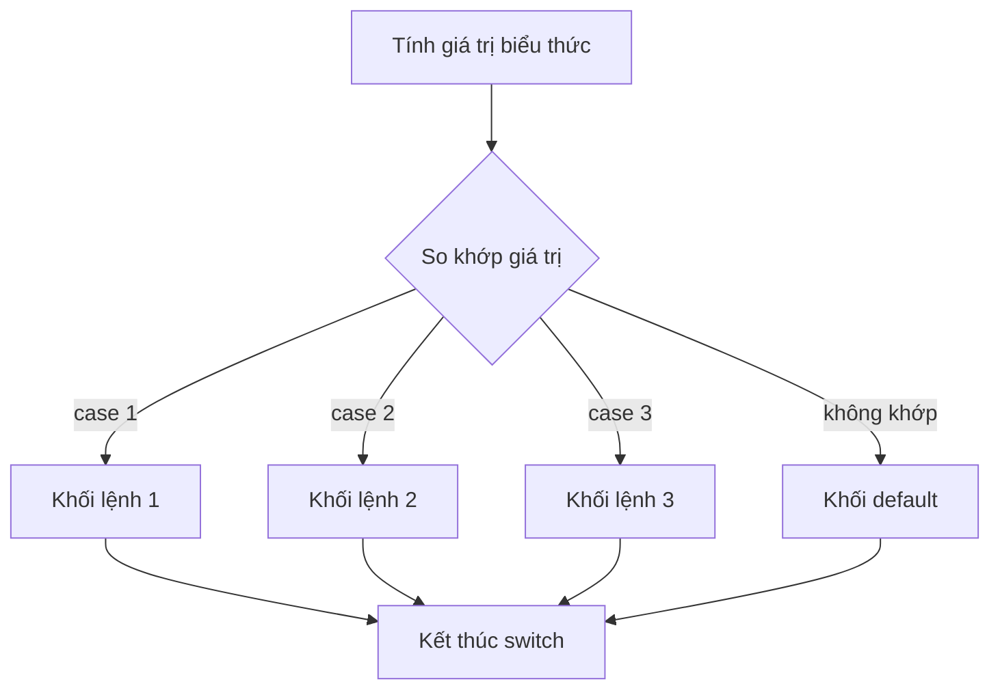

# Mệnh đề switch-case trong Java

> 📝 Nội dung sẽ được bổ sung sau (xem lộ trình Java chính).

Sơ đồ dưới đây minh họa cách `switch` chọn nhánh dựa trên giá trị của biểu thức:

Đọc sơ đồ: giá trị biểu thức được so khớp với từng `case`; nhánh trùng khớp sẽ chạy. Nếu không `case` nào khớp thì khối `default` chạy (nếu có).
