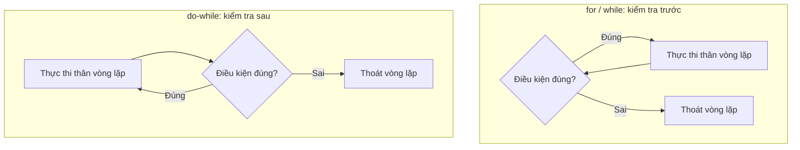

# Vòng lặp for, while, do-while trong Java

> 📝 Nội dung sẽ được bổ sung sau (xem lộ trình Java chính).

Sơ đồ dưới đây so sánh hai kiểu vòng lặp: kiểm tra điều kiện **trước** (`for`, `while`) và kiểm tra điều kiện **sau** (`do-while`):

Đọc sơ đồ: `for` và `while` có thể chạy 0 lần nếu điều kiện sai ngay từ đầu; còn `do-while` luôn chạy thân vòng lặp **ít nhất một lần** vì kiểm tra điều kiện đặt ở cuối.
