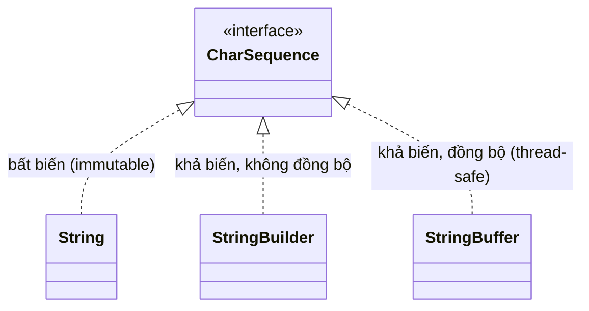

# Java String, StringBuffer và StringBuilder

> 📝 Nội dung sẽ được bổ sung sau (xem lộ trình Java chính).

Sơ đồ dưới đây minh họa quan hệ giữa ba lớp xử lý chuỗi và interface chung `CharSequence`:

Đọc sơ đồ: cả ba lớp đều hiện thực `CharSequence`. `String` bất biến nên an toàn nhưng tốn bộ nhớ khi nối chuỗi nhiều lần; `StringBuilder` khả biến, nhanh nhất trong môi trường đơn luồng; `StringBuffer` cũng khả biến nhưng đồng bộ (thread-safe) nên an toàn khi nhiều luồng cùng dùng.
