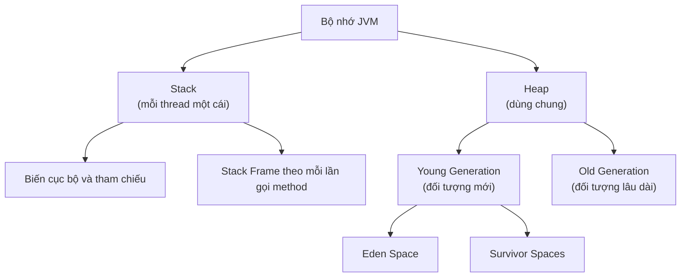

# Quản lý bộ nhớ Heap Space vs Stack

Hiểu về cách Java quản lý bộ nhớ giúp bạn viết code hiệu quả hơn và tránh các lỗi như `OutOfMemoryError` hay `StackOverflowError`.

Sơ đồ dưới đây minh họa cách bộ nhớ JVM được chia thành hai vùng chính và các thành phần bên trong:



Đọc sơ đồ: mỗi luồng có Stack riêng để lưu biến cục bộ và các frame gọi method; còn Heap dùng chung cho mọi luồng, chứa các đối tượng và được chia thành Young/Old Generation phục vụ cho Garbage Collector.

:::note[Ghi nhớ nhanh]

- ⭐ **Stack — riêng mỗi luồng** — lưu biến cục bộ, tham chiếu và stack frame theo mỗi lần gọi method; nhanh, nhỏ, tự động dọn khi method kết thúc (LIFO).
- ⭐ **Heap — dùng chung mọi luồng** — lưu tất cả đối tượng và mảng tạo bằng `new`, được `Garbage Collector` quản lý, chia thành Young/Old Generation.
- **`String Pool`** — vùng đặc biệt trong Heap tái sử dụng chuỗi literal; `String` literal có thể `==` (cùng địa chỉ), còn `new String()` luôn tạo đối tượng mới.
- **Kiểu nguyên thủy vs đối tượng** — giá trị nguyên thủy (`int`, `double`) nằm trực tiếp trên Stack; đối tượng nằm trên Heap, Stack chỉ giữ tham chiếu.
- **Lỗi thường gặp** — `StackOverflowError` khi Stack đầy (đệ quy vô hạn); `OutOfMemoryError` khi Heap hết chỗ.

:::

---

## Bộ nhớ JVM được chia thành hai vùng chính

```
JVM Memory
├── Stack (Ngăn xếp)
│     ├── Frame của method main()
│     ├── Frame của method add()
│     └── Frame của method ...
└── Heap (Vùng nhớ chung)
      ├── Young Generation (đối tượng mới)
      │     ├── Eden Space
      │     └── Survivor Spaces
      └── Old Generation (đối tượng lâu dài)
```

---

## Stack (Ngăn xếp)

**Stack** (ngăn xếp) là vùng nhớ dành cho **từng luồng** (thread), lưu trữ:

- **Stack Frame** (khung ngăn xếp): Mỗi lần gọi phương thức, một frame mới được đẩy vào stack
- **Biến cục bộ** (local variables): Biến khai báo bên trong phương thức
- **Tham số phương thức** (method parameters)
- **Giá trị trả về** (return values)
- **Tham chiếu đến đối tượng** (object references — địa chỉ trỏ đến Heap)

### Đặc điểm của Stack

| Đặc điểm | Mô tả |
|---|---|
| Cấu trúc | LIFO (Last In, First Out — vào sau ra trước) |
| Kích thước | Nhỏ, cố định (thường 256KB - 1MB) |
| Tốc độ | Rất nhanh |
| Quản lý | Tự động (tạo khi gọi method, xóa khi method kết thúc) |
| Phạm vi | Mỗi thread có stack riêng |

```java
public class StackDemo {
    public static void main(String[] args) {
        int a = 10;        // a lưu trên stack (giá trị nguyên thủy)
        int b = 20;        // b lưu trên stack
        int result = add(a, b);  // Tạo frame mới cho add()
        System.out.println(result);
    }  // Frame main() bị hủy, a và b bị xóa

    public static int add(int x, int y) {
        int sum = x + y;   // sum lưu trên stack
        return sum;
    }  // Frame add() bị hủy, x, y, sum bị xóa
}
```

**Hình dung Stack khi chạy:**
```
Khi gọi add(a, b):
Stack:
  [Frame: add] → x=10, y=20, sum=30
  [Frame: main] → a=10, b=20, result=?

Sau khi add() kết thúc:
Stack:
  [Frame: main] → a=10, b=20, result=30
```

---

## Heap (Vùng nhớ chung)

**Heap** (vùng nhớ chung) là nơi lưu trữ **tất cả đối tượng** (objects) và **mảng** (arrays) được tạo bằng từ khóa `new`.

### Đặc điểm của Heap

| Đặc điểm | Mô tả |
|---|---|
| Kích thước | Lớn, có thể cấu hình (mặc định 256MB - vài GB) |
| Tốc độ | Chậm hơn Stack |
| Quản lý | Bởi **Garbage Collector** (GC) |
| Phạm vi | Dùng chung cho tất cả threads |
| Truy cập | Thông qua tham chiếu (reference) |

```java
public class HeapDemo {
    public static void main(String[] args) {
        // Đối tượng String lưu trên Heap
        // str là tham chiếu lưu trên Stack, trỏ đến Heap
        String str = new String("Hello");

        // Mảng lưu trên Heap
        int[] arr = new int[5];  // arr (Stack) trỏ đến mảng (Heap)

        // Đối tượng Person lưu trên Heap
        Person person = new Person("An", 25);
    }
}

class Person {
    String name;  // tham chiếu trên Heap, trỏ đến String khác trên Heap
    int age;      // giá trị nguyên thủy, lưu trong đối tượng trên Heap

    Person(String name, int age) {
        this.name = name;
        this.age = age;
    }
}
```

---

## Phân biệt rõ: Stack lưu gì, Heap lưu gì?

```java
public class MemoryDemo {
    public static void main(String[] args) {
        // Kiểu nguyên thủy → giá trị lưu trực tiếp trên STACK
        int x = 5;       // Stack: x = 5
        double d = 3.14; // Stack: d = 3.14

        // Đối tượng → tham chiếu lưu trên STACK, đối tượng lưu trên HEAP
        String s = new String("Java");
        //  Stack: s = [địa chỉ]
        //  Heap: đối tượng String "Java" tại địa chỉ đó

        String s2 = s;  // s2 cũng trỏ đến CÙNG đối tượng trên Heap
    }
}
```

**Hình dung:**
```
STACK                 HEAP
---------             ---------
x → 5
d → 3.14
s → [0x100]  ──────→  [0x100] String: "Java"
s2 → [0x100] ──────↗
```

---

## String Pool — vùng đặc biệt trong Heap

**String Pool** (hồ chuỗi) là vùng đặc biệt trong Heap, Java lưu các chuỗi ký tự để **tái sử dụng** và tiết kiệm bộ nhớ:

```java
public class StringPoolDemo {
    public static void main(String[] args) {
        // Dùng String literal → Java kiểm tra String Pool trước
        String a = "Hello";   // Tạo mới trong Pool
        String b = "Hello";   // Tái sử dụng từ Pool → cùng địa chỉ!

        System.out.println(a == b);       // true (cùng đối tượng)
        System.out.println(a.equals(b));  // true

        // Dùng new String → luôn tạo đối tượng mới trên Heap
        String c = new String("Hello");   // Đối tượng mới, ngoài Pool
        String d = new String("Hello");   // Đối tượng mới khác

        System.out.println(c == d);       // false (khác đối tượng)
        System.out.println(c.equals(d));  // true (cùng nội dung)

        // intern() → đưa về String Pool
        String e = c.intern();  // Trả về tham chiếu từ Pool
        System.out.println(a == e);  // true
    }
}
```

---

## Garbage Collector (GC)

**Garbage Collector** (bộ thu gom rác) là cơ chế Java tự động **giải phóng bộ nhớ** cho các đối tượng không còn được tham chiếu.

```java
public class GCDemo {
    public static void main(String[] args) {
        // person1 trỏ đến đối tượng Person("An")
        Person person1 = new Person("An", 25);

        // person1 trỏ sang đối tượng Person("Bình")
        // Person("An") không còn tham chiếu → GC sẽ thu hồi
        person1 = new Person("Bình", 30);

        // local object → bị hủy khi method kết thúc
        createTemporary();
    }

    static void createTemporary() {
        Person temp = new Person("Tạm thời", 0);
        // temp bị hủy sau khi method này kết thúc
        // Đối tượng Person("Tạm thời") đủ điều kiện GC
    }
}
```

> GC chạy tự động, bạn không cần gọi thủ công. Tuy nhiên, giữ tham chiếu đến đối tượng không dùng nữa sẽ gây **memory leak** (rò rỉ bộ nhớ).

---

## Lỗi thường gặp

### StackOverflowError

Xảy ra khi Stack bị đầy, thường do **đệ quy vô hạn**:

```java
public class StackOverflowDemo {
    public static void main(String[] args) {
        infiniteRecursion();  // StackOverflowError!
    }

    static void infiniteRecursion() {
        infiniteRecursion();  // Gọi chính mình mãi mãi
    }
}
```

### OutOfMemoryError

Xảy ra khi Heap không còn chỗ:

```java
import java.util.ArrayList;
import java.util.List;

public class OOMDemo {
    public static void main(String[] args) {
        List<byte[]> list = new ArrayList<>();
        while (true) {
            list.add(new byte[1024 * 1024]);  // Thêm 1MB mỗi vòng
            // OutOfMemoryError: Java heap space
        }
    }
}
```

---

## Tóm tắt so sánh

| | Stack | Heap |
|---|---|---|
| Lưu trữ | Biến cục bộ, tham chiếu, frame | Đối tượng, mảng |
| Kích thước | Nhỏ (KB - MB) | Lớn (MB - GB) |
| Tốc độ | Rất nhanh | Chậm hơn |
| Quản lý | Tự động theo method | Garbage Collector |
| Thread | Mỗi thread có stack riêng | Dùng chung |
| Lỗi khi đầy | `StackOverflowError` | `OutOfMemoryError` |
