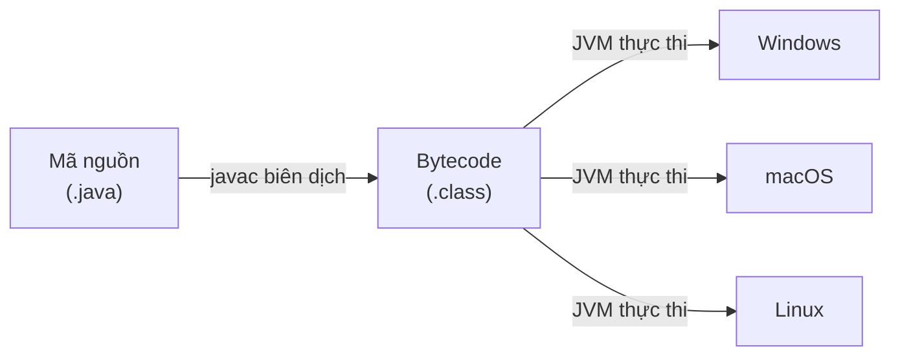

# Tổng quan về ngôn ngữ lập trình Java

Java là một trong những ngôn ngữ lập trình phổ biến và được dùng nhiều nhất trên thế giới, từ ứng dụng ngân hàng, web cho đến Android. Bài này giúp bạn nắm bức tranh tổng quan: Java là gì, vì sao nó chạy được trên mọi nền tảng, và những lĩnh vực mà Java đang thống trị. Đây là điểm khởi đầu trước khi đi sâu vào từng chủ đề cụ thể bên dưới.

:::note[Ghi nhớ nhanh]

- ⭐ **Java hướng đối tượng, "Write Once, Run Anywhere"** — cùng một chương trình chạy trên mọi hệ điều hành có `JVM`.
- ⭐ **Quy trình thực thi** — mã nguồn `.java` được `javac` biên dịch thành bytecode `.class`, rồi `JVM` đọc và chạy trên từng hệ điều hành.
- **Đặc điểm nổi bật** — quản lý bộ nhớ tự động qua `Garbage Collector`, an toàn kiểu lúc biên dịch, hỗ trợ đa luồng.
- **Nên dùng bản LTS** — Java 8, 11, 17, 21 là các bản hỗ trợ dài hạn, phù hợp cho dự án thực tế.
- **Ứng dụng rộng** — doanh nghiệp, web (Spring Boot), Android, hệ phân tán (Hadoop, Kafka) và hệ nhúng.

:::

## Java là gì?

**Java** là một ngôn ngữ lập trình **hướng đối tượng** (Object-Oriented Programming — OOP), được **James Gosling** và nhóm kỹ sư tại Sun Microsystems phát triển năm 1991, ra mắt chính thức năm 1995. Hiện tại Java được Oracle duy trì và phát triển.

Khẩu hiệu nổi tiếng của Java: **"Write Once, Run Anywhere"** — Viết một lần, chạy mọi nơi.

## Đặc điểm nổi bật của Java

| Đặc điểm | Mô tả |
|---|---|
| **Hướng đối tượng** | Mọi thứ trong Java đều là đối tượng (object) |
| **Độc lập nền tảng** | Chạy trên bất kỳ hệ điều hành nào có JVM |
| **Quản lý bộ nhớ tự động** | **Garbage Collector** (bộ dọn rác) tự thu hồi bộ nhớ không dùng |
| **An toàn kiểu dữ liệu** | Kiểm tra kiểu tại thời điểm biên dịch (compile-time) |
| **Đa luồng** | Hỗ trợ **multithreading** (chạy nhiều tác vụ đồng thời) |
| **Thư viện phong phú** | Bộ thư viện chuẩn (Java Standard Library) rất đầy đủ |

## Java hoạt động như thế nào?

```
Mã nguồn (.java)
      ↓  [Biên dịch bởi javac]
Bytecode (.class)
      ↓  [Thực thi bởi JVM]
Chạy trên máy tính
```

1. Lập trình viên viết code trong file `.java`
2. **Trình biên dịch** (compiler) `javac` chuyển thành **bytecode** — file `.class`
3. **JVM** (Java Virtual Machine — Máy ảo Java) đọc bytecode và thực thi trên hệ điều hành cụ thể

Sơ đồ dưới đây minh họa vì sao Java "Viết một lần, chạy mọi nơi": cùng một file bytecode có thể chạy trên nhiều hệ điều hành khác nhau nhờ JVM.



Đọc sơ đồ: bytecode chỉ được tạo một lần, sau đó mỗi hệ điều hành dùng JVM riêng của mình để thực thi cùng file `.class` đó.

## Các lĩnh vực ứng dụng Java

- **Ứng dụng doanh nghiệp** (Enterprise Applications): Hệ thống ngân hàng, ERP, CRM
- **Ứng dụng web**: Spring Boot, Jakarta EE
- **Ứng dụng Android**: Java là ngôn ngữ chính để phát triển Android
- **Hệ thống phân tán** (Distributed Systems): Hadoop, Kafka
- **Ứng dụng nhúng** (Embedded Systems): Thiết bị IoT, thẻ thông minh

## Phiên bản Java phổ biến

| Phiên bản | Năm | Tính năng nổi bật |
|---|---|---|
| Java 8 (LTS) | 2014 | Lambda, Stream API, Optional |
| Java 11 (LTS) | 2018 | HTTP Client API mới |
| Java 17 (LTS) | 2021 | Sealed Classes, Pattern Matching |
| Java 21 (LTS) | 2023 | Virtual Threads, Record Patterns |

> **LTS** (Long-Term Support — Hỗ trợ dài hạn): Phiên bản được Oracle cam kết bảo trì và vá lỗi trong nhiều năm. Nên dùng phiên bản LTS cho dự án thực tế.

## Tóm tắt

Java là ngôn ngữ lập trình mạnh mẽ, đa năng, và được sử dụng rộng rãi trong công nghiệp phần mềm. Với cộng đồng lớn, tài liệu phong phú và hệ sinh thái đồ sộ, Java là lựa chọn tốt để bắt đầu học lập trình hoặc xây dựng ứng dụng quy mô lớn.
