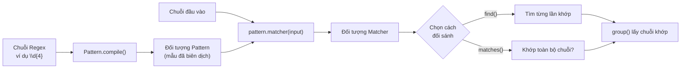

# Regular Expression trong Java

**Regular Expression** (biểu thức chính quy, viết tắt **Regex**) là một chuỗi ký tự đặc biệt dùng để **tìm kiếm, kiểm tra và thay thế** các mẫu văn bản. Java hỗ trợ Regex thông qua gói `java.util.regex`.

---

## Các ký tự đặc biệt trong Regex

### Ký tự chung

| Ký tự | Ý nghĩa | Ví dụ |
|---|---|---|
| `.` | Bất kỳ ký tự nào (trừ xuống dòng) | `a.c` khớp `abc`, `a1c` |
| `\d` | Chữ số (0-9) | `\d\d\d` khớp `123` |
| `\D` | Không phải chữ số | `\D+` khớp `abc` |
| `\w` | Ký tự từ: chữ, số, dấu `_` | `\w+` khớp `hello_1` |
| `\W` | Không phải ký tự từ | `\W` khớp `@`, `!` |
| `\s` | Khoảng trắng (space, tab, newline) | `\s+` khớp nhiều dấu cách |
| `\S` | Không phải khoảng trắng | |

### Bộ đếm (Quantifiers)

| Ký tự | Ý nghĩa | Ví dụ |
|---|---|---|
| `*` | 0 hoặc nhiều lần | `ab*` khớp `a`, `ab`, `abb`, ... |
| `+` | 1 hoặc nhiều lần | `ab+` khớp `ab`, `abb`, ... |
| `?` | 0 hoặc 1 lần | `ab?` khớp `a` hoặc `ab` |
| `{n}` | Đúng n lần | `\d{4}` khớp `2024` |
| `{n,m}` | Từ n đến m lần | `\d{2,4}` khớp `12`, `123`, `1234` |
| `{n,}` | Ít nhất n lần | `\d{3,}` khớp `123`, `12345` |

### Neo (Anchors)

| Ký tự | Ý nghĩa |
|---|---|
| `^` | Đầu chuỗi |
| `$` | Cuối chuỗi |
| `\b` | Ranh giới từ |

### Nhóm và Lựa chọn

| Ký tự | Ý nghĩa |
|---|---|
| `[abc]` | Một trong các ký tự a, b, c |
| `[^abc]` | Không phải a, b, c |
| `[a-z]` | Từ a đến z |
| `[A-Z0-9]` | Chữ hoa hoặc chữ số |
| `(abc)` | Nhóm bắt (capture group) |
| `a\|b` | a hoặc b |

---

## Các lớp chính trong Java Regex

Sơ đồ dưới đây minh họa luồng xử lý Regex trong Java, từ mẫu được biên dịch đến khi lấy kết quả:



Đọc sơ đồ: `Pattern.compile()` biên dịch mẫu một lần rồi tái sử dụng qua nhiều `Matcher`; `find()` dò từng lần xuất hiện, còn `matches()` kiểm tra toàn bộ chuỗi.

### Pattern — Mẫu biên dịch

```java
import java.util.regex.Pattern;
import java.util.regex.Matcher;

// Biên dịch pattern (nên làm một lần, tái sử dụng)
Pattern pattern = Pattern.compile("\\d{4}");  // 4 chữ số liên tiếp
```

> Lưu ý: Trong Java String, `\` phải viết là `\\`. Ví dụ: `\d` trong Regex viết là `"\\d"` trong Java String.

### Matcher — Đối sánh

```java
Pattern p = Pattern.compile("\\d+");
Matcher m = p.matcher("Có 123 quả táo và 45 quả cam");

while (m.find()) {
    System.out.println("Tìm thấy: " + m.group() + " tại vị trí " + m.start());
}
```

**Kết quả:**
```
Tìm thấy: 123 tại vị trí 3
Tìm thấy: 45 tại vị trí 18
```

### matches() — Kiểm tra toàn bộ chuỗi

```java
String email = "user@example.com";
boolean isValid = email.matches("[a-zA-Z0-9._%+-]+@[a-zA-Z0-9.-]+\\.[a-zA-Z]{2,}");
System.out.println(isValid);  // true
```

---

## Ví dụ thực tế

### Kiểm tra số điện thoại Việt Nam

```java
public class PhoneValidator {
    // Số điện thoại VN: bắt đầu bằng 0, theo sau là 9 chữ số
    // Hoặc bắt đầu bằng +84, theo sau là 9 chữ số
    private static final Pattern PHONE_PATTERN =
            Pattern.compile("^(0|\\+84)(3|5|7|8|9)\\d{8}$");

    public static boolean isValidPhone(String phone) {
        return PHONE_PATTERN.matcher(phone).matches();
    }

    public static void main(String[] args) {
        String[] phones = {
            "0912345678",   // Hợp lệ
            "+84912345678", // Hợp lệ
            "0123456789",   // Không hợp lệ (đầu số 1)
            "123456789",    // Không hợp lệ (không có đầu 0)
            "09123456"      // Không hợp lệ (thiếu số)
        };

        for (String phone : phones) {
            System.out.println(phone + " → " + (isValidPhone(phone) ? "Hợp lệ" : "Không hợp lệ"));
        }
    }
}
```

**Kết quả:**
```
0912345678 → Hợp lệ
+84912345678 → Hợp lệ
0123456789 → Không hợp lệ
123456789 → Không hợp lệ
09123456 → Không hợp lệ
```

### Trích xuất email từ văn bản

```java
import java.util.ArrayList;
import java.util.List;
import java.util.regex.Matcher;
import java.util.regex.Pattern;

public class EmailExtractor {
    private static final Pattern EMAIL_PATTERN =
            Pattern.compile("[a-zA-Z0-9._%+-]+@[a-zA-Z0-9.-]+\\.[a-zA-Z]{2,}");

    public static List<String> extractEmails(String text) {
        List<String> emails = new ArrayList<>();
        Matcher matcher = EMAIL_PATTERN.matcher(text);
        while (matcher.find()) {
            emails.add(matcher.group());
        }
        return emails;
    }

    public static void main(String[] args) {
        String text = "Liên hệ qua email: an@example.com hoặc binh@company.vn "
                    + "hoặc cuong.nguyen@gmail.com để được hỗ trợ.";

        List<String> emails = extractEmails(text);
        System.out.println("Danh sách email tìm thấy:");
        emails.forEach(e -> System.out.println("  - " + e));
    }
}
```

**Kết quả:**
```
Danh sách email tìm thấy:
  - an@example.com
  - binh@company.vn
  - cuong.nguyen@gmail.com
```

### Thay thế chuỗi với replaceAll

```java
public class ReplaceDemo {
    public static void main(String[] args) {
        String text = "Số điện thoại: 0912 345 678, liên hệ thêm: 0987-654-321";

        // Xóa tất cả dấu cách và gạch ngang trong số điện thoại
        String cleaned = text.replaceAll("(\\d)[\\s-](\\d)", "$1$2");
        System.out.println(cleaned);
        // Số điện thoại: 0912345678, liên hệ thêm: 0987654321

        // Xóa tất cả khoảng trắng thừa
        String messy = "Java    là    ngôn   ngữ    tuyệt   vời";
        String neat = messy.replaceAll("\\s+", " ").trim();
        System.out.println(neat);
        // Java là ngôn ngữ tuyệt vời

        // Che số thẻ tín dụng (giữ 4 số cuối)
        String cardNumber = "1234-5678-9012-3456";
        String masked = cardNumber.replaceAll("\\d{4}-\\d{4}-\\d{4}-", "****-****-****-");
        System.out.println(masked);
        // ****-****-****-3456
    }
}
```

### Tách chuỗi với split

```java
public class SplitDemo {
    public static void main(String[] args) {
        // Tách theo nhiều ký tự phân cách khác nhau
        String csv = "An,Bình;Cường.Dũng|Emer";
        String[] names = csv.split("[,;.|]+");

        System.out.println("Tách theo nhiều ký tự:");
        for (String name : names) {
            System.out.println("  - " + name);
        }

        // Tách theo khoảng trắng (một hoặc nhiều)
        String sentence = "  Java   là   ngôn   ngữ   hay  ";
        String[] words = sentence.trim().split("\\s+");

        System.out.println("\nCác từ trong câu:");
        for (String word : words) {
            System.out.println("  - " + word);
        }
    }
}
```

---

## Capture Group (Nhóm bắt)

```java
import java.util.regex.Matcher;
import java.util.regex.Pattern;

public class CaptureGroupDemo {
    public static void main(String[] args) {
        // Phân tích ngày tháng năm: dd/mm/yyyy
        Pattern datePattern = Pattern.compile("(\\d{2})/(\\d{2})/(\\d{4})");
        String text = "Ngày sinh: 15/06/1995, ngày đăng ký: 01/01/2024";

        Matcher matcher = datePattern.matcher(text);
        while (matcher.find()) {
            String day = matcher.group(1);   // Nhóm 1: dd
            String month = matcher.group(2); // Nhóm 2: mm
            String year = matcher.group(3);  // Nhóm 3: yyyy
            System.out.println("Ngày: " + day + "/" + month + "/" + year);
        }
    }
}
```

**Kết quả:**
```
Ngày: 15/06/1995
Ngày: 01/01/2024
```

---

## Tóm tắt

| Phương thức | Mô tả |
|---|---|
| `Pattern.compile(regex)` | Biên dịch biểu thức chính quy |
| `pattern.matcher(input)` | Tạo Matcher từ input |
| `matcher.matches()` | Kiểm tra toàn bộ chuỗi khớp pattern |
| `matcher.find()` | Tìm lần xuất hiện tiếp theo |
| `matcher.group()` | Lấy chuỗi vừa khớp |
| `string.matches(regex)` | Kiểm tra nhanh toàn bộ chuỗi |
| `string.replaceAll(regex, replacement)` | Thay thế tất cả khớp |
| `string.split(regex)` | Tách chuỗi theo pattern |
