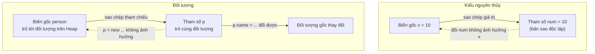

# Truyền giá trị - pass by value trong Java

Đây là một trong những khái niệm hay gây nhầm lẫn nhất với người mới học Java. Câu trả lời ngắn gọn: **Java LUÔN LUÔN truyền theo giá trị (pass by value)** — không có ngoại lệ.

---

## Pass by value là gì?

**Pass by value** (truyền theo giá trị): Khi truyền tham số vào phương thức, Java tạo ra một **bản sao** của giá trị đó. Mọi thay đổi bên trong phương thức chỉ ảnh hưởng đến bản sao, **không ảnh hưởng** đến biến gốc.

**Pass by reference** (truyền theo tham chiếu): Không có trong Java. Trong pass by reference thực sự, phương thức nhận địa chỉ của biến gốc và có thể thay đổi biến đó.

Sơ đồ sau tóm tắt điểm khác biệt giữa truyền kiểu nguyên thủy và truyền đối tượng:



Đọc sơ đồ: với kiểu nguyên thủy, bản sao hoàn toàn độc lập. Với đối tượng, bản sao là **tham chiếu** cùng trỏ tới một đối tượng, nên sửa nội dung thì ảnh hưởng, nhưng gán lại tham chiếu thì không.

---

## Trường hợp 1: Kiểu nguyên thủy

```java
public class PrimitivePassDemo {
    public static void main(String[] args) {
        int x = 10;
        System.out.println("Trước khi gọi: x = " + x);  // x = 10

        changeValue(x);

        System.out.println("Sau khi gọi: x = " + x);    // x = 10 (không đổi!)
    }

    static void changeValue(int num) {
        num = 999;  // Chỉ thay đổi bản sao 'num', không ảnh hưởng 'x'
        System.out.println("Trong method: num = " + num);  // num = 999
    }
}
```

**Kết quả:**
```
Trước khi gọi: x = 10
Trong method: num = 999
Sau khi gọi: x = 10
```

**Giải thích:** `num` là bản sao của `x`. Thay đổi `num` không ảnh hưởng `x`.

---

## Trường hợp 2: Đối tượng (Object)

Đây là phần hay gây nhầm lẫn. Khi truyền đối tượng, Java truyền **bản sao của tham chiếu** (địa chỉ bộ nhớ), không truyền bản sao của đối tượng.

### Ví dụ 1: Thay đổi nội dung đối tượng (ảnh hưởng được)

```java
class Person {
    String name;
    int age;

    Person(String name, int age) {
        this.name = name;
        this.age = age;
    }
}

public class ObjectPassDemo {
    public static void main(String[] args) {
        Person person = new Person("An", 25);
        System.out.println("Trước: " + person.name + ", " + person.age);

        modifyObject(person);

        System.out.println("Sau: " + person.name + ", " + person.age);
    }

    static void modifyObject(Person p) {
        // p là bản sao của tham chiếu, cùng trỏ đến đối tượng gốc
        p.name = "Bình";  // Thay đổi nội dung đối tượng GỐC
        p.age = 30;
        System.out.println("Trong method: " + p.name + ", " + p.age);
    }
}
```

**Kết quả:**
```
Trước: An, 25
Trong method: Bình, 30
Sau: Bình, 30
```

**Giải thích:** `p` là bản sao của tham chiếu, nhưng cả `person` và `p` đều trỏ đến **cùng một đối tượng** trên Heap. Thay đổi qua `p` ảnh hưởng đến đối tượng gốc.

### Ví dụ 2: Gán lại tham chiếu (không ảnh hưởng)

```java
public class ReassignDemo {
    public static void main(String[] args) {
        Person person = new Person("An", 25);
        System.out.println("Trước: " + person.name);

        reassignObject(person);

        System.out.println("Sau: " + person.name);  // Vẫn là "An"!
    }

    static void reassignObject(Person p) {
        // Tạo đối tượng mới và gán cho p
        // Đây chỉ thay đổi bản sao của tham chiếu (p), không ảnh hưởng person!
        p = new Person("Cường", 35);
        System.out.println("Trong method: " + p.name);
    }
}
```

**Kết quả:**
```
Trước: An
Trong method: Cường
Sau: An
```

**Giải thích:** `p = new Person(...)` chỉ thay đổi biến `p` cục bộ (bản sao tham chiếu), không thay đổi biến `person` bên ngoài.

---

## Hình dung bằng sơ đồ bộ nhớ

```
Trước khi gọi modifyObject(person):
  Stack            Heap
  person → [0x200] [0x200]: Person{name="An", age=25}

Trong modifyObject(p):
  Stack            Heap
  person → [0x200] [0x200]: Person{name="An", age=25}
  p      → [0x200] ↗  (cùng trỏ đến đối tượng)

Sau p.name = "Bình":
  Stack            Heap
  person → [0x200] [0x200]: Person{name="Bình", age=30}
  p      → [0x200] ↗

Sau p = new Person("Cường"):
  Stack            Heap
  person → [0x200] [0x200]: Person{name="Bình", age=30}
  p      → [0x300] [0x300]: Person{name="Cường", age=35}
```

---

## Trường hợp đặc biệt: String là bất biến (immutable)

```java
public class StringPassDemo {
    public static void main(String[] args) {
        String str = "Hello";
        System.out.println("Trước: " + str);  // Hello

        changeString(str);

        System.out.println("Sau: " + str);    // Hello (không đổi!)
    }

    static void changeString(String s) {
        s = s + " World";  // Tạo String MỚI, gán cho s cục bộ
        System.out.println("Trong method: " + s);  // Hello World
    }
}
```

**Kết quả:**
```
Trước: Hello
Trong method: Hello World
Sau: Hello
```

Vì `String` là **immutable** (bất biến), mọi phép cộng chuỗi đều tạo đối tượng `String` mới. `str` gốc không thay đổi.

---

## Cách trả về giá trị đã thay đổi

Nếu muốn phương thức "thay đổi" một giá trị nguyên thủy hoặc tham chiếu, hãy dùng **return**:

```java
public class ReturnValueDemo {
    public static void main(String[] args) {
        int x = 10;
        x = doubleValue(x);  // Nhận lại giá trị mới
        System.out.println("x = " + x);  // x = 20

        String str = "Hello";
        str = appendWorld(str);
        System.out.println(str);  // Hello World
    }

    static int doubleValue(int num) {
        return num * 2;
    }

    static String appendWorld(String s) {
        return s + " World";
    }
}
```

---

## Tóm tắt

| Loại | Truyền cái gì | Thay đổi nội dung | Gán lại ảnh hưởng bên ngoài |
|---|---|---|---|
| Kiểu nguyên thủy | Bản sao giá trị | Không | Không |
| Đối tượng | Bản sao tham chiếu | Có | Không |
| String | Bản sao tham chiếu | Không (immutable) | Không |

**Quy tắc ghi nhớ:**
- Java luôn truyền **bản sao**
- Với đối tượng: bản sao **tham chiếu** (địa chỉ) — nên có thể thay đổi nội dung đối tượng gốc
- Gán lại `p = new Object()` trong phương thức không ảnh hưởng biến gốc bên ngoài
