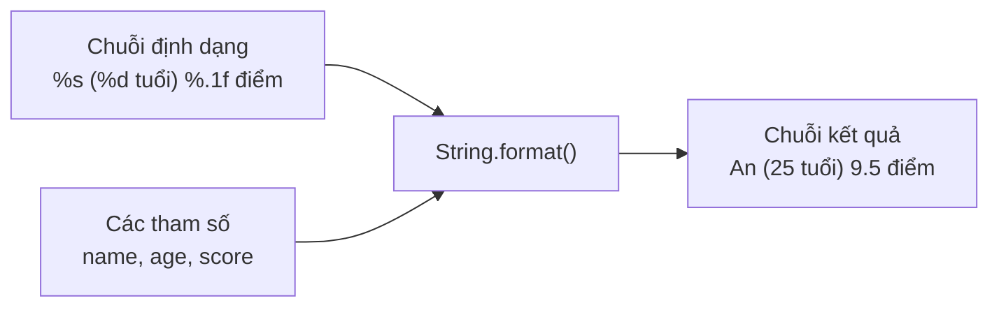

# Hướng dẫn sử dụng String Format trong Java

Java cung cấp nhiều cách để định dạng chuỗi. Bài này hướng dẫn chi tiết cách dùng `String.format()`, `printf()`, và các cách định dạng hiện đại.

Sơ đồ dưới đây minh họa cách `String.format()` ghép chuỗi định dạng với các tham số để tạo chuỗi kết quả:



Đọc sơ đồ: mỗi ký hiệu định dạng (`%s`, `%d`, `%.1f`) được thay thế lần lượt bởi từng tham số theo đúng thứ tự.

---

## Tại sao cần String Format?

```java
// Cách nối chuỗi thông thường — khó đọc
String name = "An";
int age = 25;
double score = 9.5;
String result = "Học sinh " + name + " (" + age + " tuổi) đạt điểm " + score;

// Dùng String.format — rõ ràng hơn
String result2 = String.format("Học sinh %s (%d tuổi) đạt điểm %.1f", name, age, score);
```

---

## Cú pháp `String.format()`

```java
String result = String.format(formatString, arg1, arg2, ...);
```

**Các ký hiệu định dạng (format specifier):**

| Ký hiệu | Kiểu dữ liệu | Ví dụ |
|---|---|---|
| `%s` | String | `"Hello"` |
| `%d` | Số nguyên (int, long) | `42` |
| `%f` | Số thực (float, double) | `3.140000` |
| `%.2f` | Số thực, 2 chữ số thập phân | `3.14` |
| `%e` | Số thực dạng khoa học | `3.14e+00` |
| `%b` | Boolean | `true` |
| `%c` | Ký tự char | `'A'` |
| `%n` | Xuống dòng (dùng trong format) | |
| `%%` | Ký tự `%` | `%` |
| `%10s` | Canh phải, rộng 10 ký tự | `"      Java"` |
| `%-10s` | Canh trái, rộng 10 ký tự | `"Java      "` |
| `%05d` | Số nguyên, rộng 5, đệm 0 | `00042` |
| `%+d` | Luôn hiển thị dấu +/- | `+42`, `-10` |

---

## Ví dụ cơ bản

```java
public class StringFormatBasic {
    public static void main(String[] args) {
        String name = "Nguyễn Văn An";
        int age = 28;
        double salary = 15000000.5;
        boolean isActive = true;

        // %s: chuỗi
        System.out.println(String.format("Tên: %s", name));

        // %d: số nguyên
        System.out.println(String.format("Tuổi: %d", age));

        // %.2f: số thực 2 chữ số thập phân
        System.out.println(String.format("Lương: %.2f VND", salary));

        // %b: boolean
        System.out.println(String.format("Đang hoạt động: %b", isActive));

        // Nhiều tham số
        System.out.println(String.format("%s - %d tuổi - %.0f VND/tháng",
                name, age, salary));
    }
}
```

**Kết quả:**
```
Tên: Nguyễn Văn An
Tuổi: 28
Lương: 15000000.50 VND
Đang hoạt động: true
Nguyễn Văn An - 28 tuổi - 15000001 VND/tháng
```

---

## Căn lề và độ rộng

```java
public class AlignmentDemo {
    public static void main(String[] args) {
        // Tạo bảng căn chỉnh đẹp
        System.out.println(String.format("%-15s %5s %10s", "Tên", "Tuổi", "Điểm"));
        System.out.println("-".repeat(33));
        System.out.println(String.format("%-15s %5d %10.2f", "Nguyễn Văn An", 20, 8.5));
        System.out.println(String.format("%-15s %5d %10.2f", "Trần Thị Bình", 21, 9.0));
        System.out.println(String.format("%-15s %5d %10.2f", "Lê Văn Cường", 22, 7.5));
    }
}
```

**Kết quả:**
```
Tên              Tuổi       Điểm
---------------------------------
Nguyễn Văn An      20       8.50
Trần Thị Bình      21       9.00
Lê Văn Cường       22       7.50
```

---

## Định dạng số

```java
public class NumberFormatDemo {
    public static void main(String[] args) {
        int n = 1234567;
        double d = 123456.789;

        // Số nguyên với đệm 0
        System.out.println(String.format("%08d", 42));       // 00000042

        // Số thực, nhiều cách khác nhau
        System.out.println(String.format("%f", d));          // 123456.789000
        System.out.println(String.format("%.2f", d));        // 123456.79
        System.out.println(String.format("%,.2f", d));       // 123,456.79 (dấu phẩy phân nhóm)
        System.out.println(String.format("%e", d));          // 1.234568e+05
        System.out.println(String.format("%.3e", d));        // 1.235e+05

        // Dấu tiền tệ
        System.out.println(String.format("Giá: %,.0f VND", 15_000_000.0));
        // Giá: 15,000,000 VND
    }
}
```

---

## printf() — In thẳng không cần String

```java
public class PrintfDemo {
    public static void main(String[] args) {
        // printf tương đương System.out.print(String.format(...))
        System.out.printf("Xin chào %s!%n", "Java");
        System.out.printf("Pi ≈ %.5f%n", Math.PI);
        System.out.printf("%-10s: %d%n", "Số lượng", 42);
    }
}
```

**Kết quả:**
```
Xin chào Java!
Pi ≈ 3.14159
Số lượng  : 42
```

---

## Formatted String (Java 15+)

Từ Java 15, String có phương thức `formatted()` dạng fluent:

```java
public class FormattedDemo {
    public static void main(String[] args) {
        String msg = "Học sinh %s đạt %d điểm".formatted("An", 95);
        System.out.println(msg);  // Học sinh An đạt 95 điểm

        // Dùng trong Text Block (Java 15+)
        String html = """
                <div>
                  <h1>%s</h1>
                  <p>Điểm: %.1f</p>
                </div>
                """.formatted("Báo cáo kết quả", 8.5);
        System.out.println(html);
    }
}
```

---

## Định dạng ngày tháng

```java
import java.time.LocalDate;
import java.time.LocalDateTime;
import java.time.format.DateTimeFormatter;

public class DateFormatDemo {
    public static void main(String[] args) {
        LocalDate date = LocalDate.of(2024, 6, 15);
        LocalDateTime now = LocalDateTime.now();

        // Định dạng bằng DateTimeFormatter
        DateTimeFormatter formatter1 = DateTimeFormatter.ofPattern("dd/MM/yyyy");
        DateTimeFormatter formatter2 = DateTimeFormatter.ofPattern("EEEE, dd 'tháng' MM, yyyy");

        System.out.println(date.format(formatter1));  // 15/06/2024
        System.out.println(now.format(DateTimeFormatter.ofPattern("HH:mm:ss dd/MM/yyyy")));
    }
}
```

---

## Tóm tắt

| Phương thức | Dùng khi |
|---|---|
| `String.format(...)` | Tạo chuỗi định dạng, gán vào biến |
| `System.out.printf(...)` | In thẳng ra console |
| `"...".formatted(...)` | Cách viết fluent (Java 15+) |
| `DateTimeFormatter` | Định dạng ngày tháng |

**Ký hiệu hay dùng nhất:**
- `%s` — chuỗi
- `%d` — số nguyên
- `%.2f` — số thực 2 chữ số thập phân
- `%-10s` — canh trái rộng 10
- `%05d` — số nguyên đệm 0
