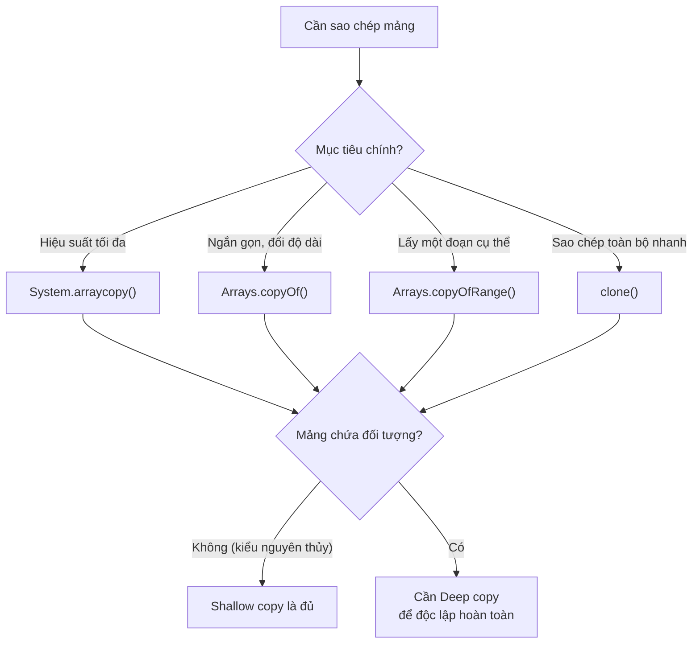

# Sao chép các phần tử của mảng sang mảng khác

Java cung cấp nhiều cách để **sao chép mảng** (array copy). Bài này giới thiệu tất cả các phương pháp từ thủ công đến các hàm tiện ích tích hợp sẵn.

Sơ đồ sau giúp bạn chọn phương pháp sao chép mảng phù hợp với nhu cầu:



Đọc sơ đồ: chọn hàm sao chép theo mục tiêu, nhưng luôn lưu ý mọi hàm tích hợp đều là **shallow copy** — với mảng đối tượng cần tự làm **deep copy** nếu muốn độc lập.

---

## 1. Sao chép thủ công bằng vòng lặp

```java
public class ManualCopyDemo {
    public static void main(String[] args) {
        int[] source = {1, 2, 3, 4, 5};
        int[] dest = new int[source.length];

        for (int i = 0; i < source.length; i++) {
            dest[i] = source[i];
        }

        // Thay đổi dest không ảnh hưởng source
        dest[0] = 99;

        System.out.print("Source: ");
        for (int n : source) System.out.print(n + " ");
        // Source: 1 2 3 4 5

        System.out.print("\nDest: ");
        for (int n : dest) System.out.print(n + " ");
        // Dest: 99 2 3 4 5
    }
}
```

---

## 2. System.arraycopy() — Nhanh nhất

`System.arraycopy()` là phương thức native (viết bằng C), **nhanh nhất** trong các cách sao chép mảng.

**Cú pháp:**
```java
System.arraycopy(src, srcPos, dest, destPos, length);
```

| Tham số | Mô tả |
|---|---|
| `src` | Mảng nguồn |
| `srcPos` | Vị trí bắt đầu sao chép trong mảng nguồn |
| `dest` | Mảng đích |
| `destPos` | Vị trí bắt đầu ghi vào mảng đích |
| `length` | Số phần tử cần sao chép |

```java
public class SystemArrayCopyDemo {
    public static void main(String[] args) {
        int[] source = {10, 20, 30, 40, 50};
        int[] dest = new int[5];

        // Sao chép toàn bộ
        System.arraycopy(source, 0, dest, 0, source.length);
        printArray("Sao chép toàn bộ", dest);
        // [10, 20, 30, 40, 50]

        // Sao chép một phần (từ index 1, lấy 3 phần tử)
        int[] partial = new int[5];
        System.arraycopy(source, 1, partial, 0, 3);
        printArray("Sao chép một phần", partial);
        // [20, 30, 40, 0, 0]

        // Dịch chuyển phần tử trong cùng mảng
        int[] arr = {1, 2, 3, 4, 5};
        System.arraycopy(arr, 1, arr, 0, 4);  // Dịch trái 1 vị trí
        printArray("Sau khi dịch trái", arr);
        // [2, 3, 4, 5, 5]
    }

    static void printArray(String label, int[] arr) {
        System.out.print(label + ": [");
        for (int i = 0; i < arr.length; i++) {
            System.out.print(arr[i]);
            if (i < arr.length - 1) System.out.print(", ");
        }
        System.out.println("]");
    }
}
```

---

## 3. Arrays.copyOf() — Sao chép với độ dài tùy chỉnh

```java
import java.util.Arrays;

public class ArraysCopyOfDemo {
    public static void main(String[] args) {
        int[] source = {1, 2, 3, 4, 5};

        // Sao chép với cùng độ dài
        int[] copy1 = Arrays.copyOf(source, source.length);
        printArray("Cùng độ dài", copy1);
        // [1, 2, 3, 4, 5]

        // Sao chép với độ dài ngắn hơn (cắt bớt)
        int[] copy2 = Arrays.copyOf(source, 3);
        printArray("Ngắn hơn", copy2);
        // [1, 2, 3]

        // Sao chép với độ dài dài hơn (thêm 0)
        int[] copy3 = Arrays.copyOf(source, 8);
        printArray("Dài hơn", copy3);
        // [1, 2, 3, 4, 5, 0, 0, 0]

        // Sao chép mảng String
        String[] names = {"An", "Bình", "Cường"};
        String[] namesCopy = Arrays.copyOf(names, 5);
        System.out.println(Arrays.toString(namesCopy));
        // [An, Bình, Cường, null, null]
    }

    static void printArray(String label, int[] arr) {
        System.out.println(label + ": " + Arrays.toString(arr));
    }
}
```

---

## 4. Arrays.copyOfRange() — Sao chép một đoạn

```java
import java.util.Arrays;

public class CopyOfRangeDemo {
    public static void main(String[] args) {
        int[] source = {10, 20, 30, 40, 50, 60, 70};

        // Lấy từ index 2 đến index 5 (không bao gồm 5)
        int[] sub = Arrays.copyOfRange(source, 2, 5);
        System.out.println(Arrays.toString(sub));
        // [30, 40, 50]

        // Lấy từ index 4 đến hết
        int[] tail = Arrays.copyOfRange(source, 4, source.length);
        System.out.println(Arrays.toString(tail));
        // [50, 60, 70]

        // Mở rộng (range vượt quá độ dài mảng → thêm 0)
        int[] extended = Arrays.copyOfRange(source, 5, 10);
        System.out.println(Arrays.toString(extended));
        // [60, 70, 0, 0, 0]
    }
}
```

---

## 5. clone() — Tạo bản sao độc lập

```java
import java.util.Arrays;

public class CloneDemo {
    public static void main(String[] args) {
        int[] original = {1, 2, 3, 4, 5};
        int[] cloned = original.clone();

        // Thay đổi cloned không ảnh hưởng original
        cloned[0] = 99;

        System.out.println("Original: " + Arrays.toString(original));
        // Original: [1, 2, 3, 4, 5]
        System.out.println("Cloned: " + Arrays.toString(cloned));
        // Cloned: [99, 2, 3, 4, 5]
    }
}
```

---

## Shallow Copy vs Deep Copy với mảng đối tượng

**Cảnh báo quan trọng:** Tất cả các cách trên đều là **Shallow Copy** (sao chép nông) — chỉ sao chép tham chiếu, không sao chép đối tượng bên trong.

```java
import java.util.Arrays;

class Student {
    String name;
    Student(String name) { this.name = name; }
}

public class ShallowVsDeepDemo {
    public static void main(String[] args) {
        Student[] original = {
            new Student("An"),
            new Student("Bình")
        };

        // Shallow copy: sao chép tham chiếu
        Student[] shallow = Arrays.copyOf(original, original.length);

        // Thay đổi đối tượng qua shallow CÓ ảnh hưởng original!
        shallow[0].name = "Đã thay đổi";
        System.out.println(original[0].name);  // "Đã thay đổi" ← bị ảnh hưởng!

        // Deep copy: sao chép từng đối tượng
        Student[] original2 = {new Student("An"), new Student("Bình")};
        Student[] deep = new Student[original2.length];
        for (int i = 0; i < original2.length; i++) {
            deep[i] = new Student(original2[i].name);  // Tạo đối tượng mới
        }

        deep[0].name = "Đã thay đổi";
        System.out.println(original2[0].name);  // "An" ← không bị ảnh hưởng
    }
}
```

---

## So sánh các phương pháp

| Phương pháp | Độ linh hoạt | Tốc độ | Ghi chú |
|---|---|---|---|
| Vòng lặp | Cao | Chậm nhất | Kiểm soát hoàn toàn |
| `System.arraycopy()` | Trung bình | Nhanh nhất | Khuyến nghị cho hiệu suất |
| `Arrays.copyOf()` | Trung bình | Nhanh | Dễ dùng, tự điều chỉnh độ dài |
| `Arrays.copyOfRange()` | Cao | Nhanh | Sao chép một đoạn cụ thể |
| `clone()` | Thấp | Nhanh | Chỉ sao chép toàn bộ |

---

## Tóm tắt

- Dùng **`System.arraycopy()`** khi cần hiệu suất tối đa
- Dùng **`Arrays.copyOf()`** hoặc **`Arrays.copyOfRange()`** khi muốn code ngắn gọn, dễ đọc
- Cẩn thận với **Shallow Copy** khi mảng chứa đối tượng — cần **Deep Copy** nếu muốn độc lập hoàn toàn
