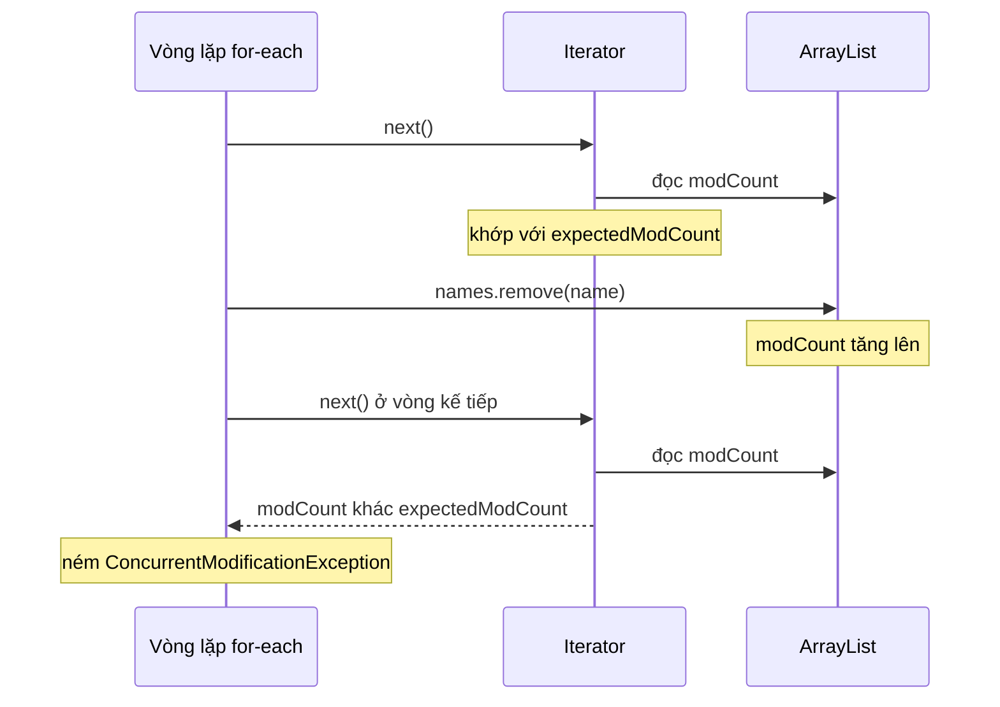

# Tránh lỗi ConcurrentModificationException trong Java

ConcurrentModificationException là lỗi rất hay gặp khi bạn vừa duyệt vừa xóa phần tử khỏi một Collection như ArrayList hay HashMap. Bài này giải thích nguyên nhân gây lỗi và hướng dẫn nhiều cách xử lý an toàn như `Iterator.remove()`, `removeIf()` hay `CopyOnWriteArrayList`. Nắm vững các cách này giúp bạn viết code xử lý danh sách chắc chắn, không bị crash.

## ConcurrentModificationException là gì?

**ConcurrentModificationException** là lỗi xảy ra khi bạn **thêm hoặc xóa phần tử** khỏi một Collection (ArrayList, HashMap, ...) trong khi đang **duyệt qua** nó bằng Iterator hoặc for-each.

```java
import java.util.ArrayList;
import java.util.List;

public class CMEDemo {
    public static void main(String[] args) {
        List<String> names = new ArrayList<>();
        names.add("An");
        names.add("Bình");
        names.add("Cường");
        names.add("Dũng");

        // LỖI: Xóa trong khi đang dùng for-each
        for (String name : names) {
            if (name.equals("Bình")) {
                names.remove(name);  // ConcurrentModificationException!
            }
        }
    }
}
```

**Kết quả:**
```
Exception in thread "main" java.util.ConcurrentModificationException
```

---

## Tại sao lại có lỗi này?

Khi dùng for-each, Java sử dụng **Iterator** bên trong. Iterator duy trì một biến đếm **modCount** (modification count — số lần sửa đổi). Mỗi lần bạn thêm/xóa phần tử, `modCount` tăng lên. Iterator kiểm tra `modCount` ở mỗi vòng lặp — nếu thấy khác với giá trị ban đầu, nó ném `ConcurrentModificationException`.

Sơ đồ tuần tự sau cho thấy vì sao Iterator phát hiện thay đổi và ném lỗi:



Đọc sơ đồ: gọi `names.remove()` trực tiếp làm `modCount` lệch khỏi `expectedModCount` mà Iterator ghi nhớ, nên lần `next()` sau sẽ ném lỗi.

---

## Cách 1: Dùng Iterator.remove()

```java
import java.util.ArrayList;
import java.util.Iterator;
import java.util.List;

public class IteratorRemoveDemo {
    public static void main(String[] args) {
        List<String> names = new ArrayList<>();
        names.add("An");
        names.add("Bình");
        names.add("Cường");
        names.add("Dũng");

        // ĐÚNG: Dùng Iterator.remove() thay vì List.remove()
        Iterator<String> iterator = names.iterator();
        while (iterator.hasNext()) {
            String name = iterator.next();
            if (name.equals("Bình")) {
                iterator.remove();  // An toàn!
            }
        }

        System.out.println(names);  // [An, Cường, Dũng]
    }
}
```

---

## Cách 2: removeIf() — Java 8+

Cách ngắn gọn và hiện đại nhất:

```java
import java.util.ArrayList;
import java.util.List;

public class RemoveIfDemo {
    public static void main(String[] args) {
        List<String> names = new ArrayList<>(List.of("An", "Bình", "Cường", "Dũng"));

        // Xóa tất cả tên có độ dài > 3
        names.removeIf(name -> name.length() > 3);
        System.out.println(names);  // [An, Bình, Dũng] (Cường = 5 ký tự bị xóa)

        // Xóa theo điều kiện phức tạp hơn
        List<Integer> numbers = new ArrayList<>(List.of(1, 2, 3, 4, 5, 6, 7, 8, 9, 10));
        numbers.removeIf(n -> n % 2 == 0);  // Xóa số chẵn
        System.out.println(numbers);  // [1, 3, 5, 7, 9]
    }
}
```

---

## Cách 3: Duyệt bằng chỉ số (index) và xóa ngược

```java
import java.util.ArrayList;
import java.util.List;

public class IndexRemoveDemo {
    public static void main(String[] args) {
        List<String> names = new ArrayList<>(List.of("An", "Bình", "Cường", "Dũng", "Bình"));

        // Duyệt ngược từ cuối để không bị lệch chỉ số khi xóa
        for (int i = names.size() - 1; i >= 0; i--) {
            if (names.get(i).equals("Bình")) {
                names.remove(i);
            }
        }

        System.out.println(names);  // [An, Cường, Dũng]
    }
}
```

---

## Cách 4: Tạo danh sách mới

```java
import java.util.ArrayList;
import java.util.List;
import java.util.stream.Collectors;

public class NewListDemo {
    public static void main(String[] args) {
        List<String> names = List.of("An", "Bình", "Cường", "Dũng");

        // Cách 4a: Tạo List mới bằng Stream
        List<String> filtered = names.stream()
                .filter(name -> !name.equals("Bình"))
                .collect(Collectors.toList());
        System.out.println(filtered);  // [An, Cường, Dũng]

        // Cách 4b: Tạo List mới và removeAll
        List<String> names2 = new ArrayList<>(List.of("An", "Bình", "Cường", "Bình"));
        List<String> toRemove = new ArrayList<>();
        for (String name : names2) {
            if (name.equals("Bình")) {
                toRemove.add(name);
            }
        }
        names2.removeAll(toRemove);
        System.out.println(names2);  // [An, Cường]
    }
}
```

---

## Trường hợp với Map

```java
import java.util.HashMap;
import java.util.Iterator;
import java.util.Map;

public class MapCMEDemo {
    public static void main(String[] args) {
        Map<String, Integer> scores = new HashMap<>();
        scores.put("An", 8);
        scores.put("Bình", 5);
        scores.put("Cường", 7);
        scores.put("Dũng", 4);

        // LỖI:
        // for (Map.Entry<String, Integer> entry : scores.entrySet()) {
        //     if (entry.getValue() < 6) scores.remove(entry.getKey()); // CME!
        // }

        // ĐÚNG cách 1: Iterator.remove()
        Iterator<Map.Entry<String, Integer>> iter = scores.entrySet().iterator();
        while (iter.hasNext()) {
            Map.Entry<String, Integer> entry = iter.next();
            if (entry.getValue() < 6) {
                iter.remove();  // An toàn!
            }
        }
        System.out.println(scores);  // {An=8, Cường=7}

        // ĐÚNG cách 2: entrySet().removeIf() (Java 8+)
        Map<String, Integer> scores2 = new HashMap<>();
        scores2.put("An", 8); scores2.put("Bình", 5);
        scores2.put("Cường", 7); scores2.put("Dũng", 4);
        scores2.entrySet().removeIf(e -> e.getValue() < 6);
        System.out.println(scores2);  // {An=8, Cường=7}
    }
}
```

---

## Môi trường đa luồng: CopyOnWriteArrayList

Nếu nhiều luồng đọc/ghi đồng thời, dùng **`CopyOnWriteArrayList`**:

```java
import java.util.concurrent.CopyOnWriteArrayList;

public class CopyOnWriteDemo {
    public static void main(String[] args) {
        // CopyOnWriteArrayList: an toàn đa luồng
        // Mỗi lần sửa đổi, tạo bản sao mới của mảng nội bộ
        CopyOnWriteArrayList<String> list = new CopyOnWriteArrayList<>();
        list.add("An");
        list.add("Bình");
        list.add("Cường");

        // An toàn: không ném ConcurrentModificationException
        for (String name : list) {
            if (name.equals("Bình")) {
                list.remove(name);  // Không lỗi!
            }
        }

        System.out.println(list);  // [An, Cường]
    }
}
```

---

## Tóm tắt

| Phương pháp | Ưu điểm | Khi nào dùng |
|---|---|---|
| `Iterator.remove()` | Tương thích mọi phiên bản | Vòng lặp while với Iterator |
| `removeIf()` | Ngắn gọn, hiện đại | Java 8+, điều kiện rõ ràng |
| Duyệt ngược + `remove(i)` | Đơn giản, dễ hiểu | Xóa theo vị trí |
| Stream + `filter()` | Functional, tạo list mới | Không cần sửa list gốc |
| `CopyOnWriteArrayList` | An toàn đa luồng | Multi-thread environment |
