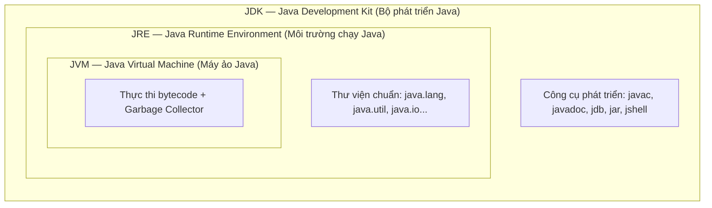
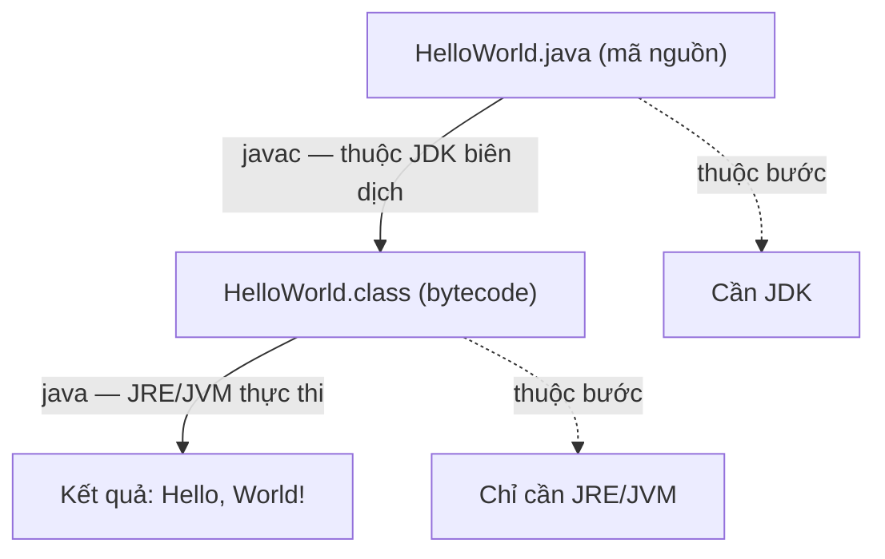

# Phân biệt JVM, JRE, JDK

Khi bắt đầu học Java, bạn sẽ thường xuyên gặp ba khái niệm: **JVM**, **JRE**, và **JDK**. Bài này giải thích rõ sự khác biệt và mối quan hệ giữa chúng.

## Tổng quan

Mối quan hệ giữa ba khái niệm là **quan hệ lồng nhau** (cái lớn chứa cái nhỏ): JDK chứa JRE, JRE chứa JVM.

Đọc sơ đồ từ trong ra ngoài:

- **JVM** (lõi trong cùng) — thực thi bytecode.
- **JRE** = JVM + thư viện chuẩn → đủ để **chạy** app Java.
- **JDK** = JRE + công cụ phát triển → đủ để **viết, biên dịch và chạy** app Java.

---

## 1. JVM — Java Virtual Machine (Máy ảo Java)

**JVM** là thành phần cốt lõi nhất. Nó là một "máy tính ảo" chạy trong máy tính thật của bạn, có nhiệm vụ:

- **Đọc và thực thi bytecode** (file `.class` được tạo ra sau khi biên dịch)
- **Quản lý bộ nhớ** thông qua Garbage Collector (bộ thu gom rác)
- **Đảm bảo tính độc lập nền tảng**: cùng một bytecode chạy được trên Windows, Linux, macOS

> Mỗi hệ điều hành có một bản JVM khác nhau, nhưng tất cả đều đọc được bytecode Java — đó là lý do Java có thể "Write Once, Run Anywhere".

**JVM KHÔNG thể biên dịch** file `.java` thành bytecode — đó là việc của `javac`.

---

## 2. JRE — Java Runtime Environment (Môi trường chạy Java)

**JRE** = JVM + Thư viện lớp chuẩn Java (Java Class Libraries)

JRE cung cấp đủ thứ để **chạy** một chương trình Java đã được biên dịch sẵn:

- JVM (để thực thi bytecode)
- Các thư viện chuẩn: `java.lang`, `java.util`, `java.io`, ...

**Dùng khi nào?**
Khi bạn chỉ cần **chạy** ứng dụng Java (không cần phát triển), ví dụ: người dùng cuối chạy phần mềm Java.

---

## 3. JDK — Java Development Kit (Bộ phát triển Java)

**JDK** = JRE + Công cụ phát triển

JDK là bộ đầy đủ dành cho **lập trình viên**:

| Công cụ | Chức năng |
|---|---|
| `javac` | **Trình biên dịch** — chuyển `.java` thành `.class` |
| `java` | Chạy chương trình Java |
| `javadoc` | Tạo tài liệu từ comment trong code |
| `jdb` | **Debugger** (công cụ gỡ lỗi) |
| `jar` | Đóng gói file `.class` thành file `.jar` |
| `jshell` | REPL — chạy code Java tương tác (từ Java 9) |

**Dùng khi nào?**
Khi bạn **viết và biên dịch** code Java — lập trình viên luôn cần cài JDK.

---

## So sánh nhanh

| | JVM | JRE | JDK |
|---|---|---|---|
| Chạy chương trình Java | Có | Có | Có |
| Biên dịch `.java` → `.class` | Không | Không | Có |
| Dành cho | Nhúng trong JRE | Người dùng cuối | Lập trình viên |
| Bao gồm | — | JVM + Thư viện | JRE + Dev tools |

---

## Ví dụ minh họa luồng hoạt động

Nhìn vào luồng trên: bước **biên dịch** (`javac`) cần **JDK**, còn bước **chạy** (`java`) chỉ cần **JRE/JVM**. Đó là lý do người dùng cuối chỉ cần JRE, còn lập trình viên phải có JDK.

---

## Nên cài gì?

- **Lập trình viên**: Cài **JDK** (đã bao gồm JRE và JVM)
- **Người dùng chỉ chạy app Java**: Cài **JRE**

Hiện tại từ Java 9 trở đi, Oracle khuyến nghị lập trình viên luôn cài **JDK** vì JRE riêng lẻ không còn được phân phối độc lập.
