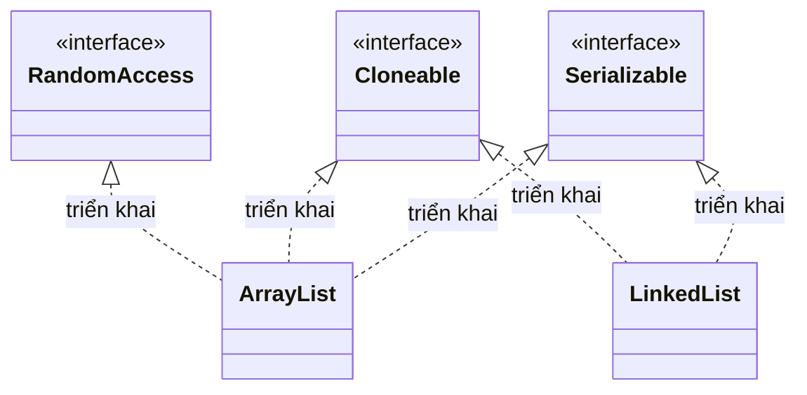

# Marker Interface trong Java

Marker Interface là loại interface rỗng, không có phương thức nào, chỉ dùng để "đánh dấu" cho JVM hoặc framework biết một class có đặc tính đặc biệt. Bài này giới thiệu các marker interface có sẵn quen thuộc như `Serializable`, `Cloneable`, `RandomAccess`, cách tự tạo marker riêng và so sánh với Annotation hiện đại. Hiểu khái niệm này giúp bạn đọc hiểu code Java tốt hơn và biết khi nào nên dùng.

:::note[Ghi nhớ nhanh]

- ⭐ **Marker Interface là interface rỗng dùng để "đánh dấu"** — không có phương thức nào, chỉ báo cho JVM/framework biết class có đặc tính đặc biệt.
- **Ba marker có sẵn quen thuộc** — `Serializable` (tuần tự hóa), `Cloneable` (nhân bản), `RandomAccess` (truy cập theo chỉ số nhanh).
- **Có thể tự tạo marker riêng** — khai báo một interface rỗng rồi cho class `implements` nó.
- **Annotation là cách hiện đại thay thế** — linh hoạt hơn marker interface trong nhiều tình huống.

:::

## Marker Interface là gì?

**Marker Interface** (giao diện đánh dấu) là một **interface không có bất kỳ phương thức hay hằng số nào** bên trong — thân interface hoàn toàn rỗng. Mục đích duy nhất của nó là **đánh dấu** (mark) một class, thông báo cho JVM hoặc các framework biết class đó có một đặc tính đặc biệt nào đó.

```java
// Ví dụ về marker interface
public interface Serializable {
    // Không có gì bên trong!
}
```

Sơ đồ lớp sau minh họa các marker interface rỗng có sẵn và những lớp triển khai chúng:



Đọc sơ đồ: cả ba interface đều rỗng (không có phương thức). `ArrayList` triển khai `RandomAccess` nên truy cập theo chỉ số nhanh, còn `LinkedList` thì không — đó chính là "dấu hiệu" mà marker interface đánh dấu.

---

## Marker Interface có sẵn trong Java

### 1. java.io.Serializable

**`Serializable`** (có thể tuần tự hóa) đánh dấu rằng đối tượng của class có thể được **chuyển thành luồng byte** (serialization) để lưu file hoặc truyền qua mạng, và được **khôi phục lại** (deserialization).

```java
import java.io.*;

public class SerializableDemo {
    // Đánh dấu class có thể Serialize
    static class Student implements Serializable {
        // serialVersionUID: định danh phiên bản — khuyến nghị khai báo tường minh
        private static final long serialVersionUID = 1L;

        String name;
        int age;
        transient String password;  // transient: KHÔNG serialize trường này

        Student(String name, int age, String password) {
            this.name = name;
            this.age = age;
            this.password = password;
        }

        @Override
        public String toString() {
            return "Student{name='" + name + "', age=" + age
                   + ", password='" + password + "'}";
        }
    }

    public static void main(String[] args) throws IOException, ClassNotFoundException {
        Student student = new Student("Nguyễn Văn An", 20, "matkhau123");

        // Serialize: ghi đối tượng ra file
        try (ObjectOutputStream oos = new ObjectOutputStream(
                new FileOutputStream("student.dat"))) {
            oos.writeObject(student);
            System.out.println("Đã lưu: " + student);
        }

        // Deserialize: đọc lại từ file
        try (ObjectInputStream ois = new ObjectInputStream(
                new FileInputStream("student.dat"))) {
            Student loaded = (Student) ois.readObject();
            System.out.println("Đã đọc: " + loaded);
            // password = null vì được đánh dấu transient
        }
    }
}
```

**Kết quả:**
```
Đã lưu: Student{name='Nguyễn Văn An', age=20, password='matkhau123'}
Đã đọc: Student{name='Nguyễn Văn An', age=20, password='null'}
```

> Nếu class không implements `Serializable` nhưng bạn cố serialize: `NotSerializableException`.

### 2. java.lang.Cloneable

**`Cloneable`** đánh dấu rằng class cho phép sao chép đối tượng bằng phương thức `Object.clone()`.

```java
public class CloneableDemo {
    static class Point implements Cloneable {
        int x, y;

        Point(int x, int y) {
            this.x = x;
            this.y = y;
        }

        @Override
        public Point clone() {
            try {
                return (Point) super.clone();  // Shallow copy
            } catch (CloneNotSupportedException e) {
                throw new AssertionError("Không thể clone", e);
            }
        }

        @Override
        public String toString() {
            return "Point(" + x + ", " + y + ")";
        }
    }

    public static void main(String[] args) {
        Point p1 = new Point(10, 20);
        Point p2 = p1.clone();  // Tạo bản sao

        p2.x = 99;  // Thay đổi p2 không ảnh hưởng p1

        System.out.println("p1: " + p1);  // Point(10, 20)
        System.out.println("p2: " + p2);  // Point(99, 20)
    }
}
```

> Nếu class không implements `Cloneable` nhưng gọi `clone()`: `CloneNotSupportedException`.

### 3. java.util.RandomAccess

**`RandomAccess`** đánh dấu rằng List hỗ trợ **truy cập ngẫu nhiên nhanh** theo chỉ số (O(1)).

```java
import java.util.*;

public class RandomAccessDemo {
    public static void printElements(List<String> list) {
        if (list instanceof RandomAccess) {
            // ArrayList implements RandomAccess → truy cập theo index hiệu quả
            for (int i = 0; i < list.size(); i++) {
                System.out.print(list.get(i) + " ");
            }
        } else {
            // LinkedList KHÔNG implements RandomAccess → dùng Iterator
            for (String s : list) {
                System.out.print(s + " ");
            }
        }
        System.out.println();
    }

    public static void main(String[] args) {
        List<String> arrayList = new ArrayList<>(List.of("A", "B", "C"));
        List<String> linkedList = new LinkedList<>(List.of("A", "B", "C"));

        System.out.println("ArrayList RandomAccess: " + (arrayList instanceof RandomAccess));   // true
        System.out.println("LinkedList RandomAccess: " + (linkedList instanceof RandomAccess)); // false

        printElements(arrayList);   // Dùng vòng for index
        printElements(linkedList);  // Dùng Iterator
    }
}
```

---

## Tự tạo Marker Interface

Bạn có thể tạo marker interface riêng cho ứng dụng của mình:

```java
// Marker interface: đánh dấu class có thể log được
public interface Loggable {
    // Không có phương thức
}

// Marker interface: đánh dấu class là dữ liệu nhạy cảm
public interface Sensitive {
    // Không có phương thức
}

// Áp dụng
public class UserData implements Loggable {
    String username;
    String action;
    // ...
}

public class PaymentInfo implements Sensitive, Loggable {
    String cardNumber;
    // ...
}

// Kiểm tra marker interface
public class AuditService {
    public void save(Object data) {
        if (data instanceof Sensitive) {
            // Mã hóa trước khi lưu
            System.out.println("Mã hóa dữ liệu nhạy cảm trước khi lưu...");
        }
        if (data instanceof Loggable) {
            // Ghi log
            System.out.println("Ghi log: " + data.getClass().getSimpleName());
        }
        // Lưu dữ liệu...
    }
}
```

---

## Marker Interface vs Annotation

Từ Java 5, **Annotation** (chú thích) thường được ưu tiên hơn Marker Interface vì linh hoạt hơn:

| | Marker Interface | Annotation |
|---|---|---|
| Cú pháp | `class Foo implements Marker {}` | `@Marker class Foo {}` |
| Kiểm tra | `instanceof` | Reflection hoặc xử lý annotation |
| Tham số | Không có | Có thể có thuộc tính |
| Kế thừa | Tự động kế thừa theo class | Cần `@Inherited` |
| Phạm vi | Chỉ cho class/interface | Class, method, field, ... |

```java
// Marker Interface cũ:
class MyClass implements Serializable { }

// Annotation tương đương (nếu tự thiết kế):
@Retention(RetentionPolicy.RUNTIME)
@Target(ElementType.TYPE)
public @interface MyMarker { }

@MyMarker
class MyClass2 { }
```

---

## Tóm tắt

| Marker Interface | Ý nghĩa |
|---|---|
| `Serializable` | Đối tượng có thể được serialize/deserialize |
| `Cloneable` | Cho phép clone đối tượng bằng `Object.clone()` |
| `RandomAccess` | List hỗ trợ truy cập ngẫu nhiên O(1) |

**Cách nhận biết Marker Interface**: Interface hoàn toàn rỗng, không có phương thức hay hằng số.

**Khi nào dùng**: Khi cần đánh dấu class có một đặc tính đặc biệt để JVM hoặc framework xử lý khác đi. Trong code mới, nên cân nhắc dùng Annotation thay thế.
