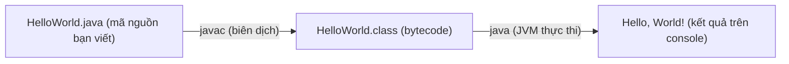

# Chương trình Java đầu tiên

Bài này hướng dẫn bạn viết, biên dịch và chạy chương trình Java đầu tiên — kinh điển "Hello, World!". Bạn sẽ hiểu ý nghĩa từng dòng code, cách dùng lệnh `javac` và `java`, cùng các lỗi thường gặp khi mới bắt đầu. Đây là bước thực hành quan trọng để làm quen với cách một chương trình Java vận hành.

:::note[Ghi nhớ nhanh]

- ⭐ **Mọi chương trình Java bắt đầu từ `public static void main(String[] args)`** — đây là điểm khởi động (entry point) mà JVM tìm để chạy.
- **Biên dịch bằng `javac`, chạy bằng `java`** — `javac HelloWorld.java` tạo file `.class`, rồi `java HelloWorld` để thực thi.
- **Tên lớp `public` phải trùng tên file** — phân biệt chữ hoa/thường, nên `HelloWorld` phải nằm trong `HelloWorld.java`.
- **`System.out.println` in ra console** — công cụ xuất dữ liệu chuẩn cơ bản nhất.

:::

## Yêu cầu

Trước khi bắt đầu, hãy đảm bảo đã cài **JDK** (phiên bản 11 trở lên). Kiểm tra bằng lệnh:

```bash
java -version
javac -version
```

---

## Viết chương trình "Hello, World!"

Tạo file `HelloWorld.java` với nội dung:

```java
public class HelloWorld {
    public static void main(String[] args) {
        System.out.println("Hello, World!");
    }
}
```

---

## Giải thích từng dòng

### `public class HelloWorld`

- **`class`**: Từ khóa khai báo một **lớp** (class — đơn vị cơ bản của Java)
- **`HelloWorld`**: Tên lớp. **Bắt buộc** trùng với tên file (file phải là `HelloWorld.java`)
- **`public`**: **Phạm vi truy cập** (access modifier) — cho phép truy cập từ bất kỳ đâu

> Quy tắc quan trọng: Tên lớp `public` phải trùng tên file `.java`, phân biệt chữ hoa/thường.

### `public static void main(String[] args)`

Đây là **phương thức khởi động** (entry point) — điểm bắt đầu chạy của mọi chương trình Java:

| Từ khóa | Ý nghĩa |
|---|---|
| `public` | JVM có thể gọi từ bên ngoài class |
| `static` | Không cần tạo đối tượng mới mới gọi được |
| `void` | Phương thức không trả về giá trị |
| `main` | Tên phương thức — JVM tìm đúng tên này để khởi chạy |
| `String[] args` | Mảng tham số dòng lệnh (command-line arguments) |

### `System.out.println("Hello, World!")`

- **`System`**: Lớp hệ thống có sẵn trong Java
- **`out`**: Đối tượng đầu ra chuẩn (standard output — thường là màn hình console)
- **`println`**: Phương thức in ra màn hình và xuống dòng (print + new line)
- **`"Hello, World!"`**: Chuỗi ký tự cần in, đặt trong dấu ngoặc kép

---

## Biên dịch và chạy

Java trải qua **hai bước**: biên dịch mã nguồn thành bytecode, rồi để JVM thực thi bytecode đó.



### Bước 1: Biên dịch (Compile)

```bash
javac HelloWorld.java
```

Lệnh này tạo ra file `HelloWorld.class` (bytecode).

### Bước 2: Chạy (Run)

```bash
java HelloWorld
```

**Lưu ý**: Chạy bằng tên lớp, KHÔNG có đuôi `.class`.

### Kết quả

```
Hello, World!
```

---

## Mở rộng: In nhiều dòng và biến

```java
public class HelloWorld {
    public static void main(String[] args) {
        // Đây là comment một dòng
        String name = "Java";
        int version = 21;

        System.out.println("Chào mừng đến với " + name + " " + version + "!");
        System.out.println("Học lập trình Java thật thú vị.");

        /* Đây là comment
           nhiều dòng */
        System.out.print("Dòng này ");
        System.out.print("không xuống dòng.");
    }
}
```

**Kết quả:**
```
Chào mừng đến với Java 21!
Học lập trình Java thật thú vị.
Dòng này không xuống dòng.
```

---

## Các lỗi thường gặp

| Lỗi | Nguyên nhân |
|---|---|
| `cannot find symbol` | Sai tên biến, phương thức hoặc lớp |
| `class HelloWorld is public, should be declared in a file named HelloWorld.java` | Tên lớp không khớp tên file |
| `';' expected` | Thiếu dấu chấm phẩy cuối câu lệnh |
| `reached end of file while parsing` | Thiếu dấu ngoặc nhọn `}` đóng |

---

## Tóm tắt

- Mọi chương trình Java đều phải có ít nhất **một class** và **một phương thức `main`**
- **Biên dịch** bằng `javac`, **chạy** bằng `java`
- Tên file `.java` phải trùng tên lớp `public`
- Mỗi câu lệnh kết thúc bằng dấu **`;`**
