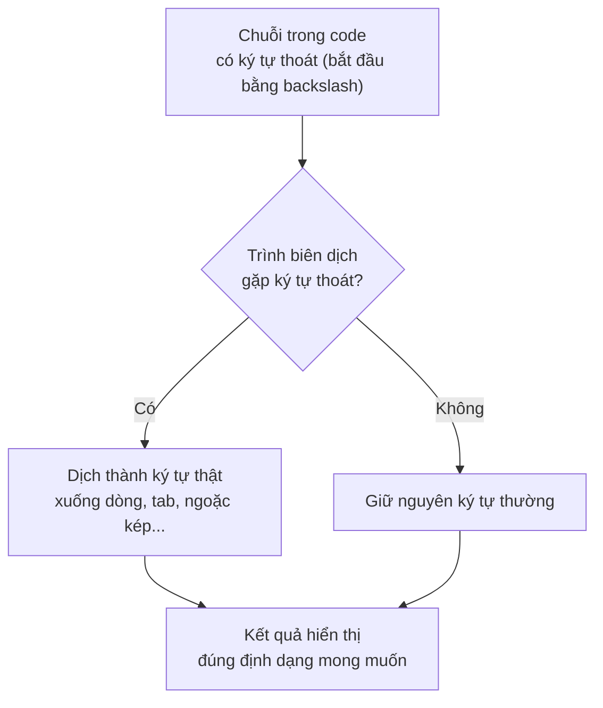

# Một số ký tự đặc biệt trong Java

Trong Java, một số ký tự không thể gõ trực tiếp vào chuỗi (String) vì chúng có ý nghĩa đặc biệt với trình biên dịch. Ta dùng **ký tự thoát** (escape character) — bắt đầu bằng dấu `\` — để biểu diễn chúng.

Sơ đồ dưới đây mô tả cách trình biên dịch xử lý ký tự thoát khi đọc một chuỗi:



Đọc sơ đồ: mỗi khi gặp dấu `\`, trình biên dịch đọc thêm ký tự phía sau để tạo ra ký tự thoát tương ứng, thay vì hiểu theo nghĩa gốc.

---

## Bảng ký tự thoát (Escape Characters)

| Ký tự thoát | Tên | Mô tả |
|---|---|---|
| `\n` | Newline (xuống dòng) | Xuống dòng mới |
| `\t` | Tab | Thêm khoảng trắng tab (thường 4 hoặc 8 dấu cách) |
| `\r` | Carriage Return | Đưa con trỏ về đầu dòng (dùng trên Windows cùng `\n`) |
| `\\` | Backslash | In dấu `\` |
| `\"` | Double quote | In dấu ngoặc kép `"` trong chuỗi |
| `\'` | Single quote | In dấu nháy đơn `'` trong ký tự char |
| `\0` | Null character | Ký tự null (kết thúc chuỗi trong C, ít dùng trong Java) |
| `\b` | Backspace | Xóa ký tự liền trước |
| `\f` | Form feed | Sang trang mới (dùng trong in ấn) |

---

## Ví dụ minh họa

### Xuống dòng `\n` và Tab `\t`

```java
public class EscapeDemo {
    public static void main(String[] args) {
        // \n: xuống dòng
        System.out.println("Dòng 1\nDòng 2\nDòng 3");

        // \t: thêm tab
        System.out.println("Tên:\tNguyễn Văn An");
        System.out.println("Tuổi:\t25");
        System.out.println("Email:\tan@example.com");
    }
}
```

**Kết quả:**
```
Dòng 1
Dòng 2
Dòng 3
Tên:    Nguyễn Văn An
Tuổi:   25
Email:  an@example.com
```

### In dấu ngoặc kép `\"`

```java
public class QuoteDemo {
    public static void main(String[] args) {
        // Không dùng \": lỗi biên dịch
        // String s = "Anh ấy nói "Xin chào"";  // LỖI!

        // Dùng \":
        String s = "Anh ấy nói \"Xin chào\"";
        System.out.println(s);

        // In đường dẫn file Windows (cần \\)
        String path = "C:\\Users\\Admin\\Documents\\file.txt";
        System.out.println(path);
    }
}
```

**Kết quả:**
```
Anh ấy nói "Xin chào"
C:\Users\Admin\Documents\file.txt
```

### Dấu nháy đơn trong char `\'`

```java
public class CharDemo {
    public static void main(String[] args) {
        char dau_nhay = '\'';   // Ký tự dấu nháy đơn
        char backslash = '\\';  // Ký tự backslash

        System.out.println("Ký tự: " + dau_nhay);
        System.out.println("Ký tự: " + backslash);
    }
}
```

**Kết quả:**
```
Ký tự: '
Ký tự: \
```

---

## Ký tự Unicode

Java hỗ trợ biểu diễn ký tự bằng **mã Unicode** theo dạng `\uXXXX` (4 chữ số hex):

```java
public class UnicodeDemo {
    public static void main(String[] args) {
        // A = 'A', B = 'B', C = 'C'
        System.out.println("ABC");  // In ra: ABC

        // Ký tự tiếng Việt
        char a_sac = 'á';  // á
        System.out.println("Ký tự: " + a_sac);   // In ra: á

        // Biểu tượng
        System.out.println("❤");  // In ra: ❤
        System.out.println("★");  // In ra: ★
    }
}
```

**Kết quả:**
```
ABC
Ký tự: á
❤
★
```

---

## Text Block (Java 13+)

Từ **Java 15**, **Text Block** (khối văn bản nhiều dòng) giúp viết chuỗi nhiều dòng dễ hơn, không cần `\n`:

```java
public class TextBlockDemo {
    public static void main(String[] args) {
        // Cách cũ: dùng \n và \"
        String jsonCu = "{\n" +
                "  \"name\": \"Java\",\n" +
                "  \"version\": 21\n" +
                "}";

        // Cách mới: Text Block (Java 15+)
        String jsonMoi = """
                {
                  "name": "Java",
                  "version": 21
                }
                """;

        System.out.println(jsonCu);
        System.out.println("---");
        System.out.println(jsonMoi);
    }
}
```

**Kết quả giống nhau:**
```json
{
  "name": "Java",
  "version": 21
}
```

---

## Tóm tắt

- Ký tự thoát bắt đầu bằng `\` giúp biểu diễn các ký tự đặc biệt trong chuỗi
- Hay dùng nhất: `\n` (xuống dòng), `\t` (tab), `\\` (backslash), `\"` (ngoặc kép)
- Unicode `\uXXXX` cho phép biểu diễn mọi ký tự quốc tế
- Text Block (`"""..."""`) giúp viết chuỗi nhiều dòng gọn gàng hơn (Java 15+)
