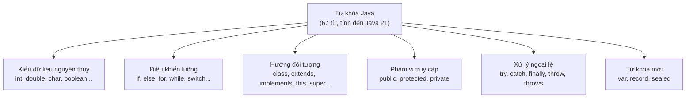

# Một số từ khóa trong Java

**Từ khóa** (keyword) là những từ được Java dành riêng, có ý nghĩa đặc biệt với trình biên dịch. Bạn **không được** dùng chúng làm tên biến, tên lớp hay tên phương thức.

---

## Danh sách từ khóa trong Java

Java có 67 từ khóa (tính đến Java 21). Dưới đây là các nhóm quan trọng nhất:

Sơ đồ dưới đây giúp hình dung các từ khóa được chia thành những nhóm chức năng nào:



Đọc sơ đồ: thay vì học thuộc rời rạc, hãy ghi nhớ từ khóa theo nhóm chức năng — mỗi nhóm phục vụ một mục đích riêng trong ngôn ngữ.

### Nhóm kiểu dữ liệu nguyên thủy

| Từ khóa | Mô tả |
|---|---|
| `byte` | Kiểu số nguyên 8-bit (-128 đến 127) |
| `short` | Kiểu số nguyên 16-bit |
| `int` | Kiểu số nguyên 32-bit |
| `long` | Kiểu số nguyên 64-bit |
| `float` | Kiểu số thực 32-bit |
| `double` | Kiểu số thực 64-bit |
| `char` | Kiểu ký tự Unicode 16-bit |
| `boolean` | Kiểu logic (`true` hoặc `false`) |

### Nhóm điều khiển luồng

| Từ khóa | Mô tả |
|---|---|
| `if`, `else` | Rẽ nhánh điều kiện |
| `switch`, `case`, `default` | Rẽ nhánh theo giá trị |
| `for`, `while`, `do` | Vòng lặp |
| `break` | Thoát vòng lặp hoặc switch |
| `continue` | Bỏ qua vòng lặp hiện tại, sang vòng tiếp theo |
| `return` | Kết thúc phương thức, trả về giá trị |

### Nhóm hướng đối tượng

| Từ khóa | Mô tả |
|---|---|
| `class` | Khai báo lớp |
| `interface` | Khai báo giao diện |
| `extends` | Kế thừa lớp cha |
| `implements` | Triển khai interface |
| `new` | Tạo đối tượng mới |
| `this` | Tham chiếu đến đối tượng hiện tại |
| `super` | Tham chiếu đến lớp cha |
| `abstract` | Lớp/phương thức trừu tượng |
| `final` | Không thể thay đổi/kế thừa/override |
| `static` | Thuộc về lớp, không phải đối tượng |

### Nhóm phạm vi truy cập

| Từ khóa | Mô tả |
|---|---|
| `public` | Truy cập từ bất kỳ đâu |
| `protected` | Truy cập từ cùng package và lớp con |
| `private` | Chỉ truy cập trong cùng lớp |

### Nhóm xử lý ngoại lệ

| Từ khóa | Mô tả |
|---|---|
| `try` | Khối thử nghiệm, có thể gây lỗi |
| `catch` | Bắt và xử lý ngoại lệ |
| `finally` | Luôn thực thi dù có lỗi hay không |
| `throw` | Ném một ngoại lệ |
| `throws` | Khai báo phương thức có thể ném ngoại lệ |

### Từ khóa đặc biệt khác

| Từ khóa | Mô tả |
|---|---|
| `void` | Phương thức không trả về giá trị |
| `null` | Giá trị null (không trỏ đến đối tượng nào) |
| `true`, `false` | Giá trị boolean |
| `instanceof` | Kiểm tra đối tượng có thuộc lớp nào không |
| `enum` | Khai báo kiểu liệt kê |
| `record` | Khai báo record class (Java 16+) |
| `sealed` | Lớp niêm phong — giới hạn lớp con (Java 17+) |
| `var` | Suy luận kiểu dữ liệu tự động (Java 10+) |
| `synchronized` | Đồng bộ hóa trong đa luồng |
| `volatile` | Biến được đọc/ghi trực tiếp từ bộ nhớ chính |
| `transient` | Không serialize field này |
| `native` | Phương thức cài đặt bằng ngôn ngữ khác (C/C++) |

---

## Ví dụ minh họa

### Từ khóa `final`

```java
public class FinalDemo {
    // Hằng số (constant) — dùng final
    static final double PI = 3.14159265358979;
    static final int MAX_SIZE = 100;

    public static void main(String[] args) {
        final int x = 10;
        // x = 20;  // LỖI: không thể gán lại biến final

        System.out.println("PI = " + PI);
        System.out.println("MAX_SIZE = " + MAX_SIZE);
    }
}
```

### Từ khóa `var` (Java 10+)

```java
public class VarDemo {
    public static void main(String[] args) {
        // Trước Java 10: khai báo tường minh
        String ten = "Nguyễn Văn An";
        int tuoi = 25;

        // Từ Java 10: dùng var — trình biên dịch tự suy luận kiểu
        var tenMoi = "Trần Thị Bình";  // tự suy luận là String
        var tuoiMoi = 30;               // tự suy luận là int

        System.out.println(tenMoi + " - " + tuoiMoi);
    }
}
```

### Từ khóa `instanceof`

```java
public class InstanceofDemo {
    public static void main(String[] args) {
        Object obj = "Hello Java";

        // Kiểm tra đối tượng có phải String không
        if (obj instanceof String str) {  // Pattern matching (Java 16+)
            System.out.println("Là String, độ dài: " + str.length());
        }

        Object num = 42;
        if (num instanceof Integer) {
            System.out.println("Là Integer");
        }
    }
}
```

---

## Từ khóa dành riêng nhưng chưa dùng

Java dành riêng một số từ nhưng chưa có chức năng:

- `goto` — có trong danh sách từ khóa nhưng Java không dùng
- `const` — tương tự `goto`, không dùng trong Java (dùng `final` thay thế)

---

## Tóm tắt

- Java có 67 từ khóa — không thể dùng làm tên biến/lớp/phương thức
- Từ khóa được phân thành các nhóm: kiểu dữ liệu, điều khiển luồng, OOP, phạm vi truy cập, xử lý ngoại lệ
- Một số từ khóa mới được thêm trong các phiên bản gần đây: `var` (Java 10), `record` (Java 16), `sealed` (Java 17)
