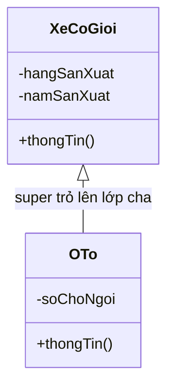

# Từ khóa this và super trong Java

Trong lập trình hướng đối tượng (OOP — Object-Oriented Programming) Java, `this` và `super` là hai từ khóa tham chiếu (reference keyword) quan trọng dùng để phân biệt và truy cập các thành phần trong cùng lớp hoặc từ lớp cha.

Sơ đồ dưới đây minh họa hai từ khóa trỏ về đâu trong quan hệ kế thừa: `this` trỏ vào chính đối tượng lớp con, còn `super` trỏ lên phần lớp cha.



Đọc sơ đồ: bên trong đối tượng `OTo`, `this` tham chiếu thành viên của chính `OTo`, còn `super` cho phép gọi constructor và phương thức của lớp cha `XeCoGioi`.

---

## 1. Từ khóa `this`

`this` là tham chiếu đến **đối tượng hiện tại** (current object) — tức là đối tượng đang gọi phương thức hoặc đang được khởi tạo.

### 1.1. Phân biệt biến thực thể (instance variable) và tham số

Khi tham số của constructor (hàm khởi tạo) trùng tên với biến thực thể, dùng `this` để chỉ rõ biến của đối tượng:

```java
public class SinhVien {
    private String ten;
    private int tuoi;

    // Constructor (hàm khởi tạo)
    public SinhVien(String ten, int tuoi) {
        this.ten = ten;   // this.ten → biến thực thể; ten → tham số
        this.tuoi = tuoi;
    }

    public void hienThi() {
        System.out.println("Tên: " + this.ten + ", Tuổi: " + this.tuoi);
    }
}
```

### 1.2. Gọi constructor khác trong cùng lớp — `this()`

`this()` cho phép một constructor gọi constructor khác trong cùng lớp (constructor chaining — chuỗi hàm khởi tạo). Lời gọi `this()` **phải đứng đầu tiên** trong constructor.

```java
public class DiemThi {
    private String monHoc;
    private double diem;
    private String xepLoai;

    public DiemThi(String monHoc, double diem) {
        this.monHoc = monHoc;
        this.diem = diem;
        this.xepLoai = "Chưa xếp loại";
    }

    // Gọi constructor trên thông qua this()
    public DiemThi(String monHoc, double diem, String xepLoai) {
        this(monHoc, diem); // phải là dòng đầu tiên
        this.xepLoai = xepLoai;
    }
}
```

### 1.3. Truyền đối tượng hiện tại làm tham số

```java
public class XeHoi {
    public void kiemTra(XeHoi xe) {
        System.out.println("Kiểm tra: " + xe);
    }

    public void goiKiemTra() {
        kiemTra(this); // truyền chính đối tượng hiện tại
    }
}
```

---

## 2. Từ khóa `super`

`super` là tham chiếu đến **lớp cha** (parent class / superclass) trong quan hệ kế thừa (inheritance).

### 2.1. Truy cập biến của lớp cha

Khi lớp con (subclass) khai báo biến trùng tên với lớp cha, dùng `super` để truy cập biến lớp cha:

```java
public class DongVat {
    String loai = "Động vật";
}

public class ChoNha extends DongVat {
    String loai = "Chó nhà"; // che khuất biến lớp cha

    public void hienThi() {
        System.out.println("Lớp con: " + loai);         // "Chó nhà"
        System.out.println("Lớp cha: " + super.loai);   // "Động vật"
    }
}
```

### 2.2. Gọi phương thức của lớp cha — `super.method()`

Khi lớp con ghi đè (override) phương thức lớp cha nhưng vẫn muốn sử dụng logic lớp cha:

```java
public class DongVat {
    public void keu() {
        System.out.println("Động vật kêu...");
    }
}

public class MeoNha extends DongVat {
    @Override
    public void keu() {
        super.keu();             // gọi phương thức lớp cha trước
        System.out.println("Mèo kêu: Meo meo!");
    }
}

// Kết quả khi gọi new MeoNha().keu():
// Động vật kêu...
// Mèo kêu: Meo meo!
```

### 2.3. Gọi constructor lớp cha — `super()`

`super()` gọi constructor của lớp cha. Lời gọi `super()` **phải đứng đầu tiên** trong constructor lớp con. Nếu không khai báo tường minh, Java tự động chèn `super()` không tham số.

```java
public class NguoiDung {
    private String email;

    public NguoiDung(String email) {
        this.email = email;
    }
}

public class QuanTriVien extends NguoiDung {
    private String vaiTro;

    public QuanTriVien(String email, String vaiTro) {
        super(email);          // gọi constructor NguoiDung(String email)
        this.vaiTro = vaiTro;
    }
}
```

---

## 3. So sánh `this` và `super`

| Tiêu chí | `this` | `super` |
|---|---|---|
| Tham chiếu đến | Đối tượng hiện tại | Lớp cha |
| Gọi constructor | `this()` — constructor cùng lớp | `super()` — constructor lớp cha |
| Truy cập thành viên | Thành viên lớp hiện tại | Thành viên bị che khuất của lớp cha |
| Vị trí trong constructor | Phải là dòng đầu tiên (nếu dùng) | Phải là dòng đầu tiên (nếu dùng) |
| Dùng trong `static` | Không được phép | Không được phép |

> **Lưu ý:** `this()` và `super()` không thể cùng xuất hiện trong một constructor vì cả hai đều yêu cầu đứng ở dòng đầu tiên.

---

## 4. Ví dụ tổng hợp

```java
public class XeCoGioi {
    private String hangSanXuat;
    private int namSanXuat;

    public XeCoGioi(String hangSanXuat, int namSanXuat) {
        this.hangSanXuat = hangSanXuat;
        this.namSanXuat = namSanXuat;
    }

    public void thongTin() {
        System.out.println("Hãng: " + hangSanXuat + ", Năm: " + namSanXuat);
    }
}

public class OTo extends XeCoGioi {
    private int soChoNgoi;

    public OTo(String hangSanXuat, int namSanXuat, int soChoNgoi) {
        super(hangSanXuat, namSanXuat); // khởi tạo lớp cha
        this.soChoNgoi = soChoNgoi;
    }

    @Override
    public void thongTin() {
        super.thongTin();              // in thông tin lớp cha
        System.out.println("Số chỗ ngồi: " + soChoNgoi);
    }

    public static void main(String[] args) {
        OTo xe = new OTo("Toyota", 2022, 5);
        xe.thongTin();
        // Hãng: Toyota, Năm: 2022
        // Số chỗ ngồi: 5
    }
}
```

---

## Tóm tắt

- `this` — tham chiếu đến đối tượng hiện tại, dùng để phân biệt biến, gọi constructor cùng lớp, hoặc truyền chính đối tượng làm tham số.
- `super` — tham chiếu đến lớp cha, dùng để gọi constructor lớp cha, truy cập phương thức hoặc biến bị che khuất.
- Cả `this()` và `super()` đều phải là câu lệnh đầu tiên trong constructor và không thể dùng đồng thời.
