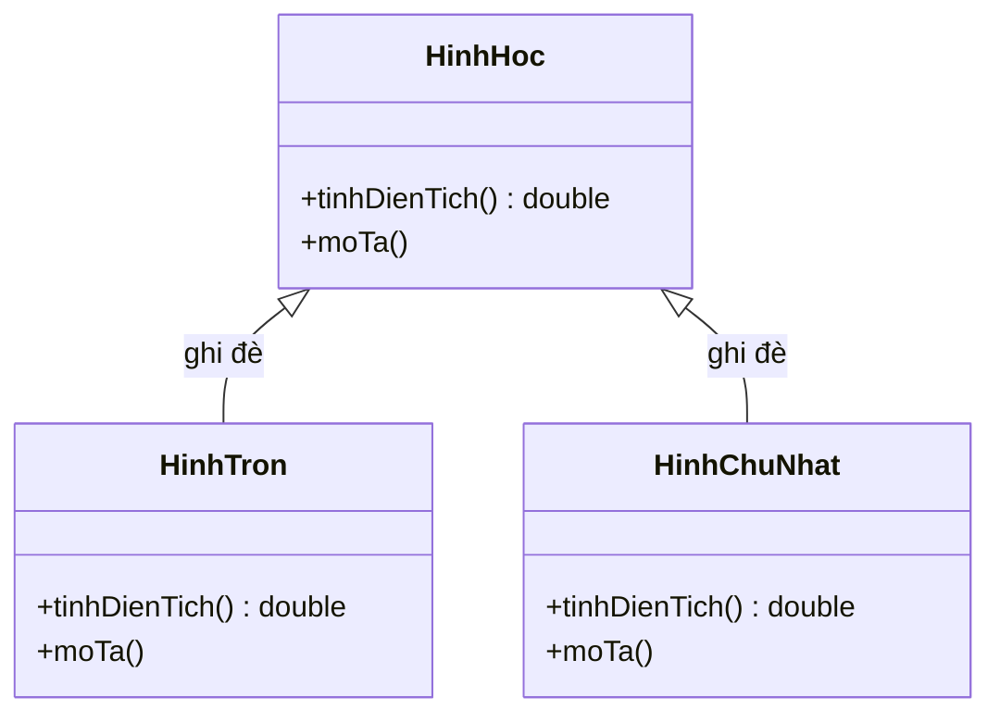
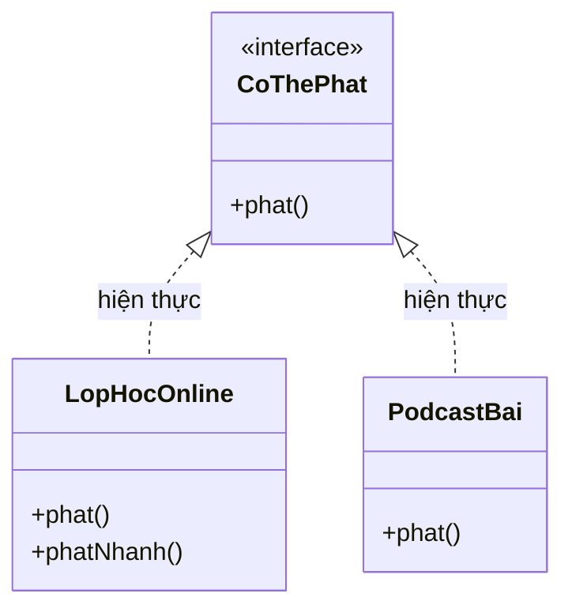

# Tính đa hình (Polymorphism) trong Java

**Polymorphism** (đa hình) là một trong bốn trụ cột của lập trình hướng đối tượng (OOP). Đa hình cho phép cùng một hành động (phương thức) được thực hiện theo nhiều cách khác nhau tùy thuộc vào kiểu đối tượng thực tế tại thời điểm chạy (runtime).

Tên "polymorphism" xuất phát từ tiếng Hy Lạp: "poly" (nhiều) + "morph" (dạng) — nghĩa là "nhiều dạng".

---

## 1. Hai loại đa hình trong Java

Java có hai loại đa hình:

| Loại | Tên khác | Xảy ra khi |
|---|---|---|
| Compile-time polymorphism | Static polymorphism / Method Overloading | Biên dịch (compile time) |
| Runtime polymorphism | Dynamic polymorphism / Method Overriding | Chạy chương trình (runtime) |

---

## 2. Compile-time Polymorphism — Nạp chồng phương thức

**Method Overloading** (nạp chồng phương thức) cho phép định nghĩa nhiều phương thức cùng tên trong một lớp, nhưng khác nhau về **danh sách tham số** (số lượng, kiểu dữ liệu, thứ tự tham số).

Trình biên dịch (compiler) quyết định phương thức nào được gọi dựa trên đối số truyền vào.

```java
public class MayTinh {

    // Cộng hai số nguyên
    public int cong(int a, int b) {
        return a + b;
    }

    // Cộng ba số nguyên
    public int cong(int a, int b, int c) {
        return a + b + c;
    }

    // Cộng hai số thực
    public double cong(double a, double b) {
        return a + b;
    }

    // Nối chuỗi
    public String cong(String a, String b) {
        return a + b;
    }

    public static void main(String[] args) {
        MayTinh mt = new MayTinh();
        System.out.println(mt.cong(2, 3));           // 5
        System.out.println(mt.cong(1, 2, 3));         // 6
        System.out.println(mt.cong(1.5, 2.5));        // 4.0
        System.out.println(mt.cong("Java", " OOP"));  // Java OOP
    }
}
```

> **Lưu ý:** Chỉ thay đổi kiểu trả về (return type) không tạo ra overloading và sẽ gây lỗi biên dịch nếu tên và tham số trùng nhau.

---

## 3. Runtime Polymorphism — Ghi đè phương thức

**Method Overriding** (ghi đè phương thức) xảy ra khi lớp con cung cấp một cài đặt cụ thể cho phương thức đã được định nghĩa trong lớp cha.

Phương thức nào được gọi được quyết định tại **thời điểm chạy** dựa trên kiểu thực của đối tượng — đây là **Dynamic Method Dispatch** (điều phối phương thức động).

Sơ đồ dưới đây minh họa cây kế thừa nơi mỗi lớp con ghi đè phương thức `tinhDienTich()` và `moTa()` của lớp cha:



Đọc sơ đồ: khi gọi `hinh.moTa()` trên biến kiểu `HinhHoc`, Java chọn đúng cài đặt của lớp con thực tế (`HinhTron` hoặc `HinhChuNhat`) tại runtime.

```java
public class HinhHoc {
    public double tinhDienTich() {
        return 0;
    }

    public void moTa() {
        System.out.println("Đây là một hình hình học.");
    }
}

public class HinhTron extends HinhHoc {
    private double banKinh;

    public HinhTron(double banKinh) {
        this.banKinh = banKinh;
    }

    @Override
    public double tinhDienTich() {
        return Math.PI * banKinh * banKinh;
    }

    @Override
    public void moTa() {
        System.out.printf("Hình tròn, bán kính %.1f, diện tích %.2f%n",
            banKinh, tinhDienTich());
    }
}

public class HinhChuNhat extends HinhHoc {
    private double chieuDai;
    private double chieuRong;

    public HinhChuNhat(double chieuDai, double chieuRong) {
        this.chieuDai = chieuDai;
        this.chieuRong = chieuRong;
    }

    @Override
    public double tinhDienTich() {
        return chieuDai * chieuRong;
    }

    @Override
    public void moTa() {
        System.out.printf("Hình chữ nhật %.1f x %.1f, diện tích %.2f%n",
            chieuDai, chieuRong, tinhDienTich());
    }
}

public class DemoRuntimePolymorphism {
    public static void main(String[] args) {
        // Biến kiểu lớp cha, trỏ đến đối tượng lớp con
        HinhHoc[] danhSachHinh = {
            new HinhTron(5),
            new HinhChuNhat(4, 6),
            new HinhTron(3)
        };

        // Java tự gọi đúng phương thức của từng lớp con tại runtime
        for (HinhHoc hinh : danhSachHinh) {
            hinh.moTa();
        }
        // Hình tròn, bán kính 5.0, diện tích 78.54
        // Hình chữ nhật 4.0 x 6.0, diện tích 24.00
        // Hình tròn, bán kính 3.0, diện tích 28.27
    }
}
```

---

## 4. Đa hình qua Interface (Giao diện)

Interface (giao diện) là cách đa hình mạnh mẽ nhất trong Java vì một lớp có thể triển khai (implement) nhiều interface:

Sơ đồ sau cho thấy nhiều lớp cùng hiện thực một interface `CoThePhat`, nhờ đó có thể xử lý chúng qua cùng một kiểu:



Đọc sơ đồ: một mảng kiểu `CoThePhat[]` có thể chứa cả `LopHocOnline` lẫn `PodcastBai`, và lời gọi `item.phat()` sẽ chạy đúng cài đặt của từng lớp.

```java
interface CoThePhat {
    void phat();
}

interface CoThePhat2x {
    void phatNhanh();
}

public class LopHocOnline implements CoThePhat, CoThePhat2x {
    private String tenBai;

    public LopHocOnline(String tenBai) {
        this.tenBai = tenBai;
    }

    @Override
    public void phat() {
        System.out.println("Phát bình thường: " + tenBai);
    }

    @Override
    public void phatNhanh() {
        System.out.println("Phát 2x: " + tenBai);
    }
}

public class PodcastBai implements CoThePhat {
    private String tieuDe;

    public PodcastBai(String tieuDe) {
        this.tieuDe = tieuDe;
    }

    @Override
    public void phat() {
        System.out.println("Podcast: " + tieuDe);
    }
}

public class DemoInterfacePolymorphism {
    public static void phatTatCa(CoThePhat[] danhSach) {
        for (CoThePhat item : danhSach) {
            item.phat(); // đa hình — gọi đúng cài đặt của từng lớp
        }
    }

    public static void main(String[] args) {
        CoThePhat[] danhSach = {
            new LopHocOnline("Java OOP"),
            new PodcastBai("Lập trình tư duy"),
            new LopHocOnline("Design Pattern")
        };
        phatTatCa(danhSach);
    }
}
```

---

## 5. Quy tắc ghi đè phương thức (Overriding Rules)

Khi ghi đè phương thức trong lớp con, cần tuân thủ:

| Quy tắc | Mô tả |
|---|---|
| Tên và tham số phải giống hệt | Phải trùng khớp với phương thức lớp cha |
| Kiểu trả về | Phải giống hoặc là kiểu con (covariant return type) |
| Access modifier | Không được hạn chế hơn lớp cha (có thể mở rộng) |
| Exception | Không được khai báo thêm checked exception mới |
| `@Override` | Nên dùng để trình biên dịch kiểm tra |
| `static`, `final`, `private` | Không thể override các phương thức này |

---

## 6. So sánh Overloading và Overriding

| Tiêu chí | Overloading (nạp chồng) | Overriding (ghi đè) |
|---|---|---|
| Xảy ra | Trong cùng một lớp | Giữa lớp cha và lớp con |
| Tham số | Phải khác nhau | Phải giống nhau |
| Kiểu trả về | Có thể khác | Phải giống hoặc kiểu con |
| Thời điểm quyết định | Compile time | Runtime |
| Kế thừa | Không cần | Bắt buộc |

---

## Tóm tắt

- **Đa hình** cho phép cùng một giao diện (interface) hoạt động với nhiều kiểu đối tượng khác nhau.
- **Overloading** (compile-time): nhiều phương thức cùng tên, khác tham số trong một lớp.
- **Overriding** (runtime): lớp con cung cấp cài đặt riêng cho phương thức của lớp cha.
- Đa hình giúp code linh hoạt, dễ mở rộng và tuân thủ nguyên tắc Mở-Đóng (Open-Closed Principle) trong thiết kế phần mềm.
