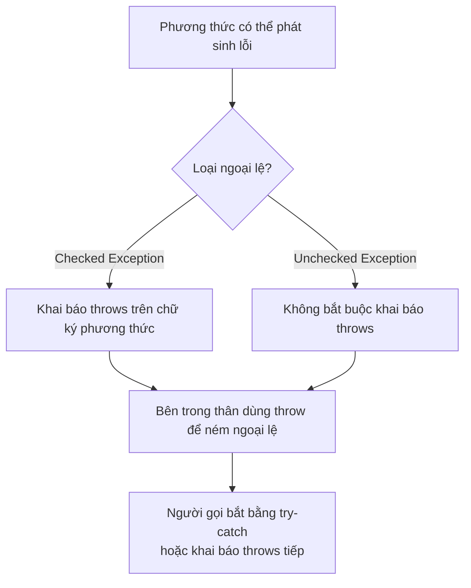

# Từ khóa throw và throws trong Java

Trong Java, `throw` và `throws` là hai từ khóa liên quan đến **Exception** (ngoại lệ — sự kiện bất thường xảy ra trong quá trình thực thi chương trình), nhưng chúng có vai trò khác nhau.

Sơ đồ dưới đây tóm tắt luồng phối hợp giữa `throws` (khai báo phương thức có thể ném lỗi) và `throw` (hành động ném lỗi thực sự), cùng trách nhiệm của người gọi:



Đọc sơ đồ: nhánh trái cho thấy với Checked Exception thì bắt buộc khai báo `throws`; còn `throw` luôn là điểm ném lỗi thực tế trong thân phương thức.

:::note[Ghi nhớ nhanh]

- ⭐ **`throw` là hành động, `throws` là khai báo** — `throw` ném ngoại lệ ngay tại một dòng trong thân phương thức; `throws` chỉ báo trước ở chữ ký rằng phương thức có thể ném lỗi.
- **`throw` chỉ ném một ngoại lệ mỗi lần** — đối tượng ném phải là instance của `Throwable` hoặc lớp con; code sau `throw` không được chạy.
- **`throws` chủ yếu dùng cho Checked Exception** — người gọi buộc phải `try-catch` hoặc khai báo `throws` tiếp; với `RuntimeException` thì không bắt buộc.
- **`throws` khai báo được nhiều ngoại lệ** — liệt kê cách nhau bằng dấu phẩy ngay trên chữ ký phương thức.

:::

---

## 1. Từ khóa `throw`

`throw` được dùng để **ném ra** (phát sinh) một ngoại lệ tại một điểm cụ thể trong code. Chương trình sẽ dừng thực thi tại dòng đó và chuyển sang khối xử lý ngoại lệ gần nhất.

**Cú pháp:**

```java
throw new TênNgoạiLệ("Thông điệp lỗi");
```

**Ví dụ:**

```java
public class ThrowDemo {
    static void kiemTraTuoi(int tuoi) {
        if (tuoi < 18) {
            // Ném ra một ngoại lệ kiểu IllegalArgumentException
            throw new IllegalArgumentException("Tuổi phải từ 18 trở lên. Tuổi nhận được: " + tuoi);
        }
        System.out.println("Tuổi hợp lệ: " + tuoi);
    }

    public static void main(String[] args) {
        kiemTraTuoi(25); // In ra: Tuổi hợp lệ: 25
        kiemTraTuoi(15); // Ném ra IllegalArgumentException
    }
}
```

**Lưu ý quan trọng:**
- `throw` chỉ ném ra **một** ngoại lệ duy nhất mỗi lần.
- Sau `throw`, chương trình không tiếp tục thực thi các lệnh còn lại trong khối đó.
- Đối tượng được ném phải là instance của `Throwable` hoặc lớp con của nó.

---

## 2. Từ khóa `throws`

`throws` được khai báo trong **chữ ký phương thức** (method signature) để thông báo rằng phương thức đó **có thể ném ra** một hoặc nhiều **Checked Exception** (ngoại lệ kiểm tra — loại ngoại lệ bắt buộc phải xử lý hoặc khai báo).

**Cú pháp:**

```java
public void tenPhuongThuc() throws NgoaiLe1, NgoaiLe2 {
    // nội dung phương thức
}
```

**Ví dụ:**

```java
import java.io.FileReader;
import java.io.IOException;

public class ThrowsDemo {

    // Khai báo throws để thông báo phương thức này có thể ném IOException
    static void docFile(String duongDan) throws IOException {
        FileReader reader = new FileReader(duongDan);
        System.out.println("Mở file thành công: " + duongDan);
        reader.close();
    }

    public static void main(String[] args) {
        try {
            docFile("khong-ton-tai.txt");
        } catch (IOException e) {
            System.out.println("Lỗi đọc file: " + e.getMessage());
        }
    }
}
```

**Lưu ý quan trọng:**
- `throws` chỉ là **khai báo**, không phải hành động ném ngoại lệ.
- Phương thức gọi đến phương thức có `throws` phải xử lý ngoại lệ đó bằng `try-catch` hoặc tiếp tục khai báo `throws`.
- `throws` thường dùng với **Checked Exception**. Với **Unchecked Exception** (ngoại lệ không kiểm tra — như `RuntimeException`), khai báo `throws` là không bắt buộc.

---

## 3. So sánh `throw` và `throws`

| Tiêu chí | `throw` | `throws` |
|---|---|---|
| Vị trí sử dụng | Bên trong thân phương thức | Trong chữ ký phương thức |
| Mục đích | Ném ra ngoại lệ thực sự | Khai báo ngoại lệ có thể xảy ra |
| Số lượng | Chỉ ném một ngoại lệ | Có thể khai báo nhiều ngoại lệ |
| Theo sau bởi | Instance của `Throwable` | Tên lớp ngoại lệ |

---

## 4. Ví dụ kết hợp `throw` và `throws`

```java
public class NganHang {

    // Khai báo throws Exception để phương thức gọi biết cần xử lý
    public void rutTien(double soTien, double soDu) throws Exception {
        if (soTien <= 0) {
            throw new IllegalArgumentException("Số tiền rút phải lớn hơn 0.");
        }
        if (soTien > soDu) {
            throw new Exception("Số dư không đủ. Số dư hiện tại: " + soDu);
        }
        System.out.println("Rút tiền thành công: " + soTien);
    }

    public static void main(String[] args) {
        NganHang nh = new NganHang();
        try {
            nh.rutTien(500_000, 1_000_000); // Thành công
            nh.rutTien(-100, 1_000_000);    // Ném IllegalArgumentException
        } catch (IllegalArgumentException e) {
            System.out.println("Lỗi tham số: " + e.getMessage());
        } catch (Exception e) {
            System.out.println("Lỗi giao dịch: " + e.getMessage());
        }
    }
}
```

---

## Tóm tắt

- **`throw`**: Hành động ném ra ngoại lệ ngay tại dòng code đó.
- **`throws`**: Lời khai báo trong chữ ký phương thức, cảnh báo người gọi rằng phương thức này có thể phát sinh ngoại lệ.
