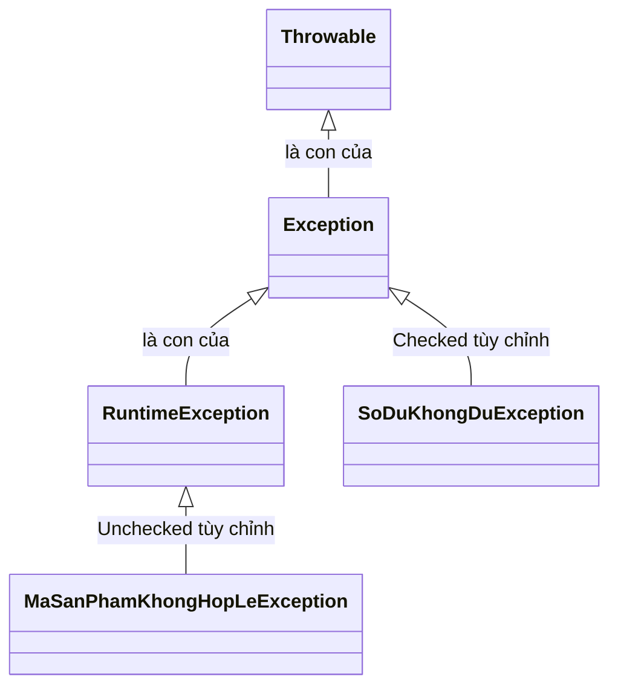

# Custom Exception trong Java

**Custom Exception** (ngoại lệ tùy chỉnh — ngoại lệ do lập trình viên tự định nghĩa) cho phép bạn tạo ra các loại lỗi phù hợp với nghiệp vụ của ứng dụng, thay vì phụ thuộc hoàn toàn vào các lớp ngoại lệ có sẵn của Java.

Sơ đồ dưới đây cho thấy vị trí của ngoại lệ tùy chỉnh trong cây phân cấp ngoại lệ của Java: kế thừa từ `Exception` (Checked) hoặc từ `RuntimeException` (Unchecked).



Đọc sơ đồ: `SoDuKhongDuException` kế thừa trực tiếp `Exception` nên là Checked (bắt buộc xử lý); `MaSanPhamKhongHopLeException` kế thừa `RuntimeException` nên là Unchecked (không bắt buộc xử lý).

:::note[Ghi nhớ nhanh]

- ⭐ **Kế thừa `Exception` hay `RuntimeException` quyết định Checked/Unchecked** — con của `Exception` là Checked (bắt buộc xử lý), con của `RuntimeException` là Unchecked (không bắt buộc).
- **Custom Exception mang ý nghĩa nghiệp vụ** — như `InsufficientBalanceException`, `UserNotFoundException`, giúp code dễ đọc và dễ debug hơn ngoại lệ kỹ thuật chung.
- **Nên có constructor nhận `Throwable cause`** — gọi `super(message, cause)` để bảo toàn stack trace gốc.
- **Chọn loại theo tình huống** — Unchecked cho lỗi lập trình/tham số sai; Checked cho lỗi nghiệp vụ mà người gọi có thể phục hồi.
- **Quy ước đặt tên kết thúc bằng `Exception`.**

:::

---

## 1. Tại sao cần Custom Exception?

Các ngoại lệ có sẵn như `NullPointerException`, `IllegalArgumentException` mang tính chất kỹ thuật chung. Khi xây dựng ứng dụng thực tế, bạn cần những ngoại lệ mang ý nghĩa nghiệp vụ rõ ràng hơn, ví dụ:

- `InsufficientBalanceException` — số dư không đủ
- `UserNotFoundException` — không tìm thấy người dùng
- `InvalidProductCodeException` — mã sản phẩm không hợp lệ

Điều này giúp code dễ đọc, dễ debug và dễ bảo trì hơn.

---

## 2. Cách tạo Custom Exception

### 2.1. Checked Custom Exception (ngoại lệ kiểm tra tùy chỉnh)

Kế thừa từ lớp `Exception`. Người gọi **bắt buộc** phải xử lý hoặc khai báo `throws`.

```java
// Định nghĩa ngoại lệ tùy chỉnh
public class SoDuKhongDuException extends Exception {

    private double soTienThieu;

    // Constructor cơ bản
    public SoDuKhongDuException(String message) {
        super(message);
    }

    // Constructor với thông tin bổ sung
    public SoDuKhongDuException(String message, double soTienThieu) {
        super(message);
        this.soTienThieu = soTienThieu;
    }

    public double getSoTienThieu() {
        return soTienThieu;
    }
}
```

### 2.2. Unchecked Custom Exception (ngoại lệ không kiểm tra tùy chỉnh)

Kế thừa từ lớp `RuntimeException`. Người gọi **không bắt buộc** phải xử lý.

```java
public class MaSanPhamKhongHopLeException extends RuntimeException {

    private String maSanPham;

    public MaSanPhamKhongHopLeException(String maSanPham) {
        super("Mã sản phẩm không hợp lệ: " + maSanPham);
        this.maSanPham = maSanPham;
    }

    public String getMaSanPham() {
        return maSanPham;
    }
}
```

---

## 3. Sử dụng Custom Exception

```java
public class TaiKhoanNganHang {

    private String chuTaiKhoan;
    private double soDu;

    public TaiKhoanNganHang(String chuTaiKhoan, double soDuBanDau) {
        this.chuTaiKhoan = chuTaiKhoan;
        this.soDu = soDuBanDau;
    }

    // Sử dụng Checked Exception
    public void rutTien(double soTien) throws SoDuKhongDuException {
        if (soTien > soDu) {
            double soTienThieu = soTien - soDu;
            throw new SoDuKhongDuException(
                "Tài khoản của " + chuTaiKhoan + " không đủ số dư.",
                soTienThieu
            );
        }
        soDu -= soTien;
        System.out.println("Rút thành công " + soTien + ". Số dư còn lại: " + soDu);
    }

    // Sử dụng Unchecked Exception
    public void napTien(double soTien) {
        if (soTien <= 0) {
            // Không cần khai báo throws vì là RuntimeException
            throw new MaSanPhamKhongHopLeException("NAP_" + soTien);
        }
        soDu += soTien;
        System.out.println("Nạp thành công " + soTien + ". Số dư mới: " + soDu);
    }

    public static void main(String[] args) {
        TaiKhoanNganHang tk = new TaiKhoanNganHang("Nguyễn Văn A", 1_000_000);

        // Xử lý Checked Exception bắt buộc phải dùng try-catch
        try {
            tk.rutTien(500_000);  // Thành công
            tk.rutTien(800_000);  // Ném SoDuKhongDuException
        } catch (SoDuKhongDuException e) {
            System.out.println("Lỗi: " + e.getMessage());
            System.out.println("Cần thêm: " + e.getSoTienThieu() + " đồng.");
        }
    }
}
```

---

## 4. Quy ước đặt tên và thiết kế

- Tên lớp kết thúc bằng `Exception`, ví dụ: `UserNotFoundException`, `PaymentFailedException`.
- Luôn cung cấp ít nhất hai **constructor** (hàm khởi tạo):
  - Nhận `String message`
  - Nhận `String message` và `Throwable cause` (nguyên nhân gốc)

```java
public class UserNotFoundException extends Exception {

    public UserNotFoundException(String message) {
        super(message);
    }

    // Constructor với cause giúp bảo toàn stack trace gốc
    public UserNotFoundException(String message, Throwable cause) {
        super(message, cause);
    }
}
```

- Ưu tiên **Unchecked Exception** (`RuntimeException`) cho các lỗi lập trình viên gây ra (lỗi logic, tham số sai).
- Ưu tiên **Checked Exception** cho các tình huống nghiệp vụ mà người gọi có thể phục hồi được (không đủ số dư, file không tồn tại).

---

## Tóm tắt

| Loại | Kế thừa từ | Bắt buộc xử lý | Dùng khi |
|---|---|---|---|
| Checked Custom Exception | `Exception` | Có | Lỗi nghiệp vụ, người gọi có thể phục hồi |
| Unchecked Custom Exception | `RuntimeException` | Không | Lỗi lập trình, tham số không hợp lệ |
