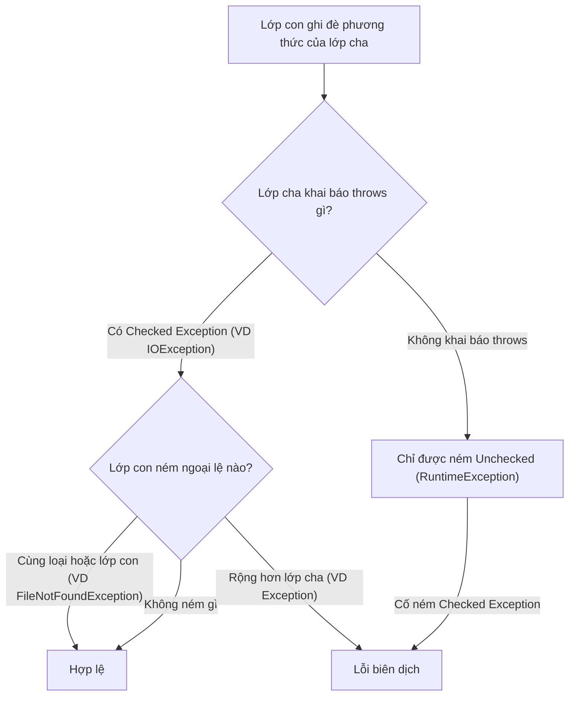

# Xử lý ngoại lệ khi ghi đè phương thức trong Java

Khi sử dụng **Method Overriding** (ghi đè phương thức — định nghĩa lại phương thức của lớp cha trong lớp con), Java có những quy tắc nghiêm ngặt về **Checked Exception** (ngoại lệ kiểm tra) mà lập trình viên cần nắm rõ.

Sơ đồ dưới đây minh họa quy tắc quyết định: khi ghi đè, lớp con chỉ được thu hẹp (không được mở rộng) danh sách Checked Exception so với lớp cha.



Đọc sơ đồ: chỉ khi ngoại lệ của lớp con bằng hoặc hẹp hơn lớp cha thì mới hợp lệ; ném rộng hơn hoặc ném Checked khi lớp cha không khai báo `throws` đều gây lỗi biên dịch. Riêng Unchecked Exception luôn được phép.

:::note[Ghi nhớ nhanh]

- ⭐ **Ghi đè chỉ được thu hẹp, không được mở rộng Checked Exception** — phương thức con chỉ ném được ngoại lệ bằng hoặc là lớp con của ngoại lệ lớp cha.
- **Ném rộng hơn gây lỗi biên dịch** — ví dụ lớp cha ném `IOException`, lớp con ném `Exception` sẽ không biên dịch được.
- **Nếu lớp cha (hoặc interface) không khai báo `throws`** — lớp con chỉ được ném `RuntimeException` (Unchecked) khi ghi đè.
- **Unchecked Exception luôn được phép** — `RuntimeException` và lớp con không bị quy tắc này hạn chế.
- **Lý do: đảm bảo Liskov Substitution Principle** — lớp con thay thế được lớp cha mà không làm hỏng khối `catch` của người gọi.

:::

---

## 1. Quy tắc tổng quát

Khi lớp con ghi đè một phương thức của lớp cha, phương thức ghi đè **không được phép ném ra Checked Exception rộng hơn** so với phương thức gốc.

Cụ thể:

- Phương thức con **có thể** ném ra ngoại lệ là **lớp con** của ngoại lệ trong lớp cha.
- Phương thức con **có thể** không ném ra bất kỳ ngoại lệ nào.
- Phương thức con **không được** ném ra ngoại lệ là **lớp cha** (rộng hơn) của ngoại lệ trong lớp cha.
- Phương thức con **có thể** ném ra bất kỳ **Unchecked Exception** (ngoại lệ không kiểm tra — `RuntimeException` và lớp con) nào, không bị hạn chế.

---

## 2. Ví dụ minh họa

### 2.1. Hợp lệ — thu hẹp ngoại lệ

```java
import java.io.IOException;
import java.io.FileNotFoundException;

class LopCha {
    // Phương thức cha khai báo ném IOException
    public void docDuLieu() throws IOException {
        System.out.println("LopCha: đọc dữ liệu");
    }
}

class LopCon extends LopCha {
    // Hợp lệ: FileNotFoundException là lớp con của IOException (thu hẹp hơn)
    @Override
    public void docDuLieu() throws FileNotFoundException {
        System.out.println("LopCon: đọc dữ liệu từ file");
    }
}
```

### 2.2. Hợp lệ — không ném ngoại lệ

```java
class LopConKhongNem extends LopCha {
    // Hợp lệ: không ném bất kỳ ngoại lệ nào
    @Override
    public void docDuLieu() {
        System.out.println("LopConKhongNem: không có lỗi");
    }
}
```

### 2.3. Không hợp lệ — mở rộng ngoại lệ

```java
import java.lang.Exception;

class LopConSai extends LopCha {
    // LỖI BIÊN DỊCH: Exception rộng hơn IOException
    // @Override
    // public void docDuLieu() throws Exception { // COMPILE ERROR!
    // }
}
```

### 2.4. Hợp lệ — ném Unchecked Exception

```java
class LopConUnchecked extends LopCha {
    // Hợp lệ: RuntimeException (Unchecked) không bị hạn chế bởi quy tắc này
    @Override
    public void docDuLieu() throws RuntimeException {
        throw new RuntimeException("Lỗi runtime khi đọc dữ liệu");
    }
}
```

---

## 3. Trường hợp phương thức cha không khai báo throws

Nếu phương thức trong **Interface** (giao diện) hoặc lớp cha không khai báo `throws`, lớp con **không được** ném Checked Exception khi ghi đè.

```java
interface DichVu {
    // Không khai báo throws
    void xuLy();
}

class DichVuImpl implements DichVu {
    // LỖI BIÊN DỊCH: không thể ném Checked Exception khi interface không khai báo
    // @Override
    // public void xuLy() throws IOException { } // COMPILE ERROR!

    // Hợp lệ: bọc trong RuntimeException
    @Override
    public void xuLy() {
        try {
            // thực hiện thao tác có thể ném IOException
            throw new java.io.IOException("Lỗi IO");
        } catch (java.io.IOException e) {
            // Chuyển thành Unchecked Exception
            throw new RuntimeException("Lỗi xử lý dịch vụ", e);
        }
    }
}
```

---

## 4. Tóm tắt quy tắc

| Tình huống | Phép ném ngoại lệ trong lớp con |
|---|---|
| Lớp cha ném `IOException` | Có thể ném `IOException`, `FileNotFoundException`, hoặc không ném gì |
| Lớp cha ném `IOException` | **Không được** ném `Exception` hay `Throwable` |
| Lớp cha không khai báo `throws` | Chỉ được ném `RuntimeException` (Unchecked) |
| Ghi đè phương thức interface (không có `throws`) | Chỉ được ném `RuntimeException` (Unchecked) |
| Bất kỳ trường hợp nào | Luôn được ném `RuntimeException` (Unchecked) |

---

## 5. Lý do Java áp dụng quy tắc này

Quy tắc này đảm bảo nguyên tắc **Liskov Substitution Principle** (nguyên tắc thay thế Liskov — lớp con có thể thay thế lớp cha mà không làm hỏng chương trình). Nếu code gọi phương thức của lớp cha và chỉ xử lý `IOException`, nhưng lớp con ném ra `Exception` rộng hơn, đoạn `catch` đó sẽ không bắt được đúng ngoại lệ — dẫn đến hành vi không mong muốn.
